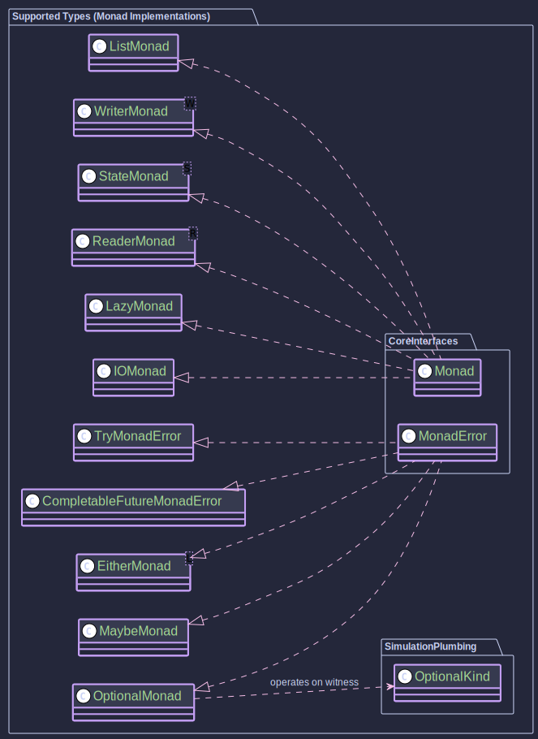

# Java Higher-Kinded Type (HKT) Simulation

This library for Higher-Kinded Types in Java was initially created as a simulation for the blog post [Higher Kinded Types with Java and Scala](https://blog.scottlogic.com/2025/04/11/higher-kinded-types-with-java-and-scala.html) to help illustrate different approaches.

This project demonstrates a technique to simulate Higher-Kinded Types (HKTs) in Java, a feature not natively supported by the language's type system.
It uses a defunctionalisation approach, representing type constructors and type classes as interfaces and objects.

## See [Wiki](docs/home.md) for more details and examples

## Introduction: Abstracting Over Computation in Java

Java's powerful type system excels in many areas, but it lacks native support for Higher-Kinded Types (HKTs). This means we cannot easily write code that abstracts over type constructors like `List<A>`, `Optional<A>`, or `CompletableFuture<A>` in the same way we abstract over the type `A` itself. We can't easily define a generic function that works identically for *any* container or computational context (like List, Optional, Future, IO).

This project tackles that challenge by demonstrating a **simulation of HKTs in Java** using a technique inspired by defunctionalisation. It allows you to define and use common functional abstractions like `Functor`, `Applicative`, and `Monad` (including `MonadError`) in a way that works *generically* across different simulated type constructors.

**Why bother?** This simulation unlocks several benefits:

* **Write Abstract Code:** Define functions and logic that operate polymorphically over different computational contexts (e.g., handle optionality, asynchronous operations, error handling, side effects, or collections using the *same* core logic).
* **Leverage Functional Patterns:** Consistently apply powerful patterns like `map`, `flatMap`, `ap`, `sequence`, `traverse`, and monadic error handling (`raiseError`, `handleErrorWith`) across diverse data types.
* **Build Composable Systems:** Create complex workflows and abstractions by composing smaller, generic pieces, as demonstrated in the included [Order Processing Example](docs/order-walkthrough.md).
* **Understand HKT Concepts:** Provides a practical, hands-on way to understand HKTs and type classes even within Java's limitations.

While this simulation introduces some boilerplate compared to languages with native HKT support, it offers a valuable way to explore these powerful functional programming concepts in Java.

## Core Concepts Explained

The simulation hinges on a few key ideas:

1.  **`Kind<F, A>` Interface:** The cornerstone, simulating the application of a type constructor `F` (like `List`, `Optional`) to a type `A`. Since Java can't express `F<_>` directly as a parameter, `Kind<F, A>` acts as this bridge.
    * `F`: A "witness type" uniquely identifying the constructor (e.g., `ListKind<?>`, `OptionalKind<?>`, `EitherKind<L, ?>`).
    * `A`: The type argument (e.g., `String`, `Integer`).

2.  **Type Classes (`Functor`, `Applicative`, `Monad`, `MonadError`):** Interfaces defining standard operations over the generic context `F`. Implementations exist for each simulated type.
    * `Functor<F>`: Provides `map(A -> B, F<A>) -> F<B>`.
    * `Applicative<F>`: Adds `of(A) -> F<A>` (lifting) and `ap(F<A -> B>, F<A>) -> F<B>` (applying functions within the context). Includes default `mapN` helpers.
    * `Monad<F>`: Adds `flatMap(A -> F<B>, F<A>) -> F<B>` (sequencing).
    * `MonadError<F, E>`: Adds `raiseError(E) -> F<A>` and `handleErrorWith(F<A>, E -> F<A>)` for contexts that have a specific error type `E`.

3.  **Defunctionalisation:** For each simulated type (e.g., `List`), we need:
    * **`Kind` Interface:** e.g., `ListKind<A> extends Kind<ListKind<?>, A>`.
    * **`Holder` Record:** An internal record holding the actual Java type (e.g., `ListHolder` holds `List<A>`).
    * **`KindHelper` Class:** Static `wrap` and `unwrap` methods to bridge `Kind<F, A>` and the underlying Java type (e.g., `ListKindHelper.wrap/unwrap`). The `unwrap` methods now throw `KindUnwrapException` for invalid `Kind` inputs, ensuring robustness.
    * **Type Class Instances:** Concrete implementations (e.g., `ListMonad` implements `Monad<ListKind<?>>`).

## Simulated Types

This simulation provides HKT wrappers and type class instances for:

* `java.util.List` ([`ListKind`](src/main/java/org/higherkindedj/hkt/list/ListKind.java), [`ListMonad`](src/main/java/org/higherkindedj/hkt/list/ListMonad.java))
* `java.util.Optional` ([`OptionalKind`](src/main/java/org/higherkindedj/hkt/optional/OptionalKind.java), [`OptionalMonad`](src/main/java/org/higherkindedj/hkt/optional/OptionalMonad.java) implementing `MonadError<..., Void>`)
* `Maybe` (custom type) ([`MaybeKind`](src/main/java/org/higherkindedj/hkt/maybe/MaybeKind.java), [`MaybeMonad`](src/main/java/org/higherkindedj/hkt/maybe/MaybeMonad.java) implementing `MonadError<..., Void>`)
* `Either<L, R>` (custom type) ([`EitherKind`](src/main/java/org/higherkindedj/hkt/either/EitherKind.java), [`EitherMonad<L>`](src/main/java/org/higherkindedj/hkt/either/EitherMonad.java) implementing `MonadError<..., L>`)
* `java.util.concurrent.CompletableFuture<T>` ([`CompletableFutureKind`](src/main/java/org/higherkindedj/hkt/future/CompletableFutureKind.java), [`CompletableFutureMonadError`](src/main/java/org/higherkindedj/hkt/future/CompletableFutureMonadError.java) implementing `MonadError<..., Throwable>`)
* `Try<T>` (custom type) ([`TryKind`](src/main/java/org/higherkindedj/hkt/trymonad/TryKind.java), [`TryMonadError`](src/main/java/org/higherkindedj/hkt/trymonad/TryMonadError.java) implementing `MonadError<..., Throwable>`)
* `IO<A>` (custom type) ([`IOKind`](src/main/java/org/higherkindedj/hkt/io/IOKind.java), [`IOMonad`](src/main/java/org/higherkindedj/hkt/io/IOMonad.java)) - For deferred, side-effecting computations.
* `Lazy<A>` (custom type) ([`LazyKind`](src/main/java/org/higherkindedj/hkt/lazy/LazyKind.java), [`LazyMonad`](src/main/java/org/higherkindedj/hkt/lazy/LazyMonad.java)) - For deferred, memoised computations.
* `Reader<R, A>` (custom type) ([`ReaderKind`](src/main/java/org/higherkindedj/hkt/reader/ReaderKind.java), [`ReaderMonad`](src/main/java/org/higherkindedj/hkt/reader/ReaderMonad.java)) - For computations depending on a read-only environment.
* `State<S, A>` (custom type) ([`StateKind`](src/main/java/org/higherkindedj/hkt/state/StateKind.java), [`StateMonad`](src/main/java/org/higherkindedj/hkt/state/StateMonad.java)) - For stateful computations.
* `Writer<W, A>` (custom type) ([`WriterKind`](src/main/java/org/higherkindedj/hkt/writer/WriterKind.java), [`WriterMonad`](src/main/java/org/higherkindedj/hkt/writer/WriterMonad.java)) - For computations that accumulate a log/output (requires `Monoid<W>`).
* `EitherT<F, L, R>` (Monad Transformer) ([`EitherTKind`](src/main/java/org/higherkindedj/hkt/trans/EitherTKind.java), [`EitherTMonad<F, L>`](src/main/java/org/higherkindedj/hkt/trans/EitherTMonad.java)) - For combining an outer monad `F` with an inner `Either`.

*(See individual packages and the [Supported Types](docs/supported-types.md) document for details)*

## Practical Example: Order Processing Workflow

To see these concepts applied in a more realistic scenario, check out the **Order Processing Example** located in `org.simulation.hkt.example.order`.

This example demonstrates:

* Orchestrating an asynchronous workflow using `CompletableFutureMonadError`.
* Handling domain-specific errors using `Either` (wrapped within the future).
* Using the `EitherT` monad transformer to simplify working with the nested `CompletableFuture<Either<DomainError, T>>` structure.
* Integrating synchronous steps (returning `Either` or `Try`) and asynchronous steps seamlessly within the monadic flow.
* Using `MonadError` capabilities for error handling and recovery.
* Managing dependencies (like logging) via injection.

Explore the `OrderWorkflowRunner` class to see how `flatMap` and `handleErrorWith` are used to build the workflow. See the [Order Example Walkthrough](docs/order-walkthrough.md) for a detailed explanation.

## How to Use This Library

If you want to leverage this simulation in your own code:

1.  **Include the Code:** Copy the relevant packages (`org.simulation.hkt` and the packages for the types you need, e.g., `org.simulation.hkt.optional`) into your project's source code.
2.  **Understand the Pattern:** Familiarise yourself with the `Kind` interface, the specific `*Kind` interfaces (e.g., `OptionalKind`), the `*KindHelper` classes (e.g., `OptionalKindHelper`), and the type class instances (e.g., `OptionalMonad`).
3.  **Follow the Usage Guide:** Apply the steps outlined in the [Usage Guide](docs/usage-guide.md) to wrap your Java objects, obtain monad instances, use `map`/`flatMap`/etc., and unwrap the results.
4.  **Extend if Necessary:** If you need HKT simulation for types not included, follow the guide in [Extending Higher-Kinded-J](docs/extending-simulation.md).

**Note:** This simulation adds a layer of abstraction and associated boilerplate. Consider the trade-offs for your specific project needs compared to directly using the underlying Java types or other functional libraries for Java.

## Applying to Your Applications

You can apply the patterns and techniques from this simulation in various ways:

* **Generic Utilities:** Write utility functions that work across different monadic types (e.g., a generic `sequence` function to turn a `List<Kind<F, A>>` into a `Kind<F, List<A>>`).
* **Composable Workflows:** Structure complex business logic, especially involving asynchronous steps and error handling (like the Order Example), in a more functional and composable manner.
* **Managing Side Effects:** Use the `IO` monad to explicitly track and sequence side-effecting operations.
* **Deferred Computation:** Use the `Lazy` monad for expensive computations that should only run if needed.
* **Dependency Injection:** Use the `Reader` monad to manage dependencies cleanly.
* **State Management:** Use the `State` monad for computations that need to thread state through.
* **Logging/Accumulation:** Use the `Writer` monad to accumulate logs or other values alongside a computation.
* **Learning Tool:** Understand HKTs, type classes (Functor, Applicative, Monad), and functional error handling concepts through concrete Java examples.
* **Simulating Custom Types:** Follow the pattern (Kind interface, Holder, Helper, Type Class instances) to make your *own* custom data types or computational contexts work with the provided functional abstractions.

## Limitations

While demonstrating the concept, this simulation approach has inherent limitations in Java compared to languages with native HKTs:

* **Boilerplate:** Requires additional setup code for each simulated type.
* **Verbosity:** Usage often involves explicit wrapping/unwrapping and witness types.
* **Complexity:** Adds cognitive load to understand the simulation mechanism.
* **Type Safety Gaps:** Relies on some internal casting (`unwrap` methods), although the helpers are designed to be robust (throwing `KindUnwrapException` on structural failure).
* **Type Inference:** Java's inference can sometimes need help with the complex generics.

## Project Structure

The code is organized into packages:

* `org.simulation.hkt`: Core interfaces (`Kind`, `Functor`, `Applicative`, `Monad`, `MonadError`).
* `org.simulation.hkt.list`: Components for `List` simulation.
* `org.simulation.hkt.optional`: Components for `Optional` simulation.
* `org.simulation.hkt.maybe`: Components for `Maybe` simulation and the `Maybe` type itself.
* `org.simulation.hkt.either`: Components for `Either` simulation and the `Either` type itself.
* `org.simulation.hkt.future`: Components for `CompletableFuture` simulation.
* `org.simulation.hkt.trymonad`: Components for `Try` simulation and the `Try` type itself.
* `org.simulation.hkt.io`: Components for `IO` simulation and the `IO` type itself.
* `org.simulation.hkt.lazy`: Components for `Lazy` simulation and the `Lazy` type itself.
* `org.simulation.hkt.reader`: Components for `Reader` simulation and the `Reader` type itself.
* `org.simulation.hkt.state`: Components for `State` simulation and the `State` type itself.
* `org.simulation.hkt.writer`: Components for `Writer` simulation and the `Writer` type itself.
* `org.simulation.hkt.trans`: Monad Transformer (`EitherT`) components.
* `org.simulation.hkt.function`: Helper functional interfaces (`Function3`, `Function4`).
* `org.simulation.hkt.exception`: Custom exceptions like `KindUnwrapException`.
* `org.simulation.hkt.typeclass`: Supporting type classes like `Monoid`.
* `org.simulation.example.order`: A practical example demonstrating an order processing workflow.
* `org.simulation.hkt.MonadSimulation`: Contains executable examples demonstrating basic usage.

## Contributing

Contributions to this project are very welcome! Whether it's adding new features, improving existing code, or enhancing documentation, your help is GREATLY appreciated. See [CONTRIBUTING.md](CONTRIBUTING.md) for details.

**Areas for Contribution:**

* **Simulate More Types:** Add HKT simulations and type class instances for other common Java types (e.g., `Stream`, `java.time` types) or functional concepts.
* **Implement More Type Classes:** Add implementations for other useful type classes like `Traverse`, `Semigroup`, etc., where applicable.
* **Enhance Existing Implementations:** Improve performance, clarity, or robustness of the current simulations and type class instances.
* **Add Examples:** Create more diverse examples showcasing different use cases for the HKT simulation.
* **Improve Documentation:** Clarify concepts, add diagrams, or improve the Wiki/README.
* **Refactor with New Java Features:** Explore opportunities to use features like Structured Concurrency, updated Pattern Matching, etc., to improve the simulation or examples.
* **Testing:** Increase test coverage, particularly for type class laws and edge cases.

**How to Contribute:**

1.  **Fork the Repository:** Create your own fork of the project on GitHub.
2.  **Create a Branch:** Make your changes in a dedicated branch (e.g., `feature/add-stream-kind`, `fix/optional-monad-bug`).
3.  **Develop:** Implement your changes or fixes.
4.  **Add Tests:** Ensure your changes are well-tested. Verify that existing tests pass.
5.  **Commit:** Make clear, concise commit messages.
6.  **Push:** Push your branch to your fork.
7.  **Submit a Pull Request:** Open a Pull Request (PR) from your branch to the `main` branch of the original repository. Describe your changes clearly in the PR description.

If you're unsure where to start or want to discuss an idea, feel free to open a GitHub Issue first.