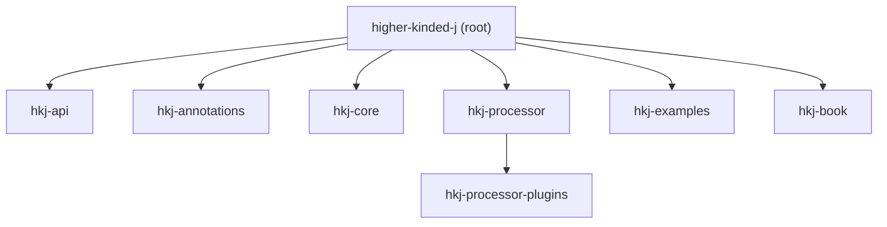

```
 _   _ _       _                      _   ___           _          _        ___ 
| | | (_)     | |                    | | / (_)         | |        | |      |_  |
| |_| |_  __ _| |__   ___ _ __ ______| |/ / _ _ __   __| | ___  __| |______  | |
|  _  | |/ _` | '_ \ / _ \ '__|______|    \| | '_ \ / _` |/ _ \/ _` |______| | |
| | | | | (_| | | | |  __/ |         | |\  \ | | | | (_| |  __/ (_| |    /\__/ /
\_| |_/_|\__, |_| |_|\___|_|         \_| \_/_|_| |_|\__,_|\___|\__,_|    \____/ 
          __/ |                                                             
         |___/                                                              
```

## _Bringing Higher-Kinded Types and Optics to Java functional patterns_

[
](https://github.com/higher-kinded-j/higher-kinded-j)
[](https://codecov.io/gh/higher-kinded-j/higher-kinded-j) [](https://central.sonatype.com/artifact/io.github.higher-kinded-j/hkj-core)  [](https://github.com/higher-kinded-j/higher-kinded-j/discussions) [](https://techhub.social/@ultramagnetic)


This project demonstrates a technique to simulate *Higher-Kinded Types (HKTs)* and implement *Optics* in Java, a feature not natively supported by the language's type system.
It uses a defunctionalisation approach for HKTs and provides a powerful toolkit for immutable data manipulation with Optics.

## Where to start

**[All the details you need to get started with Higher-Kinded-J can be found here](https://higher-kinded-j.github.io/home.html)**

## Introduction: Abstracting over Computation and Structure

### Higher-Kinded Types (HKTs)

Java's powerful type system excels in many areas, but it lacks native support for HKTs. This means we cannot easily write code that abstracts over type constructors like `List<A>`, `Optional<A>`, or `CompletableFuture<A>`. This project tackles that challenge by **simulating HKTs in Java**, allowing you to use common functional abstractions like `Functor`, `Applicative`, and `Monad` across different type constructors.

### Optics

Working with nested immutable data structures in Java can be verbose and tedious. Optics provide a solution by offering a principled way to access and modify parts of a larger structure. They are composable getters and setters that allow you to "focus" on a specific piece of data within a nested object graph and perform operations on it without boilerplate. This library uses an annotation processor to generate the necessary Optics for your data classes automatically.

## Applying to Your Applications

You can apply the patterns and techniques from Higher-Kinded-J in many ways:

* **Generic Utilities:** Write utility functions that work across different monadic types (e.g., a generic `sequence` function).
* **Composable Workflows:** Structure complex business logic, especially involving asynchronicity and error handling, in a more functional way.
* **Immutable Data Manipulation:** Use **Optics (Lens, Prism, Traversal)** to simplify updates to nested immutable objects, reducing boilerplate and errors.
* **Managing Side Effects:** Use the `IO` monad to explicitly track and sequence side-effecting operations.
* **Dependency Injection:** Use the `Reader` monad to manage dependencies cleanly.
* **State Management:** Use the `State` monad for computations that need to thread state through.
* **Learning Tool:** Understand HKTs, type classes, and Optics through concrete Java examples.


## Practical Example: Order Processing Workflow

To see HKT concepts applied in a realistic scenario, check out the **Order Processing Example** located in the `higher-kinded-j-example` module.

This example demonstrates:

* Orchestrating an asynchronous workflow using `CompletableFutureMonad`.
* Handling domain-specific errors using `Either`.
* Using the `EitherT` monad transformer to simplify working with nested `CompletableFuture<Either<DomainError, T>>`.
* Integrating synchronous and asynchronous steps seamlessly within a monadic flow.

Explore the `OrderWorkflowRunner` class to see how `flatMap` and `handleErrorWith` are used to build the workflow.

See the [Order Processing Example_Walkthrough](https://higher-kinded-j.github.io/order-walkthrough.html). for a detailed explanation.

## Practical Example: Optics for Data Manipulation

The `higher-kinded-j-example` module also contains examples of how to use **Optics**. See the `OpticsExample` class for demonstrations of:

* **Lens:** Focusing on a field within a product type (e.g., a class).
* **Prism:** Focusing on a case within a sum type (e.g., a sealed interface).
* **Composition:** Combining Optics to drill down into nested structures.

For instance, you can update a deeply nested field in an immutable object with a single, elegant expression:

```java
  @GenerateLenses
  public record Player(String name, int score) {}

  @GenerateLenses
  @GenerateTraversals // Generates a Traversal for the List<Player>
  public record Team(String name, List<Player> players) {}

  @GenerateLenses
  @GenerateTraversals // Generates a Traversal for the List<Team>
  public record League(String name, List<Team> teams) {}
  
  // Get the generated Traversals and Lenses
  Traversal<League, Team> leagueToTeams = LeagueTraversals.teams();
  Traversal<Team, Player> teamToPlayers = TeamTraversals.players();
  Lens<Player, Integer> playerToScore = PlayerLenses.score();
  
  // Compose them to create a single, deep traversal.
  // The path is: League -> each Team -> each Player -> score
  Traversal<League, Integer> leagueToAllPlayerScores =
  leagueToTeams.andThen(teamToPlayers).andThen(playerToScore);
```
[Full Example](https://github.com/higher-kinded-j/higher-kinded-j/blob/main/hkj-examples/src/main/java/org/higherkindedj/example/optics/TraversalUsageExample.java)

## Requirements

* **Java Development Kit (JDK): Version 24** or later.
* Gradle (the project includes a Gradle wrapper).

## How to Use This Library

The project is modular. To use it, add the relevant dependencies to your `build.gradle` or `pom.xml`. The use of an annotation processor helps to automatically generate the required boilerplate for Optics and other patterns.

**For HKTs:**

```gradle
// build.gradle.kts
    implementation("io.github.higher-kinded-j:hkj-core:LATEST_VERSION")
```

* **Follow the Usage Guides:** Apply the steps outlined in the [Usage Guide](https://higher-kinded-j.github.io/usage-guide.html) to wrap your Java objects for HKT operations or to define and use Optics for your data models.
* **Extend if Necessary:** Follow the guide [Extending Higher-Kinded-J](https://higher-kinded-j.github.io/extending-simulation.html) in the documentation to create your own HKT simulations or Optics for custom types.

**For Optics:**

```gradle
// build.gradle.kts
    implementation("io.github.higher-kinded-j:hkj-core:LATEST_VERSION")
    annotationProcessor("io.github.higher-kinded-j:hkj-processor:LATEST_VERSION")
    annotationProcessor("io.github.higher-kinded-j:hkj-processor-plugins:LATEST_VERSION")
```


**For SNAPSHOTS:**

```gradle
repositories {
    mavenCentral()
    maven {
        url= uri("https://central.sonatype.com/repository/maven-snapshots/")
    }
}
```

* **Annotate your data classes:** Use the provided annotations (e.g., `@optics`) on your immutable classes.
* **Build your project:** The annotation processor will generate the corresponding `Lens` and `Prism` implementations for you.
* **Use the generated Optics:** Import and use the generated optics classes to manipulate your data structures in a clean, functional, and immutable way.

## 

**Note:** This simulation adds a layer of abstraction and associated boilerplate. Consider the trade-offs for your specific project needs compared to directly using the underlying Java types or other functional libraries for Java.

## Limitations

While useful the approach to simulating Higher-Kinded Types has some inherent limitations in Java compared to languages with native HKTs:

* **Boilerplate:** HKTs Require additional setup code for each simulated type. Optics also require definitions, though they significantly reduce boilerplate at the usage site.
* **Verbosity:** Usage often involves explicit wrapping/unwrapping and witness types.
* **Complexity:** Adds cognitive load to understand the simulation mechanism.
* **Type Safety Gaps:** Relies on some internal casting (`unwrap` methods), although the helpers are designed to be robust (throwing `KindUnwrapException` on structural failure).
* **Type Inference:** Java's inference can sometimes need help with the complex generics.

## Project Structure




### Folder Structure:

* **hkj-api**: Defines the public API, including core interfaces for HKTs and Optics.
* **hkj-annotations**: Contains the Java annotations used for code generation.
* **hkj-core**: The core module containing the main implementation of the HKT and Optics patterns.
* **hkj-processor**: The annotation processor that generates boilerplate code.
* **hkj-processor-plugins**: Extensible plugins for the annotation processor.
* **hkj-examples**: A collection of examples demonstrating how to use the library.
* **hkj-book**: Contains the project's documentation, built with `mdbook`.

### Code Structure

The code is organized into a multi-module structure to ensure clear separation of concerns:

* **`org.higherkindedj.api`**: Defines the public API, including core functional interfaces and optics intended for developers using the library.
  * `org.higherkindedj.optics`: Core Optics interfaces (`Lens`, `Prism`, `Traversal`, etc.) and their
  * `org.higherkindedj.hkt`: Core interfaces (`Kind`, `Functor`, `Monad`, etc.).
* **`org.higherkindedj.core`**: The core HKT/Optics module.
  * `org.higherkindedj.hkt.*`: HKT simulations for various types (`Either`, `List`, `Optional`, `IO`, etc.) and Monad Transformers.
  * `org.higherkindedj.optics`: Some utils for Optics
* **`higher-kinded-j-annotations`**: Contains the Java annotations  that you use to mark your code for processing.
  * `org.higherkindedj.optics.annotations`: (e.g., `@GeneratePrisms, @GenrateTraversals, @GenerateLenses`)
* **`higher-kinded-j-processor`**: The main annotation processor. It scans for annotations from the `annotations` module and generates the required boilerplate code (e.g., Optics implementations).
* **`higher-kinded-j-processor-plugins`**: Contains plugins for the annotation processor, providing Traversal support for many types by defining generators

### Code Examples

* **`org.higherkindedj.examples`**: Practical examples demonstrating how to use the libraries.
  * `org.higherkindedj.example.basic`: Examples demonstrating basic HKT usage.
  * `org.higherkindedj.example.optics`: Examples showing how to use the generated Optics.
  * `org.higherkindedj.example.draughts`: A Draughts game showcasing various HKT features.
  * `org.higherkindedj.example.order`: An Order workflow showcasing various HKT features.

### History
**Higher-Kinded-J evolved from a simulation** that was originally created for the blog post [Higher Kinded Types with Java and Scala](https://blog.scottlogic.com/2025/04/11/higher-kinded-types-with-java-and-scala.html) that explored Higher-Kinded types and their lack of support in Java. The blog post discussed a process called defuctionalisation that could be used to simulate Higher-Kinded types in Java. Since then Higher-Kinded-J has grown into something altogether more useful supporting more functional patterns.


## Contributing

Contributions to this project are very welcome! Whether it's adding new features, improving existing code, or enhancing documentation, your help is GREATLY appreciated. See [CONTRIBUTING.md](CONTRIBUTING.md) for details.

**Areas for Contribution:**

* **Improve Annotation Processor:** Enhance the code generation capabilities to support more patterns or edge cases.
* **Simulate More Types:** Add HKT simulations and type class instances for other common Java types (e.g., `Stream`, `java.time` types) or functional concepts.
* **Implement More Type Classes:** Add implementations for other useful type classes like `Traverse`, `Semigroup`, etc., where applicable.
* **Enhance Existing Implementations:** Improve performance, clarity, or robustness of the current simulations and type class instances.
* **Add Examples:** Create more diverse examples showcasing different use cases of Higher-Kinded Type simulation.
* **Improve Documentation:** Clarify concepts, add tutorials, or improve the hkj-book/README.
* **Refactor with New Java Features:** Explore opportunities to use features like Structured Concurrency, etc., to improve the simulation or examples.
* **Testing:** Increase test coverage, particularly for type class laws and edge cases.

**How to Contribute:**

1. **Fork the Repository:** Create your own fork of the project on GitHub.
2. **Create a Branch:** Make your changes in a dedicated branch (e.g., `feature/add-stream-kind`, `fix/optional-monad-bug`).
3. **Develop:** Implement your changes or fixes.
4. **Add Tests:** Ensure your changes are well-tested. Verify that existing tests pass.
5. **Commit:** Make clear, concise commit messages.
6. **Push:** Push your branch to your fork.
7. **Submit a Pull Request:** Open a Pull Request (PR) from your branch to the `main` branch of the original repository. Describe your changes clearly in the PR description.

If you're unsure where to start or want to discuss an idea, feel free to open a GitHub Issue first.
