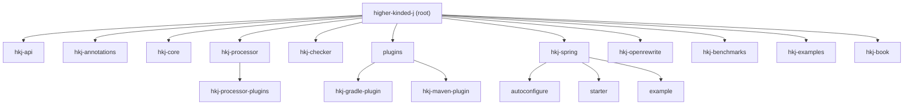

<p align="center">
  <picture>
    <source media="(prefers-color-scheme: dark)" srcset="hkj-book/logos/HKJ%20Logo_05_Dark%20Theme.png">
    <source media="(prefers-color-scheme: light)" srcset="hkj-book/logos/HKJ%20Logo_05_Light%20Theme.png">
    
  </picture>
</p>

<h2 align="center" style="text-transform: uppercase; font-style: normal; font-weight: lighter; font-size: x-large; margin: 2em 0;">Unifying Composable Effects and Advanced Optics for Java</h2>

<div align="center">
  <a href="https://github.com/higher-kinded-j/higher-kinded-j"></a>
  <a href="https://codecov.io/gh/higher-kinded-j/higher-kinded-j"></a>
  <a href="https://central.sonatype.com/artifact/io.github.higher-kinded-j/hkj-core"></a>
  <a href="https://central.sonatype.com/repository/maven-snapshots/io/github/higher-kinded-j/hkj-core/"></a>
  <a href="https://github.com/higher-kinded-j/higher-kinded-j/discussions"></a>
  <a href="https://techhub.social/@ultramagnetic"></a>
</div>


Higher-Kinded-J brings two capabilities that Java has long needed: composable error handling through the **[Effect Path API](https://higher-kinded-j.github.io/latest/effect/effect_path_overview.html)**, and type-safe immutable data navigation through the **[Focus DSL](https://higher-kinded-j.github.io/latest/optics/focus_dsl.html)**. Each is powerful alone. Together, they form a unified approach to building robust applications, where effects and structure compose seamlessly. For services that need multiple execution modes, **[Effect Handlers](https://higher-kinded-j.github.io/latest/effect/effect_handlers_intro.html)** let you define domain operations as data and interpret them differently for production, testing, or audit.

No more pyramids of nested checks. No more scattered validation logic. Just clean, flat pipelines that read like the business logic they represent.

## Where to Start

All the details you need to get started with Higher-Kinded-J can be found in the documentation website

**[Read the Documentation](https://higher-kinded-j.github.io/latest/home.html)**

---

## The Problem: Scattered Error Handling

Every Java application battles the same chaos: nulls here, exceptions there, `Optional` when someone remembered. Each approach speaks a different dialect. None compose cleanly.

```java
// Traditional Java: pyramid of nested checks
User user = userRepository.findById(userId);
if (user == null) {
    return OrderResult.error("User not found");
}
try {
    ValidationResult validation = validator.validate(request);
    if (!validation.isValid()) {
        return OrderResult.error(validation.getErrors().get(0));
    }
    // ... more nesting, more checks
} catch (ValidationException e) {
    return OrderResult.error("Validation error: " + e.getMessage());
}
```

## The Solution: Effect Path API

Higher-Kinded-J's **Effect Path API** models computation as a railway: success travels one track, failure travels another. Operations like `map`, `via`, and `recover` work identically across all effect types.

```java
// Effect Path API: flat, composable, readable
public EitherPath<OrderError, Order> processOrder(String userId, OrderRequest request) {
    return Path.maybe(userRepository.findById(userId))
        .toEitherPath(() -> new OrderError.UserNotFound(userId))
        .via(user -> Path.either(validator.validate(request))
            .mapError(OrderError.ValidationFailed::new))
        .via(validated -> Path.tryOf(() -> paymentService.charge(user, amount))
            .toEitherPath(OrderError.PaymentFailed::new))
        .map(payment -> createOrder(user, request, payment));
}
```

The nesting is gone. Failures propagate automatically. The business logic reads top-to-bottom.

---

## The Bridge: Effects Meet Optics

What makes Higher-Kinded-J unique is the seamless integration between **Effect Paths** and the **Focus DSL**. Where Effect Paths navigate *computational effects*, Focus Paths navigate *data structures*. Both use the same vocabulary. Both compose with `via`. And when you need to cross between them, the bridge API connects both worlds.

```
                    THE EFFECT-OPTICS BRIDGE

  EFFECTS DOMAIN                           OPTICS DOMAIN
  ══════════════                           ═════════════

  MaybePath<User>      ────┐         ┌──── FocusPath<User, Address>
  EitherPath<E, User>  ────┤         ├──── AffinePath<User, Email>
  TryPath<Config>      ────┤         ├──── TraversalPath<Team, Player>
  IOPath<Data>         ────┤         └────
  VTaskPath<A>         ────┤
  VStreamPath<A>       ────┤
  ValidationPath<E, A> ────┘
                            │       │
                            ▼       ▼
                       ┌─────────────────┐
                       │  .focus(path)   │
                       │  .toEitherPath  │
                       │  .toMaybePath   │
                       └─────────────────┘
                              │
                              ▼
                    UNIFIED COMPOSITION
                    ════════════════════

  userService.findById(id)        // Effect: fetch
      .focus(UserFocus.address()) // Optics: navigate
      .via(validateAddress)       // Effect: validate
      .focus(AddressFocus.city()) // Optics: extract
      .map(String::toUpperCase)   // Transform
```

```java
// Fetch user (effect) → navigate to address (optics) → validate (effect)
EitherPath<Error, String> result =
    userService.findById(userId)           // EitherPath<Error, User>
        .focus(UserFocus.address())        // EitherPath<Error, Address>
        .focus(AddressFocus.postcode())    // EitherPath<Error, String>
        .via(code -> validatePostcode(code));
```

Effects and structure, composition and navigation, all speaking the same language.

---

## Two Foundations

### [Higher-Kinded Types (HKTs)](https://higher-kinded-j.github.io/latest/hkts/hkt_introduction.html)

Java lacks native support for abstracting over type constructors. Higher-Kinded-J **simulates HKTs** using defunctionalisation, enabling:

* Generic functions that work across `Optional`, `List`, `CompletableFuture`, and custom types
* Type classes like `Functor`, `Applicative`, and `Monad`
* Monad transformers for composing effect stacks

### [Advanced Optics](https://higher-kinded-j.github.io/latest/optics/optics_intro.html)

Higher-Kinded-J provides the most comprehensive optics implementation available for Java. Working with immutable records means verbose "copy-and-update" logic; the Optics library treats data access as first-class values:

* **Complete optic hierarchy:** Lenses, Prisms, Isos, Affines, Traversals, Folds, and Setters
* **Automatic generation** via annotation processor for Java records and sealed interfaces
* **External type import** via `@ImportOptics` for types you don't own (e.g., `java.time.LocalDate`)
* **Spec interfaces** for complex external types with copy strategy annotations (`@ViaBuilder`, `@Wither`, `@ViaCopyAndSet`)
* **Works with popular libraries**: Jackson JsonNode, JOOQ records, Immutables, Lombok, AutoValue, and Protocol Buffers
* **Filtered traversals** for predicate-based focusing within collections
* **Indexed optics** for position-aware transformations
* **Focus DSL** for type-safe, fluent path navigation with seamless bridging into external libraries
* **Custom container types** with automatic `AffinePath` and `TraversalPath` generation via SPI-aware path widening, supporting 23 container types across JDK, Apache Commons, Eclipse Collections, Guava, Vavr, and HKJ native types
* **Effect integration** bridging optics with the Effect Path API

### [Effect Handlers](https://higher-kinded-j.github.io/latest/effect/effect_handlers_intro.html)

For services with complex domain workflows, Higher-Kinded-J provides algebraic-effect-style programming via Free monads and interpreters. Define your domain operations as sealed interfaces with record variants, then write different interpreters for production, testing, dry-run, or audit modes. The same program runs unchanged across all four:

* **`@EffectAlgebra`** annotation processor generates boilerplate (Functor, smart constructors, interpreter skeleton)
* **`@ComposeEffects`** composes multiple operation types into a single program
* **Mock-free testing** via `Id` monad interpreters; no mocking frameworks needed
* **Program inspection** with `ProgramAnalyser` before any side effects execute

---

## Why Higher-Kinded-J?

Higher-Kinded-J offers the most advanced optics implementation in the Java ecosystem, combined with a unified effect system that no other library provides.

| Feature | Higher-Kinded-J | Functional Java | Fugue Optics | Derive4J |
|---------|:--------------:|:---------------:|:------------:|:--------:|
| **Lens** | ✓ | ✓ | ✓ | ✓* |
| **Prism** | ✓ | ✓ | ✓ | ✓* |
| **Iso** | ✓ | ✓ | ✓ | ✗ |
| **Affine/Optional** | ✓ | ✓ | ✓ | ✓* |
| **Traversal** | ✓ | ✓ | ✓ | ✗ |
| **Filtered Traversals** | ✓ | ✗ | ✗ | ✗ |
| **Indexed Optics** | ✓ | ✗ | ✗ | ✗ |
| **Code Generation** | ✓ | ✗ | ✗ | ✓* |
| **External Type Import** | ✓ | ✗ | ✗ | ✗ |
| **Spec Interfaces (Jackson, JOOQ, etc.)** | ✓ | ✗ | ✗ | ✗ |
| **Java Records Support** | ✓ | ✗ | ✗ | ✗ |
| **Sealed Interface Support** | ✓ | ✗ | ✗ | ✗ |
| **Effect Integration** | ✓ | ✗ | ✗ | ✗ |
| **Focus DSL** | ✓ | ✗ | ✗ | ✗ |
| **Profunctor Architecture** | ✓ | ✓ | ✓ | ✗ |
| **Fluent API** | ✓ | ✗ | ✗ | ✗ |
| **Modern Java (21+)** | ✓ | ✗ | ✗ | ✗ |
| **Virtual Threads** | ✓ | ✗ | ✗ | ✗ |
| **Effect Handlers / Free Monads** | ✓ | ✗ | ✗ | ✗ |

*\* Derive4J generates getters/setters but requires Functional Java for actual optic classes*

---

## Path Types at a Glance

| Path Type | When to Use |
|-----------|-------------|
| `MaybePath<A>` | Absence is normal, not an error |
| `EitherPath<E, A>` | Errors carry typed, structured information |
| `TryPath<A>` | Wrapping code that throws exceptions |
| `ValidationPath<E, A>` | Collecting *all* errors, not just the first |
| `IOPath<A>` | Side effects you want to defer and sequence |
| `TrampolinePath<A>` | Stack-safe recursion |
| `CompletableFuturePath<A>` | Async operations |
| `ReaderPath<R, A>` | Dependency injection, configuration access |
| `WriterPath<W, A>` | Logging, audit trails, collecting metrics |
| `WithStatePath<S, A>` | Stateful computations (parsers, counters) |
| `ListPath<A>` | Batch processing with positional zipping |
| `StreamPath<A>` | Lazy sequences, large data processing |
| `NonDetPath<A>` | Non-deterministic search, combinations |
| `LazyPath<A>` | Deferred evaluation, memoisation |
| `IdPath<A>` | Pure computations (testing, generic code) |
| `OptionalPath<A>` | Bridge for Java's standard `Optional` |
| `FreePath<F, A>` / `FreeApPath<F, A>` | DSL building and interpretation |
| `VTaskPath<A>` | Virtual thread-based concurrency with Par combinators |
| `VStreamPath<A>` | Lazy pull-based streaming on virtual threads |

Each Path provides `map`, `via`, `run`, `recover`, and integration with the Focus DSL.

### Optic Path Types

The Focus DSL uses its own path types for navigating data structures:

| Path Type | When to Use |
|-----------|-------------|
| `FocusPath<S, A>` | Direct lens-based field access (always present) |
| `AffinePath<S, A>` | Zero-or-one focus: `Optional`, `@Nullable`, or SPI types such as `Either`, `Try`, `Validated` |
| `TraversalPath<S, A>` | Zero-or-more focus: `List`, `Set`, or SPI types such as `Map` and arrays |

SPI-registered container types are automatically widened to the correct path type via the `TraversableGenerator` SPI. Third-party libraries can register their own container types to participate in path widening.

---

## Practical Examples

### [Order Processing Workflow](https://higher-kinded-j.github.io/latest/hkts/order-walkthrough.html)

See Effect Path and Focus DSL applied in a realistic e-commerce scenario:

* Composing multi-step workflows with `EitherPath` and `via()` chains
* Modelling domain errors with sealed interfaces for exhaustive handling
* Using `ForPath` comprehensions for readable sequential composition
* Implementing resilience patterns: retry policies, timeouts, and recovery
* Integrating Focus DSL for immutable state updates

### [Optics for Data Manipulation](https://higher-kinded-j.github.io/latest/optics/auditing_complex_data_example.html)

```java
@GenerateLenses
public record Player(String name, int score) {}

@GenerateLenses
@GenerateTraversals
public record Team(String name, List<Player> players) {}

@GenerateLenses
@GenerateTraversals
public record League(String name, List<Team> teams) {}

// Compose traversals for deep navigation
Traversal<League, Integer> leagueToAllPlayerScores =
    LeagueTraversals.teams()
        .andThen(TeamTraversals.players())
        .andThen(PlayerLenses.score());

// Filter and modify with predicates
Traversal<League, Player> activePlayers =
    leagueToAllPlayers.filtered(Player::isActive);
```

---

## Requirements

* **Java Development Kit (JDK): Version 25** or later, with `--enable-preview` enabled.
* Gradle (the project includes a Gradle wrapper).

Higher-Kinded-J uses Java preview features. See the [Quickstart Guide](https://higher-kinded-j.github.io/latest/quickstart.html) for full Gradle and Maven configuration including preview flags.

### Version Compatibility

| Higher-Kinded-J | Spring Boot | Jackson | Java |
|-----------------|-------------|---------|------|
| 0.3.x | 4.0.1+ | 3.x (tools.jackson) | 25+ |

The hkj-spring-boot-starter requires Spring Boot 4.0.1 or later with Jackson 3.x (using the `tools.jackson` package namespace).

## How to Use This Library

### Gradle -- With HKJ Plugin (Recommended)

```gradle
// build.gradle.kts
plugins {
    id("io.github.higher-kinded-j.hkj") version "LATEST_VERSION"
}
```

This single line configures dependencies, preview features, annotation processors, and compile-time Path type checking automatically.

For **SNAPSHOT** versions, add the Sonatype snapshots repository to both `pluginManagement` (in `settings.gradle.kts`) and `repositories` (in `build.gradle.kts`):

```gradle
// settings.gradle.kts
pluginManagement {
    repositories {
        maven { url = uri("https://central.sonatype.com/repository/maven-snapshots/") }
        gradlePluginPortal()
        mavenCentral()
    }
}
```

```gradle
// build.gradle.kts
repositories {
    mavenCentral()
    maven { url = uri("https://central.sonatype.com/repository/maven-snapshots/") }
}
```

### Maven -- With HKJ Plugin (Recommended)

```xml
<build>
    <plugins>
        <plugin>
            <groupId>io.github.higher-kinded-j</groupId>
            <artifactId>hkj-maven-plugin</artifactId>
            <version>LATEST_VERSION</version>
            <extensions>true</extensions>
        </plugin>
    </plugins>
</build>
```

The Maven plugin hooks into the build lifecycle to add `hkj-core`, annotation processors, compile-time checks, and `--enable-preview` flags automatically. Configure options in a `<configuration>` block:

```xml
<configuration>
    <preview>true</preview>              <!-- add --enable-preview flags (default: true) -->
    <spring>false</spring>               <!-- add hkj-spring-boot-starter (default: false) -->
    <pathTypeMismatch>true</pathTypeMismatch>  <!-- enable compile-time checks (default: true) -->
</configuration>
```

Run `mvn hkj:diagnostics` to inspect your current HKJ configuration.

### Manual Setup

See the **[Quickstart Guide](https://higher-kinded-j.github.io/latest/quickstart.html)** for manual Gradle and Maven configuration including preview flags and annotation processors.

**For SNAPSHOTS:**

```gradle
repositories {
    mavenCentral()
    maven {
        url = uri("https://central.sonatype.com/repository/maven-snapshots/")
    }
}
```

---

## Spring Boot Integration

The **hkj-spring-boot-starter** brings functional patterns into REST APIs with zero configuration:

```gradle
dependencies {
    implementation("io.github.higher-kinded-j:hkj-spring-boot-starter:LATEST_VERSION")
}
```

```java
@RestController
@RequestMapping("/api/users")
public class UserController {

    @GetMapping("/{id}")
    public Either<DomainError, User> getUser(@PathVariable String id) {
        return userService.findById(id);
        // Right(user) → HTTP 200 with JSON
        // Left(UserNotFoundError) → HTTP 404 with error details
    }

    @PostMapping
    public Validated<List<ValidationError>, User> createUser(@RequestBody UserRequest request) {
        return userService.validateAndCreate(request);
        // Valid(user) → HTTP 200
        // Invalid(errors) → HTTP 400 with ALL validation errors
    }
}
```

Auto-configuration handles Either to HTTP response conversion, error accumulation with Validated, and async operations with CompletableFuturePath.

For complete documentation, see:
- [Spring Boot Integration Guide](https://higher-kinded-j.github.io/latest/spring/spring_boot_integration.html)
- [Migration Guide](https://higher-kinded-j.github.io/latest/spring/migrating_to_functional_errors.html)

---

## Learn by Doing

Twelve interactive tutorial journeys with hands-on exercises:

| Journey | Focus | Exercises |
|---------|-------|-----------|
| [Core: Foundations](https://higher-kinded-j.github.io/latest/tutorials/coretypes/foundations_journey.html) | HKT simulation, Functor, Monad | 24 |
| [Effect API](https://higher-kinded-j.github.io/latest/tutorials/effect/effect_journey.html) | Effect paths, ForPath, Contexts | 15 |
| [Concurrency: VTask](https://higher-kinded-j.github.io/latest/tutorials/concurrency/vtask_journey.html) | Virtual threads, VTaskPath, Par | 16 |
| [Optics: Focus DSL](https://higher-kinded-j.github.io/latest/tutorials/optics/focus_dsl_journey.html) | Type-safe path navigation | 29 |

[View all tutorials →](https://higher-kinded-j.github.io/latest/tutorials/tutorials_intro.html)

---

## Project Structure


```mermaid
graph TD;
    root["higher-kinded-j (root)"] --> hkj_api["hkj-api"];
    root --> hkj_annotations["hkj-annotations"];
    root --> hkj_core["hkj-core"];
    root --> hkj_processor["hkj-processor"];
    hkj_processor --> hkj_processor_plugins["hkj-processor-plugins"];
    root --> hkj_checker["hkj-checker"];
    root --> plugins["plugins"];
    plugins --> hkj_gradle_plugin["hkj-gradle-plugin"];
    plugins --> hkj_maven_plugin["hkj-maven-plugin"];
    root --> hkj_spring["hkj-spring"];
    hkj_spring --> hkj_spring_autoconfigure["autoconfigure"];
    hkj_spring --> hkj_spring_starter["starter"];
    hkj_spring --> hkj_spring_example["example"];
    root --> hkj_openrewrite["hkj-openrewrite"];
    root --> hkj_benchmarks["hkj-benchmarks"];
    root --> hkj_examples["hkj-examples"];
    root --> hkj_book["hkj-book"];
```

* **hkj-api**: Public API for HKTs and Optics
* **hkj-annotations**: Annotations for code generation (`@GenerateLenses`, etc.)
* **hkj-core**: Core implementation of HKT simulation, Effect Path API, and Optics
* **hkj-processor**: Annotation processor for generating boilerplate
* **hkj-processor-plugins**: Extensible plugins for code generation
* **hkj-checker**: Javac compiler plugin for compile-time Path type mismatch detection
* **hkj-gradle-plugin**: Gradle plugin for one-line project setup
* **hkj-maven-plugin**: Maven plugin for automated build configuration
* **hkj-spring**: Spring Boot integration (autoconfigure, starter, example)
* **hkj-openrewrite**: OpenRewrite recipes for automated migrations
* **hkj-benchmarks**: JMH benchmarks for performance testing
* **hkj-examples**: Examples demonstrating all features
* **hkj-book**: Documentation built with mdbook

---

## Limitations

While powerful, the HKT simulation has inherent trade-offs:

* **Boilerplate:** Requires setup code for each simulated type
* **Verbosity:** Usage involves explicit wrapping/unwrapping
* **Type Inference:** Java's inference sometimes needs help with complex generics

The Effect Path API significantly reduces this friction by providing a consistent, fluent interface.

---

## History

**Higher-Kinded-J evolved from a simulation** originally created for the blog post [Higher Kinded Types with Java and Scala](https://blog.scottlogic.com/2025/04/11/higher-kinded-types-with-java-and-scala.html). Since then it has grown into a comprehensive functional programming toolkit, with the Effect Path API providing the unifying layer that connects HKTs, type classes, and optics into a coherent whole.

---

## Contributing

Contributions are very welcome! See [CONTRIBUTING.md](CONTRIBUTING.md) for details.

**Areas for Contribution:**

* Enhance the Effect Path API with new patterns and Path types
* Improve annotation processor capabilities
* Add HKT simulations for more Java types
* Extend optics with new combinators
* Create more examples and tutorials
* Improve documentation

**How to Contribute:**

1. Fork the repository
2. Create a feature branch
3. Implement and test your changes
4. Submit a Pull Request

If you're unsure where to start, feel free to open a GitHub Issue first.
