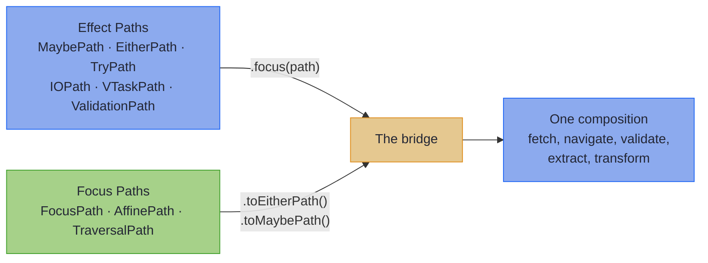
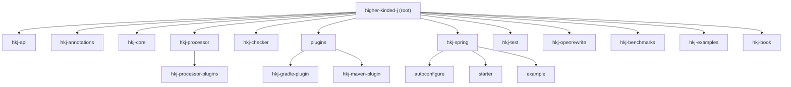

<p align="center">
  <picture>
    <source media="(prefers-color-scheme: dark)" srcset="hkj-book/logos/HKJ%20Logo_05_Dark%20Theme.png">
    <source media="(prefers-color-scheme: light)" srcset="hkj-book/logos/HKJ%20Logo_05_Light%20Theme.png">
    
  </picture>
</p>

<h2 align="center" style="text-transform: uppercase; font-style: normal; font-weight: lighter; font-size: x-large; margin: 2em 0;">Unifying Composable Effects and Advanced Optics for Java</h2>

<div align="center">
  <a href="https://github.com/higher-kinded-j/higher-kinded-j"></a>
  <a href="https://codecov.io/gh/higher-kinded-j/higher-kinded-j"></a>
  <a href="https://central.sonatype.com/artifact/io.github.higher-kinded-j/hkj-core"></a>
  <a href="https://central.sonatype.com/repository/maven-snapshots/io/github/higher-kinded-j/hkj-core/"></a>
  <a href="https://github.com/higher-kinded-j/higher-kinded-j/discussions"></a>
  <a href="https://techhub.social/@ultramagnetic"></a>
</div>


Higher-Kinded-J brings two capabilities that Java has long needed: composable error handling through the **[Effect Path API](https://higher-kinded-j.github.io/latest/effect/ch_intro.html)**, and type-safe immutable data navigation through the **[Focus DSL](https://higher-kinded-j.github.io/latest/optics/focus_dsl.html)**. Each is powerful alone. Together they form one approach to building robust applications, where effects and structure compose in the same vocabulary. At the edge of a service, **[Mapping at the Boundary](https://higher-kinded-j.github.io/latest/mapping/ch_intro.html)** turns the DTO-to-domain mapper into compile-time codegen that never loses an error.

No more pyramids of nested checks. No more scattered validation logic. Just clean, flat pipelines that read like the business logic they represent.

**[Read the Documentation →](https://higher-kinded-j.github.io/latest/home.html)**

---

## What You Get

Two artefacts, before any theory. The first is the shape of the code you write. Every Java application battles the same chaos (nulls here, exceptions there, `Optional` when someone remembered), and none of it composes:

```java
// Traditional Java: pyramid of nested checks
User user = userRepository.findById(userId);
if (user == null) {
    return OrderResult.error("User not found");
}
try {
    ValidationResult validation = validator.validate(request);
    if (!validation.isValid()) {
        return OrderResult.error(validation.getErrors().get(0));
    }
    // ... more nesting, more checks
} catch (ValidationException e) {
    return OrderResult.error("Validation error: " + e.getMessage());
}
```

The **Effect Path API** models computation as a railway: success travels one track, failure travels the other, and `map`, `via` and `recover` work identically across every effect type:

```java
// Effect Path API: flat, composable, readable
public EitherPath<OrderError, Order> processOrder(String userId, OrderRequest request) {
    return Path.maybe(userRepository.findById(userId))
        .toEitherPath(new OrderError.UserNotFound(userId))
        .via(user -> Path.either(validator.validate(request))
            .mapError(OrderError.ValidationFailed::new))
        .via(validated -> Path.tryOf(() -> paymentService.charge(user, amount))
            .toEitherPath(OrderError.PaymentFailed::new))
        .map(payment -> createOrder(user, request, payment));
}
```

The second is what a client sees when the data is bad. One spec interface and one annotation derive a DTO-to-domain mapper in both directions, and the fallible direction reports **every** bad field at once, each located by path. Here is a request with five defects, one inside a nested record and one on the second element of a list, answered by a single 422:

```json
{
  "valid": false,
  "errors": [
    { "path": "id",             "message": "not a UUID (expected e.g. 123e4567-e89b-12d3-a456-426614174000)" },
    { "path": "customer.email", "message": "not an email address" },
    { "path": "lines.1.price",  "message": "not a number in plain notation (expected e.g. 123.45)" },
    { "path": "placedAt",       "message": "not an ISO-8601 instant (expected e.g. 2026-07-28T12:34:56Z)" },
    { "path": "status",         "message": "unknown OrderStatus (expected one of NEW, PAID, SHIPPED)" }
  ],
  "errorCount": 5
}
```

Nobody wrote a line of error-handling code to produce it. The [mapping capstone](https://higher-kinded-j.github.io/latest/mapping/capstone.html) builds it end to end, proven by a test the build runs.

---

## Getting Started

### Requirements

* **JDK 25** or later, with `--enable-preview`. Higher-Kinded-J uses Java preview features.
* Gradle or Maven. The build plugins below configure everything; [Manual Gradle and Maven Setup](https://higher-kinded-j.github.io/latest/tooling/manual_setup.html) covers projects that cannot apply them.

| Higher-Kinded-J | Spring Boot | Jackson | Java |
|-----------------|-------------|---------|------|
| 0.4.x | 4.1.0+ | 3.x (`tools.jackson`) | 25+ |

### Gradle

```gradle
// build.gradle.kts
plugins {
    id("io.github.higher-kinded-j.hkj") version "LATEST_VERSION"
}
```

One line configures the dependencies, the annotation processors, `-parameters`, the preview flags and compile-time Path type checking.

### Maven

```xml
<build>
    <plugins>
        <plugin>
            <groupId>io.github.higher-kinded-j</groupId>
            <artifactId>hkj-maven-plugin</artifactId>
            <version>LATEST_VERSION</version>
            <extensions>true</extensions>
        </plugin>
    </plugins>
</build>
```

The Maven plugin hooks into the build lifecycle the same way; `mvn hkj:diagnostics` inspects the resulting configuration, and a `<configuration>` block toggles `preview`, `spring` and `pathTypeMismatch`.

For **SNAPSHOT** versions, add `https://central.sonatype.com/repository/maven-snapshots/` to both `pluginManagement` (in `settings.gradle.kts`) and `repositories`.

Then follow the **[Quickstart](https://higher-kinded-j.github.io/latest/quickstart.html)** for your first Effect Paths in five minutes, or **[Where to Start](https://higher-kinded-j.github.io/latest/where_to_start.html)** to pick the tool for the problem in front of you.

---

## The Bridge: Effects Meet Optics

What makes Higher-Kinded-J unique is that **Effect Paths** and the **Focus DSL** speak the same language. Where Effect Paths navigate *computational effects*, Focus Paths navigate *data structures*. Both compose with `via`, and when you need to cross between them, the bridge connects the two worlds:


```mermaid
flowchart LR
    E["Effect Paths<br/>MaybePath · EitherPath · TryPath<br/>IOPath · VTaskPath · ValidationPath"] -->|".focus(path)"| B["The bridge"]
    O["Focus Paths<br/>FocusPath · AffinePath · TraversalPath"] -->|".toEitherPath()<br/>.toMaybePath()"| B
    B --> U["One composition<br/>fetch, navigate, validate,<br/>extract, transform"]

    classDef effect fill:#8caaee,stroke:#1e66f5,color:#232634
    classDef optic fill:#a6d189,stroke:#40a02b,color:#232634
    classDef bridge fill:#e5c890,stroke:#df8e1d,color:#232634
    class E,U effect
    class O optic
    class B bridge
```

```java
// Fetch user (effect) → navigate to address (optics) → validate (effect)
EitherPath<Error, String> result =
    userService.findById(userId)           // EitherPath<Error, User>
        .focus(UserFocus.address())        // EitherPath<Error, Address>
        .focus(AddressFocus.postcode())    // EitherPath<Error, String>
        .via(code -> validatePostcode(code));
```

Effects and structure, composition and navigation, one vocabulary. **[Discover Optics Integration →](https://higher-kinded-j.github.io/latest/effect/focus_integration.html)**

---

## What's in the Library

* **[Effect Path API](https://higher-kinded-j.github.io/latest/effect/ch_intro.html)**: one railway vocabulary across absence, typed errors, exceptions, accumulating validation, deferred I/O and virtual-thread concurrency; `ForPath` comprehensions; and [path-native resilience](https://higher-kinded-j.github.io/latest/resilience/ch_intro.html) (`withRetry` / `withTimeout` / `withCircuitBreaker` / `withBulkhead`) that treats a business `Left` as a value, never as a failure to retry. See the [path types at a glance](https://higher-kinded-j.github.io/latest/home.html#path-types-at-a-glance).
* **[Optics](https://higher-kinded-j.github.io/latest/optics/ch_intro.html)**: the most comprehensive optics implementation available for Java. Write a record, add `@GenerateLenses` and `@GenerateFocus`, and the processor writes a typed path builder: `UserFocus.address().street().name().set("New Street", user)`. Lenses, prisms, isos, affines, traversals, folds and setters; sealed types, collections and [types you don't own](https://higher-kinded-j.github.io/latest/optics/importing_optics.html) (Jackson, JOOQ, Immutables, Lombok, AutoValue, Protocol Buffers); filtered and indexed traversals; and [31 container types](https://higher-kinded-j.github.io/latest/optics/focus_containers.html) widening to the right path type automatically.
* **[Mapping at the Boundary](https://higher-kinded-j.github.io/latest/mapping/ch_intro.html)**: `@GenerateMapping` derives both directions for record, bean-shaped and generic wires of any width (a total `build`, an accumulating `parse` that locates every bad field, both PATCH styles), with a [stock codec vocabulary](https://higher-kinded-j.github.io/latest/mapping/codecs.html#standard-codecs) (`uuid`, `localDate`, `instant`, `enumByName`, `bigDecimal`, ...) so a typical boundary needs no hand-written leaves. `@GenerateMerge` and `@GenerateErrorEnvelope` alongside. Every tier is law-checked and pinned by golden files.
* **[Effect Handlers](https://higher-kinded-j.github.io/latest/effect/effect_handlers_intro.html)**: define domain operations as data with `@EffectAlgebra`, compose them with `@ComposeEffects`, and interpret the same program for production, testing, dry-run or audit. Mock-free testing via `Id` interpreters; `ProgramAnalyser` inspects a program before any side effect runs.
* **[Testing with hkj-test](https://higher-kinded-j.github.io/latest/tooling/test_assertions.html)**: fluent AssertJ assertions for every type in the library (`assertThatEither(result).isRight().hasRight(42)`), the optic and mapping laws for your own types, and a `SteppableClock` for deterministic time. `import module org.higherkindedj.test;` brings it all into scope.
* **[Foundations](https://higher-kinded-j.github.io/latest/hkts/foundations_intro.html)**: a simulation of higher-kinded types by defunctionalisation (`Functor`, `Applicative`, `Monad` and friends written once across `Optional`, `List`, `CompletableFuture`, `VTask` and your own types), plus the core types and the [monad transformers and MTL capabilities](https://higher-kinded-j.github.io/latest/transformers/ch_intro.html) for the cases the Path API does not fit. Most applications start with Effect Paths and never look down here.

---

## Spring Boot

The **hkj-spring-boot-starter** lets controllers return functional types directly, with zero configuration:

```gradle
dependencies {
    implementation("io.github.higher-kinded-j:hkj-spring-boot-starter:LATEST_VERSION")
}
```

```java
@RestController
@RequestMapping("/api/users")
public class UserController {

    @GetMapping("/{id}")
    public Either<DomainError, User> getUser(@PathVariable String id) {
        return userService.findById(id);
        // Right(user) → HTTP 200 with JSON
        // Left(UserNotFoundError) → HTTP 404 with error details
    }

    @PostMapping
    public Validated<NonEmptyList<FieldError>, User> createUser(@RequestBody UserDto dto) {
        return userCodec.parse(dto);
        // Valid(user) → HTTP 200
        // Invalid(errors) → one HTTP 422 listing EVERY bad field by path
    }
}
```

When one service calls another, `@HkjHttpClient` generates a declarative client that returns Effect Paths and decodes the response back into a typed error, so the error channel survives the network hop:

```java
@HttpExchange("/users")
@HkjHttpClient
public interface UserClientApi {

    @GetExchange("/{id}")
    EitherPath<DomainError, User> getUser(@PathVariable String id);
    // HTTP 200 → Right(user); HTTP 404 → Left(UserNotFoundError), decoded from the response
}
```

See [Spring Boot Integration](https://higher-kinded-j.github.io/latest/spring/spring_boot_integration.html), [Declarative HTTP Clients](https://higher-kinded-j.github.io/latest/spring/declarative_http_clients.html) and the [Migration Guide](https://higher-kinded-j.github.io/latest/spring/migrating_to_functional_errors.html).

---

## Why Higher-Kinded-J?

Modern Java handed you records, sealed interfaces, and pattern matching. What it didn't hand you is a way to make them *compose*: errors that chain instead of nest, validation that collects every failure instead of stopping at the first, deep immutable updates in one line instead of nested `with…` calls, and typed errors that survive a network hop. Higher-Kinded-J is the missing layer, and each capability replaces something you already reach for today:

| Instead of… | Today you reach for | Higher-Kinded-J gives you |
|-------------|---------------------|---------------------------|
| Nested `Optional`, thrown exceptions, and validation that stops at the first error | the standard library | one railway vocabulary (`map` / `via` / `recover`) across absence, typed errors, async, and **accumulating** validation |
| `Option` / `Either` / `Try` from **Vavr** | the FP library most Java developers know | the same core types **plus** higher-kinded abstraction, a full optics suite, monad transformers, and an effect system, built natively on modern Java (records, sealed types, virtual threads), where Vavr keeps a Java 8 foundation |
| Hand-written DTO↔domain mappers and validation glue | custom converter classes per pair | `@GenerateMapping` over record, bean-shaped and generic wires: a total `build`, an accumulating `parse` that reports every bad field (nulls located, never an NPE), a stock codec vocabulary, and generated PATCH write-backs, all law-checked by the build's test suite |
| **Resilience4j** annotations for retry / circuit-breaker / bulkhead | AOP-style resilience | the same policies as composable path combinators (`withRetry` / `withCircuitBreaker` / `withBulkhead`) that treat a business `Left` as a value, never as a failure to retry |
| Hand-written `wither` / copy-constructor updates on records | manual boilerplate | generated lenses, prisms, and traversals: the most comprehensive optics available for Java |

And unlike any of those tools, effects and data navigation speak **the same language**: the Effect-Optics bridge above is something no other Java library offers. For how the optics measure against Functional Java, Fugue and Derive4J, see the [comparison table](https://higher-kinded-j.github.io/latest/home.html#why-higher-kinded-j).

---

## Learn by Doing

Seventeen interactive tutorial journeys with hands-on exercises and immediate test feedback:

| Journey | Focus | Exercises |
|---------|-------|-----------|
| [Core: Foundations](https://higher-kinded-j.github.io/latest/tutorials/coretypes/foundations_journey.html) | HKT simulation, Functor, Monad | 24 |
| [Effect API](https://higher-kinded-j.github.io/latest/tutorials/effect/effect_journey.html) | Effect paths, ForPath, Contexts | 15 |
| [Monad Transformers](https://higher-kinded-j.github.io/latest/tutorials/transformers/transformers_journey.html) | When Path isn't enough, async + absence, MTL | 28 |
| [Concurrency: VTask](https://higher-kinded-j.github.io/latest/tutorials/concurrency/vtask_journey.html) | Virtual threads, VTaskPath, Par | 16 |
| [Optics: Focus DSL](https://higher-kinded-j.github.io/latest/tutorials/optics/focus_dsl_journey.html) | Type-safe path navigation | 29 |
| [Optics: Boundary Mapping](https://higher-kinded-j.github.io/latest/tutorials/optics/boundary_mapping_journey.html) | Sparse updates, `@GenerateMapping`, the 422 leg | 13 |

[View all seventeen →](https://higher-kinded-j.github.io/latest/tutorials/tutorials_intro.html)

---

## Project Structure


```mermaid
graph TD;
    root["higher-kinded-j (root)"] --> hkj_api["hkj-api"];
    root --> hkj_annotations["hkj-annotations"];
    root --> hkj_core["hkj-core"];
    root --> hkj_processor["hkj-processor"];
    hkj_processor --> hkj_processor_plugins["hkj-processor-plugins"];
    root --> hkj_checker["hkj-checker"];
    root --> plugins["plugins"];
    plugins --> hkj_gradle_plugin["hkj-gradle-plugin"];
    plugins --> hkj_maven_plugin["hkj-maven-plugin"];
    root --> hkj_spring["hkj-spring"];
    hkj_spring --> hkj_spring_autoconfigure["autoconfigure"];
    hkj_spring --> hkj_spring_starter["starter"];
    hkj_spring --> hkj_spring_example["example"];
    root --> hkj_test["hkj-test"];
    root --> hkj_openrewrite["hkj-openrewrite"];
    root --> hkj_benchmarks["hkj-benchmarks"];
    root --> hkj_examples["hkj-examples"];
    root --> hkj_book["hkj-book"];
```

* **hkj-api**: Public API for HKTs and Optics
* **hkj-annotations**: Annotations for code generation (`@GenerateLenses`, etc.)
* **hkj-core**: Core implementation of HKT simulation, Effect Path API, and Optics
* **hkj-processor**: Annotation processor for generating boilerplate
* **hkj-processor-plugins**: Extensible plugins for code generation
* **hkj-checker**: Javac compiler plugin for compile-time Path type mismatch detection
* **hkj-gradle-plugin**: Gradle plugin for one-line project setup
* **hkj-maven-plugin**: Maven plugin for automated build configuration
* **hkj-spring**: Spring Boot integration (autoconfigure, starter, example)
* **hkj-test**: AssertJ assertion helpers for HKJ types (test-scope dependency)
* **hkj-openrewrite**: OpenRewrite recipes for automated migrations
* **hkj-benchmarks**: JMH benchmarks for performance testing
* **hkj-examples**: Examples demonstrating all features
* **hkj-book**: Documentation built with mdbook

---

## History

**Higher-Kinded-J evolved from a simulation** originally created for the blog post [Higher Kinded Types with Java and Scala](https://blog.scottlogic.com/2025/04/11/higher-kinded-types-with-java-and-scala.html). Since then it has grown into a comprehensive functional programming toolkit, with the Effect Path API providing the unifying layer that connects HKTs, type classes, and optics into a coherent whole.

---

## Contributing

Contributions are very welcome! See [CONTRIBUTING.md](CONTRIBUTING.md) for details.

**Areas for Contribution:**

* Enhance the Effect Path API with new patterns and Path types
* Improve annotation processor capabilities
* Add HKT simulations for more Java types
* Extend optics with new combinators
* Create more examples and tutorials
* Improve documentation

**How to Contribute:**

1. Fork the repository
2. Create a feature branch
3. Implement and test your changes
4. Submit a Pull Request

If you're unsure where to start, feel free to open a GitHub Issue first.
