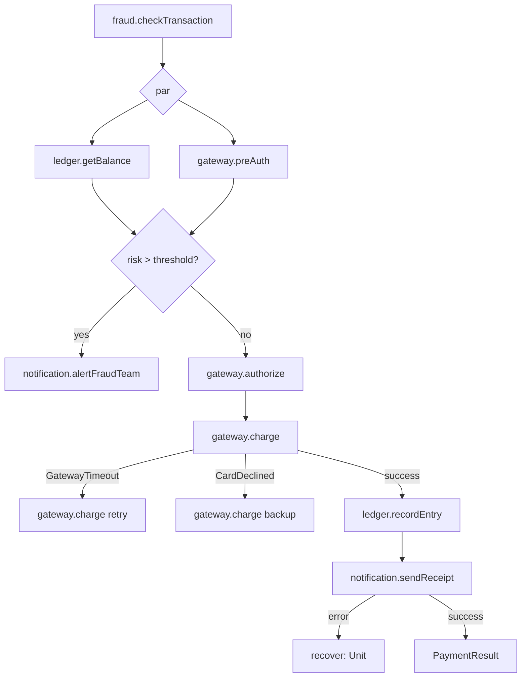

# Effect Handlers via Free + Interpreters — Design Document

## Overview

This document captures the design decisions for adding algebraic-effect-style
programming to higher-kinded-j. The approach extends the existing Free monad and
interpreter pattern to support composable, multi-effect programs with error
recovery, parallel composition, and code generation.

## Design Principles

1. **Java-idiomatic naming and patterns** — leverage sealed interfaces, records,
   pattern matching, constructor injection. Avoid category theory jargon in
   user-facing API.
2. **Build on what exists** — Free, FreeAp, FreePath, ForPath, Natural, the
   annotation processor infrastructure, and the OpticOp interpreter pattern.
3. **Programs as data** — a program describes what to do; interpreters decide how.
   The same program can be interpreted for production, testing, auditing, or
   simulation.
4. **Boilerplate elimination** — annotation processing generates the mechanical
   parts. Users write effect algebras (sealed interfaces) and interpreters
   (switch expressions).
5. **Optics-native effects** — higher-kinded-j's optics infrastructure (lenses,
   prisms, traversals, FocusPath) is not bolted on after the fact. State effects
   use optics as their primary interface, and ForPath comprehensions integrate
   `focus()` steps natively. No other effect system in any language offers this.
6. **Compile-time safety via annotation processors** — Java's annotation
   processing is an underused superpower for effect systems. Where Haskell
   relies on type-level programming and Scala on implicit resolution (both
   producing opaque error messages), `@EffectAlgebra` and `@ComposeEffects`
   validate effect composition and interpreter completeness at compile time
   with source-location-specific error messages.
7. **IDE-first discoverability** — ForPath with generated step classes, `Bound`
   instances with concrete methods, and explicit constructor injection mean
   that IDE autocomplete shows exactly what operations are available at each
   point. No implicit resolution, no typeclass search, no magic.

---

## 1. EitherF — Composing Effect Algebras

### What it is

`EitherF<F, G, A>` is `Either` lifted to the type constructor level. Just as
`Either<L, R>` represents "a value that is either an L or an R," EitherF
represents "an instruction that is either from effect-set F or effect-set G."

The name follows the established `modifyF` convention where the `F` suffix means
"lifted to the functor/effect level."

### Location

`org.higherkindedj.hkt.eitherf` — follows the existing convention where each
type gets its own peer package under `hkt` (alongside `either`, `maybe`, `io`,
etc.).

### Types

```java
// Core sum type
public sealed interface EitherF<F extends WitnessArity<?>, G extends WitnessArity<?>, A>
    permits EitherF.Left, EitherF.Right {

  record Left<F extends WitnessArity<?>, G extends WitnessArity<?>, A>(
      Kind<F, A> value) implements EitherF<F, G, A> {}

  record Right<F extends WitnessArity<?>, G extends WitnessArity<?>, A>(
      Kind<G, A> value) implements EitherF<F, G, A> {}

  default <B> B fold(
      Function<Kind<F, A>, B> onLeft,
      Function<Kind<G, A>, B> onRight) {
    return switch (this) {
      case Left<F, G, A> l  -> onLeft.apply(l.value());
      case Right<F, G, A> r -> onRight.apply(r.value());
    };
  }
}

// HKT encoding
public interface EitherFKind<F, G, A> extends Kind<EitherFKind.Witness<F, G>, A> {
  final class Witness<F extends WitnessArity<?>, G extends WitnessArity<?>>
      implements WitnessArity<TypeArity.Unary> {
    private Witness() {}
  }
}

// Widen/narrow helper
public enum EitherFKindHelper {
  EITHERF;
  record EitherFHolder<F, G, A>(EitherF<F, G, A> value) implements EitherFKind<F, G, A> {}
  // widen(), narrow() methods
}

// Functor instance — NOT a singleton enum because it requires sub-functor instances.
// EitherFFunctor must delegate map to whichever side (Left/Right) is present,
// so it needs Functor<F> and Functor<G> at construction time.
public final class EitherFFunctor<F extends WitnessArity<?>, G extends WitnessArity<?>>
    implements Functor<EitherFKind.Witness<F, G>> {

  private final Functor<F> functorF;
  private final Functor<G> functorG;

  public EitherFFunctor(Functor<F> functorF, Functor<G> functorG) {
    this.functorF = Objects.requireNonNull(functorF);
    this.functorG = Objects.requireNonNull(functorG);
  }

  @Override
  public <A, B> Kind<EitherFKind.Witness<F, G>, B> map(
      Kind<EitherFKind.Witness<F, G>, A> fa, Function<A, B> f) {
    EitherF<F, G, A> either = EitherFKindHelper.EITHERF.narrow(fa);
    return EitherFKindHelper.EITHERF.widen(
        either.fold(
            left  -> new EitherF.Left<>(functorF.map(left, f)),
            right -> new EitherF.Right<>(functorG.map(right, f))));
  }
}
```

### Inject

`Inject<F, G>` witnesses that effect type F can be embedded into a larger
effect type G. Think of it like an interface constraint: `Inject<ConsoleOp, G>`
means "G supports console operations."

```java
public interface Inject<F extends WitnessArity<?>, G extends WitnessArity<?>> {
  <A> Kind<G, A> inject(Kind<F, A> fa);
}
```

Standard instances:
- `Inject<F, EitherF<F, G>>` — inject into the left
- `Inject<G, EitherF<F, G>>` — inject into the right
- `Inject<F, EitherF<G, EitherF<H, F>>>` — transitive (for 3+ effects)

#### Transitive injection complexity

For N effects composed via right-nested EitherF, each effect type requires a
distinct `Inject` instance that navigates the nesting to the correct position.
The number of instances grows linearly with N (one per effect), but the nesting
depth of each instance also grows. For example, with four effects
`EitherF<A, EitherF<B, EitherF<C, D>>>`:

- `Inject<A, ...>` — direct left injection (depth 0)
- `Inject<B, ...>` — right then left (depth 1)
- `Inject<C, ...>` — right, right, then left (depth 2)
- `Inject<D, ...>` — right, right, then right (depth 2, terminal position)

These instances are mechanical and should be generated rather than hand-written.
The `@EffectAlgebra` processor (Phase 4) or a dedicated `@ComposeEffects`
annotation can generate a type alias and all required `Inject` instances for a
given effect set. Alternatively, `Interpreters.combine()` can provide a
companion `injects()` method that returns a tuple of correctly-typed `Inject`
instances for the combined effect type.

For practical purposes, the design targets up to 8 composed effects. Beyond
that, consider grouping related effects into sub-compositions (e.g., a
`StorageEffects` combining `DbOp` and `CacheOp`) to keep nesting depth
manageable.

### Interpreter composition

```java
public final class Interpreters {

  /** Combines two interpreters into one for their EitherF. */
  public static <F, G, M> Natural<EitherFKind.Witness<F, G>, M> combine(
      Natural<F, M> interpF,
      Natural<G, M> interpG) { ... }

  /** Combines three interpreters (nested EitherF). */
  public static <F, G, H, M> Natural<...> combine(
      Natural<F, M> interpF,
      Natural<G, M> interpG,
      Natural<H, M> interpH) { ... }

  /** Combines four interpreters. */
  public static <F, G, H, I, M> Natural<...> combine(
      Natural<F, M> interpF,
      Natural<G, M> interpG,
      Natural<H, M> interpH,
      Natural<I, M> interpI) { ... }
}
```

For 3+ effects, nesting is internal:
`EitherF<F, EitherF<G, EitherF<H, I>>>`. Users never construct this
manually — `Interpreters.combine()` handles it.

---

## 2. Inject Ergonomics — boundTo Pattern

### The problem

A single-effect operation returns `Free<ConfigOpKind.Witness, A>`. A combined
program needs `Free<AppEffects, A>`. Every operation in a flatMap chain needs
to be lifted into the combined type.

### The solution: Bound instances

Each generated `*Ops` class gets a `Bound` inner class and `boundTo` factory:

```java
// Generated by @EffectAlgebra processor
public final class ConfigOps {
  // Static methods for standalone use
  public static <A> Free<ConfigOpKind.Witness, A> readConfig(
      String key, Function<String, A> parse) { ... }

  // Bound instance for combined-effect use
  public static <G extends WitnessArity<TypeArity.Unary>> Bound<G> boundTo(
      Inject<ConfigOpKind.Witness, G> inject) {
    return new Bound<>(inject);
  }

  public static final class Bound<G extends WitnessArity<TypeArity.Unary>> {
    private final Inject<ConfigOpKind.Witness, G> inject;

    public <A> Free<G, A> readConfig(String key, Function<String, A> parse) {
      return Free.translate(ConfigOps.readConfig(key, parse), inject);
    }
  }
}
```

### Usage with constructor injection

```java
public class OrderService {
  private final ConfigOps.Bound<AppEffects> config;
  private final LogOps.Bound<AppEffects> log;
  private final DbOps.Bound<AppEffects> db;

  public OrderService(
      Inject<ConfigOpKind.Witness, AppEffects> configInject,
      Inject<LogOpKind.Witness, AppEffects> logInject,
      Inject<DbOpKind.Witness, AppEffects> dbInject) {
    this.config = ConfigOps.boundTo(configInject);
    this.log    = LogOps.boundTo(logInject);
    this.db     = DbOps.boundTo(dbInject);
  }
}
```

This mirrors the familiar Spring constructor injection pattern. The Bound
instances act like injected repositories or services.

### Free.translate

A new method on Free that transforms `Free<F, A>` to `Free<G, A>` using a
natural transformation. The primary overload accepts `Natural<F, G>` for
consistency with the existing `foldMap` API, which also uses `Natural`. A
convenience overload accepts `Inject<F, G>` since injection is the most common
use case.

```java
// Primary: accepts any natural transformation F ~> G
static <F extends WitnessArity<?>, G extends WitnessArity<?>, A>
    Free<G, A> translate(Free<F, A> program, Natural<F, G> nat) { ... }

// Convenience: accepts Inject (delegates to the Natural overload)
static <F extends WitnessArity<?>, G extends WitnessArity<?>, A>
    Free<G, A> translate(Free<F, A> program, Inject<F, G> inject) {
  return translate(program, inject::inject);
}
```

This means `Inject` does not need to extend `Natural` — the convenience
overload adapts via method reference. However, if `Inject` is later given a
`toNatural()` method or extends `Natural` directly, the convenience overload
can be deprecated.

---

## 3. Error Handling — Hybrid Design

Error handling is split across two levels, mirroring Java's `throw` (statement)
and `try/catch` (block) distinction.

### Raising errors: effect algebra

`ErrorOp<E>` is a standalone effect algebra that composes via EitherF like any
other effect. Programs that need to explicitly raise business errors include it
in their effect set.

```java
@EffectAlgebra
sealed interface ErrorOp<E, A> {
  record Raise<E, A>(E error) implements ErrorOp<E, A> {}
}
```

#### Note on ErrorOp type parameters

`ErrorOp<E, A>` has two type parameters, but `@EffectAlgebra` expects sealed
interfaces with a single type parameter `<A>` (the HKT carrier). `ErrorOp` is
an exception: `E` is a fixed error type chosen by the user (e.g.,
`ErrorOp<BusinessError, A>`), while `A` is the HKT-varying parameter. The
processor must treat `E` as a fixed type parameter on the generated Kind
witness (similar to how `EitherKind.Witness<L>` fixes the left type), or
`ErrorOp` must be hand-written as a library-provided effect rather than
user-generated. Given that `ErrorOp` is a core primitive with only one
operation, hand-writing it is the pragmatic choice. The `@EffectAlgebra`
processor need not handle multi-parameter effect algebras in Phase 4.

Programs that only need to recover from interpreter failures (e.g., gateway
timeouts) do NOT need ErrorOp in their effect set.

### Stateful effects via optics: StateOp

`StateOp<S, A>` is a library-provided effect algebra (hand-written, like
`ErrorOp`) that uses optics as its primary interface. This is a signature
differentiator: no other effect system in any language parameterises state
operations by optics.

`StateOp` builds directly on the existing `OpticOp<S, A>` sealed interface
(in `org.higherkindedj.optics.free`), which already models 10 optic operations
as data with full HKT plumbing (`OpticOpFunctor`, `OpticOpKind`,
`OpticOpKindHelper`). `StateOp` delegates optic logic to `OpticOp`/`OpticOps`
and adds stateful semantics via the interpreter's `MonadState<M, S>` instance.
See Section 9 (Leveraging Existing Infrastructure) for the full mapping.

#### Why optics, not get/put

Traditional state effects offer `get` (read the whole state) and `put`
(replace the whole state). This is coarse-grained — programs must destructure
the state themselves, and interpreters cannot optimise access to independent
parts of the state.

Optic-parameterised operations are fine-grained. Each operation declares
exactly which part of the state it accesses, enabling:

- **Interpreter optimisation** — a concurrent interpreter can detect that two
  `over` operations target independent lenses and run them in parallel.
- **Static analysis** — `ProgramAnalyser` can report which state fields a
  program accesses without executing it, by inspecting the optics in `StateOp`
  nodes.
- **Composability** — optics compose naturally. A program operating on
  `Order.customer.address.postcode` does not need to know the shape of the
  enclosing `Order` type.

#### Effect algebra

```java
sealed interface StateOp<S, A> {

  /** Read a value through a Getter (or Lens, Iso, etc.). */
  record View<S, T, A>(Getter<S, A> optic) implements StateOp<S, A> {}

  /** Modify a focus through a Lens and return the new value. */
  record Over<S, A>(Lens<S, A> optic, Function<A, A> f)
      implements StateOp<S, A> {}

  /** Set a focus through a Lens to a fixed value. */
  record Assign<S, A>(Lens<S, A> optic, A value)
      implements StateOp<S, A> {}

  /** Read a value through a Prism (returns Maybe). */
  record Preview<S, A>(Prism<S, A> optic) implements StateOp<S, A> {}

  /** Modify all targets of a Traversal. */
  record TraverseOver<S, A>(Traversal<S, A> optic, Function<A, A> f)
      implements StateOp<S, A> {}

  /** Read the entire state (escape hatch). */
  record GetState<S>() implements StateOp<S, S> {}
}
```

Like `ErrorOp`, `StateOp` has two type parameters (`S` for the state type, `A`
for the HKT carrier) and is hand-written as a library primitive.

#### Smart constructors via Bound

```java
public final class StateOps {

  public static final class Bound<S, G extends WitnessArity<TypeArity.Unary>> {
    private final Inject<StateOpKind.Witness<S>, G> inject;
    private final Functor<StateOpKind.Witness<S>> functor;

    /** Read through any Getter-compatible optic. */
    public <A> FreePath<G, A> view(Getter<S, A> optic) { ... }

    /** Modify through a Lens, returning the new value. */
    public <A> FreePath<G, A> over(Lens<S, A> optic, Function<A, A> f) { ... }

    /** Set a value through a Lens. */
    public <A> FreePath<G, A> assign(Lens<S, A> optic, A value) { ... }

    /** Read through a Prism (returns Maybe<A>). */
    public <A> FreePath<G, Maybe<A>> preview(Prism<S, A> optic) { ... }

    /** Modify all Traversal targets. */
    public <A> FreePath<G, A> traverseOver(
        Traversal<S, A> optic, Function<A, A> f) { ... }
  }
}
```

#### Integration with ForPath focus() steps

The existing `focus()` step on ForPath extracts a value through a FocusPath
(read-only). With `StateOp`, ForPath gains a complementary `modify()` step
that writes back through the same optic:

```java
ForPath.from(state.view(OrderFocus.customer().address().postcode()))
    .from(postcode -> state.over(
        OrderFocus.customer().address().postcode(),
        String::toUpperCase))
    .from((_, _) -> state.view(OrderFocus.lineItems().each().price()))
    .yield(...)
```

#### Effectful optic modification (modifyF)

The existing `Lens.modifyF` concept (modify a focus where the modification
itself is effectful) integrates directly with Free programs:

```java
// Effectful modification through a lens:
// focus into loyalty points, run an effect, write back the result
state.modifyF(OrderFocus.customer().loyaltyPoints(),
    points -> ledger.recordReward(points)
        .map(reward -> points + reward.bonus()))
```

Under the hood, `modifyF` on `StateOps.Bound` composes a `View`, an effectful
computation, and an `Assign` into a single `flatMap` chain within the Free
program. This is not a new Free constructor — it is syntactic sugar over
existing operations.

#### Interpreters

A `StateOp` interpreter targets any `MonadState<M, S>` (which already exists
in the codebase). Two standard interpreters are provided:

- **`StateOpInterpreter<S>`** — interprets into `State<S, A>` monad directly.
- **`IOStateOpInterpreter<S>`** — interprets into `IO` using an `AtomicReference<S>`
  for thread-safe mutable state.

The concurrent interpreter (future direction) could use the optic structure to
detect non-overlapping modifications and run them in parallel.

### Recovery: structural Free constructor

`HandleError` is a new constructor on Free, wrapping a sub-program with a
recovery strategy. This is structural because recovery scopes over a block,
not a single instruction.

```java
sealed interface Free<F extends WitnessArity<?>, A>
    permits Pure, Suspend, FlatMapped, HandleError, Ap {

  record HandleError<F extends WitnessArity<?>, E, A>(
      Free<F, A> program,
      Function<? super E, ? extends Free<F, A>> handler,
      Class<E> errorType) implements Free<F, A> {}

  // See Section 4 (par() and FreeAp) for Ap design details.
  record Ap<F extends WitnessArity<?>, A>(
      FreeAp<F, A> applicative) implements Free<F, A> {}
}
```

### foldMap behavior

During interpretation, `HandleError` delegates to the target monad:

- If the target monad is a `MonadError`: wraps the inner program's
  interpretation with `monadError.handleError`, invoking the handler on
  failure.
- If the target monad is NOT a `MonadError` (e.g., Id): the handler is
  ignored and the inner program is interpreted normally.

This means `handleError` is a hint — the program describes the recovery
strategy; the interpreter decides whether errors can occur.

> **Design warning — silent ignore behaviour**: When the target monad is not a
> `MonadError`, `HandleError` nodes are silently skipped. This is pragmatic
> (it allows the same program to run in both error-capable and pure contexts)
> but it can mask bugs: if a developer writes `handleError(...)` expecting
> recovery and then tests with an Id interpreter, the recovery path is never
> exercised. To mitigate this:
>
> - Document this behaviour prominently in the Javadoc for `HandleError` and
>   `FreePath.handleError`.
> - Provide a `Free.foldMapStrict()` variant that throws
>   `UnsupportedOperationException` when it encounters `HandleError` and the
>   target monad is not a `MonadError`. This gives users an opt-in strict mode
>   for testing.
> - The `ProgramAnalyser` should report recovery points so users can verify
>   their test interpreters cover them.

### FreePath error type bridge

The `Free.HandleError` record uses a generic error type `E` with a `Class<E>`
token for typed dispatch. However, the `FreePath` fluent API uses `Throwable`
for its catch-all methods (`handleError(Function<Throwable, ...>)`,
`recover(Function<Throwable, ...>)`, `attempt()`). This is intentional:

- `FreePath` targets Java developers who expect `Throwable`-based recovery
  (mirroring `try/catch`).
- Under the hood, `FreePath.handleError(handler)` creates a
  `HandleError<F, Throwable, A>` node with `errorType = Throwable.class`.
- The typed variant `FreePath.handleError(Class<E>, handler)` creates a
  `HandleError<F, E, A>` node with the specific error class.
- During `foldMap`, the `MonadError` implementation determines what error type
  it operates on. If the `MonadError` error type is `Throwable` (as with
  `TryMonad` or `IOMonad`), both variants work naturally. If the `MonadError`
  error type is narrower, the `Class<E>` token enables safe casting.

### FreePath surface

FreePath gains error recovery methods:

```java
// Catch-all recovery (Java-idiomatic)
FreePath<F, A> handleError(
    Function<? super Throwable, ? extends FreePath<F, A>> handler)

// Typed recovery (precise, mirrors multi-catch)
<E> FreePath<F, A> handleError(
    Class<E> errorType,
    Function<? super E, ? extends FreePath<F, A>> handler)

// Map error to pure value
FreePath<F, A> recover(Function<? super Throwable, ? extends A> handler)

// Capture error as Either
FreePath<F, Either<Throwable, A>> attempt()

// Fallback program
FreePath<F, A> orElse(Supplier<? extends FreePath<F, A>> fallback)
```

---

## 4. ForPath Enhancements for Free

### New entry point

`ForPath.from(FreePath<F, A>)` with generated `FreePathSteps1` through
`FreePathSteps12`, following the existing pattern for MaybePath, EitherPath, etc.

### Capabilities on FreePathSteps

Each step provides:
- `from(Function)` — flatMap binding (sequential)
- `let(Function)` — pure computation (no effect step created)
- `focus(FocusPath)` — optic extraction
- `par(Function, Function)` — independent sub-computations (parallel)
- `traverse(...)` — bulk operations
- `yield(Function)` — terminal projection

### par() and FreeAp — bridging monadic and applicative composition

`par()` steps use applicative semantics. Internally, this leverages `FreeAp`
for static analysis and batching. An interpreter that supports parallelism
(e.g., VTask-based) can execute independent steps concurrently.

#### How the bridge works

A `ForPath` chain is fundamentally monadic (each `from()` step can depend on
previous values). A `par()` step breaks this by declaring that two
sub-computations are independent. The implementation works as follows:

1. **Construction**: When `par()` is called on a `FreePathStep`, it receives
   two functions that produce `FreePath` values. These are lifted into a
   `FreeAp.map2(left, right, combiner)` expression, producing a
   `FreeAp<F, Pair<A, B>>`.

2. **Embedding in Free**: The `FreeAp` expression is wrapped in a new Free
   constructor `Free.Ap` (a thin wrapper around `FreeAp`) or, to avoid adding
   yet another Free variant, converted eagerly to a `Free` via
   `freeAp.foldMap(Natural.identity(), freeMonad)`. The eager conversion
   loses parallelism information but avoids structural changes to Free.

   **Recommended approach**: Add `Free.Ap` as a fifth constructor. This
   preserves the applicative structure for interpreters that can exploit it
   (VTask, IO with `StructuredTaskScope`) while falling back to sequential
   execution for interpreters that cannot (Id, Writer).

3. **Interpretation**: During `foldMap`, when a `Free.Ap` node is encountered:
   - If the target monad provides an `Applicative` instance (all monads do),
     `FreeAp.foldMap` is used with that applicative. For monads like IO or
     VTask that override `map2` with concurrent execution, this yields true
     parallelism.
   - For sequential monads (Id, State), `map2` defaults to sequential
     evaluation — the program is still correct, just not parallel.

4. **Static analysis**: Because `FreeAp` preserves the independence of its
   operands (unlike `Free.FlatMapped`), `ProgramAnalyser` can count parallel
   steps and identify independent sub-computations without executing the
   program.

#### Impact on Free sealed interface

If `Free.Ap` is added:

```java
sealed interface Free<F extends WitnessArity<?>, A>
    permits Pure, Suspend, FlatMapped, HandleError, Ap {

  record Ap<F extends WitnessArity<?>, A>(
      FreeAp<F, A> applicative) implements Free<F, A> {}
}
```

This is a second structural extension (alongside `HandleError`). Both should
be introduced together in Phase 2 to minimise churn to the `Free` sealed
interface.

### Error recovery within steps

Since each step produces a FreePath, and FreePath has `handleError`/`recover`/
`attempt`/`orElse`, error recovery is naturally scoped to individual steps:

```java
ForPath.from(someOp())
    .from(a -> riskyOp()
        .handleError(e -> fallbackOp()))
    .from((a, b) -> anotherOp())
    .yield(...);
```

---

## 5. @EffectAlgebra Annotation Processor

### Annotation

```java
@Target(ElementType.TYPE)
@Retention(RetentionPolicy.SOURCE)
public @interface EffectAlgebra {
  String targetPackage() default "";
  String opsSuffix() default "s";
  boolean generateInterpreter() default true;
  String kindHelperName() default "";
}
```

### Input requirements

- Applied to a sealed interface with type parameter `<A>`
- Permitted subtypes are records (the operations)

### Generated output per annotated type

For `@EffectAlgebra sealed interface FooOp<A>`:

| Generated class | Content |
|---|---|
| `FooOpKind<A>` | Kind marker interface + nested Witness class |
| `FooOpKindHelper` | Enum singleton with widen/narrow + Holder record |
| `FooOpFunctor` | Functor instance (singleton enum, cast-through map) |
| `FooOps` | Static smart constructors (one per record) + `Bound<G>` inner class + `boundTo(Inject)` factory |
| `FooOpInterpreter<M>` | Abstract class implementing Natural; switch skeleton with one abstract method per operation |

### Smart constructor generation

For each record in the sealed interface, generates a static method that:
1. Creates the record instance
2. Widens via KindHelper
3. Lifts into Free via `Free.liftF()`

Method name is derived from the record name (PascalCase to camelCase).

#### Functor threading for liftF

The existing `Free.liftF(Kind<F, A> fa, Functor<F> functor)` requires a
`Functor<F>` parameter. Generated smart constructors must supply this. Since
the processor also generates the corresponding `*Functor` class, each smart
constructor can reference the generated functor instance directly:

```java
// Generated smart constructor (inside FooOps)
public static <A> Free<FooOpKind.Witness, A> bar(String name) {
  return Free.liftF(
      FooOpKindHelper.FOO_OP.widen(new FooOp.Bar<>(name)),
      new FooOpFunctor());
}
```

Since `FooOpFunctor` uses cast-through mapping (effect algebras carry data, not
functions), construction is cheap. An alternative is to cache the functor in a
static final field within the generated `FooOps` class.

The `Bound` class similarly threads the functor through its methods, obtaining
it from the same generated source.

### Interpreter skeleton generation

```java
@Generated("org.higherkindedj.effect.processing.EffectAlgebraProcessor")
public abstract class FooOpInterpreter<M extends WitnessArity<TypeArity.Unary>>
    implements Natural<FooOpKind.Witness, M> {

  @Override
  public <A> Kind<M, A> apply(Kind<FooOpKind.Witness, A> fa) {
    FooOp<A> op = FooOpKindHelper.FOO_OP.narrow(fa);
    return switch (op) {
      case FooOp.Bar<A> bar -> handleBar(bar);
      case FooOp.Baz<A> baz -> handleBaz(baz);
    };
  }

  protected abstract <A> Kind<M, A> handleBar(FooOp.Bar<A> op);
  protected abstract <A> Kind<M, A> handleBaz(FooOp.Baz<A> op);
}
```

### Processor infrastructure

- New processor class: `EffectAlgebraProcessor extends AbstractProcessor`
- Uses JavaPoet for code generation (consistent with existing processors)
- Annotated with `@AutoService(Processor.class)` for compiler discovery
- Located in `hkj-processor`

### @ComposeEffects — compile-time effect set validation

`@ComposeEffects` is a companion annotation that generates the combined effect
type alias, all required `Inject` instances, and validates that interpreters
cover all constituent effects — all at compile time.

#### Annotation

```java
@Target(ElementType.TYPE)
@Retention(RetentionPolicy.SOURCE)
public @interface ComposeEffects {
  /** The effect algebras to compose, in nesting order (leftmost = outermost). */
  Class<?>[] value();
}
```

#### Usage

```java
@ComposeEffects({PaymentGatewayOp.class, FraudCheckOp.class,
                 LedgerOp.class, NotificationOp.class})
public interface PaymentEffects extends WitnessArity<TypeArity.Unary> {}
```

#### Generated output

For the above declaration, the processor generates:

```java
@Generated("org.higherkindedj.effect.processing.ComposeEffectsProcessor")
public final class PaymentEffectsSupport {

  // The composed type (for documentation; Java cannot generate type aliases)
  // PaymentEffects ≡ EitherFKind.Witness<
  //     PaymentGatewayOpKind.Witness,
  //     EitherFKind.Witness<FraudCheckOpKind.Witness,
  //         EitherFKind.Witness<LedgerOpKind.Witness,
  //             NotificationOpKind.Witness>>>

  // Inject instances — one per constituent effect
  public static Inject<PaymentGatewayOpKind.Witness, PaymentEffects>
      paymentGatewayInject() { ... }

  public static Inject<FraudCheckOpKind.Witness, PaymentEffects>
      fraudCheckInject() { ... }

  public static Inject<LedgerOpKind.Witness, PaymentEffects>
      ledgerInject() { ... }

  public static Inject<NotificationOpKind.Witness, PaymentEffects>
      notificationInject() { ... }

  // Convenience: all Bound instances in one call
  public static BoundSet boundSet() {
    return new BoundSet(
        PaymentGatewayOps.boundTo(paymentGatewayInject()),
        FraudCheckOps.boundTo(fraudCheckInject()),
        LedgerOps.boundTo(ledgerInject()),
        NotificationOps.boundTo(notificationInject()));
  }

  // Generated record holding all Bound instances
  public record BoundSet(
      PaymentGatewayOps.Bound<PaymentEffects> gateway,
      FraudCheckOps.Bound<PaymentEffects> fraud,
      LedgerOps.Bound<PaymentEffects> ledger,
      NotificationOps.Bound<PaymentEffects> notification) {}

  // Combined EitherFFunctor for the composed type
  public static Functor<PaymentEffects> functor() { ... }
}
```

#### Compile-time validations

The `ComposeEffectsProcessor` performs the following checks at compile time,
emitting errors with source locations:

1. **Effect algebra validity** — each class in `value()` must be a sealed
   interface annotated with `@EffectAlgebra` (or a library-provided effect
   like `ErrorOp`, `StateOp`).

2. **Kind witness availability** — each effect must have a corresponding
   `*Kind.Witness` class (generated or hand-written).

3. **Duplicate detection** — the same effect cannot appear twice in the
   composition.

4. **Arity limit** — compositions beyond 8 effects emit a warning suggesting
   sub-composition (grouping related effects).

#### @Handles — interpreter completeness checking

An optional companion annotation on interpreter classes:

```java
@Target(ElementType.TYPE)
@Retention(RetentionPolicy.SOURCE)
public @interface Handles {
  Class<?> value();  // The effect algebra this interpreter handles
}
```

```java
@Handles(PaymentGatewayOp.class)
public class StripeGatewayInterpreter
    extends PaymentGatewayOpInterpreter<IOKind.Witness> {
  // If handleRefund is missing, compile error:
  // "PaymentGatewayOp.Refund is not handled by StripeGatewayInterpreter.
  //  Add: protected <A> Kind<M, A> handleRefund(
  //           PaymentGatewayOp.Refund<A> op)"
}
```

The processor cross-references the operations in the sealed interface against
the `handle*` methods in the interpreter class, emitting actionable error
messages for any missing handlers. This provides the same safety as exhaustive
switch matching but extends it to cross-file validation.

#### IDE integration

Because `@ComposeEffects` generates concrete classes with concrete methods,
IDE autocomplete works naturally:

```java
var bounds = PaymentEffectsSupport.boundSet();
bounds.gateway().  // IDE shows: authorize, charge, refund
bounds.fraud().    // IDE shows: checkTransaction
bounds.ledger().   // IDE shows: recordEntry, getBalance
```

No implicit resolution, no type-level computation — just regular Java method
completion. This is a direct competitive advantage over Haskell's polysemy and
Scala's cats-effect, where IDE support for effect operations is inconsistent.

---

## 6. Worked Example — Payment Processing

### Why this domain

Payment processing demonstrates capabilities that DI frameworks cannot match:
- Same program, four interpretation strategies (prod, quote, audit, replay)
- Error recovery as business logic (retry, fallback payment method, swallow
  non-critical failures)
- Parallel independent operations (fraud check + balance lookup)
- Program inspection before execution (count external calls, estimate cost)

### Effect algebras

```
PaymentGatewayOp<A>  — Authorize, Charge, Refund
FraudCheckOp<A>      — CheckTransaction
LedgerOp<A>          — RecordEntry, GetBalance
NotificationOp<A>    — SendReceipt, AlertFraudTeam
```

### The program

```java
public Free<PaymentEffects, PaymentResult> processPayment(
    Customer customer, Money amount, PaymentMethod method) {

  return ForPath.from(fraud.checkTransaction(amount, customer))
      .par(risk -> ledger.getBalance(customer.accountId()))
      .from((risk, balance) -> {
          if (risk.score() > THRESHOLD)
              return notification.alertFraudTeam(customer, risk)
                  .then(() -> FreePath.pure(PaymentResult.declined("High risk")));
          if (balance.lessThan(amount))
              return FreePath.pure(PaymentResult.declined("Insufficient funds"));
          return gateway.authorize(amount, method);
      })
      .from((risk, balance, auth) ->
          gateway.charge(amount, method)
              .handleError(GatewayTimeoutException.class,
                  e -> gateway.charge(amount, method))
              .handleError(CardDeclinedException.class,
                  e -> gateway.charge(amount, customer.backupMethod())
                      .handleError(e2 ->
                          FreePath.pure(ChargeResult.failed(e2)))))
      .from((risk, balance, auth, charge) -> {
          if (charge.isFailed())
              return FreePath.pure(PaymentResult.failed(charge));
          return ledger.recordEntry(
              new LedgerEntry(customer.accountId(), amount, charge.id()));
      })
      .from((risk, balance, auth, charge, entry) ->
          notification.sendReceipt(customer, charge)
              .recover(e -> Unit.INSTANCE))
      .yield((risk, balance, auth, charge, entry, _) ->
          new PaymentResult(charge.id(), entry, risk));
}
```

### Four interpreters

Each interpreter targets an existing monad or transformer from the codebase:

1. **Production** — `IO` monad (`Monad<IOKind.Witness>`), real services
   (Stripe, ML fraud model, Postgres, email)
2. **Quote/Preview** — `Id` monad, calculates fees without charging, skips
   fraud, no notifications
3. **Compliance Audit** — `WriterT<IO, AuditLog, A>` transformer
   (`MonadWriter`), delegates to real services but records every operation
   via `tell()`. See Section 9 for the compositional decorator pattern.
4. **Dispute Replay** — `ReaderT<Id, EventLog, A>` transformer
   (`MonadReader`), reconstructs execution from stored events via `ask()`

### Testing without mocks

```java
@Test
void processPayment_highRisk_declines() {
    var fraud = new FixedRiskInterpreter(RiskScore.of(95));
    var gateway = new RecordingGatewayInterpreter();
    var ledger = new InMemoryLedgerInterpreter();
    var notification = new CapturingNotificationInterpreter();

    var interpreter = Interpreters.combine(gateway, fraud, ledger, notification);

    PaymentResult result = IdKindHelper.ID.narrow(
        processPayment(customer, tenDollars, visa)
            .foldMap(interpreter, IdMonad.instance())).value();

    assertThat(result.isDeclined()).isTrue();
    assertThat(gateway.calls()).isEmpty();
    assertThat(notification.alerts()).hasSize(1);
}
```

### Program inspection

```java
ProgramAnalysis analysis = ProgramAnalyser.analyse(program);
// "4 gateway calls, 1 fraud check, 2 ledger ops, 2 notifications"
// "3 error recovery points"
// "1 parallel step (fraud + balance)"
```

#### Analyser limitations

`ProgramAnalyser` performs static traversal of the Free program tree. It can
count operations in `Suspend` nodes, `HandleError` recovery points, and
`Ap` parallel sub-trees. However, it **cannot inspect inside `FlatMapped`
continuations** — these are opaque `Function` values that produce further Free
programs only when applied to a value.

This means the analyser reports a **lower bound** on operation counts. The
"spine" of the program (the operations before the first `flatMap`) and all
`Ap`-based parallel branches are fully visible, but conditional branches inside
`flatMap` continuations are not. For the payment example above, the analyser
would report the fraud check and balance lookup (in the `par()` step) but not
the conditional gateway calls inside the subsequent `from()` steps.

To improve coverage, programs can be structured to maximise the applicative
spine (using `par()` and `let()` instead of `from()` where possible). The
analyser should clearly document that its counts are lower bounds, not exact.

### hkj-book chapter structure

```
Chapter: Effect Handlers — Payment Processing

1. The Problem — four external systems, multiple execution modes
2. Defining Effects — @EffectAlgebra sealed interfaces
3. Writing the Program — ForPath, boundTo, par(), error recovery
4. Production Interpretation — IO monad, real services
5. Testing Without Mocks — Id monad, recording interpreters
6. Advanced Interpretations — quote, audit, replay, parallel
7. Program Inspection — analysing programs before execution
8. Comparison with Traditional DI — side-by-side, what each can/cannot do
```

---

## 7. Implementation Phases

### Phase 1: Core Composition — COMPLETE

All deliverables implemented, tested, and passing. Spotless clean.

| Deliverable | Status | Files | Location |
|---|---|---|---|
| `EitherF<F, G, A>` sealed interface | Done | `EitherF.java` | `hkj-core/.../eitherf/` |
| `EitherFKind`, `EitherFKindHelper` | Done | 2 files | `hkj-core/.../eitherf/` |
| `EitherFFunctor` (class, not enum — needs sub-functor instances) | Done | 1 file | `hkj-core/.../eitherf/` |
| `Inject<F, G>` interface + standard instances | Done | 2 files | `hkj-core/.../inject/` |
| `Interpreters.combine()` (2, 3, 4 arities) | Done | 1 file | `hkj-core/.../eitherf/` |
| `Free.translate()` method | Done | Edit to `Free.java` | `hkj-core/.../free/` |
| `EitherFAssert` custom assertion | Done | 1 file | `hkj-core/src/test/` |
| Unit tests (EitherFTest, EitherFFunctorTest, InjectTest, InterpretersTest, FreeTranslateTest) | Done | 5 files | `hkj-core/src/test/` |
| End-to-end integration test (Inject + translate + combine + foldMap) | Done | In EitherFTest | `hkj-core/src/test/` |
| Architecture rules updated | Done | 2 files | `hkj-core/src/test/.../architecture/` |
| JaCoCo Witness exclusion | Done | `build.gradle.kts` | `hkj-core/` |
| `module-info.java` exports | Done | Edit | `hkj-core/` |

**Implementation notes:**

- `EitherFFunctor` is a `final class` with `Functor<F>` and `Functor<G>` constructor
  parameters, not an enum singleton. Type parameters require
  `WitnessArity<TypeArity.Unary>` bounds (not wildcard) to satisfy `Functor`'s
  type constraint.
- `Free.translate` is a static method taking `Natural<F, G>` and `Functor<G>`.
  The `Functor<G>` is needed to map over `Suspend` nodes (which hold
  `Kind<F, Free<F, A>>`).
- `Interpreters` is in the `eitherf` package (not `effect` or `free`) since it
  operates directly on `EitherF` types.
- JaCoCo config updated to exclude `**/*Kind$Witness.class` globally — Witness
  inner classes are phantom type markers with unreachable constructors.

### Phase 2: Error Handling — COMPLETE

| Deliverable | Status | Files | Location |
|---|---|---|---|
| `Free.HandleError` + `Free.Ap` constructors | Done | Edit to `Free.java` | `hkj-core/.../free/` |
| `foldMap` HandleError/Ap cases | Done | Edit to `Free.java` | `hkj-core/.../free/` |
| `ErrorOp<E, A>` effect algebra (hand-written) | Done | 5 files (Op, Kind, Helper, Functor, Ops) | `hkj-core/.../error/` |
| `StateOp<S, A>` optics-native state effect (hand-written) | Done | 7 files (Op, Kind, Helper, Functor, Ops, 2 interpreters) | `hkj-core/.../state_op/` |
| `FreePath` error recovery methods | Done | Edit to `FreePath.java` | `hkj-core/.../effect/` |
| `FreeAssert` custom assertion | Done | 1 file | `hkj-core/src/test/` |
| Unit tests for error handling + StateOp | Done | Test files | `hkj-core/src/test/` |

### Phase 3: ForPath Enhancements — COMPLETE

| Deliverable | Status | Files | Location |
|---|---|---|---|
| `ForPath.from(FreePath)` entry point | Done | Edit to `ForPath.java` | `hkj-core/.../expression/` |
| `FreePathSteps1` (hand-written) | Done | In `ForPath.java` | `hkj-core/.../expression/` |
| `FreePathSteps2`-`FreePathSteps12` (generated) | Done | Generated by processor | `hkj-core/.../expression/` |
| `FreePath.runKind()` method | Done | Edit to `FreePath.java` | `hkj-core/.../effect/` |
| `par()` on FreePathSteps | Done | Within generated steps (uses monad.map2/3/4) | `hkj-core/.../expression/` |
| `let()`, `focus()` on FreePathSteps | Done | Within generated steps | `hkj-core/.../expression/` |
| `isFree` flag in `ForPathStepGenerator` | Done | Edit to generator | `hkj-processor/` |
| FreePath `PathTypeDescriptor` | Done | In `ForPathStepGenerator` | `hkj-processor/` |
| Unit tests for ForPath + FreePath | Done | `ForPathFreePathTest.java` | `hkj-core/src/test/` |
| Generator tests for FreePathSteps | Done | In `ForComprehensionGeneratorTest.java` | `hkj-processor/src/test/` |
| Golden file test cases | Done | In `ForComprehensionGoldenFileTest.java` | `hkj-processor/src/test/` |

**Implementation notes:**

- `FreePath.runKind()` returns `Kind<FreeKind.Witness<F>, A>` — enables ForPath
  integration by providing the HKT-level representation needed by `FreeMonad<F>`.
- `FreePathSteps` classes carry both `Monad<FreeKind.Witness<F>> monad` and
  `Functor<F> functor` fields. The monad is used for flatMap/map operations;
  the functor is passed through to reconstruct `FreePath` in `yield()`.
- `par()` uses `monad.map2/map3/map4` (sequential via `FreeMonad.ap` which
  delegates to `flatMap`). True `FreeAp`-based parallel composition is a
  future enhancement — the current implementation is functionally correct.
- Value type parameters skip `F` (same as `GenericPathSteps`) to avoid
  collision with the class-level effect functor type parameter.
- The `isFree` flag on `PathTypeDescriptor` controls Free-specific behaviour
  in the generator: witness type `FreeKind.Witness<F>`, `runKind()` extraction,
  `FreePath.of(narrow, functor)` yield, and dual constructor args.

### Phase 4: Code Generation — NOT STARTED

| Deliverable | Files | Location |
|---|---|---|
| `@EffectAlgebra` annotation | 1 file | `hkj-annotations/` |
| `@ComposeEffects` + `@Handles` annotations | 2 files | `hkj-annotations/` |
| `EffectAlgebraProcessor` | 1 file | `hkj-processor/` |
| `ComposeEffectsProcessor` (generates Support class, Inject instances, BoundSet) | 1 file | `hkj-processor/` |
| Generated Kind, KindHelper, Functor, Ops, Interpreter | Per annotated type | User's project |
| Generated `*Support` class with Inject instances and BoundSet | Per @ComposeEffects type | User's project |
| `EffectCompositionChecker` — extend HKJCheckerPlugin | 1-2 files | `hkj-checker/` |
| OpenRewrite migration recipes (HandleError, FreePath, Inject) | 3-4 files | `hkj-openrewrite/` |
| Processor + checker + recipe tests | Test files | `hkj-processor/src/test/`, `hkj-checker/src/test/`, `hkj-openrewrite/src/test/` |

### Phase 5: Worked Example + Documentation — NOT STARTED

| Deliverable | Files | Location |
|---|---|---|
| Payment processing example (manual, pre-codegen) | Multiple files | `hkj-examples/` |
| Payment processing example (with @EffectAlgebra) | Multiple files | `hkj-examples/` |
| hkj-book chapter | Markdown files | `hkj-book/` |
| Benchmarks | JMH benchmark class | `hkj-benchmarks/` |

---

## Key Decisions Summary

| Decision | Choice | Rationale |
|---|---|---|
| Sum-of-functors name | `EitherF` | Follows `modifyF` convention; mirrors existing `Either` |
| Package location | `org.higherkindedj.hkt.eitherf` | Follows one-type-per-package convention |
| Inject package | `org.higherkindedj.hkt.inject` (separate from EitherF) | General-purpose concept; avoids coupling to specific sum type |
| EitherFFunctor | `final class` with constructor-injected sub-functors | Cannot be stateless enum; needs `Functor<F>` and `Functor<G>` |
| Inject ergonomics | `boundTo` pattern on generated Ops | Constructor injection; works with ForPath; no complex codegen |
| Free.translate signature | `Natural<F, G>` primary; `Inject<F, G>` convenience overload | Consistent with existing foldMap API; Inject adapts via method reference |
| For-comprehension | ForPath + generated FreePathSteps | Flat chains; optics integration; par(); existing infrastructure |
| Parallel composition | `Free.Ap` constructor wrapping `FreeAp` | Preserves applicative structure for parallel interpreters and static analysis |
| Error raising | `ErrorOp<E>` effect algebra (hand-written, not generated) | Two type params; composes via EitherF like any other effect |
| Error recovery | `Free.HandleError` constructor | Structural (wraps sub-programs); mirrors try/catch semantics |
| HandleError in non-MonadError | Silent ignore (with opt-in strict mode) | Pragmatic default; `foldMapStrict()` available for testing |
| FreePath error type | `Throwable` for catch-all; `Class<E>` for typed recovery | Mirrors Java try/catch; bridges to `HandleError<F, E, A>` via class token |
| Recovery on FreePath | `handleError`, `recover`, `attempt`, `orElse` | Both catch-all and typed variants; Java-idiomatic |
| Code generation | `@EffectAlgebra` annotation processor | Eliminates 4:1 boilerplate ratio; follows existing processor patterns |
| State effects | `StateOp<S>` parameterised by optics (Getter, Lens, Prism, Traversal) | Fine-grained state access; enables concurrent modification of independent fields; static analysis of accessed state; no other effect system has this |
| State effect modifyF | Effectful optic modification via `StateOps.Bound.modifyF` | Composes view + effect + assign into flatMap chain; syntactic sugar, not new Free constructor |
| Effect set composition | `@ComposeEffects` annotation processor | Generates type alias, all Inject instances, BoundSet record, and validates at compile time |
| Interpreter checking | `@Handles` annotation on interpreter classes | Cross-file validation that all operations have handlers; actionable error messages |
| Worked example domain | Payment processing | Multiple interpreters are a business requirement, not just testing |

---

## 8. Implementation Standards

All code must follow the project's established conventions as documented in
STYLE-GUIDE.md, TESTING-GUIDE.md, TUTORIAL-STYLE-GUIDE.md, and CONTRIBUTING.md.

### Java 25 idioms

Use modern Java 25 with preview features throughout:

- **Sealed interfaces + records** for all effect algebras and ADTs
- **Pattern matching in switch expressions** for interpreter dispatch
  (exhaustive, no default catch-all)
- **Record patterns** for destructuring in switch arms:
  `case HandleError<F, Object, A>(var prog, var handler, var errType) -> ...`
- **Unnamed variables** (`_`) in lambdas and patterns where values are unused:
  `.from((_, _, order) -> ...)`, `case Pure<F, A> _ -> ...`
- **`var`** used sparingly; prefer explicit types in public APIs and tests
  (aids learning). `var` acceptable in local test setup and lambda-heavy code
- **Method references** where they improve clarity:
  `FreePath::pure` over `a -> FreePath.pure(a)`
- **Virtual threads** via `StructuredTaskScope` for parallel interpreter
  implementations (consistent with VTask/VStream patterns)

### Coding conventions

- **British English** in all documentation and comments (colour, behaviour,
  optimisation, recognise)
- **Google Java Style Guide** formatting (enforced by Spotless)
- **`@NullMarked`** on all new classes (package-level where appropriate)
- **`@jspecify`** annotations for nullability contracts
- **No emojis** in code, comments, or documentation
- **Javadoc** on all public types and methods with `{@code}` for inline code
  and `<pre>{@code ...}</pre>` for examples
- **`Objects.requireNonNull()`** for parameter validation in constructors and
  public methods
- **Enum singletons** for stateless instances (Functor, KindHelper) following
  OpticOpFunctor/OpticOpKindHelper pattern
- **`final` on utility classes** with private constructors

### Package conventions

New packages under `org.higherkindedj.hkt`:

```
hkt/eitherf/         — EitherF, EitherFKind, EitherFKindHelper, EitherFFunctor
hkt/inject/          — Inject, InjectInstances
hkt/free/            — Free.java edits (HandleError, Ap, translate)
hkt/effect/          — FreePath edits, Interpreters utility
```

#### Package location for Inject

`Inject` and `InjectInstances` are placed in their own `hkt/inject/` package
rather than under `hkt/eitherf/`. While `Inject` instances currently target
`EitherF`, the concept of type-level embedding is general-purpose and may apply
to future sum-of-functors representations (e.g., a ternary `Coproduct3` or a
tag-based union). Keeping `Inject` separate avoids coupling it to a specific
sum type and follows the project convention of one concept per package.

---

## 9. Leveraging Existing Infrastructure

A key principle of this design is building on what exists. The following table
maps each design component to the existing codebase element it builds on. None
of these are new inventions — they are compositions of infrastructure that is
already implemented, tested, and published.

### Mapping table

| Design component | Existing infrastructure | How it integrates |
|---|---|---|
| `StateOp` optic operations | `OpticOp<S, A>` sealed interface (10 operations, full HKT plumbing) | `StateOp` delegates optic logic to `OpticOp`; adds stateful semantics via interpreter |
| `StateOp` interpreter | `MonadState<F, S>` interface (`get`, `put`, `modify`, `gets`, `inspect`) | Interpreter targets any monad with `MonadState` instance; uses `OpticOps` for optic application |
| Audit interpreter | `WriterT<F, W, A>` transformer + `MonadWriter<F, W>` (`tell`, `listen`, `censor`) | Interpret into `WriterT<IO, AuditLog, A>`; each operation logged via `tell()` |
| Replay interpreter | `ReaderT<F, R, A>` transformer + `MonadReader<F, R>` (`ask`, `local`, `reader`) | Interpret into `ReaderT<Id, EventLog, A>`; replay events via `ask()` |
| `ErrorOp` interpreter | `EitherT<F, L, R>` transformer + `MonadError<F, E>` (`raiseError`, `handleErrorWith`) | Interpret `Raise` via `MonadError.raiseError`; recovery via `handleErrorWith` |
| `ProgramAnalyser` | `Const<C, A>` record + `ConstApplicative` | Analyse `FreeAp` sub-trees via `foldMap` into `Const<Metrics, A>`; phantom type discards values, accumulates metrics |
| Parallel interpreter | `VTask<A>` + `VTaskMonad` (virtual threads, `timeout`, `runAsync`) | `VTaskMonad.map2` spawns virtual threads for `Free.Ap` operands; `timeout()` built in |
| `Free.translate` stack safety | `Trampoline<A>` (Done/More/FlatMap, iterative runner) | Same pattern as existing `interpretFree`; trampoline prevents stack overflow on deep trees |
| Effect type checking | `HKJCheckerPlugin` javac plugin + `PathTypeRegistry` (27 registered types) | Add `EffectCompositionChecker`; `FreePath` already registered in `PathTypeRegistry` |
| Migration tooling | OpenRewrite recipes (`AddArityBoundsToTypeParametersRecipe`) | Add recipes for `HandleError`/`Ap` pattern match migration and `Inject` boilerplate detection |
| Spring `EffectBoundary` | `hkj-spring` return value handlers + `HkjWebMvcAutoConfiguration` | Add `FreePathReturnValueHandler`; reuse existing async execution infrastructure |
| `@EffectAlgebra` plugin SPI | `TraversableGenerator` SPI (ServiceLoader, priority system, 19+ generators) | Create `EffectAlgebraPlugin` SPI for generated code customisation following same pattern |
| Law testing | `TypeClassAssertions` framework (Functor, Applicative, Monad, MonadError laws) | Verify `EitherFFunctor`, `FreeMonad` (with HandleError), `Inject` laws using existing assertions |
| Non-deterministic interpretation | `NonDetPath<A>` (List monad, cartesian product flatMap) | Interpret `Free<F, A>` into `NonDetPath<A>` for exploring all execution branches |
| Lazy interpretation | `Lazy<A>` (memoised, thread-safe, chain-optimised) + `LazyMonad` | Interpret effect programs with deferred evaluation; results cached on first access |
| Generic escape hatch | `GenericPath<F, A>` (wraps any `Kind<F, A>` + `Monad<F>`) | Interpretation into custom monads without dedicated Path type; `FreePath.foldMap` returns `GenericPath` |

### OpticOp as the foundation for StateOp

The existing `OpticOp<S, A>` sealed interface in `org.higherkindedj.optics.free`
already models optic operations as data:

```
OpticOp.Get       → StateOp.View        (Getter)
OpticOp.Set       → StateOp.Assign      (Lens)
OpticOp.Modify    → StateOp.Over        (Lens)
OpticOp.Preview   → StateOp.Preview     (Fold/Prism)
OpticOp.ModifyAll → StateOp.TraverseOver (Traversal)
OpticOp.GetAll    — no StateOp equivalent needed (use Traversal + fold)
OpticOp.Exists    — available as derived operation on StateOp
OpticOp.All       — available as derived operation on StateOp
OpticOp.Count     — available as derived operation on StateOp
```

The key difference: `OpticOp` is **stateless** — each record carries the source
`S` explicitly. `StateOp` is **stateful** — the interpreter manages the current
state via `MonadState<M, S>`. Internally, `StateOp` uses `OpticOps` static
methods for the actual optic application:

```java
// StateOp interpreter pseudocode
case StateOp.Over<S, A>(var optic, var f) -> {
  S current = monadState.get();              // Read current state
  S updated = OpticOps.modify(optic, f, current); // Apply optic
  monadState.put(updated);                   // Write back
  yield monadState.gets(s -> optic.get(s));  // Return new focused value
}
```

This means `StateOp` adds zero new optic logic — it reuses `OpticOp`'s existing
infrastructure and adds only the state threading.

### Existing OpticOp interpreters as a template

`OpticInterpreters` already provides three interpreter strategies that mirror the
payment example's approach:

| Existing interpreter | Payment example equivalent |
|---|---|
| `DirectOpticInterpreter` — immediate execution | Production interpreter (IO monad) |
| `LoggingOpticInterpreter` — records all operations | Audit interpreter (WriterT) |
| `ValidationOpticInterpreter` — dry-run validation | Quote interpreter (Id monad) |

This pattern validation confirms the design is consistent with established
project conventions.

### Const functor for ProgramAnalyser

The `Const<C, A>` type (in `org.higherkindedj.hkt.constant`) is the standard
tool for extracting information from a structure without executing effects. The
`ProgramAnalyser` implementation should use `Const` with `FreeAp.foldMap`:

```java
// Count operations in an applicative sub-tree
Monoid<Integer> addMonoid = Monoid.of(0, Integer::sum);
ConstApplicative<Integer> constApp = new ConstApplicative<>(addMonoid);

Natural<F, ConstKind.Witness<Integer>> counter =
    new Natural<>() {
      @Override
      public <A> Kind<ConstKind.Witness<Integer>, A> apply(Kind<F, A> fa) {
        return ConstKindHelper.CONST.widen(new Const<>(1));
      }
    };

// For a FreeAp sub-tree (from Free.Ap nodes):
int opCount = ConstKindHelper.CONST.narrow(
    freeAp.foldMap(counter, constApp)).value();
```

For richer analysis, `Const<ProgramMetrics, A>` with a `ProgramMetrics` monoid
can accumulate operation counts per effect type, recovery point counts, and
parallel scope counts in a single traversal.

### HKJCheckerPlugin extension for effect composition

The existing javac plugin (`HKJCheckerPlugin`) runs during the ANALYZE phase
and detects Path type mismatches via `PathTypeMismatchChecker`. This
infrastructure should be extended with an `EffectCompositionChecker` that
validates:

1. **`FreePath` chain consistency** — the same Path-family check already
   performed for `MaybePath`, `EitherPath`, etc., but applied to `FreePath<F, A>`
   where the effect type `F` must be consistent across `via()`, `then()`, and
   `zipWith()` chains.

2. **`Interpreters.combine()` arity matching** — when `combine(a, b, c, d)` is
   called, verify that the four interpreter type parameters correspond to the
   four effects in the target `EitherF` nesting.

3. **`boundTo` type safety** — when `ConfigOps.boundTo(inject)` is called,
   verify the `Inject` type parameter matches the effect composition in scope.

The checker's "no false positives" policy means it silently skips checks when
types cannot be resolved — the same conservative approach that works for Path
types works for effect types.

`FreePath` is already registered in `PathTypeRegistry` (one of the 27 known
Path types), so the existing infrastructure recognises it. The extension adds
effect-specific checks to the existing plugin, not a separate plugin.

### OpenRewrite recipes for migration

The `hkj-openrewrite` module provides recipes for adding `WitnessArity` bounds
and updating witness classes. New recipes should be added for the effect handler
migration:

| Recipe | Purpose |
|---|---|
| `AddHandleErrorCase` | Adds `HandleError` and `Ap` cases to existing `switch` expressions on `Free` variants |
| `ConvertRawFreeToFreePath` | Converts direct `Free<F, A>` usage to `FreePath<F, A>` fluent API |
| `DetectInjectBoilerplate` | Identifies manual `Inject` instance construction and suggests `@ComposeEffects` |
| `AddBoundsToEffectParameters` | Adds `F extends WitnessArity<TypeArity.Unary>` to effect type parameters (extends existing `AddArityBoundsToTypeParametersRecipe`) |

These recipes enable incremental migration for existing Free monad users and
lower the adoption barrier for the new features.

### Monad transformer stack interpretation

The payment example's four interpreters map to existing transformer types:

```
Production  → IO                                    (Monad<IOKind.Witness>)
Audit       → WriterT<IO, AuditLog, A>              (MonadWriter<WriterTKind.Witness<IO, AuditLog>, AuditLog>)
Replay      → ReaderT<Id, EventLog, A>              (MonadReader<ReaderTKind.Witness<Id, EventLog>, EventLog>)
Testing     → StateT<Id, TestState, A>              (MonadState<StateTKind.Witness<Id, TestState>, TestState>)
```

The `Interpreters.combine()` documentation should include examples of targeting
transformer stacks. For the audit interpreter, each operation's handler calls
`MonadWriter.tell()` before delegating to the real service:

```java
public class AuditingGatewayInterpreter<M extends WitnessArity<TypeArity.Unary>>
    extends PaymentGatewayOpInterpreter<M> {

  private final MonadWriter<M, AuditLog> writer;
  private final PaymentGatewayOpInterpreter<M> delegate;

  @Override
  protected <A> Kind<M, A> handleCharge(PaymentGatewayOp.Charge<A> op) {
    return writer.flatMap(
        writer.tell(AuditLog.of("CHARGE", op.amount(), op.method())),
        _ -> delegate.handleCharge(op));
  }
}
```

This compositional decoration (wrapping one interpreter with another) is a
capability that dependency injection frameworks cannot provide — you cannot
intercept and log a Spring bean's method call while preserving the full type
information of the operation being performed.

---

## 10. Testing Strategy

### Custom AssertJ Assertions

Create dedicated assertion classes following the established pattern
(EitherAssert, IOAssert, TryAssert as reference):

#### FreeAssert

```java
public class FreeAssert<F extends WitnessArity<?>, A>
    extends AbstractAssert<FreeAssert<F, A>, Free<F, A>> {

  public static <F extends WitnessArity<?>, A> FreeAssert<F, A>
      assertThatFree(Free<F, A> actual) {
    return new FreeAssert<>(actual);
  }

  /** Asserts the Free value is a Pure containing the expected value. */
  public FreeAssert<F, A> isPure() { ... }
  public FreeAssert<F, A> hasPureValue(A expected) { ... }

  /** Asserts the Free value is a Suspend (single instruction). */
  public FreeAssert<F, A> isSuspend() { ... }

  /** Asserts the Free value is a FlatMapped (sequenced computation). */
  public FreeAssert<F, A> isFlatMapped() { ... }

  /** Asserts the Free value is a HandleError (has recovery). */
  public FreeAssert<F, A> isHandleError() { ... }

  /** Interprets into Id and asserts the result. */
  public FreeAssert<F, A> whenInterpretedWith(
      Natural<F, IdKind.Witness> interpreter) { ... }
  public FreeAssert<F, A> producesValue(
      A expected, Natural<F, IdKind.Witness> interpreter) { ... }
}
```

#### EitherFAssert

```java
public class EitherFAssert<F extends WitnessArity<?>, G extends WitnessArity<?>, A>
    extends AbstractAssert<EitherFAssert<F, G, A>, EitherF<F, G, A>> {

  public static <F extends WitnessArity<?>, G extends WitnessArity<?>, A>
      EitherFAssert<F, G, A> assertThatEitherF(EitherF<F, G, A> actual) {
    return new EitherFAssert<>(actual);
  }

  public EitherFAssert<F, G, A> isLeft() { ... }
  public EitherFAssert<F, G, A> isRight() { ... }
  public EitherFAssert<F, G, A> hasLeftSatisfying(
      Consumer<Kind<F, A>> requirements) { ... }
  public EitherFAssert<F, G, A> hasRightSatisfying(
      Consumer<Kind<G, A>> requirements) { ... }
}
```

#### FreePathAssert

```java
public class FreePathAssert<F extends WitnessArity<TypeArity.Unary>, A>
    extends AbstractAssert<FreePathAssert<F, A>, FreePath<F, A>> {

  /** Interprets and asserts on the result. */
  public <M extends WitnessArity<TypeArity.Unary>> FreePathAssert<F, A>
      whenFoldedWith(Natural<F, M> interpreter, Monad<M> monad) { ... }

  /** Asserts the underlying Free structure. */
  public FreeAssert<F, A> asFree() { ... }
}
```

### Unit tests

For each new type, test:
- **Factory methods** — all constructors and static factories
- **Core operations** — map, flatMap, fold, translate, handleError
- **Edge cases** — null parameters (expect NullPointerException), empty programs
- **Pattern matching** — exhaustive switch over sealed variants

### Property-based tests (jQwik)

For EitherF:
- **Functor laws** — identity, composition
- **fold consistency** — `fold(f, g)` matches manual pattern match
- **Inject laws** — `inject` then `project` round-trips

For Free with HandleError:
- **Recovery idempotence** — `pure(x).handleError(h)` equals `pure(x)`
- **Recovery application** — when interpreter errors, handler runs
- **Nested recovery** — inner handler takes precedence

### Type class law tests

Using `TypeClassAssertions` (the existing framework):

- `EitherFFunctor` must satisfy Functor identity and composition laws
- `FreeMonad` (updated) must still satisfy Monad left identity, right identity,
  associativity with HandleError present
- `Inject` instances must satisfy `inject . project = Just` (round-trip law)

### Interpreter tests

For each interpreter in the payment example:
- **Prod interpreter** — verifies IO effects are deferred (not executed during
  program construction)
- **Test interpreter** — verifies pure execution with in-memory state
- **Audit interpreter** — verifies Writer accumulates operation log
- **Replay interpreter** — verifies deterministic reconstruction from events

### Integration tests

- **End-to-end payment flow** — same program through all four interpreters,
  verifying consistent business logic
- **ForPath + FreePath** — verify flat comprehension produces correct Free
  structure
- **Error recovery chain** — verify multi-level handleError with typed catches
- **Parallel steps** — verify par() produces independent sub-computations

---

## 11. Limitations, Migration, and Performance

### Breaking changes to Free

Adding `HandleError` (and optionally `Ap`) to the `Free` sealed interface is a
breaking change. Every existing exhaustive `switch` or pattern match on `Free`
variants will fail to compile until the new cases are handled. This affects:

- The internal `interpretFree` and `interpretFreeNatural` methods (updated as
  part of Phase 2).
- Any user code that directly pattern-matches on `Free` variants. This is
  expected to be rare since `foldMap` is the primary interpretation mechanism,
  but it must be documented in the release notes.

**Migration path**: Users who pattern-match on `Free` should add cases for
`HandleError` (delegate to the inner program, ignoring recovery) and `Ap`
(fold the `FreeAp` via the target monad's applicative instance). The release
notes should include a migration snippet showing the minimal additions.

### Thread safety of Bound instances

`Bound` instances hold an immutable `Inject` reference and produce new
immutable `Free` program trees. They are safe to share across threads and
suitable for use as constructor-injected singletons in Spring or similar
frameworks. No synchronisation is required. This should be documented in the
Javadoc for `Bound` to give users confidence in the DI integration pattern.

### Performance considerations

The effect handler infrastructure introduces several layers of indirection
compared to direct monadic composition:

1. **EitherF dispatch**: Each instruction in a composed program passes through
   an `EitherF.fold()` call during interpretation. This is a single virtual
   dispatch (pattern match on Left/Right) per instruction — negligible for
   I/O-bound programs but measurable for tight computational loops.

2. **translate overhead**: `Free.translate()` traverses the entire program tree,
   rebuilding each node with the transformed functor. For large programs, this
   is O(n) in the number of nodes. Programs should call `translate` once at
   construction time, not repeatedly during interpretation.

3. **HandleError wrapping**: Each `HandleError` node adds a `try/catch`-style
   wrapper during `foldMap`. For monads that support error handling (IO, Try),
   this involves `MonadError.handleErrorWith`, which may allocate closures.

4. **FreeAp (par) interpretation**: `FreeAp.foldMap` uses an iterative
   algorithm (ArrayDeque-based) that avoids stack overflow but allocates
   intermediate data structures. For VTask-based interpreters, the parallelism
   gains should outweigh the allocation cost.

**Mitigation strategies**:

- For single-effect programs (no EitherF composition), provide a direct
  `foldMap` path that avoids EitherF dispatch entirely. This is the common
  case for simple DSLs.
- Benchmark Phase 5 (FreeEffectBenchmark) must measure EitherF dispatch
  overhead, translate cost, and HandleError wrapping to establish baselines
  and identify optimisation opportunities.
- Consider specialised `Interpreters.single()` for the single-effect case
  that bypasses EitherF entirely.

---

## 12. hkj-book Chapter: Effect Handlers

Following the book's style guide (British English, no emojis, admonish blocks,
code-first pedagogy, question-style headings).

### New SUMMARY.md entries

Under "Examples Gallery":

```markdown
- [Payment Processing](examples/payment_processing.md)
```

Under "Foundations > Core Types" (after Free Applicative):

```markdown
- [EitherF](monads/eitherf.md)
```

Under "Effect Path API" (new section):

```markdown
- [Effect Handlers](effect/effect_handlers.md)
```

### Chapter: Payment Processing (examples gallery)

**File**: `hkj-book/src/examples/payment_processing.md`

Structure follows the existing gallery chapter pattern (Order Processing,
Draughts Game, Market Data Pipeline):

```
# Payment Processing: _Same Program, Four Interpretations_

~~~admonish info title="What You'll Learn"
- How to define effect algebras with sealed interfaces and @EffectAlgebra
- How to compose multiple effects using EitherF and Inject
- How to write programs with ForPath comprehensions including error recovery
- How to interpret the same program for production, testing, auditing, and replay
- How to inspect programs before execution
- Why this approach offers guarantees that dependency injection cannot
~~~

~~~admonish example title="See Example Code:"
[PaymentProcessingExample.java](<GitHub link>)
~~~

## The Problem

[Payment flow description — four external systems, regulatory requirements
for audit and replay, fee estimation without charging]

## Defining the Effects

[Show the four @EffectAlgebra sealed interfaces with generated code
in collapsible tip blocks]

## Writing the Program

[ForPath + boundTo, with par() for parallel fraud check + balance lookup,
handleError for retry/fallback, recover for non-critical failures]

## Production: IO Interpretation

[StripeGatewayInterpreter, real services, deferred execution]

## Testing Without Mocks

[Complete test class with recording interpreters and AssertJ assertions]

## Advanced Interpretations

### Quote Mode: Fee Estimation
[Id monad, fee schedule lookup, no side effects]

### Compliance Audit: Writer Monad
[Structured audit log, regulatory compliance]

### Dispute Replay: Event Sourcing
[Reconstruct execution from stored events]

### Parallel Execution: VTask
[StructuredTaskScope, concurrent independent operations]

## Inspecting Programs Before Execution

[ProgramAnalyser, counting operations, cost estimation, gating]

## Comparison with Dependency Injection

[Side-by-side table: Spring DI vs Free effects.
What each can/cannot do. Three properties DI cannot provide:
inspectability, totality, compositional decoration]

## Error Recovery Patterns

[Three patterns: retry, fallback, swallow.
Typed handleError mirroring multi-catch.
Recovery as business logic, not infrastructure]

---

Previous: [Portfolio Risk Analysis](portfolio_risk.md)
```

### Chapter: EitherF (foundations reference)

**File**: `hkj-book/src/monads/eitherf.md`

Short reference chapter following the existing type documentation pattern:

```
# EitherF: _Either for Effects_

[What You'll Learn admonish]
[Core concept — Either lifted to type constructors]
[When to use — composing effect algebras for Free programs]
[Key operations — fold, Left, Right]
[Inject — embedding sub-effects into combined types]
[Interpreters.combine — composing Natural transformations]
[See Also — Free Monad, Effect Handlers, Payment Processing]
```

### Tutorial track: Effect Handlers

**Location**: `hkj-examples/src/test/java/org/higherkindedj/tutorial/effect/`

Following TUTORIAL-STYLE-GUIDE.md conventions:

```
Tutorial01_EffectAlgebraBasics.java    — defining a simple Console DSL
Tutorial02_MultipleEffects.java        — combining effects with EitherF + Inject
Tutorial03_ForPathComprehensions.java  — flat comprehensions with ForPath + FreePath
Tutorial04_ErrorRecovery.java          — handleError, recover, attempt patterns
Tutorial05_MultipleInterpreters.java   — same program, different interpreters
Tutorial06_ProgramInspection.java      — analysing programs before execution
```

Each tutorial has a corresponding `_Solution.java` file.

---

## 13. Detailed Phase Plan with Dependencies

### Phase 1: Core Composition (EitherF + Inject + translate) — COMPLETE

**Prerequisites**: None (builds on existing Free, Kind, Natural)

**Status**: All deliverables implemented and passing. 11,315+ tests green.
Spotless formatting clean. JaCoCo coverage gaps closed.

**Deliverables completed**:

```
1.1  EitherF.java                    — DONE: sealed interface with Left, Right, fold
1.2  EitherFKind.java                — DONE: Kind marker + Witness
1.3  EitherFKindHelper.java          — DONE: enum with holder-based widen/narrow
1.4  EitherFFunctor.java             — DONE: final class with constructor-injected
                                       Functor<F> and Functor<G> (requires
                                       WitnessArity<TypeArity.Unary> bounds)
1.5  Inject.java                     — DONE: functional interface (in hkt/inject/)
1.6  InjectInstances.java            — DONE: injectLeft, injectRight,
                                       injectRightThen with null validation
1.7  Free.translate()                — DONE: static method taking Natural<F, G>
                                       and Functor<G>; handles Pure, Suspend,
                                       FlatMapped
1.8  Interpreters.java               — DONE: combine() for 2, 3, 4 arities
                                       (in eitherf package)
1.9  EitherFAssert.java              — DONE: isLeft, isRight, hasLeftSatisfying,
                                       hasRightSatisfying

Tests completed:
1.T1 EitherFTest.java               — DONE: factory, fold, pattern matching,
                                       null validation, KindHelper round-trip,
                                       Assert failure paths, end-to-end
                                       integration (Inject + translate +
                                       combine + foldMap)
1.T2 EitherFFunctorTest.java        — DONE: map delegation, identity law,
                                       composition law, null validation
1.T3 EitherFPropertyTest.java       — DEFERRED: jQwik property-based tests
                                       (can be added later)
1.T4 InjectTest.java                — DONE: injectLeft, injectRight,
                                       injectRightThen transitive, null
                                       validation
1.T5 FreeTranslateTest.java         — DONE: Pure preservation, liftF round-trip,
                                       flatMap chain preservation, null
                                       validation
1.T6 InterpretersTest.java          — DONE: combine(2) dispatch, combine(3)
                                       three-position dispatch, combine(4)
                                       first+fourth position dispatch, null
                                       validation

Additional deliverables (not in original plan):
- Architecture rules updated (PackageStructureRules, TypeClassPatternRules)
- JaCoCo config: **/*Kind$Witness.class exclusion added globally
- module-info.java: exports eitherf and inject packages
```

**Definition of done**: All tests green; `./gradlew :hkj-core:test` passes;
Spotless formatting clean. **MET.**

### Phase 2: Error Handling (HandleError + ErrorOp + StateOp + FreePath recovery) — COMPLETE

**Prerequisites**: Phase 1 complete (for EitherF composition of ErrorOp)

**Status**: All deliverables implemented and passing.

**Deliverables completed**:

```
2.1  Free.HandleError + Free.Ap      — DONE: two new sealed permits entries + records
                                       (edit Free.java); null validation in constructors
2.2  interpretFree HandleError/Ap    — DONE: edit both interpretFree and
                                       interpretFreeNatural; HandleError delegates to
                                       MonadError when available, silently ignored
                                       otherwise; Ap delegates to FreeAp.foldMap
2.3  ErrorOp.java                    — DONE: hand-written sealed interface with Raise
                                       (not generated; has two type params E, A)
2.4  ErrorOpKind, ErrorOpKindHelper, — DONE: HKT plumbing for ErrorOp (hand-written;
     ErrorOpFunctor, ErrorOps          5 files in hkt/error/, following established
                                       pattern)
2.5  StateOp.java                    — DONE: hand-written sealed interface with View,
                                       Over, Assign, Preview, TraverseOver,
                                       GetState (two type params S, A)
2.6  StateOpKind, StateOpKindHelper, — DONE: HKT plumbing for StateOp (hand-written;
     StateOpFunctor, StateOps          4 files in hkt/state_op/, following established
                                       pattern; includes Bound<S, G> with optic-
                                       parameterised methods)
2.7  StateOpInterpreter<S>           — DONE: interprets into State<S, A> monad;
                                       dispatches View/Over/Assign/Preview/
                                       TraverseOver/GetState via pattern matching
2.8  IOStateOpInterpreter<S>         — DONE: interprets into IO with AtomicReference
                                       for thread-safe mutable state
2.9  FreePath error methods          — DONE: handleError, recover, attempt, orElse
                                       (edit FreePath.java)
2.10 FreeAssert.java                 — DONE: custom AssertJ assertion for Free
                                       (including isHandleError, isAp)

Tests completed:
2.T1 FreeHandleErrorTest.java       — DONE: HandleError with MonadError target,
                                       HandleError ignored with Id target,
                                       typed vs catch-all, nested recovery
2.T2 FreeMonadLawsTest.java         — DONE: existing monad laws verified
2.T3 ErrorOpTest.java               — DONE: Raise interpreted into MonadError,
                                       KindHelper, Functor, Bound tests
2.T4 StateOpTest.java               — DONE: View, Over, Assign with real optics;
                                       Preview with Prism; TraverseOver;
                                       chained operations; both State and IO
                                       interpreters; Bound tests
2.T5 StateOpPropertyTest.java       — DONE: jQwik: GetPut, PutGet, PutPut laws;
                                       over identity; independent lenses
2.T6 FreePathRecoveryTest.java      — DONE: handleError, recover, attempt, orElse
                                       on FreePath
2.T7 FreePathPropertyTest.java      — DONE: jQwik: recovery idempotence,
                                       handler application, attempt properties

Additional deliverables (not in original plan):
- StateOp package (hkt/state_op/) with package-info.java
- module-info.java: exports state_op package
- Architecture rules updated for StateOpFunctor
```

**Definition of done**: All tests green; existing Free tests still pass;
`./gradlew :hkj-core:test` passes.

### Phase 3: ForPath Enhancements

**Prerequisites**: Phase 2 complete (FreePath needs error methods for steps)

**Deliverables and order**:

```
3.1  ForPath.from(FreePath)          — new entry point (edit ForPath.java)
3.2  FreePathSteps1.java             — hand-written step 1 with from, let,
                                       focus, par, yield
3.3  Update @GenerateForComprehensions — processor generates
     FreePathSteps2-12                  FreePathSteps2 through FreePathSteps12
3.4  FreePathAssert.java             — custom AssertJ assertion for FreePath

Tests:
3.T1 ForPathFreeTest.java           — basic from/yield chain
3.T2 ForPathFreeParTest.java        — par() with independent operations
3.T3 ForPathFreeLetFocusTest.java   — let() and focus() in chains
3.T4 ForPathFreeErrorTest.java      — handleError within steps
3.T5 ForPathFreePropertyTest.java   — jQwik: comprehension laws
```

**Definition of done**: ForPath chains with FreePath work end-to-end;
all existing ForPath tests still pass.

### Phase 4: @EffectAlgebra Annotation Processor

**Prerequisites**: Phase 1 complete (generates code using EitherF, Inject);
Phase 2 useful (ErrorOp can be generated) but not strictly required

**Deliverables and order**:

```
4.1  @EffectAlgebra annotation       — in hkj-annotations
4.2  EffectAlgebraProcessor          — in hkj-processor, generates:
                                       Kind, KindHelper, Functor, Ops (with
                                       Bound), Interpreter skeleton
4.3  Processor validation            — error messages for invalid inputs
                                       (not sealed, no type param, etc.)
4.4  @ComposeEffects annotation      — in hkj-annotations
4.5  @Handles annotation             — in hkj-annotations
4.6  ComposeEffectsProcessor         — in hkj-processor, generates:
                                       *Support class with Inject instances,
                                       BoundSet record, functor(); validates
                                       effect algebra validity, duplicate
                                       detection, arity limits
4.7  @Handles validation             — cross-references operations in sealed
                                       interface against handle* methods in
                                       interpreter; emits actionable errors
4.8  EffectCompositionChecker        — extension to HKJCheckerPlugin
                                       (hkj-checker); validates FreePath chain
                                       consistency, Interpreters.combine()
                                       arity matching, boundTo() type safety
4.9  OpenRewrite migration recipes   — AddHandleErrorCase, ConvertRawFreeToFreePath,
                                       DetectInjectBoilerplate (hkj-openrewrite)

Tests:
4.T1 EffectAlgebraProcessorTest     — golden file tests (generated code vs
                                       reference files)
4.T2 EffectAlgebraErrorTest         — invalid inputs produce clear errors
4.T3 EffectAlgebraIntegrationTest   — generated code compiles, Ops methods
                                       produce valid Free programs,
                                       interpreter skeleton dispatches
                                       correctly
4.T4 ComposeEffectsProcessorTest    — golden file tests for generated
                                       Support class, Inject instances,
                                       BoundSet
4.T5 ComposeEffectsValidationTest   — duplicate effect detection, non-
                                       @EffectAlgebra input, arity warnings
4.T6 HandlesValidationTest          — missing handler detection, error
                                       message quality, false-positive
                                       avoidance
4.T7 EffectCompositionCheckerTest   — FreePath chain mismatch detection,
                                       combine() arity mismatch, boundTo()
                                       type mismatch, no false positives
                                       on generic/unresolvable types
4.T8 OpenRewriteRecipeTest          — AddHandleErrorCase correctly inserts
                                       switch cases; ConvertRawFreeToFreePath
                                       preserves semantics
```

**Definition of done**: Both processors generate correct artefacts; generated
code compiles and works with Free.foldMap; @Handles catches missing handlers;
checker plugin detects effect composition errors; OpenRewrite recipes pass
golden file tests; `./gradlew :hkj-processor:test :hkj-checker:test
:hkj-openrewrite:test` all pass.

### Phase 5: Payment Processing Example + Documentation

**Prerequisites**: Phases 1-3 complete; Phase 4 beneficial but example can
use manually-written boilerplate initially

**Deliverables and order**:

```
5.1  Domain model records            — Customer, Money, PaymentMethod, Order,
                                       ChargeResult, RiskScore, etc.
                                       (in hkj-examples)
5.2  Effect algebras                 — PaymentGatewayOp, FraudCheckOp,
                                       LedgerOp, NotificationOp
                                       (with @EffectAlgebra if Phase 4 done,
                                       manual boilerplate otherwise)
5.3  PaymentService                  — processPayment using ForPath + boundTo
5.4  Production interpreter          — IO monad, simulated services
5.5  Test interpreters               — Recording, fixed, in-memory
5.6  Quote/Audit/Replay interpreters — Id, Writer, event-sourced
5.7  PaymentProcessingExample.java   — runnable main() demonstrating all four
                                       interpretations
5.8  PaymentProcessingTest.java      — comprehensive test class with custom
                                       assertions, no mocks
5.9  ProgramAnalyser                 — static analysis of Free programs
                                       (operation counting, recovery points)

Documentation:
5.D1 payment_processing.md          — hkj-book examples gallery chapter
5.D2 eitherf.md                     — hkj-book foundations reference
5.D3 effect_handlers.md             — hkj-book effect path section
5.D4 Update SUMMARY.md              — add new chapters
5.D5 Update EXAMPLES-GUIDE.md       — add payment processing entry
5.D6 Tutorial track                 — Tutorial01-06 with solutions

Benchmarks:
5.B1 FreeEffectBenchmark.java       — JMH: Free construction, foldMap with
                                       EitherF, HandleError overhead,
                                       translate cost, ForPath vs raw flatMap
```

**Definition of done**: Example runs end-to-end showing all four
interpretations; all tests pass; book chapters follow style guide; benchmarks
run without errors.

---

## 14. Future Directions

The following features are not part of the initial five-phase plan but are
designed in enough detail to be picked up as standalone work items once the
core effect handler infrastructure is stable.

### 14.1 Structured Concurrency as a First-Class Effect (Scope)

#### Motivation

The current `par()` step provides applicative parallelism (independent
sub-computations), but it lacks concurrency scoping — timeouts, cancellation
policies, and failure propagation. Java's `StructuredTaskScope` (virtual
threads) is the most principled concurrency model in any mainstream language.
Integrating it deeply into the effect system, rather than leaving it as an
interpreter implementation detail, gives higher-kinded-j a capability that
Haskell (unstructured `forkIO`), Scala (semi-structured `Fiber`), and
Koka/OCaml 5 (no structured concurrency primitive) cannot match.

#### Design sketch

A `Scope` effect construct represents a bounded region of concurrent execution:

```java
sealed interface ScopeOp<A> {

  /** Run sub-effects concurrently within a StructuredTaskScope boundary. */
  record Concurrent<A>(
      List<Free<?, ?>> subtasks,
      ScopePolicy policy,
      Duration timeout) implements ScopeOp<A> {}

  /** Race: first sub-effect to complete wins; others are cancelled. */
  record Race<A>(
      List<Free<?, A>> alternatives) implements ScopeOp<A> {}
}

/** Cancellation and failure policy for a Scope. */
sealed interface ScopePolicy {
  /** Cancel all subtasks if any fails (fail-fast). */
  record ShutdownOnFailure() implements ScopePolicy {}

  /** Wait for all subtasks; collect failures (fail-slow). */
  record ShutdownOnSuccess() implements ScopePolicy {}

  /** Custom policy. */
  record Custom(
      Function<StructuredTaskScope<?>, StructuredTaskScope<?>> factory)
      implements ScopePolicy {}
}
```

#### FreePath surface

```java
// Scoped concurrency with timeout and cancellation policy
FreePath<F, Pair<A, B>> result = FreePath.scope(
    Scope.of(effectA, effectB)
        .timeout(Duration.ofSeconds(5))
        .onFailure(ScopePolicy.shutdownOnFailure()));

// Race: first to complete wins
FreePath<F, A> fastest = FreePath.race(
    primaryService.fetch(id),
    fallbackService.fetch(id));
```

#### ForPath integration

```java
ForPath.from(fraud.checkTransaction(amount, customer))
    .scope(risk -> Scope.of(
            ledger.getBalance(customer.accountId()),
            gateway.preAuth(amount, method))
        .timeout(Duration.ofSeconds(5))
        .onFailure(ScopePolicy.shutdownOnFailure()))
    .from((risk, results) -> ...)
    .yield(...)
```

#### Interpreter behaviour

- **VTask/IO interpreter**: Creates a real `StructuredTaskScope`, spawns
  virtual threads for each subtask, enforces the timeout and cancellation
  policy. This is production-grade structured concurrency.
- **Id/State interpreter**: Runs subtasks sequentially. The scope construct is
  purely structural — the program is still correct, just not concurrent.
- **Test interpreter**: Records which operations were grouped into scopes,
  enabling assertions like `assertThat(scopes).hasSize(1).first().hasSubtasks(2)`.

#### Static analysis

`ProgramAnalyser` can inspect `ScopeOp` nodes to report:
- Number of concurrent scopes and their subtask counts.
- Timeout budgets (sum of all scope timeouts = maximum wall-clock time).
- Operations that could be moved into scopes but are currently sequential
  (optimisation suggestions).

#### Implementation prerequisites

- Phases 1-2 complete (EitherF composition, Free.Ap).
- VTask interpreter support in the codebase.
- `StructuredTaskScope` API stability (preview in Java 21+, targeted for
  permanent in Java 25+).

#### Estimated scope

- `ScopeOp` sealed interface + HKT plumbing: 4-5 files.
- `FreePath.scope()` and `FreePath.race()`: edit to `FreePath.java`.
- `ForPath.scope()` step: edit to generated `FreePathSteps`.
- VTask-based interpreter: 1 file.
- Tests: 3-4 test files (unit, property, integration).

---

### 14.2 Program Policy Engine (ProgramPolicy)

#### Motivation

Free programs are data — they can be inspected before execution. The existing
`ProgramAnalyser` counts operations and recovery points. A `ProgramPolicy`
engine extends this into a governance framework: programs that violate
configurable policies are rejected before any side effect occurs.

This is directly valuable for enterprise use cases: rate limiting, compliance,
cost control, and security gating. No other effect system offers pre-execution
policy validation.

#### Design sketch

```java
public final class ProgramPolicy {

  /** Maximum number of external calls (gateway, notification, etc.). */
  private final int maxExternalCalls;

  /** Maximum number of concurrent scopes. */
  private final int maxParallelScopes;

  /** Maximum nesting depth of error recovery. */
  private final int maxRecoveryDepth;

  /** Required effects (e.g., audit trail must be present). */
  private final Set<Class<?>> requiredEffects;

  /** Forbidden effects (e.g., no notifications in read-only mode). */
  private final Set<Class<?>> forbiddenEffects;

  /** Custom predicates on ProgramAnalysis. */
  private final List<Predicate<ProgramAnalysis>> customRules;

  public static Builder builder() { return new Builder(); }

  /** Validate a program against this policy. */
  public <F extends WitnessArity<?>, A> PolicyResult validate(
      Free<F, A> program) { ... }
}
```

#### PolicyResult

```java
public sealed interface PolicyResult {

  record Approved(ProgramAnalysis analysis) implements PolicyResult {}

  record Rejected(
      List<PolicyViolation> violations,
      ProgramAnalysis analysis) implements PolicyResult {}
}

public record PolicyViolation(
    String rule,
    String message,
    String suggestion) {}
```

#### Usage

```java
ProgramPolicy productionPolicy = ProgramPolicy.builder()
    .maxExternalCalls(20)
    .maxParallelScopes(5)
    .maxRecoveryDepth(3)
    .requireEffect(AuditOp.class)
    .forbidEffect(DebugOp.class)
    .addRule("cost-gate",
        analysis -> analysis.estimatedCost().lessThan(Money.of(10)))
    .build();

PolicyResult result = productionPolicy.validate(program);
switch (result) {
  case PolicyResult.Approved(var analysis) ->
      program.foldMap(interpreter, ioMonad);
  case PolicyResult.Rejected(var violations, _) ->
      log.warn("Program rejected: {}", violations);
}
```

#### Integration with @ComposeEffects

The `@ComposeEffects` processor could generate a `defaultPolicy()` method
that returns a `ProgramPolicy` pre-configured with the composed effect set's
constraints (e.g., `forbidEffect` for any effect not in the composition).

#### ProgramAnalysis enhancements

The `ProgramAnalysis` record (produced by `ProgramAnalyser`) should include:

```java
public record ProgramAnalysis(
    Map<Class<?>, Integer> operationCounts,    // per effect algebra
    int recoveryPoints,                         // HandleError nodes
    int parallelScopes,                         // Ap/Scope nodes
    int maxRecoveryDepth,                       // nesting depth
    Set<Class<?>> effectsUsed,                  // effect algebras present
    int totalInstructions,                       // Suspend + Ap nodes
    boolean hasOpaqueRegions) {}                 // FlatMapped continuations
                                                 // that cannot be analysed
```

The `hasOpaqueRegions` flag (from `FlatMapped` continuations) lets policies
distinguish between "definitely safe" and "safe as far as we can tell"
programs.

#### Estimated scope

- `ProgramPolicy` + `PolicyResult` + `PolicyViolation`: 3 files.
- `ProgramAnalysis` enhancement: edit existing file.
- `ProgramAnalyser` enhancement for policy-relevant metrics: edit existing file.
- Integration with `@ComposeEffects` generated support class: edit processor.
- Tests: 2-3 test files.

---

### 14.3 Automatic Batching via FreeAp Analysis (Haxl Pattern)

#### Motivation

Facebook's Haxl library (Haskell) demonstrated that applicative-style data
fetching can be automatically batched: independent reads expressed via
`Applicative.map2` are grouped into a single round-trip. higher-kinded-j's
`FreeAp` already preserves the independence of sub-computations (unlike
`Free.FlatMapped`). The batching optimisation is a natural extension.

#### Design sketch

A `Batchable` interface marks effect algebras whose operations can be batched:

```java
public interface Batchable<F extends WitnessArity<?>> {

  /** Group a list of operations into batches for efficient execution. */
  <A> Kind<F, List<A>> batch(List<Kind<F, A>> operations);

  /** Whether two operations can be batched together. */
  default boolean canBatch(Kind<F, ?> a, Kind<F, ?> b) { return true; }
}
```

#### Batching interpreter

```java
public final class BatchingInterpreter<F extends WitnessArity<?>, M extends WitnessArity<?>>
    implements Natural<F, M> {

  private final Natural<F, M> underlying;
  private final Batchable<F> batcher;

  @Override
  public <A> Kind<M, A> apply(Kind<F, A> fa) {
    // Single operations delegate to underlying
    return underlying.apply(fa);
  }

  /**
   * Interprets a FreeAp with batching. Independent operations in the
   * applicative tree are grouped via batcher.batch() before execution.
   */
  public <A> Kind<M, A> applyBatched(FreeAp<F, A> freeAp) {
    // 1. Collect all Lift nodes from the FreeAp tree
    // 2. Group batchable operations via batcher.canBatch()
    // 3. Execute each batch as a single call via batcher.batch()
    // 4. Distribute results back to the FreeAp tree
    // 5. Apply accumulated functions
    ...
  }
}
```

#### FreeAp.collectLifts — structural analysis

A new method on `FreeAp` that extracts all `Lift` nodes without executing:

```java
public sealed interface FreeAp<F extends WitnessArity<TypeArity.Unary>, A> {

  /**
   * Collects all Lift nodes in this applicative expression.
   * Returns them in execution order (left-to-right).
   * This is the hook for batching optimisation.
   */
  List<Kind<F, ?>> collectLifts() { ... }
}
```

This leverages the existing iterative FreeAp interpretation algorithm
(ArrayDeque-based) but collects rather than interprets.

#### Example: database read batching

```java
@EffectAlgebra
sealed interface DbOp<A> {
  record GetById<A>(String table, String id) implements DbOp<A> {}
  record Query<A>(String sql, List<Object> params) implements DbOp<A> {}
}

// Batchable implementation for DbOp
public class DbBatcher implements Batchable<DbOpKind.Witness> {
  @Override
  public <A> Kind<DbOpKind.Witness, List<A>> batch(
      List<Kind<DbOpKind.Witness, A>> operations) {
    // Group GetById operations by table
    // Execute as SELECT ... WHERE id IN (...)
    // Return results in original order
    ...
  }
}
```

A program using `par()` with multiple database reads:

```java
ForPath.from(db.getById("users", userId))
    .par(_ -> db.getById("orders", orderId))
    .par((_, _) -> db.getById("products", productId))
    .yield(...)
```

Without batching: 3 sequential database calls.
With batching interpreter: the `FreeAp` tree reveals 3 independent `GetById`
operations, which the `DbBatcher` groups into a single
`SELECT ... WHERE id IN (?, ?, ?)` call.

#### Integration with Free.Ap

During `foldMap`, when a `Free.Ap` node is encountered and the interpreter
implements `Batchable`:

1. Call `freeAp.collectLifts()` to extract independent operations.
2. Group via `batcher.canBatch()`.
3. Execute batches.
4. Reconstruct the `FreeAp` result using the batched results.

If the interpreter does not implement `Batchable`, fall back to standard
`FreeAp.foldMap` (no batching, operations execute individually).

#### Limitations

- Batching only applies to operations within a single `FreeAp` (applicative)
  sub-expression. Operations separated by `flatMap` (monadic sequencing)
  cannot be batched because the second operation may depend on the first.
- The `Batchable` interface must be implemented per effect algebra — there is
  no automatic batching. The library provides the infrastructure; users provide
  the batching logic.
- Batched results must be distributable back to individual operations. This
  requires the batch result to preserve ordering or provide a key-based lookup.

#### Estimated scope

- `Batchable<F>` interface: 1 file in `hkj-api`.
- `BatchingInterpreter`: 1 file in `hkj-core`.
- `FreeAp.collectLifts()`: edit to `FreeAp.java`.
- `foldMap` batching path in `Free.java`: edit.
- Example `DbBatcher`: 1 file in `hkj-examples`.
- Tests: 3-4 test files (unit for collectLifts, integration for batching,
  property-based for result distribution correctness).

---

### 14.4 Effect-Aware Program Visualisation

#### Motivation

Free programs are data structures that can be traversed and rendered. With IDE
plugin support or build-time generation, programs can be visualised as dataflow
graphs showing effect operations, dependencies, parallel branches, and error
recovery scopes.

#### Design sketch

```java
public final class ProgramRenderer {

  /** Render a Free program as a Mermaid flowchart. */
  public static <F extends WitnessArity<?>, A> String toMermaid(
      Free<F, A> program) { ... }

  /** Render a Free program as a DOT graph (Graphviz). */
  public static <F extends WitnessArity<?>, A> String toDot(
      Free<F, A> program) { ... }

  /** Render as a structured text summary. */
  public static <F extends WitnessArity<?>, A> String toText(
      Free<F, A> program) { ... }
}
```

#### Output example (Mermaid)

For the payment processing program:



#### Limitations

Same as `ProgramAnalyser`: `FlatMapped` continuations are opaque functions.
The renderer shows the program spine and all applicative branches, but monadic
branches (inside `flatMap`) appear as opaque nodes labelled "continuation."

This is still valuable — the static structure (what the program definitely
does) is visible, and conditional branches are clearly marked as opaque.

#### Integration points

- **Build plugin**: Gradle task that renders all example programs as Mermaid
  diagrams, included in hkj-book documentation.
- **Test utility**: `ProgramRenderer.toText()` can be used in test assertions
  to verify program structure.
- **IDE plugin (stretch goal)**: IntelliJ/VS Code plugin that renders the
  program graph inline when hovering over a `Free` or `FreePath` expression.

#### Estimated scope

- `ProgramRenderer` with Mermaid and DOT output: 1-2 files.
- `ProgramAnalyser` integration (shared traversal logic): refactor.
- Gradle task for build-time rendering: 1 file.
- Example renderings in hkj-book: documentation edits.
- Tests: 2 test files (golden file tests for rendered output).

---

### 14.5 Gradual Adoption Boundary (EffectBoundary)

#### Motivation

Haskell's effect systems are all-or-nothing: once you are in `IO` or `Eff`,
everything must be in that context. Scala's cats-effect permeates the entire
application. For enterprise Java, gradual adoption is critical — teams need to
introduce effects into specific modules without rewriting existing code.

#### Design sketch

An `EffectBoundary` provides clean entry and exit points between imperative
Java and effect programs:

```java
public final class EffectBoundary<F extends WitnessArity<?>> {

  private final Natural<F, IOKind.Witness> interpreter;
  private final Monad<IOKind.Witness> monad;

  /** Run a Free program and return the result (blocking). */
  public <A> A run(Free<F, A> program) {
    return IOKindHelper.IO.narrow(
        program.foldMap(interpreter, monad)).unsafeRunSync();
  }

  /** Run a Free program and return a CompletableFuture. */
  public <A> CompletableFuture<A> runAsync(Free<F, A> program) { ... }

  /** Run a Free program within a Spring @Transactional boundary. */
  public <A> A runTransactional(Free<F, A> program) { ... }

  /** Lift an imperative action into the effect world. */
  public <A> Free<F, A> embed(Supplier<A> action) { ... }
}
```

#### Spring integration

```java
@Configuration
public class PaymentEffectsConfig {

  @Bean
  public EffectBoundary<PaymentEffects> paymentBoundary(
      StripeGatewayInterpreter gateway,
      MLFraudInterpreter fraud,
      PostgresLedgerInterpreter ledger,
      EmailNotificationInterpreter notification) {
    return EffectBoundary.of(
        Interpreters.combine(gateway, fraud, ledger, notification),
        IOMonad.instance());
  }
}

@Service
public class PaymentController {

  private final EffectBoundary<PaymentEffects> boundary;
  private final PaymentService paymentService;

  @PostMapping("/payments")
  public PaymentResult processPayment(@RequestBody PaymentRequest request) {
    Free<PaymentEffects, PaymentResult> program =
        paymentService.processPayment(
            request.customer(), request.amount(), request.method());
    return boundary.run(program);
  }
}
```

This allows teams to use effects internally for business logic while
presenting a standard Spring controller to the rest of the application. The
boundary is the only place where effects are "executed" — everything inside
is pure program construction.

#### Estimated scope

- `EffectBoundary<F>`: 1 file in `hkj-core`.
- Spring integration (`EffectBoundaryAutoConfiguration`): 1 file in
  `hkj-spring`.
- Example Spring application: 2-3 files in `hkj-examples`.
- Tests: 2 test files.

---

### Future directions summary

| Direction | Key differentiator | Prerequisites | Estimated effort |
|---|---|---|---|
| 13.1 Structured concurrency (Scope) | Only effect system with `StructuredTaskScope` integration | Phases 1-2, VTask | Medium |
| 13.2 Program policy engine | Pre-execution governance; no other effect system offers this | Phase 5 (ProgramAnalyser) | Small-medium |
| 13.3 Automatic batching (Haxl) | Applicative batching with `Batchable` interface | Phases 1-2 (Free.Ap) | Medium |
| 13.4 Program visualisation | Dataflow graphs from program structure | Phase 5 (ProgramAnalyser) | Small |
| 13.5 Gradual adoption boundary | Clean imperative/effect boundary with Spring integration | Phases 1-2 | Small |

**Recommended pickup order**: 13.5 (boundary) first — it is small, immediately
useful, and demonstrates enterprise viability. Then 13.1 (scope) for the
concurrency story. Then 13.2 (policy) and 13.3 (batching) in either order.
13.4 (visualisation) can be developed in parallel with any of the above.
