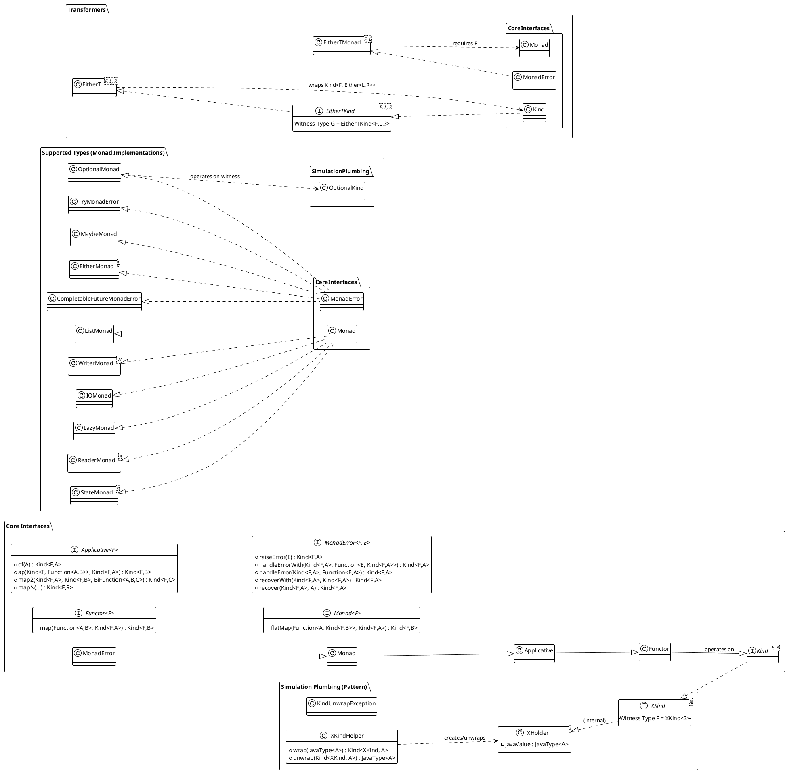

# Welcome to the Java Higher-Kinded Type (HKT) Simulation!

**This simulation was originally created for the blog post [Higher Kinded Types with Java and Scala](https://blog.scottlogic.com/2025/04/11/higher-kinded-types-with-java-and-scala.html) but since then has grown into something bigger**

### Purpose

This library aims to bring Higher-Kinded Functional patterns to Java by providing implementations of common Monads supporting Higher-Kinded Types.

## Introduction: Abstracting Over Computation in Java

Java's powerful type system excels in many areas, but it lacks native support for Higher-Kinded Types (HKTs). This means we cannot easily write code that abstracts over type constructors like `List<A>`, `Optional<A>`, or `CompletableFuture<A>` in the same way we abstract over the type `A` itself. We can't easily define a generic function that works identically for *any* container or computational context (like List, Optional, Future, IO).

This project tackles that challenge by demonstrating a **simulation of HKTs in Java** using a technique inspired by defunctionalisation. It allows you to define and use common functional abstractions like `Functor`, `Applicative`, and `Monad` (including `MonadError`) in a way that works *generically* across different simulated type constructors.

**Why bother?** This simulation unlocks several benefits:

* **Write Abstract Code:** Define functions and logic that operate polymorphically over different computational contexts (e.g., handle optionality, asynchronous operations, error handling, side effects, or collections using the *same* core logic).
* **Leverage Functional Patterns:** Consistently apply powerful patterns like `map`, `flatMap`, `ap`, `sequence`, `traverse`, and monadic error handling (`raiseError`, `handleErrorWith`) across diverse data types.
* **Build Composable Systems:** Create complex workflows and abstractions by composing smaller, generic pieces, as demonstrated in the included [Order Processing Example](order-walkthrough.md).
* **Understand HKT Concepts:** Provides a practical, hands-on way to understand HKTs and type classes even within Java's limitations.

While this simulation introduces some boilerplate compared to languages with native HKT support, it offers a valuable way to explore these powerful functional programming concepts in Java.

## Getting Started

To understand and use this simulation effectively, explore these documents:

1.  **[Core Concepts](core-concepts.md):** Understand the fundamental building blocks – `Kind`, Witness Types, Type Classes (`Functor`, `Monad`, etc.), and the helper classes that bridge the simulation with standard Java types. **Start here!**
2.  **[Supported Types](supported-types.md):** See which Java types (like `List`, `Optional`, `CompletableFuture`) and custom types (`Maybe`, `Either`, `Try`, `IO`, `Lazy`) are currently simulated and have corresponding type class instances.
3.  **[Usage Guide](usage-guide.md):** Learn the practical steps involved in using the simulation: obtaining type class instances, wrapping/unwrapping values using helpers, and applying type class methods (`map`, `flatMap`, etc.).
4.  **[Order Example Walkthrough](order-walkthrough.md):** Dive into a detailed, practical example showcasing how `EitherT` (a monad transformer) combines `CompletableFuture` (for async) and `Either` (for domain errors) to build a robust workflow. This demonstrates a key use case.
5.  **[Extending the Simulation](extending-simulation.md):** Learn the pattern for adding HKT support and type class instances for your *own* custom Java types or other standard library types.

## How to Use This Simulation (In Your Project)

While primarily a demonstration, you could adapt this simulation for use in your own projects:

1.  **Include the Code:** Copy the relevant packages (`org.simulation.hkt` and the packages for the types you need, e.g., `org.simulation.hkt.optional`) into your project's source code.
2.  **Understand the Pattern:** Familiarise yourself with the `Kind` interface, the specific `*Kind` interfaces (e.g., `OptionalKind`), the `*KindHelper` classes (e.g., `OptionalKindHelper`), and the type class instances (e.g., `OptionalMonad`).
3.  **Follow the Usage Guide:** Apply the steps outlined in the [Usage Guide](usage-guide.md) to wrap your Java objects, obtain monad instances, use `map`/`flatMap`/etc., and unwrap the results.
4.  **Extend if Necessary:** If you need HKT simulation for types not included, follow the guide in [Extending the Simulation](extending-simulation.md).

**Note:** This simulation adds a layer of abstraction and associated boilerplate. Consider the trade-offs for your specific project needs compared to directly using the underlying Java types or other functional libraries for Java.

