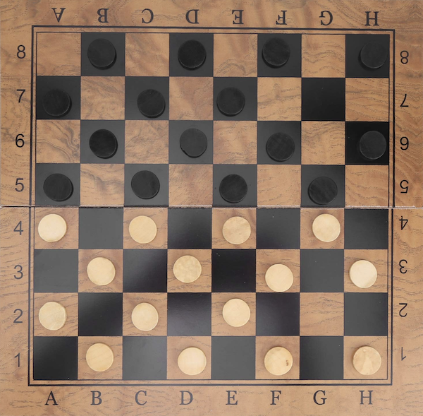
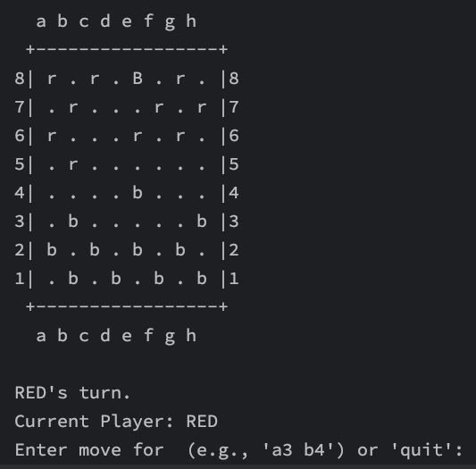

# Building a Playable Draughts Game



This tutorial will guide you through building a complete and playable command-line draughts (checkers) game.

We will provide all the necessary code, broken down into manageable files. More importantly, we will demonstrate how `higher-kinded-j` makes this process more robust, maintainable, and functionally elegant by cleanly separating game logic, user interaction, and state management.

### The Functional Approach

At its core, a game like draughts involves several key aspects where functional patterns can shine:

* **State Management**: The board, the position of pieces, whose turn it is – this is all game state. Managing this immutably can prevent a host of bugs.
* **User Input**: Players will enter moves, which might be valid, invalid, or incorrectly formatted.
* **Game Logic**: Operations like validating a move, capturing a piece, checking for kings, or determining a winner.
* **Side Effects**: Interacting with the console for input and output.

`higher-kinded-j` provides monads that are perfect for these tasks:

* **[`State` Monad](state_monad.md)**: For cleanly managing and transitioning the game state without mutable variables.
* **[`Either` Monad](either_monad.md)**: For handling input parsing and move validation, clearly distinguishing between success and different kinds of errors.
* **[`IO` Monad](io_monad.md)**: For encapsulating side effects like reading from and printing to the console, keeping the core logic pure.
* [`For` Comprehension](https://www.google.com/search?q=for-comprehension.md): To flatten sequences of monadic operations (`flatMap` calls) into a more readable, sequential style.

By using these, we can build a more declarative and composable game.

### The Complete Code

you can find the complete code in the package:

- [`org.higherkindedj.example.draughts`](https://github.com/higher-kinded-j/higher-kinded-j/tree/main/src/main/java/org/higherkindedj/example/draughts)

### Step 1: Core Concepts Quick Recap

Before we write game code, let's briefly revisit *why*`higher-kinded-j` is necessary. Java doesn't let us write, for example, a generic function that works for *any* container `F<A>` (like `List<A>` or `Optional<A>`). `higher-kinded-j` simulates this with:

* **`Kind<F, A>`**: A bridge interface representing a type `A` within a context `F`.
* **Witness Types**: Marker types that stand in for `F` (the type constructor).
* **Type Classes**: Interfaces like `Functor`, `Applicative`, `Monad`, and `MonadError` that define operations (like `map`, `flatMap`, `handleErrorWith`) which work over these `Kind`s.

For a deeper dive, check out the [Core Concepts of Higher-Kinded-J](core-concepts.md) and the [Usage Guide](usage-guide.md).

### Step 2: Defining the Draughts Game State

Our game state needs to track the board, pieces, and current player.
First, we need to define the core data structures of our game. These are simple, immutable records represent the game's state.

```java
// Enum for the two players
enum Player { RED, BLACK }

// Enum for the type of piece
enum PieceType { MAN, KING }

// A piece on the board, owned by a player with a certain type
record Piece(Player owner, PieceType type) {}

// A square on the 8x8 board, identified by row and column
record Square(int row, int col) {
  @Override
  public @NonNull String toString() {
    return "" + (char)('a' + col) + (row + 1);
  }
}

// Represents an error during move parsing or validation
record GameError(String description) {}

// The command to make a move from one square to another
record MoveCommand(Square from, Square to) {}

// The outcome of a move attempt
enum MoveOutcome { SUCCESS, INVALID_MOVE, CAPTURE_MADE, GAME_WON }
record MoveResult(MoveOutcome outcome, String message) {}

```

We can define a `GameState` record:

```java
// The complete, immutable state of the game at any point in time
public record GameState(Map<Square, Piece> board, Player currentPlayer, String message, boolean isGameOver) {

  public static GameState initial() {
    Map<Square, Piece> startingBoard = new HashMap<>();
    // Place BLACK pieces
    for (int r = 0; r < 3; r++) {
      for (int c = (r % 2 != 0) ? 0 : 1; c < 8; c += 2) {
        startingBoard.put(new Square(r, c), new Piece(Player.BLACK, PieceType.MAN));
      }
    }
    // Place RED pieces
    for (int r = 5; r < 8; r++) {
      for (int c = (r % 2 != 0) ? 0 : 1; c < 8; c += 2) {
        startingBoard.put(new Square(r, c), new Piece(Player.RED, PieceType.MAN));
      }
    }
    return new GameState(Collections.unmodifiableMap(startingBoard), Player.RED, "Game started. RED's turn.", false);
  }

   GameState withBoard(Map<Square, Piece> newBoard) {
    return new GameState(Collections.unmodifiableMap(newBoard), this.currentPlayer, this.message, this.isGameOver);
  }

   GameState withCurrentPlayer(Player nextPlayer) {
    return new GameState(this.board, nextPlayer, this.message, this.isGameOver);
  }

   GameState withMessage(String newMessage) {
    return new GameState(this.board, this.currentPlayer, newMessage, this.isGameOver);
  }

  GameState withGameOver() {
    return new GameState(this.board, this.currentPlayer, this.message, true);
  }

   GameState togglePlayer() {
    Player next = (this.currentPlayer == Player.RED) ? Player.BLACK : Player.RED;
    return withCurrentPlayer(next).withMessage(next + "'s turn.");
  }
}

```

We'll use the `State<S, A>` monad from `higher-kinded-j` to manage this `GameState`. A `State<GameState, A>` represents a computation that takes an initial `GameState` and produces a result `A` along with a new, updated `GameState`. Explore the [State Monad documentation](state_monad.md) for more.

### Step 3: Handling User Input with `IO` and `Either`

This class handles reading user input from the console. The `readMoveCommand` method returns an `IO<Either<GameError, MoveCommand>>`. This type signature is very descriptive: it tells us the action is an `IO` side effect, and its result will be either a `GameError` or a valid `MoveCommand`.

```java
class InputHandler {
  private static final Scanner scanner = new Scanner(System.in);

   static Kind<IOKind.Witness, Either<GameError, MoveCommand>> readMoveCommand() {
    return IOKindHelper.IO_OP.delay(() -> {
      System.out.print("Enter move for " + " (e.g., 'a3 b4') or 'quit': ");
      String line = scanner.nextLine();

      if ("quit".equalsIgnoreCase(line.trim())) {
        return Either.left(new GameError("Player quit the game."));
      }

      String[] parts = line.trim().split("\\s+");
      if (parts.length != 2) {
        return Either.left(new GameError("Invalid input. Use 'from to' format (e.g., 'c3 d4')."));
      }
      try {
        Square from = parseSquare(parts[0]);
        Square to = parseSquare(parts[1]);
        return Either.right(new MoveCommand(from, to));
      } catch (IllegalArgumentException e) {
        return Either.left(new GameError(e.getMessage()));
      }
    });
  }

  private static Square parseSquare(String s) throws IllegalArgumentException {
    if (s == null || s.length() != 2) throw new IllegalArgumentException("Invalid square format: " + s);
    char colChar = s.charAt(0);
    char rowChar = s.charAt(1);
    if (colChar < 'a' || colChar > 'h' || rowChar < '1' || rowChar > '8') {
      throw new IllegalArgumentException("Square out of bounds (a1-h8): " + s);
    }
    int col = colChar - 'a';
    int row = rowChar - '1';
    return new Square(row, col);
  }
}

```

Learn more about the [IO Monad](io_monad.md) and [Either Monad](either_monad.md).

---

### Step 4: Game Logic as State Transitions

This is the heart of our application. It contains the rules of draughts. The `applyMove` method takes a `MoveCommand `and returns a `State` computation. This computation, when run, will validate the move against the current `GameState`, and if valid, produce a `MoveResult` and the new `GameState`. _This entire class has no side effects._

```java
public class GameLogicSimple {

  static Kind<StateKind.Witness<GameState>, MoveResult> applyMove(MoveCommand command) {
    return StateKindHelper.STATE.widen(
        State.of(
            currentState -> {
              // Unpack command for easier access
              Square from = command.from();
              Square to = command.to();
              Piece piece = currentState.board().get(from);
              String invalidMsg; // To hold error messages

              // Validate the move based on currentState and command
              //    - Is it the current player's piece?
              //    - Is the move diagonal?
              //    - Is the destination square empty or an opponent's piece for a jump?

              if (piece == null) {
                invalidMsg = "No piece at " + from;
                return new StateTuple<>(
                    new MoveResult(MoveOutcome.INVALID_MOVE, invalidMsg),
                    currentState.withMessage(invalidMsg));
              }
              if (piece.owner() != currentState.currentPlayer()) {
                invalidMsg = "Not your piece.";
                return new StateTuple<>(
                    new MoveResult(MoveOutcome.INVALID_MOVE, invalidMsg),
                    currentState.withMessage(invalidMsg));
              }
              if (currentState.board().containsKey(to)) {
                invalidMsg = "Destination square " + to + " is occupied.";
                return new StateTuple<>(
                    new MoveResult(MoveOutcome.INVALID_MOVE, invalidMsg),
                    currentState.withMessage(invalidMsg));
              }

              int rowDiff = to.row() - from.row();
              int colDiff = to.col() - from.col();

              // Simple move or jump?
              if (Math.abs(rowDiff) == 1 && Math.abs(colDiff) == 1) { // Simple move
                if (piece.type() == PieceType.MAN) {
                  if ((piece.owner() == Player.RED && rowDiff > 0)
                      || (piece.owner() == Player.BLACK && rowDiff < 0)) {
                    invalidMsg = "Men can only move forward.";
                    return new StateTuple<>(
                        new MoveResult(MoveOutcome.INVALID_MOVE, invalidMsg),
                        currentState.withMessage(invalidMsg));
                  }
                }
                return performMove(currentState, command, piece);
              } else if (Math.abs(rowDiff) == 2 && Math.abs(colDiff) == 2) { // Jump move
                Square jumpedSquare =
                    new Square(from.row() + rowDiff / 2, from.col() + colDiff / 2);
                Piece jumpedPiece = currentState.board().get(jumpedSquare);

                if (jumpedPiece == null || jumpedPiece.owner() == currentState.currentPlayer()) {
                  invalidMsg = "Invalid jump. Must jump over an opponent's piece.";
                  return new StateTuple<>(
                      new MoveResult(MoveOutcome.INVALID_MOVE, invalidMsg),
                      currentState.withMessage(invalidMsg));
                }

                return performJump(currentState, command, piece, jumpedSquare);
              } else {
                invalidMsg = "Move must be diagonal by 1 or 2 squares.";
                return new StateTuple<>(
                    new MoveResult(MoveOutcome.INVALID_MOVE, invalidMsg),
                    currentState.withMessage(invalidMsg));
              }
            }));
  }

  private static StateTuple<GameState, MoveResult> performMove(
      GameState state, MoveCommand command, Piece piece) {
    Map<Square, Piece> newBoard = new HashMap<>(state.board());
    newBoard.remove(command.from());
    newBoard.put(command.to(), piece);

    GameState movedState = state.withBoard(newBoard);
    GameState finalState = checkAndKingPiece(movedState, command.to());

    return new StateTuple<>(
        new MoveResult(MoveOutcome.SUCCESS, "Move successful."), finalState.togglePlayer());
  }

  private static StateTuple<GameState, MoveResult> performJump(
      GameState state, MoveCommand command, Piece piece, Square jumpedSquare) {
    Map<Square, Piece> newBoard = new HashMap<>(state.board());
    newBoard.remove(command.from());
    newBoard.remove(jumpedSquare);
    newBoard.put(command.to(), piece);

    GameState jumpedState = state.withBoard(newBoard);
    GameState finalState = checkAndKingPiece(jumpedState, command.to());

    // Check for win condition
    boolean blackWins =
        finalState.board().values().stream().noneMatch(p -> p.owner() == Player.RED);
    boolean redWins =
        finalState.board().values().stream().noneMatch(p -> p.owner() == Player.BLACK);

    if (blackWins || redWins) {
      String winner = blackWins ? "BLACK" : "RED";
      return new StateTuple<>(
          new MoveResult(MoveOutcome.GAME_WON, winner + " wins!"),
          finalState.withGameOver().withMessage(winner + " has captured all pieces!"));
    }

    return new StateTuple<>(
        new MoveResult(MoveOutcome.CAPTURE_MADE, "Capture successful."), finalState.togglePlayer());
  }

  private static GameState checkAndKingPiece(GameState state, Square to) {
    Piece piece = state.board().get(to);
    if (piece != null && piece.type() == PieceType.MAN) {
      // A RED piece is kinged on row index 0 (the "1st" row).
      // A BLACK piece is kinged on row index 7 (the "8th" row).
      if ((piece.owner() == Player.RED && to.row() == 0)
          || (piece.owner() == Player.BLACK && to.row() == 7)) {
        Map<Square, Piece> newBoard = new HashMap<>(state.board());
        newBoard.put(to, new Piece(piece.owner(), PieceType.KING));
        return state
            .withBoard(newBoard)
            .withMessage(piece.owner() + "'s piece at " + to + " has been kinged!");
      }
    }
    return state;
  }
}
```

This uses `State.of` to create a stateful computation. `State.get()`, `State.set()`, and `State.modify()` are other invaluable tools from the State monad.

---

### Step 5: Composing with `flatMap` - The Monadic Power

Now, we combine these pieces. The main loop needs to:

1. Display the board (`IO`).
2. Read user input (`IO`).
3. If the input is valid, apply it to the game logic (`State`).
4. Loop with the new game state.

This sequence of operations is a goodt use case for a `For` comprehension to improve on nested `flatMap` calls.

```java

public class Draughts {

  private static final IOMonad ioMonad = IOMonad.INSTANCE;
  
  // Processes a single turn of the game
  private static Kind<IOKind.Witness, GameState> processTurn(GameState currentGameState) {
  
    // 1. Use 'For' to clearly sequence the display and read actions.
    var sequence = For.from(ioMonad, BoardDisplay.displayBoard(currentGameState))
        .from(ignored -> InputHandler.readMoveCommand())
        .yield((ignored, eitherResult) -> eitherResult); // Yield the result of the read action

    // 2. The result of the 'For' is an IO<Either<...>>.
    //    Now, flatMap that single result to handle the branching.
    return ioMonad.flatMap(
        eitherResult ->
            eitherResult.fold(
                error -> { // Left case: Input error
                  return IOKindHelper.IO_OP.delay(
                      () -> {
                        System.out.println("Error: " + error.description());
                        return currentGameState;
                      });
                },
                moveCommand -> { // Right case: Valid input
                  var stateComputation = GameLogic.applyMove(moveCommand);
                  var resultTuple = StateKindHelper.STATE.runState(stateComputation, currentGameState);
                  return ioMonad.of(resultTuple.state());
                }),
        sequence);
  }

  
  // other methods....
}

```

The `For` comprehension flattens the `display -> read` sequence, making the primary workflow more declarative and easier to read than nested callbacks.


The [Order Processing Example](order-walkthrough.md) in the `higher-kinded-j` docs shows a more complex scenario using `CompletableFuture` and `EitherT`, which is a great reference for getting started with monad transformers.

---

### Step 6: The Game Loop

```java

public class Draughts {

  private static final IOMonad ioMonad = IOMonad.INSTANCE;

  // The main game loop as a single, recursive IO computation
  private static Kind<IOKind.Witness, Unit> gameLoop(GameState gameState) {
    if (gameState.isGameOver()) {
      // Base case: game is over, just display the final board and message.
      return BoardDisplay.displayBoard(gameState);
    }

    // Recursive step: process one turn and then loop with the new state
    return ioMonad.flatMap(Draughts::gameLoop, processTurn(gameState));
  }

  // processTurn as before....

  public static void main(String[] args) {
    // Get the initial state
    GameState initialState = GameState.initial();
    // Create the full game IO program
    Kind<IOKind.Witness, Unit> fullGame = gameLoop(initialState);
    // Execute the program. This is the only place where side effects are actually run.
    IOKindHelper.IO_OP.unsafeRunSync(fullGame);
    System.out.println("Thank you for playing!");
  }
}

```

Key methods like `IOKindHelper.IO_OP.unsafeRunSync()` and `StateKindHelper.STATE.runState()` are used to execute the monadic computations at the "edge" of the application.

### Step 7: Displaying the Board

A simple text representation will do the trick.
This class is responsible for rendering the GameState to the console. Notice how the displayBoard method doesn't perform the printing directly; it returns an `IO<Unit>` which is a description of the printing action. This keeps the method pure.

```java

public class BoardDisplay {

  public static Kind<IOKind.Witness, Unit> displayBoard(GameState gameState) {
    return IOKindHelper.IO_OP.delay(
        () -> {
          System.out.println("\n  a b c d e f g h");
          System.out.println(" +-----------------+");
          for (int r = 7; r >= 0; r--) { // Print from row 8 down to 1
            System.out.print((r + 1) + "| ");
            for (int c = 0; c < 8; c++) {
              Piece p = gameState.board().get(new Square(r, c));
              if (p == null) {
                System.out.print(". ");
              } else {
                char pieceChar = (p.owner() == Player.RED) ? 'r' : 'b';
                if (p.type() == PieceType.KING) pieceChar = Character.toUpperCase(pieceChar);
                System.out.print(pieceChar + " ");
              }
            }
            System.out.println("|" + (r + 1));
          }
          System.out.println(" +-----------------+");
          System.out.println("  a b c d e f g h");
          System.out.println("\n" + gameState.message());
          if (!gameState.isGameOver()) {
            System.out.println("Current Player: " + gameState.currentPlayer());
          }
          return Unit.INSTANCE;
        });
  }
}

```

### Playing the game



In the game we can see the black has "kinged" a piece by reaching `e8`.  

### Step 8: Refactoring for Multiple Captures

A key rule in draughts is that if a capture is available, it must be taken, and if a capture leads to another possible capture for the same piece, that jump must also be taken.

The beauty of our functional approach is that we only need to modify the core rules in `GameLogic.java`. `The Draughts.java` game loop, the IO handlers, and the data models don't need to change at all.

The core idea is to modify the `performJump` method. After a jump is completed, we will check if the piece that just moved can make another jump from its new position.

We do this by adding a helper `canPieceJump` and modify `performJump` to check for subsequent jumps. 

If another jump is possible, the player's turn does not end., we will update the board state but not switch the current player, forcing them to make another capture.
If another jump is not possible, we will switch the player as normal.

```java

/** Check if a piece at a given square has any valid jumps. */
  private static boolean canPieceJump(GameState state, Square from) {
    Piece piece = state.board().get(from);
    if (piece == null) return false;

    int[] directions = {-2, 2};
    for (int rowOffset : directions) {
      for (int colOffset : directions) {
        if (piece.type() == PieceType.MAN) {
          if ((piece.owner() == Player.RED && rowOffset > 0)
              || (piece.owner() == Player.BLACK && rowOffset < 0)) {
            continue; // Invalid forward direction for man
          }
        }

        Square to = new Square(from.row() + rowOffset, from.col() + colOffset);
        if (to.row() < 0
            || to.row() > 7
            || to.col() < 0
            || to.col() > 7
            || state.board().containsKey(to)) {
          continue; // Off board or destination occupied
        }

        Square jumpedSquare = new Square(from.row() + rowOffset / 2, from.col() + colOffset / 2);
        Piece jumpedPiece = state.board().get(jumpedSquare);
        if (jumpedPiece != null && jumpedPiece.owner() != piece.owner()) {
          return true; // Found a valid jump
        }
      }
    }
    return false;
  }

  /** Now it checks for further jumps after a capture. */
  private static StateTuple<GameState, MoveResult> performJump(
      GameState state, MoveCommand command, Piece piece, Square jumpedSquare) {
    // Perform the jump and update board
    Map<Square, Piece> newBoard = new HashMap<>(state.board());
    newBoard.remove(command.from());
    newBoard.remove(jumpedSquare);
    newBoard.put(command.to(), piece);
    GameState jumpedState = state.withBoard(newBoard);

    // Check for kinging after the jump
    GameState stateAfterKinging = checkAndKingPiece(jumpedState, command.to());

    // Check for win condition after the capture
    boolean blackWins =
        !stateAfterKinging.board().values().stream().anyMatch(p -> p.owner() == Player.RED);
    boolean redWins =
        !stateAfterKinging.board().values().stream().anyMatch(p -> p.owner() == Player.BLACK);
    if (blackWins || redWins) {
      String winner = blackWins ? "BLACK" : "RED";
      return new StateTuple<>(
          new MoveResult(MoveOutcome.GAME_WON, winner + " wins!"),
          stateAfterKinging.withGameOver().withMessage(winner + " has captured all pieces!"));
    }

    // Check if the same piece can make another jump
    boolean anotherJumpPossible = canPieceJump(stateAfterKinging, command.to());

    if (anotherJumpPossible) {
      // If another jump exists, DO NOT toggle the player.
      // Update the message to prompt for the next jump.
      String msg = "Capture successful. You must jump again with the same piece.";
      return new StateTuple<>(
          new MoveResult(MoveOutcome.CAPTURE_MADE, msg), stateAfterKinging.withMessage(msg));
    } else {
      // No more jumps, so end the turn and toggle the player.
      return new StateTuple<>(
          new MoveResult(MoveOutcome.CAPTURE_MADE, "Capture successful."),
          stateAfterKinging.togglePlayer());
    }
  }

```

### Why This Functional Approach is Better

Having seen the complete code, let's reflect on the benefits:

* **Testability**: The `GameLogic` class is completely pure. It has no side effects and doesn't depend on `System.in` or `System.out`. You can test the entire rules engine by simply providing a `GameState` and a `MoveCommand` and asserting on the resulting `GameState` and `MoveResult`. This is significantly easier than testing code that is tangled with console I/O.
* **Composability**: The `gameLoop` in `Draughts.java` is a beautiful example of composition. It clearly and declaratively lays out the sequence of events for a game turn: `display -> read -> process`. The `flatMap` calls hide all the messy details of passing state and results from one step to the next.
* **Reasoning**: The type signatures tell a story. `IO<Either<GameError, MoveCommand>>` is far more descriptive than a method that returns a `MoveCommand` but might throw an exception or return `null`. It explicitly forces the caller to handle both the success and error cases.
* **Maintainability**: If you want to change from a command-line interface to a graphical one, you only need to replace `BoardDisplay` and `InputHandler`. The entire core `GameLogic` remains untouched because it's completely decoupled from the presentation layer.

This tutorial has only scratched the surface. You could extend this by exploring other constructs from the library, like using `Validated` to accumulate multiple validation errors or using the `Reader` monad to inject different sets of game rules.

Java may not have native HKTs, but with [**Higher-Kinded-J**](https://higher-kinded-j.github.io/home.html), you can absolutely utilise these powerful and elegant functional patterns to write better, more robust applications.
