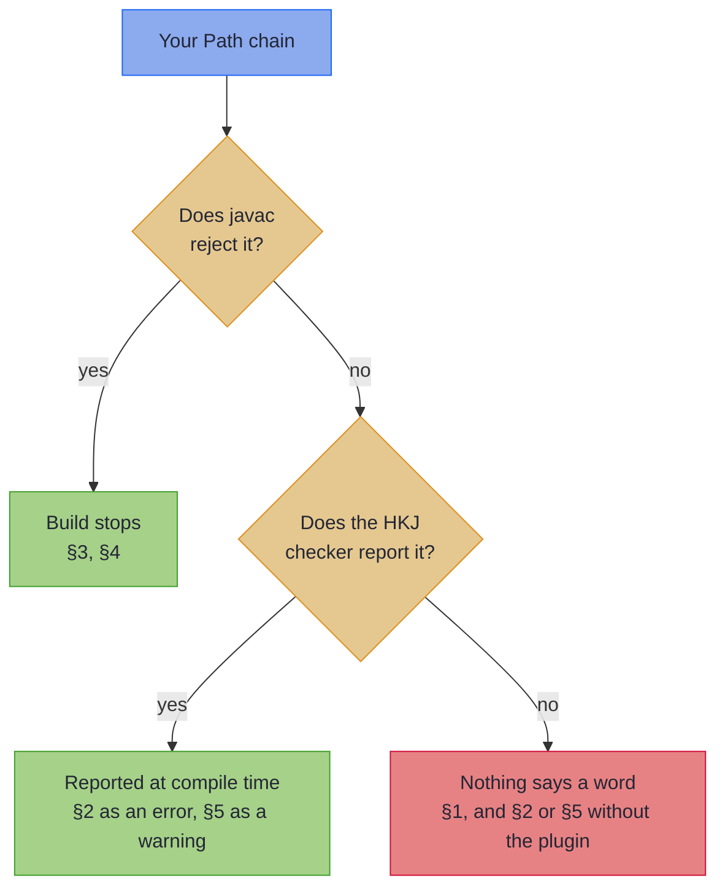

# Common Compiler Errors

Java's type inference works well for most Effect Path usage, but generic-heavy code occasionally produces confusing messages. This page covers the five things that most often go wrong. Find your symptom in the table below and follow it to its section.

~~~admonish info title="What You'll Learn"
- Which Path mistakes javac catches, which the HKJ checker catches, and which nothing catches
- How to pin the error type `E` so it never silently becomes `Object`
- How to convert at the boundary when a step returns the wrong kind of Path
- When to reach for `map` rather than `via`, and how to unblock a lambda javac cannot infer
~~~

~~~admonish warning title="Three of these five compile cleanly"
The compiler is not your safety net on this page.

- **§3 and §4 are javac errors.** The build stops, and the message is quoted in the section.
- **§2 and §5 compile.** The HKJ compile-time checker reports them if you use the build plugin: `path-type-mismatch` as an error, `error-type-mismatch` as a warning. Without the plugin the first sign is an `IllegalArgumentException` or a `ClassCastException` in production. See [Compile-Time Checks](../tooling/compile_checks.md) for setup and the full catalogue.
- **§1 compiles, and nothing reports it.** `E` becomes `Object` and stays there.

Each silent case carries a snippet the book's build compiles, asserting that it still compiles. A change that makes one of them loud again fails that build rather than passing in silence.
~~~

---

## Find your message

| The symptom | What it is | Caught by |
|-------------|------------|-----------|
| [`Path.right`/`left` silently gets `E = Object`](#1-the-phantom-error-type-e-on-pathright) | `E` is unconstrained, so javac defaults it | Nothing. Add the witness yourself |
| [`IllegalArgumentException` from `via`, with no compile error](#2-a-step-that-returns-the-wrong-kind-of-path) | A step returns a different Path kind | The `path-type-mismatch` check |
| [`method via is not applicable`](#3-method-via-is-not-applicable-for-the-arguments) | The function returns a plain value, not a Path | javac |
| [`lambda body is neither value nor void compatible`](#4-lambda-body-is-neither-value-nor-void-compatible) | A lambda's branches return different types | javac |
| [Wrong error type at runtime, with no compile error](#5-the-error-type-is-silently-erased-across-a-chain) | `E` is erased across a chain step | The `error-type-mismatch` check, as a warning |

Which line of defence answers depends on the mistake:



---

## 1. The phantom error type `E` on `Path.right(...)`

**This compiles, and nothing reports it.** `Path.right(value)` carries `E` only in its return type. When the context constrains `E`, javac binds it; when nothing does, javac resolves `E` to `java.lang.Object` and says nothing.

**The trigger:**

<!-- verify -->
```java
EitherPath<AppError, User> findUser(String id) {
    User user = repository.findById(id);
    return Path.right(user);  // E bound to AppError by the return type: fine
}

var p = Path.right(user);     // nothing constrains E, so E = Object, and it compiles
```

**The fix:** pin `E` explicitly, so the intent is recorded and `Object` never leaks in:

<!-- verify -->
```java
EitherPath<AppError, User> pinned = Path.<AppError, User>right(user);
```

~~~admonish note title="When the witness matters" collapsible=true
With a clear target type the witness is optional:

<!-- verify -->
```java
EitherPath<AppError, User> path = Path.right(user);   // E = AppError, from the variable

EitherPath<AppError, User> chained =
    Path.<AppError, String>right(userId)
        .via(id -> Path.right(loadUser(id)));         // E from the previous step
```

Without one, `E` becomes `Object` silently:

<!-- verify -->
```java
var path = Path.right(user);                          // E = Object: add the witness
```

The witness costs nothing at runtime and keeps the error type honest.
~~~

~~~admonish note title="Why it is silent, and what older write-ups said" collapsible=true
Older write-ups described a `cannot infer type-variable(s) E` error here:

```
error: cannot infer type arguments for right(A)
  reason: cannot infer type-variable(s) E
```

On the supported compiler, the modern `javac` the HKJ build plugin targets, this does not happen. The code compiles. That is the more dangerous outcome, because the mistake is now silent rather than loud.

When `E` defaults to `Object`, later code expecting a specific error type either fails to type-check at the *consumer*, as an ordinary incompatible-types error somewhere else, or has its real error type erased inside a chain. See [§5](#5-the-error-type-is-silently-erased-across-a-chain).

The HKJ compile-time checker does not flag the bare `E = Object` default, because it is not reliably distinguishable from code that means `EitherPath<Object, …>`. It does flag the related hazard in §5, through the `error-type-mismatch` check.
~~~

---

## 2. A step that returns the wrong kind of Path

**This compiles, and throws at runtime.** `via` takes a `Function<? super A, ? extends Chainable<B>>`, and every Path type is a `Chainable`, so *which* Path a step returns is not part of the signature. `via` checks the kind at runtime and throws `IllegalArgumentException`.

**The trigger:**

<!-- verify -->
```java
MaybePath<User> findUser(String id) {
    return Path.maybe(loadUser(id));
}

EitherPath<AppError, String> result =
    Path.<AppError, String>right(userId)
        .via(id -> findUser(id))               // returns MaybePath, not EitherPath
        .map(User::name);
```

**The fix:** convert at the boundary with `toEitherPath`, which turns `Nothing` into a `Left` carrying the error you provide.

<!-- verify -->
```java
EitherPath<AppError, String> result =
    Path.<AppError, String>right(userId)
        .via(id -> Path.maybe(loadUser(id))
            .<AppError>toEitherPath(new AppError.UserNotFound(id)))  // MaybePath -> EitherPath
        .map(User::name);
```

### Common conversions

| From | To | Method |
|------|----|--------|
| `MaybePath<A>` | `EitherPath<E, A>` | `.toEitherPath(errorValue)`, `.toEitherPath(errorSupplier)` |
| `TryPath<A>` | `EitherPath<E, A>` | `.toEitherPath(exceptionMapper)` |
| `EitherPath<E, A>` | `MaybePath<A>` | `.toMaybePath()` |
| `ValidationPath<E, A>` | `EitherPath<E, A>` | `.toEitherPath()` |

~~~admonish tip title="The HKJ checker catches this"
With the build plugin, the `path-type-mismatch` check reports it at compile time, with an actionable message at the call site. See [Compile-Time Checks](../tooling/compile_checks.md).
~~~

~~~admonish note title="What older write-ups said" collapsible=true
Older write-ups described javac rejecting this:

```
error: incompatible types: MaybePath<User> cannot be converted to EitherPath<AppError,User>
    .via(id -> Path.maybe(findUser(id)))
                   ^
```

It does not. An `EitherPath` chain does expect `via` to return an `EitherPath`, but nothing in the signature says so, which is why the mistake reaches runtime.
~~~

---

## 3. "Method via is not applicable for the arguments"

**A javac error.** `via` is the Effect Path equivalent of `flatMap`, so it requires a function returning a `Chainable`, which every Path type implements. A function returning a plain value needs `map`.

**The error:**

```
error: method via in class EitherPath<E,A> cannot be applied to given types;
    .via(this::processOrder)
         ^
  required: Function<? super Order, ? extends Chainable<B>>
  found: method reference this::processOrder
```

**The trigger:**

<!-- verify:rejects "cannot be applied to given types" -->
```java
// processOrder returns the wrong type
String processOrder(Order order) {    // returns String, not a Path
    return order.id();
}

EitherPath<AppError, String> chained =
    Path.<AppError, Order>right(order)
        .via(this::processOrder);     // via needs a Path-returning function
```

**The fix:** use `map` for plain transformations and `via` for Path-returning functions.

<!-- verify -->
```java
// For plain transformations: use map
EitherPath<AppError, String> mapped =
    Path.<AppError, Order>right(order)
        .map(this::processOrder);              // map: A -> B

// For Path-returning functions: use via
EitherPath<AppError, Order> chained =
    Path.<AppError, Order>right(order)
        .via(this::validateAndProcessOrder);   // via: A -> Path<B>
```

**Rule of thumb:**

- `map`: your function takes `A` and returns `B`
- `via`: your function takes `A` and returns a `Path<B>`, of any Path type that matches the chain

~~~admonish tip title="The HKJ checker catches this too"
The `via-non-path` check is the companion to javac's own error, and carries the actionable "use `map` for a plain transformation" message. See [Compile-Time Checks](../tooling/compile_checks.md).
~~~

---

## 4. "Lambda body is neither value nor void compatible"

**A javac error.** A lambda whose branches do not all return a value of the same type gives javac nothing to infer `B` from.

**The error:**

```
error: lambda body is neither value nor void compatible
    .map(o -> {
         ^
error: method map in class EitherPath<E,A> cannot be applied to given types;
  required: Function<? super Order,? extends B>
  reason: cannot infer type-variable(s) B
    (argument mismatch; bad return type in lambda expression
      missing return value)
```

**The trigger:**

<!-- verify:rejects "lambda body is neither value nor void compatible" -->
```java
EitherPath<AppError, Double> total =
    Path.<AppError, Order>right(order)
        .map(o -> {
            if (o.isValid()) {
                return o.total();    // returns Double
            }
            // missing return: compiler cannot determine B
        });
```

**The fix:** make every branch return the same type, or give the parameter an explicit type.

<!-- verify -->
```java
// Fix 1: ensure all branches return the same type
EitherPath<AppError, Double> total =
    Path.<AppError, Order>right(order)
        .map(o -> {
            if (o.isValid()) {
                return o.total();
            }
            return 0.0;              // all branches return Double
        });

// Fix 2: add explicit types when inference fails
EitherPath<AppError, Double> explicit =
    Path.<AppError, Order>right(order)
        .map((Order o) -> o.total());
```

Two things bring this on: a lambda with branches of different return types, or one branch missing altogether, and a lambda parameter whose type cannot be inferred in a complex chain. In long chains where inference struggles, lifting the lambda into a named method usually settles it:

<!-- verify -->
```java
private Double extractTotal(Order order) {
    return order.isValid() ? order.total() : 0.0;
}

// Method reference: no inference needed
EitherPath<AppError, Double> total =
    Path.<AppError, Order>right(order)
        .map(this::extractTotal);
```

---

## 5. The error type is silently erased across a chain

**This compiles, and that is the bug.** `via`, `flatMap` and `then` accept a `Function` or `Supplier` of `? extends Chainable<B>`, and `zipWith` a `Combinable<B>`. None of those carries the error type. A step whose `E` differs from the chain's compiles cleanly, and the wrong error type is carried at runtime, surfacing as a `ClassCastException` when the error is consumed.

**The trigger:**

<!-- verify -->
```java
// lookupUser returns EitherPath<String, User>, which is the wrong error type
EitherPath<String, User> lookupUser(String id) {
    return id.isEmpty()
        ? Path.<String, User>left("User not found")   // error type is String
        : Path.<String, User>right(new User(id));
}

EitherPath<AppError, String> validated = validateInput(input);

// String erased; the result is typed AppError, and is not
EitherPath<AppError, User> wrong = validated.via(id -> lookupUser(id));
```

**The fix:** unify the error type, or convert it with `mapError`.

<!-- verify -->
```java
// Option 1: change lookupUser to use AppError
EitherPath<AppError, User> lookupUser(String id) {
    return id.isEmpty()
        ? Path.<AppError, User>left(new AppError.NotFound("User not found"))
        : Path.<AppError, User>right(new User(id));
}

// Option 2: convert the error type at the boundary
EitherPath<String, User> lookupByName(String id) {
    return Path.<String, User>right(new User(id));
}

EitherPath<AppError, String> validated = validateInput(input);

EitherPath<AppError, User> converted =
    validated.via(id -> lookupByName(id)
        .mapError(msg -> new AppError.NotFound(msg)));  // String -> AppError
```

Option 1 is preferred for new code. Option 2 is useful when integrating with existing methods you cannot change.

~~~admonish info title="Tooling catches this"
The `error-type-mismatch` check reports the silent mismatch, as a **warning** by default, since the compiler itself accepts the code. It fires when the receiver and the step are the same error-typed Path category and the step's `E` is not assignable to the chain's. See [Compile-Time Checks](../tooling/compile_checks.md).
~~~

~~~admonish note title="What older write-ups said" collapsible=true
This case was previously documented as a compile error:

```
error: incompatible types: EitherPath<String,User> cannot be converted to
    EitherPath<AppError,User>
```

On the supported compiler it is not an error. Every step in an `EitherPath` chain is *meant* to share one error type `E`, but the chain signatures erase it through `Chainable<B>`, so the compiler will not enforce it for you.
~~~

---

~~~admonish info title="Key Takeaways"
* **Only two of the five are javac errors.** For the rest, the build plugin's compile-time checks are what stands between you and a production exception.
* **Pin `E` at the source.** `Path.<E, A>right(...)` costs nothing at runtime and stops `Object` leaking into an error type nothing will notice.
* **`via` does not check which Path you hand back.** Every Path is a `Chainable`, so convert at the boundary with `toEitherPath` or `toMaybePath` rather than trusting the signature.
* **`map` transforms, `via` chains.** A function returning a plain value belongs in `map`; one returning a Path belongs in `via`.
* **A chain's error type is a convention, not a constraint.** Unify `E` across steps, or convert with `mapError` where you cannot.
~~~

~~~admonish tip title="See Also"
- [Compile-Time Checks](../tooling/compile_checks.md): the checks that report the silent cases, with setup and configuration
- [Optics Compiler Errors](../optics/compiler_errors.md#generatepathbridge-and-pathvia): what `@GeneratePathBridge` and `@PathVia` report, and why
- [Type Conversions](conversions.md): full reference for converting between Path types
- [Troubleshooting](../tutorials/troubleshooting.md): tutorial-specific issues (Kind types, annotation processors, IDE setup)
- [Cheat Sheet](../cheatsheet.md): quick reference for Path types and operators
~~~

---

**Previous:** [Type Conversions](conversions.md)
**Next:** [Production Readiness](production_readiness.md)
