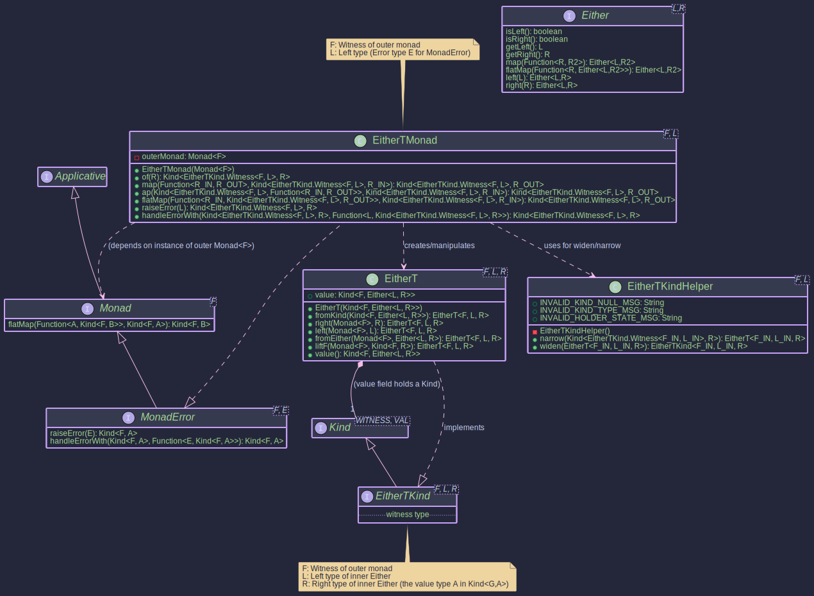

# EitherT - Combining Monadic Effects

## `EitherT` Monad Transformer.



## `EitherT<F, L, R>`: Combining any Monad `F` with `Either<L, R>`

The `EitherT` monad transformer allows you to combine the error-handling capabilities of `Either<L, R>` with another outer monad `F`. It transforms a computation that results in `Kind<F, Either<L, R>>` into a single monadic structure that can be easily composed. This is particularly useful when dealing with operations that can fail (represented by `Left<L>`) within an effectful context `F` (like asynchronous operations using `CompletableFutureKind` or computations involving state with `StateKind`).

* **`F`**: The witness type of the **outer monad** (e.g., `CompletableFutureKind.Witness`, `OptionalKind.Witness`). This monad handles the primary effect (e.g., asynchronicity, optionality).
* **`L`**: The **Left type** of the inner `Either`. This typically represents the *error* type for the computation or alternative result.
* **`R`**: The **Right type** of the inner `Either`. This typically represents the *success* value type.

```java
public record EitherT<F, L, R>(@NonNull Kind<F, Either<L, R>> value) { 
  /* ... static factories ... */ }
```

It holds a value of type `Kind<F, Either<L, R>>`. The real power comes from its associated type class instance, `EitherTMonad`.

Essentially, `EitherT<F, L, R>` wraps a value of type `Kind<F, Either<L, R>>`. It represents a computation within the context `F` that will eventually yield an `Either<L, R>`.

The primary goal of `EitherT` is to provide a unified `Monad` interface (specifically `MonadError` for the `L` type) for this nested structure, hiding the complexity of manually handling both the outer `F` context and the inner `Either` context.

## `EitherTKind<F, L, R>`: The Witness Type

Just like other types in the Higher-Kinded-J, `EitherT` needs a corresponding `Kind` interface to act as its witness type in generic functions. This is `EitherTKind<F, L, R>`. 

* It extends `Kind<G, R>` where `G` (the witness for the combined monad) is `EitherTKind.Witness<F, L>`.
* `F` and `L` are fixed for a specific `EitherT` context, while `R` is the variable type parameter `A` in `Kind<G, A>`.

You'll primarily interact with this type when providing type signatures or receiving results from `EitherTMonad` methods.

## `EitherTKindHelper` 
* Provides widen and narrow methods to safely convert between the concrete `EitherT<F, L, R>` and its Kind representation (`Kind<EitherTKind<F, L, ?>, R>`).

## `EitherTMonad<F, L>`: Operating on `EitherT`

* The EitherTMonad class implements `MonadError<EitherTKind.Witness<F, L>, L>`.

- It requires a Monad<F> instance for the outer monad F to be provided during construction. This outer monad instance is used internally to handle the effects of `F`.
- It uses `EITHER_T.widen` and `EITHER_T.narrow` internally to manage the conversion between the `Kind` and the concrete `EitherT`.
- The error type E for MonadError is fixed to L, the 'Left' type of the inner Either. Error handling operations like `raiseError(L l)` will create an `EitherT` representing `F<Left(l)>`, and `handleErrorWith` allows recovering from such Left states.


```java
// Example: F = CompletableFutureKind.Witness, L = DomainError
// 1. Get the MonadError instance for the outer monad F
MonadError<CompletableFutureKind.Witness, Throwable> futureMonad = new CompletableFutureMonadError();

// 2. Create the EitherTMonad, providing the outer monad instance
//    This EitherTMonad handles DomainError for the inner Either.
MonadError<EitherTKind.Witness<CompletableFutureKind.Witness, DomainError>, DomainError> eitherTMonad =
    new EitherTMonad<>(futureMonad);

// Now 'eitherTMonad' can be used to operate on Kind<EitherTKind.Witness<CompletableFutureKind.Witness, DomainError>, A> values.
```


~~~admonish info title="Key Operations with _EitherTMonad_:"
* **`eitherTMonad.of(value)`:** Lifts a pure value `A` into the `EitherT` context. Result: `F<Right(A)>`.
* **`eitherTMonad.map(f, eitherTKind)`:** Applies function `A -> B` to the `Right` value inside the nested structure, preserving both `F` and `Either` contexts (if Right). Result: `F<Either<L, B>>`.
* **`eitherTMonad.flatMap(f, eitherTKind)`:** The core sequencing operation. Takes a function `A -> Kind<EitherTKind.Witness<F, L>, B>` (i.e., `A -> EitherT<F, L, B>`). It unwraps the input `EitherT`, handles the `F` context, checks the inner `Either`:
  * If `Left(l)`, it propagates `F<Left(l)>`.
  * If `Right(a)`, it applies `f(a)` to get the next `EitherT<F, L, B>`, and extracts its inner `Kind<F, Either<L, B>>`, effectively chaining the `F` contexts and the `Either` logic.
* **`eitherTMonad.raiseError(errorL)`:** Creates an `EitherT` representing a failure in the inner `Either`. Result: `F<Left(L)>`.
* **`eitherTMonad.handleErrorWith(eitherTKind, handler)`:** Handles a failure `L` from the *inner* `Either`. Takes a handler `L -> Kind<EitherTKind.Witness<F, L>, A>`. It unwraps the input `EitherT`, checks the inner `Either`:
  * If `Right(a)`, propagates `F<Right(a)>`.
  * If `Left(l)`, applies `handler(l)` to get a recovery `EitherT<F, L, A>`, and extracts its inner `Kind<F, Either<L, A>>`.
~~~


~~~admonish title="Creating _EitherT_ Instances"
You typically create `EitherT` instances using its static factory methods, providing the necessary outer `Monad<F>` instance:

```java
// Assume:
Monad<OptionalKind.Witness> optMonad = OptionalMonad.INSTANCE; // Outer Monad F=Optional
String errorL = "FAILED";
String successR = "OK";
Integer otherR = 123;

// 1. Lifting a pure 'Right' value: Optional<Right(R)>
EitherT<OptionalKind.Witness, String, String> etRight = EitherT.right(optMonad, successR);
// Resulting wrapped value: Optional.of(Either.right("OK"))

// 2. Lifting a pure 'Left' value: Optional<Left(L)>
EitherT<OptionalKind.Witness, String, Integer> etLeft = EitherT.left(optMonad, errorL);
// Resulting wrapped value: Optional.of(Either.left("FAILED"))

// 3. Lifting a plain Either: Optional<Either(input)>
Either<String, String> plainEither = Either.left(errorL);
EitherT<OptionalKind.Witness, String, String> etFromEither = EitherT.fromEither(optMonad, plainEither);
// Resulting wrapped value: Optional.of(Either.left("FAILED"))

// 4. Lifting an outer monad value F<R>: Optional<Right(R)>
Kind<OptionalKind.Witness, Integer> outerOptional = OPTIONAL.widen(Optional.of(otherR));
EitherT<OptionalKind.Witness, String, Integer> etLiftF = EitherT.liftF(optMonad, outerOptional);
// Resulting wrapped value: Optional.of(Either.right(123))

// 5. Wrapping an existing nested Kind: F<Either<L, R>>
Kind<OptionalKind.Witness, Either<String, String>> nestedKind =
    OPTIONAL.widen(Optional.of(Either.right(successR)));
EitherT<OptionalKind.Witness, String, String> etFromKind = EitherT.fromKind(nestedKind);
// Resulting wrapped value: Optional.of(Either.right("OK"))

// Accessing the wrapped value:
Kind<OptionalKind.Witness, Either<String, String>> wrappedValue = etRight.value();
Optional<Either<String, String>> unwrappedOptional = OPTIONAL.narrow(wrappedValue);
// unwrappedOptional is Optional.of(Either.right("OK"))
```
~~~

----

~~~admonish Example title="Async Workflow with Error Handling"

- [EitherTExample.java](https://github.com/higher-kinded-j/higher-kinded-j/tree/main/src/main/java/org/higherkindedj/example/basic/either_t/EitherTExample.java)

The most common use case for `EitherT` is combining asynchronous operations (`CompletableFuture`) with domain error handling (`Either`).  The `OrderWorkflowRunner` class provides a detailed example.

Here's a simplified conceptual structure based on that example:

```java
public class EitherTExample {

  // --- Setup ---

  // Assume DomainError is a sealed interface for specific errors
  // Re-defining a local DomainError to avoid dependency on the full DomainError hierarchy for this isolated example.
  // In a real scenario, you would use the shared DomainError.
  record DomainError(String message) {}
  record ValidatedData(String data) {}
  record ProcessedData(String data) {}

  MonadError<CompletableFutureKind.Witness, Throwable> futureMonad = new CompletableFutureMonadError();
  MonadError<EitherTKind.Witness<CompletableFutureKind.Witness, DomainError>, DomainError> eitherTMonad =
          new EitherTMonad<>(futureMonad);

  // --- Workflow Steps (returning Kinds) ---

  // Simulates a sync validation returning Either
  Kind<EitherKind.Witness<DomainError>, ValidatedData> validateSync(String input) {
    System.out.println("Validating synchronously...");
    if (input.isEmpty()) {
      return EITHER.widen(Either.left(new DomainError("Input empty")));
    }
    return EITHER.widen(Either.right(new ValidatedData("Validated:" + input)));
  }

  // Simulates an async processing step returning Future<Either>
  Kind<CompletableFutureKind.Witness, Either<DomainError, ProcessedData>> processAsync(ValidatedData vd) {
    System.out.println("Processing asynchronously for: " + vd.data());
    CompletableFuture<Either<DomainError, ProcessedData>> future =
            CompletableFuture.supplyAsync(() -> {
              try {
                Thread.sleep(50);
              } catch (InterruptedException e) { /* ignore */ }
              if (vd.data().contains("fail")) {
                return Either.left(new DomainError("Processing failed"));
              }
              return Either.right(new ProcessedData("Processed:" + vd.data()));
            });
    return FUTURE.widen(future);
  }

  // Function to run the workflow for given input
  Kind<CompletableFutureKind.Witness, Either<DomainError, ProcessedData>> runWorkflow(String initialInput) {

    // Start with initial data lifted into EitherT
    Kind<EitherTKind.Witness<CompletableFutureKind.Witness, DomainError>, String> initialET = eitherTMonad.of(initialInput);

    // Step 1: Validate (Sync Either lifted into EitherT)
    Kind<EitherTKind.Witness<CompletableFutureKind.Witness, DomainError>, ValidatedData> validatedET =
            eitherTMonad.flatMap(
                    input -> {
                      // Call sync step returning Kind<EitherKind.Witness,...>
                      // Correction 1: Use EitherKind.Witness here
                      Kind<EitherKind.Witness<DomainError>, ValidatedData> validationResult = validateSync(input);
                      // Lift the Either result into EitherT using fromEither
                      return EitherT.fromEither(futureMonad, EITHER.narrow(validationResult));
                    },
                    initialET
            );

    // Step 2: Check Inventory (Asynchronous - returns Future<Either<DomainError, Unit>>) 
    Kind<EitherTKind.Witness<CompletableFutureKind.Witness, DomainError>, WorkflowContext> inventoryET =
        eitherTMonad.flatMap( // Chain from validation result
            ctx -> { // Executed only if validatedET was F<Right(...)>
                // Call async step -> Kind<CompletableFutureKind.Witness, Either<DomainError, Unit>> 
                Kind<CompletableFutureKind.Witness, Either<DomainError, Unit>> inventoryCheckFutureKind =
                    steps.checkInventoryAsync(ctx.validatedOrder().productId(), ctx.validatedOrder().quantity());
    
                // Lift the F<Either> directly into EitherT using fromKind
                Kind<EitherTKind.Witness<CompletableFutureKind.Witness, DomainError>, Unit> inventoryCheckET = 
                    EitherT.fromKind(inventoryCheckFutureKind);
    
                // If inventory check resolves to Right (now Right(Unit.INSTANCE)), update context.
 
                return eitherTMonad.map(unitInstance -> ctx.withInventoryChecked(), inventoryCheckET);
            },
            validatedET // Input is result of validation step
        );

    // Unwrap the final EitherT to get the underlying Future<Either>
    return ((EitherT<CompletableFutureKind.Witness, DomainError, ProcessedData>) processedET).value();
  }

  public void asyncWorkflowErrorHandlingExample(){
    // --- Workflow Definition using EitherT ---

    // Input data
    String inputData = "Data";
    String badInputData = "";
    String processingFailData = "Data-fail";

    // --- Execution ---
    System.out.println("--- Running Good Workflow ---");

    Kind<CompletableFutureKind.Witness, Either<DomainError, ProcessedData>> resultGoodKind = runWorkflow(inputData);
    System.out.println("Good Result: "+FUTURE.join(resultGoodKind));
    // Expected: Right(ProcessedData[data=Processed:Validated:Data])

    System.out.println("\n--- Running Bad Input Workflow ---");

    Kind<CompletableFutureKind.Witness, Either<DomainError, ProcessedData>> resultBadInputKind = runWorkflow(badInputData);
    System.out.println("Bad Input Result: "+ FUTURE.join(resultBadInputKind));
    // Expected: Left(DomainError[message=Input empty])

    System.out.println("\n--- Running Processing Failure Workflow ---");

    Kind<CompletableFutureKind.Witness, Either<DomainError, ProcessedData>> resultProcFailKind = runWorkflow(processingFailData);
    System.out.println("Processing Fail Result: "+FUTURE.join(resultProcFailKind));
    // Expected: Left(DomainError[message=Processing failed])

  }
  public static void main(String[] args){
    EitherTExample example = new EitherTExample();
    example.asyncWorkflowErrorHandlingExample();

  }

}

```

This example demonstrates:

1. Instantiating `EitherTMonad` with the outer `CompletableFutureMonadError`.
2. Lifting the initial value using `eitherTMonad.of`.
3. Using `eitherTMonad.flatMap` to sequence steps.
4. Lifting a synchronous `Either` result into `EitherT` using `EitherT.fromEither`.
5. Lifting an asynchronous `Kind<F, Either<L,R>>` result using `EitherT.fromKind`.
6. Automatic short-circuiting: If validation returns `Left`, the processing step is skipped.
7. Unwrapping the final `EitherT` using `.value()` to get the `Kind<CompletableFutureKind.Witness, Either<DomainError, ProcessedData>>` result.
~~~


~~~admonish Example title="Using _EitherTMonad_ for Sequencing and Error Handling"

- [OrderWorkflowRunner.java](https://github.com/higher-kinded-j/higher-kinded-j/tree/main/src/main/java/org/higherkindedj/example/order/workflow/OrderWorkflowRunner.java)

The primary use is chaining operations using `flatMap` and handling errors using `handleErrorWith` or related methods. The `OrderWorkflowRunner` is the best example. Let's break down a key part:

```java
// --- From OrderWorkflowRunner.java ---
// Assume setup:
// F = CompletableFutureKind<?>
// L = DomainError
// futureMonad = new CompletableFutureMonadError();
// eitherTMonad = new EitherTMonad<>(futureMonad);
// steps = new OrderWorkflowSteps(dependencies); // Contains workflow logic

// Initial Context (lifted)
WorkflowContext initialContext = WorkflowContext.start(orderData);
Kind<EitherTKind.Witness<CompletableFutureKind.Witness, DomainError>, WorkflowContext> initialET =
    eitherTMonad.of(initialContext); // F<Right(initialContext)>

// Step 1: Validate Order (Synchronous - returns Either)
Kind<EitherTKind.Witness<CompletableFutureKind.Witness, DomainError>, WorkflowContext> validatedET =
    eitherTMonad.flatMap( // Use flatMap on EitherTMonad
        ctx -> { // Lambda receives WorkflowContext if initialET was Right
            // Call sync step -> Either<DomainError, ValidatedOrder>
            Either<DomainError, ValidatedOrder> syncResultEither =
                EITHER.narrow(steps.validateOrder(ctx.initialData()));

            // Lift sync Either into EitherT: -> F<Either<DomainError, ValidatedOrder>>
            Kind<EitherTKind.Witness<CompletableFutureKind.Witness, DomainError>, ValidatedOrder>
                validatedOrderET = EitherT.fromEither(futureMonad, syncResultEither);

            // If validation produced Left, map is skipped.
            // If validation produced Right(vo), map updates the context: F<Right(ctx.withValidatedOrder(vo))>
            return eitherTMonad.map(ctx::withValidatedOrder, validatedOrderET);
        },
        initialET // Input to the flatMap
    );

// Step 2: Check Inventory (Asynchronous - returns Future<Either<DomainError, Void>>)
Kind<EitherTKind.Witness<CompletableFutureKind.Witness, DomainError>, WorkflowContext> inventoryET =
    eitherTMonad.flatMap( // Chain from validation result
        ctx -> { // Executed only if validatedET was F<Right(...)>
            // Call async step -> Kind<CompletableFutureKind.Witness, Either<DomainError, Void>>
            Kind<CompletableFutureKind.Witness, Either<DomainError, Void>> inventoryCheckFutureKind =
                steps.checkInventoryAsync(ctx.validatedOrder().productId(), ctx.validatedOrder().quantity());

            // Lift the F<Either> directly into EitherT using fromKind
            Kind<EitherTKind.Witness<CompletableFutureKind.Witness, DomainError>, Void> inventoryCheckET =
                EitherT.fromKind(inventoryCheckFutureKind);

            // If inventory check resolves to Right, update context. If Left, map is skipped.
            return eitherTMonad.map(ignored -> ctx.withInventoryChecked(), inventoryCheckET);
        },
        validatedET // Input is result of validation step
    );

// Step 4: Create Shipment (Asynchronous with Recovery)
Kind<EitherTKind.Witness<CompletableFutureKind.Witness, DomainError>, WorkflowContext> shipmentET =
    eitherTMonad.flatMap( // Chain from previous step
        ctx -> {
            // Call async shipment step -> F<Either<DomainError, ShipmentInfo>>
            Kind<CompletableFutureKind.Witness, Either<DomainError, ShipmentInfo>> shipmentAttemptFutureKind =
                steps.createShipmentAsync(ctx.validatedOrder().orderId(), ctx.validatedOrder().shippingAddress());

            // Lift into EitherT
            Kind<EitherTKind.Witness<CompletableFutureKind.Witness, DomainError>, ShipmentInfo> shipmentAttemptET =
                 EitherT.fromKind(shipmentAttemptFutureKind);

            // *** Error Handling using MonadError ***
            Kind<EitherTKind.Witness<CompletableFutureKind.Witness, DomainError>, ShipmentInfo> recoveredShipmentET =
                eitherTMonad.handleErrorWith( // Operates on the EitherT value
                    shipmentAttemptET,
                    error -> { // Lambda receives DomainError if shipmentAttemptET resolves to Left(error)
                        if (error instanceof DomainError.ShippingError se && "Temporary Glitch".equals(se.reason())) {
                           // Specific recoverable error: Return a *successful* EitherT
                           return eitherTMonad.of(new ShipmentInfo("DEFAULT_SHIPPING_USED"));
                        } else {
                           // Non-recoverable error: Re-raise it within EitherT
                           return eitherTMonad.raiseError(error); // Returns F<Left(error)>
                        }
                    });

            // Map the potentially recovered result to update context
            return eitherTMonad.map(ctx::withShipmentInfo, recoveredShipmentET);
        },
        paymentET // Assuming paymentET was the previous step
    );

// ... rest of workflow ...

// Final unwrap
// EitherT<CompletableFutureKind.Witness, DomainError, FinalResult> finalET = ...;
// Kind<CompletableFutureKind.Witness, Either<DomainError, FinalResult>> finalResultKind = finalET.value();
````

This demonstrates how `EitherTMonad.flatMap` sequences the steps, while `EitherT.fromEither`, `EitherT.fromKind`, and `eitherTMonad.of/raiseError/handleErrorWith` manage the lifting and error handling within the combined `Future<Either<...>>` context.
~~~

~~~admonish important  title="Key Points:"

The `Higher-Kinded-J` library simplifies the implementation and usage of concepts like monad transformers (e.g., `EitherT`) in Java precisely *because* it simulates Higher-Kinded Types (HKTs). Here's how:

1. **The Core Problem Without HKTs:** Java's type system doesn't allow you to directly parameterize a type by a *type constructor* like `List`, `Optional`, or `CompletableFuture`. You can write `List<String>`, but you cannot easily write a generic class `Transformer<F, A>` where `F` itself represents *any* container type (like `List<_>`) and `A` is the value type.
   This limitation makes defining *general* monad transformers rather difficult. A monad transformer like `EitherT` needs to combine an *arbitrary* outer monad `F` with the inner `Either` monad. Without HKTs, you would typically have to:

   * Create separate, specific transformers for each outer monad (e.g., `EitherTOptional`, `EitherTFuture`, `EitherTIO`). This leads to significant code duplication.
   * Resort to complex, often unsafe casting or reflection.
   * Write extremely verbose code manually handling the nested structure for every combination.
2. **How this helps with simulating HKTs):** `Higher-Kinded-J` introduces the `Kind<F, A>` interface. This interface, along with specific "witness types" (like `OptionalKind.Witness`, `CompletableFutureKind.Witness`, `EitherKind.Witness<L>`), simulates the concept of `F<A>`. It allows you to pass `F` (the type constructor, represented by its witness type) as a type parameter, even though Java doesn't support it natively.
3. **Simplifying Transformer Definition (`EitherT<F, L, R>`):** Because we can now simulate `F<A>` using `Kind<F, A>`, we can define the `EitherT` data structure generically:

   ```java
   // Simplified from EitherT.java
   public record EitherT<F, L, R>(@NonNull Kind<F, Either<L, R>> value)
       implements EitherTKind<F, L, R> { /* ... */ }
   ```

   Here, `F` is a type parameter representing the *witness type* of the outer monad. `EitherT` doesn't need to know *which* specific monad `F` is at compile time; it just knows it holds a `Kind<F, ...>`. This makes the `EitherT` structure itself general-purpose.
4. **Simplifying Transformer Operations (`EitherTMonad<F, L>`):** The real benefit comes with the type class instance `EitherTMonad`. This class implements `MonadError<EitherTKind.Witness<F, L>, L>`, providing the standard monadic operations (`map`, `flatMap`, `of`, `ap`, `raiseError`, `handleErrorWith`) for the combined `EitherT` structure.

   Critically, `EitherTMonad` takes the `Monad<F>` instance for the *specific outer monad*`F` as a constructor argument:

   ```java
   // From EitherTMonad.java
   public class EitherTMonad<F, L> implements MonadError<EitherTKind.Witness<F, L>, L> {
       private final @NonNull Monad<F> outerMonad; // <-- Holds the specific outer monad instance

       public EitherTMonad(@NonNull Monad<F> outerMonad) {
           this.outerMonad = Objects.requireNonNull(outerMonad, "Outer Monad instance cannot be null");
       }
       // ... implementation of map, flatMap etc. ...
   }
   ```

   Inside its `map`, `flatMap`, etc., implementations, `EitherTMonad` uses the provided `outerMonad` instance (via its `map` and `flatMap` methods) to handle the outer context `F`, while also managing the inner `Either` logic (checking for `Left`/`Right`, applying functions, propagating `Left`).
   **This is where the Higher-Kinded-J drastically simplifies things:**

* You only need **one**`EitherTMonad` implementation.
* It works **generically** for any outer monad `F`*for which you have a `Monad<F>` instance* (like `OptionalMonad`, `CompletableFutureMonad`, `IOMonad`, etc.).
* The complex logic of combining the two monads' behaviors (e.g., how `flatMap` should work on `F<Either<L, R>>`) is encapsulated *within*`EitherTMonad`, leveraging the simulated HKTs and the provided `outerMonad` instance.
* As a user, you just instantiate `EitherTMonad` with the appropriate outer monad instance and then use its standard methods (`map`, `flatMap`, etc.) on your `EitherT` values, as seen in the `OrderWorkflowRunner` example. You don't need to manually handle the nesting.

In essence, the HKT simulation provided by `Higher-Kinded-J` allows defining the structure (`EitherT`) and the operations (`EitherTMonad`) generically over the outer monad `F`, overcoming Java's native limitations and making monad transformers feasible and much less boilerplate-heavy than they would otherwise be.
~~~