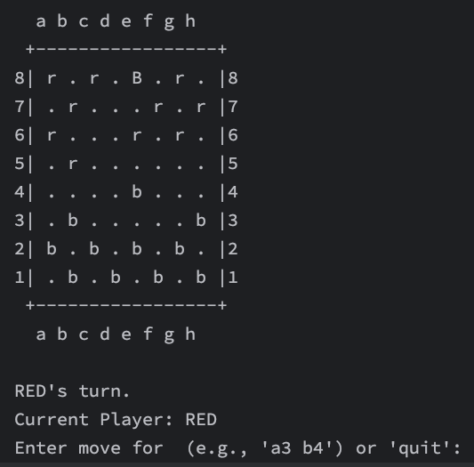

# Building a Playable Draughts Game


This tutorial guides you through building a complete command-line draughts (checkers) game using the Effects Path API and Focus DSL. We demonstrate how Higher-Kinded-J makes functional game development in Java both practical and elegant.

~~~admonish info title="What You'll Learn"
- How to build a complete functional game using the Effects Path API
- Managing immutable game state with `WithStatePath`
- Railway-oriented programming with `EitherPath` for validation pipelines
- Type-safe error handling using the Focus-Effect bridge
- Encapsulating side effects with `IOPath` while keeping core logic pure
- Stream-based functional patterns for declarative iteration
- Composing operations with `ForPath` for readable workflows
- Using the Focus DSL and `@GenerateFocus` for type-safe data navigation
~~~

~~~admonish example title="See Example Code"
[org.higherkindedj.example.draughts](https://github.com/higher-kinded-j/higher-kinded-j/tree/main/hkj-examples/src/main/java/org/higherkindedj/example/draughts)
~~~

---

## The Effects Path Approach

At its core, a game like draughts involves several aspects where the Effects Path API shines:

```
    ┌─────────────────────────────────────────────────────────────────────┐
    │                    DRAUGHTS GAME ARCHITECTURE                       │
    │                                                                     │
    │                        ┌──────────────┐                             │
    │                        │  Focus DSL   │                             │
    │                        │  Navigation  │                             │
    │                        └──────┬───────┘                             │
    │                               │                                     │
    │   User Input          Game Logic              Display               │
    │   ─────────           ──────────              ───────               │
    │                               │                                     │
    │   IOPath              WithStatePath           IOPath                │
    │   ┌──────────┐        ┌──────┴──────┐        ┌──────────┐           │
    │   │ Read     │───────►│ Validate    │───────►│ Render   │           │
    │   │ Parse    │ railway│ Navigate    │ stream │ Board    │           │
    │   │ Validate │───────►│ Update      │───────►│          │           │
    │   └──────────┘        └─────────────┘        └──────────┘           │
    │        │                    │                     │                 │
    │        ▼                    ▼                     ▼                 │
    │   EitherPath          WithStatePath           IOPath                │
    │   <Error,             <GameState,             <Unit>                │
    │   MoveCommand>        MoveResult>                                   │
    │                                                                     │
    │                    Composed via ForPath                             │
    └─────────────────────────────────────────────────────────────────────┘
```

The Effects Path API provides the tools for each concern:

| Concern | Path Type | Purpose |
|---------|-----------|---------|
| **State Management** | `WithStatePath<S, A>` | Pure state transformations without mutable variables |
| **User Input** | `IOPath<A>` + `EitherPath<E, A>` | Side effects with railway-oriented validation |
| **Game Logic** | `WithStatePath<GameState, MoveResult>` | Railway-oriented validation and rule enforcement |
| **Side Effects** | `IOPath<A>` | Deferred console I/O |
| **Composition** | `ForPath` | Sequential workflow composition |
| **Data Navigation** | Focus DSL | Type-safe access to nested structures |
| **Iteration** | `Stream` + `IntStream` | Declarative, functional iteration patterns |

---

## Step 1: Defining the Game State with Focus DSL

Our game state uses immutable records annotated with `@GenerateFocus` to enable type-safe navigation via the Focus DSL.

```java
import org.higherkindedj.optics.annotations.GenerateFocus;

// Enum for the two players
enum Player { RED, BLACK }

// Enum for the type of piece
enum PieceType { MAN, KING }

// A piece on the board, owned by a player with a certain type
@GenerateFocus
record Piece(Player owner, PieceType type) {}

// A square on the 8x8 board, identified by row and column
@GenerateFocus
record Square(int row, int col) {
  @Override
  public String toString() {
    return "" + (char)('a' + col) + (row + 1);
  }
}

// Represents an error during move parsing or validation
// The isQuit flag distinguishes quit commands from validation errors
@GenerateFocus
record GameError(String description, boolean isQuit) {
  public GameError(String description) { this(description, false); }
}

// The command to make a move from one square to another
@GenerateFocus
record MoveCommand(Square from, Square to) {}

// The outcome of a move attempt
enum MoveOutcome { SUCCESS, INVALID_MOVE, CAPTURE_MADE, GAME_WON }

@GenerateFocus
record MoveResult(MoveOutcome outcome, String message) {}
```

The main `GameState` record captures the complete game state. The initialisation uses a stream-based approach for a declarative, functional style:

```java
@GenerateFocus
public record GameState(
    Map<Square, Piece> board,
    Player currentPlayer,
    String message,
    boolean isGameOver) {

  private static final int BLACK_START_ROW = 0;
  private static final int BLACK_END_ROW = 3;
  private static final int RED_START_ROW = 5;
  private static final int RED_END_ROW = 8;

  /**
   * Creates the initial game state using stream-based board initialisation.
   */
  public static GameState initial() {
    Map<Square, Piece> board =
        Stream.concat(
                placePieces(Player.BLACK, BLACK_START_ROW, BLACK_END_ROW),
                placePieces(Player.RED, RED_START_ROW, RED_END_ROW))
            .collect(Collectors.toUnmodifiableMap(Map.Entry::getKey, Map.Entry::getValue));

    return new GameState(board, Player.RED, "Game started. RED's turn.", false);
  }

  /**
   * Generates piece placements using flatMap to combine all squares across rows.
   */
  private static Stream<Map.Entry<Square, Piece>> placePieces(
      Player owner, int startRow, int endRow) {
    Piece piece = new Piece(owner, PieceType.MAN);

    return IntStream.range(startRow, endRow)
        .boxed()
        .flatMap(row ->
            darkSquaresInRow(row).mapToObj(col -> Map.entry(new Square(row, col), piece)));
  }

  /**
   * Returns column indices of dark (playable) squares using IntStream.iterate.
   */
  private static IntStream darkSquaresInRow(int row) {
    int startCol = (row % 2 != 0) ? 0 : 1;
    return IntStream.iterate(startCol, col -> col < 8, col -> col + 2);
  }

  // Pure transformation methods
  GameState withMessage(String newMessage) { ... }
  GameState togglePlayer() { ... }
}
```

~~~admonish note title="Functional Initialisation"
The stream-based approach replaces imperative nested loops with declarative operations:
- `Stream.concat()` combines piece placements from both players
- `IntStream.range().flatMap()` generates squares across multiple rows
- `IntStream.iterate()` calculates playable squares on each row
- `Collectors.toUnmodifiableMap()` creates an immutable result
~~~

The `@GenerateFocus` annotation generates Focus path classes that enable type-safe navigation:

```java
// Generated: GameStateFocus, PieceFocus, SquareFocus, etc.
// Usage:
Player owner = PieceFocus.owner().get(piece);
GameState updated = GameStateFocus.message().set("New message", state);
```

---

## Step 2: Handling User Input with Railway-Oriented Programming

The `InputHandler` class demonstrates railway-oriented programming for input parsing. The parsing pipeline uses `EitherPath` to chain validation steps, where errors automatically short-circuit to the error track:

```
readLine → checkQuit → splitInput → parseSquares → MoveCommand
   ↓          ↓           ↓            ↓
 IOPath   EitherPath  EitherPath   EitherPath
```

Each step either continues on the success track or switches to the error track. The final result captures both the side effect of reading from console (`IOPath`) and the possibility of parse errors (`Either`).

```java
import org.higherkindedj.hkt.effect.IOPath;
import org.higherkindedj.hkt.effect.EitherPath;
import org.higherkindedj.hkt.effect.Path;

class InputHandler {
  private static final Scanner scanner = new Scanner(System.in);

  /**
   * Reads a move command from the console.
   * Wraps the side-effecting input operation in IOPath and delegates parsing
   * to a pure function.
   */
  static IOPath<Either<GameError, MoveCommand>> readMoveCommand() {
    return Path.io(() -> {
      System.out.print("Enter move (e.g., 'a3 b4') or 'quit': ");
      return parseLine(scanner.nextLine().trim());
    });
  }

  /**
   * Parses an input line using railway-oriented programming.
   * The pipeline chains validation steps with .via(), where any error
   * short-circuits the entire pipeline.
   */
  private static Either<GameError, MoveCommand> parseLine(String line) {
    return checkNotQuit(line)
        .via(InputHandler::splitIntoTwoParts)
        .via(InputHandler::parseSquarePair)
        .run();
  }

  // ===== Pipeline Steps =====

  /** First step: checks if input is the quit command. */
  private static EitherPath<GameError, String> checkNotQuit(String line) {
    return "quit".equalsIgnoreCase(line)
        ? Path.left(new GameError("Player quit the game.", true))
        : Path.right(line);
  }

  /** Second step: splits input into exactly two parts. */
  private static EitherPath<GameError, String[]> splitIntoTwoParts(String line) {
    String[] parts = line.split("\\s+");
    return parts.length == 2
        ? Path.right(parts)
        : Path.left(new GameError("Invalid input. Use 'from to' format (e.g., 'c3 d4')."));
  }

  /** Third step: parses both squares and combines into MoveCommand. */
  private static EitherPath<GameError, MoveCommand> parseSquarePair(String[] parts) {
    return parseSquare(parts[0]).zipWith(parseSquare(parts[1]), MoveCommand::new);
  }

  // ===== Square Parsing =====

  /**
   * Parses a square notation string (e.g., "a3") using railway-oriented programming.
   */
  private static EitherPath<GameError, Square> parseSquare(String input) {
    return validateFormat(input).via(InputHandler::validateBoundsAndCreate);
  }

  private static EitherPath<GameError, String> validateFormat(String input) {
    return (input != null && input.length() == 2)
        ? Path.right(input)
        : Path.left(new GameError("Invalid square format: " + input));
  }

  private static EitherPath<GameError, Square> validateBoundsAndCreate(String input) {
    char colChar = input.charAt(0);
    char rowChar = input.charAt(1);

    boolean validCol = colChar >= 'a' && colChar <= 'h';
    boolean validRow = rowChar >= '1' && rowChar <= '8';

    if (!validCol || !validRow) {
      return Path.left(new GameError("Square out of bounds (a1-h8): " + input));
    }

    return Path.right(new Square(rowChar - '1', colChar - 'a'));
  }
}
```

~~~admonish note title="The Railway Model"
The `EitherPath` follows the railway model: values flow on the success track (Right), while errors automatically switch to the failure track (Left). The `.via()` method chains dependent validations, and `zipWith` combines two validations, short-circuiting on the first error.
~~~

---

## Step 3: Game Logic with Railway-Oriented Programming

The game logic uses railway-oriented programming where validations chain on the success track and errors automatically short-circuit to the error track. This replaces imperative if-else chains with a fluent, declarative pipeline.

```java
import org.higherkindedj.hkt.effect.WithStatePath;
import org.higherkindedj.hkt.effect.EitherPath;
import org.higherkindedj.hkt.effect.Path;
import org.higherkindedj.hkt.state.State;
import org.higherkindedj.optics.focus.AffinePath;
import org.higherkindedj.optics.focus.FocusPaths;

public class GameLogic {

  /**
   * Applies a move command using railway-oriented programming.
   * Each step either continues on the success track or short-circuits to the error track.
   */
  public static WithStatePath<GameState, MoveResult> applyMove(MoveCommand command) {
    Square from = MoveCommandFocus.from().get(command);
    Square to = MoveCommandFocus.to().get(command);

    return Path.state(
        State.of(
            (GameState state) ->
                // Railway: get piece → validate ownership → validate destination → apply move
                getPieceAt(from, state)
                    .via(piece -> validateOwnership(piece, state))
                    .via(piece -> validateDestinationEmpty(to, state).map(unit -> piece))
                    .via(piece -> validateAndApply(state, command, piece, from, to))
                    .fold(error -> invalidMove(error, state), result -> result)));
  }
```

Each validation step is a separate function that returns an `EitherPath`:

```java
  // ===== Validation Pipeline Steps =====

  /** Gets the piece at a square using the Focus-Effect bridge. */
  private static EitherPath<String, Piece> getPieceAt(Square square, GameState state) {
    return AffinePath.of(FocusPaths.<Square, Piece>mapAt(square))
        .toEitherPath(state.board(), "No piece at " + square);
  }

  /** Validates that the piece belongs to the current player. */
  private static EitherPath<String, Piece> validateOwnership(Piece piece, GameState state) {
    Player currentPlayer = GameStateFocus.currentPlayer().get(state);
    Player pieceOwner = PieceFocus.owner().get(piece);

    return pieceOwner == currentPlayer
        ? Path.right(piece)
        : Path.left("Not your piece.");
  }

  /** Validates that the destination square is empty. */
  private static EitherPath<String, Unit> validateDestinationEmpty(Square to, GameState state) {
    boolean isEmpty =
        AffinePath.of(FocusPaths.<Square, Piece>mapAt(to)).getOptional(state.board()).isEmpty();

    return isEmpty
        ? Path.right(Unit.INSTANCE)
        : Path.left("Destination square " + to + " is occupied.");
  }

  /** Validates the move type and applies it if valid. */
  private static EitherPath<String, StateTuple<GameState, MoveResult>> validateAndApply(
      GameState state, MoveCommand command, Piece piece, Square from, Square to) {

    int rowDiff = SquareFocus.row().get(to) - SquareFocus.row().get(from);
    int colDiff = SquareFocus.col().get(to) - SquareFocus.col().get(from);

    if (Math.abs(rowDiff) == 1 && Math.abs(colDiff) == 1) {
      return validateSimpleMove(piece, rowDiff).map(p -> performMove(state, command, p));
    } else if (Math.abs(rowDiff) == 2 && Math.abs(colDiff) == 2) {
      return validateJumpMove(state, command, piece, from, rowDiff, colDiff);
    } else {
      return Path.left("Move must be diagonal by 1 or 2 squares.");
    }
  }
```

State updates use the Focus DSL for cleaner transformations:

```java
  /** Creates an invalid move result. */
  private static StateTuple<GameState, MoveResult> invalidMove(String message, GameState state) {
    return new StateTuple<>(
        new MoveResult(MoveOutcome.INVALID_MOVE, message),
        GameStateFocus.message().set(message, state));
  }

  /** Performs a simple move. */
  private static StateTuple<GameState, MoveResult> performMove(
      GameState state, MoveCommand command, Piece piece) {

    Map<Square, Piece> newBoard = new HashMap<>(state.board());
    newBoard.remove(command.from());
    newBoard.put(command.to(), piece);

    GameState movedState = GameStateFocus.board().set(newBoard, state);
    GameState finalState = checkAndKingPiece(movedState, command.to());

    return new StateTuple<>(
        new MoveResult(MoveOutcome.SUCCESS, "Move successful."),
        finalState.togglePlayer());
  }
```

~~~admonish tip title="Focus-Effect Bridge"
The bridge between Focus DSL and Effects Path API enables powerful patterns:
- `AffinePath.of(FocusPaths.mapAt(key)).toEitherPath(map, error)` - Navigate into a Map with error handling
- `AffinePath.of(FocusPaths.mapAt(key)).toMaybePath(map)` - Navigate with optional result
- `GameStateFocus.message().set(msg, state)` - Type-safe state updates
~~~

---

## Step 4: Composing with ForPath and Extracted Handlers

The main game class uses `ForPath` to compose the turn workflow, with error handling extracted into pure predicates and separate handler functions for improved readability:

```java
import org.higherkindedj.hkt.effect.IOPath;
import org.higherkindedj.hkt.effect.Path;
import org.higherkindedj.hkt.expression.ForPath;

public class Draughts {

  /**
   * Processes a single turn using ForPath for composition.
   */
  private static IOPath<GameState> processTurn(GameState currentState) {
    return ForPath.from(BoardDisplay.displayBoard(currentState))
        .from(ignored -> InputHandler.readMoveCommand())
        .yield((ignored, result) -> result)
        .via(result -> handleTurnResult(result, currentState));
  }

  /**
   * Handles the result using Either.fold() with extracted handler functions.
   */
  private static IOPath<GameState> handleTurnResult(
      Either<GameError, MoveCommand> result, GameState state) {
    return result.fold(
        error -> handleError(error, state),
        command -> applyMove(command, state));
  }

  // ===== Error Handling =====

  /**
   * Handles an error using a pure predicate to distinguish quit from other errors.
   */
  private static IOPath<GameState> handleError(GameError error, GameState state) {
    return isQuitCommand(error)
        ? handleQuit(state)
        : displayErrorAndContinue(error, state);
  }

  /** Pure predicate: checks if the error represents a quit command using Focus DSL. */
  private static boolean isQuitCommand(GameError error) {
    return GameErrorFocus.isQuit().get(error);
  }

  /** Handles the quit command by setting game over and displaying farewell. */
  private static IOPath<GameState> handleQuit(GameState state) {
    return Path.io(() -> {
      System.out.println("Goodbye!");
      return GameStateFocus.isGameOver().set(true, state);
    });
  }

  /** Displays an error message and returns the unchanged state. */
  private static IOPath<GameState> displayErrorAndContinue(GameError error, GameState state) {
    return Path.io(() -> {
      System.out.println("Error: " + GameErrorFocus.description().get(error));
      return state;
    });
  }

  // ===== Move Application =====

  /** Applies a valid move command to the game state. */
  private static IOPath<GameState> applyMove(MoveCommand command, GameState state) {
    return Path.ioPure(GameLogic.applyMove(command).run(state).state());
  }
}
```

~~~admonish note title="Functional Error Handling"
The error handling demonstrates several functional patterns:
- **Pure predicates**: `isQuitCommand()` uses `GameErrorFocus.isQuit()` for type-safe access
- **Type-safe flags**: The `isQuit` field in `GameError` avoids string matching
- **Extracted handlers**: Each error case has its own handler function
- **Separation of concerns**: Logic is cleanly separated from side effects
~~~

The `ForPath` comprehension makes the workflow declarative:
1. Display the board (side effect)
2. Read user input (side effect returning `Either`)
3. Yield the result for further processing
4. Handle errors or apply moves via extracted functions

---

## Step 5: The Game Loop

The game loop is a recursive `IOPath` computation that uses a ternary expression for clarity:

```java
  /**
   * The main game loop as a recursive IOPath computation.
   * Creates an IOPath representing the entire game.
   */
  private static IOPath<Unit> gameLoop(GameState gameState) {
    return gameState.isGameOver()
        ? BoardDisplay.displayBoard(gameState)
        : processTurn(gameState).via(Draughts::gameLoop);
  }

  public static void main(String[] args) {
    // Build and execute the complete game
    IOPath<Unit> game =
        Path.ioPure(GameState.initial())
            .via(Draughts::gameLoop)
            .then(() -> Path.ioRunnable(() -> System.out.println("Thank you for playing!")));

    game.unsafeRun();
  }
```

~~~admonish note title="Deferred Execution"
The entire game is constructed as a pure `IOPath` value. No side effects occur until `unsafeRun()` is called at the application boundary. This separation makes the code easier to test and reason about.
~~~

---

## Step 6: Displaying the Board with Streams and MaybePath

The display uses `IOPath` to encapsulate console output, with streams for declarative rendering and `MaybePath` for optional piece handling:

```java
public class BoardDisplay {

  private static final String BOARD_HEADER = "  a b c d e f g h";
  private static final String BOARD_BORDER = " +-----------------+";

  /**
   * Creates an IOPath that, when executed, displays the current game state.
   */
  public static IOPath<Unit> displayBoard(GameState gameState) {
    return Path.ioRunnable(() -> System.out.println(renderGameState(gameState)));
  }

  /**
   * Renders the complete game state as a string using stream composition.
   */
  private static String renderGameState(GameState state) {
    return String.join("\n",
        "",
        BOARD_HEADER,
        BOARD_BORDER,
        renderBoard(state),
        BOARD_BORDER,
        BOARD_HEADER,
        "",
        state.message(),
        renderCurrentPlayer(state));
  }

  /**
   * Renders all board rows using streams.
   */
  private static String renderBoard(GameState state) {
    return IntStream.iterate(7, row -> row >= 0, row -> row - 1)
        .mapToObj(row -> renderRow(state, row))
        .collect(Collectors.joining("\n"));
  }

  /**
   * Renders a single row of the board.
   */
  private static String renderRow(GameState state, int row) {
    String squares = IntStream.range(0, 8)
        .mapToObj(col -> renderSquare(state, row, col))
        .collect(Collectors.joining(" "));

    int displayRow = row + 1;
    return displayRow + "| " + squares + " |" + displayRow;
  }

  /**
   * Renders a single square using MaybePath for optional piece handling.
   */
  private static String renderSquare(GameState state, int row, int col) {
    return AffinePath.of(FocusPaths.<Square, Piece>mapAt(new Square(row, col)))
        .toMaybePath(state.board())
        .map(BoardDisplay::pieceToChar)
        .getOrElse(".");
  }

  /**
   * Pure function converting a piece to its display character.
   */
  private static String pieceToChar(Piece piece) {
    char base = PieceFocus.owner().get(piece) == Player.RED ? 'r' : 'b';
    char display = PieceFocus.type().get(piece) == PieceType.KING
        ? Character.toUpperCase(base)
        : base;
    return String.valueOf(display);
  }

  private static String renderCurrentPlayer(GameState state) {
    return state.isGameOver()
        ? ""
        : "Current Player: " + GameStateFocus.currentPlayer().get(state);
  }
}
```

~~~admonish note title="Functional Rendering Patterns"
The display uses several functional patterns:
- **Streams**: `IntStream.iterate()` and `mapToObj()` for declarative row/column iteration
- **MaybePath**: `toMaybePath().map().getOrElse()` safely handles absent pieces
- **Pure functions**: `pieceToChar()` has no side effects and uses Focus DSL
- **String composition**: `String.join()` and `Collectors.joining()` for clean concatenation
~~~

### Playing the Game



In the game we can see BLACK has "kinged" a piece by reaching `e8`.

---

## Step 7: Adding Multi-Jump Rules with Stream-Based Jump Detection

A key rule in draughts is that captures must be completed: if a capture leads to another possible capture with the same piece, that jump must also be taken.

The beauty of the functional approach is that we only need to modify the core rules in `GameLogic.java`. The game loop, IO handlers, and data models remain unchanged.

The jump detection uses a stream-based approach instead of nested loops for cleaner functional style:

```java
  /** Jump direction offsets for checking available jumps. */
  private static final int[] JUMP_OFFSETS = {-2, 2};

  /** Record representing a jump direction (row and column offsets). */
  private record JumpDirection(int rowOffset, int colOffset) {}

  /**
   * Checks if a piece can make any valid jump using MaybePath.
   */
  private static boolean canPieceJump(GameState state, Square from) {
    return AffinePath.of(FocusPaths.<Square, Piece>mapAt(from))
        .toMaybePath(state.board())
        .map(piece -> hasAnyValidJump(state, from, piece))
        .getOrElse(false);
  }

  /**
   * Checks all directions for valid jumps using streams.
   */
  private static boolean hasAnyValidJump(GameState state, Square from, Piece piece) {
    Player owner = PieceFocus.owner().get(piece);
    PieceType type = PieceFocus.type().get(piece);

    return generateJumpDirections()
        .filter(dir -> isValidJumpDirection(type, owner, dir.rowOffset()))
        .anyMatch(dir -> isValidJump(state, from, dir, owner));
  }

  /**
   * Generates all possible jump direction pairs using flatMap.
   */
  private static Stream<JumpDirection> generateJumpDirections() {
    return IntStream.of(JUMP_OFFSETS)
        .boxed()
        .flatMap(row -> IntStream.of(JUMP_OFFSETS).mapToObj(col -> new JumpDirection(row, col)));
  }

  /** Checks if a jump direction is valid for the piece type. */
  private static boolean isValidJumpDirection(PieceType type, Player owner, int rowOffset) {
    if (type == PieceType.KING) return true;
    // Men can only jump forward
    return !((owner == Player.RED && rowOffset > 0) || (owner == Player.BLACK && rowOffset < 0));
  }

  /** Checks if a specific jump is valid using MaybePath. */
  private static boolean isValidJump(GameState state, Square from, JumpDirection dir, Player owner) {
    int toRow = from.row() + dir.rowOffset();
    int toCol = from.col() + dir.colOffset();

    if (toRow < 0 || toRow > 7 || toCol < 0 || toCol > 7) return false;

    Square to = new Square(toRow, toCol);
    Square jumpedSquare = new Square(from.row() + dir.rowOffset() / 2, from.col() + dir.colOffset() / 2);

    // Destination must be empty
    boolean destEmpty =
        AffinePath.of(FocusPaths.<Square, Piece>mapAt(to)).getOptional(state.board()).isEmpty();

    // Must have opponent piece to jump
    boolean hasOpponentPiece =
        AffinePath.of(FocusPaths.<Square, Piece>mapAt(jumpedSquare))
            .toMaybePath(state.board())
            .filter(p -> PieceFocus.owner().get(p) != owner)
            .run()
            .isJust();

    return destEmpty && hasOpponentPiece;
  }
```

~~~admonish note title="Stream-Based Iteration"
The jump detection replaces nested imperative loops with:
- `IntStream.of().flatMap()` - Generates all direction combinations
- `Stream.filter()` - Removes invalid directions for piece type
- `Stream.anyMatch()` - Short-circuits on first valid jump found
- `MaybePath.filter().run().isJust()` - Safely checks for opponent piece
~~~

After a capture, we check for further jumps using `MaybePath`:

```java
  private static StateTuple<GameState, MoveResult> performJump(...) {
    // ... perform the jump and update board ...

    // Check for win condition using MaybePath
    return checkWinCondition(stateAfterKinging)
        .map(winner -> createWinResult(winner, stateAfterKinging))
        .getOrElseGet(() -> checkMultiJumpOrEndTurn(stateAfterKinging, command.to()));
  }

  /** Checks for multi-jump or ends the turn. */
  private static StateTuple<GameState, MoveResult> checkMultiJumpOrEndTurn(
      GameState state, Square position) {
    return canPieceJump(state, position)
        ? new StateTuple<>(
            new MoveResult(MoveOutcome.CAPTURE_MADE,
                "Capture successful. You must jump again with the same piece."),
            GameStateFocus.message().set(
                "Capture successful. You must jump again with the same piece.", state))
        : new StateTuple<>(
            new MoveResult(MoveOutcome.CAPTURE_MADE, "Capture successful."),
            state.togglePlayer());
  }
```

---

## Under the Hood: The Monads

The Effects Path API provides a user-friendly layer over powerful functional abstractions. Understanding these foundations helps when you need more advanced patterns.

### The State Monad

`WithStatePath<S, A>` wraps the State monad, which represents computations that thread state through a sequence of operations:

```java
// State<S, A> represents: S -> (A, S)
// A function from initial state to (result, new state)

// WithStatePath provides a fluent API over State
WithStatePath<Integer, String> computation = WithStatePath.<Integer>get()
    .via(n -> WithStatePath.modify((Integer x) -> x + 1)
        .map(ignored -> "Count: " + (n + 1)));

StateTuple<Integer, String> result = computation.run(0);
// result.value() = "Count: 1", result.state() = 1
```

### The Either Monad

`EitherPath<E, A>` wraps Either, providing typed error handling that short-circuits on failure:

```java
// Either<E, A> is either Left(error) or Right(value)
// Operations on Right continue; operations on Left propagate the error

EitherPath<String, Integer> result = Path.<String, Integer>right(10)
    .via(n -> n > 5 ? Path.right(n * 2) : Path.left("Too small"))
    .map(n -> n + 1);
// result.run() = Right(21)
```

### The IO Monad

`IOPath<A>` wraps IO, representing deferred side effects:

```java
// IO<A> describes a computation that, when run, produces A
// Nothing happens until unsafeRun() is called

IOPath<String> readName = Path.io(() -> {
    System.out.print("Name: ");
    return scanner.nextLine();
});

// readName is a value describing the action - no I/O yet
String name = readName.unsafeRun();  // Now the I/O happens
```

### Higher-Kinded Types

Java lacks native support for higher-kinded types. Higher-Kinded-J provides a simulation using `Kind<F, A>` as a bridge type:

```java
// We cannot write: <F> F<A> map(F<A> fa, Function<A, B> f)
// But we can write: <F> Kind<F, B> map(Kind<F, A> fa, Function<A, B> f)

// The Path types unwrap the complexity for everyday use
```

The Effects Path API abstracts over these foundations, providing a consistent, fluent interface that works the same way regardless of which effect type you use.

---

## Why This Functional Approach is Better

| Aspect | Traditional | Effects Path API |
|--------|-------------|------------------|
| **Testability** | Mock frameworks, complex setup | Pure functions, direct assertions |
| **Error Handling** | Exceptions, null checks | Railway-oriented (`EitherPath.via()`) |
| **Validation** | Nested if-else chains | Fluent pipelines that short-circuit |
| **State Management** | Mutable fields | Immutable transforms (`WithStatePath`) |
| **Side Effects** | Scattered throughout code | Isolated at boundaries (`IOPath`) |
| **Composability** | Nested callbacks | Fluent chaining (`via`, `map`) |
| **Iteration** | Imperative loops | Streams with `flatMap`, `filter`, `anyMatch` |
| **Optional Data** | Manual null checks | `MaybePath.map().getOrElse()` |
| **Data Access** | Manual null checks | Type-safe paths (Focus DSL) |

The `GameLogic` class is completely pure; you can test the entire rules engine by providing a `GameState` and a `MoveCommand`, then asserting on the result. No mocking of console I/O required.

---

~~~admonish tip title="See Also"
- [Effect Path Overview](../effect/effect_path_overview.md) - The railway model for effect composition
- [Focus DSL](../optics/focus_dsl.md) - Type-safe data navigation
- [Focus-Effect Integration](../effect/focus_integration.md) - Bridging optics and effects
- [ForPath Comprehensions](../functional/for_comprehension.md) - For-comprehension syntax
- [WithStatePath](../effect/path_types.md) - State management patterns
~~~

---

**Previous:** [Concurrency and Scale](order-concurrency.md)
