# The Order Workflow: From Nested Callbacks to Functional Elegance

This example demonstrates how Higher-Kinded-J transforms complex asynchronous workflows into clean, composable, and type-safe operations.

## The Real-World Challenge

You're building an e-commerce platform. When a customer places an order, you need to:

1. **Validate** the order data (quantity, product ID, payment details)
2. **Check inventory** via an asynchronous service call
3. **Process payment** through an async payment gateway
4. **Arrange shipping** via an async logistics service
5. **Notify** the customer about their order status

Each step is asynchronous. Each step can fail with specific business errors (validation failure, out of stock, payment declined, shipping unavailable). How do you compose these operations without drowning in nested `thenCompose()` chains and error handling boilerplate?

### The Plain Java Approach

With standard Java `CompletableFuture`, you might write:

```java
public CompletableFuture<Result> processOrder(OrderData data) {
    return validateOrder(data)
        .thenCompose(validated ->
            checkInventory(validated.productId(), validated.quantity())
                .thenCompose(inventoryOk ->
                    processPayment(validated.paymentDetails(), validated.amount())
                        .thenCompose(payment ->
                            createShipment(validated.orderId(), validated.address())
                                .thenCompose(shipment ->
                                    notifyCustomer(validated.customerId())
                                        .thenApply(ignored ->
                                            new Result(validated.orderId(), payment.txnId(), shipment.trackingId())
                                        )
                                )
                        )
                )
        )
        .exceptionally(error -> {
            // How do we distinguish between different error types?
            // How do we recover from specific errors whilst propagating others?
            // The error handling becomes tangled with business logic...
            return handleError(error);
        });
}
```

**Problems with this approach:**
- **Callback hell**: Deep nesting makes code difficult to read and maintain
- **Error handling**: No type-safe way to distinguish business errors from system failures
- **Error recovery**: Recovering from specific errors whilst propagating others requires complex logic
- **Short-circuiting**: Manually ensuring subsequent steps don't run after failures is error-prone
- **Testing**: Mocking and testing individual steps is cumbersome

### The Higher-Kinded-J Solution

With Higher-Kinded-J's `EitherT` monad transformer, the same workflow becomes:

```java
public Kind<CompletableFutureKind.Witness, Either<DomainError, FinalResult>> processOrder(
    OrderData orderData) {

    var initialContext = WorkflowContext.start(orderData);

    return For.from(eitherTMonad, eitherTMonad.of(initialContext))
        .from(ctx -> validateOrderStep(ctx))
        .from(ctx -> checkInventoryStep(ctx))
        .from(ctx -> processPaymentStep(ctx))
        .from(ctx -> createShipmentStep(ctx))
        .yield(ctx -> buildFinalResult(ctx))
        .flatMap(x -> x)
        .value();
}
```

**Benefits of this approach:**
- **Flat composition**: Sequential steps read naturally without nesting
- **Type-safe errors**: `Either<DomainError, T>` explicitly captures business failures
- **Automatic short-circuiting**: First error stops execution; no manual checks needed
- **Principled error recovery**: Use `handleErrorWith` to recover from specific errors
- **Testable**: Each step is a pure function that's easy to test in isolation
- **Composable**: Reuse workflow steps in different compositions

## What You'll Learn

This example progressively demonstrates:

* **Composing asynchronous steps** with typed error handling using `CompletableFuture` and `Either`
* **The [`EitherT` monad transformer](../transformers/monad_transformers.md)** — flattening nested `CompletableFuture<Either<DomainError, T>>` structures
* **Multiple error handling strategies**:
  * **Domain Errors**: Expected business failures (validation, out of stock) via `Either.Left`
  * **System Errors**: Unexpected async failures (network timeouts) via `CompletableFuture` exceptional completion
  * **Exception Integration**: Using `Try` to wrap exception-throwing code
  * **Error Accumulation**: Using `Validated` and [`Traverse`](../glossary.md#traverse) to collect multiple errors
* **Error recovery** using [`MonadError`](../glossary.md#monad-error) capabilities (`handleErrorWith`, `handleError`)
* **Bifunctor transformations** for elegant dual-channel transformations
* **Pattern matching** with generated Prisms for type-safe error handling
* **Dependency injection** patterns for testable, modular workflows

## Understanding the Workflow Variants

We provide **six** progressive workflow implementations, each showcasing different Higher-Kinded-J features:

| Workflow | Primary Feature | Key Benefit | Best For |
|----------|----------------|-------------|----------|
| **OrderWorkflowTraditional** | Plain Java (comparison) | Shows the pain points | Understanding what we're avoiding |
| **Workflow1** | EitherT + For comprehension | Clean async composition with typed errors | Standard async workflows with error handling |
| **Workflow2** | Try integration | Wrapping exception-throwing code | Integrating legacy or third-party code |
| **WorkflowLensAndPrism** | Optics (Lenses/Prisms) | Immutable state updates & pattern matching | Complex data transformations |
| **WorkflowTraverse** | Traverse + Validated | Accumulating multiple errors | Validating collections where all errors matter |
| **WorkflowBifunctor** | Bifunctor | Transforming both error and success channels | API boundary transformations |

Each workflow builds upon the last, demonstrating how Higher-Kinded-J adapts to different real-world scenarios.

## Prerequisites

Before exploring the code, familiarise yourself with:

* [Core Concepts](core-concepts.md) of Higher-Kinded-J ([`Kind`](../glossary.md#kind) and [type classes](../glossary.md#type-class))
* The specific types being used: [Supported Types](../monads/supported-types.md)
* The general [Usage Guide](usage-guide.md)
* [Monad Transformers](../transformers/monad_transformers.md) for understanding `EitherT`

## Key Implementation Files

You can find the complete code in the [`org.higherkindedj.example.order`](https://github.com/higher-kinded-j/higher-kinded-j/tree/main/hkj-examples/src/main/java/org/higherkindedj/example/order/workflow) package:

**Key Files:**

* [`Dependencies.java`](https://github.com/higher-kinded-j/higher-kinded-j/blob/main/hkj-examples/src/main/java/org/higherkindedj/example/order/workflow/Dependencies.java): Holds external dependencies (e.g., logger).
* [`OrderWorkflowRunner.java`](https://github.com/higher-kinded-j/higher-kinded-j/blob/main/hkj-examples/src/main/java/org/higherkindedj/example/order/workflow/OrderWorkflowRunner.java): Orchestrates the workflow, initialising and running different workflow versions (Workflow1 and Workflow2).
* [`OrderWorkflowSteps.java`](https://github.com/higher-kinded-j/higher-kinded-j/blob/main/hkj-examples/src/main/java/org/higherkindedj/example/order/workflow/OrderWorkflowSteps.java): Defines the individual workflow steps (sync/async), accepting `Dependencies`.
* [`Workflow1.java`](https://github.com/higher-kinded-j/higher-kinded-j/blob/main/hkj-examples/src/main/java/org/higherkindedj/example/order/workflow/Workflow1.java): Implements the order processing workflow using `EitherT` over `CompletableFuture`, with the initial validation step using an `Either`.
* [`Workflow2.java`](https://github.com/higher-kinded-j/higher-kinded-j/blob/main/hkj-examples/src/main/java/org/higherkindedj/example/order/workflow/Workflow2.java): Implements a similar workflow to `Workflow1`, but the initial validation step uses a `Try` that is then converted to an `Either`.
* [`WorkflowModels.java`](https://github.com/higher-kinded-j/higher-kinded-j/blob/main/hkj-examples/src/main/java/org/higherkindedj/example/order/model/WorkflowModels.java): Data records (`OrderData`, `ValidatedOrder`, etc.).
* [`DomainError.java`](https://github.com/higher-kinded-j/higher-kinded-j/blob/main/hkj-examples/src/main/java/org/higherkindedj/example/order/error/DomainError.java): Sealed interface defining specific business errors.

---

## Order Processing Workflow



---

## The Problem: Combining Asynchronicity and Typed Errors

Imagine an online order process with the following stages:

1. **Validate Order Data:** Check quantity, product ID, etc. (Can fail with `ValidationError`). This is a synchronous operation.
2. **Check Inventory:** Call an external inventory service (async). (Can fail with `StockError`).
3. **Process Payment:** Call a payment gateway (async). (Can fail with `PaymentError`).
4. **Create Shipment:** Call a shipping service (async). (Can fail with `ShippingError`, some of which might be recoverable).
5. **Notify Customer:** Send an email/SMS (async). (Might fail, but should not critically fail the entire order).

We face several challenges:

* **Asynchronicity:** Steps 2, 3, 4, 5 involve network calls and should use `CompletableFuture`.
* **Domain Errors:** Steps can fail for specific business reasons. We want to represent these failures with *types* (like `ValidationError`, `StockError`) rather than just generic exceptions or nulls. `Either<DomainError, SuccessValue>` is a good fit for this.
* **Composition:** How do we chain these steps together? Directly nesting `CompletableFuture<Either<DomainError, ...>>` leads to complex and hard-to-read code (often called "callback hell" or nested `thenCompose`/`thenApply` chains).
* **Short-Circuiting:** If validation fails (returns `Left(ValidationError)`), we shouldn't proceed to check inventory or process payment. The workflow should stop and return the validation error.
* **Dependencies & Logging:** Steps need access to external resources (like service clients, configuration, loggers). How do we manage this cleanly?

## The Solution: `EitherT` Monad Transformer + Dependency Injection

This example tackles these challenges using:

1. **`Either<DomainError, R>`**: To represent the result of steps that can fail with a specific business error (`DomainError`). `Left` holds the error, `Right` holds the success value `R`.
2. **`CompletableFuture<T>`**: To handle the asynchronous nature of external service calls. It also inherently handles system-level exceptions (network timeouts, service unavailability) by completing exceptionally with a `Throwable`.
3. **`EitherT<F_OUTER_WITNESS, L_ERROR, R_VALUE>`**: The key component! This *monad transformer* wraps a nested structure `Kind<F_OUTER_WITNESS, Either<L_ERROR, R_VALUE>>`. In our case:
   * `F_OUTER_WITNESS` (Outer Monad's Witness) = `CompletableFutureKind.Witness` (handling async and system errors `Throwable`).
   * `L_ERROR` (Left Type) = `DomainError` (handling business errors).
   * `R_VALUE` (Right Type) = The success value of a step.
     It provides `map`, `flatMap`, and `handleErrorWith` operations that work seamlessly across *both* the outer `CompletableFuture` context and the inner `Either` context.
4. **Dependency Injection:** A `Dependencies` record holds external collaborators (like a logger). This record is passed to `OrderWorkflowSteps`, making dependencies explicit and testable.
5. **Structured Logging:** Steps use the injected logger (`dependencies.log(...)`) for consistent logging.

### Setting up `EitherTMonad`

In `OrderWorkflowRunner`, we get the necessary type class instances:

```java
// MonadError instance for CompletableFuture (handles Throwable)
// F_OUTER_WITNESS for CompletableFuture is CompletableFutureKind.Witness
private final @NonNull MonadError<CompletableFutureKind.Witness, Throwable> futureMonad =
    CompletableFutureMonad.INSTANCE;

// EitherTMonad instance, providing the outer monad (futureMonad).
// This instance handles DomainError for the inner Either.
// The HKT witness for EitherT here is EitherTKind.Witness<CompletableFutureKind.Witness, DomainError>
private final @NonNull
MonadError<EitherTKind.Witness<CompletableFutureKind.Witness, DomainError>, DomainError>
    eitherTMonad = new EitherTMonad<>(this.futureMonad);
```

Now, `eitherTMonad` can be used to chain operations on `EitherT` values (which are `Kind<EitherTKind.Witness<CompletableFutureKind.Witness, DomainError>, A>`). Its `flatMap` method automatically handles:

* **Async Sequencing:** Delegated to `futureMonad.flatMap` (which translates to `CompletableFuture::thenCompose`).
* **Error Short-Circuiting:** If an inner `Either` becomes `Left(domainError)`, subsequent `flatMap` operations are skipped, propagating the `Left` within the `CompletableFuture`.

## Workflow Step-by-Step (`Workflow1.java`)

- [Workflow1.java](https://github.com/higher-kinded-j/higher-kinded-j/blob/main/hkj-examples/src/main/java/org/higherkindedj/example/order/workflow/Workflow1.java)

Let's trace the execution flow defined in `Workflow1`. The workflow uses a `For` comprehension to sequentially chain the steps. steps. The state (`WorkflowContext`) is carried implicitly within the `Right` side of the `EitherT`.

The `OrderWorkflowRunner` initialises and calls `Workflow1` (or `Workflow2`). The core logic for composing the steps resides within these classes.


We start with `OrderData` and create an initial `WorkflowContext`.

Next `eitherTMonad.of(initialContext)` lifts this context into an `EitherT` value. This represents a `CompletableFuture` that is already successfully completed with an `Either.Right(initialContext)`.We start with OrderData and create an initial WorkflowContext.
  eitherTMonad.of(initialContext) lifts this context into an EitherT value. This represents a CompletableFuture that is already successfully completed with an Either.Right(initialContext).


```java
// From Workflow1.run()

var initialContext = WorkflowModels.WorkflowContext.start(orderData);

// The For-comprehension expresses the workflow sequentially.
// Each 'from' step represents a monadic bind (flatMap).
var workflow = For.from(eitherTMonad, eitherTMonad.of(initialContext))
    // Step 1: Validation. The lambda receives the initial context.
    .from(ctx1 -> {
      var validatedOrderET = EitherT.fromEither(futureMonad, EITHER.narrow(steps.validateOrder(ctx1.initialData())));
      return eitherTMonad.map(ctx1::withValidatedOrder, validatedOrderET);
    })
    // Step 2: Inventory. The lambda receives a tuple of (initial context, context after validation).
    .from(t -> {
      var ctx = t._2(); // Get the context from the previous step
      var inventoryCheckET = EitherT.fromKind(steps.checkInventoryAsync(ctx.validatedOrder().productId(), ctx.validatedOrder().quantity()));
      return eitherTMonad.map(ignored -> ctx.withInventoryChecked(), inventoryCheckET);
    })
    // Step 3: Payment. The lambda receives a tuple of all previous results. The latest context is the last element.
    .from(t -> {
      var ctx = t._3(); // Get the context from the previous step
      var paymentConfirmET = EitherT.fromKind(steps.processPaymentAsync(ctx.validatedOrder().paymentDetails(), ctx.validatedOrder().amount()));
      return eitherTMonad.map(ctx::withPaymentConfirmation, paymentConfirmET);
    })
    // Step 4: Shipment (with error handling).
    .from(t -> {
        var ctx = t._4(); // Get the context from the previous step
        var shipmentAttemptET = EitherT.fromKind(steps.createShipmentAsync(ctx.validatedOrder().orderId(), ctx.validatedOrder().shippingAddress()));
        var recoveredShipmentET = eitherTMonad.handleErrorWith(shipmentAttemptET, error -> {
            if (error instanceof DomainError.ShippingError(var reason) && "Temporary Glitch".equals(reason)) {
                dependencies.log("WARN: Recovering from temporary shipping glitch for order " + ctx.validatedOrder().orderId());
                return eitherTMonad.of(new WorkflowModels.ShipmentInfo("DEFAULT_SHIPPING_USED"));
            }
            return eitherTMonad.raiseError(error);
        });
        return eitherTMonad.map(ctx::withShipmentInfo, recoveredShipmentET);
    })
    // Step 5 & 6 are combined in the yield for a cleaner result.
    .yield(t -> {
      var finalContext = t._5(); // The context after the last 'from'
      var finalResult = new WorkflowModels.FinalResult(
          finalContext.validatedOrder().orderId(),
          finalContext.paymentConfirmation().transactionId(),
          finalContext.shipmentInfo().trackingId()
      );

      // Attempt notification, but recover from failure, returning the original FinalResult.
      var notifyET = EitherT.fromKind(steps.notifyCustomerAsync(finalContext.initialData().customerId(), "Order processed: " + finalResult.orderId()));
      var recoveredNotifyET = eitherTMonad.handleError(notifyET, notifyError -> {
        dependencies.log("WARN: Notification failed for order " + finalResult.orderId() + ": " + notifyError.message());
        return Unit.INSTANCE;
      });

      // Map the result of the notification back to the FinalResult we want to return.
      return eitherTMonad.map(ignored -> finalResult, recoveredNotifyET);
    });

// The yield returns a Kind<M, Kind<M, R>>, so we must flatten it one last time.
var flattenedFinalResultET = eitherTMonad.flatMap(x -> x, workflow);

var finalConcreteET = EITHER_T.narrow(flattenedFinalResultET);
return finalConcreteET.value();
```

There is a lot going on in the `For` comprehension so lets try and unpick it.

#### Breakdown of the `For` Comprehension:

1. **`For.from(eitherTMonad, eitherTMonad.of(initialContext))`**: The comprehension is initiated with a starting value. We lift the initial `WorkflowContext` into our `EitherT` monad, representing a successful, asynchronous starting point: `Future<Right(initialContext)>`.
2. **`.from(ctx1 -> ...)` (Validation)**:
   * **Purpose:** Validates the basic order data.
   * **Sync/Async:** Synchronous. `steps.validateOrder` returns `Kind<EitherKind.Witness<DomainError>, ValidatedOrder>`.
   * **HKT Integration:** The `Either` result is lifted into the `EitherT<CompletableFuture, ...>` context using `EitherT.fromEither(...)`. This wraps the immediate `Either` result in a *completed*`CompletableFuture`.
   * **Error Handling:** If validation fails, `validateOrder` returns a `Left(ValidationError)`. This becomes a `Future<Left(ValidationError)>`, and the `For` comprehension automatically short-circuits, skipping all subsequent steps.
3. **`.from(t -> ...)` (Inventory Check)**:
   * **Purpose:** Asynchronously checks if the product is in stock.
   * **Sync/Async:** Asynchronous. `steps.checkInventoryAsync` returns `Kind<CompletableFutureKind.Witness, Either<DomainError, Unit>>`.
   * **HKT Integration:** The `Kind` returned by the async step is directly wrapped into `EitherT` using `EitherT.fromKind(...)`.
   * **Error Handling:** Propagates `Left(StockError)` or underlying `CompletableFuture` failures.
4. **`.from(t -> ...)` (Payment)**:
   * **Purpose:** Asynchronously processes the payment.
   * **Sync/Async:** Asynchronous.
   * **HKT Integration & Error Handling:** Works just like the inventory check, propagating `Left(PaymentError)` or `CompletableFuture` failures.
5. **`.from(t -> ...)` (Shipment with Recovery)**:
   * **Purpose:** Asynchronously creates a shipment.
   * **HKT Integration:** Uses `EitherT.fromKind` and `eitherTMonad.handleErrorWith`.
   * **Error Handling & Recovery:** If `createShipmentAsync` returns a `Left(ShippingError("Temporary Glitch"))`, the `handleErrorWith` block catches it and returns a *successful*`EitherT` with default shipment info, allowing the workflow to proceed. All other errors are propagated.
6. **`.yield(t -> ...)` (Final Result and Notification)**:
   * **Purpose:** The final block of the `For` comprehension. It takes the accumulated results from all previous steps (in a tuple `t`) and produces the final result of the entire chain.
   * **Logic:**
     1. It constructs the `FinalResult` from the successful `WorkflowContext`.
     2. It attempts the final, non-critical notification step (`notifyCustomerAsync`).
     3. Crucially, it uses `handleError` on the notification result. If notification fails, it logs a warning but recovers to a `Right(Unit.INSTANCE)`, ensuring the overall workflow remains successful.
     4. It then maps the result of the recovered notification step back to the `FinalResult`, which becomes the final value of the entire comprehension.
7. **Final `flatMap` and Unwrapping**:
   * The `yield` block itself can return a monadic value. To get the final, single-layer result, we do one last `flatMap` over the `For` comprehension's result.
   * Finally, `EITHER_T.narrow(...)` and `.value()` are used to extract the underlying `Kind<CompletableFutureKind.Witness, Either<...>>` from the `EitherT` record. The `main` method in `OrderWorkflowRunner` then uses `FUTURE.narrow()` and `.join()` to get the final `Either` result for printing.


---


## Alternative: Handling Exceptions with `Try` (`Workflow2.java`)

The `OrderWorkflowRunner` also initialises and can run `Workflow2`. This workflow is identical to Workflow1 except for the first step. It demonstrates how to integrate synchronous code that might throw exceptions.

- [Workflow2.java](https://github.com/higher-kinded-j/higher-kinded-j/blob/main/hkj-examples/src/main/java/org/higherkindedj/example/order/workflow/Workflow2.java)

```java
// From Workflow2.run(), inside the first .from(...)
.from(ctx1 -> {
  var tryResult = TRY.narrow(steps.validateOrderWithTry(ctx1.initialData()));
  var eitherResult = tryResult.toEither(
      throwable -> (DomainError) new DomainError.ValidationError(throwable.getMessage()));
  var validatedOrderET = EitherT.fromEither(futureMonad, eitherResult);
  // ... map context ...
})
```

* The `steps.validateOrderWithTry` method is designed to throw exceptions on validation failure (e.g., `IllegalArgumentException`).
* `TRY.tryOf(...)` in `OrderWorkflowSteps` wraps this potentially exception-throwing code, returning a `Kind<TryKind.Witness, ValidatedOrder>`.
* In `Workflow2`, we `narrow` this to a concrete `Try<ValidatedOrder>`.
* We use `tryResult.toEither(...)` to convert the `Try` into an `Either<DomainError, ValidatedOrder>`:
    * A `Try.Success(validatedOrder)` becomes `Either.right(validatedOrder)`.
    * A `Try.Failure(throwable)` is mapped to an `Either.left(new DomainError.ValidationError(throwable.getMessage()))`.
* The resulting `Either` is then lifted into `EitherT` using `EitherT.fromEither`, and the rest of the workflow proceeds as before.

This demonstrates a practical pattern for integrating synchronous, exception-throwing code into the `EitherT`-based workflow by explicitly converting failures into your defined `DomainError` types.

---

~~~admonish important  title="Key Points:"


This example illustrates several powerful patterns enabled by Higher-Kinded-J:

1.  **`EitherT` for `Future<Either<Error, Value>>`**: This is the core pattern. Use `EitherT` whenever you need to sequence asynchronous operations (`CompletableFuture`) where each step can also fail with a specific, typed error (`Either`).
    * Instantiate `EitherTMonad<F_OUTER_WITNESS, L_ERROR>` with the `Monad<F_OUTER_WITNESS>` instance for your outer monad (e.g., `CompletableFutureMonad`).
    * Use `eitherTMonad.flatMap` or a `For` comprehension to chain steps.
    * Lift async results (`Kind<F_OUTER_WITNESS, Either<L, R>>`) into `EitherT` using `EitherT.fromKind`.
    * Lift sync results (`Either<L, R>`) into `EitherT` using `EitherT.fromEither`.
    * Lift pure values (`R`) into `EitherT` using `eitherTMonad.of` or `EitherT.right`.
    * Lift errors (`L`) into `EitherT` using `eitherTMonad.raiseError` or `EitherT.left`.
2.  **Typed Domain Errors**: Use `Either` (often with a sealed interface like `DomainError` for the `Left` type) to represent expected business failures clearly. This improves type safety and makes error handling more explicit.
3.  **Error Recovery**: Use `eitherTMonad.handleErrorWith` (for complex recovery returning another `EitherT`) or `handleError` (for simpler recovery to a pure value for the `Right` side) to inspect `DomainError`s and potentially recover, allowing the workflow to continue gracefully.
4.  **Integrating `Try`**: If dealing with synchronous legacy code or libraries that throw exceptions, wrap calls using `TRY.tryOf`. Then, `narrow` the `Try` and use `toEither` (or `fold`) to convert `Try.Failure` into an appropriate `Either.Left<DomainError>` before lifting into `EitherT`.
5.  **Dependency Injection**: Pass necessary dependencies (loggers, service clients, configurations) into your workflow steps (e.g., via a constructor and a `Dependencies` record). This promotes loose coupling and testability.
6.  **Structured Logging**: Use an injected logger within steps to provide visibility into the workflow's progress and state without tying the steps to a specific logging implementation (like `System.out`).
7.  **`var` for Conciseness**: Utilise Java's `var` for local variable type inference where the type is clear from the right-hand side of an assignment. This can reduce verbosity, especially with complex generic types common in HKT.
~~~

---

## Performance Considerations

A common question about functional abstractions is: "What's the runtime cost?"

### The Good News

Higher-Kinded-J's abstractions are **lightweight wrappers** with negligible overhead:

- **No reflection**: All type class operations use direct method calls
- **Minimal allocations**: Beyond the objects you'd create anyway (Either, CompletableFuture, your data models)
- **JIT-friendly**: Simple wrapper objects are easily optimised by the JVM
- **Benchmark-verified**: The [hkj-benchmarks module](../../hkj-benchmarks/) contains JMH benchmarks comparing Higher-Kinded-J operations to hand-written equivalents

### When These Patterns Shine

**✓ Complex async workflows** with multiple failure modes
- The composition benefits far outweigh any marginal allocation costs
- Manual callback-based code is error-prone and harder to maintain

**✓ Medium-to-large codebases**
- Reusable abstractions reduce code duplication
- Type-safe error handling catches bugs at compile time
- Easier onboarding for developers familiar with functional patterns

**✓ Teams valuing maintainability**
- Declarative code is easier to reason about
- Testing is simpler with pure functions
- Refactoring is safer with strong types

### When to Consider Alternatives

**⚠ Performance-critical tight loops**
- If you're processing millions of operations per millisecond, measure first
- Functional abstractions add small constant overhead
- For most business applications, this is irrelevant

**⚠ Simple CRUD operations**
- A single database query doesn't need EitherT
- Use Higher-Kinded-J where composition complexity justifies it

**⚠ Team unfamiliar with FP**
- Training investment required
- Start with simpler patterns (Either, Optional) before monad transformers
- Pair programming helps spread knowledge

### Measuring Your Use Case

If concerned about performance:

1. **Profile first**: Use JProfiler, YourKit, or Java Flight Recorder
2. **Compare alternatives**: Benchmark Higher-Kinded-J vs. hand-written code
3. **Focus on hotspots**: Optimise the 5% of code that matters
4. **Measure real impact**: Wall-clock time, throughput, P99 latency

In our experience, network I/O, database queries, and business logic dominate performance profiles. The abstraction overhead is typically unmeasurable in production.

---

## What's Next: Applying These Patterns in Your Applications

You've seen how Higher-Kinded-J solves async error handling in order processing. Here's how to apply these patterns to your own projects:

### 1. Start Small: Identify Your Pain Points

Look for code with these characteristics:

```java
// Deep nesting of thenCompose calls?
future1.thenCompose(a ->
    future2.thenCompose(b ->
        future3.thenCompose(c -> ...)))

// Mixing nulls, Optionals, and exceptions?
if (result != null && result.getUser().isPresent()) {
    try {
        process(result.getUser().get());
    } catch (Exception e) { ... }
}

// Complex error handling logic scattered everywhere?
future.exceptionally(e -> {
    if (e instanceof TimeoutException) { ... }
    else if (e instanceof ValidationException) { ... }
    else { ... }
})
```

These are prime candidates for Higher-Kinded-J refactoring.

### 2. Progressive Adoption Strategy

**Week 1: Introduce Either for Error Handling**
```java
// Before: Exceptions or nulls
public String processUser(User user) throws ValidationException {
    if (user.age() < 18) throw new ValidationException("Too young");
    return "Processed: " + user.name();
}

// After: Type-safe errors
public Either<ValidationError, String> processUser(User user) {
    if (user.age() < 18)
        return Either.left(new ValidationError("Too young"));
    return Either.right("Processed: " + user.name());
}
```

**Week 2-3: EitherT for Async + Errors**
- Refactor one async workflow using EitherT
- Compare code clarity with previous implementation
- Measure any performance differences (you'll likely find none)

**Week 4+: Advanced Features**
- **Optics**: For complex immutable data updates
- **Traverse**: When validating collections
- **Bifunctor**: For API boundary transformations
- **Custom type classes**: For domain-specific abstractions

### 3. Common Use Cases in Enterprise Java

#### API Gateways & Microservices

```java
// Compose multiple service calls with typed errors
public Kind<CompletableFutureKind.Witness, Either<ApiError, Response>> handleRequest(
    Request req) {

    return For.from(eitherTMonad, authenticate(req))
        .from(user -> authorise(user, req.resource()))
        .from(authz -> fetchData(req.dataId()))
        .from(data -> enrichWithMetadata(data))
        .yield(enriched -> buildResponse(enriched))
        .flatMap(x -> x)
        .value();
}
```

#### Batch Processing

```java
// Validate a batch of items, accumulating ALL errors
List<Item> items = ...;
Validated<List<ValidationError>, List<ValidatedItem>> result =
    listTraverse.traverse(validatedApplicative, this::validateItem, items);

result.match(
    errors -> logAllErrors(errors),  // Get ALL errors at once
    validated -> processBatch(validated)
);
```

#### Configuration Loading

```java
// Combine config from multiple sources
public Either<ConfigError, AppConfig> loadConfig() {
    return For.from(eitherMonad, loadEnvVars())
        .from(env -> loadConfigFile(env.configPath()))
        .from(file -> mergeWithDefaults(file))
        .yield(merged -> validate(merged))
        .flatMap(x -> x);
}
```

### 4. Integration with Existing Frameworks

#### Spring Boot

```java
@RestController
public class OrderController {

    @PostMapping("/orders")
    public CompletableFuture<ResponseEntity<?>> createOrder(@RequestBody OrderData data) {
        return FUTURE.narrow(orderWorkflow.run(data))
            .thenApply(either -> either.match(
                error -> ResponseEntity.badRequest().body(error),
                result -> ResponseEntity.ok(result)
            ));
    }
}
```

#### Resilience4j Integration

```java
// Combine Higher-Kinded-J with circuit breakers
CircuitBreaker breaker = CircuitBreaker.ofDefaults("payment");

public Kind<CompletableFutureKind.Witness, Either<DomainError, Payment>> processPayment(
    PaymentRequest req) {

    var future = breaker.executeCompletionStage(() ->
        paymentGateway.charge(req)
    );

    return futureMonad.map(
        payment -> Either.right(payment),
        FUTURE.widen(future)
    );
}
```

### 5. Testing Your Functional Code

One of the biggest wins: **testing becomes trivial**.

```java
@Test
void testOrderWorkflow_validation_failure() {
    // Pure function testing - no mocks needed for the workflow itself
    var badData = new OrderData("ORD-001", "PROD-123", -1, ...);
    var workflow = new Workflow1(testDeps, testSteps, futureMonad, eitherTMonad);

    var result = FUTURE.narrow(workflow.run(badData)).join();

    assertTrue(result.isLeft());
    assertInstanceOf(ValidationError.class, result.getLeft());
}
```

Testing individual steps is even simpler:
```java
@Test
void testValidateOrder_quantity_positive() {
    var steps = new OrderWorkflowSteps(testDeps);
    var result = EITHER.narrow(steps.validateOrder(badQuantityData));

    result.match(
        error -> assertEquals("Quantity must be positive", error.message()),
        success -> fail("Expected validation to fail")
    );
}
```

### 6. Learning Resources for Your Team

**For Java Developers New to FP:**
- Start with [Either](../monads/either.md) and [Optional](../monads/maybe.md)
- Read [Understanding Functors](../functional/functor.md)
- Practice with [basic examples](../../hkj-examples/src/main/java/org/higherkindedj/example/basic/)

**For Those with Scala/Haskell Experience:**
- Review [Core Concepts](core-concepts.md) for Java-specific implementation details
- See [Glossary](../glossary.md) for terminology mapping
- Explore [type class instances](../monads/supported-types.md)

**Recommended Reading for Working Java Developers:**
- **["Functional Programming in Scala"](https://www.manning.com/books/functional-programming-in-scala-second-edition)** (Chiusano & Bjarnason) - Though Scala-focused, the concepts translate directly. The chapters on Monads and Applicatives are particularly relevant.
- **["Category Theory for Programmers"](https://github.com/hmemcpy/milewski-ctfp-pdf)** (Bartosz Milewski) - Accessible introduction to the theory behind type classes. Skip the category theory sections if you want just the practical programming insights.
- **["Functional and Reactive Domain Modeling"](https://www.manning.com/books/functional-and-reactive-domain-modeling)** (Debasish Ghosh) - Excellent bridge between OOP and FP in domain-driven design.

---

~~~admonish success title="Further Considerations & Potential Enhancements"

While this example covers the core concepts, a real-world application might involve more complexities. Here are some areas to consider for further refinement:

1. **More Sophisticated Error Handling/Retries:**
   * **Retry Mechanisms:** For transient errors (like network hiccups or temporary service unavailability), you might implement retry logic. This could involve retrying a failed async step a certain number of times with exponential backoff. While `higher-kinded-j` itself doesn't provide specific retry utilities, you could integrate libraries like Resilience4j or implement custom retry logic within a `flatMap` or `handleErrorWith` block.
   * **Compensating Actions (Sagas):** If a step fails after previous steps have caused side effects (e.g., payment succeeds, but shipment fails irrevocably), you might need to trigger compensating actions (e.g., refund payment). This often leads to more complex Saga patterns.
2. **Configuration of Services:**
   * The `Dependencies` record currently only holds a logger. In a real application, it would also provide configured instances of service clients (e.g., `InventoryService`, `PaymentGatewayClient`, `ShippingServiceClient`). These clients would be interfaces, with concrete implementations (real or mock for testing) injected.
3. **Parallel Execution of Independent Steps:**
   * If some workflow steps are independent and can be executed concurrently, you could leverage `CompletableFuture.allOf` (to await all) or `CompletableFuture.thenCombine` (to combine results of two).
   * Integrating these with `EitherT` would require careful management of the `Either` results from parallel futures. For instance, if you run two `EitherT` operations in parallel, you'd get two `CompletableFuture<Either<DomainError, ResultX>>`. You would then need to combine these, deciding how to aggregate errors if multiple occur, or how to proceed if one fails and others succeed.
4. **Transactionality:**
   * For operations requiring atomicity (all succeed or all fail and roll back), traditional distributed transactions are complex. The Saga pattern mentioned above is a common alternative for managing distributed consistency.
   * Individual steps might interact with transactional resources (e.g., a database). The workflow itself would coordinate these, but doesn't typically manage a global transaction across disparate async services.
5. **More Detailed & Structured Logging:**
   * The current logging is simple string messages. For better observability, use a structured logging library (e.g., SLF4J with Logback/Log4j2) and log key-value pairs (e.g., `orderId`, `stepName`, `status`, `durationMs`, `errorType` if applicable). This makes logs easier to parse, query, and analyse.
   * Consider logging at the beginning and end of each significant step, including the outcome (success/failure and error details).
6. **Metrics & Monitoring:**
   * Instrument the workflow to emit metrics (e.g., using Micrometer). Track things like workflow execution time, step durations, success/failure counts for each step, and error rates. This is crucial for monitoring the health and performance of the system.

~~~

Higher-Kinded-J can help build more robust, resilient, and observable workflows using these foundational patterns from this example.
