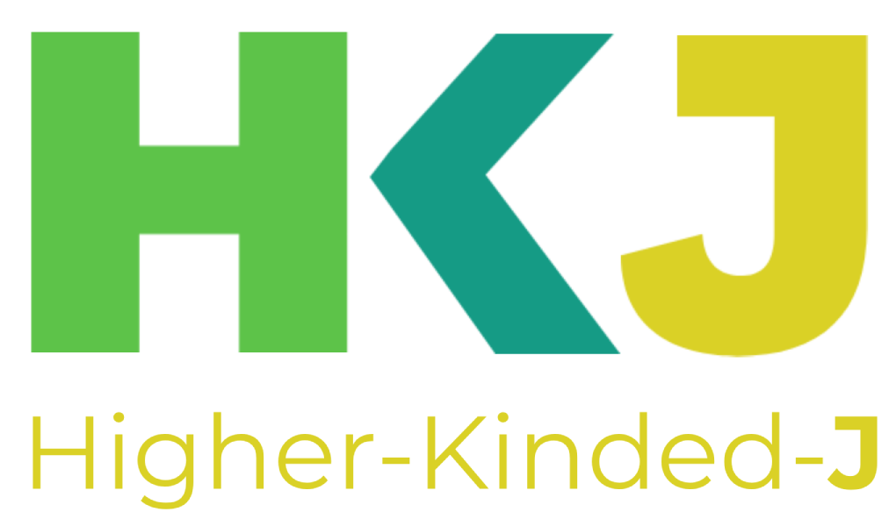
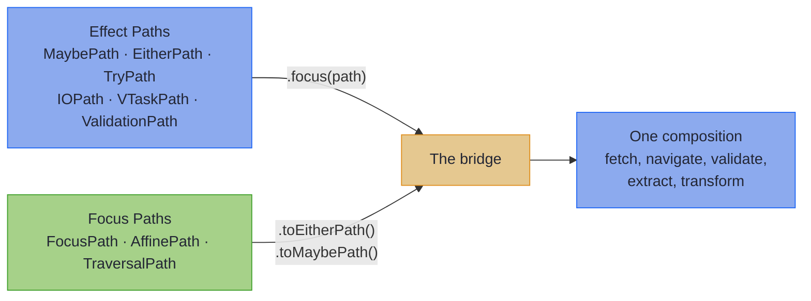

<div class="hkj-logo" style="text-align: center; margin: 1rem 0;">
  
  
</div>

<h2 class="hkj-strapline"><a href="https://github.com/higher-kinded-j/higher-kinded-j">Unifying Composable Effects and Advanced Optics for Java</a></h2>

<div style="text-align: center;">
  <a href="https://github.com/higher-kinded-j/higher-kinded-j"></a>
  <a href="https://codecov.io/gh/higher-kinded-j/higher-kinded-j"></a>
  <a href="https://central.sonatype.com/artifact/io.github.higher-kinded-j/hkj-core"></a>
  <a href="https://central.sonatype.com/repository/maven-snapshots/io/github/higher-kinded-j/hkj-core/"></a>
  <a href="https://github.com/higher-kinded-j/higher-kinded-j/discussions"></a>
  <a href="https://techhub.social/@ultramagnetic"></a>
</div>

---

Higher-Kinded-J brings two capabilities that Java has long needed: composable error handling through the **[Effect Path API](effect/ch_intro.md)**, and type-safe immutable data navigation through the **[Focus DSL](optics/focus_dsl.md)**. Each is powerful alone. Together they form one approach to building robust applications, where effects and structure compose in the same vocabulary. At the edge of a service, **[Mapping at the Boundary](mapping/ch_intro.md)** turns the DTO-to-domain mapper into compile-time codegen that never loses an error, and for services that need several execution modes, **[Effect Handlers](effect/effect_handlers_intro.md)** let you define domain operations as data and interpret them differently for production, testing, or audit.

No more pyramids of nested checks. No more scattered validation logic. Just clean, flat pipelines that read like the business logic they represent.

---

## What You Get

Two artefacts, before any theory. The first is the shape of the code you write: a railway where success travels one track and failure the other, and every step reads top-to-bottom.

```java
// Traditional Java: pyramid of nested checks
if (user != null) {
    if (validator.validate(request).isValid()) {
        try {
            return paymentService.charge(user, amount);
        } catch (PaymentException e) { ... }
    }
}

// Effect Path API: flat, composable railway
return Path.maybe(findUser(userId))
    .toEitherPath(() -> new UserNotFound(userId))
    .via(user -> Path.either(validator.validate(request)))
    .via(valid -> Path.tryOf(() -> paymentService.charge(user, amount)))
    .map(OrderResult::success);
```

The nesting is gone. Each step follows the same pattern. Failures propagate automatically.

The second is what a client sees when the data is bad. A request with five defects (one inside a nested record, one on the second element of a list), answered by one response, with nobody writing a line of error-handling code to produce it:

```json
{
  "valid": false,
  "errors": [
    { "path": "id",             "message": "not a UUID (expected e.g. 123e4567-e89b-12d3-a456-426614174000)" },
    { "path": "customer.email", "message": "not an email address" },
    { "path": "lines.1.price",  "message": "not a number in plain notation (expected e.g. 123.45)" },
    { "path": "placedAt",       "message": "not an ISO-8601 instant (expected e.g. 2026-07-28T12:34:56Z)" },
    { "path": "status",         "message": "unknown OrderStatus (expected one of NEW, PAID, SHIPPED)" }
  ],
  "errorCount": 5
}
```

It falls out of one spec interface and one annotation, and the [mapping capstone](mapping/capstone.md) builds it end to end, proven by a test the build runs. The client fixes all five and resubmits once.

---

## Getting Started

One line configures the dependencies, the annotation processors, `-parameters`, the preview flags and compile-time Path checking:

```gradle
// build.gradle.kts
plugins {
    id("io.github.higher-kinded-j.hkj") version "LATEST_VERSION"
}
```

* **[Quickstart](quickstart.md)**: Gradle and Maven setup, including the Maven plugin and the required Java 25 preview flags, and your first Effect Paths in five minutes
* **[Where to Start](where_to_start.md)**: one question, five answers, and the tool each one points at
* **[Cheat Sheet](cheatsheet.md)**: a one-page operator reference

---

## The Bridge: Effects Meet Optics

What makes Higher-Kinded-J unique is that **Effect Paths** and the **Focus DSL** speak the same language. Where Effect Paths navigate *computational effects*, Focus Paths navigate *data structures*. Both compose with `via`, and when you need to cross between them, the bridge connects the two worlds:



```java
// Fetch user (effect) → navigate to address (optics) →
// extract postcode (optics) → validate (effect)
EitherPath<Error, String> result =
    userService.findById(userId)           // EitherPath<Error, User>
        .focus(UserFocus.address())        // EitherPath<Error, Address>
        .focus(AddressFocus.postcode())    // EitherPath<Error, String>
        .via(code -> validatePostcode(code));
```

This is the unification Java has been missing: effects and structure, composition and navigation, one vocabulary.

**[Discover Optics Integration →](effect/focus_integration.md)**

---

## Why Higher-Kinded-J?

Modern Java handed you records, sealed interfaces, and pattern matching. What it didn't hand you is a way to make them *compose*: errors that chain instead of nest, validation that collects every failure instead of stopping at the first, deep immutable updates in one line instead of nested `with…` calls, and typed errors that survive a network hop. Higher-Kinded-J is the missing layer.

You don't need to learn an esoteric functional library to feel the benefit. Each capability replaces something you already reach for today:

| Instead of… | Today you reach for | Higher-Kinded-J gives you |
|-------------|---------------------|---------------------------|
| Nested `Optional`, thrown exceptions, and validation that stops at the first error | the standard library | one railway vocabulary (`map` / `via` / `recover`) across absence, typed errors, async, and **accumulating** validation |
| `Option` / `Either` / `Try` from **Vavr** | the FP library most Java developers know | the same core types **plus** higher-kinded abstraction, a full optics suite, monad transformers, and an effect system, built natively on modern Java (records, sealed types, virtual threads), where Vavr keeps a Java 8 foundation |
| Hand-written DTO↔domain mappers and validation glue | custom converter classes per pair | `@GenerateMapping` over record, bean-shaped and generic wires: a total `build`, an accumulating `parse` that reports every bad field (nulls located, never an NPE), a stock codec vocabulary, and generated PATCH write-backs, all law-checked by the build's test suite |
| **Resilience4j** annotations for retry / circuit-breaker / bulkhead | AOP-style resilience | the same policies as composable path combinators (`withRetry` / `withCircuitBreaker` / `withBulkhead`) that treat a business `Left` as a value, never as a failure to retry |
| Hand-written `wither` / copy-constructor updates on records | manual boilerplate | generated lenses, prisms, and traversals: the most comprehensive optics available for Java |

And unlike any of those tools, effects and data navigation speak **the same language**: the [Effect-Optics bridge](#the-bridge-effects-meet-optics) above is something no other Java library offers.

~~~admonish tip title="Why this matters"
Every row in that table is a guarantee, not a convenience. An `Either` in a return type is checked by the compiler where an exception is not; an accumulating `parse` answers a client once where a first-failure mapper costs one round trip per defect; a generated lens is law-checked where a hand-written wither is trusted. The library holds itself to the same bar: every emission tier is pinned by golden files, the optic and mapping laws ship in `hkj-test` for your own types, and every HKJ module compiles under the HKJ checker at zero findings.
~~~

~~~admonish note title="How the optics compare to other Java optics libraries" collapsible=true
Higher-Kinded-J also offers the most advanced optics implementation in the Java ecosystem. Measured against the dedicated Java optics libraries:

| Feature | Higher-Kinded-J | Functional Java | Fugue Optics | Derive4J |
|---------|:--------------:|:---------------:|:------------:|:--------:|
| **Lens** | ✓ | ✓ | ✓ | ✓^1^ |
| **Prism** | ✓ | ✓ | ✓ | ✓^1^ |
| **Iso** | ✓ | ✓ | ✓ | ✗ |
| **Affine/Optional** | ✓ | ✓ | ✓ | ✓^1^ |
| **Traversal** | ✓ | ✓ | ✓ | ✗ |
| **Filtered Traversals** | ✓ | ✗ | ✗ | ✗ |
| **Indexed Optics** | ✓ | ✗ | ✗ | ✗ |
| **Code Generation** | ✓ | ✗ | ✗ | ✓^1^ |
| **External Type Spec Interfaces** | ✓ | ✗ | ✗ | ✗ |
| **Java Records Support** | ✓ | ✗ | ✗ | ✗ |
| **Sealed Interface Support** | ✓ | ✗ | ✗ | ✗ |
| **Effect Integration** | ✓ | ✗ | ✗ | ✗ |
| **Focus DSL** | ✓ | ✗ | ✗ | ✗ |
| **Profunctor Architecture** | ✓ | ✓ | ✓ | ✗ |
| **Fluent API** | ✓ | ✗ | ✗ | ✗ |
| **Modern Java (21+)** | ✓ | ✗ | ✗ | ✗ |
| **Virtual Threads** | ✓ | ✗ | ✗ | ✗ |
| **Effect Handlers / Free Monads** | ✓ | ✗ | ✗ | ✗ |

^1^ *Derive4J generates getters/setters but requires Functional Java for actual optic classes*
~~~

---

## What's in the Library

Each capability has a chapter that opens with the problem it solves and closes with a capstone. The short version of each:

### [Effect Path API](effect/ch_intro.md)

A railway model for computation: `map`, `via` and `recover` work identically whether you are handling optional values, typed errors, accumulated validations, exceptions or deferred side effects. `ForPath` comprehensions sequence steps by name, and the lazy carriers (`IOPath`, `VTaskPath`, `VResultPath`) chain **[path-native resilience](resilience/ch_intro.md)** (`withRetry`, `withTimeout`, `withCircuitBreaker`, `withBulkhead`) that treats a business `Left` as a value, never as a failure to retry. `VTaskPath` and `VStreamPath` put structured concurrency on virtual threads behind the same vocabulary.

### [Optics](optics/ch_intro.md)

The most comprehensive optics implementation available for Java. Write a record, add `@GenerateLenses` and `@GenerateFocus`, and the processor writes a typed path builder: `UserFocus.address().street().name().set("New Street", user)`. Lenses, prisms, isos, affines, traversals, folds and setters, all composable; sealed interfaces (`@GeneratePrisms`), collections (`@GenerateTraversals`), types you don't own (`@ImportOptics` for Jackson, JOOQ, Immutables, Lombok, AutoValue and Protocol Buffers); filtered and indexed traversals; and [31 container types](optics/focus_containers.md) across the JDK and five third-party collection libraries widening to the right path type automatically. Start at the [Quickstart](optics/quickstart.md) or the [Annotations at a Glance](optics/annotations_at_a_glance.md) table.

### [Mapping at the Boundary](mapping/ch_intro.md)

One spec interface and one annotation replace the hand-written mapper. `@GenerateMapping` derives both directions at compile time for record, bean-shaped and generic wires of any width: a total `build` out, an accumulating `parse` back that locates every bad field (`customer.email`, `lines.1.price`), both PATCH styles as write-backs, and a [stock codec vocabulary](mapping/codecs.md#standard-codecs) (`uuid`, `localDate`, `instant`, `enumByName`, `bigDecimal` and more), so a typical boundary needs no hand-written leaves. `@GenerateMerge` assembles one record from several; `@GenerateErrorEnvelope` gives a sealed error hierarchy a typed context. Every tier is law-checked and pinned by golden files.

### [Effect Handlers](effect/effect_handlers_intro.md)

Algebraic-effect-style programming via Free monads and interpreters. Define domain operations as a sealed interface with record variants (`@EffectAlgebra` generates the functor, smart constructors and interpreter skeleton), compose several with `@ComposeEffects`, then write one interpreter per mode (production, test, dry-run, audit) and run the same program unchanged through each. Mock-free testing through `Id` interpreters; `ProgramAnalyser` inspects a program before any side effect executes.

### [Spring Boot Integration](spring/spring_boot_integration.md)

The `hkj-spring-boot-starter` lets controllers return `Either`, `Validated`, `EitherPath`, `VTaskPath` and the rest directly: `Right` is a 200, a typed `Left` maps to its status, and an `Invalid` of located field errors renders as **one 422 listing every bad field by path**, with no exception handler and no hand-rolled error DTO. `@HkjHttpClient` generates declarative clients that decode a response back into a typed error, so the error channel survives the network hop. Actuator metrics, Spring Security integration and an `EffectBoundary` for interpreter selection come with it.

### [Testing With hkj-test](tooling/test_assertions.md)

Fluent AssertJ assertions for every type in the library, `assertThatEither(result).isRight().hasRight(42)`, plus the optic laws (`LensLaws`, `PrismLaws`, `TraversalLaws`, `ValidatedPrismLaws`), the `MappingLaws` every generated mapping is checked against, and a `SteppableClock` for deterministic time. On Java 25, `import module org.higherkindedj.test;` brings every helper into scope in one line.

### [Foundations](hkts/foundations_intro.md)

Underneath it all: a simulation of higher-kinded types by defunctionalisation, so `Functor`, `Applicative`, `Monad`, `Traverse` and friends can be written once and applied across `Optional`, `List`, `CompletableFuture`, `VTask` and your own types; the core types (`Either`, `Maybe`, `Try`, `Validated`, `IO`, `Reader`, `Writer`, `State`, `Free`); and the [monad transformers and MTL capabilities](transformers/ch_intro.md) for the cases the Path API does not fit: a different outer monad, or polymorphic library code. Most applications start with Effect Paths and never need to look down here; the [triage page](transformers/when_to_drop_to_transformers.md) says when you do.

---

## Path Types at a Glance

| Path Type | When to Reach for It |
|-----------|---------------------|
| `MaybePath<A>` | Absence is normal, not an error |
| `EitherPath<E, A>` | Errors carry typed, structured information |
| `EitherOrBothPath<L, A>` | Success that also carries non-fatal warnings (inclusive-or) |
| `TryPath<A>` | Wrapping code that throws exceptions |
| `ValidationPath<E, A>` | Collecting *all* errors, not just the first |
| `IOPath<A>` | Side effects you want to defer and sequence |
| `VResultPath<E, A>` | Async work that fails with a *typed* domain error (`VTask<Either<E, A>>`) |
| `TrampolinePath<A>` | Stack-safe recursion |
| `CompletableFuturePath<A>` | Async operations |
| `ReaderPath<R, A>` | Dependency injection, configuration access |
| `WriterPath<W, A>` | Logging, audit trails, collecting metrics |
| `WithStatePath<S, A>` | Stateful computations (parsers, counters) |
| `ListPath<A>` | Batch processing with positional zipping |
| `StreamPath<A>` | Lazy sequences, large data processing |
| `NonDetPath<A>` | Non-deterministic search, combinations |
| `LazyPath<A>` | Deferred evaluation, memoisation |
| `IdPath<A>` | Pure computations (testing, generic code) |
| `OptionalPath<A>` | Bridge for Java's standard `Optional` |
| `FreePath<F, A>` / `FreeApPath<F, A>` | DSL building and interpretation |
| `VTaskPath<A>` | Virtual thread-based concurrency with Par combinators |
| `VStreamPath<A>` | Lazy pull-based streaming on virtual threads |

Each Path wraps its underlying effect and provides `map`, `via`, `run`, `recover`, and integration with the Focus DSL. The lazy carriers (`IOPath`, `VTaskPath`, `VResultPath`) additionally chain **[path-native resilience](resilience/ch_intro.md)** (`withRetry` / `withTimeout` / `withCircuitBreaker` / `withBulkhead`) that treats a business `Left` as a value, never as a failure to retry.

---

## Learn by Doing

The fastest way to master Higher-Kinded-J is through our **interactive tutorial series**. Seventeen journeys guide you through hands-on exercises with immediate test feedback.

| Journey | Focus | Duration | Exercises |
|---------|-------|----------|-----------|
| **[Core: Foundations](tutorials/coretypes/foundations_journey.md)** | HKT simulation, Functor, Applicative, Monad | ~40 min | 24 |
| **[Core: Error Handling](tutorials/coretypes/error_handling_journey.md)** | MonadError, concrete types, real-world patterns | ~30 min | 20 |
| **[Core: Advanced](tutorials/coretypes/advanced_journey.md)** | Natural Transformations, Coyoneda, Free Applicative | ~40 min | 26 |
| **[Effect API](tutorials/effect/effect_journey.md)** | Effect paths, ForPath, Effect Contexts | ~65 min | 15 |
| **[Monad Transformers](tutorials/transformers/transformers_journey.md)** | When Path isn't enough, async + absence, stacking, MTL | ~90 min | 28 |
| **[Expression: ForState](tutorials/expression/forstate_journey.md)** | Named fields, guards, pattern matching, zoom | ~25 min | 11 |
| **[Expression: ForPath Parallel](tutorials/expression/forpath_parallel_journey.md)** | Parallel composition, accumulating and racing steps | ~20 min | 9 |
| **[Concurrency: VTask](tutorials/concurrency/vtask_journey.md)** | Virtual threads, VTaskPath, Par combinators | ~45 min | 16 |
| **[Concurrency: Scope & Resource](tutorials/concurrency/scope_resource_journey.md)** | Structured concurrency, resource management | ~30 min | 12 |
| **[Resilience Patterns](tutorials/resilience/resilience_journey.md)** | Circuit breaker, saga, retry, bulkhead | ~45 min | 22 |
| **[Optics: Lens & Prism](tutorials/optics/lens_prism_journey.md)** | Lens basics, Prism, Affine | ~40 min | 30 |
| **[Optics: Traversals](tutorials/optics/traversals_journey.md)** | Traversals, composition, practical applications | ~40 min | 27 |
| **[Optics: Fluent & Free](tutorials/optics/fluent_free_journey.md)** | Fluent API, Free Monad DSL | ~35 min | 22 |
| **[Optics: Focus DSL](tutorials/optics/focus_dsl_journey.md)** | Type-safe path navigation, container widening | ~35 min | 29 |
| **[Optics: Batching & Coupled Updates](tutorials/optics/batching_journey.md)** | Optic-driven request batching, `Edits`, coupled fields | ~40 min | 13 |
| **[Optics: Boundary Mapping](tutorials/optics/boundary_mapping_journey.md)** | Multi-edit and sparse updates, `@GenerateMapping`, the 422 leg | ~35 min | 13 |
| **[Capstone: One Line, Six Layers](tutorials/capstone/capstone_journey.md)** | One pipeline across effects, optics, resilience and concurrency | ~30 min | 7 |

Perfect for developers who prefer learning by building. [Get started →](tutorials/tutorials_intro.md)

---

## Documentation Guide

~~~admonish tip title="Recommended Starting Point"
If you want working code immediately, start with the **[Quickstart](quickstart.md)**. For a deeper understanding, continue with the **Effect Path API** section below.
~~~

### Effect Path API (Start Here)
1. **[Quickstart](effect/quickstart.md):** Three runnable examples showing MaybePath, EitherPath, and ForPath in about 150 lines
2. **[Core Paths](effect/effect_path_overview.md):** The railway model, the six core path types, composition, and basic ForPath comprehensions
3. **[Optics Integration](effect/focus_integration.md):** Bridging Effect Paths with the Focus DSL
4. **[Advanced Paths](effect/advanced_topics.md):** Free monads, effect handlers, contexts, ForPath parallelism, and resilience
5. **[Reference](effect/capabilities.md):** Capability type classes, type conversions, compiler errors, and production readiness

### Optics
1. **[Quickstart](optics/quickstart.md):** Three runnable examples covering generated lenses, prisms and traversals, plus `@ImportOptics` for Jackson
2. **[Annotations at a Glance](optics/annotations_at_a_glance.md):** Every annotation, what it generates, and when to reach for each one
3. **[Fundamentals](optics/ch1_intro.md):** Lens, Prism, Affine, Iso, composition rules, and coupled fields
4. **[Java-Friendly APIs](optics/ch4_intro.md):** Focus DSL, optics for external types, Kind field support, and the Fluent API
5. **[Integration and Recipes](optics/ch5_intro.md):** Validation pipelines, core-type integration, and the cookbook
6. **[Advanced Optics](optics/ch6_intro.md):** Free Monad DSL and interpreters for programs-as-data
7. **[Reference](optics/ch7_intro.md):** Capabilities, conversions, compiler errors, production readiness, and consolidated decision trees

### Mapping at the Boundary
1. **[Introduction](mapping/ch_intro.md):** The mapper every service carries, and the one response that replaces it
2. **[Basics](mapping/basics.md):** One spec interface, both directions, every bad field located
3. **[Standard Codecs and Shared Vocabulary](mapping/codecs.md):** The stock `ValidatedPrism` leaves, custom codecs, and mix-in interfaces
4. **[Beans and Sparse PATCH](mapping/beans_patch.md):** Bean-shaped wires and the `UpdateSpec` write-back
5. **[Capstone](mapping/capstone.md):** One 422, every bad field, compiled and law-checked

### Monad Transformers
For the cases where the Path API does not fit (a different outer monad, polymorphic library code, or integrating with raw `Kind` shapes).

1. **[Path or Transformer?](transformers/when_to_drop_to_transformers.md):** The triage page; read this first to know whether the rest of the chapter applies to you
2. **[Quickstart](transformers/quickstart.md):** Three runnable transformer examples in about 150 lines
3. **[Stack Archetypes](transformers/archetypes.md):** Seven named patterns covering the most common composition problems
4. **[MTL Capabilities](transformers/mtl_capabilities.md):** Stack-independent capability abstractions for polymorphic library code
5. **[Capstone](transformers/transformer_capstone.md):** End-to-end multi-capability workflow combining typed errors, configuration, audit, and async
6. **[Common Compiler Errors](transformers/common_errors.md):** Six common errors and the fix for each

### Effect Handlers
1. **[Effect Handlers Introduction](effect/effect_handlers_intro.md):** Motivation, terminology, and when to use
2. **[Effect Handler Reference](effect/effect_handlers.md):** Defining, composing, and interpreting effects
3. **[Payment Processing Example](examples/payment_processing.md):** Complete worked example with four interpreters

### Foundations (Reference)
These sections document the underlying machinery. Most users can start with Effect Paths directly.

1. **[Higher-Kinded Types](hkts/hkt_introduction.md):** The simulation and why it matters
2. **[Type Classes](functional/ch_intro.md):** Functor, Monad, and other type classes
3. **[Core Types](monads/ch_intro.md):** Either, Maybe, Try, and other effect types
4. **[Order Example Walkthrough](hkts/order-walkthrough.md):** A complete workflow with monad transformers

~~~admonish info title="Key Takeaways"
* **One vocabulary**: `map`, `via` and `recover` work the same across absence, typed errors, exceptions, accumulating validation, deferred I/O and virtual-thread concurrency
* **Effects and structure compose**: `.focus(path)` takes an Effect Path through a Focus Path and back, which no other Java library offers
* **Optics are generated, not written**: `@GenerateLenses`, `@GenerateFocus`, `@GeneratePrisms`, `@GenerateTraversals` and `@ImportOptics` cover records, sealed types, collections and types you don't own
* **The boundary never loses an error**: `@GenerateMapping` derives both directions, locates every bad field, and renders as one 422 at a Spring controller
* **Everything is law-checked**: the optic and mapping laws ship in `hkj-test`, and the library compiles under its own checker
* **Start with the [Quickstart](quickstart.md)**, and reach for the foundations only when the [triage page](transformers/when_to_drop_to_transformers.md) says so
~~~

### History

**Higher-Kinded-J evolved from a simulation** originally created for the blog post [Higher Kinded Types with Java and Scala](https://blog.scottlogic.com/2025/04/11/higher-kinded-types-with-java-and-scala.html). Since then it has grown into a comprehensive functional programming toolkit, with the Effect Path API providing the unifying layer that connects HKTs, type classes, and optics into a coherent whole.
