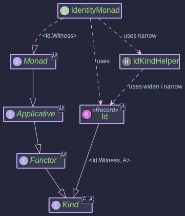

# Identity Monad (Id)

The Identity Monad, often referred to as `Id`, is the simplest possible monad. It represents a computation that doesn't add any additional context or effect beyond simply holding a value. It's a direct wrapper around a value.

While it might seem trivial on its own, the Identity Monad plays a crucial role in a higher-kinded type library for several reasons:

1. **Base Case for Monad Transformers**: Many monad transformers (like `StateT`, `ReaderT`, `MaybeT`, etc.) can be specialized to their simpler, non-transformed monad counterparts by using `Id` as the underlying monad. For example:

   * `StateT<S, Id.Witness, A>` is conceptually equivalent to `State<S, A>`.
   * `MaybeT<Id.Witness, A>` is conceptually equivalent to `Maybe<A>`.
     This allows for a unified way to define transformers and derive base monads.
2. **Generic Programming**: When writing functions that are generic over any `Monad<F>`, `Id` can serve as the "no-effect" monad, allowing you to use these generic functions with pure values without introducing unnecessary complexity.
3. **Understanding Monads**: It provides a clear example of the monadic structure (`of`, `flatMap`, `map`) without any distracting side effects or additional computational context.

## What is Id?

An `Id<A>` is simply a container that holds a value of type `A`.

* `Id.of(value)` creates an `Id` instance holding `value`.
* `idInstance.value()` retrieves the value from the `Id` instance.

## Key Classes and Concepts




* **`Id<A>`**: The data type itself. It's a final class that wraps a value of type `A`. It implements `Kind<Id.Witness, A>`.
* **`Id.Witness`**: A static nested class (or interface) used as the first type parameter to `Kind` (i.e., `F` in `Kind<F, A>`) to represent the `Id` type constructor at the type level. This is part of the HKT emulation pattern.
* **`IdKindHelper`**: A utility class providing static helper methods:
  * `narrow(Kind<Id.Witness, A> kind)`: Safely casts a `Kind` back to a concrete `Id<A>`.
  * `wrap(Id<A> id)`: Casts an `Id<A>` to `Kind<Id.Witness, A>`. (Often an identity cast since `Id` implements `Kind`).
  * `unwrap(Kind<Id.Witness, A> kind)`: A convenience to narrow and then get the value.
* **`IdentityMonad`**: The singleton class that implements `Monad<Id.Witness>`, providing the monadic operations for `Id`.

## Using `Id` and `IdentityMonad`

~~~admonish example title="Example 1: Creating Id Instances"

- [IdExample.java](https://github.com/higher-kinded-j/higher-kinded-j/tree/main/src/main/java/org/higherkindedj/example/basic/id/IdExample.java)

```java
public void createExample(){
  // Direct creation
  Id<String> idString = Id.of("Hello, Identity!");
  Id<Integer> idInt = Id.of(123);
  Id<String> idNull = Id.of(null); // Id can wrap null

  // Accessing the value
  String value = idString.value(); // "Hello, Identity!"
  Integer intValue = idInt.value();   // 123
  String nullValue = idNull.value(); // null
}
```
~~~

~~~admonish example title="Example 2: Using with IdentityMonad"

- [IdExample.java](https://github.com/higher-kinded-j/higher-kinded-j/tree/main/src/main/java/org/higherkindedj/example/basic/id/IdExample.java)

The `IdentityMonad` provides the standard monadic operations.

```java
public void monadExample(){
  IdentityMonad idMonad = IdentityMonad.instance();

  // 1. 'of' (lifting a value)
  Kind<Id.Witness, Integer> kindInt = idMonad.of(42);
  Id<Integer> idFromOf = IdKindHelper.narrow(kindInt);
  System.out.println("From of: " + idFromOf.value()); // Output: From of: 42

  // 2. 'map' (applying a function to the wrapped value)
  Kind<Id.Witness, String> kindStringMapped = idMonad.map(
      i -> "Value is " + i,
      kindInt
  );
  Id<String> idMapped = IdKindHelper.narrow(kindStringMapped);
  System.out.println("Mapped: " + idMapped.value()); // Output: Mapped: Value is 42

  // 3. 'flatMap' (applying a function that returns an Id)
  Kind<Id.Witness, String> kindStringFlatMapped = idMonad.flatMap(
      i -> Id.of("FlatMapped: " + (i * 2)), // Function returns Id<String>
      kindInt
  );
  Id<String> idFlatMapped = IdKindHelper.narrow(kindStringFlatMapped);
  System.out.println("FlatMapped: " + idFlatMapped.value()); // Output: FlatMapped: 84

  // flatMap can also be called directly on Id if the function returns Id
  Id<String> directFlatMap = idFromOf.flatMap(i -> Id.of("Direct FlatMap: " + i));
  System.out.println(directFlatMap.value()); // Output: Direct FlatMap: 42

  // 4. 'ap' (applicative apply)
  Kind<Id.Witness, Function<Integer, String>> kindFunction = idMonad.of(i -> "Applied: " + i);
  Kind<Id.Witness, String> kindApplied = idMonad.ap(kindFunction, kindInt);
  Id<String> idApplied = IdKindHelper.narrow(kindApplied);
  System.out.println("Applied: " + idApplied.value()); // Output: Applied: 42
}
```
~~~

~~~admonish example title="Example 3: Using Id with Monad Transformers"

- [IdExample.java](https://github.com/higher-kinded-j/higher-kinded-j/tree/main/src/main/java/org/higherkindedj/example/basic/id/IdExample.java)

As mentioned in the [StateT Monad Transformer](./statet_transformer.md) documentation, `State<S,A>` can be thought of as `StateT<S, Id.Witness, A>`.

Let's illustrate how you might define a `State` monad type alias or use `StateT` with `IdentityMonad`:

```java
  public void transformerExample(){
  // Conceptually, State<S, A> is StateT<S, Id.Witness, A>
  // We can create a StateTMonad instance using IdentityMonad as the underlying monad.
  StateTMonad<Integer, Id.Witness> stateMonadOverId =
      StateTMonad.instance(IdentityMonad.instance());

  // Example: A "State" computation that increments the state and returns the old state
  Function<Integer, Kind<Id.Witness, StateTuple<Integer, Integer>>> runStateFn =
      currentState -> Id.of(StateTuple.of(currentState + 1, currentState));

  // Create the StateT (acting as State)
  Kind<StateTKind.Witness<Integer, Id.Witness>, Integer> incrementAndGet =
      StateTKindHelper.stateT(runStateFn, IdentityMonad.instance());

  // Run it
  Integer initialState = 10;
  Kind<Id.Witness, StateTuple<Integer, Integer>> resultIdTuple =
      StateTKindHelper.runStateT(incrementAndGet, initialState);

  // Unwrap the Id and then the StateTuple
  Id<StateTuple<Integer, Integer>> idTuple = IdKindHelper.narrow(resultIdTuple);
  StateTuple<Integer, Integer> tuple = idTuple.value();

  System.out.println("Initial State: " + initialState);       // Output: Initial State: 10
  System.out.println("Returned Value (Old State): " + tuple.value()); // Output: Returned Value (Old State): 10
  System.out.println("Final State: " + tuple.state());         // Output: Final State: 11
}
```


This example shows that `StateT` with `Id` behaves just like a standard `State` monad, where the "effect" of the underlying monad is simply identity (no additional effect).

~~~
