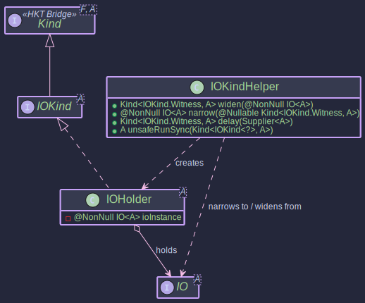

# Higher-Kinded-J: Managing Side Effects with `IO`

In functional programming, managing side effects (like printing to the console, reading files, making network calls, generating random numbers, or getting the current time) while maintaining purity is a common challenge.

The `IO<A>` monad in `higher-kinded-j` provides a way to encapsulate these side-effecting computations, making them first-class values that can be composed and manipulated functionally.

The key idea is that an `IO<A>` value doesn't *perform* the side effect immediately upon creation. Instead, it represents a *description* or *recipe* for a computation that, when executed, will perform the effect and potentially produce a value of type `A`. The actual execution is deferred until explicitly requested.

## Core Components

**The IO Type**


**The HKT Bridge for IO**



**Typeclasses for IO**


The `IO` functionality is built upon several related components:

1. **`IO<A>`**: The core functional interface. An `IO<A>` instance essentially wraps a `Supplier<A>` (or similar function) that performs the side effect and returns a value `A`. The crucial method is `unsafeRunSync()`, which executes the encapsulated computation.
2. **`IOKind<A>`**: The HKT marker interface (`Kind<IOKind.Witness, A>`) for `IO`. This allows `IO` to be treated as a generic type constructor `F` in type classes like `Functor`, `Applicative`, and `Monad`. The witness type is `IOKind.Witness`.
3. **`IOKindHelper`**: The essential utility class for working with `IO` in the HKT simulation. It provides:
   * `wrap(IO<A>)`: Wraps a concrete `IO<A>` instance into its HKT representation `IOKind<A>`.
   * `unwrap(Kind<IOKind.Witness, A>)`: Unwraps an `IOKind<A>` back to the concrete `IO<A>`. Throws `KindUnwrapException` if the input Kind is invalid.
   * `delay(Supplier<A>)`: The primary factory method to create an `IOKind<A>` by wrapping a side-effecting computation described by a `Supplier`.
   * `unsafeRunSync(Kind<IOKind.Witness, A>)`: The method to *execute* the computation described by an `IOKind`. This is typically called at the "end of the world" in your application (e.g., in the `main` method) to run the composed IO program.
4. **`IOFunctor`**: Implements `Functor<IOKind.Witness>`. Provides the `map` operation to transform the result value `A` of an `IO` computation *without* executing the effect.
5. **`IOApplicative`**: Extends `IOFunctor` and implements `Applicative<IOKind.Witness>`. Provides `of` (to lift a pure value into `IO` without side effects) and `ap` (to apply a function within `IO` to a value within `IO`).
6. **`IOMonad`**: Extends `IOApplicative` and implements `Monad<IOKind.Witness>`. Provides `flatMap` to sequence `IO` computations, ensuring effects happen in the intended order.

## Purpose and Usage

* **Encapsulating Side Effects**: Describe effects (like printing, reading files, network calls) as `IO` values without executing them immediately.
* **Maintaining Purity**: Functions that create or combine `IO` values remain pure. They don't perform the effects themselves, they just build up a description of the effects to be performed later.
* **Composition**: Use `map` and `flatMap` (via `IOMonad`) to build complex sequences of side-effecting operations from smaller, reusable `IO` actions.
* **Deferred Execution**: Effects are only performed when `unsafeRunSync` is called on the final, composed `IO` value. This separates the description of the program from its execution.

**Important Note:**`IO` in this library primarily deals with *deferring* execution. It does *not* automatically provide sophisticated error handling like `Either` or `Try`, nor does it manage asynchronicity like `CompletableFuture`. Exceptions thrown during `unsafeRunSync` will typically propagate unless explicitly handled *within* the `Supplier` provided to `IOKindHelper.delay`.

~~~admonish example title="Example 1: Creating Basic IO Actions"

- [IOExample.java](https://github.com/higher-kinded-j/higher-kinded-j/tree/main/src/main/java/org/higherkindedj/example/basic/io/IOExample.java)

Use `IOKindHelper.delay` to capture side effects. Use `IOMonad.of` for pure values within IO.

```java
import org.higherkindedj.hkt.Kind;
import org.higherkindedj.hkt.io.*; 
import org.higherkindedj.hkt.unit.Unit;
import java.util.function.Supplier;
import java.util.Scanner;

// Get the IOMonad instance
IOMonad ioMonad = new IOMonad();

// IO action to print a message
Kind<IOKind.Witness, Unit> printHello = IOKindHelper.delay(() -> {
    System.out.println("Hello from IO!");
    return Unit.INSTANCE;
});

// IO action to read a line from the console
Kind<IOKind.Witness, String> readLine = IOKindHelper.delay(() -> {
    System.out.print("Enter your name: ");
    // Scanner should ideally be managed more robustly in real apps
    try (Scanner scanner = new Scanner(System.in)) {
         return scanner.nextLine();
    }
});

// IO action that returns a pure value (no side effect description here)
Kind<IOKind.Witness, Integer> pureValueIO = ioMonad.of(42);

// IO action that simulates getting the current time (a side effect)
Kind<IOKind.Witness, Long> currentTime = IOKindHelper.delay(System::currentTimeMillis);

// Creating an IO action that might fail internally
Kind<IOKind.Witness, String> potentiallyFailingIO = IOKindHelper.delay(() -> {
   if (Math.random() < 0.5) {
       throw new RuntimeException("Simulated failure!");
   }
   return "Success!";
});


```
~~~

*Nothing happens when you create these `IOKind` values. The `Supplier` inside `delay` is not executed.*


~~~admonish example title="Example 2. Executing IO Actions"

- [IOExample.java](https://github.com/higher-kinded-j/higher-kinded-j/tree/main/src/main/java/org/higherkindedj/example/basic/io/IOExample.java)

Use `IOKindHelper.unsafeRunSync` to run the computation.

```java
// (Continuing from above examples)

// Execute printHello
System.out.println("Running printHello:");
IOKindHelper.unsafeRunSync(printHello); // Actually prints "Hello from IO!"

// Execute readLine (will block for user input)
// System.out.println("\nRunning readLine:");
// String name = IOKindHelper.unsafeRunSync(readLine);
// System.out.println("User entered: " + name);

// Execute pureValueIO
System.out.println("\nRunning pureValueIO:");
Integer fetchedValue = IOKindHelper.unsafeRunSync(pureValueIO);
System.out.println("Fetched pure value: " + fetchedValue); // Output: 42

// Execute potentiallyFailingIO
System.out.println("\nRunning potentiallyFailingIO:");
try {
String result = IOKindHelper.unsafeRunSync(potentiallyFailingIO);
   System.out.println("Succeeded: " + result);
} catch (RuntimeException e) {
   System.err.println("Caught expected failure: " + e.getMessage());
   }

// Notice that running the same IO action again executes the effect again
   System.out.println("\nRunning printHello again:");
IOKindHelper.unsafeRunSync(printHello); // Prints "Hello from IO!" again
```
~~~~

~~~admonish title="Example 3: Composing IO Actions with `map` and `flatMap`"

- [IOExample.java](https://github.com/higher-kinded-j/higher-kinded-j/tree/main/src/main/java/org/higherkindedj/example/basic/io/IOExample.java)

Use `IOMonad` instance methods.

```java
import org.higherkindedj.hkt.io.IOMonad;
import org.higherkindedj.hkt.unit.Unit;
import java.util.function.Function;

IOMonad ioMonad = new IOMonad();

// --- map example ---
Kind<IOKind.Witness, String> readLineAction = IOKindHelper.delay(() -> "Test Input"); // Simulate input

// Map the result of readLineAction without executing readLine yet
Kind<IOKind.Witness, String> greetAction = ioMonad.map(
    name -> "Hello, " + name + "!", // Function to apply to the result
    readLineAction
);

System.out.println("Greet action created, not executed yet.");
// Now execute the mapped action
String greeting = IOKindHelper.unsafeRunSync(greetAction);
System.out.println("Result of map: " + greeting); // Output: Hello, Test Input!

// --- flatMap example ---
// Action 1: Get name
Kind<IOKind.Witness, String> getName = IOKindHelper.delay(() -> {
    System.out.println("Effect: Getting name...");
    return "Alice";
});

// Action 2 (depends on name): Print greeting
Function<String, Kind<IOKind.Witness, Unit>> printGreeting = name ->
    IOKindHelper.delay(() -> {
        System.out.println("Effect: Printing greeting for " + name);
        System.out.println("Welcome, " + name + "!");
        return Unit.INSTANCE;
    });

// Combine using flatMap
Kind<IOKind.Witness, Void> combinedAction = ioMonad.flatMap(printGreeting, getName);

System.out.println("\nCombined action created, not executed yet.");
// Execute the combined action
IOKindHelper.unsafeRunSync(combinedAction);
// Output:
// Effect: Getting name...
// Effect: Printing greeting for Alice
// Welcome, Alice!

// --- Full Program Example ---
Kind<IOKind.Witness, Unit> program = ioMonad.flatMap(
    ignored -> ioMonad.flatMap( // Chain after printing hello
        name -> ioMonad.map( // Map the result of printing the greeting
            ignored2 -> { System.out.println("Program finished");
              return Unit.INSTANCE; },
              printGreeting.apply(name) // Action 3: Print greeting based on name
        ),
        readLine // Action 2: Read line
    ),
    printHello // Action 1: Print Hello
);

System.out.println("\nComplete IO Program defined. Executing...");
// IOKindHelper.unsafeRunSync(program); // Uncomment to run the full program
```

_Notes:_
* `map` transforms the *result* of an `IO` action without changing the effect itself (though the transformation happens *after* the effect runs).
* `flatMap` sequences `IO` actions, ensuring the effect of the first action completes before the second action (which might depend on the first action's result) begins.
