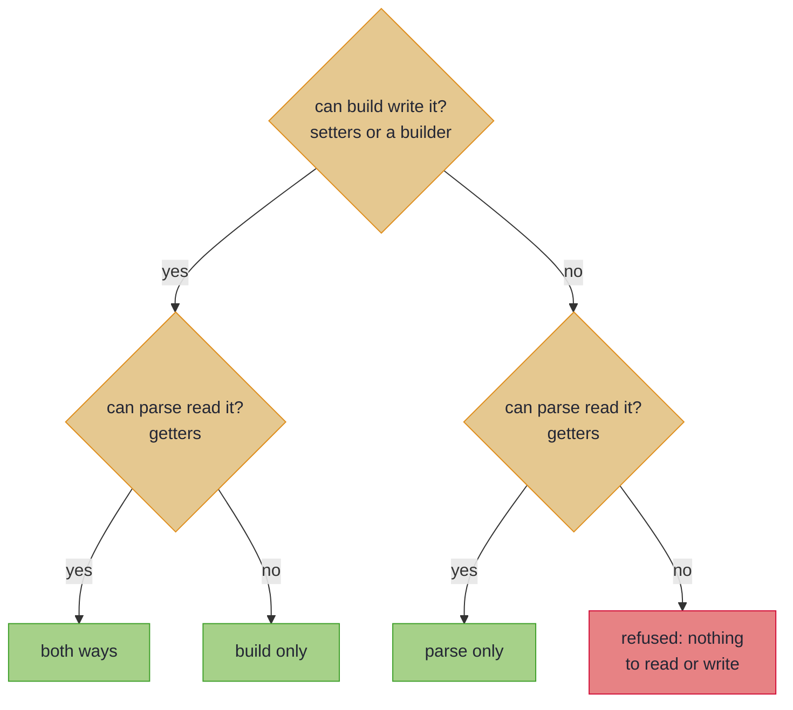

# Bean-Shaped Wires

_Map getter/setter and builder classes with the same features as records, including ones only read or written._

Generated client models, JAXB payloads and many legacy DTOs are beans: classes with getters and setters, or a builder, rather than records. If your wire is a bean, almost nothing changes: leaves, renames, nesting and located errors work exactly as on a [record](basics.md). Three things differ, and all three come from one fact: a bean can exist with some properties never set. This page walks those three first. Projections, beans crossed one way, accessors kept out on purpose and a checklist for generated clients follow, for when you need them. A bean used as a PATCH request, where `null` means *not sent*, has a page of its own, [Sparse PATCH](beans_patch.md).

~~~admonish info title="What You'll Learn"
- Map a getter/setter or builder bean like a record, and predict what an unset property does
- Predict which methods a bean's Impl carries, from the bean's shape
~~~

~~~admonish example title="See Example Code"
**The code on this page is [BeansBook.java](https://github.com/higher-kinded-j/higher-kinded-j/blob/main/hkj-examples/src/main/java/org/higherkindedj/example/book/mapping/BeansBook.java) and its [BeansBookTest.java](https://github.com/higher-kinded-j/higher-kinded-j/blob/main/hkj-examples/src/test/java/org/higherkindedj/example/book/mapping/BeansBookTest.java)** - the page includes them directly, so they are compiled and run by the build.
~~~

## Bean-shaped wire targets {#bean-shaped-wire-targets}

The spec is the same interface as for a record. Only how the wire is read and written changes: `build` fills the bean through its setters or a builder, and `parse` reads it through its getters:

``` java
{{#include ../../../hkj-examples/src/main/java/org/higherkindedj/example/book/mapping/BeansBook.java:bean_spec}}

{{#include ../../../hkj-examples/src/main/java/org/higherkindedj/example/book/mapping/BeansBook.java:bean_usage}}
```

An unset property is an ordinary state of a bean, and `parse` treats it as any other `null`: a located `must not be null`, under the [null rule](basics.md#null-doctrine). The processor recognises these shapes:

| The bean offers | `build` writes it with | It maps |
|---|---|---|
| a public no-args constructor and `setX` setters | `new`, then each setter | both ways |
| a static `builder()` or `newBuilder()` (Lombok `@Builder`, Immutables, protobuf) | the builder's setters, then `build()` | both ways, reading the built type's getters |
| a getter-only `List` beside its setters, the JAXB way | `getItems().addAll(...)` for that list | both ways |
| getters, and nothing that writes it (a read model) | nothing | [`parse` only](#one-directional-beans) |
| setters or a builder, and no getters (a write model) | the setters or the builder | [`build` only](#one-directional-beans) |

A Lombok `@Data` class is the first shape once Lombok has run, so list Lombok before `hkj-processor` ([Lombok](../tooling/manual_setup.md#lombok)). A property is a getter and a writer that share a name. The processor refuses an unpaired accessor named after a domain component, as the likely misspelling ([When an unpaired accessor is refused](rules.md#unpaired-accessors)). [How a bean is read and written](rules.md#how-a-bean-is-read-and-written) has the rest.

Because a property can be unset, three things differ from a record wire:

1. **No `asIso()`.** A bean's reads can meet an unset property, so the Impl withholds the lossless tier. An all-primitive bean, whose reads can never be `null`, keeps it. [What Your Spec Generates](tiers.md) has the tiers.
2. **An `Optional` bridges with no annotation.** A domain `Optional<T>` maps to a nullable property `T`: `build` writes `null` for empty, and `parse` reads a `null` as empty. A record wire needs [`@OptionalBridge`](absence.md#optional-bridge) for this. The setter must take the `null`, so in a `@NullMarked` module mark it `@Nullable`, or the processor refuses it ([The automatic `Optional` bridge on a bean](rules.md#bean-optional-bridge)).
3. **A smaller bean takes the validated `patch`**, not a lens: [Bean projections](#bean-projections).

~~~admonish warning title="Not checked for you: a bean's default can undo absence"
`build` writes `null` for an empty `Optional`, replacing any field initialiser. A default the bean applies to a `null` it is *given*, in its setter or its builder's `build()`, reads back as present. No compiler sees it: a setter that stores `""` for `null` turns every empty value into `Optional[""]`. A law check catches it only from a domain sample with an empty `Optional`: `MappingLaws.assertMappingLaws(mapping.asValidatedPrism(), sample)`.
~~~

~~~admonish tip title="You can ship now"
You can now map a getter/setter or builder bean like a record, and know what an unset property does to `parse`, to an `Optional` and to the tiers. The rest of this page, [projections](#bean-projections), [beans crossed one way](#one-directional-beans), [accessors kept out on purpose](#accessors-meant-to-stay-out) and [a checklist for generated clients](#generated-client-checklist), is for when you need them.
~~~

~~~admonish question title="Checkpoint: what comes back?" id="check-beans-default"
A generated `ListingBean` answers `""` from its getter when its subtitle is unset. `Listing.subtitle` is an `Optional<String>`, so it bridges with no annotation:

``` java
{{#include ../../../hkj-examples/src/main/java/org/higherkindedj/example/book/mapping/BeansBook.java:default_trap}}
```

Code builds a bean from `new Listing("Lamp", Optional.empty())`, then parses that bean. What does `parse` return?

1. `Valid(Listing[title=Lamp, subtitle=Optional.empty])`, since `build` wrote `null`
2. `Valid(Listing[title=Lamp, subtitle=Optional[]])`
3. `Invalid(NonEmptyList[subtitle: must not be null])`
4. Nothing: the processor refuses a getter that never returns `null`
~~~

~~~admonish success title="Answer and why" collapsible=true id="check-beans-default-answer"
**2.** `build` wrote `null`, but `parse` reads through the getter, and the getter answers `""`. A default applied to a `null` the bean is given reads back as present, so the empty subtitle comes back as `Optional[""]`. A domain sample with an empty `Optional` makes the law check fail on it:

``` java
{{#include ../../../hkj-examples/src/test/java/org/higherkindedj/example/book/mapping/BeansBookTest.java:default_trap_proof}}
```

Where this lives: [Bean-shaped wire targets](#bean-shaped-wire-targets).
~~~

~~~admonish question title="Checkpoint: which methods does the Impl carry?" id="check-beans-direction"
A vendor SDK builds this `InvoiceView` through its public constructor, and hands it to your code:

<!-- verify:reports "maps parse-only" -->
```java
import org.higherkindedj.optics.annotations.GenerateMapping;
import org.higherkindedj.optics.annotations.MappingSpec;

record Invoice(String number, String currency) {}

final class InvoiceView {
  private final String number;
  private final String currency;

  public InvoiceView(String number, String currency) {
    this.number = number;
    this.currency = currency;
  }

  public String getNumber() { return number; }

  public String getCurrency() { return currency; }
}

@GenerateMapping
interface InvoiceViewMapping extends MappingSpec<Invoice, InvoiceView> {}
```

What does `InvoiceViewMappingImpl` carry?

1. `build` and `parse`: `build` can call the public constructor
2. `parse` only
3. `build` only
4. Nothing: the processor refuses the spec
~~~

~~~admonish success title="Answer and why" collapsible=true id="check-beans-direction-answer"
**2.** `build` writes a bean through setters or a builder, never through a constructor with arguments, and `InvoiceView` has neither. It has getters, so it is a read model, and the processor says so in a note:

```
@GenerateMapping: 'InvoiceView' maps parse-only: the generated Impl carries parse and
asValidatedParse(), and no build. 'InvoiceView' has getters but no setX setters and no builder that
fills it, so nothing can write it. If 'InvoiceView' should be built too, give it a no-args
constructor with setX setters matching its getters, or a builder.
```

Where this lives: [Bean-shaped wire targets](#bean-shaped-wire-targets).
~~~

---

## Bean projections {#bean-projections}

A bean with fewer properties than the domain is a projection, as a smaller record wire is. A record projection that copies by identity keeps its lawful `asLens()`, since the record is constructed whole. A bean is constructed empty and filled by setters, so a reference property can be unset, and a lens's `set` has no way to refuse one. A bean projection with any reference property therefore takes the [validated `patch`](tiers.md#leaf-carrying-projections-the-validated-patch), even when every property copies by identity:

``` java
{{#include ../../../hkj-examples/src/main/java/org/higherkindedj/example/book/mapping/BeansBook.java:bean_projection_spec}}

{{#include ../../../hkj-examples/src/main/java/org/higherkindedj/example/book/mapping/BeansBook.java:bean_projection_usage}}
```

Every projected property is validated and every bad one located, and the unprojected components are read from the domain argument, so they survive. The automatic bridge applies too: an unset bridged property reads as empty, so `patch` writes `Optional.empty()` rather than keeping the current value. The `MappingLaws` patch overload law-checks it, comparing domain values only, so the bean needs no `equals`. An all-primitive bean projection keeps its `asLens()`.

This is not the REST PATCH contract: an unset property never means *keep the current value*. For that, extend `UpdateSpec` ([Sparse PATCH](beans_patch.md#sparse-patch-write-back-updatespec)). And `patch` only reads the bean, but the Impl also carries `build`, so a projection bean still needs a way to be written. A getter-only bean narrower than the domain maps [parse-only](#one-directional-beans) instead, and every domain component then needs a getter.

---

## One-directional beans {#one-directional-beans}

Some beans are only ever crossed one way. A generated client's response type, an immutable view built through its constructor, or a third-party result offers getters and nothing that writes it. An outbound request, or a write model behind a builder, is filled and never read back. Neither supports both directions, so the Impl carries the one it can, and nothing for the other: the missing direction is absent, never a method that throws.



In words: the bean's shape decides. Both directions when it can be written and read, one when it can only be one of them, and a refusal when it can be neither.

| The bean offers | It maps | The Impl carries |
|---|---|---|
| properties it can both read and write | both ways | `build`, `parse`, `asValidatedPrism()` and the rest of its tier |
| getters, and no setters or builder that fill it | parse-only, unless every getter is a getter-only `List` | `parse` and `asValidatedParse()` |
| setters or a builder, and no getters | build-only | `build` and `asValidatedBuild()` |

``` java
{{#include ../../../hkj-examples/src/main/java/org/higherkindedj/example/book/mapping/BeansBook.java:one_way_spec}}

{{#include ../../../hkj-examples/src/main/java/org/higherkindedj/example/book/mapping/BeansBook.java:one_way_usage}}
```

A note says which way a bean was read and why, so an unintended reading does not go unnoticed. The two-way reading wins whenever any property allows it, so a bean is one-directional only when nothing at all crosses the other way. The rest of the vocabulary works in whichever direction exists: a leaf parses on a parse-only bean and builds on a build-only one. A one-directional mapping nests wherever only its direction is used. [How a bean's direction is read](rules.md#how-a-beans-direction-is-read) covers coverage, nesting and the mixed cases. Law-check the surface the Impl has, `asValidatedParse()` with a parsing and a non-parsing wire, or `asValidatedBuild()` with a domain value:

``` java
{{#include ../../../hkj-examples/src/test/java/org/higherkindedj/example/book/mapping/BeansBookTest.java:one_way_laws}}
```

---

## Accessors meant to stay out {#accessors-meant-to-stay-out}

Some beans leave an accessor unpaired on purpose. A response DTO reused as the PATCH body carries a server-assigned `getId()` the client must not change. A view computes `getStatus()` on the wire, and a generated request has a setter the domain does not model. Pairing such an accessor is the wrong fix, and the bean is often not yours to edit, so the spec says the omission is deliberate, with an abstract `@Unmapped` marker named after the *accessor's* property:

``` java
{{#include ../../../hkj-examples/src/main/java/org/higherkindedj/example/book/mapping/BeansBook.java:unmapped_spec}}

{{#include ../../../hkj-examples/src/main/java/org/higherkindedj/example/book/mapping/BeansBook.java:unmapped_usage}}
```

The marker withholds the refusal, and nothing else. The processor refuses a marker that names a property the mapping carries, or nothing at all, as the misspelling it usually is. [What `@Unmapped` withholds](rules.md#what-unmapped-withholds) has the precise rule.

---

## At the generated-client boundary {#generated-client-checklist}

Beans are often generated from a schema, and generators have habits. Check these where a bean meets the mapper:

- **Lombok runs first.** List Lombok before `hkj-processor` on the processor path, and a `@Data` class is an ordinary setter bean ([Lombok](../tooling/manual_setup.md#lombok)).
- **A bean another processor generates maps too.** The mapping waits for the type to exist, with nothing to configure ([Mapping over types other processors generate](../tooling/manual_setup.md#mapping-over-types-other-processors-generate)).
- **A setter or builder that defaults a `null` undoes absence.** Law-check it from a domain sample with an empty `Optional`, as the [lane's warning](#bean-shaped-wire-targets) says.
- **A builder that refuses `null`** (protobuf, Immutables) cannot take an empty `Optional`. Declare the component without the `Optional`, or give it a leaf that encodes absence the builder's way ([The automatic `Optional` bridge on a bean](rules.md#bean-optional-bridge)).
- **A PATCH request bean needs its own schema.** Leave out `default:` values and container defaults, which a generator renders as initialisers that read as sent ([A PATCH getter must answer `null` until set](beans_patch.md#patch-getters-answer-null)).
- **A `JsonNullable` property is not supported yet.** Declare a plain nullable property, or on a PATCH bean an `Optional`-typed one ([No `JsonNullable` property](rules.md#no-jsonnullable-patch-property)).

---

~~~admonish info title="Key Takeaways"
* **A bean maps like a record**: leaves, renames, nesting and located errors are unchanged, and only how the wire is read and written differs
* **Three things follow from an unset property**: no `asIso()`, an `Optional` that bridges with no annotation, and a validated `patch` for a smaller bean
* **A bean crossed one way maps that way**: a read model gets `parse` alone, and a write model `build` alone
~~~

~~~admonish tip title="See Also"
- [Sparse PATCH](beans_patch.md): A bean as a PATCH request, where `null` means *leave unchanged*
- [Bean wires](rules.md#bean-wires): The precise rules, from how a bean is written to a getter-only `List`
- [What Your Spec Generates](tiers.md): Which methods each spec shape gets, and why a bean mapping withholds `asIso()`
~~~

---

**Previous:** [What Your Spec Generates](tiers.md)
**Next:** [Sparse PATCH](beans_patch.md)
