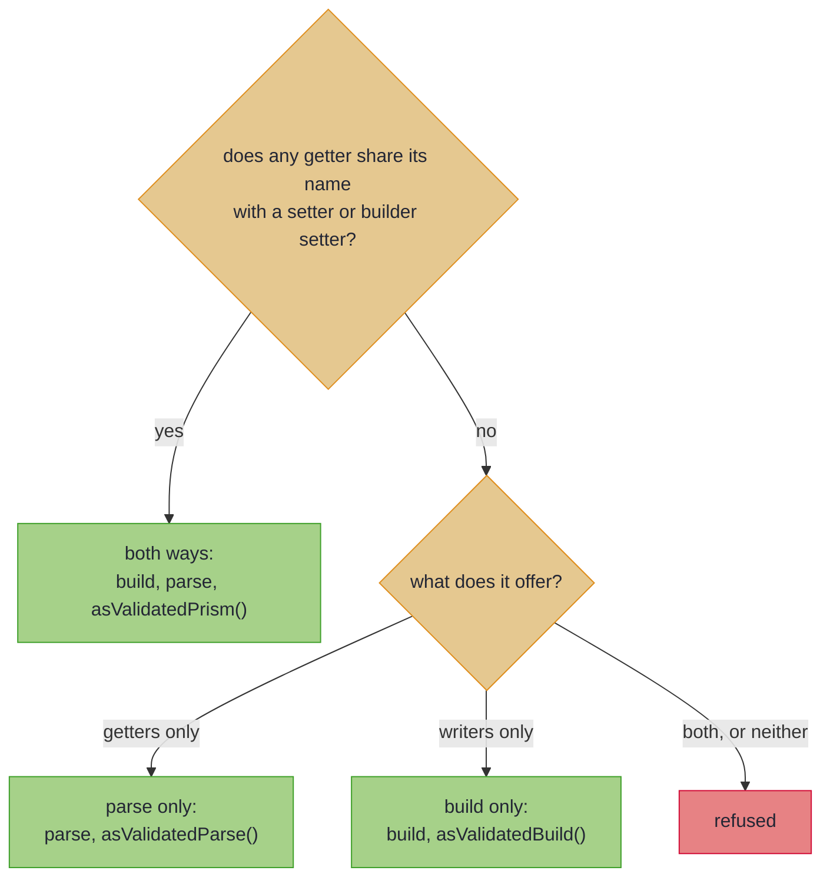

# Bean-Shaped Wires

_Map getter/setter and builder classes as you map records, including ones only read or written._

Generated client models, JAXB payloads and many legacy DTOs are beans: classes with getters and setters, or a builder, rather than records. If your wire is a bean, almost nothing changes: [leaves](basics.md#validated-leaves), [renames](basics.md#renames-mapfield), container lifting, nesting and located errors work exactly as on a record. Three things differ, and all three come from one fact: a bean can exist with some properties never set. This page walks those three first. Mapping a generated client? Read [the checklist for generated clients](#generated-client-checklist) as well. A bean used as a PATCH request, where `null` means *not sent*, has a page of its own, [Sparse PATCH](beans_patch.md).

~~~admonish info title="What You'll Learn"
- Map a getter/setter or builder bean like a record, and predict what an unset property does
- Predict which methods a bean's Impl carries, from the bean's shape
~~~

~~~admonish example title="See Example Code"
**The code on this page is [BeansBook.java](https://github.com/higher-kinded-j/higher-kinded-j/blob/main/hkj-examples/src/main/java/org/higherkindedj/example/book/mapping/BeansBook.java) and its [BeansBookTest.java](https://github.com/higher-kinded-j/higher-kinded-j/blob/main/hkj-examples/src/test/java/org/higherkindedj/example/book/mapping/BeansBookTest.java)** - the page includes them directly, so they are compiled and run by the build.
~~~

## Bean-shaped wire targets {#bean-shaped-wire-targets}

The spec is the same interface as for a record. Only how the wire is read and written changes. `build` fills the bean through its setters or a builder, never a constructor that takes arguments, and `parse` reads it through its getters:

``` java
{{#include ../../../hkj-examples/src/main/java/org/higherkindedj/example/book/mapping/BeansBook.java:bean_spec}}

{{#include ../../../hkj-examples/src/main/java/org/higherkindedj/example/book/mapping/BeansBook.java:bean_usage}}
```

An unset property is an ordinary state of a bean, and `parse` reports it as any other `null`: a located `must not be null`, under the [null rule](basics.md#null-doctrine). The processor recognises these shapes:

| The bean offers | `build` writes it with | It maps |
|---|---|---|
| a no-args constructor the Impl can call, and `setX` setters (Lombok `@Data` included) | `new`, then each setter | both ways |
| a static `builder()` or `newBuilder()` whose `build()` returns it (a hand-written builder, or Lombok `@Value @Builder`) | the builder's setters, then `build()` | both ways, reading the built type's getters |
| a getter-only `List` beside its setters, the JAXB way | `getItems().addAll(...)` for that list | both ways |
| getters, and nothing that writes it, such as a view built through a constructor with arguments | nothing | [`parse` only](#one-directional-beans) |
| setters or a builder, and no getters | the setters or the builder | [`build` only](#one-directional-beans) |

As on a record, every property the bean both reads and writes needs a domain component or a [derived field](basics.md#derived-wire-fields). The processor refuses a property your domain lacks, with [`has more components than`](compiler_errors.md#wire-has-more-components). [How a bean is read and written](rules.md#how-a-bean-is-read-and-written) says how the processor pairs getters with writers.

Because a property can be unset, three things differ from a record wire:

1. **The Impl withholds `asIso()`.** A record pair whose components all copy unchanged also gets [`asIso()`](tiers.md), a two-way conversion that cannot fail. A bean's reads can meet an unset property, so a bean pair keeps `build`, `parse` and `asValidatedPrism()`, and not that.
2. **An `Optional` bridges with no annotation.** A domain `Optional<T>` maps to a nullable property `T`, where a record wire needs [`@OptionalBridge`](absence.md#optional-bridge). `build` writes `null` for empty, and `parse` reads a `null` as empty: [The automatic `Optional` bridge on a bean](rules.md#bean-optional-bridge).
3. **A bean with fewer properties than your domain has no `parse`.** With a reference property, the Impl offers a validated `patch` instead, which copies the bean onto a domain value you already hold: [Bean projections](#bean-projections).

~~~admonish warning title="Not checked for you: what the bean does with the null an empty Optional writes"
`build` writes `null` for an empty `Optional`, replacing any field initialiser. No compiler sees what the bean then does with it:

- **A default applied to it reads back as present**, whether a setter, a builder's `build()` or a getter applies it. A setter that swaps in `"Untitled"` turns every empty value into `Optional[Untitled]`.
- **A writer that rejects it throws from `build`**, as a setter that copies with `List.copyOf(v)` does, or a builder that calls `requireNonNull`. Guard the copy with `v == null ? null : List.copyOf(v)`, or declare the component without the `Optional`.

A law check from a domain sample with an empty `Optional` fails on both, whatever the bean's `equals`: `MappingLaws.assertMappingLaws(mapping.asValidatedPrism(), sample)`. The check from two wire samples compares beans with `equals`, so a hand-written bean without one fails it on identity alone.
~~~

~~~admonish tip title="You can ship now"
You can now map a getter/setter or builder bean like a record, and know what an unset property does to `parse`, to an `Optional` and to the methods the Impl offers. The rest of this page, [beans crossed one way](#one-directional-beans), [projections](#bean-projections), [accessors kept out on purpose](#accessors-meant-to-stay-out) and [the checklist for generated clients](#generated-client-checklist), is for when you need it.
~~~

~~~admonish question title="Checkpoint: which subtitle comes back?" id="check-beans-default"
Two generated beans for `Listing` both start the subtitle as `""`, in different places:

``` java
{{#include ../../../hkj-examples/src/main/java/org/higherkindedj/example/book/mapping/BeansBook.java:default_trap}}
```

Your code builds each bean from `new Listing("Lamp", Optional.empty())`, then parses it. What subtitle comes back from each?

1. `Optional.empty` from both, since `build` wrote `null` into both
2. `Optional[]`, that is `Optional.of("")`, from both, since both start with `""`
3. `Optional.empty` from `DraftListingBean`, and `Optional[]` from `ListingBean`
4. `Optional[]` from `DraftListingBean`, and `Optional.empty` from `ListingBean`
~~~

~~~admonish success title="Answer and why" collapsible=true id="check-beans-default-answer"
**3.** `build` writes `setSubtitle(null)` into both beans. That replaces `DraftListingBean`'s field initialiser, so its subtitle reads back empty. `parse` reads through the getter, and `ListingBean`'s getter answers `""` for that `null`, so its subtitle comes back as `Optional[]`. A law check from a domain sample with an empty `Optional` fails on the second:

``` java
{{#include ../../../hkj-examples/src/test/java/org/higherkindedj/example/book/mapping/BeansBookTest.java:default_trap_proof}}
```

Where this lives: [Bean-shaped wire targets](#bean-shaped-wire-targets).
~~~

~~~admonish question title="Checkpoint: which methods does the Impl carry?" id="check-beans-direction"
A vendor SDK builds this `InvoiceView` through its public constructor:

<!-- verify:reports "maps parse-only" -->
```java
import org.higherkindedj.optics.annotations.GenerateMapping;
import org.higherkindedj.optics.annotations.MappingSpec;

record Invoice(String number, String currency) {}

final class InvoiceView {
  private final String number;
  private final String currency;

  public InvoiceView(String number, String currency) {
    this.number = number;
    this.currency = currency;
  }

  public String getNumber() { return number; }

  public String getCurrency() { return currency; }
}

@GenerateMapping
interface InvoiceViewMapping extends MappingSpec<Invoice, InvoiceView> {}
```

What does `InvoiceViewMappingImpl` carry?

1. `build` and `parse`: `build` can call the public constructor
2. `parse` only
3. `build` only
4. Nothing: the processor refuses the spec
~~~

~~~admonish success title="Answer and why" collapsible=true id="check-beans-direction-answer"
**2.** `build` writes a bean through setters or a builder, never a constructor that takes arguments, and `InvoiceView` has neither. It has getters, so it maps parse-only, and the processor says so in a compiler note:

```
@GenerateMapping: 'InvoiceView' maps parse-only: the generated Impl carries parse and
asValidatedParse(), and no build. 'InvoiceView' has getters but no setX setters and no builder that
fills it, so nothing can write it. If 'InvoiceView' should be built too, give it a no-args
constructor with setX setters matching its getters, or a builder.
```

Where this lives: [Bean-shaped wire targets](#bean-shaped-wire-targets).
~~~

---

## One-directional beans {#one-directional-beans}

Some beans offer only one direction. An immutable view built through its constructor, or a third-party result, has getters and nothing that writes it. An outbound request has setters or a builder, and no getters. What decides is the bean's shape, not how you use it: a generated client's model usually has getters and setters, so it maps both ways even when you only ever read it. The Impl carries the direction the bean allows, and nothing for the other: the missing direction is absent, never a method that throws.



In words: one name that is both read and written makes a bean two-way. A bean maps one way only when it offers nothing at all in the other direction. A getter-only `List` counts as written, the JAXB way, on a bean that also has a setter, or whose every getter is such a list.

``` java
{{#include ../../../hkj-examples/src/main/java/org/higherkindedj/example/book/mapping/BeansBook.java:one_way_spec}}

{{#include ../../../hkj-examples/src/main/java/org/higherkindedj/example/book/mapping/BeansBook.java:one_way_usage}}
```

A compiler note says which way a one-directional bean was read, and why. Renames, leaves, container lifting and the automatic `Optional` bridge work in whichever direction exists. [How a bean's direction is read](rules.md#how-a-beans-direction-is-read) covers coverage, nesting and the mixed cases. Law-check the surface the Impl has, `asValidatedParse()` with a parsing and a non-parsing wire, or `asValidatedBuild()` with a domain value:

``` java
{{#include ../../../hkj-examples/src/test/java/org/higherkindedj/example/book/mapping/BeansBookTest.java:one_way_laws}}
```

---

## Bean projections {#bean-projections}

A bean with fewer properties than the domain has no `parse`, since it cannot produce a whole domain value. With a reference property, the Impl offers a validated `patch(current, bean)` instead, which copies the bean's properties onto a domain value you already hold, checking each one. A record projection that copies by identity gets a [lens](tiers.md) instead, since a record is constructed whole. A bean is constructed empty and filled by setters, so a property can be unset, and a lens has no way to refuse one. Here `Employee` is `record Employee(String name, String department, int age)`, from [What Your Spec Generates](tiers.md):

``` java
{{#include ../../../hkj-examples/src/main/java/org/higherkindedj/example/book/mapping/BeansBook.java:bean_projection_spec}}

{{#include ../../../hkj-examples/src/main/java/org/higherkindedj/example/book/mapping/BeansBook.java:bean_projection_usage}}
```

Every projected property is validated, and the unprojected components are read from the domain argument, so they survive. Leaves, nested specs, container lifting and the automatic bridge all apply: an unset bridged property reads as empty, so `patch` writes `Optional.empty()` rather than keeping the current value. The `MappingLaws` patch overload law-checks it, comparing domain values only, so the bean needs no `equals`. An all-primitive bean projection keeps its lens.

This is not the REST PATCH contract, even when the bean is a PATCH request: an unset property never means *keep the current value*. For that, extend `UpdateSpec` ([Sparse PATCH](beans_patch.md#sparse-patch-write-back-updatespec)). And `patch` only reads the bean, but the Impl also carries `build`, so a projection bean needs a way to be written. A getter-only bean is no projection: it maps parse-only, which needs a getter for every domain component, so a getter-only bean narrower than the domain is refused.

---

## Accessors meant to stay out {#accessors-meant-to-stay-out}

Some beans leave an accessor unpaired on purpose: a getter with no setter, or a setter with no getter. You need to say so only when the processor refuses the accessor, which it does when the accessor is named after a domain component, as the likely misspelling. A response DTO reused as a PATCH body, from [Sparse PATCH](beans_patch.md), carries a server-assigned `getId()` the client must not change. Declare the omission deliberate with an abstract `@Unmapped` marker named after the *accessor's* property. It is MapStruct's `ignore = true`, except that it names the wire's accessor, and only withholds the refusal:

``` java
{{#include ../../../hkj-examples/src/main/java/org/higherkindedj/example/book/mapping/BeansBook.java:unmapped_spec}}

{{#include ../../../hkj-examples/src/main/java/org/higherkindedj/example/book/mapping/BeansBook.java:unmapped_usage}}
```

The marker withholds the refusal, and nothing else: the component stays out of the mapping. On a `MappingSpec` that leaves the bean narrower than the domain, so the Impl becomes a [projection](#bean-projections), with `build` and `patch` and no `parse`. [What `@Unmapped` withholds](rules.md#what-unmapped-withholds) has the precise rule.

---

## Generated clients: a checklist {#generated-client-checklist}

Beans are often generated from a schema, and generators have habits. Check these where a generated bean meets the mapper:

| The generated shape | What happens | Instead |
|---|---|---|
| an openapi-generator model, with getters, setters and a no-args constructor | it maps both ways, even as a response you only read, so the processor refuses a property your domain lacks | declare a [derived field](basics.md#derived-wire-fields) for it, which `build` fills and `parse` ignores |
| a `readOnly` property, with a getter and no setter | reading it on a two-way bean is not supported yet: `@Unmapped` lets the bean map, but the component stays out, so there is no `parse` | leave that component out of the domain you parse into |
| strictly typed properties: enums, `OffsetDateTime`, `UUID` | Jackson has already converted them before `parse` runs | map each to your own type with a leaf over the generated type |
| openapi-generator's default `openApiNullable=true` | a `getX_JsonNullable()` and `setX_JsonNullable(...)` pair beside each nullable property counts as a property your domain lacks | generate with `openApiNullable=false`; a `JsonNullable` type needs a leaf, and on a PATCH bean is [not supported yet](rules.md#no-jsonnullable-patch-property) |
| a PATCH request bean with `default:` values or container defaults | the generator renders them as initialisers, which read as sent | give the PATCH request its own schema: [A PATCH getter must answer `null` until set](beans_patch.md#patch-getters-answer-null) |
| a Lombok class | the processor sees its accessors only once Lombok has run | list Lombok's `annotationProcessor` before `hkj-processor`; the HKJ Gradle plugin adds its own after your `dependencies` block ([Lombok](../tooling/manual_setup.md#lombok)) |
| Lombok's `@Singular` on a collection | not supported yet: its setter takes a `Collection<? extends T>`, not the getter's `List<T>` | drop `@Singular`, so the setter takes the `List` |
| a protobuf-java message | not supported yet: `getUnknownFields()`, and a `getXBytes()` beside each string field, pair up as properties your domain lacks | convert it to a record by hand, and map the record |
| a bean another annotation processor generates | the mapping waits for the type to exist, with nothing to configure | nothing: [Mapping over types other processors generate](../tooling/manual_setup.md#mapping-over-types-other-processors-generate) |

---

~~~admonish info title="Key Takeaways"
* **A bean maps like a record**: leaves, renames, nesting and located errors are unchanged, and every property it reads and writes needs a source
* **Three things follow from an unset property**: the Impl withholds `asIso()`, an `Optional` bridges with no annotation, and a smaller bean has `patch` instead of `parse`
* **What the bean does with a `null` is not checked for you**: a default reads back as present, and a writer that rejects it throws, so law-check from a domain sample with an empty `Optional`
* **A bean's shape decides its direction**: a read model gets `parse` alone, a write model `build` alone, and a generated model with getters and setters maps both ways
~~~

~~~admonish tip title="See Also"
- [Sparse PATCH](beans_patch.md): A bean as a PATCH request, where `null` means *leave unchanged*
- [Bean wires](rules.md#bean-wires): The precise rules, from how a bean is written to a getter-only `List`
- [What Your Spec Generates](tiers.md): Which methods each spec shape gets, and why a bean mapping withholds `asIso()`
~~~

---

**Previous:** [What Your Spec Generates](tiers.md)
**Next:** [Sparse PATCH](beans_patch.md)
