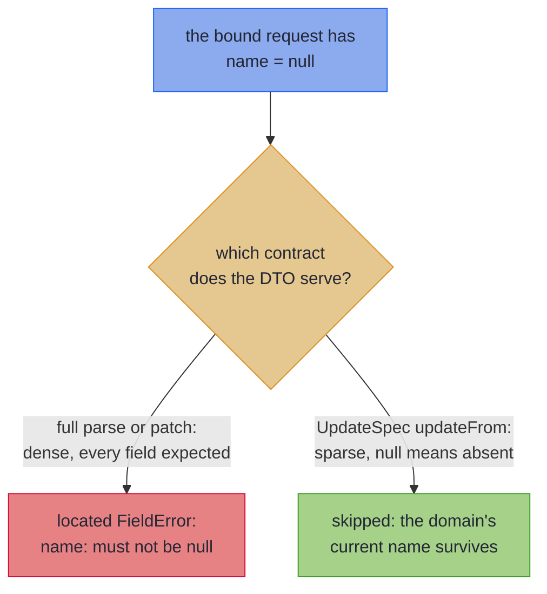

# Beans and Sparse PATCH

_The same mapper for getter/setter wires, and the opt-in tier where `null` means "leave unchanged" instead of "broken"._

Not every wire type is a record. Generated clients, JAXB payloads and legacy DTOs are beans, and one very common bean, the REST PATCH request, changes what `null` *means*: not broken data but *not provided*. This page covers both: mapping bean-shaped wires with the full feature set, and the explicit `UpdateSpec` opt-in that gives a PATCH bean its sparse semantics.

~~~admonish info title="What You'll Learn"
- Mapping bean-shaped wire types (setters, builders, JAXB lists) with the same features as records
- Why a bean mapping withholds `asIso()`, and how `Optional` bridges through `null` here without a declaration
- Why a bean projection with a reference property takes the validated `patch` rather than `asLens()`
- Mapping a bean that can only be read, or only be written: `parse` alone or `build` alone, and where each nests
- What PATCH and *sparse* PATCH actually mean, and why `null` is ambiguous in a PATCH body
- Opting into sparse semantics with `UpdateSpec`: present fields fold in, absent fields leave the domain alone
- The rules that keep the null-as-absent contract honest, and how containers patch through the element vocabulary
~~~

~~~admonish example title="See Example Code"
**The code on this page is [RecordMappingBook.java](https://github.com/higher-kinded-j/higher-kinded-j/blob/main/hkj-examples/src/main/java/org/higherkindedj/example/book/mapping/RecordMappingBook.java)** - the page includes it directly, so it is compiled and run by the build.
~~~

## Bean-shaped wire targets

The wire side need not be a record. A **bean** (a mutable class with a no-args constructor and getters/setters, or an immutable one with a builder) maps the same way, with the same features (renames, leaves, derived fields, container lifting, nesting). Only *how* the wire is read and written changes: `build` fills through setters or a builder, and `parse` reads through getters.

``` java
{{#include ../../../hkj-examples/src/main/java/org/higherkindedj/example/book/mapping/RecordMappingBook.java:bean_spec}}
```

``` java
{{#include ../../../hkj-examples/src/main/java/org/higherkindedj/example/book/mapping/RecordMappingBook.java:bean_usage}}
```

The design decisions worth knowing:

- **Null is located, never thrown, like every wire.** The null guard is universal ([one rule](basics.md#null-doctrine), both shapes), so a `null` property read is a located `FieldError` exactly as on a record wire. What is bean-*specific* is why nulls are expected at all: an unset property is a representable, ordinary state of a mutable bean, not just a hostile binding.
- **Honest tiers.** Because an unset property is ordinary, a bean's guarded reference reads count as fallible and the mapping withholds `asIso()` automatically; an all-primitive bean (whose reads can never be null) still earns it. A record wire's guards exist for hostile bindings only, so a lossless record mapping keeps `asIso()`, with the parse-iso coherence law scoped to wires whose reference components are non-null. Nesting is unaffected: a bean mapping that builds and parses exposes `asValidatedPrism()` like any other, so record specs nest it and containers lift it, and a [one-directional](#one-directional-beans) one exposes the half it has, nesting wherever only that direction is used.
- **Construction strategy** is detected from the bean's shape, tried in order: a public no-args constructor with `setX` setters (and, for a getter-only `List`, the JAXB convention `getItems().addAll(...)`); then a static `builder()`/`newBuilder()` whose setters fill it and whose `build()` yields the wire. A bean with getters that fits neither is only ever read, so it maps [parse-only](#one-directional-beans); a bean with nothing to read or write gets a what/why/fix diagnostic.
- **A property is a getter and a writer that share a name.** Getters are `getX()`, and `isX()` returning `boolean` or `Boolean` (the shape JAXB declares for an optional boolean); where a bean declares both for one name, `getX()` reads it. A getter nothing writes, or a writer nothing reads, is left out of the mapping, which suits a computed getter such as `getSummary()` or a builder's singular adder. When an unpaired accessor is named after a domain component the bean carries under no name, the one the component maps under (its own, or the one a `@MapField` rename gives it), leaving it out would drop that component without a word, so it is refused. The diagnostic names the accessor that would pair it. When a nearby accessor of the other kind has the same type, it is offered as the likely misspelling, so `setEmail(String)` beside `getEmial()` is told to rename the getter to `getEmail()`; otherwise it offers the [`@Unmapped` marker](#accessors-meant-to-stay-out) below, for an accessor that is meant to stay out.
- **A getter-only `List` must name its element type**, because `addAll` is what fills it: over a raw `List` that call is unchecked, and over a wildcard one the receiver and the argument capture separately, so neither writes into an Impl that compiles. The diagnostic names the remedy its cause calls for — declare the type arguments, or replace the wildcard with the element type it stands for — and both causes are also answered by a setter, which takes the property as declared. This is a `build` rule only: the [sparse tier](#sparse-patch-write-back-updatespec) reads such a property and never writes it, so the same bean maps there untouched.
- **Optionality bridges through `null`, automatically here.** On a full mapping, a domain `Optional<T>` maps to a nullable bean property `T` (bean conventions leave `Optional` off property types): empty bridges to absent (`build` writes `null`, replacing whatever the bean or its builder started with; `parse` reads `Optional.ofNullable(...)`), and a present value still validates through its leaf, or [nests through its own spec](structure.md#optional-nested-objects). This is the *only* wire shape where the bridge needs no declaration: a record wire opts in per component with [`@OptionalBridge`](basics.md#optional-bridge), which buys the same correspondence, and declaring it on a bean spec is redundant (a note, not an error, so one mix-in can serve both shapes). One property shape refuses the bridge: a getter-only `List` filled by the JAXB convention above has no unset state to carry absence, because its getter creates the list on first call, so an empty `Optional` would read back as a present empty list; the diagnostic asks for a `List<T>` domain component, where the empty list *is* nothing, or for a property that can hold the `null`, which takes both a setter to write it *and* a getter that returns what the setter stored, since a lazily creating getter loses absence on the read even when a setter exists. The [sparse tier](#sparse-patch-write-back-updatespec) is the deliberate exception in the other direction: there `null` already means "leave unchanged", so a PATCH bean encodes "set to empty" with an `Optional`-typed property instead.
- **A bridged property's writer must take `null`.** `build` never skips a write, so a bean's own defaults (a field initialiser, a builder's default) cannot survive it and read back as present. The price is that an empty `Optional` reaches the setter or builder setter as `null`. A setter that copies defensively needs a guard (`v == null ? null : List.copyOf(v)`). A parameter declared non-null, by a non-null annotation or by a `@NullMarked` scope with no `@Nullable` on it, is refused, as a bridged record component is: mark it `@Nullable` (on a Lombok bean, on the field, which Lombok copies to the setter). A generated builder that refuses `null` (protobuf, Immutables) cannot be changed, so declare the component without the `Optional`, or give it a leaf over the whole `Optional` that encodes absence the builder's way (`ValidatedPrism<String, Optional<String>>` mapping empty to `""`), which wins over the bridge. A default the bean applies to a `null` it is given, in the setter, a builder's `build()` or the getter, still reads back as present; `MappingLaws` catches it.
- **The domain stays a record.** `parse` assembles the domain through its canonical constructor, so only the *wire* may be bean-shaped; a bean domain gets a diagnostic.

### Bean projections

A bean with *fewer* properties than the domain is a projection, as a smaller record wire is, but the same shape can land on a different tier. A record is constructed whole, so a record projection that copies by identity keeps its lawful `asLens()`: a `null` component there is a hostile binding, not a state the type invites. A bean is constructed empty and filled by setters, which makes an unset reference property an ordinary state, and a lens's `set` cannot fail, so it has no honest answer for one. A bean projection with any reference property therefore takes the [validated `patch`](tiers.md#leaf-carrying-projections-the-validated-patch), even when every property copies by identity:

``` java
{{#include ../../../hkj-examples/src/main/java/org/higherkindedj/example/book/mapping/RecordMappingBook.java:bean_projection_spec}}

{{#include ../../../hkj-examples/src/main/java/org/higherkindedj/example/book/mapping/RecordMappingBook.java:bean_projection_usage}}
```

Everything else is the record-wire tier unchanged: every projected property is validated, every bad one is located and accumulated, and the unprojected components are read from the domain argument, so they survive by construction. Leaves, nested specs and container lifting all apply, and so does the automatic `Optional` bridge: a bridged property left unset reads as empty, so `patch` writes `Optional.empty()` rather than keeping the current value. The same `MappingLaws` patch overload law-checks it; the laws compare domain values only, so the bean needs no `equals`. An all-primitive bean projection, whose reads can never be null, keeps its lawful `asLens()`.

This is not the REST PATCH contract, even when the bean is a PATCH request: an unset property never means "keep the current value". For that, extend `UpdateSpec` ([below](#sparse-patch-write-back-updatespec)).

`patch` only reads the bean, through its getters, but the Impl also carries `build`, which writes one, so a bean projection still needs one of the construction strategies above. A getter-only bean narrower than the domain is not a projection at all: nothing writes it, so it maps [parse-only](#one-directional-beans), and every domain component then needs a getter.

### Accessors meant to stay out {#accessors-meant-to-stay-out}

Some beans leave an accessor unpaired on purpose. A response DTO reused as the PATCH body carries a server-assigned `getId()` the client must not change; a view computes `getStatus()` on the wire; a generated request has a setter the domain does not model. Pairing such an accessor is the wrong fix, and the bean is often not yours to edit, so the spec says the omission is deliberate with an abstract `@Unmapped` marker named after the *accessor's* property:

``` java
{{#include ../../../hkj-examples/src/main/java/org/higherkindedj/example/book/mapping/RecordMappingBook.java:unmapped_spec}}
```

``` java
{{#include ../../../hkj-examples/src/main/java/org/higherkindedj/example/book/mapping/RecordMappingBook.java:unmapped_usage}}
```

The marker only withholds the refusal: the accessor was never a property, so the component it names stays unmapped, a wire narrower than the domain is still a projection, and nothing else about the generated Impl changes. It reaches both tiers and both refusals above, an accessor named after a domain component and a `setX` setter a PATCH bean cannot read. The return type is not read, so it may restate the accessor's own type, and the marker is stubbed out by the Impl like a rename.

A marker the spec declares itself must name an accessor the bean leaves unpaired: one naming a property the mapping carries, or naming nothing at all, is refused as the misspelling it usually is. One inherited from a [mix-in](codecs.md#shared-vocabulary-mix-in-interfaces) binds where it can and is otherwise inert, like every other inherited vocabulary member, so one mix-in serves specs whose wires differ.

### One-directional beans {#one-directional-beans}

Some beans are only ever crossed one way. A generated client's response type, an immutable view built through its constructor, or a third-party result offers getters and nothing that writes it; an outbound request, or a write model behind a builder, is filled and never read back. Neither can support both directions, so the Impl carries the one it can and nothing for the other: the missing direction is absent, never a method that throws.

| The bean offers | It maps | The Impl carries |
|---|---|---|
| properties it can both read and write | both ways, as above | `build`, `parse`, `asValidatedPrism()` and the rest of its tier |
| getters, and no setters or builder that fill it | parse-only | `parse` and `asValidatedParse()` |
| setters or a builder, and no getters | build-only | `build` and `asValidatedBuild()` |

``` java
{{#include ../../../hkj-examples/src/main/java/org/higherkindedj/example/book/mapping/RecordMappingBook.java:one_way_spec}}

{{#include ../../../hkj-examples/src/main/java/org/higherkindedj/example/book/mapping/RecordMappingBook.java:one_way_usage}}
```

The bean's shape decides, and a note says which way it was read and why, so an unintended reading does not go unnoticed: a bean meant to be built whose no-args constructor the generated Impl cannot reach reads parse-only, and the note says the constructor is out of reach. The two-way reading wins whenever any property allows it, so a bean is one-directional only when nothing at all crosses the other way. A getter-only `List` counts as written, through the JAXB `getX().addAll(...)` convention above, only on a bean that also has a setter or whose every getter is such a list: a `List` getter among read-only getters belongs to a read model, which maps parse-only. A bean that reads some names and writes others fits neither and is refused with both lists of names. A bean whose names pair only in part maps both ways over those that do, and an unpaired accessor named after a domain component is [refused rather than dropped](#bean-shaped-wire-targets), since a misspelt accessor is what that shape usually is.

The rules follow from which direction is missing:

- **Coverage belongs to the direction.** A parse produces the domain, so every domain component needs a getter, and a getter no component names is ignored. A build produces the bean, so every writer needs a source, a domain component or a [derived field](basics.md#derived-wire-fields), and a domain component the bean does not carry is not written. Neither is a projection, since nothing is written back.
- **Derived fields are build-side.** A build-only mapping takes them as a full one does. Declared on a parse-only spec, one has nothing to fill and is refused; one inherited from a [mix-in](codecs.md#shared-vocabulary-mix-in-interfaces) stays inert, so one vocabulary serves both directions.
- **A build-only builder counts its one-argument methods as writers.** A method taking the bean or the builder itself (`from(Bean)`, `mergeFrom(Builder)`) is left out, but a singular adder beside its collection setter (a `@Singular` builder) needs a source like any other writer; getters on the built type make such a bean two-way, where only the properties it reads count, and an unpaired builder method named after a domain component is [refused](#bean-shaped-wire-targets).
- **The rest of the vocabulary is unchanged.** Renames, leaves, container lifting and the automatic `Optional` bridge work in whichever direction exists: a leaf parses on a parse-only bean and builds on a build-only one.
- **Nesting follows the direction.** A one-directional mapping nests wherever only its direction is used, lifted through containers like any other: a parse-only spec inside a parse-only mapping, a [sparse `UpdateSpec`](#sparse-patch-write-back-updatespec) or a [`@GenerateMerge`](merge_envelopes.md) source, and a build-only spec inside a build-only mapping. A full mapping nests in all of them. Where the missing direction is needed, the failed lookup names the one-directional spec and what it lacks; sealed dispatch needs both directions of every subtype pair.
- **Law-check the surface it has.** `MappingLaws` takes `asValidatedParse()` with a parsing and a non-parsing wire, or `asValidatedBuild()` with a domain value ([The Emission Tiers](tiers.md#law-checked-in-the-repo-and-in-your-tests)):

``` java
{{#include ../../../hkj-examples/src/test/java/org/higherkindedj/example/book/mapping/RecordMappingBookLawsTest.java:one_way_laws}}
```

---

## What PATCH actually means {#what-patch-means}

Before the sparse tier, the contract it implements, because the whole design follows from it.

`PUT` replaces a resource; `PATCH` edits one. A **sparse** PATCH body carries only the fields the client wants to change: `{"email": "new@example.com"}` means *change the email, touch nothing else*. That contract makes `null` ambiguous. When the bound request object reports `getName() == null`, did the client omit `name` (leave it unchanged), or send `"name": null` deliberately? A typical JSON binder produces the same object either way.

So the same wire value carries opposite meanings in the two tiers:



Which reading applies is a fact about the endpoint's contract, not about the data, and not something a mapper can infer from the types. That is why sparse semantics are an **explicit opt-in**.

---

## Sparse PATCH write-back: `UpdateSpec`

To opt in, the spec extends `UpdateSpec<Domain, Wire>` instead of `MappingSpec`:

``` java
{{#include ../../../hkj-examples/src/main/java/org/higherkindedj/example/book/mapping/RecordMappingBook.java:update_spec}}
```

The Impl exposes a *single* method, `updateFrom(Wire) : Edits.Accumulated<Domain>`. There is no `build`, `parse`, or `as*` tier (a sparse mapping is not a projection of information, and an all-absent wire is *valid*, not a total parse). `updateFrom` folds the present properties into an [`Update<Domain>`](../optics/multi_edit.md), leaving the absent ones alone:

``` java
{{#include ../../../hkj-examples/src/main/java/org/higherkindedj/example/book/mapping/RecordMappingBook.java:update_usage}}
```

- **Present and valid** → the field is set, or parsed through its leaf, and folded in.
- **Present and invalid** → a located `FieldError`, accumulating as usual: sparseness never weakens validation of what *was* sent. `Edits.Accumulated` also offers `applyPath(current)` to drop straight onto the [validation railway](../effect/path_validation.md), so a controller answers with every error at once instead of persisting a partial write.
- **Absent (null)** → skipped; the domain's current value survives.

The return type is exactly what a hand-written [`Edits.accumulate(...)`](../optics/multi_edit.md) PATCH builder produces, so the two compose and the same consumption story (`apply`, `applyPath`, `toValidated`) carries over.

The rules that keep the contract honest:

- **A spec extending both `MappingSpec` and `UpdateSpec` is rejected.** One spec generates one Impl on one tier, and the tiers emit disjoint members, so nothing an Impl could carry answers both clauses. Declare a spec per tier and let a [shared vocabulary mix-in](codecs.md#shared-vocabulary-mix-in-interfaces) carry what the pair has in common. A spec in a *dependency* that carries the shape is not refused here (it was compiled elsewhere), but it is never offered for nesting either: a use site needing the pair is told which spec it is and that it has no parse.
- **A primitive wire property is rejected.** A primitive is always present (its default), so it can never carry the null-as-absent signal; use the wrapper type (`Integer`, `Boolean`). This is *forced*, not a style choice: an all-absent body must fold to the identity update, which a primitive would break.
- **Every PATCH bean getter must answer `null` until its property is set, and this rule cannot be checked for you.** Absence is read, never declared: `updateFrom` counts a property as sent whenever its getter answers anything but `null`, so a bean nothing has been set on, which is what a binder makes of an empty body, must answer `null` from every mapped getter. Any default the bean gives itself breaks that: a field initialiser (`private List<String> tags = new ArrayList<>()`, `private String status = "ACTIVE"`), a value its constructor or builder assigns, or a getter that creates one on first call. Every request that omits the field then arrives carrying the default, and the edit writes it over the domain value with nothing failing. It is the primitive's problem again, with a reference type, but no signature shows a default, so the processor cannot refuse it. Leave PATCH bean fields uninitialised and unassigned by the constructor, and let each getter return what was set; for a generated DTO, configure the generator to leave containers `null` (openapi-generator's `containerDefaultToNull`, for one) and drop `default:` from the PATCH schema's properties, which a generator renders as an initialiser. The sparse laws below catch any of these defaults when the all-absent wire is a freshly constructed bean and the current value differs from the default.
- **A domain `Optional<T>` component bridged from a non-Optional property is rejected**, and so is an [`@OptionalBridge`](basics.md#optional-bridge) the sparse spec declares itself, for the same reason. Under null-as-absent, `null` already means "leave unchanged", so "set to empty" has no encoding through a plain property (a plain property has only `null` and a value, one state short of JSON Merge Patch's three). The bridge's `null`-means-absent and the sparse tier's `null`-means-unchanged are two readings of one byte, and a spec extending `UpdateSpec` has already chosen. An `Optional`-typed wire property, though, *can* express it, patching by identity or through an element leaf: a present empty Optional sets empty; an absent (`null`) one leaves unchanged. Two binder caveats come with that power: Jackson binds an explicit JSON `null` on an `Optional`-typed property to `Optional.empty()`, so on this one property shape a sent `null` means *clear*, not *leave unchanged*; and, as for every PATCH field, the bean field must start out `null`, not the idiomatic `Optional.empty()`, or every request that omits the field clears the domain value.
- **A getter-only `List` property is rejected.** The JAXB convention creates the list on first call, so the property never reads `null` and cannot say *not provided*: a request that omits it would arrive as a present empty list and clear the domain value, with nothing failing to say so. Give it a setter, and a getter that answers `null` until it is set: no initialiser on the field, and no list created on first call. The setter alone is not enough, and a setter-backed property is accepted whatever its field or getter does, since neither shows in a signature. The [dense tier](#bean-shaped-wire-targets) keeps the same property, because it writes every component and absence has nothing to mean there.
- **A record wire is rejected.** A record component is always present, so absence is inexpressible; sparse PATCH is a bean-only shape.
- **A bean read one way only is rejected.** A read-only bean cannot say *not provided*: its getters may answer from its constructor or create a value on first call, and either reads as present. A write-only bean has nothing to read. The PATCH bean must be both read and written ([One-directional beans](#one-directional-beans)). Its constructor does not matter here: `updateFrom` only reads the bean, so its setters count even beside a private no-args constructor, which a deserialiser can still call. A bean with a builder keeps the builder as its writer.
- **A setter with no getter is rejected.** A setter is how the client's value arrives, and `updateFrom` folds in only what it can read, so a `setX` setter with no getter is a field the client can send and the update would ignore. It is refused whatever it is named, unless the spec marks it [`@Unmapped`](#accessors-meant-to-stay-out); a method that only starts with `set`, such as `setup(String)`, is not one. A getter with no setter is refused when it is named after a domain component, as on the [dense tier](#bean-shaped-wire-targets), and a computed getter such as `isEmpty()` is left out without complaint. A builder's one-argument method is not a setter until a getter pairs it, so an unpaired one, such as a singular adder, is refused only when it is named after a domain component. For a primitive accessor the diagnostic offers the wrapper type, since a PATCH property has to be able to be absent.
- **A sealed hierarchy is rejected**, on either side: dispatch has no sparse meaning (an absent property cannot choose a subtype to patch).
- **A present container parses through the element vocabulary.** A `List`, `Set`, array, `Optional` or `Map`-valued property (a pair declared as exactly those container types) routes through the element leaf named after the component: the same leaf the dense tiers lift, so one [mix-in vocabulary](codecs.md#shared-vocabulary-mix-in-interfaces) serves a full spec and its PATCH sibling. Replacement stays wholesale; each failing element is located the way its container locates anything - by index (`phones.1`), by key, or, in a `Set`, by the element's own rendering. A whole-container leaf (`ValidatedPrism<List<S>, List<A>>`) is the more specific declaration and wins over the element interpretation. A nested *spec* still does not lift through a sparse container; give the component an element leaf delegating to the nested Impl's `asValidatedPrism()` if its elements need a whole mapping.
- **An inherited derived field or `@OptionalBridge` marker stays inert.** Arriving from a [mix-in](codecs.md#shared-vocabulary-mix-in-interfaces), neither is ever consulted here, so one vocabulary serves a full spec and its PATCH sibling; declaring either on the `UpdateSpec` itself is still an error, reported where it was written. An inherited rename is inert too whenever either end is missing, whether this PATCH bean omits the property its `to` names or this domain omits the component it renames, so a bean covering a subset needs no vocabulary of its own. An inherited [`@Flatten`](structure.md#flattening-a-nested-component-onto-a-flat-wire) marker is judged against this bean rather than waved through. It is inert whenever the bean carries none of the group's inner properties that nothing else fills, which covers both a bean declaring the group's own component (patched whole by identity) and one omitting the group entirely; it is refused, naming the mix-in, when the bean carries one, since a spread has no sparse edit shape yet. A `@Flatten` marker the `UpdateSpec` declares itself is refused either way, like the derived field and the bridge.
- **Coverage is one-sided.** Every wire property maps to a domain component, but a domain component with *no* wire property is simply never changed: a PATCH DTO deliberately covers a subset.
- **A same-typed nested record, `Optional`, `List` or `Map` replaces wholesale** through identity, the fallback when no more specific leaf applies. The details:
  - A same-typed `List`, `Set`, array or `Map` carries the dense tiers' null scan: a null element or value is a located, accumulating invalid (`tags.1: must not be null`; a set's, unlocated as `tags: must not contain a null element`), never written into the domain; a valid container still passes by reference, unrebuilt.
  - The scan needs a properly parameterised container; a raw or wildcard-argument one is written as sent.
  - A same-typed `Optional` needs no scan (it cannot hold a null element), so its identity write is unconditional: a present empty sets empty, absent leaves unchanged.
  - A nested record whose wire differs is patched wholesale through its own full mapping spec. Deep merge is out of scope.

One vocabulary, both tiers. The element leaf a full spec lifts elementwise is exactly the leaf its PATCH sibling lifts:

``` java
{{#include ../../../hkj-examples/src/main/java/org/higherkindedj/example/book/mapping/RecordMappingBook.java:update_container}}
```

``` java
{{#include ../../../hkj-examples/src/main/java/org/higherkindedj/example/book/mapping/RecordMappingBook.java:update_container_usage}}
```

The sparse tier is law-checked like every other, through the same `MappingLaws` harness:

``` java
{{#include ../../../hkj-examples/src/test/java/org/higherkindedj/example/book/mapping/RecordMappingBookLawsTest.java:update_laws}}
```

Identity (an all-absent wire is the identity update), idempotence (applying the same patch twice equals applying it once, which holds because the generated edits *set* and *parse*, never *modify*), and validation (a present invalid field fails). Make the all-absent wire a freshly constructed bean, as above, rather than one whose setters were handed `null`: the fresh bean is what a binder produces for an empty body, so it carries any field initialiser into the identity law, where a `null` setter call would overwrite the default and hide it. The law sees an initialiser only where the default differs from the current value, so give that value non-empty containers and values no field defaults to. The same laws hold over container elements:

``` java
{{#include ../../../hkj-examples/src/test/java/org/higherkindedj/example/book/mapping/RecordMappingBookLawsTest.java:update_container_laws}}
```

~~~admonish tip title="Why this matters"
The three sparse laws are operational guarantees, not formalities. Identity means a client sending an empty PATCH cannot corrupt anything. Idempotence means a retried request (a timeout, a nervous user, an at-least-once queue) lands exactly as if sent once. Validation means sparseness is never an excuse: what the client did send is checked as strictly as a full submission. Hand-written PATCH handlers get these properties by luck; the one `MappingLaws` call above checks them in your build.
~~~

~~~admonish tip title="At the Spring boundary: the PATCH endpoint, end to end"
The hkj-spring example app serves `PATCH /api/users/{id}` through exactly this tier; [Sparse PATCH at the Spring boundary](../spring/spring_boot_integration.md#sparse-patch) walks the controller, the not-found-plus-validation channel, and the slice test. An all-`FieldError` payload takes [the 422 leg](../spring/spring_boot_integration.md#the-422-leg) (`hkj.web.validation-field-error-status`, default 422).
~~~

---

~~~admonish info title="Key Takeaways"
* **Beans map with the full feature set**: only the read/write mechanics differ, and the tiers stay honest (`asIso` is withheld, and a projection takes `patch` rather than `asLens`, where unset properties make reads fallible)
* **A bean crossed one way maps that way**: a read model gets `parse` alone and a write model `build` alone, each nesting where its one direction is used
* **Sparse semantics are an explicit opt-in**: `UpdateSpec` gives a PATCH bean null-as-absent; nothing is inferred from the shape alone
* **Sparseness never weakens validation**: present fields still parse through their leaves, and every bad one is a located, accumulated `FieldError`
* **One vocabulary serves both tiers**: the element leaf a full spec lifts is the leaf its PATCH sibling lifts
~~~

~~~admonish tip title="See Also"
- [Multi-Edit and Sparse Updates](../optics/multi_edit.md) - The hand-written `Edits.accumulate` this tier generates
- [Sparse PATCH at the Spring boundary](../spring/spring_boot_integration.md#sparse-patch) - The controller story
- [The Emission Tiers](tiers.md) - Where `updateFrom` sits among the surfaces
~~~

---

**Previous:** [The Emission Tiers](tiers.md)
**Next:** [Generic Specs](generics.md)
