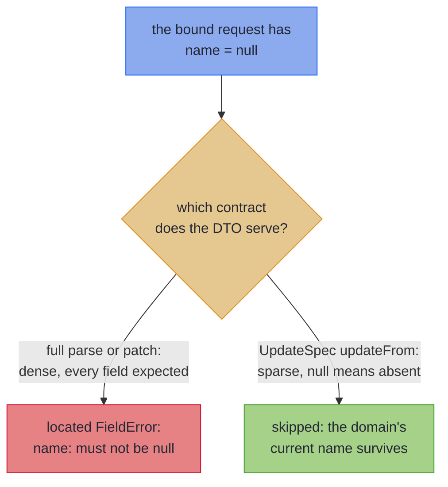

# Sparse PATCH

_Map a PATCH request so an omitted field keeps its current value and a bad one still fails._

A PATCH request carries only the fields the client wants to change, so a `null` in it means *not sent*, not *broken*. This page maps such a request onto your domain record with `UpdateSpec`: sent fields are validated and applied, and omitted ones keep their current value. The request class has getters and setters, so [Bean-Shaped Wires](beans.md) covers how it is read.

~~~admonish info title="What You'll Learn"
- What PATCH and *sparse* PATCH actually mean, and why `null` is ambiguous in a PATCH body
- Opting into sparse semantics with `UpdateSpec`: present fields fold in, absent fields leave the domain alone
- The rules that keep the null-as-absent contract honest, and how containers patch through the element vocabulary
~~~

~~~admonish example title="See Example Code"
**The code on this page is [SparsePatchBook.java](https://github.com/higher-kinded-j/higher-kinded-j/blob/main/hkj-examples/src/main/java/org/higherkindedj/example/book/mapping/SparsePatchBook.java) and its [SparsePatchBookTest.java](https://github.com/higher-kinded-j/higher-kinded-j/blob/main/hkj-examples/src/test/java/org/higherkindedj/example/book/mapping/SparsePatchBookTest.java)** - the page includes them directly, so they are compiled and run by the build.
~~~

## What PATCH actually means {#what-patch-means}

Before the sparse tier, the contract it implements, because the whole design follows from it.

`PUT` replaces a resource; `PATCH` edits one. A **sparse** PATCH body carries only the fields the client wants to change: `{"email": "new@example.com"}` means *change the email, touch nothing else*. That contract makes `null` ambiguous. When the bound request object reports `getName() == null`, did the client omit `name` (leave it unchanged), or send `"name": null` deliberately? A typical JSON binder produces the same object either way.

So the same wire value carries opposite meanings in the two tiers:



Which reading applies is a fact about the endpoint's contract, not about the data, and not something a mapper can infer from the types. That is why sparse semantics are an **explicit opt-in**. The diagram's dense `patch` is a [projection's validated write-back](tiers.md#leaf-carrying-projections-the-validated-patch), not a PATCH endpoint.

---

## Sparse PATCH write-back: `UpdateSpec` {#sparse-patch-write-back-updatespec}

To opt in, the spec extends `UpdateSpec<Domain, Wire>` instead of `MappingSpec`:

``` java
{{#include ../../../hkj-examples/src/main/java/org/higherkindedj/example/book/mapping/SparsePatchBook.java:update_spec}}
```

The Impl exposes a *single* method, `updateFrom(Wire) : Edits.Accumulated<Domain>`. There is no `build`, `parse`, or [`as*` tier](tiers.md) (a sparse mapping is not a projection of information, and an all-absent wire is *valid*, not a total parse). `updateFrom` folds the present properties into an [`Update<Domain>`](../optics/multi_edit.md), leaving the absent ones alone:

``` java
{{#include ../../../hkj-examples/src/main/java/org/higherkindedj/example/book/mapping/SparsePatchBook.java:update_usage}}
```

- **Present and valid** → the field is set, or parsed through its leaf, and folded in.
- **Present and invalid** → a located `FieldError`, accumulating as usual: sparseness never weakens validation of what *was* sent. `Edits.Accumulated` also offers `applyPath(current)` to drop straight onto the [validation railway](../effect/path_validation.md), so a controller answers with every error at once instead of persisting a partial write.
- **Absent (null)** → skipped; the domain's current value survives.

The return type is exactly what a hand-written [`Edits.accumulate(...)`](../optics/multi_edit.md) PATCH builder produces, so the two compose and the same consumption story (`apply`, `applyPath`, `toValidated`) carries over.

`updateFrom` constructs the domain record once. The present values are written onto a private record holding just the components the PATCH can set, and the domain's constructor runs a single time, over the values the PATCH ends on, reading every other component from the current value. A constructor that checks its fields against each other therefore never sees a PATCH half applied:

``` java
{{#include ../../../hkj-examples/src/main/java/org/higherkindedj/example/book/mapping/SparsePatchBook.java:update_invariant}}
```

``` java
{{#include ../../../hkj-examples/src/main/java/org/higherkindedj/example/book/mapping/SparsePatchBook.java:update_invariant_usage}}
```

A refusal is an unlabelled `FieldError` carrying the exception's message, as [the other tiers report a constructor's refusal](absence.md#constructor-invariants); an exception without a message, or with a blank one, reads `not a valid PriceBand`. A nested record the PATCH replaces whole parses through its own spec, guard included. Any `RuntimeException` counts, so a bug in the constructor reaches the client as its message too. The constructor runs only once every field sent has validated, so its refusal never joins their errors, and a PATCH that sends nothing hands back the current value itself without running it. `toValidated()` hands back the same construct-once `Update`, which has no error channel, so there a refusal throws. The generated update is [`Edits.accumulate(focus, ...)`](../optics/multi_edit.md#fields-a-constructor-checks-together), which a hand-written PATCH can use too.

The rules that keep the contract honest:

- [**A spec extending both `MappingSpec` and `UpdateSpec` is rejected.**](rules.md#one-tier-per-spec) Declare a spec per tier, and share a mix-in.
- [**A primitive wire property is rejected.**](rules.md#no-primitive-patch-property) A primitive is never absent: use the wrapper type (`Integer`, `Boolean`).
- [**A domain `Optional<T>` component bridged from a non-Optional property is rejected**](rules.md#no-optional-bridge-on-a-patch), and so is an [`@OptionalBridge`](absence.md#optional-bridge) the sparse spec declares itself: here `null` already means *leave unchanged*, so a plain property cannot also say *set to empty*. An `Optional`-typed wire property, though, *can* express *set to empty*, patching by identity or through an element leaf: a present empty Optional sets empty; an absent (`null`) one leaves unchanged. Two binder caveats come with that power: Jackson binds an explicit JSON `null` on an `Optional`-typed property to `Optional.empty()`, so on this one property shape a sent `null` means *clear*, not *leave unchanged*; and, as for every PATCH field, the bean field must start out `null`, not the idiomatic `Optional.empty()`, or every request that omits the field clears the domain value.
- [**A getter-only `List` property is rejected.**](rules.md#no-getter-only-list-on-a-patch) Give it a setter, and a getter that answers `null` until it is set.
- [**A record wire is rejected.**](rules.md#no-record-patch-wire) A record component is always present, so a PATCH wire is a bean.
- **A `JsonNullable` property is not supported yet.** A generated client that wraps its PATCH fields that way needs an `Optional`-typed property instead, as above, or a plain nullable one where *clear* has no meaning.
- [**A bean read one way only is rejected.**](rules.md#patch-bean-read-and-written) A PATCH bean is both read and written.
- [**A setter with no getter is rejected.**](rules.md#every-patch-setter-has-a-getter) Pair it with a getter, or mark it [`@Unmapped`](beans.md#accessors-meant-to-stay-out).
- [**A sealed hierarchy is rejected**](rules.md#no-sealed-patch), on either side.
- **A present container parses through the element vocabulary.** A `List`, `Set`, array, `Optional` or `Map`-valued property (a pair declared as exactly those container types) routes through the element leaf named after the component: the same leaf the dense tiers lift, so one [mix-in vocabulary](codecs.md#shared-vocabulary-mix-in-interfaces) serves a full spec and its PATCH sibling. Replacement stays wholesale; each failing element is located the way its container locates anything: by index (`phones.1`), by key, or, in a `Set`, by the element's own rendering. A whole-container leaf (`ValidatedPrism<List<S>, List<A>>`) is the more specific declaration and wins over the element interpretation. A nested *spec* still does not lift through a sparse container; give the component an element leaf delegating to the nested Impl's `asValidatedPrism()` if its elements need a whole mapping.
- [**An inherited derived field or `@OptionalBridge` marker stays inert.**](rules.md#inherited-vocabulary-on-a-patch) One mix-in serves a full spec and its PATCH sibling.
- **Coverage is one-sided.** Every wire property maps to a domain component, but a domain component with *no* wire property is simply never changed: a PATCH DTO deliberately covers a subset.
- [**A same-typed nested record, `Optional`, `List` or `Map` replaces wholesale**](rules.md#patch-replaces-wholesale) when no more specific leaf applies. Deep merge is out of scope.

~~~admonish warning title="Not checked for you: a PATCH getter answers `null` until set"
**Every PATCH bean getter must answer `null` until its property is set, and this rule cannot be checked for you.** Here absence is read from the getters rather than declared on the spec: `updateFrom` counts a property as sent whenever its getter answers anything but `null`, so a bean nothing has been set on, which is what a binder makes of an empty body, must answer `null` from every mapped getter. Any default the bean gives itself breaks that: a field initialiser (`private List<String> tags = new ArrayList<>()`, `private String status = "ACTIVE"`), a value its constructor or builder assigns, or a getter that creates one on first call. Every request that omits the field then arrives carrying the default, and the edit writes it over the domain value with nothing failing. It is the primitive's problem again, with a reference type, but no signature shows a default, so the processor cannot refuse it. Leave PATCH bean fields uninitialised and unassigned by the constructor, and let each getter return what was set; for a generated DTO, configure the generator to leave containers `null` (openapi-generator's `containerDefaultToNull`, for one) and drop `default:` from the PATCH schema's properties, which a generator renders as an initialiser. The sparse laws below catch any of these defaults when the all-absent wire is a freshly constructed bean and the current value differs from the default.
~~~

One vocabulary, both tiers. The element leaf a full spec lifts elementwise is exactly the leaf its PATCH sibling lifts:

``` java
{{#include ../../../hkj-examples/src/main/java/org/higherkindedj/example/book/mapping/SparsePatchBook.java:update_container}}
```

``` java
{{#include ../../../hkj-examples/src/main/java/org/higherkindedj/example/book/mapping/SparsePatchBook.java:update_container_usage}}
```

The sparse tier is law-checked like every other, through the same `MappingLaws` harness:

``` java
{{#include ../../../hkj-examples/src/test/java/org/higherkindedj/example/book/mapping/SparsePatchBookTest.java:update_laws}}
```

Identity (an all-absent wire is the identity update), idempotence (applying the same patch twice equals applying it once, which holds because the generated edits *set* and *parse*, never *modify*), and validation (a present invalid field fails). Make the all-absent wire a freshly constructed bean, as above, rather than one whose setters were handed `null`: the fresh bean is what a binder produces for an empty body, so it carries any field initialiser into the identity law, where a `null` setter call would overwrite the default and hide it. The law sees an initialiser only where the default differs from the current value, so give that value non-empty containers and values no field defaults to. The same laws hold over container elements:

``` java
{{#include ../../../hkj-examples/src/test/java/org/higherkindedj/example/book/mapping/SparsePatchBookTest.java:update_container_laws}}
```

The validation law asks for a located error, so its invalid wire must fail on a field: a constructor's refusal is unlabelled and cannot stand in for one. A domain with no leaf to fail, such as `PriceBand` above, checks the other two laws on their own and asserts its refusal directly:

``` java
{{#include ../../../hkj-examples/src/test/java/org/higherkindedj/example/book/mapping/SparsePatchBookTest.java:update_invariant_laws}}
```

~~~admonish tip title="Why this matters"
The three sparse laws are operational guarantees, not formalities. Identity means a client sending an empty PATCH cannot corrupt anything. Idempotence means a retried request (a timeout, a nervous user, an at-least-once queue) lands exactly as if sent once. Validation means sparseness is never an excuse: what the client did send is checked as strictly as a full submission. Hand-written PATCH handlers get these properties by luck; the one `MappingLaws` call above checks them in your build.
~~~

~~~admonish tip title="At the Spring boundary: the PATCH endpoint, end to end"
The hkj-spring example app serves `PATCH /api/users/{id}` through exactly this tier; [Sparse PATCH at the Spring boundary](../spring/spring_boot_integration.md#sparse-patch) walks the controller, the not-found-plus-validation channel, and the slice test. An all-`FieldError` payload takes [the 422 leg](../spring/spring_boot_integration.md#the-422-leg) (`hkj.web.validation-field-error-status`, default 422).
~~~

---

~~~admonish info title="Key Takeaways"
* **Sparse semantics are an explicit opt-in**: `UpdateSpec` gives a PATCH bean null-as-absent; nothing is inferred from the shape alone
* **Sparseness never weakens validation**: present fields still parse through their leaves, and every bad one is a located, accumulated `FieldError`
* **One vocabulary serves both tiers**: the element leaf a full spec lifts is the leaf its PATCH sibling lifts
~~~

~~~admonish tip title="See Also"
- [Bean-Shaped Wires](beans.md): What counts as a bean, and how its getters and setters are read and written
- [Multi-Edit and Sparse Updates](../optics/multi_edit.md): The hand-written `Edits.accumulate` this tier generates
- [Sparse PATCH at the Spring boundary](../spring/spring_boot_integration.md#sparse-patch): The controller story
- [What Your Spec Generates](tiers.md): Where `updateFrom` sits among the surfaces
~~~

---

**Previous:** [Bean-Shaped Wires](beans.md)
**Next:** [Generic Specs](generics.md)
