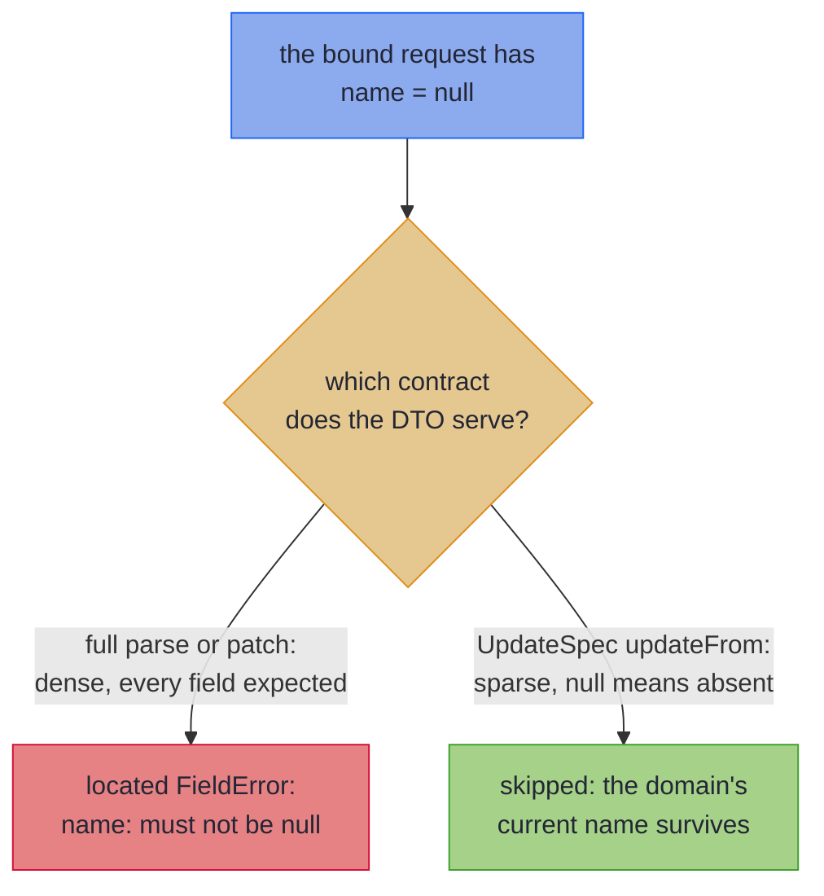

# Sparse PATCH

_Map a PATCH request so an omitted field keeps its current value and a bad one still fails._

A PATCH request carries only the fields the client wants to change, so a `null` in it means *not sent*, not *broken*. This page maps such a request onto your domain record with `UpdateSpec`: sent fields are validated and applied, and omitted ones keep their current value. The request class has getters and setters, so [Bean-Shaped Wires](beans.md) covers how it is read.

~~~admonish info title="What You'll Learn"
- Say what a `null` means in a PATCH body, and why no mapper can infer it
- Map a PATCH request with `UpdateSpec`, and read what `updateFrom` hands back
- Keep defaults off a PATCH bean, and prove it in your build with the sparse laws
- Predict what `{}`, `null` and a value each do to a property, by its type
~~~

~~~admonish example title="See Example Code"
**The code on this page is [SparsePatchBook.java](https://github.com/higher-kinded-j/higher-kinded-j/blob/main/hkj-examples/src/main/java/org/higherkindedj/example/book/mapping/SparsePatchBook.java) and its [SparsePatchBookTest.java](https://github.com/higher-kinded-j/higher-kinded-j/blob/main/hkj-examples/src/test/java/org/higherkindedj/example/book/mapping/SparsePatchBookTest.java)** - the page includes them directly, so they are compiled and run by the build.
~~~

## What PATCH actually means {#what-patch-means}

`PUT` replaces a resource; `PATCH` edits one. A **sparse** PATCH body carries only the fields the client wants to change: `{"email": "new@example.com"}` means *change the email, touch nothing else*. That makes `null` ambiguous. When the bound request reports `getName() == null`, the client either left `name` out or sent `"name": null`, and a typical JSON binder produces the same object either way.

So one wire value means opposite things on the two kinds of write:



Which reading applies is a fact about the endpoint's contract, not about the data, so no mapper can infer it from the types. That is why sparse semantics are an **explicit opt-in**. The diagram's dense `patch` is a [projection's validated write-back](tiers.md#leaf-carrying-projections-the-validated-patch), not a PATCH endpoint.

---

## Sparse PATCH write-back: `UpdateSpec` {#sparse-patch-write-back-updatespec}

To opt in, the spec extends `UpdateSpec<Domain, Wire>` instead of `MappingSpec`:

``` java
{{#include ../../../hkj-examples/src/main/java/org/higherkindedj/example/book/mapping/SparsePatchBook.java:update_spec}}
```

The Impl carries one method, `updateFrom(Wire)`, which folds the present properties into an [`Update<Domain>`](../optics/multi_edit.md) and leaves the absent ones alone. There is no `build`, `parse` or [`as*` surface](tiers.md): a sparse mapping is not a projection of information, and an all-absent wire is valid rather than a total parse.

``` java
{{#include ../../../hkj-examples/src/main/java/org/higherkindedj/example/book/mapping/SparsePatchBook.java:update_usage}}
```

Each property lands one of three ways:

- **Sent and valid**: it is set, or parsed through its leaf, and folded in.
- **Sent and invalid**: a located `FieldError`, accumulated with the rest. Sparseness never weakens validation of what *was* sent.
- **Absent**: skipped, so the domain's current value survives.

`updateFrom` returns `Edits.Accumulated<Domain>`, the same type a hand-written [`Edits.accumulate(...)`](../optics/multi_edit.md) builder produces, so `apply`, `applyPath` and `toValidated` work the same way. `applyPath(current)` lands on the [validation railway](../effect/path_validation.md), so a controller answers with every error at once rather than persisting a partial write.

### A PATCH getter answers `null` until set {#patch-getters-answer-null}

A ticket like this one turns up sooner or later: *customers keep losing their marketing preference*. Nobody had touched the preference code in a year. The trail ended at the mobile app's new "change phone number" screen, which sent the smallest PATCH it could: `{"phone": "+44 7700 900123"}`. The body was right. The bean it was bound into was not. Its generator had rendered the schema's `default: false` as a field initialiser, `private Boolean marketingOptIn = false;`. So every request that left the field out arrived carrying `false`, and the update wrote that `false` over whatever the customer had chosen. The tests stayed green, because their sample customer had never opted in, and writing `false` over `false` changes nothing.

Two promises make PATCH work. Absent must mean *leave it alone*, and the mapping must be able to *see* absence. `UpdateSpec` keeps the first promise for you. That bean broke the second, and no compiler can check it. The fix is to leave the field unset:

<!-- verify -->
```java
class PreferencesPatch {
  private Boolean marketingOptIn; // not `= false`: an omitted field must read as null

  public Boolean getMarketingOptIn() {
    return marketingOptIn;
  }

  public void setMarketingOptIn(Boolean marketingOptIn) {
    this.marketingOptIn = marketingOptIn;
  }
}
```

~~~admonish warning title="Not checked for you: leave PATCH bean fields unset"
`updateFrom` counts a property as sent whenever its getter answers anything but `null`. So a bean nothing has been set on, which is what a binder makes of `{}`, must answer `null` from every mapped getter. Any default the bean gives itself breaks that: a field initialiser (`= new ArrayList<>()`, `= "ACTIVE"`, `= Optional.empty()`), a value its constructor or builder assigns, or a getter that creates one on first call. Every request that omits the field then writes the default over the domain value, and nothing fails. No signature shows a default, so the processor cannot refuse one.

- **Leave each field uninitialised**, and let each getter return what was set.
- **Configure a generated DTO the same way.** Have the generator leave containers `null` (openapi-generator's `containerDefaultToNull`, for one), and drop `default:` from the PATCH schema, which a generator renders as an initialiser.
- **Check it in your build**, as the next section shows: the sparse identity law fails on a default.
~~~

### Check it in your build {#check-a-patch-in-your-build}

The sparse tier is law-checked through the same `MappingLaws` harness as every other:

``` java
{{#include ../../../hkj-examples/src/test/java/org/higherkindedj/example/book/mapping/SparsePatchBookTest.java:update_laws}}
```

The three laws are operational guarantees, not formalities:

- **Identity**: an all-absent wire is the identity update, so a client sending an empty PATCH cannot corrupt anything.
- **Idempotence**: applying a patch twice equals applying it once, so a retried request lands as if sent once. It holds because the generated edits *set* and *parse*, never *modify*.
- **Validation**: a sent invalid field fails, located, so what the client did send is checked as strictly as a full submission.

Make the all-absent wire a freshly constructed bean, as the test does. That is what a binder makes of `{}`, so it carries any field initialiser into the identity law, where a `null` passed to each setter would overwrite the default and hide it. The law sees a default only where it differs from the current value, so give the current value non-empty containers, and values no default matches.

~~~admonish tip title="You can ship now"
`UpdateSpec`, a bean with no defaults, and the sparse laws in your build are a PATCH endpoint. The hkj-spring example app serves `PATCH /api/users/{id}` through this tier. [Sparse PATCH at the Spring boundary](../spring/spring_boot_integration.md#sparse-patch) walks the controller, its not-found and validation channels, and the slice test, and an all-`FieldError` result takes [the 422 leg](../spring/spring_boot_integration.md#the-422-leg). The rest of this page is for when you need it.
~~~

~~~admonish question title="Checkpoint: is this PATCH bean safe?" id="check-patch-defaults"
The processor accepts this spec without a warning:

``` java
{{#include ../../../hkj-examples/src/main/java/org/higherkindedj/example/book/mapping/SparsePatchBook.java:defaults_trap}}
```

An article is tagged `java` and `patch`. A client sends a PATCH that only renames it. What are its tags afterwards, and what in your build would tell you?
~~~

~~~admonish success title="Answer and why" collapsible=true id="check-patch-defaults-answer"
**None: the rename clears them, silently.** The field initialiser makes `getTags()` answer an empty list on every request that omits `tags`, so `updateFrom` reads the list as sent and writes it over the article's tags. The sparse identity law catches it, given a freshly constructed bean:

``` java
{{#include ../../../hkj-examples/src/test/java/org/higherkindedj/example/book/mapping/SparsePatchBookTest.java:defaults_trap_proof}}
```

Where this lives: [A PATCH getter answers `null` until set](#patch-getters-answer-null).
~~~

---

## What each JSON state does {#what-each-json-state-does}

A binder turns each JSON state into what the getter answers, and `updateFrom` reads only the getter. So a property's type decides which states a client can tell apart:

| The property | `{}` | `{"x": null}` | `{"x": value}` |
|---|---|---|---|
| A reference, `String nickname` | keeps the current value | keeps it: a binder cannot tell this from `{}` | sets it, through its leaf if it has one |
| An `Optional`, `Optional<String> nickname` | keeps the current value | clears it: Jackson binds `Optional.empty()` | sets it |
| A container, `List<String> phones` | keeps the current value | keeps it | replaces it wholesale, each element through its leaf |

The `Optional`-typed property is the only shape with a third state, so it is how a PATCH says *set this to empty*, patching by identity or through an element leaf. A plain property has only two, which is why a sparse spec refuses one for a domain `Optional`. A primitive property has one, since it is never absent, so the processor refuses it and offers the wrapper type.

---

## Fields a constructor checks together {#fields-a-constructor-checks-together}

`updateFrom` constructs the domain record once, over the values the PATCH ends on, and reads every other component from the current value. A constructor that checks its fields against each other therefore never sees a PATCH half applied:

``` java
{{#include ../../../hkj-examples/src/main/java/org/higherkindedj/example/book/mapping/SparsePatchBook.java:update_invariant}}
```

``` java
{{#include ../../../hkj-examples/src/main/java/org/higherkindedj/example/book/mapping/SparsePatchBook.java:update_invariant_usage}}
```

The refusal comes back as an unlabelled `FieldError` carrying the constructor's message, as it does on [the other tiers](absence.md#constructor-invariants). Unlabelled means it cannot stand in for the validation law's located error, so a domain with no leaf to fail, such as `PriceBand`, checks the other two laws and asserts its refusal directly:

``` java
{{#include ../../../hkj-examples/src/test/java/org/higherkindedj/example/book/mapping/SparsePatchBookTest.java:update_invariant_laws}}
```

[A sparse update constructs the record once](rules.md#sparse-construct-once) has the precise rules.

---

## Containers: one vocabulary, both tiers {#patch-containers}

A present container property parses through the element leaf named after its component: the same leaf a full spec lifts, so one [mix-in vocabulary](codecs.md#shared-vocabulary-mix-in-interfaces) serves a full spec and its PATCH sibling. A present container replaces the domain's wholesale, and each failing element is located the way its container locates anything:

``` java
{{#include ../../../hkj-examples/src/main/java/org/higherkindedj/example/book/mapping/SparsePatchBook.java:update_container}}
```

``` java
{{#include ../../../hkj-examples/src/main/java/org/higherkindedj/example/book/mapping/SparsePatchBook.java:update_container_usage}}
```

The same laws hold over container elements:

``` java
{{#include ../../../hkj-examples/src/test/java/org/higherkindedj/example/book/mapping/SparsePatchBookTest.java:update_container_laws}}
```

[Containers patch through the element leaf](rules.md#patch-containers) covers a whole-container leaf and a nested spec.

---

## The rules in brief {#patch-rules-in-brief}

The processor refuses a PATCH spec it cannot honour, and the refusal names the fix. Each row links to its rule in full:

| On a PATCH spec or bean | What happens | Instead |
|---|---|---|
| [It extends both `MappingSpec` and `UpdateSpec`](rules.md#one-tier-per-spec) | refused | a spec per tier, sharing a mix-in |
| [A primitive property, `int age`](rules.md#no-primitive-patch-property) | refused | the wrapper type, `Integer age` |
| [A plain property for a domain `Optional`](rules.md#no-optional-bridge-on-a-patch), or `@OptionalBridge` on the spec | refused | an `Optional`-typed property |
| [A getter-only `List`](rules.md#no-getter-only-list-on-a-patch) | refused | a setter, and a getter that answers `null` until set |
| [A record wire](rules.md#no-record-patch-wire) | refused | a bean |
| [A bean read one way only](rules.md#patch-bean-read-and-written) | refused | a bean both read and written |
| [A setter with no getter](rules.md#every-patch-setter-has-a-getter) | refused | a getter, or [`@Unmapped`](beans.md#accessors-meant-to-stay-out) on the spec |
| [A sealed hierarchy](rules.md#no-sealed-patch), on either side | refused | a PATCH spec for the subtype itself |
| [A `JsonNullable` property](rules.md#no-jsonnullable-patch-property) | not supported yet | an `Optional`-typed property |
| [An inherited derived field or `@OptionalBridge` marker](rules.md#inherited-vocabulary-on-a-patch) | inert | nothing: one mix-in serves both tiers |
| [A same-typed nested record, `Optional`, `List` or `Map`](rules.md#patch-replaces-wholesale) | replaced wholesale | a leaf where its parts need checking; deep merge is out of scope |
| A domain component with no wire property | never changed | nothing: a PATCH DTO covers a subset on purpose |

---

~~~admonish info title="Key Takeaways"
* **Sparse semantics are an explicit opt-in**: `UpdateSpec` gives a PATCH bean null-as-absent; nothing is inferred from the shape alone
* **Sparseness never weakens validation**: present fields still parse through their leaves, and every bad one is a located, accumulated `FieldError`
* **A PATCH bean carries no defaults**: each getter answers `null` until set, and the sparse identity law, given a freshly constructed bean, catches one that does not
* **One vocabulary serves both tiers**: the element leaf a full spec lifts is the leaf its PATCH sibling lifts
~~~

~~~admonish tip title="See Also"
- [Bean-Shaped Wires](beans.md): What counts as a bean, and how its getters and setters are read and written
- [Multi-Edit and Sparse Updates](../optics/multi_edit.md): The hand-written `Edits.accumulate` this tier generates
- [Sparse PATCH at the Spring boundary](../spring/spring_boot_integration.md#sparse-patch): The controller story
- [What Your Spec Generates](tiers.md): Where `updateFrom` sits among the surfaces
~~~

---

**Previous:** [Bean-Shaped Wires](beans.md)
**Next:** [Generic Specs](generics.md)
