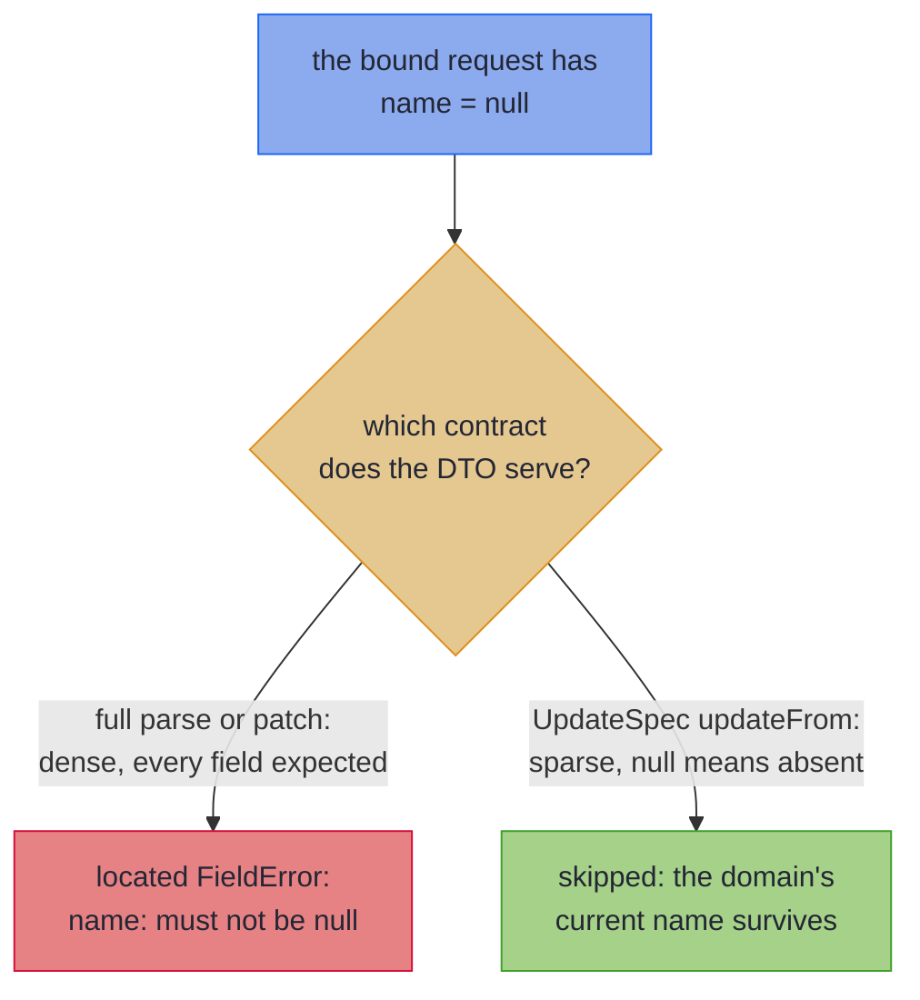

# Beans and Sparse PATCH

_The same mapper for getter/setter wires, and the opt-in tier where `null` means "leave unchanged" instead of "broken"._

Not every wire type is a record. Generated clients, JAXB payloads and legacy DTOs are beans, and one very common bean, the REST PATCH request, changes what `null` *means*: not broken data but *not provided*. This page covers both: mapping bean-shaped wires with the full feature set, and the explicit `UpdateSpec` opt-in that gives a PATCH bean its sparse semantics.

~~~admonish info title="What You'll Learn"
- Mapping bean-shaped wire types (setters, builders, JAXB lists) with the same features as records
- Why a bean mapping withholds `asIso()`, and how `Optional` bridges through `null` here without a declaration
- Why a bean projection with a reference property takes the validated `patch` rather than `asLens()`
- What PATCH and *sparse* PATCH actually mean, and why `null` is ambiguous in a PATCH body
- Opting into sparse semantics with `UpdateSpec`: present fields fold in, absent fields leave the domain alone
- The rules that keep the null-as-absent contract honest, and how containers patch through the element vocabulary
~~~

~~~admonish example title="See Example Code"
**The code on this page is [RecordMappingBook.java](https://github.com/higher-kinded-j/higher-kinded-j/blob/main/hkj-examples/src/main/java/org/higherkindedj/example/book/mapping/RecordMappingBook.java)** - the page includes it directly, so it is compiled and run by the build.
~~~

## Bean-shaped wire targets

The wire side need not be a record. A **bean** (a mutable class with a no-args constructor and getters/setters, or an immutable one with a builder) maps the same way, with the same features (renames, leaves, derived fields, container lifting, nesting). Only *how* the wire is read and written changes: `build` fills through setters or a builder, and `parse` reads through getters.

``` java
{{#include ../../../hkj-examples/src/main/java/org/higherkindedj/example/book/mapping/RecordMappingBook.java:bean_spec}}
```

``` java
{{#include ../../../hkj-examples/src/main/java/org/higherkindedj/example/book/mapping/RecordMappingBook.java:bean_usage}}
```

The design decisions worth knowing:

- **Null is located, never thrown, like every wire.** The null guard is universal ([one rule](basics.md#null-doctrine), both shapes), so a `null` property read is a located `FieldError` exactly as on a record wire. What is bean-*specific* is why nulls are expected at all: an unset property is a representable, ordinary state of a mutable bean, not just a hostile binding.
- **Honest tiers.** Because an unset property is ordinary, a bean's guarded reference reads count as fallible and the mapping withholds `asIso()` automatically; an all-primitive bean (whose reads can never be null) still earns it. A record wire's guards exist for hostile bindings only, so a lossless record mapping keeps `asIso()`, with the parse-iso coherence law scoped to wires whose reference components are non-null. Nesting is unaffected: a bean mapping exposes `asValidatedPrism()` like any other, so record specs nest it and containers lift it.
- **Construction strategy** is detected from the bean's shape, tried in order: a public no-args constructor with `setX` setters (and, for a getter-only `List`, the JAXB convention `getItems().addAll(...)`); then a static `builder()`/`newBuilder()` whose setters fill it and whose `build()` yields the wire. A bean that fits neither gets a what/why/fix diagnostic.
- **A getter-only `List` must name its element type**, because `addAll` is what fills it: over a raw `List` that call is unchecked, and over a wildcard one the receiver and the argument capture separately, so neither writes into an Impl that compiles. The diagnostic names the remedy its cause calls for — declare the type arguments, or replace the wildcard with the element type it stands for — and both causes are also answered by a setter, which takes the property as declared. This is a `build` rule only: the [sparse tier](#sparse-patch-write-back-updatespec) reads such a property and never writes it, so the same bean maps there untouched.
- **Optionality bridges through `null`, automatically here.** On a full mapping, a domain `Optional<T>` maps to a nullable bean property `T` (bean conventions leave `Optional` off property types): empty bridges to absent (`build` skips the write, leaving the property unset; `parse` reads `Optional.ofNullable(...)`), and a present value still validates through its leaf. This is the *only* wire shape where the bridge needs no declaration: a record wire opts in per component with [`@OptionalBridge`](basics.md#optional-bridge), which buys the same correspondence, and declaring it on a bean spec is redundant (a note, not an error, so one mix-in can serve both shapes). One property shape refuses the bridge: a getter-only `List` filled by the JAXB convention above has no unset state to carry absence, because its getter creates the list on first call, so an empty `Optional` would read back as a present empty list; the diagnostic asks for a `List<T>` domain component, where the empty list *is* nothing, or for a property the build can genuinely leave unset — which takes both a setter *and* a getter that answers `null` until one is called, since a lazily creating getter loses absence on the read even when a setter exists. The [sparse tier](#sparse-patch-write-back-updatespec) is the deliberate exception in the other direction: there `null` already means "leave unchanged", so a PATCH bean encodes "set to empty" with an `Optional`-typed property instead.
- **The domain stays a record.** `parse` assembles the domain through its canonical constructor, so only the *wire* may be bean-shaped; a bean domain gets a diagnostic.

### Bean projections

A bean with *fewer* properties than the domain is a projection, as a smaller record wire is, but the same shape can land on a different tier. A record is constructed whole, so a record projection that copies by identity keeps its lawful `asLens()`: a `null` component there is a hostile binding, not a state the type invites. A bean is constructed empty and filled by setters, which makes an unset reference property an ordinary state, and a lens's `set` cannot fail, so it has no honest answer for one. A bean projection with any reference property therefore takes the [validated `patch`](tiers.md#leaf-carrying-projections-the-validated-patch), even when every property copies by identity:

``` java
{{#include ../../../hkj-examples/src/main/java/org/higherkindedj/example/book/mapping/RecordMappingBook.java:bean_projection_spec}}

{{#include ../../../hkj-examples/src/main/java/org/higherkindedj/example/book/mapping/RecordMappingBook.java:bean_projection_usage}}
```

Everything else is the record-wire tier unchanged: every projected property is validated, every bad one is located and accumulated, and the unprojected components are read from the domain argument, so they survive by construction. Leaves, nested specs and container lifting all apply, and so does the automatic `Optional` bridge: a bridged property left unset reads as empty, so `patch` writes `Optional.empty()` rather than keeping the current value. The same `MappingLaws` patch overload law-checks it; the laws compare domain values only, so the bean needs no `equals`. An all-primitive bean projection, whose reads can never be null, keeps its lawful `asLens()`.

This is not the REST PATCH contract, even when the bean is a PATCH request: an unset property never means "keep the current value". For that, extend `UpdateSpec` ([below](#sparse-patch-write-back-updatespec)).

`patch` only reads the bean, through its getters, but the Impl also carries `build`, which writes one, so a bean projection still needs one of the construction strategies above; a getter-only bean draws the same diagnostic as on a full mapping. One-directional beans (getter-only or setter-only) are not supported yet.

---

## What PATCH actually means {#what-patch-means}

Before the sparse tier, the contract it implements, because the whole design follows from it.

`PUT` replaces a resource; `PATCH` edits one. A **sparse** PATCH body carries only the fields the client wants to change: `{"email": "new@example.com"}` means *change the email, touch nothing else*. That contract makes `null` ambiguous. When the bound request object reports `getName() == null`, did the client omit `name` (leave it unchanged), or send `"name": null` deliberately? A typical JSON binder produces the same object either way.

So the same wire value carries opposite meanings in the two tiers:



Which reading applies is a fact about the endpoint's contract, not about the data, and not something a mapper can infer from the types. That is why sparse semantics are an **explicit opt-in**.

---

## Sparse PATCH write-back: `UpdateSpec`

To opt in, the spec extends `UpdateSpec<Domain, Wire>` instead of `MappingSpec`:

``` java
{{#include ../../../hkj-examples/src/main/java/org/higherkindedj/example/book/mapping/RecordMappingBook.java:update_spec}}
```

The Impl exposes a *single* method, `updateFrom(Wire) : Edits.Accumulated<Domain>`. There is no `build`, `parse`, or `as*` tier (a sparse mapping is not a projection of information, and an all-absent wire is *valid*, not a total parse). `updateFrom` folds the present properties into an [`Update<Domain>`](../optics/multi_edit.md), leaving the absent ones alone:

``` java
{{#include ../../../hkj-examples/src/main/java/org/higherkindedj/example/book/mapping/RecordMappingBook.java:update_usage}}
```

- **Present and valid** → the field is set, or parsed through its leaf, and folded in.
- **Present and invalid** → a located `FieldError`, accumulating as usual: sparseness never weakens validation of what *was* sent. `Edits.Accumulated` also offers `applyPath(current)` to drop straight onto the [validation railway](../effect/path_validation.md), so a controller answers with every error at once instead of persisting a partial write.
- **Absent (null)** → skipped; the domain's current value survives.

The return type is exactly what a hand-written [`Edits.accumulate(...)`](../optics/multi_edit.md) PATCH builder produces, so the two compose and the same consumption story (`apply`, `applyPath`, `toValidated`) carries over.

The rules that keep the contract honest:

- **A spec extending both `MappingSpec` and `UpdateSpec` is rejected.** One spec generates one Impl on one tier, and the tiers emit disjoint members, so nothing an Impl could carry answers both clauses. Declare a spec per tier and let a [shared vocabulary mix-in](codecs.md#shared-vocabulary-mix-in-interfaces) carry what the pair has in common. A spec in a *dependency* that carries the shape is not refused here (it was compiled elsewhere), but it is never offered for nesting either: a use site needing the pair is told which spec it is and that it has no parse.
- **A primitive wire property is rejected.** A primitive is always present (its default), so it can never carry the null-as-absent signal; use the wrapper type (`Integer`, `Boolean`). This is *forced*, not a style choice: an all-absent body must fold to the identity update, which a primitive would break.
- **A domain `Optional<T>` component bridged from a non-Optional property is rejected**, and so is an [`@OptionalBridge`](basics.md#optional-bridge) the sparse spec declares itself, for the same reason. Under null-as-absent, `null` already means "leave unchanged", so "set to empty" has no encoding through a plain property (and a null-clears rule would be JSON Merge Patch's opposite contract). The bridge's `null`-means-absent and the sparse tier's `null`-means-unchanged are two readings of one byte, and a spec extending `UpdateSpec` has already chosen. An `Optional`-typed wire property, though, *can* express it, patching by identity or through an element leaf: a present empty Optional sets empty; an absent (`null`) one leaves unchanged. Two binder caveats come with that power: Jackson binds an explicit JSON `null` on an `Optional`-typed property to `Optional.empty()`, so on this one property shape a sent `null` means *clear*, not *leave unchanged*; and the bean field must default to `null`, not the idiomatic `Optional.empty()`, or every request that omits the field clears the domain value.
- **A getter-only `List` property is rejected.** The JAXB convention creates the list on first call, so the property never reads `null` and cannot say *not provided*: a request that omits it would arrive as a present empty list and clear the domain value, with nothing failing to say so. Give it a setter, so an omitted field leaves it `null`. The [dense tier](#bean-shaped-wire-targets) keeps the same property, because it writes every component and absence has nothing to mean there.
- **A record wire is rejected.** A record component is always present, so absence is inexpressible; sparse PATCH is a bean-only shape.
- **A sealed hierarchy is rejected**, on either side: dispatch has no sparse meaning (an absent property cannot choose a subtype to patch).
- **A present container parses through the element vocabulary.** A `List`, `Set`, array, `Optional` or `Map`-valued property (a pair declared as exactly those container types) routes through the element leaf named after the component: the same leaf the dense tiers lift, so one [mix-in vocabulary](codecs.md#shared-vocabulary-mix-in-interfaces) serves a full spec and its PATCH sibling. Replacement stays wholesale; each failing element is located the way its container locates anything - by index (`phones.1`), by key, or, in a `Set`, by the element's own rendering. A whole-container leaf (`ValidatedPrism<List<S>, List<A>>`) is the more specific declaration and wins over the element interpretation. A nested *spec* still does not lift through a sparse container; give the component an element leaf delegating to the nested Impl's `asValidatedPrism()` if its elements need a whole mapping.
- **An inherited derived field or `@OptionalBridge` marker stays inert.** Arriving from a [mix-in](codecs.md#shared-vocabulary-mix-in-interfaces), neither is ever consulted here, so one vocabulary serves a full spec and its PATCH sibling; declaring either on the `UpdateSpec` itself is still an error, reported where it was written. An inherited rename is inert too whenever either end is missing, whether this PATCH bean omits the property its `to` names or this domain omits the component it renames, so a bean covering a subset needs no vocabulary of its own. One inherited member is still refused: a [`@Flatten`](structure.md#flattening-a-nested-component-onto-a-flat-wire) marker, whose group has no sparse edit shape.
- **Coverage is one-sided.** Every wire property maps to a domain component, but a domain component with *no* wire property is simply never changed: a PATCH DTO deliberately covers a subset.
- **A same-typed nested record, `Optional`, `List` or `Map` replaces wholesale** through identity, the fallback when no more specific leaf applies. The details:
  - A same-typed `List`, `Set`, array or `Map` carries the dense tiers' null scan: a null element or value is a located, accumulating invalid (`tags.1: must not be null`; a set's, unlocated as `tags: must not contain a null element`), never written into the domain; a valid container still passes by reference, unrebuilt.
  - The scan needs a properly parameterised container; a raw or wildcard-argument one is written as sent.
  - A same-typed `Optional` needs no scan (it cannot hold a null element), so its identity write is unconditional: a present empty sets empty, absent leaves unchanged.
  - A nested record whose wire differs is patched wholesale through its own full mapping spec. Deep merge is out of scope.

One vocabulary, both tiers. The element leaf a full spec lifts elementwise is exactly the leaf its PATCH sibling lifts:

``` java
{{#include ../../../hkj-examples/src/main/java/org/higherkindedj/example/book/mapping/RecordMappingBook.java:update_container}}
```

``` java
{{#include ../../../hkj-examples/src/main/java/org/higherkindedj/example/book/mapping/RecordMappingBook.java:update_container_usage}}
```

The sparse tier is law-checked like every other, through the same `MappingLaws` harness:

``` java
{{#include ../../../hkj-examples/src/test/java/org/higherkindedj/example/book/mapping/RecordMappingBookLawsTest.java:update_laws}}
```

Identity (an all-absent wire is the identity update), idempotence (applying the same patch twice equals applying it once, which holds because the generated edits *set* and *parse*, never *modify*), and validation (a present invalid field fails). The same laws hold over container elements:

``` java
{{#include ../../../hkj-examples/src/test/java/org/higherkindedj/example/book/mapping/RecordMappingBookLawsTest.java:update_container_laws}}
```

~~~admonish tip title="Why this matters"
The three sparse laws are operational guarantees, not formalities. Identity means a client sending an empty PATCH cannot corrupt anything. Idempotence means a retried request (a timeout, a nervous user, an at-least-once queue) lands exactly as if sent once. Validation means sparseness is never an excuse: what the client did send is checked as strictly as a full submission. Hand-written PATCH handlers get these properties by luck; the one `MappingLaws` call above checks them in your build.
~~~

~~~admonish tip title="At the Spring boundary: the PATCH endpoint, end to end"
The hkj-spring example app serves `PATCH /api/users/{id}` through exactly this tier; [Sparse PATCH at the Spring boundary](../spring/spring_boot_integration.md#sparse-patch) walks the controller, the not-found-plus-validation channel, and the slice test. An all-`FieldError` payload takes [the 422 leg](../spring/spring_boot_integration.md#the-422-leg) (`hkj.web.validation-field-error-status`, default 422).
~~~

---

~~~admonish info title="Key Takeaways"
* **Beans map with the full feature set**: only the read/write mechanics differ, and the tiers stay honest (`asIso` is withheld, and a projection takes `patch` rather than `asLens`, where unset properties make reads fallible)
* **Sparse semantics are an explicit opt-in**: `UpdateSpec` gives a PATCH bean null-as-absent; nothing is inferred from the shape alone
* **Sparseness never weakens validation**: present fields still parse through their leaves, and every bad one is a located, accumulated `FieldError`
* **One vocabulary serves both tiers**: the element leaf a full spec lifts is the leaf its PATCH sibling lifts
~~~

~~~admonish tip title="See Also"
- [Multi-Edit and Sparse Updates](../optics/multi_edit.md) - The hand-written `Edits.accumulate` this tier generates
- [Sparse PATCH at the Spring boundary](../spring/spring_boot_integration.md#sparse-patch) - The controller story
- [The Emission Tiers](tiers.md) - Where `updateFrom` sits among the surfaces
~~~

---

**Previous:** [The Emission Tiers](tiers.md)
**Next:** [Generic Specs](generics.md)
