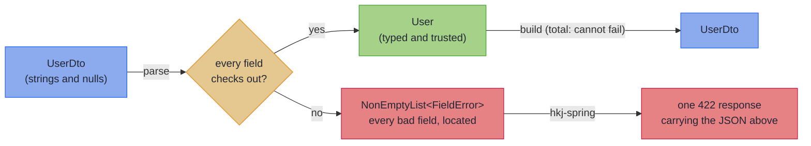
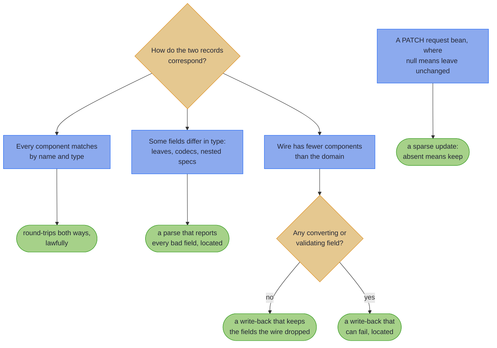

# Mapping at the Boundary

> _"I, too, am a translated man. I have been borne across. It is generally believed that something is always lost in translation; I cling to the notion ... that something can also be gained."_
> — Salman Rushdie, *Shame*

---

Every value that crosses a service boundary is translated in Rushdie's sense: born in the wire's language of strings and nulls, borne across into the domain's language of typed identifiers, real dates, and emails that have already been checked. Rushdie insists something can be gained in translation, and this chapter takes him at his word: what lands on the far side is a value the domain can finally trust. The chapter is also about what an honest translator owes you when the original turns out to be gibberish: not the first complaint, but all of them, each with an address.

Every service has the same three files. A DTO the framework binds. A domain record the business logic trusts. And, between them, a mapper: hand-written, reflection-driven, or generated, but always *there*, because the shape the wire speaks is never quite the shape the domain thinks in.

Here is the version most codebases carry, in one form or another:

<!-- verify -->
```java
public static User toDomain(UserDto dto) {
    Objects.requireNonNull(dto.email(), "email required");   // throws on the FIRST problem
    if (!dto.email().contains("@")) {
        throw new IllegalArgumentException("bad email");     // no field name, no path
    }
    return new User(
        UUID.fromString(dto.id()),                           // throws its own exception
        dto.email(),
        LocalDate.parse(dto.joined()));                      // and so does this one
}
```

It works, until it doesn't, and it fails three ways at once:

1. **It drifts.** Add a component to `User` and nothing tells you the mapper no longer covers it. The compiler is not watching this file.
2. **It stops at the first error.** The client fixes the email, resubmits, and only then learns the date was bad too. One round trip per defect.
3. **Its errors have no address.** `IllegalArgumentException: bad email` says nothing a client can map onto a form field, so a handler somewhere turns it into a vague 400.

---

## What you get instead

This chapter replaces that mapper with one interface you own and one annotation. The processor derives both directions at compile time, and the fallible direction reports **every** bad field at once, each located by a dotted path. Here is the destination, before any theory: a request with five defects, answered by one response.

```json
{
  "valid": false,
  "errors": [
    { "path": "id",             "message": "not a UUID (expected e.g. 123e4567-e89b-12d3-a456-426614174000)" },
    { "path": "customer.email", "message": "not an email address" },
    { "path": "lines.1.price",  "message": "not a number in plain notation (expected e.g. 123.45)" },
    { "path": "placedAt",       "message": "not an ISO-8601 instant (expected e.g. 2026-07-28T12:34:56Z)" },
    { "path": "status",         "message": "unknown OrderStatus (expected one of NEW, PAID, SHIPPED)" }
  ],
  "errorCount": 5
}
```

The bad email is *inside a nested record*; the bad price is on the *second element of a list*. Nobody wrote a line of error-handling code to produce this: it falls out of the declarations, and the [Capstone](capstone.md) builds it end to end, proven by a test the build runs (the full response also carries each error's path as structured segments; it is abridged here). The client fixes all five and resubmits once.

The shape of the machinery is a railway with two directions:



And the "one interface you own"? Here it is, whole, for a pair whose components already match:

``` java
{{#include ../../../hkj-examples/src/main/java/org/higherkindedj/example/book/mapping/RecordMappingBook.java:basics_spec}}
```

Where a field needs converting or checking, the spec (that interface) declares a **leaf**: the conversion at that one field, written as a [`ValidatedPrism`](../optics/validated_prism.md):

``` java
{{#include ../../../hkj-examples/src/main/java/org/higherkindedj/example/book/mapping/RecordMappingBook.java:leaf_spec}}

{{#include ../../../hkj-examples/src/main/java/org/higherkindedj/example/book/mapping/RecordMappingBook.java:leaf_usage}}
```

Outbound, `build` is a *total* function: it cannot fail. Inbound, `parse` returns `Validated<NonEmptyList<FieldError>, Domain>`: either your typed domain value, or every defect at once. Nothing drifts, because the processor re-derives the mapping from the records on every compile and rejects what it cannot honour.

~~~admonish tip title="At the Spring boundary"
If you arrived here because you want that 422, the wiring is two steps: this chapter's `parse`, and the `hkj-spring-boot-starter`, which renders an `Invalid` parse result as one **422 Unprocessable Content** response with no code in between. Return the result from the controller as-is. [The 422 leg](../spring/spring_boot_integration.md#the-422-leg) is the full story, and [Sparse PATCH at the Spring boundary](../spring/spring_boot_integration.md#sparse-patch) covers PATCH endpoints. (A *leg* is the route a returned value travels to become an HTTP response, in the railway sense.)
~~~

---

## Part of the library, not a bolt-on

The mapper is not a separate tool that happens to ship in the same jar; it is Higher-Kinded-J's own parts, composed and generated. That is why it fits the rest of the book:

- **Parse, don't validate.** Alexis King's phrase names the discipline: *"a parser is just a function that consumes less-structured input and produces more-structured output."* `parse` is exactly that function. There is no half-state where a DTO has been "validated" but the domain value does not exist yet; the boundary produces a trusted value or a typed refusal, and the type system knows which.
- **Typed errors over exceptions.** The refusal is a value (`Validated`, `NonEmptyList`, `FieldError`), so it accumulates, composes, and travels the same [railway](../effect/effect_path_overview.md) as every other error in the library.
- **Truthful types.** The generated surface only ever offers operations whose laws the record pair can honour; what cannot be lawful is simply not generated.
- **Laws, verified.** Each generated surface obeys stated laws, checked in the library's own build and repeatable in yours with [one test call](tiers.md#law-checked-in-the-repo-and-in-your-tests).
- **Built from parts you already know.** A leaf is a [`ValidatedPrism`](../optics/validated_prism.md), accumulation is [`Validated.fields()`](../monads/validated_assembly.md), a sparse PATCH folds into [`Edits.Accumulated`](../optics/multi_edit.md). Learn the mapper and you have learned more of the library; learn the library and the mapper holds no surprises.

---

## What the mapper will (and will not) generate

The generated surface follows the shape of the pair, and that decision is the map of this chapter:



That decision tree is the map of this chapter: [The Emission Tiers](tiers.md) names each of these surfaces and the laws it obeys.

~~~admonish note title="If you know MapStruct"
This is not a MapStruct competitor on breadth, and does not try to be: MapStruct keeps its ground for mutable JPA entities, nested-path flattening, and Bean-Validation-centric shops. What this generator does differently is **boundary correctness for record domains**: the inbound direction is a validating parser with located, accumulated errors (where MapStruct throws on the first bad conversion, or silently maps an invalid value), the outbound direction is provably total, and no operation is generated whose laws the pair cannot satisfy. Adopt it where the boundary is the product; keep MapStruct where its breadth pays.
~~~

~~~admonish note title="If you know Bean Validation"
The usual pipeline is: bind with Jackson, annotate the DTO with `@Valid` constraints, translate with a mapper, and catch what leaks in a `@ControllerAdvice`. To be fair to that stack, `@Valid` *does* accumulate errors, and they *do* carry field names. What it cannot do is produce `User`. The annotations guard the DTO; the domain constructor still runs on data that was checked somewhere else; the format rule lives in a third place neither record enforces; and the mapper in the middle can still throw. Here, parsing and validating are one step, and the type system knows it happened.
~~~

---

## How to read this chapter

Two pages are enough to ship. [Record Mapping Basics](basics.md) declares a mapping and reads its errors; [Standard Codecs](codecs.md) covers the stock conversions (UUIDs, dates, enums, money) so most boundaries need no hand-written conversion at all. Everything after that is on demand:

- DTOs that nest, hold lists, or dispatch over sealed types: [Nesting, Containers, and Sealed Hierarchies](structure.md)
- What exactly got generated for your spec, and why: [The Emission Tiers](tiers.md)
- A PATCH endpoint, or a getter/setter DTO: [Beans and Sparse PATCH](beans_patch.md)
- A `Page<T>` at the boundary: [Generic Specs](generics.md)
- Combining several sources, or typing your error context: [Merge and Error Envelopes](merge_envelopes.md)
- Spring beans, test fakes, and the feature's limits: [Injecting, Testing, and Diagnostics](testing.md)
- The whole lane on one worked boundary: [the Capstone](capstone.md)

~~~admonish info title="In This Chapter"
- **Record Mapping Basics** – Declare a mapping as one empty interface and get both directions: a `build` that cannot fail and a `parse` that reports every bad field at once. Then add conversions, renames, and computed fields.
- **Standard Codecs and Shared Vocabulary** – The stock conversions (UUIDs, dates, enums, money) as one factory call each, and the mix-in pattern that shares your conversions across every spec in an API.
- **Nesting, Containers, and Sealed Hierarchies** – Specs nest automatically and failures compose into dotted paths; `List`/`Optional`/`Map` map their elements; sealed pairs dispatch exhaustively in both directions.
- **The Emission Tiers** – Which spec shapes earn `asIso()`, `asLens()`, the validated `patch`, or `asValidatedPrism()`, and the one-call law check that proves each in your own tests.
- **Beans and Sparse PATCH** – Getter/setter and builder wires with the full feature set, and the `UpdateSpec` opt-in that gives a PATCH bean null-as-absent semantics without weakening validation of what was sent.
- **Generic Specs** – Mapping `Page<T>` and friends: concrete instantiations, threaded type parameters, and element-mapped specs whose codecs arrive at construction time.
- **Merge and Error Envelopes** – `@GenerateMerge` assembles one target from several sources; `@GenerateErrorEnvelope` retires the copy-pasted `code`/`message`/`timestamp` and types the error context.
- **Injecting, Testing, and Diagnostics** – Register the surface you consume, fake codecs as two-line values, and lean on what/why/fix diagnostics; there is no component ceiling.
- **Capstone: One 422, Every Bad Field** – The whole chapter on one order-intake boundary: a five-defect request answered by the single response shown above, with PATCH, merge, and envelope encores, all proven by a green test.
~~~

~~~admonish info title="Hands-On Learning"
Practise the whole lane in the [Boundary Mapping Journey](../tutorials/optics/boundary_mapping_journey.md) (3 tutorials, 13 exercises, ~35 minutes): hand-written multi-edits, the `ValidatedPrism` leaf, and the generated boundary of Tutorial 26.
~~~

---

## Chapter Contents

1. [Record Mapping Basics](basics.md) - Your first mapping, leaves, renames, derived fields
2. [Standard Codecs and Shared Vocabulary](codecs.md) - Stock lawful codecs and mix-in sharing
3. [Nesting, Containers, and Sealed Hierarchies](structure.md) - Composition and dotted error paths
4. [The Emission Tiers](tiers.md) - Truthful types, projections, the validated patch, laws
5. [Beans and Sparse PATCH](beans_patch.md) - Bean wires and the UpdateSpec tier
6. [Generic Specs](generics.md) - Concrete, threaded, and element-mapped generics
7. [Merge and Error Envelopes](merge_envelopes.md) - Multi-source assembly and typed error context
8. [Injecting, Testing, and Diagnostics](testing.md) - Beans, fakes, and limits
9. [Capstone: One 422, Every Bad Field](capstone.md) - The whole chapter on one boundary, proven

---

**Next:** [Record Mapping Basics](basics.md)
