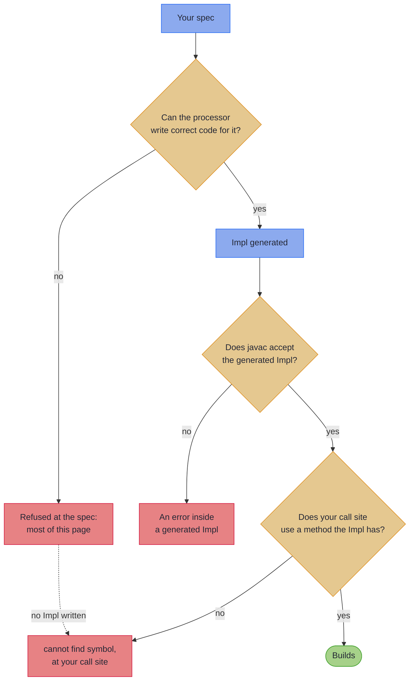

# Mapping Compiler Messages

_The refusals you are most likely to meet from the mapping processor, what each means, and the fix._

When the processor cannot write correct code for a spec, it refuses at compile time, pointing at your declaration, with a message that says what is wrong, why, and what to write. Look the message up in [Find your message](#find-your-message): each entry gives the fix and the full message in the open, with a declaration that produces it folded away. Every declaration here is compiled on each build, and the build fails if its message stops carrying the words the entry quotes. A message not listed still carries its own what, why and fix, and its rule is on [Rules and Limits](rules.md).

~~~admonish info title="Reading an entry"
- **Headings** quote the message with its names replaced: `X` and `Y` for types, `x` and `y` for components or methods, `T` for a type argument, `p` for a package. The `@GenerateMapping:` prefix is left off.
- **The words:** the *domain* is your record, the *wire* the DTO, the *spec* the `@GenerateMapping` interface, and a *leaf* a `default ValidatedPrism` method that converts one field.
- **Errors and notes:** an error stops the build; a note stops nothing. One entry is a note, and says so. The processor prints a few other notes, each saying how it read a declaration, such as a bean it maps one way only.
- **The full messages** are printed for declarations compiled in a package `com.example`.
~~~

---

## Find your message {#find-your-message}

**Seen most often**

| The message says | What it means |
|---|---|
| [`cannot find symbol … class XMappingImpl`](#no-impl-class) | The generated Impl does not exist |
| [`has no wire counterpart named`](#no-wire-counterpart) | A domain component has no same-named wire component |
| [`has no usable source`](#no-usable-source) | Types differ and nothing converts them |
| [`Add '@OptionalBridge`](#add-optional-bridge) | A domain `Optional` faces a plain wire component |
| [`leaf '…' names no component of`](#leaf-names-no-component) | A leaf's name matches no component, usually a typo |
| [`redeclares the mapping itself`](#redeclares-the-mapping) | The spec declares a mapping method, MapStruct-style |

**[Spec members](#spec-members)**

| The message says | What it means |
|---|---|
| [`has no wire counterpart named`](#no-wire-counterpart) | A domain component has no same-named wire component |
| [`has no usable source`](#no-usable-source) | Types differ and nothing converts them |
| [`leaf '…' names no component of`](#leaf-names-no-component) | A leaf's name matches no component, usually a typo |
| [`redeclares the mapping itself`](#redeclares-the-mapping) | The spec declares a mapping method, MapStruct-style |
| [`collides with the`](#collides-with-a-generated-member) | A spec method clashes with a generated one |
| [`has more components than`](#wire-has-more-components) | The wire has components nothing fills |
| [`has no domain source`](#projection-field-has-no-domain-source) | A smaller wire names a missing component |
| [`@MapField(to = …) on '…' names no component of`](#rename-names-no-component) | A rename's `to` names nothing on the wire |
| [`derived field method '…' names no component of`](#derived-field-names-no-component) | A derived field names nothing on the wire |
| [`both map to wire component`](#both-map-to-one-wire-component) | A rename targets a component already filled |
| [`targets a wire component another rename already claims`](#rename-already-claimed) | Two renames point at one wire component |
| [`is neither a rename, a leaf, nor a bridge`](#neither-rename-leaf-bridge) | An abstract method says nothing about what it is |
| [`returns a Getter but is named after a domain component`](#getter-named-after-domain) | A derived field carries a domain component's name |
| [`combines a projection with derived fields`](#projection-with-derived-fields) | A smaller wire also declares a derived field |
| [`declares type parameters of its own`](#own-type-parameters) | A leaf, rename or marker declares its own `<R>` |
| [`which cannot be reached from`](#cannot-be-reached) | A member names a type its package cannot see |

**[Optional fields](#optional-fields)**

| The message says | What it means |
|---|---|
| [`Add '@OptionalBridge`](#add-optional-bridge) | A domain `Optional` faces a plain wire component |
| [`bridges to the primitive`](#bridges-to-a-primitive) | The bridged wire component is a primitive |
| [`which is declared non-null`](#declared-non-null) | The bridged wire component is declared non-null |
| [`is declared over the whole Optional`](#bridged-leaf-over-whole-optional) | A bridged leaf is declared over the `Optional` |
| [`is redundant on a bean wire`](#redundant-on-a-bean-wire) | **Note.** A bean wire bridges without the marker |

**[Shared vocabulary](#shared-vocabulary)**

| The message says | What it means |
|---|---|
| [`is itself a mapping spec`](#mix-in-is-a-spec) | A spec extends another spec |
| [`is extended raw by`](#extended-raw) | A generic mix-in is extended without type arguments |
| [`which the spec extends raw`](#reached-through-raw) | A raw clause further up erases a generic mix-in |
| [`has conflicting renames`](#conflicting-renames) | Two mix-ins rename one component two ways |

**[Containers](#containers)**

| The message says | What it means |
|---|---|
| [`cannot name an array constructor`](#array-constructor) | A lifted array's element type is generic |
| [`never runs`](#key-leaf-never-runs) | A key leaf sits beside a whole-map leaf |
| [`names a raw Map component`](#raw-map) | A key leaf faces a raw `Map` |
| [`matches more than one mapping spec`](#more-than-one-spec) | Two specs map the same pair |
| [`has no mapping spec`](#subtype-has-no-spec) | A sealed subtype has no spec |
| [`is never produced`](#subtype-never-produced) | A sealed wire subtype has no spec producing it |
| [`is targeted by more than one domain subtype`](#subtype-targeted-twice) | Two domain subtypes map to one wire subtype |
| [`has no meaning on a sealed mapping`](#no-meaning-on-a-sealed-mapping) | A sealed spec declares a leaf or marker |

**[Flattening](#flattening)**

| The message says | What it means |
|---|---|
| [`spreads a component`](#spreads-a-shared-name) | A flattened name collides with a domain name |
| [`spreads across a bean-shaped wire`](#spreads-across-a-bean) | `@Flatten` on a bean wire |
| [`names a component of the flattened group`](#flattens-a-group-member) | `@Flatten` inside a flattened group |

**[Bean wires](#bean-wires)**

| The message says | What it means |
|---|---|
| [`does not support on the domain side`](#bean-domain) | The domain is a bean, not a record |
| [`so the mapping leaves it out`](#setter-with-no-getter) | An accessor has no partner |
| [`names no accessor`](#unmapped-names-no-accessor) | An `@Unmapped` marker names nothing left out |
| [`names a property`](#unmapped-names-a-mapped-property) | An `@Unmapped` marker names a paired property |
| [`which a build cannot fill`](#getter-only-list-build) | A getter-only `List` is raw or a wildcard |
| [`bridged to the getter-only bean property`](#bridged-to-a-getter-only-list) | A domain `Optional` faces a getter-only `List` |
| [`no property it reads is one it can write`](#reads-some-writes-others) | A bean reads some names and writes others |

**[Sparse PATCH](#sparse-patch)**

| The message says | What it means |
|---|---|
| [`extends both 'MappingSpec`](#extends-both-tiers) | One spec extends `MappingSpec` and `UpdateSpec` |
| [`is primitive and can never be absent`](#primitive-patch-property) | A PATCH property is a primitive |
| [`which a sparse UpdateSpec cannot map`](#record-patch-wire) | A PATCH wire is a record |
| [`cannot carry a sparse update's absence`](#getter-only-list-patch) | A PATCH bean has a getter-only `List` |
| [`which a sparse update cannot express`](#optional-on-a-patch) | A plain PATCH property faces a domain `Optional` |

**[Generic specs](#generic-specs)**

| The message says | What it means |
|---|---|
| [`is generic, which this mapper does not support`](#generic-bean-or-patch) | A generic spec maps a bean or a PATCH |
| [`needs a generic spec`](#abstract-leaf-needs-a-generic-spec) | A concrete spec declares a leaf with no body |

**[Merge and error envelopes](#merge-and-error-envelopes)**

| The message says | What it means |
|---|---|
| [`both carry it`](#merge-component-ambiguous) | Two merge sources carry one component |
| [`uses fallible fills but declares a plain`](#merge-plain-return) | A fallible merge declares a plain return |
| [`declares a Validated return but every fill is an identity copy`](#merge-validated-identity) | A merge of copies declares a Validated return |
| [`is not filled by any source`](#merge-unfilled) | No merge source names a target component |
| [`is a primitive`](#envelope-primitive-context) | An envelope context component is a primitive |
| [`is a class, not a record`](#envelope-variant-not-a-record) | An envelope variant is a class |
| [`which this companion does not support`](#envelope-generic) | An envelope hierarchy is generic |

**[Inside a generated Impl](#inside-a-generated-impl)**

| The message says | What it means |
|---|---|
| [`has private access in`](#private-access-in-an-impl) | A mapped type is private and nested |

**[At your call site](#at-your-call-site)**

| The message says | What it means |
|---|---|
| [`cannot find symbol … class XMappingImpl`](#no-impl-class) | The generated Impl does not exist |
| [`cannot find symbol … method asIso()`](#no-such-surface) | The tier does not offer that method |

---

## Where the message came from {#where-the-message-came-from}



Most messages come from the first branch: the processor reads your spec, finds a shape it cannot map correctly, and says so where you declared it. A refused spec writes no Impl, so every call to it also reports `cannot find symbol`; fix the refusal and those go with it. An error inside a generated `*Impl` means the processor accepted a spec it should have refused. Please [report it](https://github.com/higher-kinded-j/higher-kinded-j/issues) with the spec; the cause is usually still in the spec, and the error names it, as [the one known case](#private-access-in-an-impl) shows.

---

## Spec members {#spec-members}

### `domain field 'X.y' has no wire counterpart named 'y'` {#no-wire-counterpart}

A domain component has no wire component of the same name, and no rename points it at one.

**Fix.** Rename one side so the names match, or add a rename to the spec, such as `@MapField(to = "fullName") String name();`.

```
@GenerateMapping: domain field 'Customer.name' has no wire counterpart named 'name'. Found on
CustomerDto: [fullName]. Align the component names, or add a '@MapField(to = ...)' rename on the
spec.
```

The rule: [Renames](basics.md#renames-mapfield).

~~~admonish example title="A declaration that produces it" collapsible=true
<!-- verify:rejects "has no wire counterpart named" -->
```java
record Customer(String name) {}

record CustomerDto(String fullName) {}

@GenerateMapping
interface CustomerMapping extends MappingSpec<Customer, CustomerDto> {}
```
~~~

### `target field 'XDto.y' has no usable source` {#no-usable-source}

A wire component's type differs from its domain counterpart's, and nothing converts between them.

**Fix.** Add the method the message spells out, a `default ValidatedPrism` that parses the field: a [standard codec](codecs.md#standard-codecs) such as `StandardCodecs.uuid()`, or your own. Where one side is a primitive, the message asks for its wrapper type first. A `List` against a `Set` lands here too, because elements map only when both sides declare the same container.

```
@GenerateMapping: target field 'CustomerDto.email' has no usable source. The types differ
(java.lang.String vs com.example.EmailAddress) and no matching leaf method was found. Found on
Customer: [email]. Add 'default ValidatedPrism<java.lang.String, com.example.EmailAddress>
email()' to the spec.
```

The rule: [Validated leaves](basics.md#validated-leaves).

~~~admonish example title="A declaration that produces it" collapsible=true
<!-- verify:rejects "has no usable source" -->
```java
record Customer(EmailAddress email) {}

record CustomerDto(String email) {}

@GenerateMapping
interface CustomerMapping extends MappingSpec<Customer, CustomerDto> {}
```
~~~

### `leaf 'x' names no component of Y` {#leaf-names-no-component}

A leaf declared on the spec is named after nothing the domain has, which is usually a typo.

**Fix.** Rename it after the component it parses; the message names the nearest one when it is close. Make it `private` or `static` if it is a helper.

```
@GenerateMapping: leaf 'emial' names no component of Customer. A leaf is a zero-parameter
'default' named after the DOMAIN component it parses (or an inner component of a flattened one);
an unmatched leaf would silently validate nothing. Did you mean 'email()'? Found on Customer:
[email]. Rename the method to the component it parses, or make it 'private' or 'static' if it is
a helper.
```

The rule: [How the two `default` families are told apart](rules.md#how-the-two-default-families-are-told-apart).

~~~admonish example title="A declaration that produces it" collapsible=true
<!-- verify:rejects "A leaf is a zero-parameter" -->
```java
record Customer(EmailAddress email) {}

record CustomerDto(String email) {}

@GenerateMapping
interface CustomerMapping extends MappingSpec<Customer, CustomerDto> {
  default ValidatedPrism<String, EmailAddress> emial() {
    return EmailCodecs.EMAIL;
  }
}
```
~~~

### `abstract method 'x' redeclares the mapping itself` {#redeclares-the-mapping}

The spec declares a mapping method, as a MapStruct mapper would; here the spec declares only vocabulary, and the Impl generates the methods.

**Fix.** Delete the method, and call the generated Impl's `build` or `parse`.

```
@GenerateMapping: abstract method 'toDto' redeclares the mapping itself. The spec declares
vocabulary (renames, leaves, derived fields); the mapping methods are generated. This signature
is what the generated Impl already exposes. Delete the method and call the generated Impl:
'build(Domain) : Wire' for the outbound direction, 'parse(Wire)' for the accumulating inbound
one.
```

The rule: [Your first mapping](basics.md#your-first-mapping).

~~~admonish example title="A declaration that produces it" collapsible=true
<!-- verify:rejects "redeclares the mapping itself" -->
```java
record Customer(String name) {}

record CustomerDto(String name) {}

@GenerateMapping
interface CustomerMapping extends MappingSpec<Customer, CustomerDto> {
  CustomerDto toDto(Customer customer);
}
```
~~~

### `'build(X)' collides with the 'build' member the generated XImpl emits` {#collides-with-a-generated-member}

The spec declares a method the generated Impl also declares, so it would be overridden or break the generated file.

**Fix.** Rename the method, or remove it and rely on the generated one. To change how one component maps, declare a leaf named after it.

```
@GenerateMapping: 'build(Customer)' collides with the 'build' member the generated
CustomerMappingImpl emits for this tier (a full mapping). The generated Impl declares an
override-equivalent 'build', so this method is either silently overridden (its logic never runs
on INSTANCE) or fails the generated file's compile with a raw javac error. Rename the method, or
remove it and rely on the generated 'build'; to customise how a component maps, declare a
ValidatedPrism leaf default named after it.
```

The rule: [Validated leaves](basics.md#validated-leaves).

~~~admonish example title="A declaration that produces it" collapsible=true
<!-- verify:rejects "collides with the" -->
```java
record Customer(String name) {}

record CustomerDto(String name) {}

@GenerateMapping
interface CustomerMapping extends MappingSpec<Customer, CustomerDto> {
  default CustomerDto build(Customer customer) {
    return new CustomerDto(customer.name());
  }
}
```
~~~

### `'XDto' has more components than 'X'` {#wire-has-more-components}

The wire has components nothing on the domain fills, so `build` cannot write them.

**Fix.** Remove the extra wire components, add domain components to match, derive them with `default Getter` methods, or spread a nested domain record across them with `@Flatten`.

```
@GenerateMapping: 'CustomerDto' has more components than 'Customer'. build must fill every wire
component from a domain source or a derived field, and the extras have neither. A wire with
fewer components maps as a projection (Lens tier). Remove the extra wire components, add
matching domain components, declare derived fields ('default Getter<Customer, ComponentType>'
methods named after the extras), or spread a nested domain component across the extras with an
'@Flatten' marker named after it.
```

The rule: [Derived wire fields](basics.md#derived-wire-fields).

~~~admonish example title="A declaration that produces it" collapsible=true
<!-- verify:rejects "has more components than" -->
```java
record Customer(String name) {}

record CustomerDto(String name, String email) {}

@GenerateMapping
interface CustomerMapping extends MappingSpec<Customer, CustomerDto> {}
```
~~~

### `projection field 'XDto.y' has no domain source` {#projection-field-has-no-domain-source}

A wire with fewer components than the domain maps as a projection, and one of its components is named after nothing the domain has.

**Fix.** Align the component names, or add a `@MapField` rename.

```
@GenerateMapping: projection field 'CustomerDto.nmae' has no domain source. 'CustomerDto' is
smaller than 'Customer', so it maps as a projection: every wire component must name a domain
component. Found on Customer: [name, email]. Align the component names, or add a @MapField
rename.
```

The rule: [Renames](basics.md#renames-mapfield).

~~~admonish example title="A declaration that produces it" collapsible=true
<!-- verify:rejects "has no domain source" -->
```java
record Customer(String name, String email) {}

record CustomerDto(String nmae) {}

@GenerateMapping
interface CustomerMapping extends MappingSpec<Customer, CustomerDto> {}
```
~~~

### `@MapField(to = "y") on 'x' names no component of XDto` {#rename-names-no-component}

A rename's `to` names nothing the wire has, which is usually a typo.

**Fix.** Point `to` at an existing wire component; the message lists them.

```
@GenerateMapping: @MapField(to = "fulName") on 'name' names no component of CustomerDto. Found
on CustomerDto: [fullName]. Point 'to' at an existing wire component.
```

The rule: [Renames](basics.md#renames-mapfield).

~~~admonish example title="A declaration that produces it" collapsible=true
<!-- verify:rejects "Point 'to' at an existing wire component" -->
```java
record Customer(String name) {}

record CustomerDto(String fullName) {}

@GenerateMapping
interface CustomerMapping extends MappingSpec<Customer, CustomerDto> {
  @MapField(to = "fulName")
  String name();
}
```
~~~

### `derived field method 'x' names no component of XDto` {#derived-field-names-no-component}

A derived field is named after nothing the wire has, which is usually a typo.

**Fix.** Rename the method after the wire component it derives, or remove it.

```
@GenerateMapping: derived field method 'dispalyName' names no component of CustomerDto. A
default method returning Getter declares a derived wire field, so its name must be the wire
component build fills. Found on CustomerDto: [name, displayName]. Rename the method after the
wire component it derives, or remove it.
```

The rule: [Derived wire fields](basics.md#derived-wire-fields).

~~~admonish example title="A declaration that produces it" collapsible=true
<!-- verify:rejects "its name must be the wire component build fills" -->
```java
record Customer(String name) {}

record CustomerDto(String name, String displayName) {}

@GenerateMapping
interface CustomerMapping extends MappingSpec<Customer, CustomerDto> {
  default Getter<Customer, String> dispalyName() {
    return Getter.of(Customer::name);
  }
}
```
~~~

### `domain components 'x' and 'y' both map to wire component 'y'` {#both-map-to-one-wire-component}

A rename points at a wire component another domain component already fills by name.

**Fix.** Point the rename at a different wire component.

```
@GenerateMapping: domain components 'first' and 'name' both map to wire component 'name'. Each
wire component takes exactly one domain source; a @MapField rename may not collide with another
component's mapping. Point the rename at a distinct wire component.
```

The rule: [Renames](basics.md#renames-mapfield).

~~~admonish example title="A declaration that produces it" collapsible=true
<!-- verify:rejects "both map to wire component" -->
```java
record Person(String first, String name) {}

record PersonDto(String name, String other) {}

@GenerateMapping
interface PersonMapping extends MappingSpec<Person, PersonDto> {
  @MapField(to = "name")
  String first();
}
```
~~~

### `@MapField(to = "y") on 'x' targets a wire component another rename already claims` {#rename-already-claimed}

Two renames point at one wire component, and each wire component takes exactly one source.

**Fix.** Point each rename at a different wire component.

```
@GenerateMapping: @MapField(to = "name") on 'last' targets a wire component another rename
already claims. Each wire component takes exactly one domain source. Point each rename at a
distinct wire component.
```

The rule: [Renames](basics.md#renames-mapfield).

~~~admonish example title="A declaration that produces it" collapsible=true
<!-- verify:rejects "targets a wire component another rename already claims" -->
```java
record Person(String first, String last) {}

record PersonDto(String name) {}

@GenerateMapping
interface PersonMapping extends MappingSpec<Person, PersonDto> {
  @MapField(to = "name")
  String first();

  @MapField(to = "name")
  String last();
}
```
~~~

### `abstract method 'x' is neither a rename, a leaf, nor a bridge` {#neither-rename-leaf-bridge}

An abstract method on the spec carries nothing that says what it declares, so the generated Impl cannot implement it.

**Fix.** Give it a `default` body, make it a `@MapField` rename, or mark it `@OptionalBridge`.

```
@GenerateMapping: abstract method 'displayName' is neither a rename, a leaf, nor a bridge. A
spec declares zero-parameter @MapField renames, @OptionalBridge markers and 'default' leaf
methods; the generated Impl cannot implement anything else. Make it a 'default' method, turn it
into a '@MapField(to = ...)' rename, or annotate it '@OptionalBridge' if it names an Optional
component that bridges to a nullable wire one.
```

The rule: [Renames](basics.md#renames-mapfield).

~~~admonish example title="A declaration that produces it" collapsible=true
<!-- verify:rejects "is neither a rename, a leaf, nor a bridge" -->
```java
record Customer(String name) {}

record CustomerDto(String name) {}

@GenerateMapping
interface CustomerMapping extends MappingSpec<Customer, CustomerDto> {
  String displayName();
}
```
~~~

### `default method 'x' returns a Getter but is named after a domain component` {#getter-named-after-domain}

A derived field carries the name of a domain component, where the processor expects a leaf.

**Fix.** Name it after the wire-only component it derives, or return a `ValidatedPrism` to make it a leaf.

```
@GenerateMapping: default method 'name' returns a Getter but is named after a domain component.
The name decides what a default method declares: a leaf is named after a DOMAIN component and
returns ValidatedPrism<WireComponent, DomainComponent>; a derived wire field is named after a
wire component with NO domain counterpart and returns Getter<Customer, WireComponentType>. Named
'name', this method reads as a leaf, but a leaf never returns Getter. Return a ValidatedPrism to
make it a leaf, or rename the method after the wire-only component it derives.
```

The rule: [How the two `default` families are told apart](rules.md#how-the-two-default-families-are-told-apart).

~~~admonish example title="A declaration that produces it" collapsible=true
<!-- verify:rejects "returns a Getter but is named after a domain component" -->
```java
record Customer(String name) {}

record CustomerDto(String name) {}

@GenerateMapping
interface CustomerMapping extends MappingSpec<Customer, CustomerDto> {
  default Getter<Customer, String> name() {
    return Getter.of(customer -> customer.name().toUpperCase(Locale.ROOT));
  }
}
```
~~~

### `'XDto' combines a projection with derived fields` {#projection-with-derived-fields}

A wire with fewer components than the domain (a projection) also declares a derived field, and the write-back could never keep a value `build` recomputes.

**Fix.** Drop the derived field and map the smaller wire as a plain projection, or give the wire every domain component.

```
@GenerateMapping: 'BadgeDto' combines a projection with derived fields. Setting the derived
fields [label] aside, 'BadgeDto' has fewer components than 'Employee', which is the projection
shape. The projection write-back (asLens or patch) writes wire values back into the domain, but
build recomputes a derived component, so the write-back could never honour the value being set.
Remove the derived methods and map the smaller wire as a plain projection, or add wire
components until every domain component keeps a counterpart.
```

The rule: [Derived fields and the emission tiers](rules.md#derived-fields-and-the-emission-tiers).

~~~admonish example title="A declaration that produces it" collapsible=true
<!-- verify:rejects "combines a projection with derived fields" -->
```java
record Employee(String name, String dept, int age) {}

record BadgeDto(String name, String label) {}

@GenerateMapping
interface BadgeMapping extends MappingSpec<Employee, BadgeDto> {
  default Getter<Employee, String> label() {
    return Getter.of(employee -> employee.name() + " (" + employee.dept() + ")");
  }
}
```
~~~

### `abstract method 'x' declares type parameters of its own` {#own-type-parameters}

An abstract leaf, rename or marker declares its own `<R>`, which the generated Impl has nowhere to declare.

**Fix.** Give the method a concrete type. Element types belong on the spec's own type parameters.

```
@GenerateMapping: abstract method 'items' declares type parameters of its own. The generated
Impl carries a leaf as a constructor-supplied field and a rename as a stub, and neither has
anywhere to declare the method's own type parameters, so the generated file would name a
variable nothing brings into scope. Give 'items' a concrete return type; a marker method
declares a correspondence and the generated stub only has to name one.
```

The rule: [The boundaries of a generic spec](rules.md#generic-boundaries).

~~~admonish example title="A declaration that produces it" collapsible=true
<!-- verify:rejects "declares type parameters of its own" -->
```java
record Page(List<String> items) {}

record PageDto(List<String> entries) {}

@GenerateMapping
interface PageMapping extends MappingSpec<Page, PageDto> {
  @MapField(to = "entries")
  <R> List<R> items();
}
```
~~~

### `@MapField method 'x' names 'T', which cannot be reached from 'p'` {#cannot-be-reached}

A member names a type the spec's package cannot see, and the Impl is generated in that package.

**Fix.** Make the type, and the types enclosing it, `public`, or declare the spec in the package they are visible from.

```
@GenerateMapping: @MapField method 'sku' names 'Sku', which cannot be reached from
'com.example'. The generated Impl writes the member's type out in full, so every type named
inside it has to be visible in the spec's package, where the Impl is declared. Make 'Sku' and
the types enclosing it public, or declare the spec in the package they are already visible from.
```

The rule: [A member's type must be visible from the spec's package](rules.md#how-the-two-default-families-are-told-apart).

~~~admonish example title="A declaration that produces it" collapsible=true
<!-- verify:rejects "which cannot be reached from" -->
```java
class Shop {
  private record Sku(String value) {}

  record Item(Sku sku) {}

  record ItemDto(Sku code) {}

  @GenerateMapping
  interface ItemMapping extends MappingSpec<Item, ItemDto> {
    @MapField(to = "code")
    Sku sku();
  }
}
```
~~~

---

## Optional fields {#optional-fields}

### `... has no usable source ... Add '@OptionalBridge ...' to the spec` {#add-optional-bridge}

A domain `Optional` faces a plain wire component, and the spec has not said that `null` means *absent*.

**Fix.** Add the `@OptionalBridge` marker the message spells out. The whole-`Optional` leaf it offers second also compiles, but reports a `null` as a field error instead of reading it as empty.

```
@GenerateMapping: target field 'ReaderDto.nickname' has no usable source. The types differ
(java.lang.String vs java.util.Optional<java.lang.String>) and no matching leaf method was
found. Found on Reader: [name, nickname]. Add '@OptionalBridge
java.util.Optional<java.lang.String> nickname();' to the spec, so an absent value reads as a
null wire component and back. Add 'default ValidatedPrism<java.lang.String,
java.util.Optional<java.lang.String>> nickname()' to the spec.
```

The rule: [Optional fields: `@OptionalBridge`](absence.md#optional-bridge).

~~~admonish example title="A declaration that produces it" collapsible=true
<!-- verify:rejects "Add '@OptionalBridge" -->
```java
record Reader(String name, Optional<String> nickname) {}

record ReaderDto(String name, String nickname) {}

@GenerateMapping
interface ReaderMapping extends MappingSpec<Reader, ReaderDto> {}
```
~~~

### `@OptionalBridge on 'x' bridges to the primitive record component 'x'` {#bridges-to-a-primitive}

The bridged wire component is a primitive, which cannot hold the `null` an empty `Optional` becomes.

**Fix.** Declare the wire component as the wrapper type, `Integer` for an `int`.

```
@GenerateMapping: @OptionalBridge on 'age' bridges to the primitive record component 'age'. The
bridge encodes an empty Optional as null, and the record component is declared int, which can
never be null. Declare 'age' on 'ReaderDto' as java.lang.Integer.
```

The rule: [A bridged component must take `null`](rules.md#bridged-component-nullable).

~~~admonish example title="A declaration that produces it" collapsible=true
<!-- verify:rejects "bridges to the primitive" -->
```java
record Reader(String name, Optional<Integer> age) {}

record ReaderDto(String name, int age) {}

@GenerateMapping
interface ReaderMapping extends MappingSpec<Reader, ReaderDto> {
  @OptionalBridge
  Optional<Integer> age();
}
```
~~~

### `domain field 'X.y' is Optional<T>, bridged to the record component 'XDto.y', which is declared non-null` {#declared-non-null}

The bridged wire component is declared non-null, by an annotation or by a JSpecify `@NullMarked` scope.

**Fix.** Mark it `@Nullable`, since it carries absence. Otherwise drop the `Optional`, or encode absence in a leaf over the whole `Optional`.

```
@GenerateMapping: domain field 'Reader.nickname' is Optional<String>, bridged to the record
component 'ReaderDto.nickname', which is declared non-null. The bridge writes an empty Optional
as null, and 'ReaderDto.nickname' is annotated @NonNull, so build would write the null its
declaration rules out, and either throw or leave a null its type says it cannot hold. Replace
@NonNull on 'ReaderDto.nickname' with @Nullable, since it carries absence; or declare
'Reader.nickname' as String, dropping the Optional and its @OptionalBridge marker; or add
'default ValidatedPrism<java.lang.String, java.util.Optional<java.lang.String>> nickname()' to
the spec in place of the marker, a leaf over the whole Optional that encodes absence the way the
wire does.
```

The rule: [A bridged component must take `null`](rules.md#bridged-component-nullable).

~~~admonish example title="A declaration that produces it" collapsible=true
<!-- verify:rejects "which is declared non-null" -->
```java
record Reader(String name, Optional<String> nickname) {}

record ReaderDto(String name, @NonNull String nickname) {}

@GenerateMapping
interface ReaderMapping extends MappingSpec<Reader, ReaderDto> {
  @OptionalBridge
  Optional<String> nickname();
}
```
~~~

### `@OptionalBridge leaf 'x' is declared over the whole Optional` {#bridged-leaf-over-whole-optional}

A bridged leaf converts the element the bridge found, but this one is declared over the `Optional` itself.

**Fix.** Declare the leaf over the element types, or drop `@OptionalBridge` to keep a leaf over the whole `Optional`.

```
@GenerateMapping: @OptionalBridge leaf 'email' is declared over the whole Optional. A bridged
leaf converts the element the bridge found, so it is declared over the element types; declared
over java.util.Optional<com.example.EmailAddress> it is an ordinary whole-component leaf, which
parses a null wire value to a located 'must not be null' rather than to an empty Optional.
Declare the leaf as 'ValidatedPrism<java.lang.String, com.example.EmailAddress>', or drop the
annotation to keep the whole-Optional leaf.
```

The rule: [Optional fields: `@OptionalBridge`](absence.md#optional-bridge).

~~~admonish example title="A declaration that produces it" collapsible=true
<!-- verify:rejects "is declared over the whole Optional" -->
```java
record Reader(String name, Optional<EmailAddress> email) {}

record ReaderDto(String name, String email) {}

@GenerateMapping
interface ReaderMapping extends MappingSpec<Reader, ReaderDto> {
  @OptionalBridge
  default ValidatedPrism<String, Optional<EmailAddress>> email() {
    return EmailCodecs.OPTIONAL_EMAIL;
  }
}
```
~~~

### `@OptionalBridge on 'x' is redundant on a bean wire` (a note) {#redundant-on-a-bean-wire}

A bean wire bridges a domain `Optional` without the marker, so the annotation changes nothing.

**Fix.** Remove it. A marker that a record-wire sibling also needs belongs on a shared mix-in, where it draws no note.

```
@GenerateMapping: @OptionalBridge on 'nickname' is redundant on a bean wire. A bean wire bridges
a domain Optional to its nullable property automatically, because bean conventions leave
Optional off property types; the annotation opts a RECORD wire into the same correspondence.
Remove the annotation, or keep it if the vocabulary is shared with a record-wire spec.
```

The rule: [Optional fields: `@OptionalBridge`](absence.md#optional-bridge).

~~~admonish example title="A declaration that produces it" collapsible=true
<!-- verify:reports "is redundant on a bean wire" -->
```java
record Guest(String name, Optional<String> nickname) {}

class GuestBean {
  private String name;
  private String nickname;

  public String getName() { return name; }
  public void setName(String name) { this.name = name; }
  public String getNickname() { return nickname; }
  public void setNickname(String nickname) { this.nickname = nickname; }
}

@GenerateMapping
interface GuestMapping extends MappingSpec<Guest, GuestBean> {
  @OptionalBridge
  Optional<String> nickname();
}
```
~~~

---

## Shared vocabulary {#shared-vocabulary}

### `mix-in 'X' is itself a mapping spec` {#mix-in-is-a-spec}

A spec extends another spec as if it were a vocabulary; a spec generates an Impl, a mix-in only shares members.

**Fix.** Move the shared renames and leaves onto a plain interface, and extend that instead.

```
@GenerateMapping: mix-in 'SupplierMapping' is itself a mapping spec. A mix-in shares vocabulary
(renames, leaves, derived fields); a mapping spec generates an Impl of its own, and inheriting
one spec from another would conflate the two. Move the shared renames and leaves onto a plain
interface and extend that instead.
```

The rule: [Mix-in shapes the processor refuses](rules.md#refused-mix-in-shapes).

~~~admonish example title="A declaration that produces it" collapsible=true
<!-- verify:rejects "is itself a mapping spec" -->
```java
record Customer(String name) {}

record CustomerDto(String name) {}

record Supplier(String name) {}

record SupplierDto(String name) {}

@GenerateMapping
interface SupplierMapping extends MappingSpec<Supplier, SupplierDto> {}

@GenerateMapping
interface CustomerMapping extends MappingSpec<Customer, CustomerDto>, SupplierMapping {}
```
~~~

### `mix-in 'X' is extended raw by the spec` {#extended-raw}

A generic mix-in is extended without its type arguments, so every member it contributes arrives erased.

**Fix.** Name the type arguments where the mix-in is extended, as `extends Renames<String>`.

```
@GenerateMapping: mix-in 'Renames' is extended raw by the spec. Its members are read under the
spec's instantiation, and a raw supertype erases every one of them whatever they declare: a
'ValidatedPrism<String, Email>' arrives bare, and a 'T' arrives as Object. Name the type
arguments where the spec extends 'Renames', as 'extends Renames<...>'.
```

The rule: [A generic mix-in reached raw](rules.md#a-generic-mix-in-reached-raw).

~~~admonish example title="A declaration that produces it" collapsible=true
<!-- verify:rejects "is extended raw by" -->
```java
interface Renames<T> {
  @MapField(to = "fullName")
  T name();
}

record Customer(String name) {}

record CustomerDto(String fullName) {}

@SuppressWarnings("rawtypes")
@GenerateMapping
interface CustomerMapping extends MappingSpec<Customer, CustomerDto>, Renames {}
```
~~~

### `mix-in 'X' is reached through 'Y', which the spec extends raw` {#reached-through-raw}

A generic mix-in sits behind an interface the spec extends raw, and the erasure reaches every member below it.

**Fix.** Name the type arguments on the clause the message names, as `extends Middle<String>`: that is the line to edit, not the mix-in whose members went missing.

```
@GenerateMapping: mix-in 'Renames' is reached through 'Middle', which the spec extends raw. Its
members are read under the spec's instantiation, and a raw supertype erases every one of them
whatever they declare: a 'ValidatedPrism<String, Email>' arrives bare, and a 'T' arrives as
Object. Name the type arguments where the spec extends 'Middle', as 'extends Middle<...>'.
```

The rule: [A generic mix-in reached raw](rules.md#a-generic-mix-in-reached-raw).

~~~admonish example title="A declaration that produces it" collapsible=true
<!-- verify:rejects "extends raw" -->
```java
interface Renames<T> {
  @MapField(to = "fullName")
  T name();
}

interface Middle<T> extends Renames<T> {}

record Customer(String name) {}

record CustomerDto(String fullName) {}

@SuppressWarnings("rawtypes")
@GenerateMapping
interface CustomerMapping extends MappingSpec<Customer, CustomerDto>, Middle {}
```
~~~

### `component 'x' has conflicting renames` {#conflicting-renames}

Two mix-ins rename the same component to different wire components, and neither overrides the other.

**Fix.** Declare the rename on the spec itself, which overrides both, or align the mix-ins on one target.

```
@GenerateMapping: component 'name' has conflicting renames. 'name' is renamed to 'fullName'
(inherited from 'BillingNames') and to 'displayName' (inherited from 'DisplayNames'); neither
declaration overrides the other, so there is no winner. Override the rename on the spec itself,
or align the mix-ins on one target.
```

The rule: [Inheriting one member twice](rules.md#inheriting-one-member-twice).

~~~admonish example title="A declaration that produces it" collapsible=true
<!-- verify:rejects "has conflicting renames" -->
```java
interface BillingNames {
  @MapField(to = "fullName")
  String name();
}

interface DisplayNames {
  @MapField(to = "displayName")
  String name();
}

record Customer(String name, String nickname) {}

record CustomerDto(String fullName, String displayName) {}

@GenerateMapping
interface CustomerMapping
    extends MappingSpec<Customer, CustomerDto>, BillingNames, DisplayNames {}
```
~~~

---

## Containers {#containers}

### `field 'x' is an array whose element type T cannot name an array constructor` {#array-constructor}

Lifting an array builds a new one, and Java cannot create an array of a type variable or a parameterised type.

**Fix.** Declare the component as a `List` on both sides, or map the arrays whole with the leaf the message spells out.

```
@GenerateMapping: field 'rows' is an array whose element type java.util.List<com.example.Tag>
cannot name an array constructor. Lifting an array builds a new array of the element type, and
Java forbids creating an array of a type variable or of a parameterised type, so the generated
'java.util.List<com.example.Tag>[]::new' would not compile. Declare the component as a List on
both sides, which lifts the same way and needs no array creation, or map the arrays whole with
the leaf 'default ValidatedPrism<java.util.List<com.example.TagDto>[],
java.util.List<com.example.Tag>[]> rows()' over the array types.
```

The rule: [What lifts, and what does not](rules.md#what-lifts).

~~~admonish example title="A declaration that produces it" collapsible=true
<!-- verify:rejects "cannot name an array constructor" -->
```java
record Tag(String value) {}

record TagDto(String value) {}

@GenerateMapping
interface TagMapping extends MappingSpec<Tag, TagDto> {}

record Board(List<Tag>[] rows) {}

record BoardDto(List<TagDto>[] rows) {}

@GenerateMapping
interface BoardMapping extends MappingSpec<Board, BoardDto> {}
```
~~~

### `@MapKey("x") leaf 'xKey()' never runs` {#key-leaf-never-runs}

A key leaf sits beside a leaf over the whole `Map`, which is tried first, so the key leaf would never convert anything.

**Fix.** Follow the message: drop the whole-map leaf (the values then copy, where their types match, or take the value leaf it offers), or drop the key leaf to keep converting the map whole.

```
@GenerateMapping: @MapKey("labels") leaf 'labelKeys()' never runs: 'labels()' is a leaf over the
whole component 'labels'. A whole-component leaf is tried before a Map's key and value leaves.
Remove 'labels()', so the keys convert through 'labelKeys()' and the values copy, or remove
'labelKeys()' to keep converting 'labels' whole.
```

The rule: [A key leaf beside a whole-map leaf](rules.md#key-leaf-beside-a-whole-map-leaf).

~~~admonish example title="A declaration that produces it" collapsible=true
<!-- verify:rejects "never runs" -->
```java
record Catalogue(Map<Locale, String> labels) {}

record CatalogueDto(Map<String, String> labels) {}

@GenerateMapping
interface CatalogueMapping extends MappingSpec<Catalogue, CatalogueDto> {
  default ValidatedPrism<Map<String, String>, Map<Locale, String>> labels() {
    return LabelCodecs.LABELS;
  }

  @MapKey("labels")
  default ValidatedPrism<String, Locale> labelKeys() {
    return StandardCodecs.locale();
  }
}
```
~~~

### `@MapKey("x") names a raw Map component` {#raw-map}

A key leaf converts the key type, and a raw `Map` declares none.

**Fix.** Declare both type arguments on the component, such as `Map<Locale, String>`.

```
@GenerateMapping: @MapKey("labels") names a raw Map component. A key leaf converts the key type,
and a raw Map declares none. Declare both type arguments, for example Map<Locale, String>.
```

The rule: [What lifts, and what does not](rules.md#what-lifts).

~~~admonish example title="A declaration that produces it" collapsible=true
<!-- verify:rejects "names a raw Map component" -->
```java
@SuppressWarnings("rawtypes")
record Catalogue(Map labels) {}

@SuppressWarnings("rawtypes")
record CatalogueDto(Map labels) {}

@GenerateMapping
interface CatalogueMapping extends MappingSpec<Catalogue, CatalogueDto> {
  @MapKey("labels")
  default ValidatedPrism<String, Locale> labelKeys() {
    return StandardCodecs.locale();
  }
}
```
~~~

### `field 'x' matches more than one mapping spec` {#more-than-one-spec}

Two specs map the same pair, so a component of that pair has no single spec to nest through.

**Fix.** Remove the duplicate spec, or add the leaf the message spells out, delegating to the spec you mean.

```
@GenerateMapping: field 'customer' matches more than one mapping spec: [CustomerMapping,
LegacyCustomerMapping]. A nested component resolves to the single spec mapping
(com.example.Customer, com.example.CustomerDto); with several, the choice would be arbitrary.
Add the leaf 'default ValidatedPrism<com.example.CustomerDto, com.example.Customer> customer()'
delegating to the spec you want, or remove the duplicate spec.
```

The rule: [How a dependency's specs are found](rules.md#how-a-dependencys-specs-are-found).

~~~admonish example title="A declaration that produces it" collapsible=true
<!-- verify:rejects "matches more than one mapping spec" -->
```java
record Customer(String name) {}

record CustomerDto(String name) {}

@GenerateMapping
interface CustomerMapping extends MappingSpec<Customer, CustomerDto> {}

@GenerateMapping
interface LegacyCustomerMapping extends MappingSpec<Customer, CustomerDto> {}

record Invoice(Customer customer) {}

record InvoiceDto(CustomerDto customer) {}

@GenerateMapping
interface InvoiceMapping extends MappingSpec<Invoice, InvoiceDto> {}
```
~~~

### `permitted subtype 'X' of 'Y' has no mapping spec` {#subtype-has-no-spec}

A sealed pair has a domain subtype that no spec maps, so the generated switch would miss a case.

**Fix.** Declare a spec for the subtype pair, in this module or in a dependency compiled with `hkj-processor`.

```
@GenerateMapping: permitted subtype 'com.example.Bank' of 'Payment' has no mapping spec. Sealed
dispatch delegates each domain subtype to the one spec mapping it to a permitted subtype of
PaymentDto. Declare a @GenerateMapping spec for 'com.example.Bank', here or in a dependency
compiled with hkj-processor on its processor path.
```

The rule: [Sealed hierarchies](structure.md#sealed-hierarchies).

~~~admonish example title="A declaration that produces it" collapsible=true
<!-- verify:rejects "has no mapping spec" -->
```java
sealed interface Payment permits Card, Bank {}

record Card(String number) implements Payment {}

record Bank(String iban) implements Payment {}

sealed interface PaymentDto permits CardDto, BankDto {}

record CardDto(String number) implements PaymentDto {}

record BankDto(String iban) implements PaymentDto {}

@GenerateMapping
interface CardMapping extends MappingSpec<Card, CardDto> {}

@GenerateMapping
interface PaymentMapping extends MappingSpec<Payment, PaymentDto> {}
```
~~~

### `permitted subtype 'X' of 'Y' is never produced` {#subtype-never-produced}

A sealed wire has a subtype that no spec maps a domain subtype to, so `parse` would have nowhere to send it.

**Fix.** Add a domain subtype and a spec mapping it to the wire subtype, or remove the wire subtype from the sealed interface.

```
@GenerateMapping: permitted subtype 'com.example.CashDto' of 'PaymentDto' is never produced.
parse must dispatch every wire subtype back to a domain subtype; this one has no mapping spec
from any. Add a domain subtype and spec for it, or remove it from the sealed wire interface.
```

The rule: [Sealed hierarchies](structure.md#sealed-hierarchies).

~~~admonish example title="A declaration that produces it" collapsible=true
<!-- verify:rejects "is never produced" -->
```java
sealed interface Payment permits Card, Bank {}

record Card(String number) implements Payment {}

record Bank(String iban) implements Payment {}

sealed interface PaymentDto permits CardDto, BankDto, CashDto {}

record CardDto(String number) implements PaymentDto {}

record BankDto(String iban) implements PaymentDto {}

record CashDto(String currency) implements PaymentDto {}

@GenerateMapping
interface CardMapping extends MappingSpec<Card, CardDto> {}

@GenerateMapping
interface BankMapping extends MappingSpec<Bank, BankDto> {}

@GenerateMapping
interface PaymentMapping extends MappingSpec<Payment, PaymentDto> {}
```
~~~

### `permitted subtype 'X' of 'Y' is targeted by more than one domain subtype` {#subtype-targeted-twice}

Two domain subtypes map to one wire subtype, so `parse` could not tell which to build.

**Fix.** Give each domain subtype its own wire subtype.

```
@GenerateMapping: permitted subtype 'com.example.CardDto' of 'PaymentDto' is targeted by more
than one domain subtype. parse dispatches on the wire subtype; two sources would make the
reverse direction ambiguous. Give each domain subtype its own wire subtype.
```

The rule: [Sealed hierarchies](structure.md#sealed-hierarchies).

~~~admonish example title="A declaration that produces it" collapsible=true
<!-- verify:rejects "is targeted by more than one domain subtype" -->
```java
sealed interface Payment permits Card, GiftCard {}

record Card(String number) implements Payment {}

record GiftCard(String number) implements Payment {}

sealed interface PaymentDto permits CardDto {}

record CardDto(String number) implements PaymentDto {}

@GenerateMapping
interface CardMapping extends MappingSpec<Card, CardDto> {}

@GenerateMapping
interface GiftCardMapping extends MappingSpec<GiftCard, CardDto> {}

@GenerateMapping
interface PaymentMapping extends MappingSpec<Payment, PaymentDto> {}
```
~~~

### `leaf 'x' has no meaning on a sealed mapping` {#no-meaning-on-a-sealed-mapping}

A sealed spec declares a leaf, derived field, rename or marker, but a dispatch has no components to bind it to.

**Fix.** Move the method onto the spec of the subtype pair it belongs to.

```
@GenerateMapping: leaf 'address' has no meaning on a sealed mapping. Leaves, derived fields,
bridges, key leaves and unmapped accessors bind to the components and accessors of one pair; a
sealed mapping dispatches over its permitted subtypes and has neither. Move the method onto the
subtype pair's own spec.
```

The rule: [Spec members on a sealed mapping](rules.md#how-the-two-default-families-are-told-apart).

~~~admonish example title="A declaration that produces it" collapsible=true
<!-- verify:rejects "has no meaning on a sealed mapping" -->
```java
sealed interface Contact permits Email {}

record Email(EmailAddress address) implements Contact {}

sealed interface ContactDto permits EmailDto {}

record EmailDto(String address) implements ContactDto {}

@GenerateMapping
interface EmailMapping extends MappingSpec<Email, EmailDto> {
  default ValidatedPrism<String, EmailAddress> address() {
    return EmailCodecs.EMAIL;
  }
}

@GenerateMapping
interface ContactMapping extends MappingSpec<Contact, ContactDto> {
  default ValidatedPrism<String, EmailAddress> address() {
    return EmailCodecs.EMAIL;
  }
}
```
~~~

---

## Flattening {#flattening}

### `@Flatten on 'x' spreads a component 'y' that 'Z' also has` {#spreads-a-shared-name}

A flattened record has a component named like one of the domain's own, so both would claim the same wire component.

**Fix.** Rename one of the two record components.

```
@GenerateMapping: @Flatten on 'address' spreads a component 'city' that 'Customer' also has.
Every wire component takes exactly one source, and a flattened group's components are sourced by
name, so a name shared with the domain or with another group would claim one wire component
twice. Rename one of the two record components: every wire component takes one source, and both
would claim the same one.
```

The rule: [Names in a flattened group](rules.md#names-in-a-flattened-group).

~~~admonish example title="A declaration that produces it" collapsible=true
<!-- verify:rejects "spreads a component" -->
```java
record Address(String street, String city) {}

record Customer(String name, String city, Address address) {}

record CustomerDto(String name, String city, String street) {}

@GenerateMapping
interface CustomerMapping extends MappingSpec<Customer, CustomerDto> {
  @Flatten
  Address address();
}
```
~~~

### `@Flatten on 'x' spreads across a bean-shaped wire (not supported yet)` {#spreads-across-a-bean}

A flattened group is read from and written to record components, and this wire is a bean.

**Fix.** Map the pair with a record wire.

```
@GenerateMapping: @Flatten on 'address' spreads across a bean-shaped wire (not supported yet). A
flattened group is read from and written to record components; a bean's getters and setters are
not wired through it. Map the pair with a record wire.
```

The rule: [Where a flattened component can appear](rules.md#where-flattening-applies).

~~~admonish example title="A declaration that produces it" collapsible=true
<!-- verify:rejects "spreads across a bean-shaped wire" -->
```java
record Address(String street, String city) {}

record Customer(String name, Address address) {}

class CustomerBean {
  private String name;
  private String street;
  private String city;

  public String getName() { return name; }
  public void setName(String name) { this.name = name; }
  public String getStreet() { return street; }
  public void setStreet(String street) { this.street = street; }
  public String getCity() { return city; }
  public void setCity(String city) { this.city = city; }
}

@GenerateMapping
interface CustomerMapping extends MappingSpec<Customer, CustomerBean> {
  @Flatten
  Address address();
}
```
~~~

### `@Flatten on 'x' names a component of the flattened group 'y' (not supported yet)` {#flattens-a-group-member}

A second marker tries to spread a record that sits inside a group already spread, and spreading is one level deep.

**Fix.** Give the inner pair a spec of its own, against a nested wire component, or move the inner record's components into `Address` itself.

```
@GenerateMapping: @Flatten on 'geo' names a component of the flattened group 'address' (not
supported yet). Spreading is one level deep: a record inside a flattened group maps through its
own @GenerateMapping spec against a nested wire component. Give the inner pair its own spec, or
flatten 'geo' into Address itself.
```

The rule: [Where a flattened component can appear](rules.md#where-flattening-applies).

~~~admonish example title="A declaration that produces it" collapsible=true
<!-- verify:rejects "names a component of the flattened group" -->
```java
record Geo(String lat) {}

record Address(String street, Geo geo) {}

record Customer(String name, Address address) {}

record CustomerDto(String name, String street, String lat) {}

@GenerateMapping
interface CustomerMapping extends MappingSpec<Customer, CustomerDto> {
  @Flatten
  Address address();

  @Flatten
  Geo geo();
}
```
~~~

---

## Bean wires {#bean-wires}

### `the domain type argument 'X' is a bean-shaped class, which this mapper does not support on the domain side` {#bean-domain}

The domain is a bean, but `parse` builds the domain through a record's canonical constructor.

**Fix.** Make the domain a record, or a sealed interface of records, and map the bean as the wire.

```
@GenerateMapping: the domain type argument 'com.example.Customer' is a bean-shaped class, which
this mapper does not support on the domain side. parse assembles the domain through its
canonical constructor, so the domain must be a record (or a sealed interface of records); only
the wire may be bean-shaped. Use a record or sealed interface for the domain, mapping the bean
as the wire instead.
```

The rule: [How a bean is read and written](rules.md#how-a-bean-is-read-and-written).

~~~admonish example title="A declaration that produces it" collapsible=true
<!-- verify:rejects "does not support on the domain side" -->
```java
class Customer {
  private String name;

  public String getName() { return name; }
  public void setName(String name) { this.name = name; }
}

record CustomerDto(String name) {}

@GenerateMapping
interface CustomerMapping extends MappingSpec<Customer, CustomerDto> {}
```
~~~

### `bean property 'x' on 'Y' has a setter but no getter, or a getter but no setter, so the mapping leaves it out` {#setter-with-no-getter}

An accessor has no partner, and leaving it out would drop a domain component, or on a PATCH bean ignore a value the client sends.

**Fix.** Add the missing accessor, or correct the misspelt one the message names. An accessor meant to stay out takes an `@Unmapped` marker.

```
@GenerateMapping: bean property 'email' on 'CustomerBean' has a setter, setEmail(String), but no
getter, so the mapping leaves it out. A mapping carries only the properties a bean both reads
and writes, so 'Customer.email' would go unmapped without a word: build would never write it.
Add String getEmail() to 'CustomerBean'. Or, if getEmial() is meant to read 'email', rename it
getEmail().
```

The rule: [When an unpaired accessor is refused](rules.md#unpaired-accessors).

~~~admonish example title="A declaration that produces it" collapsible=true
<!-- verify:rejects "so the mapping leaves it out" -->
```java
record Customer(String name, String email) {}

class CustomerBean {
  private String name;
  private String email;

  public String getName() { return name; }
  public void setName(String name) { this.name = name; }
  public String getEmial() { return email; }
  public void setEmail(String email) { this.email = email; }
}

@GenerateMapping
interface CustomerMapping extends MappingSpec<Customer, CustomerBean> {}
```
~~~

### `@Unmapped method 'x' names no accessor 'Y' leaves out` {#unmapped-names-no-accessor}

An `@Unmapped` marker names something the bean does not leave unpaired, which is usually a misspelling.

**Fix.** Name the marker after the property of the accessor meant to stay out, which the message lists, or remove it.

```
@GenerateMapping: @Unmapped method 'ident' names no accessor 'CustomerBean' leaves out. The
marker reads an accessor with no partner as deliberate. Left unpaired on 'CustomerBean': [id].
Name the marker after the accessor's property, or remove it.
```

The rule: [Accessors meant to stay out](beans.md#accessors-meant-to-stay-out).

~~~admonish example title="A declaration that produces it" collapsible=true
<!-- verify:rejects "names no accessor" -->
```java
record Customer(String name) {}

class CustomerBean {
  private String name;
  private String id;

  public String getName() { return name; }
  public void setName(String name) { this.name = name; }
  public String getId() { return id; }
}

@GenerateMapping
interface CustomerMapping extends MappingSpec<Customer, CustomerBean> {
  @Unmapped
  String ident();
}
```
~~~

### `@Unmapped method 'x' names a property 'Y' maps` {#unmapped-names-a-mapped-property}

An `@Unmapped` marker names a property the bean both reads and writes, so the mapping carries it anyway.

**Fix.** Remove the marker. To leave the property out, remove one of its accessors.

```
@GenerateMapping: @Unmapped method 'id' names a property 'CustomerBean' maps. The marker reads
an accessor with no partner as deliberate, and 'id' is read and written, so the mapping carries
it like any other property. Remove the marker; to leave the property out of the mapping, remove
one of its accessors from 'CustomerBean'.
```

The rule: [Accessors meant to stay out](beans.md#accessors-meant-to-stay-out).

~~~admonish example title="A declaration that produces it" collapsible=true
<!-- verify:rejects "names a property" -->
```java
record Customer(String name) {}

class CustomerBean {
  private String name;
  private String id;

  public String getName() { return name; }
  public void setName(String name) { this.name = name; }
  public String getId() { return id; }
  public void setId(String id) { this.id = id; }
}

@GenerateMapping
interface CustomerMapping extends MappingSpec<Customer, CustomerBean> {
  @Unmapped
  String id();
}
```
~~~

### `bean property 'x' on 'Y' is a getter-only List, which a build cannot fill (not supported yet)` {#getter-only-list-build}

A getter-only `List` is raw or has a wildcard, so the generated `addAll` that fills it cannot be written.

**Fix.** Declare the list's element type on the getter, or give the property a setter.

```
@GenerateMapping: bean property 'items' on 'OrderBean' is a getter-only List, which a build
cannot fill (not supported yet). A getter-only List is filled by the JAXB convention,
getItems().addAll(...), and addAll needs an element type it can name: a raw List names none, so
the call is unchecked. Declare the type arguments on 'getItems()', for example List<T>, or give
'items' a setItems setter, which takes the property as declared.
```

The rule: [A getter-only `List` must name its element type](rules.md#getter-only-list-element-type).

~~~admonish example title="A declaration that produces it" collapsible=true
<!-- verify:rejects "which a build cannot fill" -->
```java
record Order(List<String> items) {}

@SuppressWarnings("rawtypes")
class OrderBean {
  private List items;

  public List getItems() {
    if (items == null) {
      items = new ArrayList();
    }
    return items;
  }
}

@GenerateMapping
interface OrderMapping extends MappingSpec<Order, OrderBean> {}
```
~~~

### `domain field 'X.y' is Optional<List<T>>, bridged to the getter-only bean property 'y' (not supported yet)` {#bridged-to-a-getter-only-list}

A domain `Optional` faces a getter-only `List`, which creates its list on first call and so can never read as absent.

**Fix.** Drop the `Optional` so the empty list carries the meaning, or give the property a setter and a getter that returns what was set.

```
@GenerateMapping: domain field 'Order.items' is Optional<List<String>>, bridged to the
getter-only bean property 'items' (not supported yet). The bridge writes an empty Optional as
null, and 'items' is written through its own getter (the JAXB convention,
getItems().addAll(...)), whose list is created on first call, so the property cannot hold a null
and absence would read back as a present empty list. Declare 'items' as List<String>, dropping
the Optional, so the property's own empty list encodes nothing, or give 'items' a setter and a
getter that returns what the setter stored, so absence can be written as null and read back.
```

The rule: [A getter-only `List` refuses the bridge](rules.md#getter-only-list-refuses-the-bridge).

~~~admonish example title="A declaration that produces it" collapsible=true
<!-- verify:rejects "bridged to the getter-only bean property" -->
```java
record Order(Optional<List<String>> items) {}

class OrderBean {
  private List<String> items;

  public List<String> getItems() {
    if (items == null) {
      items = new ArrayList<>();
    }
    return items;
  }
}

@GenerateMapping
interface OrderMapping extends MappingSpec<Order, OrderBean> {}
```
~~~

### `'X' is not a usable bean-shaped wire: no property it reads is one it can write` {#reads-some-writes-others}

The bean reads some names and writes others, which fits neither a two-way nor a one-way mapping.

**Fix.** Pair each getter with its setter, which a misspelling usually explains, or remove the accessors of the direction the wire never crosses.

```
@GenerateMapping: 'CustomerBean' is not a usable bean-shaped wire: no property it reads is one
it can write. It reads [name] and writes [email]. A bean maps both ways over the properties it
can read and write, and one way only when it offers nothing at all in the other direction, so
reading some names and writing others fits neither. Align each getter with its setter (or
builder setter), which a misspelt accessor usually explains, or remove the accessors of the
direction the wire is not crossed in.
```

The rule: [How a bean's direction is read](rules.md#how-a-beans-direction-is-read).

~~~admonish example title="A declaration that produces it" collapsible=true
<!-- verify:rejects "no property it reads is one it can write" -->
```java
record Customer(String name, String email) {}

class CustomerBean {
  private String name;
  private String email;

  public String getName() { return name; }
  public void setEmail(String email) { this.email = email; }
}

@GenerateMapping
interface CustomerMapping extends MappingSpec<Customer, CustomerBean> {}
```
~~~

---

## Sparse PATCH {#sparse-patch}

### `'X' extends both 'MappingSpec<...>' and 'UpdateSpec<...>'` {#extends-both-tiers}

One spec asks for both tiers, and the two emit disjoint members, so no Impl can answer both.

**Fix.** Declare a spec per tier, and let a plain mix-in carry the renames and leaves they share.

```
@GenerateMapping: 'CustomerMapping' extends both 'MappingSpec<Customer, CustomerPatch>' and
'UpdateSpec<Customer, CustomerPatch>'. A spec generates one Impl on one tier, and the tiers emit
disjoint members: a full MappingSpec emits build/parse/as*, a sparse UpdateSpec emits updateFrom
alone, so no Impl can answer both clauses. Keep 'interface CustomerMapping extends
MappingSpec<Customer, CustomerPatch>' and declare a second spec extending 'UpdateSpec<Customer,
CustomerPatch>'; shared renames and leaves can live on a plain mix-in interface both extend.
```

The rule: [One tier per spec](rules.md#one-tier-per-spec).

~~~admonish example title="A declaration that produces it" collapsible=true
<!-- verify:rejects "extends both 'MappingSpec" -->
```java
record Customer(String name) {}

class CustomerPatch {
  private String name;

  public String getName() { return name; }
  public void setName(String name) { this.name = name; }
}

@GenerateMapping
interface CustomerMapping
    extends MappingSpec<Customer, CustomerPatch>, UpdateSpec<Customer, CustomerPatch> {}
```
~~~

### `the wire property 'x' is primitive and can never be absent` {#primitive-patch-property}

A PATCH property is a primitive, which always carries a value, so an omitted field could not be told apart from one sent as `0`.

**Fix.** Declare the property as the wrapper type, `Integer` for an `int`.

```
@GenerateMapping: the wire property 'age' is primitive and can never be absent. An all-absent
PATCH body must fold to the identity update, but a primitive property always carries a value
(its default), so its 'absent' state cannot be distinguished. Declare 'age' on the PATCH DTO as
java.lang.Integer.
```

The rule: [No primitive wire property](rules.md#no-primitive-patch-property).

~~~admonish example title="A declaration that produces it" collapsible=true
<!-- verify:rejects "is primitive and can never be absent" -->
```java
record Customer(String name, int age) {}

class CustomerPatch {
  private String name;
  private int age;

  public String getName() { return name; }
  public void setName(String name) { this.name = name; }
  public int getAge() { return age; }
  public void setAge(int age) { this.age = age; }
}

@GenerateMapping
interface CustomerPatchMapping extends UpdateSpec<Customer, CustomerPatch> {}
```
~~~

### `the wire 'X' is a record, which a sparse UpdateSpec cannot map` {#record-patch-wire}

A PATCH wire is a record, whose components are always present, so absence cannot be expressed.

**Fix.** Use a bean-shaped PATCH DTO with wrapper-typed properties, or a full `MappingSpec` if you meant a total mapping.

```
@GenerateMapping: the wire 'CustomerPatch' is a record, which a sparse UpdateSpec cannot map.
Sparse PATCH reads null as 'not provided, leave unchanged', but a record component is always
present, so absence is inexpressible. Use a bean-shaped PATCH DTO (wrapper-typed
getters/setters), or a full MappingSpec<Customer, CustomerPatch> if you meant a total mapping.
```

The rule: [No record wire](rules.md#no-record-patch-wire).

~~~admonish example title="A declaration that produces it" collapsible=true
<!-- verify:rejects "which a sparse UpdateSpec cannot map" -->
```java
record Customer(String name) {}

record CustomerPatch(String name) {}

@GenerateMapping
interface CustomerPatchMapping extends UpdateSpec<Customer, CustomerPatch> {}
```
~~~

### `bean property 'x' on 'Y' is a getter-only List<T>, which cannot carry a sparse update's absence (not supported yet)` {#getter-only-list-patch}

A getter-only `List` never reads `null`, so a request that omits it would clear the domain value.

**Fix.** Give the property a setter, and a getter that answers `null` until it is set.

```
@GenerateMapping: bean property 'items' on 'OrderPatch' is a getter-only List<String>, which
cannot carry a sparse update's absence (not supported yet). A sparse update reads null as 'not
provided, leave unchanged', and getItems() creates its list on first call, so it never answers
null: a request that omits 'items' would read as a present empty list and clear the domain
value. Give 'items' a setItems setter, and let getItems() answer null until it is set, with no
initialiser on the field and no list created on first call, so an omitted field reads as absent;
a generated class whose getter cannot change needs a hand-written PATCH bean instead.
```

The rule: [No getter-only `List` property](rules.md#no-getter-only-list-on-a-patch).

~~~admonish example title="A declaration that produces it" collapsible=true
<!-- verify:rejects "cannot carry a sparse update's absence" -->
```java
record Order(List<String> items) {}

class OrderPatch {
  private List<String> items;

  public List<String> getItems() {
    if (items == null) {
      items = new ArrayList<>();
    }
    return items;
  }
}

@GenerateMapping
interface OrderPatchMapping extends UpdateSpec<Order, OrderPatch> {}
```
~~~

### `the wire property 'x' bridges the domain Optional component X.x, which a sparse update cannot express` {#optional-on-a-patch}

A plain PATCH property faces a domain `Optional`, and `null` already means *leave unchanged*, so nothing is left to mean *set to empty*.

**Fix.** Declare the property as an `Optional`, with the field starting `null` rather than `Optional.empty()`.

```
@GenerateMapping: the wire property 'nickname' bridges the domain Optional component
Customer.nickname (java.util.Optional<java.lang.String>), which a sparse update cannot express.
Under null-as-absent a null property means 'leave unchanged', so a plain property has no state
left to set the component to an empty Optional. Declare 'nickname' as Optional<java.lang.String>
with the field defaulting to null, not Optional.empty(), which would read every omitted property
as a clear: null then leaves the component unchanged, and a present empty Optional sets it
empty.
```

The rule: [No plain property bridged to a domain `Optional`](rules.md#no-optional-bridge-on-a-patch).

~~~admonish example title="A declaration that produces it" collapsible=true
<!-- verify:rejects "which a sparse update cannot express" -->
```java
record Customer(String name, Optional<String> nickname) {}

class CustomerPatch {
  private String name;
  private String nickname;

  public String getName() { return name; }
  public void setName(String name) { this.name = name; }
  public String getNickname() { return nickname; }
  public void setNickname(String nickname) { this.nickname = nickname; }
}

@GenerateMapping
interface CustomerPatchMapping extends UpdateSpec<Customer, CustomerPatch> {}
```
~~~

---

## Generic specs {#generic-specs}

### `'X' is generic, which this mapper does not support` {#generic-bean-or-patch}

The spec, its domain or its wire declares type parameters where a generic mapping cannot go: a bean or PATCH wire, or a sealed hierarchy, which is refused even at a concrete instantiation.

**Fix.** Give a bean, PATCH or sealed mapping non-generic domain and wire types, or model the generic type as a record.

```
@GenerateMapping: 'PageMapping' is generic, which this mapper does not support. The generated
Impl names the mapped types directly; type parameters would leave it referencing undeclared type
variables. Map concrete types here; generic mappings (concrete instantiations and threaded
specs) are currently supported for record-record pairs only.
```

The rule: [The boundaries of a generic spec](rules.md#generic-boundaries).

~~~admonish example title="A declaration that produces it" collapsible=true
<!-- verify:rejects "is generic, which this mapper does not support" -->
```java
record Page<T>(List<T> items) {}

class PageBean<T> {
  private List<T> items;

  public List<T> getItems() { return items; }
  public void setItems(List<T> items) { this.items = items; }
}

@GenerateMapping
interface PageMapping<T> extends MappingSpec<Page<T>, PageBean<T>> {}
```
~~~

### `abstract leaf 'x' needs a generic spec` {#abstract-leaf-needs-a-generic-spec}

A concrete spec declares a leaf with no body, and only an element-mapped generic spec defers a leaf to `of(...)`.

**Fix.** Give the leaf a `default` body, or make the spec generic in the element types.

```
@GenerateMapping: abstract leaf 'email' needs a generic spec. A concrete pair's leaf carries its
own parser as a 'default' body; only a generic spec defers the element mapping to the generated
'of(...)' factory. Give the method a body ('default'), or make the spec generic in the element
types.
```

The rule: [The boundaries of a generic spec](rules.md#generic-boundaries).

~~~admonish example title="A declaration that produces it" collapsible=true
<!-- verify:rejects "needs a generic spec" -->
```java
record Customer(EmailAddress email) {}

record CustomerDto(String email) {}

@GenerateMapping
interface CustomerMapping extends MappingSpec<Customer, CustomerDto> {
  ValidatedPrism<String, EmailAddress> email();
}
```
~~~

---

## Merge and error envelopes {#merge-and-error-envelopes}

### `@GenerateMerge: target component 'x' is ambiguous: [...] both carry it` {#merge-component-ambiguous}

Two sources carry a component the target needs, and every target component takes exactly one source.

**Fix.** Rename the component on all but one source.

```
@GenerateMerge: target component 'name' is ambiguous: ['customer', 'account'] both carry it.
Every target component needs exactly one source; with several, the choice would be arbitrary.
Rename the component on all but one source (a typed disambiguation mechanism is a planned
follow-on).
```

The rule: [How a merge fills](rules.md#how-a-merge-fills).

~~~admonish example title="A declaration that produces it" collapsible=true
<!-- verify:rejects "both carry it" -->
```java
record Customer(String name) {}

record Account(String name, String iban) {}

record Summary(String name, String iban) {}

@GenerateMerge
interface SummaryMerge {
  Summary merge(Customer customer, Account account);
}
```
~~~

### `@GenerateMerge: 'x' uses fallible fills but declares a plain 'T' return` {#merge-plain-return}

A merge converts through a leaf, which can fail, but its signature promises a plain value.

**Fix.** Declare the `Validated<NonEmptyList<FieldError>, T>` return the message spells out.

```
@GenerateMerge: 'merge' uses fallible fills but declares a plain 'Summary' return. Truthful
types: a merge that can fail must say so in its signature. Declare
'Validated<NonEmptyList<FieldError>, Summary> merge(...)'.
```

The rule: [How a merge fills](rules.md#how-a-merge-fills).

~~~admonish example title="A declaration that produces it" collapsible=true
<!-- verify:rejects "uses fallible fills but declares a plain" -->
```java
record Contact(String email) {}

record Account(String iban) {}

record Summary(EmailAddress email, String iban) {}

@GenerateMerge
interface SummaryMerge {
  Summary merge(Contact contact, Account account);

  default ValidatedPrism<String, EmailAddress> email() {
    return EmailCodecs.EMAIL;
  }
}
```
~~~

### `@GenerateMerge: 'x' declares a Validated return but every fill is an identity copy` {#merge-validated-identity}

Every fill copies its source, so the merge cannot fail, but its signature says it can.

**Fix.** Declare the plain target return, or give a component a leaf that can fail, which makes the `Validated` return true.

```
@GenerateMerge: 'assemble' declares a Validated return but every fill is an identity copy.
Truthful types: a merge that cannot fail must not claim it can. Declare the plain 'Header'
return type.
```

The rule: [How a merge fills](rules.md#how-a-merge-fills).

~~~admonish example title="A declaration that produces it" collapsible=true
<!-- verify:rejects "declares a Validated return but every fill is an identity copy" -->
```java
record User(String name, String email) {}

record Settings(boolean darkMode) {}

record Header(String name, boolean darkMode) {}

@GenerateMerge
interface HeaderAssembly {
  Validated<NonEmptyList<FieldError>, Header> assemble(User user, Settings settings);
}
```
~~~

### `@GenerateMerge: target component 'x' is not filled by any source` {#merge-unfilled}

No source has a component of that name, and a merge matches by name only: it has no rename.

**Fix.** Rename a source component to match, or add a source that carries it.

```
@GenerateMerge: target component 'OrderView.customerName' is not filled by any source. Every
target component needs exactly one same-named source component. Add 'customerName' to one of the
sources, or drop it from the target.
```

The rule: [How a merge fills](rules.md#how-a-merge-fills).

~~~admonish example title="A declaration that produces it" collapsible=true
<!-- verify:rejects "is not filled by any source" -->
```java
record Order(String orderId) {}

record Customer(String name) {}

record OrderView(String orderId, String customerName) {}

@GenerateMerge
interface OrderViewAssembly {
  OrderView assemble(Order order, Customer customer);
}
```
~~~

### `@GenerateErrorEnvelope: context component 'x' of 'C' is a primitive` {#envelope-primitive-context}

The all-absent context holds `null` in every component, which a primitive cannot.

**Fix.** Declare the component as a reference type, `Integer` for an `int`.

```
@GenerateErrorEnvelope: context component 'attempt' of 'OrderContext' is a primitive int. The
all-absent context instance holds null for every component not yet set, which a primitive
component cannot represent. Declare the component as 'Integer' or another reference type.
```

The rule: [Error envelope rules](rules.md#error-envelope-rules).

~~~admonish example title="A declaration that produces it" collapsible=true
<!-- verify:rejects "is a primitive" -->
```java
record OrderContext(String orderId, int attempt) {}

@GenerateErrorEnvelope
sealed interface OrderError {
  record NotFound(String id, ErrorEnvelope<OrderContext> envelope) implements OrderError {}
}
```
~~~

### `@GenerateErrorEnvelope: permitted variant 'X' of 'Y' is a class, not a record` {#envelope-variant-not-a-record}

The companion builds each variant from its record components, and this variant is a class.

**Fix.** Make the variant a record carrying its own components and one `ErrorEnvelope<...>`.

```
@GenerateErrorEnvelope: permitted variant 'NotFound' of 'OrderError' is a class, not a record.
The companion derives each variant's factory and editContext arm from its record components.
Make 'NotFound' a record carrying its domain components plus one ErrorEnvelope<...> component.
```

The rule: [Error envelope rules](rules.md#error-envelope-rules).

~~~admonish example title="A declaration that produces it" collapsible=true
<!-- verify:rejects "is a class, not a record" -->
```java
record OrderContext(String orderId) {}

@GenerateErrorEnvelope
sealed interface OrderError permits NotFound {}

final class NotFound implements OrderError {}
```
~~~

### `@GenerateErrorEnvelope: 'X' is generic, which this companion does not support` {#envelope-generic}

The error hierarchy declares type parameters, which the generated factories would have no way to name.

**Fix.** Declare the hierarchy, its variants and the context without type parameters.

```
@GenerateErrorEnvelope: 'OrderError' is generic, which this companion does not support. The
generated factories and the editContext switch name the hierarchy and its variants directly;
type parameters would leave them referencing undeclared type variables. Declare the hierarchy
without type parameters.
```

The rule: [Error envelope rules](rules.md#error-envelope-rules).

~~~admonish example title="A declaration that produces it" collapsible=true
<!-- verify:rejects "which this companion does not support" -->
```java
record OrderContext(String orderId) {}

@GenerateErrorEnvelope
sealed interface OrderError<T> {
  record NotFound<T>(T id, ErrorEnvelope<OrderContext> envelope) implements OrderError<T> {}
}
```
~~~

---

## Inside a generated Impl {#inside-a-generated-impl}

### `XImpl.java: error: T has private access in Y` {#private-access-in-an-impl}

A mapped component's type is `private` and nested in the class that holds the spec, and the Impl, generated beside that class, cannot see it. The processor lets this through, where it refuses the same type on a rename or marker.

**Fix.** Make the nested type package-private, or `public`.

```
ShopItemMappingImpl.java: Sku has private access in Shop
```

The rule: [A member's type must be visible from the spec's package](rules.md#how-the-two-default-families-are-told-apart).

~~~admonish example title="A declaration that produces it" collapsible=true
<!-- verify:rejects "has private access in" -->
```java
class Shop {
  private record Sku(String value) {}

  record Item(Sku sku) {}

  record ItemDto(Sku sku) {}

  @GenerateMapping
  interface ItemMapping extends MappingSpec<Item, ItemDto> {}
}
```
~~~

---

## At your call site {#at-your-call-site}

### `cannot find symbol: class XMappingImpl` {#no-impl-class}

The generated Impl does not exist. Most often the spec was refused, which writes no Impl, so every use of it reports this too.

**Fix.** If the build also printed a `@GenerateMapping:` error, fix that first. Otherwise annotate the spec, and check that `hkj-processor` is on the annotation processor path, not only the compile classpath. Called as `CustomerMappingImpl.INSTANCE.build(...)`, the same cause reads `package CustomerMappingImpl does not exist`.

```
cannot find symbol
symbol:   class CustomerMappingImpl
location: class Probe
```

The rule: [Your first mapping](basics.md#your-first-mapping).

~~~admonish example title="A declaration that produces it" collapsible=true
<!-- verify:rejects "class CustomerMappingImpl" -->
```java
record Customer(String name) {}

record CustomerDto(String name) {}

interface CustomerMapping extends MappingSpec<Customer, CustomerDto> {}

CustomerMappingImpl mapper = CustomerMappingImpl.INSTANCE;
```
~~~

### `cannot find symbol: method asIso()` {#no-such-surface}

The Impl has no such method, because your spec's shape does not support it: a leaf withholds `asIso()`, a projection has no `parse`, a one-directional bean has only `build` or only `parse`, and an `UpdateSpec` has only `updateFrom`.

**Fix.** Call a method your spec's shape gets; [the method table](tiers.md#which-methods-your-spec-gets) says when each appears.

```
cannot find symbol
symbol:   method asIso()
location: variable INSTANCE of type CustomerMappingImpl
```

The rule: [Which methods your spec gets](tiers.md#which-methods-your-spec-gets).

~~~admonish example title="A declaration that produces it" collapsible=true
<!-- verify:rejects "method asIso()" -->
```java
record Customer(EmailAddress email) {}

record CustomerDto(String email) {}

@GenerateMapping
interface CustomerMapping extends MappingSpec<Customer, CustomerDto> {
  default ValidatedPrism<String, EmailAddress> email() {
    return EmailCodecs.EMAIL;
  }
}

var iso = CustomerMappingImpl.INSTANCE.asIso();
```
~~~

---

**Previous:** [Rules and Limits](rules.md)
