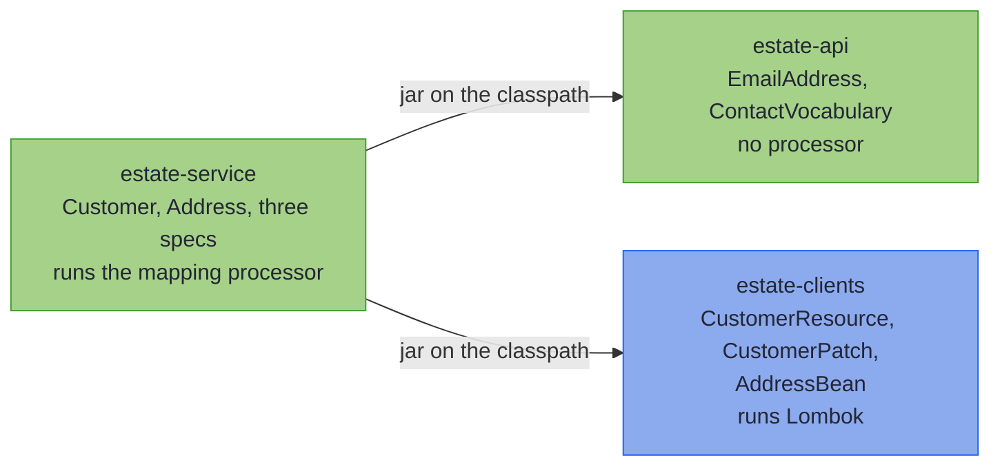

# Capstone: An Estate in Three Modules

_A second worked boundary, in the shape a multi-service estate has: a shared vocabulary, client jars, Lombok beans, and a PATCH endpoint, split across Gradle modules._

~~~admonish info title="What You'll Learn"
- Split one boundary across three modules: a vocabulary with no processor, the client beans, and a service that holds the specs
- Map a Lombok `@Data` bean and a generator-shaped bean, each read from a compiled jar
- Clear a field over PATCH with an `Optional` property, and replace a nested object whole
- Prove the whole boundary with its laws, one call per mapping
~~~

~~~admonish example title="See Example Code"
**The code on this page is three Gradle modules, [estate-api](https://github.com/higher-kinded-j/higher-kinded-j/tree/main/hkj-examples/estate-api), [estate-clients](https://github.com/higher-kinded-j/higher-kinded-j/tree/main/hkj-examples/estate-clients) and [estate-service](https://github.com/higher-kinded-j/higher-kinded-j/tree/main/hkj-examples/estate-service), and their [EstateBoundaryTest.java](https://github.com/higher-kinded-j/higher-kinded-j/blob/main/hkj-examples/estate-service/src/test/java/org/higherkindedj/example/estate/service/EstateBoundaryTest.java)** - the page includes them directly, so the build compiles and tests all of it.
~~~

---

## The Estate {#the-estate}

The [first capstone](capstone.md) built one boundary in one module. An estate of services spreads the same boundary across several. One team publishes an api module that the others depend on. Partner teams ship client jars, whose beans an OpenAPI generator or Lombok wrote. Each service maps between those beans and its own domain, and serves PATCH endpoints as well as reads.

This page builds that shape at the smallest size that shows it: three modules and one customer.



In words: the service module depends on the other two, and it is the only one that runs the mapping processor.

---

## The api module: a vocabulary, and no processor {#the-api-module}

The api module owns what every service shares: the `EmailAddress` value type, and the vocabulary that maps it. A [vocabulary](codecs.md#shared-vocabulary-mix-in-interfaces) is a plain interface, not a spec, so nothing in this module is generated. Its build needs the library and no annotation processor:

```kotlin
{{#include ../../../hkj-examples/estate-api/build.gradle.kts:api_build}}
```

```java
{{#include ../../../hkj-examples/estate-api/src/main/java/org/higherkindedj/example/estate/api/ContactVocabulary.java:vocabulary}}
```

Every client in the estate calls a customer's name `fullName`, and every email parses the same way, so both live here once. The `@MapField` rename is kept in the compiled class, which is what lets a spec in another module read it.

---

## The clients module: beans as a partner ships them {#the-clients-module}

The clients module stands in for a partner's client jar, so its beans are written the way the tools write them. The address is a Lombok `@Data` bean:

```java
{{#include ../../../hkj-examples/estate-clients/src/main/java/org/higherkindedj/example/estate/clients/AddressBean.java:lombok_wire}}
```

The PATCH request has the shape an OpenAPI generator writes, with every property `null` until a request sets it:

```java
{{#include ../../../hkj-examples/estate-clients/src/main/java/org/higherkindedj/example/estate/clients/CustomerPatch.java:patch_bean}}
```

Lombok runs in this module, and the mapping processor does not:

```kotlin
{{#include ../../../hkj-examples/estate-clients/build.gradle.kts:clients_build}}
```

By the time the service module compiles, the address bean's getters and setters are ordinary methods in a jar, and the mapping processor reads them there as it reads any bean's. A Lombok bean in the same module as its spec maps too, as long as Lombok runs first: the [generated-client checklist](beans.md#generated-client-checklist) says how to order the two.

---

## The service module: the specs {#the-service-module}

The service module holds the domain and the specs. It is the one module that runs the mapping processor:

```kotlin
{{#include ../../../hkj-examples/estate-service/build.gradle.kts:service_build}}
```

The domain is the chapter's order service, cut down to a customer:

```java
{{#include ../../../hkj-examples/estate-service/src/main/java/org/higherkindedj/example/estate/service/Customer.java:domain}}

{{#include ../../../hkj-examples/estate-service/src/main/java/org/higherkindedj/example/estate/service/Address.java:address}}
```

Three specs map it. The address maps the Lombok bean component by component, with nothing to declare. The customer resource and its PATCH each extend the api module's vocabulary, and the resource adds a leaf for its UUID:

```java
{{#include ../../../hkj-examples/estate-service/src/main/java/org/higherkindedj/example/estate/service/AddressMapping.java:address_spec}}

{{#include ../../../hkj-examples/estate-service/src/main/java/org/higherkindedj/example/estate/service/CustomerResourceMapping.java:resource_spec}}

{{#include ../../../hkj-examples/estate-service/src/main/java/org/higherkindedj/example/estate/service/CustomerPatchMapping.java:patch_spec}}
```

No spec names a module. The address bean nests through `AddressMapping` because that is the only spec for the pair. A bean bridges the optional nickname by itself, so the resource needs no [`@OptionalBridge`](rules.md#optional-bridge-on-a-bean-wire).

---

## What the build proves {#what-the-build-proves}

The resource round-trips through all three modules:

```java
{{#include ../../../hkj-examples/estate-service/src/test/java/org/higherkindedj/example/estate/service/EstateBoundaryTest.java:round_trip}}
```

A resource with three bad fields reports all three, and the one inside the Lombok bean is located by its path:

```java
{{#include ../../../hkj-examples/estate-service/src/test/java/org/higherkindedj/example/estate/service/EstateBoundaryTest.java:every_bad_field}}
```

Bound from real JSON, the PATCH keeps what a request leaves out, clears the nickname on an explicit `null`, and replaces the address whole:

```java
{{#include ../../../hkj-examples/estate-service/src/test/java/org/higherkindedj/example/estate/service/EstateBoundaryTest.java:patch_json}}
```

~~~admonish question title="Checkpoint: half an address" id="check-estate-partial"
A client wants to change only the street, and sends `{"address": {"street": "2 Park Row"}}`. What happens to Ada's stored address?

1. The street changes, and the city and postcode are kept
2. The address becomes `2 Park Row`, with no city or postcode
3. The PATCH is refused, with `address.city: must not be null` and `address.postcode: must not be null`
4. Nothing: the incomplete address is ignored
~~~

~~~admonish success title="Answer and why" collapsible=true id="check-estate-partial-answer"
**3.** A PATCH replaces a nested object whole rather than merging it, so the address parses through `AddressMapping` like any full address. The city and postcode the client left out are `null`, and a `null` is a located error. Ada is unchanged:

```java
{{#include ../../../hkj-examples/estate-service/src/test/java/org/higherkindedj/example/estate/service/EstateBoundaryTest.java:partial_address}}
```

A client that means to change the street sends the whole address.

Where this lives: [Sparse PATCH](beans_patch.md).
~~~

Both mappings obey their laws, one call each:

```java
{{#include ../../../hkj-examples/estate-service/src/test/java/org/higherkindedj/example/estate/service/EstateBoundaryTest.java:laws}}
```

---

## In your own build {#in-your-own-build}

This page wires the processor directly, as the repository's own build does. In your estate, apply the hkj Gradle plugin to each service module that declares specs, as the [Quickstart](quickstart.md) shows. The api module and the client jars take the library as an ordinary dependency, or nothing at all. [Multi-module builds](../tooling/manual_setup.md#multi-module-builds) covers the rest.

---

~~~admonish info title="Key Takeaways"
* **A vocabulary module needs no processor**: a mix-in is a plain interface, and its rename and leaves reach a spec in another module through the jar
* **A client jar's beans map like any bean**: the processor reads a Lombok or generated bean's accessors from the compiled class
* **A PATCH clears with an `Optional` and replaces a nested object whole**: an explicit JSON `null` empties the `Optional`, and a sent address must be complete
* **The laws cover the estate too**: one call per mapping
~~~

~~~admonish tip title="See Also"
- [Capstone: One 422, Every Bad Field](capstone.md): The same machinery in one module
- [Standard Codecs and Shared Vocabulary](codecs.md#shared-vocabulary-mix-in-interfaces): Vocabularies, and how they cross a module boundary
- [Bean-Shaped Wires](beans.md): Setter, builder and Lombok beans
- [Sparse PATCH](beans_patch.md): What an omitted field, an explicit `null` and a value each do
- [Mapper at a Glance](at_a_glance.md): Twelve questions about your own estate
~~~

---

**Previous:** [Injecting, Testing, and Diagnostics](testing.md)
**Next:** [Mapper at a Glance](at_a_glance.md)
