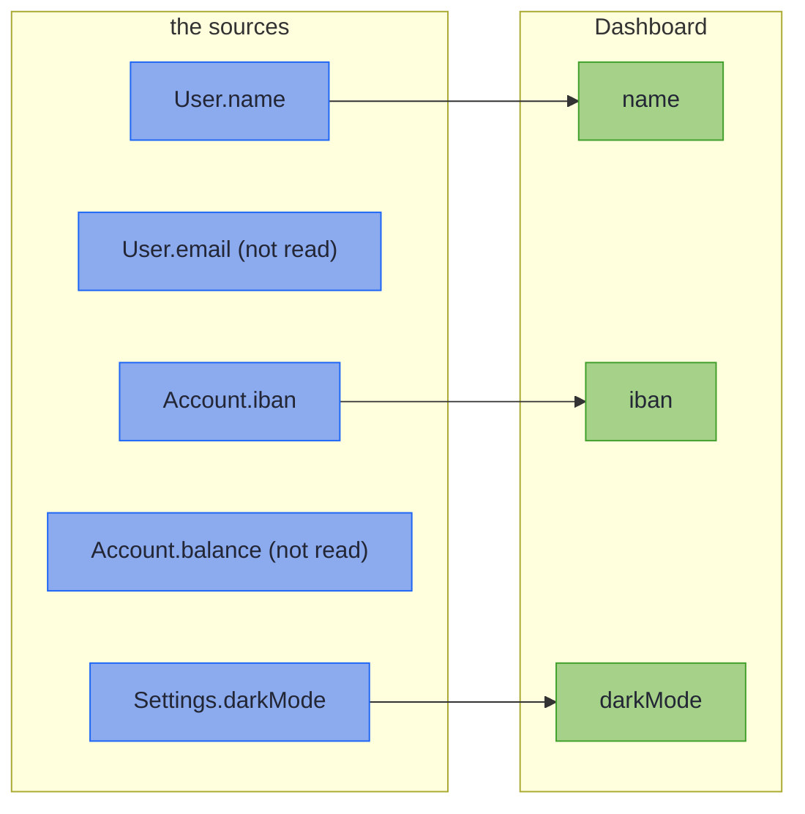

# Merge and Error Envelopes

_The forward-only sibling that assembles one target from several sources, and the generator that types your error context._

Two more generators complete the family. `@GenerateMerge` covers the assembly a boundary often needs just after parsing: one domain value built from several inputs. `@GenerateErrorEnvelope` covers the other end of the boundary: the typed domain error a fallible mapping produces, without the copy-pasted envelope fields and the untyped `Map<String, Object>` context.

~~~admonish info title="What You'll Learn"
- Predict what a merge fills, and what a merge with a plain return does with a `null`
- Keep an error envelope's context a record whose every component accepts `null`
~~~

~~~admonish example title="See Example Code"
**The code on this page is [MergeBook.java](https://github.com/higher-kinded-j/higher-kinded-j/blob/main/hkj-examples/src/main/java/org/higherkindedj/example/book/mapping/MergeBook.java), [OrderErrorBook.java](https://github.com/higher-kinded-j/higher-kinded-j/blob/main/hkj-examples/src/main/java/org/higherkindedj/example/book/mapping/OrderErrorBook.java), [EnvelopeContextBook.java](https://github.com/higher-kinded-j/higher-kinded-j/blob/main/hkj-examples/src/main/java/org/higherkindedj/example/book/mapping/EnvelopeContextBook.java) and [MergeBookTest.java](https://github.com/higher-kinded-j/higher-kinded-j/blob/main/hkj-examples/src/test/java/org/higherkindedj/example/book/mapping/MergeBookTest.java)** - the page includes them directly, so they are compiled and run by the build.
~~~

## Merging several sources: `@GenerateMerge` {#merging-several-sources-generatemerge}

A merge is declared entirely by a method's signature: two or more record sources in, one record target out. It is a MapStruct method with several source parameters, except that each target component fills from the one source that names it, and there is no rename. The processor generates no inverse, since a merge cannot be undone:

``` java
{{#include ../../../hkj-examples/src/main/java/org/higherkindedj/example/book/mapping/MergeBook.java:merge_spec}}

{{#include ../../../hkj-examples/src/main/java/org/higherkindedj/example/book/mapping/MergeBook.java:merge_usage}}
```



In words: each of `Dashboard`'s components comes from the one source that names it, and a source component the target lacks is not read.

A fill copies when the types match, and a same-typed container [crosses as a copy](rules.md#same-typed-containers-cross-as-copies). Otherwise it converts through a leaf, a `default` method on the merge interface named after the target component. Or it parses through a `@GenerateMapping` spec whose wire is the source component and whose domain is the target component. Here `customer` parses through `CustomerMappingImpl`, and a failure locates as a dotted path:

``` java
{{#include ../../../hkj-examples/src/main/java/org/higherkindedj/example/book/mapping/MergeBook.java:nested_merge_spec}}

{{#include ../../../hkj-examples/src/main/java/org/higherkindedj/example/book/mapping/MergeBook.java:nested_merge_usage}}
```

The return type must tell the truth. A fill that can fail demands the `Validated` return, and a merge whose every fill is a copy must declare the plain target. [How a merge fills](rules.md#how-a-merge-fills) has the rest, including why an outbound view cannot fill through a spec's `build` yet.

~~~admonish warning title="Not checked for you: a merge with a plain return passes nulls through"
A merge that returns `Validated` checks what it reads, as `parse` does under the [null rule](basics.md#null-doctrine). A merge with a plain return checks nothing: a `null` flows into the target as it is, and whatever the target's constructor throws propagates. To have a merge check, give a component a leaf that can fail, which makes the merge fallible and its return `Validated` ([Nulls and guards in a merge](rules.md#nulls-and-guards-in-a-merge)).
~~~

---

## Generating error envelopes: `@GenerateErrorEnvelope` {#generating-error-envelopes-generateerrorenvelope}

A sealed error hierarchy tends to re-declare the same envelope on every variant, with an untyped context:

<!-- verify -->
```java
import java.time.Instant;
import java.util.List;
import java.util.Map;

sealed interface OrderError {
  record OutOfStock(
          List<String> products,
          String code,
          String message,
          Instant timestamp,
          Map<String, Object> context)
      implements OrderError {}

  record PaymentDeclined(
          String card, String code, String message, Instant timestamp, Map<String, Object> context)
      implements OrderError {}
}
```

`@GenerateErrorEnvelope` supplies the envelope and types the context, so each variant declares only its own components, plus one `ErrorEnvelope<C>`. It plays the part Spring's `ProblemDetail` plays for an HTTP response, but on the domain error, and its extra properties are a typed record rather than an untyped map:

``` java
{{#include ../../../hkj-examples/src/main/java/org/higherkindedj/example/book/mapping/OrderErrorBook.java:error_envelope}}
```

This typed context is data attached to an error value, unrelated to the [`ErrorContext`](../effect/effect_contexts_error.md) effect type.

For `OrderError` the processor generates a companion named `OrderErrors` with three pieces:

- **A factory per variant.** Its `code` is the UPPER_SNAKE variant name and its `message` the humanised name, the same for every error of that variant. A new error starts with the all-absent context, every component `null`. Each factory has an overload taking a [`TimeSource`](../glossary/data-effects.md#timesource), which the example uses for a fixed clock.
- **A fluent `context()` builder** over the context record's components, for building a context in a factory of your own.
- **An `editContext(error, edit)` method** that returns a copy of the error with its context changed, starting from its current values.

Add a one-line `default`, as `OrderError` does, and construction plus enrichment reads as you would write it by hand:

``` java
{{#include ../../../hkj-examples/src/main/java/org/higherkindedj/example/book/mapping/OrderErrorBook.java:edit_context}}
```

For a message that varies per error, write a factory of your own that calls `ErrorEnvelope.of(time, code, message, context)`, or change one error's with `envelope().withMessage(...)`. `withContext(D)` is on the envelope too: it replaces the context, perhaps with another type, so the variant must be rebuilt around the new envelope. `editContext` is on the error, and enriches the context it has.

The processor finds the context type from the `ErrorEnvelope` component's type argument, and refuses variants that disagree on it. [Error envelope rules](rules.md#error-envelope-rules) lists the shapes it refuses.

~~~admonish warning title="Not checked for you: every context component must accept null"
The companion builds an all-absent context on its first use, with every component `null`. A context whose compact constructor rejects `null` compiles, then fails that first use with an `ExceptionInInitializerError`, and every use after with `NoClassDefFoundError`, until the JVM restarts:

``` java
{{#include ../../../hkj-examples/src/main/java/org/higherkindedj/example/book/mapping/EnvelopeContextBook.java:strict_context}}
```

Let every component accept `null`, and check a value in a factory of your own that takes it.
~~~

~~~admonish tip title="You can ship now"
You can now assemble a domain value from several sources with a return type that tells the truth, and give a sealed error hierarchy one typed envelope. The rest of this page, [fine-grained or coarse variants](#fine-grained-or-coarse-variants), is for when you need it.
~~~

~~~admonish question title="Checkpoint: what does a plain-return merge do with a null?" id="check-merge-null"
`DashboardAssembly`, from the start of the page, returns the plain `Dashboard`. What does it return for the same `Account` and `Settings` and a `User` whose name is `null`, `new User(null, "ada@corp.example")`?

1. It throws a `NullPointerException`
2. `Invalid(NonEmptyList[name: must not be null])`
3. `Dashboard[name=null, iban=GB29-XXXX, darkMode=true]`
4. Nothing: the processor refuses a merge that can read a `null`
~~~

~~~admonish success title="Answer and why" collapsible=true id="check-merge-null-answer"
**3.** A merge with a plain return checks nothing, so the `null` flows into the `Dashboard` as it is, with no error:

``` java
{{#include ../../../hkj-examples/src/test/java/org/higherkindedj/example/book/mapping/MergeBookTest.java:check_plain_null}}
```

A leaf that can fail on `name` would make the merge fallible, its return `Validated`, and the `null` a located `must not be null`.

Where this lives: [Merging several sources](#merging-several-sources-generatemerge).
~~~

~~~admonish question title="Checkpoint: does this context break its companion?" id="check-envelope-context"
A chargeback error's context checks its trace id too:

``` java
{{#include ../../../hkj-examples/src/main/java/org/higherkindedj/example/book/mapping/EnvelopeContextBook.java:lenient_context}}
```

What happens on the first call to `ChargebackErrors.chargebackOpened("ORD-1")`?

1. `ExceptionInInitializerError`, as for `RefundErrors`
2. It returns an error whose context holds a `null` trace id
3. The processor refuses the compact constructor at compile time
4. It returns an error, and a later `editContext` call throws
~~~

~~~admonish success title="Answer and why" collapsible=true id="check-envelope-context-answer"
**2.** This constructor rejects only a present, blank trace id, so it accepts the all-absent context the companion builds on first use. `RefundErrorContext` rejects `null` itself, which is what breaks its companion:

``` java
{{#include ../../../hkj-examples/src/test/java/org/higherkindedj/example/book/mapping/MergeBookTest.java:check_contexts}}
```

Where this lives: [Generating error envelopes](#generating-error-envelopes-generateerrorenvelope).
~~~

---

## Fine-grained or coarse variants? {#fine-grained-or-coarse-variants}

The design choice is about the *hierarchy*, not the annotation:

| Shape | Example | How its errors are built |
|---|---|---|
| **Fine-grained**: one variant per failure mode, each with its own typed fields | the market example's [`MarketError`](https://github.com/higher-kinded-j/higher-kinded-j/blob/main/hkj-examples/src/main/java/org/higherkindedj/example/market/error/MarketError.java), used in [Building the market pipeline](../examples/market_building.md) | the generated factory, wherever the code and message are the variant's name; `EnrichmentFailed`, whose message is the lookup detail, keeps a factory of its own |
| **Coarse**: one variant for a category of codes | the [Order Workflow example](../examples/examples_order.md)'s [`OrderError`](https://github.com/higher-kinded-j/higher-kinded-j/blob/main/hkj-examples/src/main/java/org/higherkindedj/example/order/error/OrderError.java) (not the one on this page), whose `CustomerError` covers `CUSTOMER_NOT_FOUND` and `CUSTOMER_SUSPENDED` | a factory of your own per code, calling `ErrorEnvelope.of(...)` with the generated `context()` builder; the generated `customerError(...)` stays public, with the code `CUSTOMER_ERROR` |

Either way, the repeated envelope and the untyped `Map<String, Object>` are gone. Reach for fine-grained variants when each failure mode is distinct, and group them when a boundary treats a whole category the same way, as a downstream `switch` presenting failures by category does. Give a factory of your own a `TimeSource` parameter, so tests can fix the clock.

---

~~~admonish info title="Key Takeaways"
* **A merge is a method signature**: each target component fills from the one source that names it, and the return type follows the fills
* **A merge with a plain return checks nothing**: a `null` flows through, so a merge that must check needs a leaf that can fail
* **`@GenerateErrorEnvelope` retires the copy-pasted envelope**: one `ErrorEnvelope<C>` component, generated factories, and a typed context record whose every component accepts `null`
~~~

~~~admonish tip title="See Also"
- [Accumulating Assembly](../monads/validated_assembly.md): The `fields()` ladders behind a fallible merge
- [Testing With hkj-test](../tooling/test_assertions.md): `assertThatErrorEnvelope` for envelope assertions
- [Record Mapping Basics](basics.md): The `parse` whose errors these envelopes type
~~~

---

**Previous:** [Generic Specs](generics.md)
**Next:** [Injecting, Testing, and Diagnostics](testing.md)
