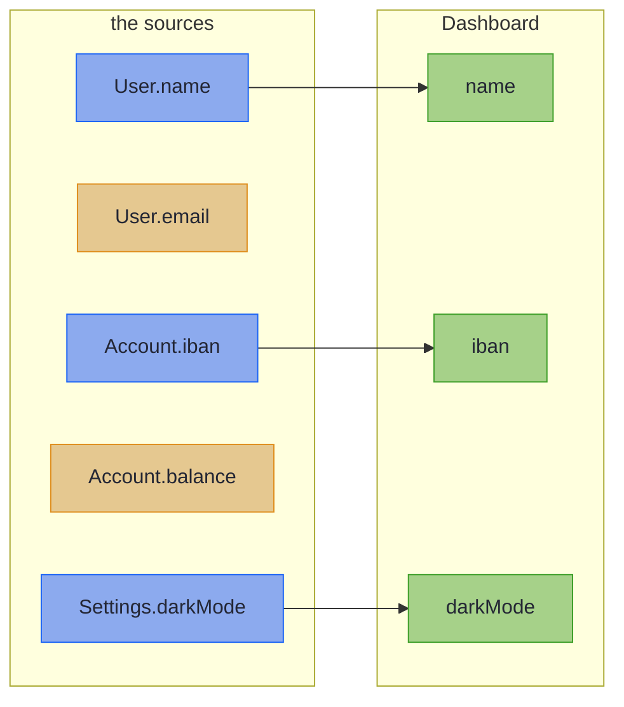

# Merge and Error Envelopes

_The forward-only sibling that assembles one target from several sources, and the generator that types your error context._

Two more generators complete the family. `@GenerateMerge` covers the assembly a boundary often needs just after parsing: one domain value built from several inputs. `@GenerateErrorEnvelope` covers the other end of the boundary: the typed domain error a fallible mapping produces, without the copy-pasted envelope fields and the untyped `Map<String, Object>` context. Each is a short lane of its own, and the checkpoints after them test both.

~~~admonish info title="What You'll Learn"
- Declare a merge by its method signature, with the return type its fills allow
- Replace a repeated error envelope with one generated `ErrorEnvelope<C>`, and keep its context a plain carrier
~~~

~~~admonish example title="See Example Code"
**The code on this page is [MergeBook.java](https://github.com/higher-kinded-j/higher-kinded-j/blob/main/hkj-examples/src/main/java/org/higherkindedj/example/book/mapping/MergeBook.java), [OrderErrorBook.java](https://github.com/higher-kinded-j/higher-kinded-j/blob/main/hkj-examples/src/main/java/org/higherkindedj/example/book/mapping/OrderErrorBook.java) and [MergeBookTest.java](https://github.com/higher-kinded-j/higher-kinded-j/blob/main/hkj-examples/src/test/java/org/higherkindedj/example/book/mapping/MergeBookTest.java)** - the page includes them directly, so they are compiled and run by the build.
~~~

## Merging several sources: `@GenerateMerge` {#merging-several-sources-generatemerge}

A merge is declared entirely by a method's signature: several sources in, one target out. No inverse is generated, since a merge cannot be undone:

``` java
{{#include ../../../hkj-examples/src/main/java/org/higherkindedj/example/book/mapping/MergeBook.java:merge_spec}}

{{#include ../../../hkj-examples/src/main/java/org/higherkindedj/example/book/mapping/MergeBook.java:merge_usage}}
```

Each target component fills from the one source that has a component of the same name:



In words: each of `Dashboard`'s components comes from the one source that names it, and a source component the target lacks fills nothing.

A fill copies when the types match (a same-typed container as a [copy](rules.md#same-typed-containers-cross-as-copies)), converts through a `ValidatedPrism` leaf when they differ, or goes through a sibling `@GenerateMapping` spec. Here `customer` parses through `CustomerMappingImpl`, and a failure locates as a dotted path:

``` java
{{#include ../../../hkj-examples/src/main/java/org/higherkindedj/example/book/mapping/MergeBook.java:nested_merge_spec}}

{{#include ../../../hkj-examples/src/main/java/org/higherkindedj/example/book/mapping/MergeBook.java:nested_merge_usage}}
```

The return type must tell the truth. A fill that can fail demands the `Validated` return, and a merge whose every fill is a copy must declare the plain target. The processor also refuses a component two sources carry, and one no source fills.

~~~admonish warning title="Not checked for you: a plain-return merge passes nulls through"
A merge that returns `Validated` checks what it reads, as [`parse`](basics.md#null-doctrine) does: a `null` source component is a located `must not be null`, and a refusal from the target's constructor becomes an error. A plain-return merge checks nothing. A `null` flows into the target as it is, and whatever the target's constructor throws propagates. [Nulls and guards in a merge](rules.md#nulls-and-guards-in-a-merge) says how to buy the checks.
~~~

---

## Generating error envelopes: `@GenerateErrorEnvelope` {#generating-error-envelopes-generateerrorenvelope}

A sealed error hierarchy tends to re-declare the same envelope on every variant, with an untyped context:

<!-- verify -->
```java
import java.time.Instant;
import java.util.List;
import java.util.Map;

sealed interface OrderError {
  record OutOfStock(
          List<String> products,
          String code,
          String message,
          Instant timestamp,
          Map<String, Object> context)
      implements OrderError {}

  record PaymentDeclined(
          String card, String code, String message, Instant timestamp, Map<String, Object> context)
      implements OrderError {}
}
```

`@GenerateErrorEnvelope` supplies the envelope and types the context. Each variant declares only its own components, plus one `ErrorEnvelope<C>`:

``` java
{{#include ../../../hkj-examples/src/main/java/org/higherkindedj/example/book/mapping/OrderErrorBook.java:error_envelope}}
```

~~~admonish note title="Two senses of 'context'"
The *typed context* here is data attached to an error value, a record such as `OrderErrorContext`. It is unrelated to the [`ErrorContext`](../effect/effect_contexts_error.md) effect type, which runs an IO-plus-`Either` computation.
~~~

For `OrderError` the processor generates a companion named `OrderErrors` with three pieces:

- **A factory per variant.** `code` is the UPPER_SNAKE variant name and `message` its humanised form. The timestamp comes from a [`TimeSource`](../monads/io_monad.md): each factory has an overload taking one, and the other uses `TimeSource.system()`.
- **A fluent `context()` builder** over the context record's components.
- **An `editContext(error, edit)` method** that returns a copy of the error with its context changed.

Add a one-line `default`, as `OrderError` does, and construction plus enrichment reads as you would write it by hand:

``` java
{{#include ../../../hkj-examples/src/main/java/org/higherkindedj/example/book/mapping/OrderErrorBook.java:edit_context}}
```

Two verbs keep two operations apart. `ErrorEnvelope.withContext(D)` **replaces** the context, and may change its type. The generated `editContext(error, edit)` **enriches** the context it has, starting from its current values.

The processor finds the context type from the `ErrorEnvelope` component's type argument, and every variant must agree on it. [Error envelope rules](rules.md#error-envelope-rules) lists the shapes it refuses.

~~~admonish warning title="Not checked for you: keep the context a plain carrier"
The companion builds an all-absent context once, when it is first used, with every component `null`. A context record whose compact constructor rejects `null` compiles, then fails that first use with an `ExceptionInInitializerError`. Keep the context's components nullable, and put the checks where the error is built.
~~~

~~~admonish tip title="You can ship now"
You can now assemble a domain value from several sources with a return type that tells the truth, and give a sealed error hierarchy one typed envelope. The rest of this page, [fine-grained or coarse variants](#fine-grained-or-coarse-variants), is for when you need it.
~~~

~~~admonish question title="Checkpoint: which return type does this merge need?" id="check-merge-return"
`HeaderAssembly` fills `name` and `darkMode` straight from its sources. A teammate declares the `Validated` return, to be safe:

<!-- verify:rejects "declares a Validated return but every fill is an identity copy" -->
```java
import org.higherkindedj.hkt.nonemptylist.NonEmptyList;
import org.higherkindedj.hkt.validated.FieldError;
import org.higherkindedj.hkt.validated.Validated;
import org.higherkindedj.optics.annotations.GenerateMerge;

record User(String name, String email) {}

record Settings(boolean darkMode) {}

record Header(String name, boolean darkMode) {}

@GenerateMerge
interface HeaderAssembly {
  Validated<NonEmptyList<FieldError>, Header> assemble(User user, Settings settings);
}
```

What happens?

1. It compiles, and `assemble` always returns `Valid`
2. It compiles, and the `Validated` return adds the null checks
3. The processor refuses it: a merge that cannot fail must declare the plain `Header`
4. It compiles with a warning
~~~

~~~admonish success title="Answer and why" collapsible=true id="check-merge-return-answer"
**3.** The return type must tell the truth, and every fill here is a copy, so this merge cannot fail. The processor refuses the `Validated` return:

```
@GenerateMerge: 'assemble' declares a Validated return but every fill is an identity copy. Truthful
types: a merge that cannot fail must not claim it can. Declare the plain 'Header' return type.
```

Where this lives: [Merging several sources](#merging-several-sources-generatemerge).
~~~

~~~admonish question title="Checkpoint: what does a strict context do?" id="check-merge-context"
A refund error's context insists on a trace id:

``` java
{{#include ../../../hkj-examples/src/main/java/org/higherkindedj/example/book/mapping/OrderErrorBook.java:strict_context}}
```

What happens when code first calls `RefundErrors.refundWindowClosed("ORD-1")`?

1. The processor refuses the context record at compile time
2. It returns an error with an empty context
3. It throws an `ExceptionInInitializerError`
4. It returns an error, and a later `editContext` call throws
~~~

~~~admonish success title="Answer and why" collapsible=true id="check-merge-context-answer"
**3.** The companion builds its all-absent context on first use, with `traceId` set to `null`, and the compact constructor throws. The processor cannot see a constructor's checks, so it compiles:

``` java
{{#include ../../../hkj-examples/src/test/java/org/higherkindedj/example/book/mapping/MergeBookTest.java:check_strict_context}}
```

Where this lives: [Generating error envelopes](#generating-error-envelopes-generateerrorenvelope).
~~~

---

## Fine-grained or coarse variants {#fine-grained-or-coarse-variants}

The design choice is about the *hierarchy*, not the annotation:

- **Fine-grained**, one variant per failure mode with its own typed fields, as in `MarketError`'s `FeedDisconnected`, `RiskLimitBreached` and `StaleData`. The generated `MarketErrors` factories carry everything, and no hand-written construction remains.
- **Coarse**, a variant grouping several codes, as in `OrderError`'s `CustomerError`, which covers `CUSTOMER_NOT_FOUND` and `CUSTOMER_SUSPENDED`. It suits a boundary whose downstream `switch` presents failures by category. One generated factory per variant derives only one code, so these variants keep a hand-written factory per code, each calling the canonical constructor with `ErrorEnvelope.of(...)` and the generated builder.

Either way, the repeated envelope and the untyped `Map<String, Object>` are gone. Reach for fine-grained variants when each failure mode is distinct, and group them when a boundary treats a whole category the same way.

---

~~~admonish info title="Key Takeaways"
* **A merge is a method signature**: sources in, target out, each component filled from exactly one source
* **Return types tell the truth**: a fill that can fail forces the `Validated` return, and a merge of copies declares the plain target, which checks nothing
* **`@GenerateErrorEnvelope` retires the copy-pasted envelope**: one `ErrorEnvelope<C>` component, generated factories, and a typed context instead of `Map<String, Object>`
* **`withContext` replaces, `editContext` enriches**, and the context stays a plain nullable carrier
~~~

~~~admonish tip title="See Also"
- [Accumulating Assembly](../monads/validated_assembly.md): The `fields()` ladders behind a fallible merge
- [Testing With hkj-test](../tooling/test_assertions.md): `assertThatErrorEnvelope` for envelope assertions
- [Record Mapping Basics](basics.md): The `parse` whose errors these envelopes type
~~~

---

**Previous:** [Generic Specs](generics.md)
**Next:** [Injecting, Testing, and Diagnostics](testing.md)
