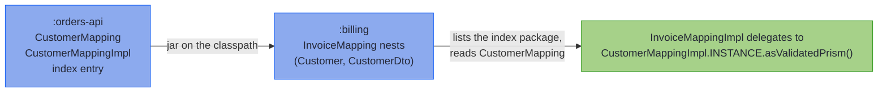

# Mapping Rules and Limits

_The precise contracts behind the mapping chapter, and every limit the processor enforces._

Each rule the processor enforces is stated on this page once, bar a few short enough to stay on the page that teaches them, and Find your limit indexes both. A rule the processor cannot check stays on its teaching page as a warning, where your attention is the only safeguard: [Find your symptom](#find-your-symptom) indexes those. Holding a compiler message instead? [Compiler Messages](compiler_errors.md) finds it.

## Find your limit {#find-your-limit}

Each question links to its rule. *By design* means the behaviour or the refusal is deliberate, and the rule says why. *Not supported yet* means a shape that would make sense, which the processor does not map.

| Question | Answer | Status |
|---|---|---|
| **Spec members** | | |
| [What if a leaf's name matches no component?](#how-the-two-default-families-are-told-apart) | A declared leaf is a compile error, naming the components; an inherited one stays inert. | by design |
| [Can a getter-shaped helper live on a spec?](#how-the-two-default-families-are-told-apart) | Yes, if `private`, `static` or given a parameter; a `default` one is a derived field. | by design |
| [Can a sealed spec declare its own leaves, renames or markers?](#how-the-two-default-families-are-told-apart) | No: a dispatch has no components to bind them to. | by design |
| [Can a member's type be one the spec's package cannot see?](#how-the-two-default-families-are-told-apart) | No: the Impl is generated in that package and must name it. | by design |
| [Can a projection carry a derived field?](#derived-fields-and-the-emission-tiers) | No: `build` recomputes what the write-back would set. | by design |
| **Optional fields** | | |
| [Can a bridged component be declared non-null, or primitive?](#bridged-component-nullable) | No: `build` writes `null` for empty, so declare it `@Nullable`. | by design |
| [Can a sparse or sealed spec declare `@OptionalBridge`?](#bridged-component-nullable) | No; one inherited from a mix-in stays inert. | by design |
| **Shared vocabulary** | | |
| [Does a mix-in need the annotation processor?](structure.md#across-modules) | No: a mix-in is a plain interface, not a spec. | by design |
| [Can a mix-in extend `MappingSpec`?](#refused-mix-in-shapes) | No: a mix-in shares vocabulary; a spec generates an Impl. | by design |
| [Can a generic mix-in be extended raw?](#a-generic-mix-in-reached-raw) | Not if it contributes a member: raw erases what it declares. | by design |
| [Can two mix-ins declare the same rename?](#inheriting-one-member-twice) | Yes, when the targets agree; conflicting targets are refused. | by design |
| [Can an `@Unmapped` marker name an accessor that pairs?](beans_patch.md#accessors-meant-to-stay-out) | Not one the spec declares; an inherited one stays inert. | by design |
| **Containers** | | |
| [Is a same-typed container shared with the wire?](#same-typed-containers-cross-as-copies) | Not when declared exactly `List`, `Set`, `Collection`, `Map`, `Optional` or array. | by design |
| [Does a `List` lift against a `Set`, or an `ArrayList`?](#what-lifts) | No: the same exact container on both sides, one level deep. | by design |
| [Can a lifted array hold `T` or `List<Tag>`?](#what-lifts) | No: the generated array creation would be generic. | by design |
| [Can a raw or wildcard `Map` have its keys or values converted?](#what-lifts) | No: name its type arguments. | by design |
| [Can a `Map`'s keys be converted?](structure.md#converting-map-keys) | Yes, with a `@MapKey` leaf; otherwise the key types must match. | by design |
| [Can a key leaf sit beside a whole-map leaf?](#key-leaf-beside-a-whole-map-leaf) | A declared one is refused; an inherited one stays inert. | by design |
| [Is a `null` inside a `Stream`, `Iterable`, `Maybe` or `NonEmptyList` located?](#the-null-contract-precisely) | No: the component is guarded, its contents are not scanned. | not supported yet |
| [Can a sealed pair's subtype be an enum, or generic?](structure.md#sealed-hierarchies) | No: records and sealed interfaces, or beans on the wire side. | not supported yet |
| **Flattening** | | |
| [Can two components of one record type both be spread?](#names-in-a-flattened-group) | No: every wire component takes exactly one source. | by design |
| [Can a flattened group spread a record inside it?](#where-flattening-applies) | No: spreading is one level deep, and the inner record nests. | not supported yet |
| [Can a flattened component sit on a bean, generic, projection or PATCH spec?](#where-flattening-applies) | No: record-to-record only; an inherited marker stays inert where unused. | not supported yet |
| [Can a flattened record have more than 16 components?](#where-flattening-applies) | No: one `fields()` ladder assembles the group. | not supported yet |
| **Across modules** | | |
| [Does a spec compiled in another module nest?](structure.md#across-modules) | Yes, when that module ran `hkj-processor`. | by design |
| [What if two dependencies map the same pair?](#how-a-dependencys-specs-are-found) | Ambiguous: your own spec, or a leaf, picks one. | by design |
| [Can a spec-carrying module sit on the module path?](#how-a-dependencys-specs-are-found) | Not with the index: keep those jars on the classpath, or delegate with a leaf. | not supported yet |
| **Emission tiers** | | |
| [Why does a bean mapping lose `asIso()`?](#where-a-bean-or-bridged-component-lands) | A reference property can be unset; an all-primitive bean keeps it. | by design |
| [Why does a validating projection get no `asLens()`?](tiers.md#leaf-carrying-projections-the-validated-patch) | A lens cannot fail, so it takes the validated `patch`. | by design |
| [How wide can a record be?](testing.md#diagnostics-and-limits) | No ceiling but the JVM's: about 254 components. | by design |
| **Bean wires** | | |
| [Can the domain be a bean?](beans_patch.md#bean-shaped-wire-targets) | No: `parse` builds the domain through a record constructor. | by design |
| [What happens to an accessor with no partner?](#unpaired-accessors) | Left out; refused when named after a component the bean carries under no name. | by design |
| [Can a getter-only `List` be raw, or a wildcard?](#getter-only-list-element-type) | Not where `build` is emitted: `addAll` needs its element type. | not supported yet |
| [Can a getter-only `List` carry an absent `Optional`?](#getter-only-list-refuses-the-bridge) | No: its getter creates the list, so absence reads as empty. | not supported yet |
| [Where does a one-directional bean nest?](beans_patch.md#one-directional-beans) | Only where nothing needs its missing direction. | by design |
| **Sparse PATCH** | | |
| [Can one spec extend `MappingSpec` and `UpdateSpec`?](#one-tier-per-spec) | No: declare a spec per tier and share a mix-in. | by design |
| [Can a PATCH property be primitive?](#no-primitive-patch-property) | No: a primitive is never absent, so use the wrapper. | by design |
| [Can a PATCH wire be a record?](#no-record-patch-wire) | No: a record component is always present. | by design |
| [Can a PATCH bean be read-only, or write-only?](#patch-bean-read-and-written) | No: a PATCH bean is both read and written. | by design |
| [Can a PATCH bean have a setter with no getter?](#every-patch-setter-has-a-getter) | No, unless marked `@Unmapped`: the update would ignore it. | by design |
| [Can a PATCH set a field to empty?](#no-optional-bridge-on-a-patch) | Through an `Optional`-typed property; a plain one bridged to `Optional` cannot. | by design |
| [Can a PATCH bean have a getter-only `List`?](#no-getter-only-list-on-a-patch) | No: it never reads `null`, so it cannot be absent. | not supported yet |
| [Can a PATCH bean carry a `JsonNullable` property?](beans_patch.md#sparse-patch-write-back-updatespec) | No: use an `Optional`-typed property. | not supported yet |
| [Does a nested spec lift through a PATCH container?](beans_patch.md#sparse-patch-write-back-updatespec) | No: give the component an element leaf that delegates to it. | not supported yet |
| [Can a PATCH spec dispatch over a sealed hierarchy?](#no-sealed-patch) | No: an absent property cannot choose a subtype. | by design |
| [Does a PATCH merge a nested object field by field?](#patch-replaces-wholesale) | No: a nested record, list or map is replaced whole. | by design |
| **Generic specs** | | |
| [Can a generic spec map a bean, or a PATCH?](#generic-boundaries) | No: generic mappings are record-to-record. | not supported yet |
| [Can a leaf, rename or marker declare its own type parameters?](#generic-boundaries) | No: the element types go on the spec's parameters. | by design |
| **Merge and error envelopes** | | |
| [Can an error envelope hierarchy be generic?](#error-envelope-rules) | No: the hierarchy, its variants and the context are non-generic. | by design |

## Find your symptom {#find-your-symptom}

Nothing refuses these at compile time. Each is a runtime surprise, linked to the teaching section that warns of it.

| What you see | Why, and the fix |
|---|---|
| [`MAPPER.parse` throws a `NullPointerException`, sometimes](basics.md#bind-in-the-caller) | A constant on the spec can read `null`: bind the Impl in the caller. |
| [A PATCH that omits a field overwrote the stored value](beans_patch.md#sparse-patch-write-back-updatespec) | A default the bean gives itself reads as sent: leave PATCH bean fields uninitialised. |
| [An explicit JSON `null` cleared an `Optional` PATCH property](beans_patch.md#sparse-patch-write-back-updatespec) | Jackson binds it to `Optional.empty()`, which means *clear* there: omit the field to leave it unchanged. |
| [`build` throws on an empty `Optional`](beans_patch.md#bean-shaped-wire-targets) | A setter, builder or record constructor rejects `null` without declaring it: drop the `Optional`, or encode absence in a leaf. |
| [Adding to a built wire's list throws `UnsupportedOperationException`](structure.md#nesting-containers-and-recursion) | A same-typed container crosses as an unmodifiable copy: set a new list, or copy it first. |
| [A record with an array is not equal to its own round trip](structure.md#nesting-containers-and-recursion) | The array crosses as a clone and compares by reference: give the record an `equals` that uses `Arrays.equals`. |
| [Two swapped prisms passed to `of(...)` compiled](generics.md#element-mapped-specs) | Two abstract leaves of one type swap silently: pass them in declaration order. |
| [A `Set` lost an element, or a `Map` entry was refused as a duplicate](structure.md#converting-map-keys) | A leaf maps two wire values to one: `ValidatedPrismLaws` catches it. |
| [An error path reads as deeper nesting than it is](structure.md#nesting-containers-and-recursion) | A key or set element contains a dot: `FieldError.path()` keeps it as one segment. |
| [`asIso().reverseGet` threw on a request body](tiers.md) | `reverseGet` is unguarded: a freshly bound wire goes through `parse`. |
| [A constructor bug reached the client as a message](basics.md#constructor-invariants) | Any `RuntimeException` counts: keep the constructor to checks on its arguments. |
| [A timestamp came back with fewer fractional digits](codecs.md#canonical-forms-only) | The formatter pattern fixes the precision, so `build` truncates finer values. |
| [The first call into a generated error companion throws `ExceptionInInitializerError`](merge_envelopes.md#generating-error-envelopes-generateerrorenvelope) | Its all-absent context is built at class initialisation, and the context record's constructor rejects `null`: keep it a plain nullable carrier. |

---

## Nulls {#nulls}

### The null contract, precisely {#the-null-contract-precisely}

The null guard covers every reference-typed `parse` read that is not [bridged](basics.md#optional-bridge), on record and bean wires alike, and reaches inside containers, identity-copied ones included, at every depth:

- A `null` element or map value locates the way its container locates anything ([lifting grammar](structure.md#nesting-containers-and-recursion)): by index in a `List` or array (`emails.1: must not be null`), by key in a `Map`, whether the container lifts through a leaf ([the bulk forms](../optics/validated_prism.md#the-bulk-forms-parseall-and-parsevalues)) or copies by identity. The index is a plain positional segment, matching the map-key grammar.
- A `null` element of a `Set` has no rendering to locate by, and a set holds at most one, so it reports unlocated under the component: `emails: must not contain a null element`, which is distinct from `must not be null`, the message that says the set itself is absent.
- An array of primitives (`int[]`) carries no element scan: a primitive element cannot be null. The component is still a reference, so a `null` *array* is guarded like any other read.
- An identity container is scanned at every level its type names, so a `null` deep inside carries its full path: `grid.0.1` in a `List<List<String>>`, `byKey.k.1` in a `Map<String, List<String>>`, `matrix.0.1` in a `String[][]`. An `Optional` cannot hold a `null`, but one holding a container is scanned through, and locates at the component itself, since it holds only the one value (`nicknames.1`).
- How the container is declared does not matter. Any `Collection` counts, and any `Map`: a subtype (`ArrayList`, `LinkedHashMap`, `EnumMap`), a supertype (`Collection`), a raw type, one with a wildcard argument, or a type variable bounded by one. A collection that is a `Set` when it is parsed follows the set rule above; any other locates by position, in iteration order.
- A failure inside a set's element locates under that element's rendering, as a set element that fails its leaf does: `tagged.[b, null].1` for a `Set<List<String>>`. The rendering is the element's `toString()`, so an element containing a dot reads as deeper nesting in `pathString()`, while `FieldError.path()` keeps it as one segment.
- A container class that fixes its own element type, such as a tree node declared `class Node extends ArrayList<Node>`, can hold itself at any depth. It is scanned one level into itself: where the class recurs, its elements are checked for `null` but not scanned inside.
- Only these containers are looked inside. An `Iterable` or `Stream` component, and the library's own `Maybe` and `NonEmptyList`, are guarded against `null` themselves, but nothing inside them is scanned yet.
- The values a [`@MapKey`](structure.md#converting-map-keys) map copies are scanned the same way, located under their source key.
- The scan only locates nulls. What `parse` hands the domain is a [copy](#same-typed-containers-cross-as-copies), made before the scan runs, so the scan reads exactly what the wire held.
- A `null` container *component* is guarded like any reference read (`emails: must not be null`).
- A [bridged](basics.md#optional-bridge) container excuses only the absent case: `null` reads as empty, and a *present* container is scanned exactly as an unbridged one is.

What stays the caller's error (`NullPointerException`), by contract: a `null` *wire* itself, a `null` map *key* (a structurally broken map, not a wrong value), and calling the bulk forms directly with a `null` list or map. A key is never scanned inside, even when it is a container.

Absence-as-a-meaning is deliberate everywhere it appears. A record component cannot express it by itself (it can only be wrong), so it takes either the [sparse `UpdateSpec` tier](beans_patch.md#sparse-patch-write-back-updatespec), where every `null` means *leave unchanged*, or an [`@OptionalBridge`](basics.md#optional-bridge) component, where one named field's `null` means *absent*. Neither is inferred; both are declarations.

---

## Spec members {#spec-members}

### How the two `default` families are told apart {#how-the-two-default-families-are-told-apart}

Leaves are named after *domain* components and return `ValidatedPrism`; derived fields are named after *wire-only* components and return `Getter`. The processor matches the two differently:

- A zero-parameter `default` returning `Getter` is *always* claimed as a derived field, and validated as one. So give getter-shaped utility helpers a parameter or a different return type, or they will be mistaken for derived fields.
- A `default` returning `ValidatedPrism` is matched by name against the domain's components (and against the members of any [flattened](structure.md#flattening-a-nested-component-onto-a-flat-wire) group), and a *locally declared* leaf **must** match: an unmatched local leaf is a compile error with a nearest-name hint (`leaf 'emial' names no component of Customer. Did you mean 'email()'?`), because a silently inert leaf would silently stop validating that field. Prism-returning helpers belong in `private` or `static` methods, which are never leaf-shaped.
- *Inherited* [mix-in](codecs.md#shared-vocabulary-mix-in-interfaces) members that match nothing stay inert by design: a shared vocabulary may carry leaves for components only some extending specs have, and likewise derived fields and renames for wire components only some of their wires carry.
- On a **sealed** mapping, locally declared leaves, derived fields and renames are rejected outright (a dispatch has no components), and so are an `@OptionalBridge` marker, a `@MapKey` key leaf and an `@Unmapped` marker; inherited vocabulary stays inert there too, bar a `@Flatten` marker, which is refused either way.

A rename's, leaf's or marker's type must be visible from the spec's package, where the Impl is generated: a package-private type a mix-in hands over from another package, or a private type nested in the spec's own enclosing class, is refused naming the type and the package.

Four shapes are rejected, each with a what/why/fix diagnostic: a *locally declared* `Getter` named after a *domain* component (ambiguous with a leaf); a *locally declared* `Getter` naming nothing on the wire; a `Getter` with the wrong type arguments; and a `@MapField` rename targeting a component a derived field already fills. The first two are the typo guard, so an inherited `Getter` in either position stays inert instead; the last two catch a member that does bind, and fire wherever it was declared.

### Derived fields and the emission tiers {#derived-fields-and-the-emission-tiers}

A spec with any derived field never emits `asIso()`: the wire round trip recomputes the derived component, so it is an identity only for wire values that were already consistent. A mapping whose *only* extra is a derived field is *total-parse*: no **well-formed** wire value can fail it (the null guards above still apply, a domain constructor's [invariant](basics.md#constructor-invariants) can still refuse a value, and a fallible leaf elsewhere in the spec still makes the whole parse fallible). Combining a derived field with a projection (a wire otherwise smaller than the domain) is rejected, because the projection's `asLens()` write-back could never honour a component that `build` recomputes. [The Emission Tiers](tiers.md) is the full story.

---

## Optional fields and invariants {#optional-fields-and-invariants}

### A bridged component must take `null` {#bridged-component-nullable}

The bridged wire component is nullable by construction: `build` writes `null` into it for an absent value, so it must be declared to take one. A component declared non-null is refused: one carrying a non-null annotation such as `@NonNull`, `@Nonnull` or `@NotNull`, or one that carries no `@Nullable` inside a JSpecify `@NullMarked` package, class or module. Declare it `@Nullable String nickname`, so the wire record says what the mapping does with it. On an array the annotation goes before the brackets, `String @Nullable [] tags`, since `@Nullable String[]` makes the elements nullable and leaves the array non-null.

The same holds for every site `build` writes an empty `Optional` into: a record component, setter or builder setter declared non-null, by a non-null annotation or inside a JSpecify `@NullMarked` scope without `@Nullable`, is refused; one that refuses `null` without declaring it is not checked, and throws from `build`. A primitive wire component can never hold the `null`, so `@OptionalBridge` onto one is refused too.

Any annotation named `Nullable` or `CheckForNull` counts here, whichever library it comes from, and so does JSR-305's `@Nonnull(when = MAYBE)`: this rule refuses a build, so it reads more widely than the fixed list of names that decides which Focus paths are null-safe. A component typed by a type variable follows the variable's bounds: a plain `<T>` declared in a `@NullMarked` scope is non-null, as its bound `Object` is, and `<T extends @Nullable Object>` leaves the nullness to the type argument, so it bridges.

### Which surfaces a constructor's refusal reaches {#constructor-refusal-surfaces}

The [constructor guard](basics.md#constructor-invariants) covers every surface that builds the record whole from parsed parts: the [projection's `patch`](tiers.md#leaf-carrying-projections-the-validated-patch), a [flattened](structure.md#flattening-a-nested-component-onto-a-flat-wire) group, the fallible [`@GenerateMerge`](merge_envelopes.md), and [`@GenerateAssembly`](../monads/validated_assembly.md#generating-the-companion-generateassembly)'s `assemble()`. The [sparse `UpdateSpec` tier](beans_patch.md#sparse-patch-write-back-updatespec) constructs the record once, from the values the PATCH ends on, and its `apply` reports a refusal the same way, unlabelled; a nested record the PATCH replaces whole parses through its own spec, guard included. Three surfaces cannot return an error, so there the exception propagates: `asIso().reverseGet` and a projection's `asLens().set`, total optics meant for values already known to be lawful, and the `Update` a sparse update's `toValidated()` hands back.

---

## Shared vocabulary {#shared-vocabulary-precisely}

### What an inherited member binds against {#what-an-inherited-member-binds-against}

An inherited member that binds to nothing stays inert, so one vocabulary can serve specs whose domains and wires differ, while the same member declared on the spec is an error. Which side a member binds against decides what "nothing" means:

| Member | Binds against | Inherited, when it binds to nothing |
|---|---|---|
| leaf, `@OptionalBridge` marker | the **domain**, by the method's name | inert |
| `@MapKey` key leaf | the **domain**, by the name in the annotation | inert |
| derived field | the **wire**, by the method's name | inert |
| `@MapField` rename | **both**: its method names a domain component, its `to` a wire one | inert when either end is missing |
| `@Flatten` marker | the **domain**, by the method's name | inert; the one member also judged against the **wire**, so a sealed pair or an [`UpdateSpec`](beans_patch.md#sparse-patch-write-back-updatespec) can refuse it even where it binds |

So a projection or a PATCH bean that deliberately carries a subset extends the same vocabulary as the full spec, and simply maps fewer of its members; a sealed dispatch, which has no components at all, inherits the same vocabulary and binds none of it. Nothing is silently mismapped by an inert member, because every wire component still has to name a source: a wire that does carry a rename's target and has no other source for it is reported against that component. The cost is that a `to` typed wrongly *in the mix-in* is now caught only where some spec's wire happens to carry the intended name, which is the same trade the other inherited kinds already make.

### Mix-in shapes the processor refuses {#refused-mix-in-shapes}

Two mix-in shapes are rejected, each naming the offender:

- a mix-in that **is itself a mapping spec** (directly or transitively extends `MappingSpec`/`UpdateSpec`): a mix-in shares vocabulary, a spec generates an Impl, and inheriting one spec from another would conflate the two;
- a generic mix-in **reached raw**, which [A generic mix-in reached raw](#a-generic-mix-in-reached-raw) covers.

Diagnostics about an inherited member name its declaring interface, `abstract method 'bogus' (inherited from 'BrokenVocabulary') is neither a rename, a leaf, nor a bridge`, so the fix points at the right file. A member whose type only the mix-in's own package can see is refused the same way: the Impl is generated in the spec's package and writes the member's type out in full, so a package-private type a mix-in hands over from elsewhere has nowhere to be named.

### A generic mix-in reached raw {#a-generic-mix-in-reached-raw}

A generic mix-in's members are read under the spec's instantiation, as [Generic mix-ins](generics.md#generic-mix-ins) shows with `Renames<T>`. The one shape this cannot answer for is a **raw** supertype anywhere on the route. Raw erases every member of the type below it, whatever that member declares, so `extends Renames` would contribute `Object name()` rather than the `String` it was written with. A raw ancestor that contributes nothing is left alone, since nothing of its is read; one that contributes a rename, a leaf or a derived field is refused at the declaration, with [`mix-in 'Renames' is extended raw by the spec`](compiler_errors.md#extended-raw).

Erasure travels downwards, so the raw clause is not always the interface whose members went missing: with `Middle<T> extends Renames<T>` and a spec saying `extends Middle` raw, it is `Middle` that has to be given its argument, and the message says so: [`mix-in 'Renames' is reached through 'Middle', which the spec extends raw`](compiler_errors.md#reached-through-raw). The message names the raw clause in both cases, because that is the line to edit.

### Inheriting one member twice {#inheriting-one-member-twice}

Conflicting inherited `default` methods are already a javac error before the processor runs. The one case javac leaves open, unrelated mix-ins both declaring the same *abstract* rename (override-equivalent abstracts may coexist, JLS 9.4.1), folds into a single rename when the targets agree and is rejected with a diagnostic naming both interfaces when they conflict. Where the agreeing declarations differ covariantly (`String id()` beside `CharSequence id()`), the one generated stub returns the narrowest of them, which is the only one of the declared returns that satisfies the rest; a group with no narrowest (a raw return beside incomparable parameterised ones) is refused naming every declaration. Interface `static` helpers are not inherited (JLS 9.4.1), so factory methods on a mix-in stay inert.

### Inherited members on a sparse spec {#inherited-members-on-a-sparse-spec}

An inherited member the sparse tier cannot use is inert rather than refused, so one vocabulary serves a full spec and its PATCH sibling: [Inherited vocabulary on a PATCH spec](#inherited-vocabulary-on-a-patch) has the rule.

---

## Containers {#containers}

### Same-typed containers cross as copies {#same-typed-containers-cross-as-copies}

A component whose type is the same on both sides, with no leaf of its own, crosses the boundary as a copy when it is a `List`, `Set`, `Collection`, `Map`, `Optional` or array, in both directions. Changing a wire's list after `parse` leaves the domain alone, and changing a built wire's list after `build` does not reach back into the domain. The same holds for `asIso()`, `asLens()`, the validated `patch`, a sparse [`UpdateSpec`](beans_patch.md#sparse-patch-write-back-updatespec), a [bridged](basics.md#optional-bridge) component, the values a [`@MapKey`](structure.md#converting-map-keys) map carries, and a [`@GenerateMerge`](merge_envelopes.md#merging-several-sources-generatemerge) fill. A leaf over the whole container, or a derived field, hands over whatever your own code returns.

- The copy is unmodifiable and keeps the source's order, with a `Set` copied as a set and any other `Collection` as a list: the shape an element-lifted leg's result already has. Code that adds to a built bean's list afterwards throws `UnsupportedOperationException`; set a new list instead, or copy it first (`new ArrayList<>(bean.getTags())`). A getter-only list filled through `getTags().addAll(...)` stays the bean's own.
- It carries what it copies. A `null` element stays where it was (the [null scan](#the-null-contract-precisely) decides what `parse` makes of it, and `build` stays total), and a `null` container copies to `null`.
- Every level inside is copied too: each list inside a `List<List<String>>`, each value of a `Map<String, List<String>>`, each row of a `String[][]`, and the container an `Optional` holds. Each call allocates one copy per container it hands over, at every level.
- A copy compares the way a list, set or map does. A sorted source (`TreeSet`, `TreeMap`) keeps its order but not its comparator; declare the sorted type, which is handed over as it is, or sort again in the record's compact constructor. A source that compares by identity, such as an `IdentityHashMap` declared as `Map`, or a `Collection` holding an `ArrayDeque`, comes back comparing by its elements.
- An array is copied with `clone()`, a primitive array included, and so is each row that is itself an array. A record compares an array component by reference, so a record with an array component and no `equals` of its own is not equal to its own round trip (see [Testing with hkj-test](../tooling/test_assertions.md#optic-laws)).
- A copy keeps the declared type, so only a level declared as exactly `List`, `Set`, `Collection`, `Map` or `Optional`, or as an array, is copied. Everything else is handed over as it is, and so is everything inside it: a subtype (`ArrayList`, `LinkedHashMap`, `TreeSet`), any other interface (`Deque`, `SortedSet`), a same-typed record or other class, a type variable, and an element declared through a wildcard (the rows of a `List<? extends List<String>>`). So are the collections inside an array, whose runtime type may not hold a copy (an `ArrayList[]` behind a `List<String>[]`), and any element of a set that holds a `Collection`, however deeply (a `Set<Optional<Collection<String>>>` as much as a `Set<Collection<String>>`), since copying one into a list could make two elements equal and the set would keep one. Declare the interface type, or copy in the record's compact constructor, where sharing would matter.
- A raw container is copied one level deep; what it holds is handed over as it is.

### What lifts, and what does not {#what-lifts}

Lifting needs the *same* container on both sides. A `List` against a `Set`, or an array against a `List`, is not a pair: it reports as a plain type mismatch rather than silently changing what the collection promises. The container must also be named exactly, one level deep: an `ArrayList`, a `SortedSet` or a `Collection` does not lift, nor does a wildcard element such as `List<? extends Customer>`, and a leaf over the elements of a nested container (the `String` inside `Optional<List<String>>`) is not lifted twice. The refusal says so, and where the component would lift once both sides declare the same exact container, say `List<Customer>` against `List<CustomerDto>`, it offers that declaration. An array of primitives (`int[]`) is copied whole, because a `ValidatedPrism` cannot focus a primitive, and a primitive element cannot be null. An array element type must also be able to name its own constructor, since lifting builds a new array: a type variable or a parameterised element (`T[]`, `List<Tag>[]`) is refused, because the generated `T[]::new` is generic array creation. `Map` keys are identity unless a `@MapKey` leaf converts them, and a raw or wildcard `Map` cannot have its keys or values converted.

### A key leaf beside a whole-map leaf {#key-leaf-beside-a-whole-map-leaf}

A leaf over the whole `Map` is tried before a key leaf or a value leaf, so it would leave a key leaf for the same component with nothing to convert. A key leaf the spec declares itself is refused beside one, wherever the whole-map leaf is declared, and the fix offers the value leaf in its place where that works, or removing the key leaf. A key leaf inherited from a mix-in stays inert beside a whole-map leaf, so one vocabulary can serve specs that map the component by its parts and specs that map it whole.

---

## Flattening {#flattening}

### Names in a flattened group {#names-in-a-flattened-group}

Names must be unambiguous, since every wire component takes exactly one source: a group member may not share its name with a domain component or with another group's member (so two components of the same record type cannot both be spread), a derived field may not be named after one, and a wire component named after the flattened component itself must be fed by a rename from another component. Each collision is a compile error naming both sides.

### Where a flattened component can appear {#where-flattening-applies}

Spreading is one level deep: a record inside the group nests through its own spec against a nested wire component, and a marker naming a group member is refused. Flattening otherwise stays on the full record-record tier: a bean-shaped wire, a generic spec, a projection, a sparse `UpdateSpec` and a group wider than one `fields()` ladder are each refused with a diagnostic, not supported yet. On a sparse `UpdateSpec`, an inherited marker follows [Inherited vocabulary on a PATCH spec](#inherited-vocabulary-on-a-patch).

---

## Across modules {#across-modules-precisely}

### How a dependency's specs are found {#how-a-dependencys-specs-are-found}

Nothing in a jar says which of its interfaces are mapping specs, and the compiler can list a package but not search a classpath. So the processor keeps an **index**: beside every generated `Impl` of a `MappingSpec` it writes one empty class into the package `org.higherkindedj.mapping.index`, carrying `@MappingIndexEntry` with the spec's name. A downstream compilation lists that package, reads each spec it names from its class file (which carries everything registration needs, type arguments included), and registers it exactly as if it were declared alongside. The entries are not for hand use.

Four rules keep the resolution predictable:

- **Your own spec wins.** A spec in the compilation shadows a classpath spec for the same pair, so adding a dependency never changes a resolution that already worked. The shadowed spec is named in a compiler note; if it is the one you meant, a leaf named after the component delegates to it explicitly.
- **Two dependencies for one pair are ambiguous.** The error is the same `matches more than one mapping spec` as for two specs in one compilation, each candidate listed by its qualified name with `(classpath)`. For a nested component the remedy is a leaf naming the one you mean; a sealed subtype pair has no leaf, so declare the spec yourself and it shadows both.
- **A stale entry is passed over.** An entry naming a spec that is no longer on the classpath, or naming anything but an interface, describes nothing. One whose spec is present but whose `Impl` is missing (a partial build output, or a jar that dropped it) is never chosen, and a use site that needed the pair is told which dependency to rebuild.
- **A spec is used whole or not at all.** A dependency's spec is read from its class file against this module's compile classpath, so every interface it extends has to be there too. If a mix-in, or anything a mix-in extends, is missing, the spec cannot be read in full (an element-mapped one would show fewer leaves than its `of(...)` takes) and its `Impl` cannot be called from here at all. Such a spec is never chosen, and a use site that needed the pair names the missing type; [Multi-module builds](../tooling/manual_setup.md#multi-module-builds) says how to put it on the compile classpath.

The index is classpath-only. A module with a `module-info` writes no entry and reads none, not supported yet, because the index is one package and the module system allows a package in one module only; the same rule keeps two spec-carrying jars from serving as automatic modules side by side. Across a boundary of that kind, delegate with a leaf calling the other `Impl`'s `asValidatedPrism()`, and give a library bound for a module path the processor option `-Ahkj.mapping.index=false`, which writes no entries and reads none.

None of these index caveats apply to a vocabulary itself: it is found by ordinary inheritance, not through the index at all. A dependency's spec that extends one is another matter, since it can be used here only with the vocabulary on this module's compile classpath too (the last of the four rules).

---

## Emission tiers {#emission-tiers}

### Where a bean or a bridged component lands {#where-a-bean-or-bridged-component-lands}

The [tier decision flow](tiers.md) ends by asking whether any correspondence is fallible. The bean-read leg of that last decision: on a bean wire an unset reference property is an ordinary state, so its guarded reads count as fallible and a lossless-*looking* bean mapping still lands on the accumulating branch, withholding `asIso()`; see [Beans and Sparse PATCH](beans_patch.md#bean-shaped-wire-targets). The same reads decide a bean projection: any reference property makes it land on `patch`, while an all-primitive bean projection, whose reads can never be null, takes the `asLens()` branch. And a projection that also declares a [derived field](basics.md#derived-wire-fields) is rejected outright, which is why derived fields do not count when the flow compares the wire's components with the domain's. An [`@OptionalBridge`](basics.md#optional-bridge) component counts as fallible on both branches, on either wire shape: absence is a real correspondence, not a copy, so a mapping carrying one withholds `asIso()` and a projection carrying one takes `patch`.

---

## Bean wires {#bean-wires}

### When an unpaired accessor is refused {#unpaired-accessors}

When an unpaired accessor is named after a domain component the bean carries under no name, the one the component maps under (its own, or the one a `@MapField` rename gives it), leaving it out would drop that component without a word, so it is refused. The diagnostic names the accessor that would pair it. When a nearby accessor of the other kind has the same type, it is offered as the likely misspelling, so `setEmail(String)` beside `getEmial()` is told to rename the getter to `getEmail()`; otherwise it offers the [`@Unmapped` marker](beans_patch.md#accessors-meant-to-stay-out), for an accessor that is meant to stay out.

### A getter-only `List` must name its element type {#getter-only-list-element-type}

**A getter-only `List` must name its element type**, because `addAll` is what fills it: over a raw `List` that call is unchecked, and over a wildcard one the receiver and the argument capture separately, so neither writes into an Impl that compiles. The diagnostic names the remedy its cause calls for (declare the type arguments, or replace the wildcard with the element type it stands for), and both causes are also answered by a setter, which takes the property as declared. This is a `build` rule only: the [sparse tier](beans_patch.md#sparse-patch-write-back-updatespec) reads such a property and never writes it, so the same bean maps there untouched.

### A getter-only `List` refuses the bridge {#getter-only-list-refuses-the-bridge}

One property shape refuses the bridge: a getter-only `List` filled by the JAXB convention has no unset state to carry absence, because its getter creates the list on first call, so an empty `Optional` would read back as a present empty list; the diagnostic asks for a `List<T>` domain component, where the empty list *is* nothing, or for a property that can hold the `null`, which takes both a setter to write it *and* a getter that returns what the setter stored, since a lazily creating getter loses absence on the read even when a setter exists.

### How a bean's direction is read {#how-a-beans-direction-is-read}

The two-way reading wins whenever any property allows it, so a bean is one-directional only when nothing at all crosses the other way. A getter-only `List` counts as written, through the JAXB `getX().addAll(...)` convention, only on a bean that also has a setter or whose every getter is such a list: a `List` getter among read-only getters belongs to a read model, which maps parse-only. A bean that reads some names and writes others fits neither and is refused with both lists of names. A bean whose names pair only in part maps both ways over those that do, and an unpaired accessor named after a domain component is [refused rather than dropped](#unpaired-accessors), since a misspelt accessor is what that shape usually is.

Two more rules follow from which direction is missing:

- **Derived fields are build-side.** A build-only mapping takes them as a full one does. Declared on a parse-only spec, one has nothing to fill and is refused; one inherited from a [mix-in](codecs.md#shared-vocabulary-mix-in-interfaces) stays inert, so one vocabulary serves both directions.
- **A build-only builder counts its one-argument methods as writers.** A method taking the bean or the builder itself (`from(Bean)`, `mergeFrom(Builder)`) is left out, but a singular adder beside its collection setter (a `@Singular` builder) needs a source like any other writer; getters on the built type make such a bean two-way, where only the properties it reads count, and an unpaired builder method named after a domain component is [refused](#unpaired-accessors).

---

## Sparse PATCH {#sparse-patch}

### One tier per spec {#one-tier-per-spec}

**A spec extending both `MappingSpec` and `UpdateSpec` is rejected.** One spec generates one Impl on one tier, and the tiers emit disjoint members, so nothing an Impl could carry answers both clauses. Declare a spec per tier and let a [shared vocabulary mix-in](codecs.md#shared-vocabulary-mix-in-interfaces) carry what the pair has in common. A spec in a *dependency* that carries the shape is not refused here (it was compiled elsewhere), but it is never offered for nesting either: a use site needing the pair is told which spec it is and that it has no parse.

### No primitive wire property {#no-primitive-patch-property}

**A primitive wire property is rejected.** A primitive is always present (its default), so it can never carry the null-as-absent signal; use the wrapper type (`Integer`, `Boolean`). This is *forced*, not a style choice: an all-absent body must fold to the identity update, which a primitive would break.

### No plain property bridged to a domain `Optional` {#no-optional-bridge-on-a-patch}

**A domain `Optional<T>` component bridged from a non-Optional property is rejected**, and so is an [`@OptionalBridge`](basics.md#optional-bridge) the sparse spec declares itself, for the same reason. Under null-as-absent, `null` already means "leave unchanged", so "set to empty" has no encoding through a plain property (a plain property has only `null` and a value, one state short of JSON Merge Patch's three). The bridge's `null`-means-absent and the sparse tier's `null`-means-unchanged are two readings of one byte, and a spec extending `UpdateSpec` has already chosen. An `Optional`-typed property expresses *set to empty*: see [Sparse PATCH write-back](beans_patch.md#sparse-patch-write-back-updatespec).

### No getter-only `List` property {#no-getter-only-list-on-a-patch}

**A getter-only `List` property is rejected.** The JAXB convention creates the list on first call, so the property never reads `null` and cannot say *not provided*: a request that omits it would arrive as a present empty list and clear the domain value, with nothing failing to say so. Give it a setter, and a getter that answers `null` until it is set: no initialiser on the field, and no list created on first call. The setter alone is not enough, and a setter-backed property is accepted whatever its field or getter does, since neither shows in a signature. The [dense tier](beans_patch.md#bean-shaped-wire-targets) keeps the same property, because it writes every component and absence has nothing to mean there.

### No record wire {#no-record-patch-wire}

**A record wire is rejected.** A record component is always present, so absence is inexpressible; sparse PATCH is a bean-only shape.

### A PATCH bean is both read and written {#patch-bean-read-and-written}

**A bean read one way only is rejected.** A read-only bean cannot say *not provided*: its getters may answer from its constructor or create a value on first call, and either reads as present. A write-only bean has nothing to read. The PATCH bean must be both read and written ([One-directional beans](beans_patch.md#one-directional-beans)). Its constructor does not matter here: `updateFrom` only reads the bean, so its setters count even beside a private no-args constructor, which a deserialiser can still call. A bean with a builder keeps the builder as its writer.

### Every setter has a getter {#every-patch-setter-has-a-getter}

**A setter with no getter is rejected.** A setter is how the client's value arrives, and `updateFrom` folds in only what it can read, so a `setX` setter with no getter is a field the client can send and the update would ignore. It is refused whatever it is named, unless the spec marks it [`@Unmapped`](beans_patch.md#accessors-meant-to-stay-out); a method that only starts with `set`, such as `setup(String)`, is not one. A getter with no setter is refused when it is named after a domain component, as on the [dense tier](#unpaired-accessors), and a computed getter such as `isEmpty()` is left out without complaint. A builder's one-argument method is not a setter until a getter pairs it, so an unpaired one, such as a singular adder, is refused only when it is named after a domain component. For a primitive accessor the diagnostic offers the wrapper type, since a PATCH property has to be able to be absent.

### No sealed hierarchy {#no-sealed-patch}

**A sealed hierarchy is rejected**, on either side: dispatch has no sparse meaning (an absent property cannot choose a subtype to patch).

### Inherited vocabulary on a PATCH spec {#inherited-vocabulary-on-a-patch}

**An inherited derived field or `@OptionalBridge` marker stays inert.** Arriving from a [mix-in](codecs.md#shared-vocabulary-mix-in-interfaces), neither is ever consulted here (a derived field feeds a `build()` an `UpdateSpec` never emits, and a bridge marker reads a `null` the sparse tier has already read as *absent*), so one vocabulary serves a full spec and its PATCH sibling; declaring either on the `UpdateSpec` itself is still an error, reported where it was written. An inherited rename is inert too whenever either end is missing, whether this PATCH bean omits the property its `to` names or this domain omits the component it renames, so a bean covering a subset needs no vocabulary of its own. An inherited [`@Flatten`](structure.md#flattening-a-nested-component-onto-a-flat-wire) marker is judged against this bean rather than waved through. It is inert whenever the bean carries none of the group's inner properties that nothing else fills, which covers both a bean declaring the group's own component (patched whole by identity) and one omitting the group entirely; it is refused, naming the mix-in, when the bean carries one, since a spread has no sparse edit shape yet. A `@Flatten` marker the `UpdateSpec` declares itself is refused either way, like the derived field and the bridge.

### Same-typed components replace wholesale {#patch-replaces-wholesale}

**A same-typed nested record, `Optional`, `List` or `Map` replaces wholesale** through identity, the fallback when no more specific leaf applies. The details:

- A same-typed container carries the dense tiers' [null scan](#the-null-contract-precisely), at every depth and however it is declared: a null inside is a located, accumulating invalid (`tags.1: must not be null`, `grid.0.1` in a nested list; a set's, unlocated as `tags: must not contain a null element`), never written into the domain; a valid container is written as a [copy](#same-typed-containers-cross-as-copies), so the patched domain does not share it with the wire.
- A same-typed `Optional` cannot hold a null, so one holding a plain value is written unconditionally: a present empty sets empty, absent leaves unchanged. One holding a container is scanned through, as above.
- A nested record whose wire differs is patched wholesale through its own full mapping spec. Deep merge is out of scope.

---

## Generic specs {#generic-specs}

### Leaf order in `of(...)` {#leaf-order-in-of}

An element-mapped spec's `of(...)` takes one `ValidatedPrism` per abstract leaf, in declaration order, and a leaf can also come from a [generic mix-in](generics.md#generic-mix-ins). Declaration order then puts the spec's own leaves first, in the order it declares them, then each mix-in's, in the order the `extends` clause names them. A mix-in is read the same way, its own leaves before those of the interfaces it extends, and an interface reached twice counts where it is first reached. The generated `of(...)` documents each parameter, naming the interface that declares an inherited leaf, so the order can be read off the Impl.

### The boundaries of a generic spec {#generic-boundaries}

Generic mappings are **record-to-record only** (bean-shaped wires and `UpdateSpec` mappings stay concrete); raw uses (including raw *nested* arguments) and wildcards are diagnosed, while array arguments (`Page<String[]>`) are concrete, map fine, and unify structurally at nested use sites. An abstract leaf belongs to a generic spec: on a concrete or sealed one it is diagnosed, since nothing defers its parser. A leaf, rename or bridge marker declaring type parameters of its own (`<R> ValidatedPrism<R, R> items()`) is diagnosed as well: the Impl carries a leaf as a constructor-supplied field and a rename as a stub, and neither has anywhere to declare `<R>`. A leaf's element types go on the spec's own type parameters; a rename simply declares a concrete return type, since the stub only names it.

---

## Merge and error envelopes {#merge-and-error-envelopes}

### Nulls and guards in a merge {#nulls-and-guards-in-a-merge}

A fallible merge, one returning `Validated`, carries the [same null doctrine as `parse`](basics.md#null-doctrine): a null source-component read is a located, accumulated `FieldError`, never an exception, while a null source *argument* stays the caller's `NullPointerException`. It carries parse's [constructor guard](basics.md#constructor-invariants) too: an exception the target's constructor throws becomes an unlabelled `FieldError` with its message. A plain-return merge is total *by its declaration*: nulls flow through to the target constructor exactly as `build` copies them, and whatever that constructor throws propagates. (The return type follows the fills, so the guards cannot be bought by declaration alone: an identity-only merge that wants them should add a normalising `ValidatedPrism<X, X>` leaf, which makes the merge fallible and brings the `Validated` return with it.)

### Error envelope rules {#error-envelope-rules}

For [`@GenerateErrorEnvelope`](merge_envelopes.md#generating-error-envelopes-generateerrorenvelope), three rules apply, each a what/why/fix diagnostic:

- the hierarchy, its variants, and the context record must be non-generic;
- permitted variants must be records; a nested sealed sub-hierarchy is rejected with a flatten-it fix, not recursed into;
- the context record's components must be nullable reference types. The all-absent context holds `null`, so primitives are rejected at compile time; and because a null-rejecting compact constructor cannot be detected by the processor, keep the context a plain nullable data carrier.

---

**Previous:** [Coming from MapStruct and Bean Validation](from_mapstruct.md)
**Next:** [Compiler Messages](compiler_errors.md)
