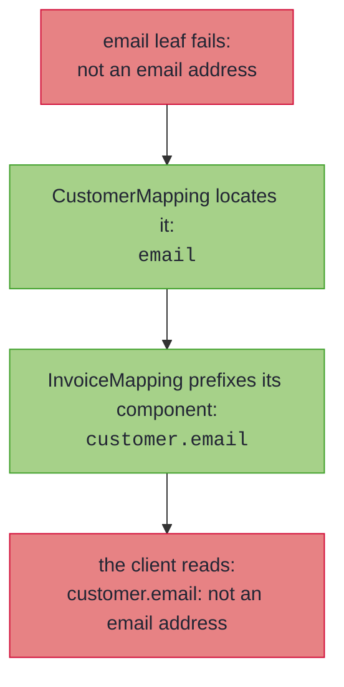
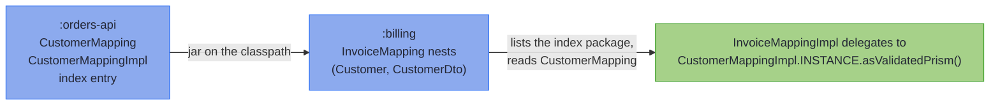

# Nesting, Containers, and Sealed Hierarchies

_Whole mappings plug in wherever a leaf does, so structure composes and error paths compose with it._

Real DTOs are not flat. An order carries a customer, the customer carries an address, the order carries a list of lines, and the domain and wire sides are sealed hierarchies as often as they are single records. All of it maps with the machinery you already have: a nested spec is just a leaf, a container lifts its element's leaf or spec, and a sealed pair dispatches one spec per subtype pair.

~~~admonish info title="What You'll Learn"
- How specs nest automatically, in one compilation or across modules, composing failures into dotted paths
- How a nested domain record spreads across a flat wire with `@Flatten`, and where its failures locate
- How `List`, `Set`, array, `Optional` and `Map` components lift, and what each locates a failure by
- How `@MapKey` converts a map's keys, and when a collapse is silent or a failure
- Why recursion terminates by construction
- Dispatching a mapping over two sealed interfaces, exhaustively in both directions
~~~

~~~admonish example title="See Example Code"
**The code on this page is [RecordMappingBook.java](https://github.com/higher-kinded-j/higher-kinded-j/blob/main/hkj-examples/src/main/java/org/higherkindedj/example/book/mapping/RecordMappingBook.java)** - the page includes it directly, so it is compiled and run by the build.
~~~

## Nesting, containers, and recursion

A component whose two sides are themselves mapped by **another spec** nests automatically, whether that spec is in the same compilation or in a dependency (see [Across modules](#across-modules)), and failures compose into dotted paths:

``` java
{{#include ../../../hkj-examples/src/main/java/org/higherkindedj/example/book/mapping/RecordMappingBook.java:nesting_spec}}

{{#include ../../../hkj-examples/src/main/java/org/higherkindedj/example/book/mapping/RecordMappingBook.java:nesting_usage}}
```

Containers lift the same way, and each one locates a failure by whatever identifies an element *in that container*:

| Component | Lifts through the element's leaf or spec | A failure locates by |
| --- | --- | --- |
| `List<E>` | ✅ | its **index** - `emails.1`, or `customers.1.email` through a nested spec |
| `E[]` | ✅ | its **index**, exactly as a list |
| `Set<E>` | ✅ | the **element's own rendering** - `emails.nope`; a set has no index |
| `Optional<E>` | ✅ | the component itself - there is only one element |
| `Map<K, V>` | ✅ values, and keys with [`@MapKey`](#converting-map-keys) | the **source key** - `attributes.en.email` |

``` java
{{#include ../../../hkj-examples/src/main/java/org/higherkindedj/example/book/mapping/RecordMappingBook.java:widened_spec}}

{{#include ../../../hkj-examples/src/main/java/org/higherkindedj/example/book/mapping/RecordMappingBook.java:widened_usage}}
```

Lifting needs the *same* container on both sides. A `List` against a `Set`, or an array against a `List`, is not a pair: it reports as a plain type mismatch rather than silently changing what the collection promises. A domain `Optional<T>` against a plain nullable wire component `T` is the [`@OptionalBridge`](basics.md#optional-bridge) shape instead. An array of primitives (`int[]`) is copied whole - a `ValidatedPrism` cannot focus a primitive, and a primitive element cannot be null. An array element type must also be able to name its own constructor, since lifting builds a new array: a type variable or a parameterised element (`T[]`, `List<Tag>[]`) is refused, because the generated `T[]::new` is generic array creation.

Locating a set element by its own rendering is the only honest answer available: a set has no index, and its iteration order is not part of its contract, so numbering the elements would name a *different* one on the next run. The value is what identifies the element, so that is what the path says.

A failure deep in the structure surfaces with its full address because each delegating spec prefixes its own component name as the error travels out:



Because nesting is *delegation* (each spec's `Impl` exposes [`asValidatedPrism()`](tiers.md), so a whole mapping plugs in wherever a leaf does), recursion terminates by construction: a self-referential `Tree(String value, List<Tree> children)` maps with an empty spec and round-trips any finite tree.

~~~admonish note title="Keys and set elements are located by `toString()`"
The rendered path uses each key's - or set element's - `toString()`, so one containing a dot looks the same as deeper nesting, and two distinct ones whose renderings collide share a location. The structured `FieldError` path list stays exact regardless, holding the whole rendering as one segment, and every error is still reported.
~~~

### Converting Map keys {#converting-map-keys}

A `Map` component's value leaf is named after the component, like every other leaf. Its keys need a second leaf, and Java forbids two zero-parameter methods sharing that name - so a key leaf carries `@MapKey`, and the annotation names the component it belongs to. Either side may convert alone: a key leaf without a value leaf converts the keys and copies the values.

Without a key leaf, keys can only pass through, so their types must match exactly; a mismatch is a compile error that offers the annotation as the fix.

A failing key locates by the **source** key, so the path names what the caller sent rather than what it parsed to. An entry that is wrong on both sides therefore reports both reasons at that one place.

~~~admonish warning title="Cardinality can collapse"
A collapse needs a **non-injective** leaf - two wire values parsing to one domain value - and such a leaf already breaks the `ValidatedPrism` section law (`parse(s) == Valid(a)` implies `build(a) == s`). [`ValidatedPrismLaws`](../tooling/test_assertions.md#optic-laws) catches it, and [`ValidatedPrism.canonical`](../optics/validated_prism.md) rules it out by construction. So neither case below arises from a lawful leaf, and neither can reach the lossless [`asIso()`](tiers.md) tier, which a leaf already excludes.

Where one does happen, the two containers answer differently because what is lost differs. A `Set` drops the duplicate **silently**: the element that remains is equal to the one dropped, so the set still holds every distinct value it was given - though the two *source* spellings that collapsed (`"1"` and `"01"`, say) can no longer be told apart, which is precisely what the section law forbids. Two `Map` keys parsing to one domain key discard a whole entry, and the discarded value need not equal the surviving one, so that is a **located failure** (`attributes.ab: duplicates an earlier key`).
~~~

---

## Flattening a nested component onto a flat wire

Nesting assumes the wire nests too. Often it does not: the domain keeps an `Address` record, and the wire format, fixed by someone else, carries `street`, `city` and `postcode` as plain fields. No single wire component holds the address, so a leaf cannot map it; `@Flatten` on a marker named after the component spreads it instead:

``` java
{{#include ../../../hkj-examples/src/main/java/org/higherkindedj/example/book/mapping/RecordMappingBook.java:flatten_spec}}

{{#include ../../../hkj-examples/src/main/java/org/higherkindedj/example/book/mapping/RecordMappingBook.java:flatten_usage}}
```

The record's components, spread this way, are the **group**: `street`, `city` and `postcode` here. `build` fills each flat wire component from the group member of the same name. `parse` assembles the record through its own [`Validated.fields()` ladder](../monads/validated_assembly.md) inside the outer one, so every failure accumulates with the rest and locates under the **domain** path: `address.street`, a name the flat wire never sent. That is the [domain-named-paths contract](basics.md#renames-mapfield) reaching a nesting the wire does not have, and it is deliberate: the client learns which part of the address was wrong, not which position in a flat list.

The group is spread by name, and the whole vocabulary applies inside it by name too:

- a `@MapField(to = "addressLine1") String street();` rename points a group member at a differently named wire field,
- a `default ValidatedPrism<String, Postcode> postcode()` leaf converts one, and makes the mapping fallible exactly as a top-level leaf would,
- an `@OptionalBridge` named after a member that is `Optional` [bridges it](basics.md#optional-bridge) to a nullable wire field,
- a member that is itself a record nests through its own spec, and containers lift.

An all-identity group keeps the mapping lossless: `asIso()` survives and reassembles the record on the way back. A mapping carrying a group is nested by other specs like any other, in the same compilation or from a dependency.

Names must be unambiguous, since every wire component takes exactly one source: a group member may not share its name with a domain component or with another group's member (so two components of the same record type cannot both be spread), a derived field may not be named after one, and a wire component named after the flattened component itself must be fed by a rename from another component. Each collision is a compile error naming both sides.

Spreading is one level deep: a record inside the group nests through its own spec against a nested wire component, and a marker naming a group member is refused. Flattening otherwise stays on the full record-record tier for now: a bean-shaped wire, a generic spec, a projection, a sparse `UpdateSpec` and a group wider than one `fields()` ladder are each refused with a diagnostic, not supported yet. On a sparse `UpdateSpec` the refusal reaches a marker the spec declares itself, and one it [inherits](codecs.md#shared-vocabulary-mix-in-interfaces) only when the PATCH bean carries the group's inner properties; an inherited marker the bean does not spread is inert, so one vocabulary still serves a full spec and its PATCH sibling.

---

## Across modules

The spec a component nests through may live in another module. Keep `Customer`, `CustomerDto` and `CustomerMapping` in `:orders-api`, put the invoice pair in `:billing`, and the `InvoiceMapping` from the nesting section does not change: it stays empty, and the generated Impl delegates to the dependency's exactly as it would to a sibling.

<!-- verify -->
```java
// :billing, which depends on :orders-api (Customer, CustomerDto and CustomerMapping live there)
@GenerateMapping
interface InvoiceMapping extends MappingSpec<Invoice, InvoiceDto> {}

// generated InvoiceMappingImpl.parse, the customer leg:
//   .field("customer", hkj$ifPresent(wire.customer(), CustomerMappingImpl.INSTANCE.asValidatedPrism()::parse))
```

There is nothing to configure. The one requirement falls on the dependency: `:orders-api` must be compiled with `hkj-processor` on its processor path, as any module that declares specs must be ([Multi-module builds](../tooling/manual_setup.md#multi-module-builds) has the build-side detail). Every kind of spec comes along. A [threaded or element-mapped](generics.md) spec resolves by the same unification, a [sealed pair](#sealed-hierarchies) dispatches to subtype specs in the dependency, and a [`@GenerateMerge`](merge_envelopes.md) fill delegates the same way.

A [shared vocabulary](codecs.md#shared-vocabulary-mix-in-interfaces) travels too, and is the one thing here that needs no processor on the publishing module: a mix-in is a plain interface rather than a spec, so a module may export one for downstream specs to extend with nothing on its processor path at all (it still compiles against the library its own members name, `hkj-core` for a `ValidatedPrism` leaf, `hkj-api` for a `Getter`). Its renames, bridges and key leaves mean the same thing downstream as at home, because `@MapField`, `@OptionalBridge`, `@MapKey` and `@Flatten` are retained in the class file rather than discarded after compilation. None of the index caveats below apply to a vocabulary: it is found by ordinary inheritance, not through the index at all.

~~~admonish tip title="Why this matters"
The delegation is an ordinary static reference in generated code, resolved at compile time from the dependency's class files: no runtime registry, no reflection, no service file to keep in step. Rename or remove a spec upstream and the downstream build fails at the use site, with the pair named, rather than a request failing later.
~~~

### How a dependency's specs are found

Nothing in a jar says which of its interfaces are mapping specs, and the compiler can list a package but not search a classpath. So the processor keeps an **index**: beside every generated `Impl` of a `MappingSpec` it writes one empty class into the package `org.higherkindedj.mapping.index`, carrying `@MappingIndexEntry` with the spec's name. A downstream compilation lists that package, reads each spec it names from its class file (which carries everything registration needs, type arguments included), and registers it exactly as if it were declared alongside. The entries are not for hand use.



Three rules keep the resolution predictable:

- **Your own spec wins.** A spec in the compilation shadows a classpath spec for the same pair, so adding a dependency never changes a resolution that already worked. The shadowed spec is named in a compiler note; if it is the one you meant, a leaf named after the component delegates to it explicitly.
- **Two dependencies for one pair are ambiguous.** The error is the same `matches more than one mapping spec` as for two specs in one compilation, each candidate listed by its qualified name with `(classpath)`. For a nested component the remedy is a leaf naming the one you mean; a sealed subtype pair has no leaf, so declare the spec yourself and it shadows both.
- **A stale entry is passed over.** An entry naming a spec that is no longer on the classpath describes nothing. One whose spec is present but whose `Impl` is missing (a partial build output, or a jar that dropped it) is never chosen, and a use site that needed the pair is told which dependency to rebuild.

The index is classpath-only. A module with a `module-info` writes no entry and reads none, not supported yet, because the index is one package and the module system allows a package in one module only; the same rule keeps two spec-carrying jars from serving as automatic modules side by side. Across a boundary of that kind, delegate with a leaf calling the other `Impl`'s `asValidatedPrism()`, and give a library bound for a module path the processor option `-Ahkj.mapping.index=false`, which writes no entries and reads none.

---

## Sealed hierarchies

A `MappingSpec` over two **sealed interfaces** dispatches over the permitted subtype pairs, one spec per pair, exhaustively in both directions:

``` java
{{#include ../../../hkj-examples/src/main/java/org/higherkindedj/example/book/mapping/RecordMappingBook.java:sealed_spec}}

// generated PaymentMappingImpl.build:
//   return switch (domain) {
//     case Card v -> CardMappingImpl.INSTANCE.build(v);
//     case Bank v -> BankMappingImpl.INSTANCE.build(v);
//   };
```

A domain subtype without a spec, or a wire subtype nothing produces, is a compile error: the dispatch cannot be partial.

---

~~~admonish info title="Key Takeaways"
* **Nesting is delegation**: any spec's Impl is a leaf (`asValidatedPrism()`), so specs nest automatically and recursion terminates by construction
* **Containers lift**: `List`, `Set` and arrays by element, `Optional` by its element, `Map` by value and (with `@MapKey`) by key; each locates by whatever identifies an element in it
* **Error paths are dotted domain names**: `customers.1.email`, `attributes.en.email`
* **Sealed dispatch is exhaustive both ways**: a missing subtype pair is a compile error, never a runtime surprise
* **Dependencies count as siblings**: a spec compiled into another module nests, dispatches and merges through the classpath index, and your own spec shadows a dependency's for the same pair
* **A flat wire can still nest on the domain side**: `@Flatten` spreads a nested record across flat wire fields by name, and failures locate under the domain path (`address.street`)
~~~

~~~admonish tip title="See Also"
- [Record Mapping Basics](basics.md#null-doctrine) - The null doctrine that also reaches inside containers
- [The Emission Tiers](tiers.md) - What the composed mapping lawfully offers
- [Generic Specs](generics.md) - Nesting for generic records
- [Multi-module builds](../tooling/manual_setup.md#multi-module-builds) - What the build needs when specs span modules
~~~

---

**Previous:** [Standard Codecs and Shared Vocabulary](codecs.md)
**Next:** [The Emission Tiers](tiers.md)
