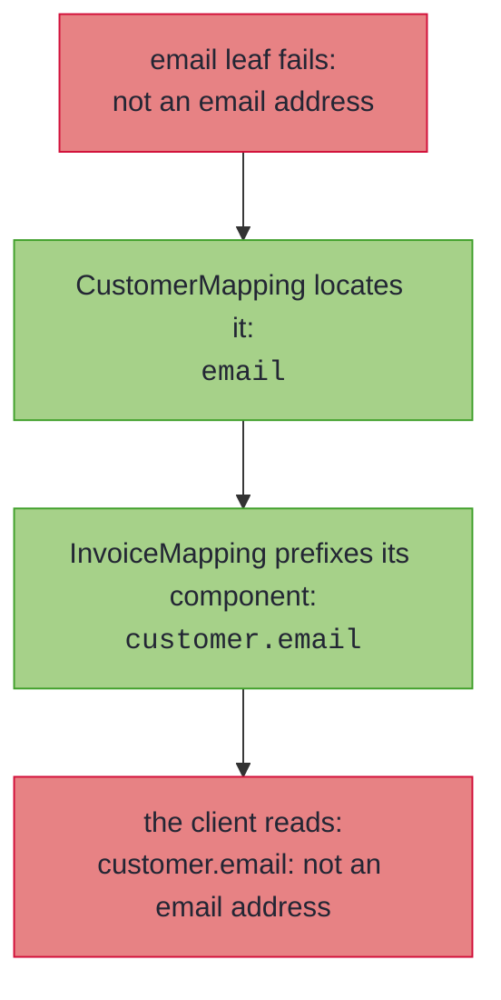

# Nesting, Containers, and Sealed Hierarchies

_Whole mappings plug in wherever a leaf does, so structure composes and error paths compose with it._

Real DTOs are not flat. An order carries a customer, the customer carries an address, the order carries a list of lines, and the domain and wire sides are sealed hierarchies as often as they are single records. All of it maps with the machinery you already have: a nested spec is just a leaf, a container lifts its element's leaf or spec, and a sealed pair dispatches one spec per subtype pair.

~~~admonish info title="What You'll Learn"
- How specs in the same compilation nest automatically, composing failures into dotted paths
- How `List`, `Optional`, and `Map` components lift, and how failing elements are located by index or key
- Why recursion terminates by construction
- Dispatching a mapping over two sealed interfaces, exhaustively in both directions
~~~

~~~admonish example title="See Example Code"
**The code on this page is [RecordMappingBook.java](https://github.com/higher-kinded-j/higher-kinded-j/blob/main/hkj-examples/src/main/java/org/higherkindedj/example/book/mapping/RecordMappingBook.java)** - the page includes it directly, so it is compiled and run by the build.
~~~

## Nesting, containers, and recursion

A component whose two sides are themselves mapped by **another spec in the same compilation** nests automatically, and failures compose into dotted paths:

``` java
{{#include ../../../hkj-examples/src/main/java/org/higherkindedj/example/book/mapping/RecordMappingBook.java:nesting_spec}}

{{#include ../../../hkj-examples/src/main/java/org/higherkindedj/example/book/mapping/RecordMappingBook.java:nesting_usage}}
```

Containers lift the same way:

- `List` and `Optional` components lift through the element's leaf or spec; each failing list element is located by its index, so a bad second element reports as `emails.1` (`customers.1.email` through a nested spec).
- `Map` components lift their **values**; keys pass through untouched, and each entry's failures are located by its key, so a bad value under key `en` reports as `attributes.en.email`.

A failure deep in the structure surfaces with its full address because each delegating spec prefixes its own component name as the error travels out:



Because nesting is *delegation* (each spec's `Impl` exposes [`asValidatedPrism()`](tiers.md), so a whole mapping plugs in wherever a leaf does), recursion terminates by construction: a self-referential `Tree(String value, List<Tree> children)` maps with an empty spec and round-trips any finite tree.

~~~admonish note title="Map keys are located by `toString()`"
The rendered path uses each key's `toString()`, so a key containing a dot looks the same as deeper nesting, and two distinct keys whose renderings collide share a location. The structured `FieldError` path list stays exact regardless, holding the whole key as one segment, and every error is still reported.
~~~

---

## Sealed hierarchies

A `MappingSpec` over two **sealed interfaces** dispatches over the permitted subtype pairs, one spec per pair, exhaustively in both directions:

``` java
{{#include ../../../hkj-examples/src/main/java/org/higherkindedj/example/book/mapping/RecordMappingBook.java:sealed_spec}}

// generated PaymentMappingImpl.build:
//   return switch (domain) {
//     case Card v -> CardMappingImpl.INSTANCE.build(v);
//     case Bank v -> BankMappingImpl.INSTANCE.build(v);
//   };
```

A domain subtype without a spec, or a wire subtype nothing produces, is a compile error: the dispatch cannot be partial.

---

~~~admonish info title="Key Takeaways"
* **Nesting is delegation**: any spec's Impl is a leaf (`asValidatedPrism()`), so specs nest automatically and recursion terminates by construction
* **Containers lift**: `List`/`Optional` by element, `Map` by value; failures are located by index or key
* **Error paths are dotted domain names**: `customers.1.email`, `attributes.en.email`
* **Sealed dispatch is exhaustive both ways**: a missing subtype pair is a compile error, never a runtime surprise
~~~

~~~admonish tip title="See Also"
- [Record Mapping Basics](basics.md#null-doctrine) - The null doctrine that also reaches inside containers
- [The Emission Tiers](tiers.md) - What the composed mapping lawfully offers
- [Generic Specs](generics.md) - Nesting for generic records
~~~

---

**Previous:** [Standard Codecs and Shared Vocabulary](codecs.md)
**Next:** [The Emission Tiers](tiers.md)
