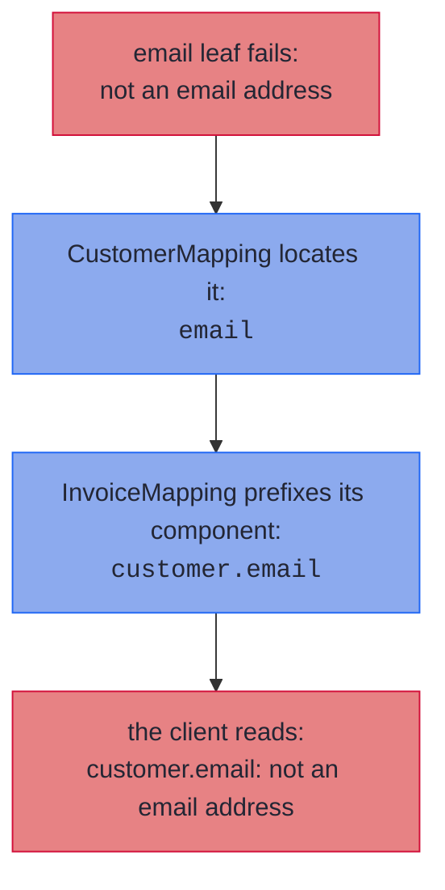

# Nesting, Containers, and Sealed Hierarchies

_Whole mappings plug in wherever a leaf does, so structure composes and error paths compose with it._

Real DTOs are not flat. An order carries a customer, the customer carries an address, the order carries a list of lines, and the domain and wire sides are sealed hierarchies as often as they are single records. All of it maps with the machinery you already have: a nested spec is just a leaf, a container lifts its element's leaf or spec, and a sealed pair dispatches one spec per subtype pair.

~~~admonish info title="What You'll Learn"
- How specs nest automatically, in one compilation or across modules, composing failures into dotted paths
- How a nested domain record spreads across a flat wire with `@Flatten`, and where its failures locate
- How `List`, `Set`, array, `Optional` and `Map` components lift, and what each locates a failure by
- How an optional nested object or list, `null` on the wire, maps through its own spec
- How `@MapKey` converts a map's keys, and when a collapse is silent or a failure
- Why recursion terminates by construction
- Dispatching a mapping over two sealed interfaces, exhaustively in both directions
~~~

~~~admonish example title="See Example Code"
**The code on this page is [RecordMappingBook.java](https://github.com/higher-kinded-j/higher-kinded-j/blob/main/hkj-examples/src/main/java/org/higherkindedj/example/book/mapping/RecordMappingBook.java)** - the page includes it directly, so it is compiled and run by the build.
~~~

## Nesting, containers, and recursion {#nesting-containers-and-recursion}

A component whose two sides are themselves mapped by **another spec** nests automatically, whether that spec is in the same compilation or in a dependency (see [Across modules](#across-modules)), and failures compose into dotted paths:

``` java
{{#include ../../../hkj-examples/src/main/java/org/higherkindedj/example/book/mapping/RecordMappingBook.java:nesting_spec}}

{{#include ../../../hkj-examples/src/main/java/org/higherkindedj/example/book/mapping/RecordMappingBook.java:nesting_usage}}
```

Containers lift the same way, and each one locates a failure by whatever identifies an element *in that container*:

| Component | Lifts through the element's leaf or spec | A failure locates by |
| --- | --- | --- |
| `List<E>` | ✅ | its **index**: `emails.1`, or `customers.1.email` through a nested spec |
| `E[]` | ✅ | its **index**, exactly as a list |
| `Set<E>` | ✅ | the **element's own rendering** (`emails.nope`), since a set has no index |
| `Optional<E>` | ✅ | the component itself, since there is only one element |
| `Map<K, V>` | ✅ values, and keys with [`@MapKey`](#converting-map-keys) | the **source key**: `attributes.en.email` |

``` java
{{#include ../../../hkj-examples/src/main/java/org/higherkindedj/example/book/mapping/RecordMappingBook.java:widened_spec}}

{{#include ../../../hkj-examples/src/main/java/org/higherkindedj/example/book/mapping/RecordMappingBook.java:widened_usage}}
```

Lifting needs the *same* container on both sides. [What lifts, and what does not](rules.md#what-lifts) has the exact rule, and the refusal offers the declaration that would lift. A domain `Optional<T>` against a plain nullable wire component `T` is the [`@OptionalBridge`](absence.md#optional-bridge) shape instead, and it [nests through the element's spec](#optional-nested-objects) all the same.

Locating a set element by its own rendering is the only honest answer available: a set has no index, and its iteration order is not part of its contract, so numbering the elements would name a *different* one on the next run. The value is what identifies the element, so that is what the path says.

A failure deep in the structure surfaces with its full address because each delegating spec prefixes its own component name as the error travels out:



Because nesting is *delegation* (a full mapping's `Impl` exposes [`asValidatedPrism()`](tiers.md), and a [one-directional bean mapping](beans.md#one-directional-beans) the half it has, so a whole mapping plugs in wherever a leaf does), recursion terminates by construction: a self-referential `Tree(String value, List<Tree> children)` maps with an empty spec and round-trips any finite tree.

~~~admonish warning title="A same-typed container crosses as a copy"
A same-typed component declared as a `List`, `Set`, `Collection`, `Map` or `Optional` crosses as an unmodifiable copy, not as the instance the wire or the domain holds. Code that adds to a built wire's list afterwards throws `UnsupportedOperationException`: set a new list, or copy it first. An array crosses as a clone and compares by reference, so a record with an array component and no `equals` of its own is not equal to its own round trip. [Same-typed containers cross as copies](rules.md#same-typed-containers-cross-as-copies) has the precise rule.
~~~

~~~admonish note title="Keys and set elements are located by `toString()`"
The rendered path uses the `toString()` of each key, or of each set element, so one containing a dot looks the same as deeper nesting, and two distinct ones whose renderings collide share a location. The structured `FieldError` path list stays exact regardless, holding the whole rendering as one segment, and every error is still reported.
~~~

~~~admonish question title="Checkpoint: where does each failure locate?" id="check-structure-paths"
A client sends `CrewMapping` a set holding `"nope"`, an array holding `["ada@example.org", "also-nope"]`, and a map with the single entry `"bad-key": "a note"`. Every bad value fails the same email leaf.

Write the three paths the client reads back, then say which one could mislead them.
~~~

~~~admonish success title="Answer and why" collapsible=true id="check-structure-paths-answer"
**`members.nope`, `reserves.1` and `notes.bad-key`.** A set has no index, so it locates by the element's own rendering; an array locates by position, like a list; a map locates by the key as the client sent it.

``` java
{{#include ../../../hkj-examples/src/test/java/org/higherkindedj/example/book/mapping/RecordMappingBookLawsTest.java:check_container_paths}}
```

The misleading one is the set. `members.nope` names a value, not a position, so a client reading paths as positions will look for a field called `nope`. A key containing a dot misleads the same way, which is why the structured segments stay exact while the rendered path does not.

Where this lives: [Nesting, containers, and recursion](#nesting-containers-and-recursion).
~~~

### Optional nested objects {#optional-nested-objects}

When a JSON client leaves an object out, or sends `null` for it, the binder leaves a plain nullable `CustomerDto` where the domain holds an `Optional<Customer>`. That pair is the [`@OptionalBridge`](absence.md#optional-bridge) shape, and it nests like every other: when a spec maps the element pair, the marker is all the component needs.

``` java
{{#include ../../../hkj-examples/src/main/java/org/higherkindedj/example/book/mapping/RecordMappingBook.java:bridge_nesting_spec}}

{{#include ../../../hkj-examples/src/main/java/org/higherkindedj/example/book/mapping/RecordMappingBook.java:bridge_nesting_usage}}
```

`build` writes the nested build of a present value and `null` for an empty one. `parse` reads `null` as empty and hands a present value to the nested spec, so its failures locate under the component, exactly as through a `List`. The usual order holds: a bridged [element leaf](absence.md#optional-bridge) on the component wins over the spec, and two specs for the pair are ambiguous until such a leaf delegates to the one you mean. A bean wire bridges automatically, so there the same pair nests with no marker at all.

A bridged container lifts the same way. An optional JSON array arrives as a nullable `List<CustomerDto>`, and where an absent list and an empty one mean different things, the domain holds an `Optional<List<Customer>>`. The marker is again all it needs:

``` java
{{#include ../../../hkj-examples/src/main/java/org/higherkindedj/example/book/mapping/RecordMappingBook.java:bridge_container_spec}}

{{#include ../../../hkj-examples/src/main/java/org/higherkindedj/example/book/mapping/RecordMappingBook.java:bridge_container_usage}}
```

A present list lifts element by element, exactly as a `List<Customer>` component does, so a failure locates at its index, a `null` element is still a located `must not be null`, and an empty list parses to a present, empty `Optional`. `Set`, arrays and `Map` values lift alike, an element leaf over the element types wins over the spec, and a [`@MapKey`](#converting-map-keys) leaf converts the keys of a bridged `Map`. A bridged container whose elements nothing converts is refused naming the element pair, so the fix it offers is an element leaf or a spec rather than a leaf over the whole container. Where an empty list already says there are none, a plain `List<Customer>` component is simpler, and needs no marker.

### Converting Map keys {#converting-map-keys}

A `Map` component's value leaf is named after the component, like every other leaf. Its keys need a second leaf, and Java forbids two zero-parameter methods sharing that name, so a key leaf carries `@MapKey`, and the annotation names the component it belongs to. Either side may convert alone: a key leaf without a value leaf converts the keys and copies the values.

A leaf over the whole `Map` wins over both, so a key leaf beside it has nothing to convert: [a key leaf beside a whole-map leaf](rules.md#key-leaf-beside-a-whole-map-leaf) says when that is refused.

Without a key leaf, keys can only pass through, so their types must match exactly; a mismatch is a compile error that offers the annotation as the fix.

A failing key locates by the **source** key, so the path names what the caller sent rather than what it parsed to. An entry that is wrong on both sides therefore reports both reasons at that one place.

~~~admonish warning title="Cardinality can collapse"
A collapse needs a **non-injective** leaf, two wire values parsing to one domain value, and such a leaf already breaks the `ValidatedPrism` section law (`parse(s) == Valid(a)` implies `build(a) == s`). [`ValidatedPrismLaws`](../tooling/test_assertions.md#optic-laws) catches it, and [`ValidatedPrism.canonical`](../optics/validated_prism.md) rules it out by construction. So neither case below arises from a lawful leaf, and neither can reach the lossless [`asIso()`](tiers.md) tier, which a leaf already excludes.

Where one does happen, the two containers answer differently because what is lost differs. A `Set` drops the duplicate **silently**: the element that remains is equal to the one dropped, so the set still holds every distinct value it was given, though the two *source* spellings that collapsed (`"1"` and `"01"`, say) can no longer be told apart, which is precisely what the section law forbids. Two `Map` keys parsing to one domain key discard a whole entry, and the discarded value need not equal the surviving one, so that is a **located failure** (`attributes.ab: duplicates an earlier key`).
~~~

---

## Flattening a nested component onto a flat wire {#flattening-a-nested-component-onto-a-flat-wire}

Nesting assumes the wire nests too. Often it does not: the domain keeps an `Address` record, and the wire format, fixed by someone else, carries `street`, `city` and `postcode` as plain fields. No single wire component holds the address, so a leaf cannot map it; `@Flatten` on a marker named after the component spreads it instead:

``` java
{{#include ../../../hkj-examples/src/main/java/org/higherkindedj/example/book/mapping/RecordMappingBook.java:flatten_spec}}

{{#include ../../../hkj-examples/src/main/java/org/higherkindedj/example/book/mapping/RecordMappingBook.java:flatten_usage}}
```

The record's components, spread this way, are the **group**: `street`, `city` and `postcode` here. `build` fills each flat wire component from the group member of the same name. `parse` assembles the record through its own [`Validated.fields()` ladder](../monads/validated_assembly.md) inside the outer one, so every failure accumulates with the rest and locates under the **domain** path: `address.street`, a name the flat wire never sent. That is the [domain-named-paths contract](basics.md#renames-mapfield) reaching a nesting the wire does not have, and it is deliberate: the client learns which part of the address was wrong, not which position in a flat list.

The group is spread by name, and the whole vocabulary applies inside it by name too:

- a `@MapField(to = "addressLine1") String street();` rename points a group member at a differently named wire field,
- a `default ValidatedPrism<String, Postcode> postcode()` leaf converts one, and makes the mapping fallible exactly as a top-level leaf would,
- an `@OptionalBridge` named after a member that is `Optional` [bridges it](absence.md#optional-bridge) to a nullable wire field,
- a member that is itself a record nests through its own spec, and containers lift.

An all-identity group keeps the mapping lossless: `asIso()` survives and reassembles the record on the way back. A mapping carrying a group is nested by other specs like any other, in the same compilation or from a dependency.

Flattening onto a bean-shaped wire, a generic spec, a projection or a sparse `UpdateSpec` is not supported yet. [Names in a flattened group](rules.md#names-in-a-flattened-group) and [where a flattened component can appear](rules.md#where-flattening-applies) have the precise rules.

---

## Across modules {#across-modules}

The spec a component nests through may live in another module. Keep `Customer`, `CustomerDto` and `CustomerMapping` in `:orders-api`, put the invoice pair in `:billing`, and the `InvoiceMapping` from the nesting section does not change: it stays empty, and the generated Impl delegates to the dependency's exactly as it would to a sibling.

<!-- verify -->
```java
// :billing, which depends on :orders-api (Customer, CustomerDto and CustomerMapping live there)
@GenerateMapping
interface InvoiceMapping extends MappingSpec<Invoice, InvoiceDto> {}

// generated InvoiceMappingImpl.parse, the customer leg:
//   .field("customer", hkj$ifPresent(wire.customer(), CustomerMappingImpl.INSTANCE.asValidatedPrism()::parse))
```

There is nothing to configure. The one requirement falls on the dependency: `:orders-api` must be compiled with `hkj-processor` on its processor path, as any module that declares specs must be ([Multi-module builds](../tooling/manual_setup.md#multi-module-builds) has the build-side detail). Every kind of spec comes along. A [threaded or element-mapped](generics.md) spec resolves by the same unification, a [sealed pair](#sealed-hierarchies) dispatches to subtype specs in the dependency, and a [`@GenerateMerge`](merge_envelopes.md) fill delegates the same way.

A [shared vocabulary](codecs.md#shared-vocabulary-mix-in-interfaces) travels too, and is the one thing here that needs no processor on the publishing module: a mix-in is a plain interface rather than a spec, so a module may export one for downstream specs to extend with nothing on its processor path at all (it still compiles against the library its own members name, `hkj-core` for a `ValidatedPrism` leaf, `hkj-api` for a `Getter`). Its renames, bridges and key leaves mean the same thing downstream as at home, because `@MapField`, `@OptionalBridge`, `@MapKey` and `@Flatten` are retained in the class file rather than discarded after compilation.

~~~admonish tip title="Why this matters"
The delegation is an ordinary static reference in generated code, resolved at compile time from the dependency's class files: no runtime registry, no reflection, no service file to keep in step. Rename or remove a spec upstream and the downstream build fails at the use site, with the pair named, rather than a request failing later.
~~~

The processor finds a dependency's specs through a classpath index, and your own spec always wins over a dependency's for the same pair, so adding a dependency never changes a mapping that already worked. [How a dependency's specs are found](rules.md#how-a-dependencys-specs-are-found) has the index and the other three rules. Resolving a dependency's specs on the module path is not supported yet: keep spec-carrying jars on the classpath, or delegate with a leaf calling the other `Impl`'s `asValidatedPrism()`.

---

## Sealed hierarchies {#sealed-hierarchies}

A `MappingSpec` over two **sealed interfaces** dispatches over the permitted subtype pairs, one spec per pair, exhaustively in both directions:

``` java
{{#include ../../../hkj-examples/src/main/java/org/higherkindedj/example/book/mapping/RecordMappingBook.java:sealed_spec}}

// generated PaymentMappingImpl.build:
//   return switch (domain) {
//     case Card v -> CardMappingImpl.INSTANCE.build(v);
//     case Bank v -> BankMappingImpl.INSTANCE.build(v);
//   };
```

A domain subtype without a spec, or a wire subtype nothing produces, is a compile error: the dispatch cannot be partial. Each subtype must also be one a spec can map: a record or a sealed interface, or on the wire side a bean as well. A generic subtype, an enum, or any other class is not supported yet.

---

~~~admonish info title="Key Takeaways"
* **Nesting is delegation**: any spec's Impl is a leaf (`asValidatedPrism()`, or the one half a one-directional bean mapping has), so specs nest automatically and recursion terminates by construction
* **Containers lift**: `List`, `Set` and arrays by element, `Optional` by its element, `Map` by value and (with `@MapKey`) by key; each locates by whatever identifies an element in it
* **Error paths are dotted domain names**: `customers.1.email`, `attributes.en.email`
* **Sealed dispatch is exhaustive both ways**: a missing subtype pair is a compile error, never a runtime surprise
* **Dependencies count as siblings**: a spec compiled into another module nests, dispatches and merges through the classpath index, and your own spec shadows a dependency's for the same pair
* **A flat wire can still nest on the domain side**: `@Flatten` spreads a nested record across flat wire fields by name, and failures locate under the domain path (`address.street`)
~~~

~~~admonish tip title="See Also"
- [Record Mapping Basics](basics.md#null-doctrine): The null doctrine that also reaches inside containers
- [What Your Spec Generates](tiers.md): What the composed mapping lawfully offers
- [Generic Specs](generics.md): Nesting for generic records
- [Multi-module builds](../tooling/manual_setup.md#multi-module-builds): What the build needs when specs span modules
~~~

---

**Previous:** [Absent Fields and Record Invariants](absence.md)
**Next:** [Capstone: One 422, Every Bad Field](capstone.md)
