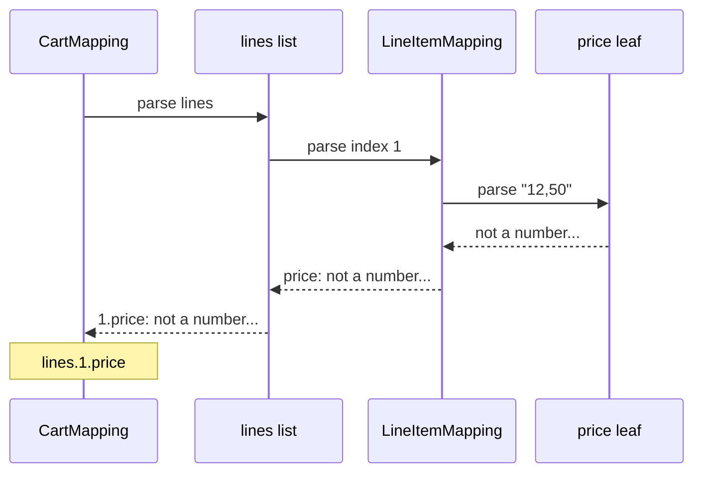
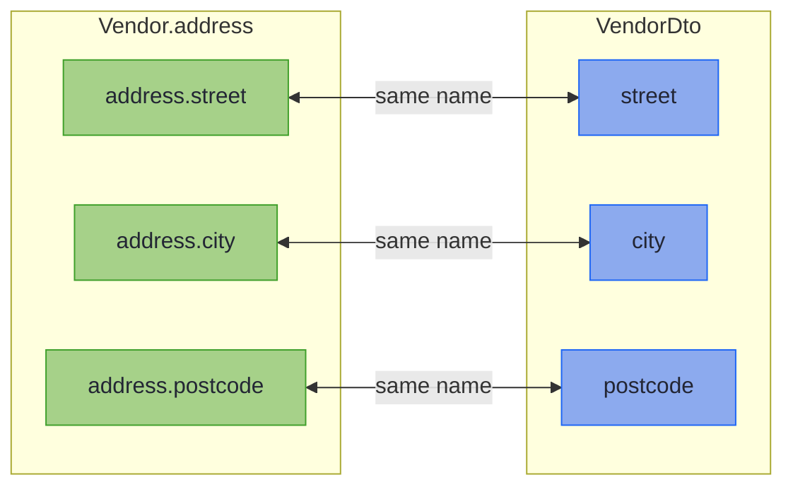
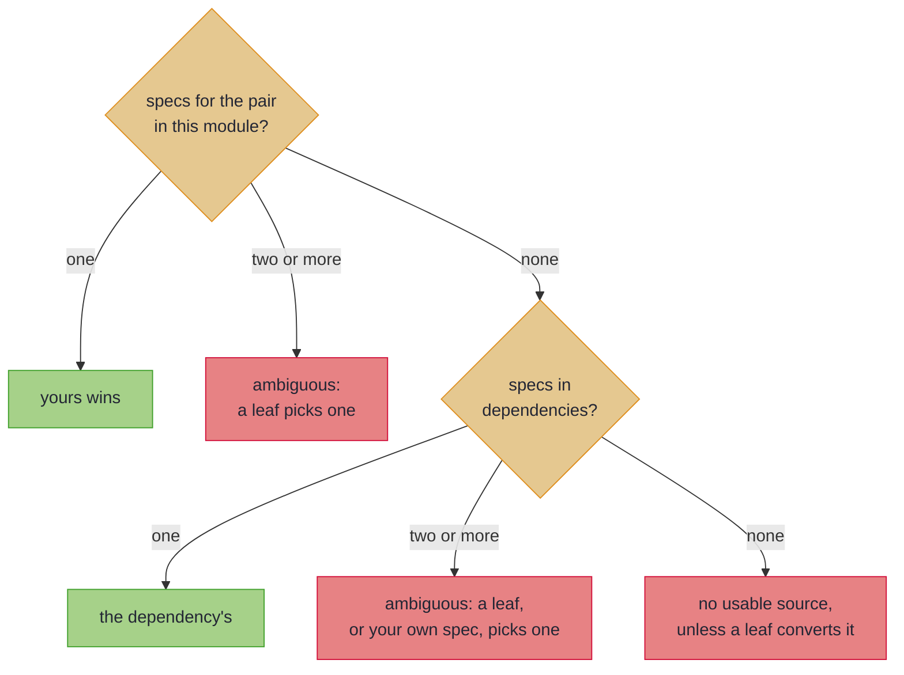

# Nesting, Containers, and Sealed Hierarchies

_A record that holds records, lists of them, or a sealed type maps through the specs you already write, and every failure names its full path._

Real DTOs are not flat: an order carries a customer and a list of lines, and a payment is a card or a bank transfer. This page walks those three first, a nested spec, a list of them and a sealed dispatch, all through machinery you already have. Optional objects, other containers, map keys, flattening and specs from other modules follow, for when a pair needs them.

~~~admonish info title="What You'll Learn"
- Nest a spec in another, in a `List`, or behind a sealed dispatch, and predict the path each failure reports
- Predict what happens to a mapped `List` after `parse` or `build` hands it over
~~~

~~~admonish example title="See Example Code"
**The code on this page is [StructureBook.java](https://github.com/higher-kinded-j/higher-kinded-j/blob/main/hkj-examples/src/main/java/org/higherkindedj/example/book/mapping/StructureBook.java) and its [StructureBookTest.java](https://github.com/higher-kinded-j/higher-kinded-j/blob/main/hkj-examples/src/test/java/org/higherkindedj/example/book/mapping/StructureBookTest.java)** - the page includes them directly, so they are compiled and run by the build.
~~~

## Nesting a spec, and a list of them {#nesting-containers-and-recursion}

When a component's two types are a pair another spec maps, the outer spec uses that spec. `CustomerMapping`, from [Validated leaves](basics.md#validated-leaves), maps `Customer` and `CustomerDto`, so `InvoiceMapping` stays empty, and a failure inside comes back under the component's name. Forget the inner spec, and the processor refuses the outer one with [`has no usable source`](compiler_errors.md#no-usable-source), offering a spec.

``` java
{{#include ../../../hkj-examples/src/main/java/org/higherkindedj/example/book/mapping/StructureBook.java:nesting_spec}}

{{#include ../../../hkj-examples/src/main/java/org/higherkindedj/example/book/mapping/StructureBook.java:nesting_usage}}
```

A `List` of such pairs **lifts** the element's spec, which means it parses every element through it. Think `dtos.stream().map(mapper::toDomain).toList()`, except that a bad element does not stop the others, and each failure keeps its index. Here the second line's price fails its leaf:

``` java
{{#include ../../../hkj-examples/src/main/java/org/higherkindedj/example/book/mapping/StructureBook.java:list_spec}}

{{#include ../../../hkj-examples/src/main/java/org/higherkindedj/example/book/mapping/StructureBook.java:list_usage}}
```

That is the `lines.1.price` error from the [chapter's opening response](ch_intro.md#what-you-get-instead):



In words: the leaf reports only its message, and on the way out each level puts its own name in front, first `price`, then the index `1`, then `lines`.

Indexes count from zero, so `lines.1` is the second line. An array lifts exactly as a `List` does, and a `null` element is reported at its index, under the [null rule](basics.md#null-doctrine). Lifting needs the same container on both sides: [What lifts, and what does not](rules.md#what-lifts) has the exact rule.

~~~admonish warning title="Not checked for you: a mapped `List`, `Set` or `Map` is unmodifiable"
A component declared as a `List`, `Set` or `Map` comes out of `parse` and `build` unmodifiable, whether its elements went through a spec, like `lines`, or needed no conversion, like a `List<String> tags`. Adding to one throws `UnsupportedOperationException`, so copy it first. One that needs no conversion is copied both ways, so neither side holds the other's list. A component declared as `ArrayList`, or any other subtype, is shared as it is. [Same-typed containers cross as copies](rules.md#same-typed-containers-cross-as-copies) has the precise rule.
~~~

---

## Sealed hierarchies {#sealed-hierarchies}

A `MappingSpec` over two **sealed interfaces** dispatches over the permitted subtypes, one spec per subtype pair, in both directions:

``` java
{{#include ../../../hkj-examples/src/main/java/org/higherkindedj/example/book/mapping/StructureBook.java:sealed_spec}}

// generated PaymentMappingImpl.build:
//   return switch (domain) {
//     case Card v -> CardMappingImpl.INSTANCE.build(v);
//     case Bank v -> BankMappingImpl.INSTANCE.build(v);
//   };
```

The dispatch hands each value to its subtype's spec and adds nothing to the path, since the JSON has no key for the subtype:

``` java
{{#include ../../../hkj-examples/src/main/java/org/higherkindedj/example/book/mapping/StructureBook.java:sealed_usage}}
```

A leaf for `pan` goes on `CardMapping`, because a sealed spec has no components to bind one to ([`has no meaning on a sealed mapping`](compiler_errors.md#no-meaning-on-a-sealed-mapping)). The dispatch cannot be partial. The processor names a missing subtype, with [`has no mapping spec`](compiler_errors.md#subtype-has-no-spec) on the domain side and [`is never produced`](compiler_errors.md#subtype-never-produced) on the wire. A subtype must be a record or a sealed interface, or on the wire a bean as well. A generic subtype, an enum or any other class is not supported yet.

~~~admonish warning title="Not checked for you: Jackson must be told how to tell the subtypes apart"
Jackson binds the request before `parse` runs, and cannot construct an interface. Without type information, Jackson fails with a type-definition error, which Spring maps to no status by default. The exception escapes unhandled, and the server answers 500 with no field path. Annotate the wire interface as `PaymentDto` is: `@JsonTypeInfo(use = JsonTypeInfo.Id.DEDUCTION)` with `@JsonSubTypes` naming each record, when each subtype's fields differ. Where they overlap, use `Id.NAME` with a `type` property.
~~~

~~~admonish tip title="You can ship now"
You can now map records that hold other records, lists of them, and sealed hierarchies, with every failure located by its full path. A nested object the client may leave out takes [`@OptionalBridge`](#optional-nested-objects). The rest of this page, [other containers](#other-containers), [map keys](#converting-map-keys), [flattening](#flattening-a-nested-component-onto-a-flat-wire) and [specs from other modules](#across-modules), is for when a pair needs them.
~~~

~~~admonish question title="Checkpoint: where does each failure locate?" id="check-structure-paths"
`CheckoutMapping` maps a `List` of the sealed payments:

``` java
{{#include ../../../hkj-examples/src/main/java/org/higherkindedj/example/book/mapping/StructureBook.java:checkout_spec}}
```

A client sends three payments: a card with no card number (`pan`), a valid bank transfer, and a bank transfer with no IBAN. What does `CheckoutMappingImpl.INSTANCE.parse` report?

1. `payments.0.pan: must not be null` only, since the list stops at its first bad element
2. `payments.1.pan` and `payments.3.iban`, each `must not be null`
3. `payments.0.Card.pan` and `payments.2.Bank.iban`, each `must not be null`
4. `payments.0.pan` and `payments.2.iban`, each `must not be null`
~~~

~~~admonish success title="Answer and why" collapsible=true id="check-structure-paths-answer"
**4.** A bad element does not stop the others, and indexes count from zero, so the first and third payments are `0` and `2`. The dispatch adds no segment, so each path goes straight from the index to the field:

``` java
{{#include ../../../hkj-examples/src/test/java/org/higherkindedj/example/book/mapping/StructureBookTest.java:check_payment_path}}
```

Where this lives: [Nesting a spec, and a list of them](#nesting-containers-and-recursion), [Sealed hierarchies](#sealed-hierarchies) and [Null has an address](basics.md#null-doctrine).
~~~

~~~admonish question title="Checkpoint: whose list is it?" id="check-structure-copy"
`Memo` and `MemoDto` both hold a `List<String> tags`, and `MemoMapping` is empty:

``` java
{{#include ../../../hkj-examples/src/main/java/org/higherkindedj/example/book/mapping/StructureBook.java:memo_spec}}
```

A controller parses a `MemoDto` whose `tags` is the `ArrayList` Jackson bound, holding `"vip"`. A later filter clears that `ArrayList`. What does the parsed memo's `tags()` hold then, and what does `memo.tags().add("urgent")` do?

1. Nothing, and the add succeeds
2. `"vip"`, and the add succeeds
3. `"vip"`, and the add throws `UnsupportedOperationException`
4. Nothing, and the add throws `UnsupportedOperationException`
~~~

~~~admonish success title="Answer and why" collapsible=true id="check-structure-copy-answer"
**3.** `tags` is declared `List` and needs no conversion, so `parse` copies it, and the copy is unmodifiable. Clearing the request's list cannot reach the memo, and adding to the memo's list throws:

``` java
{{#include ../../../hkj-examples/src/test/java/org/higherkindedj/example/book/mapping/StructureBookTest.java:check_copy}}
```

Build a new `Memo` with the tags you want, or copy them first with `new ArrayList<>(memo.tags())`.

Where this lives: [Nesting a spec, and a list of them](#nesting-containers-and-recursion).
~~~

---

## Optional nested objects {#optional-nested-objects}

When a client leaves an object out, or sends `null` for it, the wire holds a nullable `CustomerDto` where the domain holds an `Optional<Customer>`. That is the [`@OptionalBridge`](absence.md#optional-bridge) shape, and when a spec maps the pair, the marker is all the component needs:

``` java
{{#include ../../../hkj-examples/src/main/java/org/higherkindedj/example/book/mapping/StructureBook.java:bridge_nesting_spec}}

{{#include ../../../hkj-examples/src/main/java/org/higherkindedj/example/book/mapping/StructureBook.java:bridge_nesting_usage}}
```

`parse` reads `null` as empty, and hands a present value to the nested spec, so its failures locate under the component. `build` writes the nested build of a present value, and `null` for an empty one.

A bridged list lifts the same way. Where an absent list and an empty one mean different things, the domain holds an `Optional<List<Customer>>`, and the marker is again all it needs:

``` java
{{#include ../../../hkj-examples/src/main/java/org/higherkindedj/example/book/mapping/StructureBook.java:bridge_container_spec}}

{{#include ../../../hkj-examples/src/main/java/org/higherkindedj/example/book/mapping/StructureBook.java:bridge_container_usage}}
```

An empty list parses to a present, empty `Optional`, and [What converts a bridged value](rules.md#what-converts-a-bridged-value) covers every bridged container. Where an empty list already says there are none, a plain `List<Customer>` is simpler.

---

## Other containers, and recursion {#other-containers}

A `Set`, an array, an `Optional` and a `Map` lift like a `List`. Each locates a failure by whatever identifies an element in that container:

| Component | Lifts through the element's leaf or spec | A failure locates by |
| --- | --- | --- |
| `List<E>` | ✅ | its **index**: `emails.1`, or `customers.1.email` through a nested spec |
| `E[]` | ✅ | its **index**, exactly as a list |
| `Set<E>` | ✅ | the **element's own rendering** (`emails.nope`), since a set has no index |
| `Optional<E>` on both sides | ✅ | the component itself, since there is only one element |
| `Map<K, V>` | ✅ values, and keys with [`@MapKey`](#converting-map-keys) | the **source key**: `attributes.en.email` |

``` java
{{#include ../../../hkj-examples/src/main/java/org/higherkindedj/example/book/mapping/StructureBook.java:widened_spec}}

{{#include ../../../hkj-examples/src/main/java/org/higherkindedj/example/book/mapping/StructureBook.java:widened_usage}}
```

A domain `Optional` against a plain nullable wire component is the [bridge](#optional-nested-objects) instead. A set has no index or reliable order, so the path names the element by its value. Keys and set elements render by `toString()`, so a dot inside one reads like deeper nesting, and two that render alike share a location, though every error is still reported. `FieldError.path()`, the `segments` array in a 422, keeps each as one segment.

An array that needs no conversion crosses as a clone. A record compares an array by reference, so a record with an array and no `equals` of its own is not equal to its own round trip.

The generated Impl calls a nested spec as it would a leaf, through its `asValidatedPrism()`, so recursion needs nothing special: a self-referential `Tree(String value, List<Tree> children)` maps with an empty spec. A [one-directional bean mapping](beans.md#one-directional-beans) nests for the direction it has.

### Converting Map keys {#converting-map-keys}

A `Map` component's value leaf takes the component's name, so a key leaf carries `@MapKey` naming its component instead, as `noteKey()` does in `CrewMapping`. Keys and values convert independently. Without a key leaf the key types must match exactly, and the processor refuses a mismatch, offering the annotation.

A failing key locates by the **source** key, the one the client sent, and an entry whose key and value both fail reports both there. A leaf over the whole `Map` wins over both: [a key leaf beside a whole-map leaf](rules.md#key-leaf-beside-a-whole-map-leaf) says when that is refused.

~~~admonish warning title="Not checked for you: a set silently drops a collapsed element"
A leaf that parses two wire values to one domain value (`"1"` and `"01"`, say) breaks the [section law](../optics/validated_prism.md#laws): an accepted wire value must rebuild to exactly itself. [`ValidatedPrismLaws`](../tooling/test_assertions.md#optic-laws) catches such a leaf, and [`ValidatedPrism.canonical`](../optics/validated_prism.md) rules it out. Where one slips through, a `Set` drops the duplicate silently. Two collapsed `Map` keys would lose a whole entry, so they are a located failure: `attributes.ab: duplicates an earlier key`.
~~~

---

## Flattening a nested component onto a flat wire {#flattening-a-nested-component-onto-a-flat-wire}

Nesting assumes the wire nests too. When a wire fixed by someone else carries an address as plain `street`, `city` and `postcode` fields, no single wire component holds it, so no leaf can map it. `@Flatten` on a marker named after the component spreads it instead:

``` java
{{#include ../../../hkj-examples/src/main/java/org/higherkindedj/example/book/mapping/StructureBook.java:flatten_spec}}

{{#include ../../../hkj-examples/src/main/java/org/higherkindedj/example/book/mapping/StructureBook.java:flatten_usage}}
```



In words: each member of the address pairs with the flat field of the same name, so a bad `street` comes back as `address.street`.

The record's components, spread this way, are the **group**. `parse` builds the `Address` from those fields, with their failures accumulating beside the vendor's, at the domain path `address.street`. The flat wire never sent that name, but like a [rename](basics.md#renames-mapfield), a path always uses domain names.

The vocabulary applies inside the group by name:

- a `@MapField` rename points a member at a differently named wire field
- a leaf converts a member, exactly as at the top level
- an [`@OptionalBridge`](absence.md#optional-bridge) bridges an `Optional` member
- a member that is itself a record nests through its own spec, and containers lift

A group whose members all copy as they are keeps [`asIso()`](tiers.md), and a mapping carrying a group nests like any other. Flattening onto a bean wire, a generic spec, a projection or a sparse `UpdateSpec` is not supported yet: [Where a flattened component can appear](rules.md#where-flattening-applies) and [Names in a flattened group](rules.md#names-in-a-flattened-group) have the rules.

---

## Across modules {#across-modules}

The spec a component nests through may live in another module. Keep the customer pair and `CustomerMapping` in `:orders-api` and the invoice pair in `:billing`, and `InvoiceMapping` still stays empty: its Impl delegates to the dependency's as it would to a sibling.

<!-- verify -->
```java
// :billing, which depends on :orders-api (Customer, CustomerDto and CustomerMapping live there)
@GenerateMapping
interface InvoiceMapping extends MappingSpec<Invoice, InvoiceDto> {}

// generated InvoiceMappingImpl.parse, the customer leg:
//   .field("customer", hkj$ifPresent(wire.customer(), CustomerMappingImpl.INSTANCE.asValidatedPrism()::parse))
```

There is nothing to configure, as long as `:orders-api` is compiled with `hkj-processor` on its processor path. A spec newly added to a dependency may need a clean downstream build before it is seen ([Multi-module builds](../tooling/manual_setup.md#multi-module-builds)).

When several specs could map a pair, the processor picks one this way:



In words: your own spec for the pair wins, and with none, a single dependency's is used. Two or more at either level fail with [`matches more than one mapping spec`](compiler_errors.md#more-than-one-spec) until you choose, so a new dependency never quietly takes over a pair. [How a dependency's specs are found](rules.md#how-a-dependencys-specs-are-found) has the rest. A module with a `module-info.java` cannot resolve a dependency's specs yet.

~~~admonish tip title="Why this matters"
The delegation is an ordinary static reference in generated code, resolved at compile time from the dependency's class files: no runtime registry, no reflection, no service file to keep in step. Rename or remove a spec upstream and the downstream build fails at the use site, with the pair named, rather than a request failing later.
~~~

---

~~~admonish info title="Key Takeaways"
* **Nesting is delegation**: a spec for an inner pair is used wherever that pair appears, in this module or a dependency, and a `List` lifts it element by element
* **Error paths grow outward**: each level puts its name in front, so the client reads `customer.email` or `lines.1.price`, and a sealed dispatch adds no segment
* **Sealed dispatch is exhaustive both ways**: the processor refuses a missing subtype pair, so it never surprises you at runtime
* **A mapped `List`, `Set` or `Map` is unmodifiable**: one that needs no conversion is also a copy, never the other side's own list
~~~

~~~admonish tip title="See Also"
- [The null rule](basics.md#null-doctrine): Nulls inside containers are located too
- [The 422 leg](../spring/spring_boot_integration.md#the-422-leg): How these paths reach the client as one HTTP response
- [What Your Spec Generates](tiers.md): The methods a composed mapping offers
- [Generic Specs](generics.md): Nesting for generic records
- [Multi-module builds](../tooling/manual_setup.md#multi-module-builds): What the build needs when specs span modules
~~~

---

**Previous:** [Absent Fields and Record Invariants](absence.md)
**Next:** [Capstone: One 422, Every Bad Field](capstone.md)
