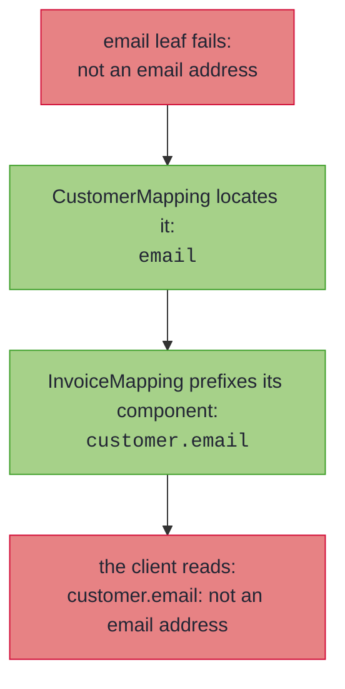
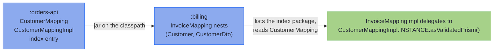

# Nesting, Containers, and Sealed Hierarchies

_Whole mappings plug in wherever a leaf does, so structure composes and error paths compose with it._

Real DTOs are not flat. An order carries a customer, the customer carries an address, the order carries a list of lines, and the domain and wire sides are sealed hierarchies as often as they are single records. All of it maps with the machinery you already have: a nested spec is just a leaf, a container lifts its element's leaf or spec, and a sealed pair dispatches one spec per subtype pair.

~~~admonish info title="What You'll Learn"
- How specs nest automatically, in one compilation or across modules, composing failures into dotted paths
- How `List`, `Optional`, and `Map` components lift, and how failing elements are located by index or key
- Why recursion terminates by construction
- Dispatching a mapping over two sealed interfaces, exhaustively in both directions
~~~

~~~admonish example title="See Example Code"
**The code on this page is [RecordMappingBook.java](https://github.com/higher-kinded-j/higher-kinded-j/blob/main/hkj-examples/src/main/java/org/higherkindedj/example/book/mapping/RecordMappingBook.java)** - the page includes it directly, so it is compiled and run by the build.
~~~

## Nesting, containers, and recursion

A component whose two sides are themselves mapped by **another spec** nests automatically, whether that spec is in the same compilation or in a dependency (see [Across modules](#across-modules)), and failures compose into dotted paths:

``` java
{{#include ../../../hkj-examples/src/main/java/org/higherkindedj/example/book/mapping/RecordMappingBook.java:nesting_spec}}

{{#include ../../../hkj-examples/src/main/java/org/higherkindedj/example/book/mapping/RecordMappingBook.java:nesting_usage}}
```

Containers lift the same way:

- `List` and `Optional` components lift through the element's leaf or spec; each failing list element is located by its index, so a bad second element reports as `emails.1` (`customers.1.email` through a nested spec). Lifting needs the *same* container on both sides; a domain `Optional<T>` against a plain nullable wire component `T` is the [`@OptionalBridge`](basics.md#optional-bridge) shape instead.
- `Map` components lift their **values**; keys pass through untouched, and each entry's failures are located by its key, so a bad value under key `en` reports as `attributes.en.email`.

A failure deep in the structure surfaces with its full address because each delegating spec prefixes its own component name as the error travels out:



Because nesting is *delegation* (each spec's `Impl` exposes [`asValidatedPrism()`](tiers.md), so a whole mapping plugs in wherever a leaf does), recursion terminates by construction: a self-referential `Tree(String value, List<Tree> children)` maps with an empty spec and round-trips any finite tree.

~~~admonish note title="Map keys are located by `toString()`"
The rendered path uses each key's `toString()`, so a key containing a dot looks the same as deeper nesting, and two distinct keys whose renderings collide share a location. The structured `FieldError` path list stays exact regardless, holding the whole key as one segment, and every error is still reported.
~~~

---

## Across modules

The spec a component nests through may live in another module. Keep `Customer`, `CustomerDto` and `CustomerMapping` in `:orders-api`, put the invoice pair in `:billing`, and the spec above does not change: it stays empty, and the generated Impl delegates to the dependency's exactly as it would to a sibling.

<!-- verify -->
```java
// :billing, which depends on :orders-api (Customer, CustomerDto and CustomerMapping live there)
@GenerateMapping
interface InvoiceMapping extends MappingSpec<Invoice, InvoiceDto> {}

// generated InvoiceMappingImpl.parse, the customer leg:
//   .field("customer", hkj$ifPresent(wire.customer(), CustomerMappingImpl.INSTANCE.asValidatedPrism()::parse))
```

There is nothing to configure. The one requirement falls on the dependency: `:orders-api` must be compiled with `hkj-processor` on its processor path, as any module that declares specs must be ([Multi-module builds](../tooling/manual_setup.md#multi-module-builds) has the build-side detail). Every kind of spec comes along. A [threaded or element-mapped](generics.md) spec resolves by the same unification, a [sealed pair](#sealed-hierarchies) dispatches to subtype specs in the dependency, and a [`@GenerateMerge`](merge_envelopes.md) fill delegates the same way.

~~~admonish tip title="Why this matters"
The delegation is an ordinary static reference in generated code, resolved at compile time from the dependency's class files: no runtime registry, no reflection, no service file to keep in step. Rename or remove a spec upstream and the downstream build fails at the use site, with the pair named, rather than a request failing later.
~~~

### How a dependency's specs are found

Nothing in a jar says which of its interfaces are mapping specs, and the compiler can list a package but not search a classpath. So the processor keeps an **index**: beside every generated `Impl` of a `MappingSpec` it writes one empty class into the package `org.higherkindedj.mapping.index`, carrying `@MappingIndexEntry` with the spec's name. A downstream compilation lists that package, reads each spec it names from its class file (which carries everything registration needs, type arguments included), and registers it exactly as if it were declared alongside. The entries are not for hand use.



Three rules keep the resolution predictable:

- **Your own spec wins.** A spec in the compilation shadows a classpath spec for the same pair, so adding a dependency never changes a resolution that already worked. The shadowed spec is named in a compiler note; if it is the one you meant, a leaf named after the component delegates to it explicitly.
- **Two dependencies for one pair are ambiguous.** The error is the same `matches more than one mapping spec` as for two specs in one compilation, each candidate listed by its qualified name with `(classpath)`. For a nested component the remedy is a leaf naming the one you mean; a sealed subtype pair has no leaf, so declare the spec yourself and it shadows both.
- **A stale entry is passed over.** An entry naming a spec that is no longer on the classpath describes nothing. One whose spec is present but whose `Impl` is missing (a partial build output, or a jar that dropped it) is never chosen, and a use site that needed the pair is told which dependency to rebuild.

The index is classpath-only. A module with a `module-info` writes no entry and reads none, not supported yet, because the index is one package and the module system allows a package in one module only; the same rule keeps two spec-carrying jars from serving as automatic modules side by side. Across a boundary of that kind, delegate with a leaf calling the other `Impl`'s `asValidatedPrism()`, and give a library bound for a module path the processor option `-Ahkj.mapping.index=false`, which writes no entries and reads none.

---

## Sealed hierarchies

A `MappingSpec` over two **sealed interfaces** dispatches over the permitted subtype pairs, one spec per pair, exhaustively in both directions:

``` java
{{#include ../../../hkj-examples/src/main/java/org/higherkindedj/example/book/mapping/RecordMappingBook.java:sealed_spec}}

// generated PaymentMappingImpl.build:
//   return switch (domain) {
//     case Card v -> CardMappingImpl.INSTANCE.build(v);
//     case Bank v -> BankMappingImpl.INSTANCE.build(v);
//   };
```

A domain subtype without a spec, or a wire subtype nothing produces, is a compile error: the dispatch cannot be partial.

---

~~~admonish info title="Key Takeaways"
* **Nesting is delegation**: any spec's Impl is a leaf (`asValidatedPrism()`), so specs nest automatically and recursion terminates by construction
* **Containers lift**: `List`/`Optional` by element, `Map` by value; failures are located by index or key
* **Error paths are dotted domain names**: `customers.1.email`, `attributes.en.email`
* **Sealed dispatch is exhaustive both ways**: a missing subtype pair is a compile error, never a runtime surprise
* **Dependencies count as siblings**: a spec compiled into another module nests, dispatches and merges through the classpath index, and your own spec shadows a dependency's for the same pair
~~~

~~~admonish tip title="See Also"
- [Record Mapping Basics](basics.md#null-doctrine) - The null doctrine that also reaches inside containers
- [The Emission Tiers](tiers.md) - What the composed mapping lawfully offers
- [Generic Specs](generics.md) - Nesting for generic records
- [Multi-module builds](../tooling/manual_setup.md#multi-module-builds) - What the build needs when specs span modules
~~~

---

**Previous:** [Standard Codecs and Shared Vocabulary](codecs.md)
**Next:** [The Emission Tiers](tiers.md)
