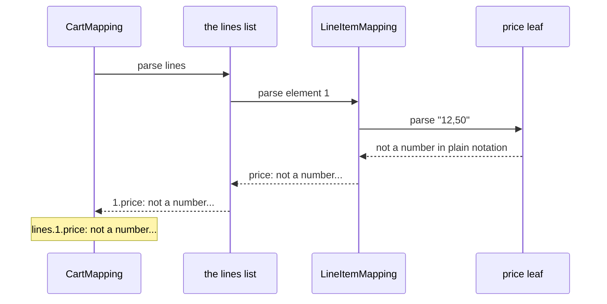
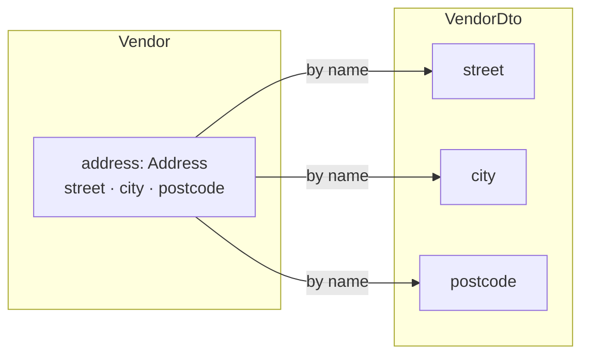
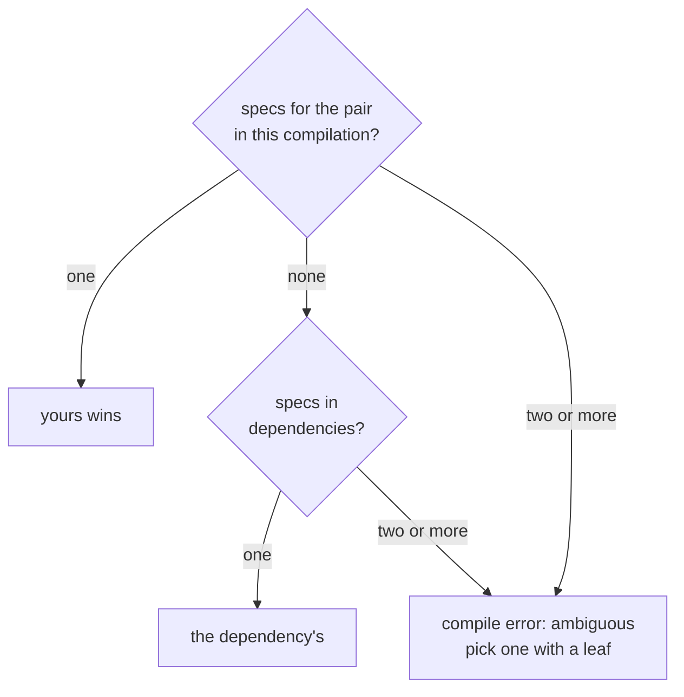

# Nesting, Containers, and Sealed Hierarchies

_Whole mappings plug in wherever a leaf does, so structure composes and error paths compose with it._

Real DTOs are not flat. An order carries a customer and a list of lines, and a payment is a card or a bank transfer. All of it maps with the machinery you already have. A spec for an inner pair is used wherever that pair appears, a list lifts its element's spec, and a sealed pair dispatches to one spec per subtype. This page walks those three first. Optional objects, other containers, map keys, flattening and specs from other modules follow, for when a pair needs them.

~~~admonish info title="What You'll Learn"
- Nest one spec in another, and in a `List`, and predict the path each failure reports
- Map two sealed interfaces, one spec per subtype pair
- Predict what a container that needs no conversion turns into on the way across
~~~

~~~admonish example title="See Example Code"
**The code on this page is [StructureBook.java](https://github.com/higher-kinded-j/higher-kinded-j/blob/main/hkj-examples/src/main/java/org/higherkindedj/example/book/mapping/StructureBook.java) and its [StructureBookTest.java](https://github.com/higher-kinded-j/higher-kinded-j/blob/main/hkj-examples/src/test/java/org/higherkindedj/example/book/mapping/StructureBookTest.java)** - the page includes them directly, so they are compiled and run by the build.
~~~

## Nesting a spec, and a list of them {#nesting-containers-and-recursion}

A component whose two sides have a spec of their own nests through that spec, with nothing to declare. `InvoiceMapping` stays empty: `CustomerMapping`, from [Validated leaves](basics.md#validated-leaves), maps its `customer`, and a failure inside comes back under the component's name:

``` java
{{#include ../../../hkj-examples/src/main/java/org/higherkindedj/example/book/mapping/StructureBook.java:nesting_spec}}

{{#include ../../../hkj-examples/src/main/java/org/higherkindedj/example/book/mapping/StructureBook.java:nesting_usage}}
```

A `List` of such pairs lifts the same way: the element's spec parses each element, and a failure locates by its index. Here the second line's price fails its leaf:

``` java
{{#include ../../../hkj-examples/src/main/java/org/higherkindedj/example/book/mapping/StructureBook.java:list_spec}}

{{#include ../../../hkj-examples/src/main/java/org/higherkindedj/example/book/mapping/StructureBook.java:list_usage}}
```

That is the `lines.1.price` error the chapter opened with. Each level on the way out puts its own name in front, so the path grows outward from the leaf that failed:



In words: the leaf reports only its message, and on the way out each level puts its own name in front, first `price`, then the index `1`, then `lines`. An array lifts exactly as a `List` does, and a `null` element is reported at its index like any other [`null`](basics.md#null-doctrine). Lifting needs the same container on both sides: [What lifts, and what does not](rules.md#what-lifts) has the exact rule.

~~~admonish warning title="Not checked for you: a container that needs no conversion crosses as a copy"
A component with the same container type on both sides, such as `List<String> tags`, crosses as a copy, not as the list the other side holds. The copy is unmodifiable, so code that adds to a built wire's list afterwards throws `UnsupportedOperationException`: set a new list, or copy it first. An array crosses as a clone, and a record compares an array by reference, so a record with an array component and no `equals` of its own is not equal to its own round trip. [Same-typed containers cross as copies](rules.md#same-typed-containers-cross-as-copies) has the precise rule.
~~~

---

## Sealed hierarchies {#sealed-hierarchies}

A `MappingSpec` over two **sealed interfaces** dispatches over the permitted subtypes, one spec per subtype pair, in both directions:

``` java
{{#include ../../../hkj-examples/src/main/java/org/higherkindedj/example/book/mapping/StructureBook.java:sealed_spec}}

// generated PaymentMappingImpl.build:
//   return switch (domain) {
//     case Card v -> CardMappingImpl.INSTANCE.build(v);
//     case Bank v -> BankMappingImpl.INSTANCE.build(v);
//   };
```

The dispatch hands each value to its subtype's spec, and adds nothing to the path:

``` java
{{#include ../../../hkj-examples/src/main/java/org/higherkindedj/example/book/mapping/StructureBook.java:sealed_usage}}
```

The dispatch cannot be partial. A domain subtype without a spec, or a wire subtype no spec produces, is a compile error that names it: [`has no mapping spec`](compiler_errors.md#subtype-has-no-spec). Each subtype must be a record or a sealed interface, or on the wire side a bean as well. A generic subtype, an enum, or any other class is not supported yet.

~~~admonish tip title="You can ship now"
You can now map records that hold other records, lists of them, and sealed hierarchies, with every failure located by its full path. The rest of this page, [optional objects](#optional-nested-objects), [other containers](#other-containers), [map keys](#converting-map-keys), [flattening](#flattening-a-nested-component-onto-a-flat-wire) and [specs from other modules](#across-modules), is for when a pair needs them.
~~~

~~~admonish question title="Checkpoint: where does each failure locate?" id="check-structure-paths"
`CheckoutMapping` maps a `List` of the sealed payments:

``` java
{{#include ../../../hkj-examples/src/main/java/org/higherkindedj/example/book/mapping/StructureBook.java:checkout_spec}}
```

A client sends two payments, and the second is a card with no number. Where does `CheckoutMappingImpl.INSTANCE.parse(new CheckoutDto("C-1", List.of(new BankDto("GB33BUKB20201555555555"), new CardDto(null))))` report it?

1. Nowhere: `CardMapping` throws a `NullPointerException`
2. `payments.1: must not be null`
3. `payments.1.pan: must not be null`
4. `payments.1.Card.pan: must not be null`
~~~

~~~admonish success title="Answer and why" collapsible=true id="check-structure-paths-answer"
**3.** The `null` is the card's `pan`, so it is located there, never thrown. The list puts the index in front, and the dispatch adds no segment of its own, so the path reads `payments.1.pan`:

``` java
{{#include ../../../hkj-examples/src/test/java/org/higherkindedj/example/book/mapping/StructureBookTest.java:check_payment_path}}
```

Where this lives: [Nesting a spec, and a list of them](#nesting-containers-and-recursion) and [Sealed hierarchies](#sealed-hierarchies).
~~~

~~~admonish question title="Checkpoint: whose list is it?" id="check-structure-copy"
`Memo` and `MemoDto` both hold a `List<String> tags`, and `MemoMapping` is empty:

``` java
{{#include ../../../hkj-examples/src/main/java/org/higherkindedj/example/book/mapping/StructureBook.java:memo_spec}}
```

A service builds the wire from a memo whose `tags` is its own `ArrayList`, then calls `dto.tags().add("urgent")` on the result. What happens?

1. The tag is added to the wire's list, and the memo's list is unchanged
2. The tag is added to both, since the wire holds the memo's own list
3. It throws `UnsupportedOperationException`
4. It does not compile
~~~

~~~admonish success title="Answer and why" collapsible=true id="check-structure-copy-answer"
**3.** The list needs no conversion, so it crosses as a copy, and the copy is unmodifiable. The memo never shared its list, so it is untouched either way:

``` java
{{#include ../../../hkj-examples/src/test/java/org/higherkindedj/example/book/mapping/StructureBookTest.java:check_copy}}
```

Set a new list on the wire, or copy it first with `new ArrayList<>(dto.tags())`.

Where this lives: [Nesting a spec, and a list of them](#nesting-containers-and-recursion).
~~~

---

## Optional nested objects {#optional-nested-objects}

When a JSON client leaves an object out, or sends `null` for it, the wire holds a nullable `CustomerDto` where the domain holds an `Optional<Customer>`. That pair is the [`@OptionalBridge`](absence.md#optional-bridge) shape, and when a spec maps the element pair, the marker is all the component needs:

``` java
{{#include ../../../hkj-examples/src/main/java/org/higherkindedj/example/book/mapping/StructureBook.java:bridge_nesting_spec}}

{{#include ../../../hkj-examples/src/main/java/org/higherkindedj/example/book/mapping/StructureBook.java:bridge_nesting_usage}}
```

`parse` reads `null` as empty, and hands a present value to the nested spec, so its failures locate under the component. `build` does the reverse. A bean wire bridges automatically, so there the same pair nests with no marker at all.

A bridged list lifts the same way. Where an absent list and an empty one mean different things, the domain holds an `Optional<List<Customer>>`, and the marker is again all it needs:

``` java
{{#include ../../../hkj-examples/src/main/java/org/higherkindedj/example/book/mapping/StructureBook.java:bridge_container_spec}}

{{#include ../../../hkj-examples/src/main/java/org/higherkindedj/example/book/mapping/StructureBook.java:bridge_container_usage}}
```

A present list lifts element by element, and an empty one parses to a present, empty `Optional`. `Set`, arrays and `Map` values lift alike: [What converts a bridged value](rules.md#what-converts-a-bridged-value) has the rule. Where an empty list already says there are none, a plain `List<Customer>` is simpler, and needs no marker.

---

## Other containers, and recursion {#other-containers}

A `Set`, an array, an `Optional` and a `Map` lift like a `List`. Each locates a failure by whatever identifies an element in that container:

| Component | Lifts through the element's leaf or spec | A failure locates by |
| --- | --- | --- |
| `List<E>` | ✅ | its **index**: `emails.1`, or `customers.1.email` through a nested spec |
| `E[]` | ✅ | its **index**, exactly as a list |
| `Set<E>` | ✅ | the **element's own rendering** (`emails.nope`), since a set has no index |
| `Optional<E>` | ✅ | the component itself, since there is only one element |
| `Map<K, V>` | ✅ values, and keys with [`@MapKey`](#converting-map-keys) | the **source key**: `attributes.en.email` |

``` java
{{#include ../../../hkj-examples/src/main/java/org/higherkindedj/example/book/mapping/StructureBook.java:widened_spec}}

{{#include ../../../hkj-examples/src/main/java/org/higherkindedj/example/book/mapping/StructureBook.java:widened_usage}}
```

A set has no index, and its order is not part of its contract, so the path names the element by its value. Keys and set elements render by `toString()`, so one containing a dot reads like deeper nesting, while `FieldError.path()` keeps it as one segment.

A nested spec is used exactly as a leaf is, through its Impl's `asValidatedPrism()`, or the one half a [one-directional bean mapping](beans.md#one-directional-beans) has. So recursion needs nothing special: a self-referential `Tree(String value, List<Tree> children)` maps with an empty spec, and round-trips any finite tree.

### Converting Map keys {#converting-map-keys}

A `Map` component's value leaf is named after the component, like every other leaf. Its keys need a second leaf, and Java allows only one zero-parameter method of that name, so a key leaf carries `@MapKey`, naming the component it belongs to, as `noteKey()` does in `CrewMapping`. Either side may convert alone: a key leaf without a value leaf converts the keys and copies the values. Without a key leaf, the key types must match exactly, and a mismatch is a compile error that offers the annotation.

A failing key locates by the **source** key, so the path names what the client sent, and an entry wrong on both sides reports both reasons there. A leaf over the whole `Map` wins over both: [a key leaf beside a whole-map leaf](rules.md#key-leaf-beside-a-whole-map-leaf) says when that is refused.

~~~admonish warning title="Not checked for you: two keys can collapse into one"
A leaf that parses two wire values to one domain value (`"1"` and `"01"`, say) breaks the [section law](../optics/validated_prism.md#laws), which [`ValidatedPrismLaws`](../tooling/test_assertions.md#optic-laws) catches and [`ValidatedPrism.canonical`](../optics/validated_prism.md) rules out. Where one slips through, a `Set` drops the duplicate silently, since the survivor is equal to it. Two `Map` keys that collapse would discard a whole entry, so that is a located failure instead: `attributes.ab: duplicates an earlier key`.
~~~

---

## Flattening a nested component onto a flat wire {#flattening-a-nested-component-onto-a-flat-wire}

Nesting assumes the wire nests too. Often it does not: the domain keeps an `Address` record, and a wire format fixed by someone else carries `street`, `city` and `postcode` as plain fields. No single wire component holds the address, so no leaf can map it. `@Flatten` on a marker named after the component spreads it instead:

``` java
{{#include ../../../hkj-examples/src/main/java/org/higherkindedj/example/book/mapping/StructureBook.java:flatten_spec}}

{{#include ../../../hkj-examples/src/main/java/org/higherkindedj/example/book/mapping/StructureBook.java:flatten_usage}}
```



The record's components, spread this way, are the **group**. `build` fills each flat wire field from the group member of the same name. `parse` assembles the record through its own [`Validated.fields()` ladder](../monads/validated_assembly.md), inside the outer one, so its failures accumulate with the rest and locate under the **domain** path: `address.street`, a name the flat wire never sent. That is deliberate: the client learns which part of the address was wrong.

The vocabulary applies inside the group by name:

- a `@MapField` rename points a member at a differently named wire field
- a leaf converts a member, and makes the mapping fallible as a top-level leaf would
- an `@OptionalBridge` bridges an `Optional` member
- a member that is itself a record nests through its own spec, and containers lift

An all-identity group keeps the mapping lossless, so `asIso()` survives, and a mapping carrying a group nests in other specs like any other. Flattening onto a bean wire, a generic spec, a projection or a sparse `UpdateSpec` is not supported yet: [Names in a flattened group](rules.md#names-in-a-flattened-group) and [where a flattened component can appear](rules.md#where-flattening-applies) have the precise rules.

---

## Across modules {#across-modules}

The spec a component nests through may live in another module. Keep `Customer`, `CustomerDto` and `CustomerMapping` in `:orders-api`, and put the invoice pair in `:billing`. `InvoiceMapping` does not change: it stays empty, and the generated Impl delegates to the dependency's exactly as it would to a sibling.

<!-- verify -->
```java
// :billing, which depends on :orders-api (Customer, CustomerDto and CustomerMapping live there)
@GenerateMapping
interface InvoiceMapping extends MappingSpec<Invoice, InvoiceDto> {}

// generated InvoiceMappingImpl.parse, the customer leg:
//   .field("customer", hkj$ifPresent(wire.customer(), CustomerMappingImpl.INSTANCE.asValidatedPrism()::parse))
```

There is nothing to configure. The one requirement falls on the dependency: `:orders-api` must be compiled with `hkj-processor` on its processor path ([Multi-module builds](../tooling/manual_setup.md#multi-module-builds)). Sealed pairs, [generic specs](generics.md) and [`@GenerateMerge`](merge_envelopes.md) fills delegate the same way, and a [shared vocabulary](codecs.md#shared-vocabulary-mix-in-interfaces) travels as a plain interface.

When several specs could map a pair, the processor picks one this way:



So adding a dependency never changes a mapping that already worked. [How a dependency's specs are found](rules.md#how-a-dependencys-specs-are-found) has the index behind it and the remaining rules. Resolving a dependency's specs on the module path is not supported yet.

~~~admonish tip title="Why this matters"
The delegation is an ordinary static reference in generated code, resolved at compile time from the dependency's class files: no runtime registry, no reflection, no service file to keep in step. Rename or remove a spec upstream and the downstream build fails at the use site, with the pair named, rather than a request failing later.
~~~

---

~~~admonish info title="Key Takeaways"
* **Nesting is delegation**: a spec for an inner pair is used wherever that pair appears, in this module or a dependency, and a `List` lifts it element by element
* **Error paths grow outward**: each level puts its name in front, so the client reads `lines.1.price` or `payments.1.pan`, and a sealed dispatch adds no segment
* **Sealed dispatch is exhaustive both ways**: a missing subtype pair is a compile error, never a runtime surprise
* **A container that needs no conversion crosses as an unmodifiable copy**, never as the other side's own instance
* **The rest composes the same way**: optional objects, other containers, flattened records and specs from other modules
~~~

~~~admonish tip title="See Also"
- [Record Mapping Basics](basics.md#null-doctrine): The null rule, which also reaches inside containers
- [What Your Spec Generates](tiers.md): What the composed mapping lawfully offers
- [Generic Specs](generics.md): Nesting for generic records
- [Multi-module builds](../tooling/manual_setup.md#multi-module-builds): What the build needs when specs span modules
~~~

---

**Previous:** [Absent Fields and Record Invariants](absence.md)
**Next:** [Capstone: One 422, Every Bad Field](capstone.md)
