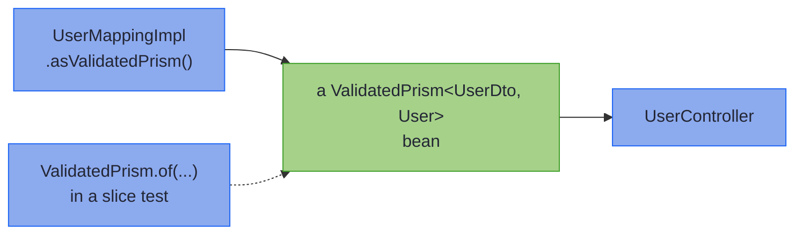

# Injecting, Testing, and Diagnostics

_Register the surface you consume, fake it with values, and read the processor's what/why/fix rejections._

A generated Impl is a pure function, so most code just calls it: `CustomerMappingImpl.INSTANCE.parse(dto)`. This page covers the seams around that call. It says what to register when you do want a Spring bean or a test double, and how wide a mapped record may be.

~~~admonish info title="What You'll Learn"
- Choose the surface to register for a consumer, from the methods it calls
- Replace a mapping in a test with a value, not a mock
~~~

~~~admonish example title="See Example Code"
**The width proof on this page is [WideMappingLawsTest.java](https://github.com/higher-kinded-j/higher-kinded-j/blob/main/hkj-examples/src/test/java/org/higherkindedj/example/book/mapping/WideMappingLawsTest.java), and the checkpoint proofs are [TestingBookTest.java](https://github.com/higher-kinded-j/higher-kinded-j/blob/main/hkj-examples/src/test/java/org/higherkindedj/example/book/mapping/TestingBookTest.java)**. The injection and fake snippets are included straight from the hkj-spring example app's [`MappingConfiguration`](https://github.com/higher-kinded-j/higher-kinded-j/blob/main/hkj-spring/example/src/main/java/org/higherkindedj/spring/example/config/MappingConfiguration.java) and [`UserParseFakeCodecSliceTest`](https://github.com/higher-kinded-j/higher-kinded-j/blob/main/hkj-spring/example/src/test/java/org/higherkindedj/spring/example/controller/UserParseFakeCodecSliceTest.java) - everything on this page is compiled and run by the build.
~~~

## Injecting and testing generated mappings {#injecting-and-testing-generated-mappings}

A concrete or threaded Impl is a stateless pure function, reached through `INSTANCE` or `instance()`. An element-mapped Impl is an immutable value built by `of(...)`, carrying its element prisms. Registering one is like registering a Spring `Converter<S, T>` bean: the bean is a typed function, not a mapper class. Unlike a MapStruct mapper, though, the spec interface is never a bean, so `@Autowired CustomerMapping` finds nothing. Register the **surface** the consumer calls instead:



In words: the controller depends on the surface's type alone, so production and a test fill it with different values.

| Tier surface | Injectable shape | From |
|---|---|---|
| a mapping that builds and parses | `ValidatedPrism<UserDto, User>` | `UserMappingImpl.INSTANCE.asValidatedPrism()` |
| just `build`, from any tier that has one | `Function<User, UserDto>` | `UserMappingImpl.INSTANCE::build` |
| a projection's write-back | `Lens<Employee, EmployeeCardDto>` | `EmployeeCardMappingImpl.INSTANCE.asLens()` |
| parse-only bean mapping | `ValidatedParse<CustomerView, Customer>` | `CustomerViewMappingImpl.INSTANCE.asValidatedParse()` |
| build-only bean mapping | `ValidatedBuild<CustomerRequest, Customer>` | `CustomerRequestMappingImpl.INSTANCE.asValidatedBuild()` |
| validated `patch` | `BiFunction<User, UserCardDto, Validated<NonEmptyList<FieldError>, User>>` | `UserCardMappingImpl.INSTANCE::patch` |
| sparse `updateFrom` | `Function<UserPatchDto, Edits.Accumulated<User>>` | `UserPatchMappingImpl.INSTANCE::updateFrom` |

For a boundary, register `asValidatedPrism()` rather than `asIso()`, since [`reverseGet` has no guard](tiers.md#a-bound-request-goes-to-parse). This is the hkj-spring example app's real configuration, included from source:

```java
{{#include ../../../hkj-spring/example/src/main/java/org/higherkindedj/spring/example/config/MappingConfiguration.java:mapping_configuration}}
```

Spring resolves the full generic type, so codecs for different pairs coexist without ceremony. Only two codecs for the *same* pair need a `@Qualifier`. An element-mapped Impl carries its prisms as state, so construct it once, in the `@Bean` method.

**Fakes are values, not mocks.** The surfaces are sealed interfaces and every Impl is `final`, so neither a mocking framework nor a subclass can stand in for one. That is the design, not a limitation. A test double is two lines of `ValidatedPrism.of(...)`, or of `ValidatedParse.of(...)` or `ValidatedBuild.of(...)` for a one-directional surface. A `Function` or `BiFunction` surface takes a lambda. Here is the example app's real `@WebMvcTest` substitution:

```java
{{#include ../../../hkj-spring/example/src/test/java/org/higherkindedj/spring/example/controller/UserParseFakeCodecSliceTest.java:fake_codec}}
```

The [hkj-spring example app](../spring/spring_boot_integration.md) runs the seam end to end. `MappingConfiguration` registers the codec, `UserController`'s parse endpoint injects it, and `UserParseFakeCodecSliceTest` swaps in the fake and asserts the located 422 it produces. The same controller's PATCH endpoint calls `UserPatchMappingImpl.INSTANCE` directly, and loses nothing by it: injection buys substitution, not lifecycle.

~~~admonish tip title="You can ship now"
You can now register the surface a consumer calls, and replace it in a test with a two-line value. The rest of this page, [how wide a record can be](#diagnostics-and-limits), is for when a wire is wide.
~~~

~~~admonish question title="Checkpoint: what does a renderer get?" id="check-testing-surface"
A response renderer only ever turns a `Customer` into a `CustomerDto`. `CustomerMapping`, from [Record Mapping Basics](basics.md#validated-leaves), converts `email` through a leaf. Which bean gives the renderer exactly what it calls?

1. `CustomerMapping` itself, autowired as a MapStruct mapper would be
2. An `Iso<Customer, CustomerDto>`, from `CustomerMappingImpl.INSTANCE.asIso()`
3. A `ValidatedPrism<CustomerDto, Customer>`, from `asValidatedPrism()`
4. A `Function<Customer, CustomerDto>`, from `CustomerMappingImpl.INSTANCE::build`
~~~

~~~admonish success title="Answer and why" collapsible=true id="check-testing-surface-answer"
**4.** The renderer calls `build` and nothing else, so `::build` is the surface to register. The spec interface is never a bean, and the leaf withholds `asIso()`. `asValidatedPrism()` works, but it hands the renderer a `parse` it never calls:

``` java
{{#include ../../../hkj-examples/src/test/java/org/higherkindedj/example/book/mapping/TestingBookTest.java:render_configuration}}

{{#include ../../../hkj-examples/src/test/java/org/higherkindedj/example/book/mapping/TestingBookTest.java:check_register_build}}
```

Where this lives: [Injecting and testing generated mappings](#injecting-and-testing-generated-mappings).
~~~

~~~admonish question title="Checkpoint: how do you fake a parse-only surface?" id="check-testing-fake"
A controller injects the `ValidatedParse<CustomerView, Customer>` a parse-only bean mapping provides. A slice test needs it to fail every request with `email: rejected`. What do you write?

1. `Mockito.mock(ValidatedParse.class)`, with `parse` stubbed to return the error
2. An anonymous class implementing `ValidatedParse`
3. A subclass of `CustomerViewMappingImpl` that overrides `parse`
4. `ValidatedParse.of(view -> Validated.invalidNel(FieldError.of("rejected").at("email")))`
~~~

~~~admonish success title="Answer and why" collapsible=true id="check-testing-fake-answer"
**4.** `ValidatedParse` is sealed, so neither a mock nor an anonymous class can implement it, and the generated Impl is `final`. Its `of` factory takes the one function a fake needs:

``` java
{{#include ../../../hkj-examples/src/test/java/org/higherkindedj/example/book/mapping/TestingBookTest.java:check_fake_parse}}
```

Where this lives: [Injecting and testing generated mappings](#injecting-and-testing-generated-mappings).
~~~

---

## Diagnostics and limits {#diagnostics-and-limits}

There is no component ceiling. `parse`, the validated `patch` and a fallible `@GenerateMerge` are assembled with [`Validated.fields()`](../monads/validated_assembly.md) ladders, chunked and combined past 16 fields. So a flat wire of 20 or 30 fields maps without grouping its components into nested records. It behaves exactly like a narrow one, with the same located labels and the same declaration-order accumulation across chunk boundaries:

``` java
{{#include ../../../hkj-examples/src/test/java/org/higherkindedj/example/book/mapping/WideMappingLawsTest.java:wide_laws}}
```

The only width bound left is the JVM's limit on the record's constructor parameter slots, which javac enforces at the record declaration. That is 254 components in practice, fewer with `long` or `double`. The hand-written `fields()` ladder keeps its 16-field arity, so a wider hand-written assembly nests sub-records.

Every rejection follows the processor's what/why/fix standard: the message states what is wrong, why the mapper needs it, and the code to write. [Compiler Messages](compiler_errors.md) collects the common ones. The limits themselves are indexed in [Find your limit](rules.md#find-your-limit), each linked to its rule.

---

~~~admonish info title="Key Takeaways"
* **Register the surface, not the spec**: `asValidatedPrism()`, `asLens()`, `asValidatedParse()`, `asValidatedBuild()`, `::build`, `::patch` or `::updateFrom`, whichever the consumer calls
* **Fakes are two-line values**: the surfaces are sealed and the Impls final, so `ValidatedPrism.of(...)` replaces the mocking framework, by design
* **No component ceiling**: chunked `fields()` ladders carry flat wires of 20 or 30 fields; only the JVM's 254-slot record limit remains
~~~

~~~admonish tip title="See Also"
- [Testing With hkj-test](../tooling/test_assertions.md#optic-laws): `MappingLaws` and `assertThatFieldError`
- [Spring Boot Integration](../spring/spring_boot_integration.md): The example app the injection seam comes from
- [Accumulating Assembly](../monads/validated_assembly.md): The `fields()` builder behind the generated `parse`
~~~

---

**Previous:** [Merge and Error Envelopes](merge_envelopes.md)
**Next:** [Mapper at a Glance](at_a_glance.md)
