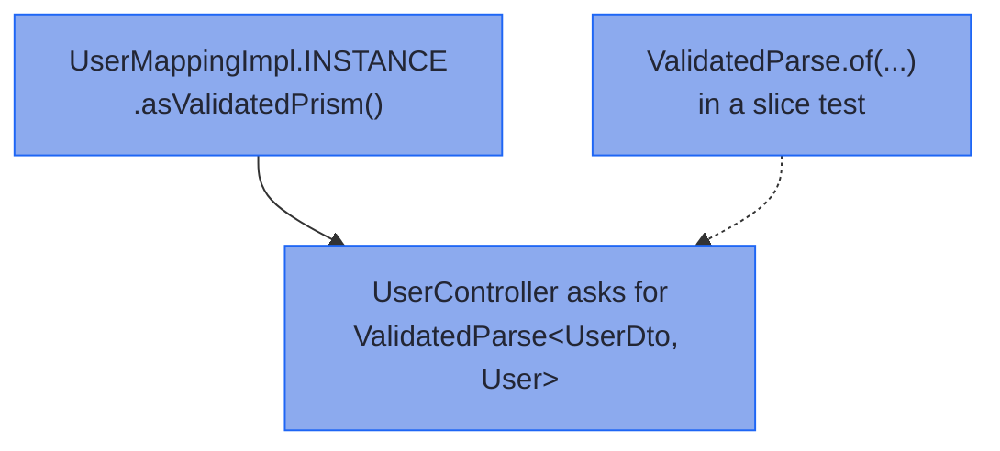

# Injecting, Testing, and Diagnostics

_Register the surface you consume, fake it with values, and read the processor's what/why/fix rejections._

A generated Impl is a pure function, so most code just calls it: `CustomerMappingImpl.INSTANCE.parse(dto)`. This page covers the seams around that call. It says what to register when you do want a Spring bean or a test double, and how wide a mapped record may be.

~~~admonish info title="What You'll Learn"
- Register a mapping's surface, and inject exactly the part a consumer calls
- Replace a mapping in a test with a value, not a mock
~~~

~~~admonish example title="See Example Code"
**The width proof on this page is [WideMappingLawsTest.java](https://github.com/higher-kinded-j/higher-kinded-j/blob/main/hkj-examples/src/test/java/org/higherkindedj/example/book/mapping/WideMappingLawsTest.java), and the checkpoint proofs are [TestingBookTest.java](https://github.com/higher-kinded-j/higher-kinded-j/blob/main/hkj-examples/src/test/java/org/higherkindedj/example/book/mapping/TestingBookTest.java)**. The injection and fake snippets are included straight from the hkj-spring example app's [`MappingConfiguration`](https://github.com/higher-kinded-j/higher-kinded-j/blob/main/hkj-spring/example/src/main/java/org/higherkindedj/spring/example/config/MappingConfiguration.java) and [`UserParseFakeCodecSliceTest`](https://github.com/higher-kinded-j/higher-kinded-j/blob/main/hkj-spring/example/src/test/java/org/higherkindedj/spring/example/controller/UserParseFakeCodecSliceTest.java) - everything on this page is compiled and run by the build.
~~~

## Injecting and testing generated mappings {#injecting-and-testing-generated-mappings}

Registering a mapping is like registering a Spring `Converter<S, T>` bean: the bean is a typed function, not a mapper class. Unlike a `Converter`, Spring never calls it for you. The controller calls `parse`, and bad input comes back as located errors rather than an exception.

Unlike a MapStruct mapper, the spec interface is never the bean. Nothing registers the spec or its Impl, and the spec declares no `parse` or `build`, so even a registered one would give you nothing to call. Register the **surface** instead: the typed value an Impl hands out. An Impl is reached through `INSTANCE`, or through `instance()` or `of(...)` for a [generic spec](generics.md#one-rule-three-access-shapes).

| The consumer calls | Inject | From |
|---|---|---|
| `parse` and `build` | `ValidatedPrism<UserDto, User>` | `UserMappingImpl.INSTANCE.asValidatedPrism()` |
| `parse` alone | `ValidatedParse<UserDto, User>` | the same `ValidatedPrism` bean, or `asValidatedParse()` on a parse-only bean mapping |
| `build` alone | `Function<User, UserDto>` | `UserMappingImpl.INSTANCE::build`, from any tier that has one |
| a build-only bean mapping's `build` | `ValidatedBuild<CustomerRequest, Customer>` | `CustomerRequestMappingImpl.INSTANCE.asValidatedBuild()` |
| a projection's `set`, over plain copies | `Lens<Employee, EmployeeCardDto>` | `EmployeeCardMappingImpl.INSTANCE.asLens()` |
| a validated `patch` | `BiFunction<Subscriber, SubscriberDetailsDto, Validated<NonEmptyList<FieldError>, Subscriber>>` | `SubscriberDetailsMappingImpl.INSTANCE::patch` |
| a sparse `updateFrom` | `Function<UserPatchDto, Edits.Accumulated<User>>` | `UserPatchMappingImpl.INSTANCE::updateFrom` |

A `ValidatedPrism` is both a `ValidatedParse` and a `ValidatedBuild`, so one registered prism serves a consumer that asks for either. For a boundary, register `asValidatedPrism()` rather than `asIso()`, which a spec with a leaf does not have anyway. [`reverseGet` has no guard](tiers.md#a-bound-request-goes-to-parse), and neither does a lens's `set`. This is the hkj-spring example app's real configuration, included from source:

```java
{{#include ../../../hkj-spring/example/src/main/java/org/higherkindedj/spring/example/config/MappingConfiguration.java:mapping_configuration}}
```

Spring resolves the full generic type, so surfaces for different pairs coexist without ceremony. Only two surfaces for the *same* pair need a `@Qualifier`. An element-mapped Impl carries its prisms as state, so construct it once, in the `@Bean` method.

**Fakes are values, not mocks.** Mockito refuses a sealed interface, and the three validated surfaces are sealed, so `@MockitoBean` refuses them too. The Impl is `final`, and it implements only the spec, never a surface, so a subclass cannot stand in either. None is needed: each sealed surface has an `of` factory that takes the functions it declares. The example app's controller only parses, so it asks for a `ValidatedParse`, and its `@WebMvcTest` fake is one function:

```java
{{#include ../../../hkj-spring/example/src/test/java/org/higherkindedj/spring/example/controller/UserParseFakeCodecSliceTest.java:fake_codec}}
```

A `Lens` fake is `Lens.of(get, set)`, and a `Function` or `BiFunction` fake is a lambda. The controller depends on the surface's type alone, so production and a test fill it with different values:



In words: the controller asks for a `ValidatedParse`, which the production prism satisfies and a test's one-function fake replaces.

The [hkj-spring example app](../spring/spring_boot_integration.md) runs the seam end to end. `MappingConfiguration` registers the prism, and `UserController`'s parse endpoint injects it. `UserParseFakeCodecSliceTest` swaps in the fake, and asserts the located 422 it produces. The same controller's PATCH endpoint calls `UserPatchMappingImpl.INSTANCE` directly, and a team that calls the Impl this way (`INSTANCE`, `instance()`, or one shared `of(...)` instance) loses nothing. Injection buys a seam for tests, and nothing else.

~~~admonish tip title="At the Spring boundary"
A `@WebMvcTest` slice loads none of Higher-Kinded-J's auto-configuration, so import the three it needs, as `UserParseFakeCodecSliceTest` does: [Slice Testing with `@WebMvcTest`](../spring/spring_boot_integration.md#slice-testing-with-webmvctest).
~~~

To check the mapping itself rather than fake it, one `MappingLaws` call does it: [Law-checked, in the repo and in your tests](tiers.md#law-checked-in-the-repo-and-in-your-tests).

~~~admonish tip title="You can ship now"
You can now register a mapping's surface, inject the part a consumer calls, and replace it in a test with a value. The rest of this page, [how wide a record can be](#diagnostics-and-limits), is for when a wire is wide.
~~~

~~~admonish question title="Checkpoint: which surface does Spring inject?" id="check-testing-injection"
An app registers two beans: `CustomerMappingImpl.INSTANCE.asValidatedPrism()`, a `ValidatedPrism<CustomerDto, Customer>`, and `CustomerViewMappingImpl.INSTANCE.asValidatedParse()`, a `ValidatedParse<CustomerView, Customer>`. A signup handler's constructor asks for a `ValidatedParse<CustomerDto, Customer>`. What does Spring do?

1. Fails at startup: two `ValidatedParse` beans for `Customer` need a `@Qualifier`
2. Fails at startup: no bean is declared as a `ValidatedParse<CustomerDto, Customer>`
3. Injects the `CustomerMapping` prism
4. Injects whichever of the two beans was declared first
~~~

~~~admonish success title="Answer and why" collapsible=true id="check-testing-injection-answer"
**3.** Spring matches the full generic type. The prism is a `ValidatedParse<CustomerDto, Customer>`, and the other bean parses a different wire, so exactly one bean fits:

``` java
{{#include ../../../hkj-examples/src/test/java/org/higherkindedj/example/book/mapping/TestingBookTest.java:two_customer_surfaces}}

{{#include ../../../hkj-examples/src/test/java/org/higherkindedj/example/book/mapping/TestingBookTest.java:check_generic_injection}}
```

Where this lives: [Injecting and testing generated mappings](#injecting-and-testing-generated-mappings).
~~~

~~~admonish question title="Checkpoint: how do you fake a build-only surface?" id="check-testing-fake"
A service fills outbound requests through the `ValidatedBuild<CustomerRequest, Customer>` a build-only bean mapping provides. A unit test wants it to return a fixed `CustomerRequest`, without running the real mapping. What do you write?

1. `@MockitoBean ValidatedBuild<CustomerRequest, Customer> requests;`, with `build` stubbed
2. `ValidatedBuild.of(customer -> fixed)`
3. A subclass of `CustomerRequestMappingImpl` that overrides `build`
4. `ValidatedParse.of(...)`, as the example app's fake does
~~~

~~~admonish success title="Answer and why" collapsible=true id="check-testing-fake-answer"
**2.** Each sealed surface has an `of` taking the functions it declares, and a `ValidatedBuild` declares `build`. Mockito refuses the sealed interface, a `ValidatedParse` is not a `ValidatedBuild`, and the Impl is `final` and implements no surface:

``` java
{{#include ../../../hkj-examples/src/test/java/org/higherkindedj/example/book/mapping/TestingBookTest.java:check_fake_build}}
```

Where this lives: [Injecting and testing generated mappings](#injecting-and-testing-generated-mappings).
~~~

---

## Diagnostics and limits {#diagnostics-and-limits}

A mapping has no component ceiling. `parse`, the validated `patch` and a fallible `@GenerateMerge` are assembled with [`Validated.fields()`](../monads/validated_assembly.md) ladders, chunked and combined past 16 fields. So a flat wire of 20 or 30 fields maps without grouping its components into nested records. It behaves exactly like a narrow one, with the same located labels and the same declaration-order accumulation across chunk boundaries:

``` java
{{#include ../../../hkj-examples/src/test/java/org/higherkindedj/example/book/mapping/WideMappingLawsTest.java:wide_laws}}
```

A `@Flatten` group is the one exception: it is a single ladder, so a group wider than 16 is [not supported yet](rules.md#where-flattening-applies). The one width bound on a record is the JVM's limit on its constructor parameter slots, which javac enforces at the record declaration. That is 254 components in practice, fewer with `long` or `double`. A hand-written `fields()` ladder stops at 16 fields, so a wider hand-written assembly nests sub-records, or uses [`@GenerateAssembly`](../monads/validated_assembly.md#generating-the-companion-generateassembly).

Every rejection follows the processor's what/why/fix standard: the message states what is wrong, why the mapper needs it, and the code to write. [Compiler Messages](compiler_errors.md) collects the common ones. The limits themselves are indexed in [Find your limit](rules.md#find-your-limit), each linked to its rule.

---

~~~admonish info title="Key Takeaways"
* **Register the surface, not the spec**: inject the part a consumer calls, and let one `ValidatedPrism` bean serve a `ValidatedParse` or a `ValidatedBuild` consumer
* **Fakes are values**: each sealed surface has an `of` factory, so a test double is a function or two, never a mock
* **A mapping has no component ceiling**: chunked `fields()` ladders carry flat wires of 20 or 30 fields, up to the JVM's 254-slot record limit
* **Rejections are what/why/fix**: every limit states what is wrong, why the mapper needs it, and the code to write
~~~

~~~admonish tip title="See Also"
- [Testing With hkj-test](../tooling/test_assertions.md#optic-laws): `MappingLaws` and `assertThatFieldError`
- [Spring Boot Integration](../spring/spring_boot_integration.md): The example app the injection seam comes from
- [Accumulating Assembly](../monads/validated_assembly.md): The `fields()` builder behind the generated `parse`
~~~

---

**Previous:** [Merge and Error Envelopes](merge_envelopes.md)
**Next:** [Mapper at a Glance](at_a_glance.md)
