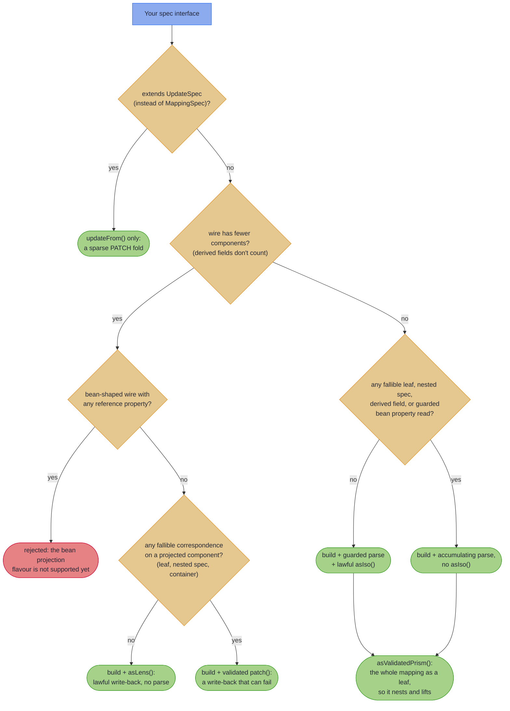

# The Emission Tiers: Truthful Types {#the-emission-tiers-truthful-types}

_The generated surface only ever offers what the field correspondences can lawfully support; nothing is fabricated._

Most mapping tools generate the same surface for every pair and let the unlawful corners fail at runtime. `@GenerateMapping` does the opposite: it reads the field correspondences and emits only the operations they can honour. A lossless pair earns an `Iso`; a lossy projection (a wire carrying fewer components than the domain) earns a `Lens` write-back but no parse; a validating projection earns a fallible `patch`. The types tell the truth, and the truth is law-checked.

~~~admonish info title="What You'll Learn"
- Reading the tier table: which spec shapes emit `asIso()`, `asLens()`, `patch`, `asValidatedPrism()`, or `updateFrom`
- Why a lossless mapping's `parse` is still guarded, and when `reverseGet` is safe
- The validated `patch` tier for projections that validate or normalise
- Law-checking your own specs with one `MappingLaws` call per tier
~~~

~~~admonish example title="See Example Code"
**The code on this page is [RecordMappingBook.java](https://github.com/higher-kinded-j/higher-kinded-j/blob/main/hkj-examples/src/main/java/org/higherkindedj/example/book/mapping/RecordMappingBook.java)** - the page includes it directly, so it is compiled and run by the build.
~~~

The field correspondences select what the Impl can lawfully offer. As a decision flow:



(The bean-read leg of that last decision: on a bean wire an unset reference property is an ordinary state, so its guarded reads count as fallible and a lossless-*looking* bean mapping still lands on the accumulating branch, withholding `asIso()`; see [Beans and Sparse PATCH](beans_patch.md#bean-shaped-wire-targets). The rejected bean projection is [#702](https://github.com/higher-kinded-j/higher-kinded-j/issues/702); an all-primitive bean projection, whose reads can never be null, takes the `asLens()` branch. And a projection that also declares a [derived field](basics.md#derived-wire-fields) is rejected outright, which is why derived fields do not count towards the wire tally.)

And as the reference table:

| Spec shape | Generated surface |
|---|---|
| All components identity-matched (lossless) | `build`, guarded `parse`, **`asIso()`** |
| Any fallible leaf, nested spec or derived field | `build`, accumulating `parse`, no `asIso` |
| Wire record with *fewer* components, all identity (lossy projection) | `build` + **`asLens()`** whose `set` writes the projected components back, **no `parse`** (the dropped components cannot be reconstructed) |
| Wire record with fewer components **and** any fallible correspondence | `build` + a validated **`patch(domain, wire)`** write-back, no `asLens` and no `parse`, [below](#leaf-carrying-projections-the-validated-patch) |
| Every parse-capable mapping | **`asValidatedPrism()`**: the mapping as a leaf, so it nests and lifts |
| A spec extending **`UpdateSpec`** (opt-in, bean wire) | only **`updateFrom(Wire)`**: a sparse PATCH fold, [Beans and Sparse PATCH](beans_patch.md#sparse-patch-write-back-updatespec) |

``` java
{{#include ../../../hkj-examples/src/main/java/org/higherkindedj/example/book/mapping/RecordMappingBook.java:projection_spec}}

{{#include ../../../hkj-examples/src/main/java/org/higherkindedj/example/book/mapping/RecordMappingBook.java:projection_usage}}
// department written back, age kept: a lawful lens, not a fake inverse
```

~~~admonish note title="Two honesty notes on the lossless row"
"Guarded" because even a lossless record `parse` can fail on a hostile binding (a null reference component, or a null element inside an identity container, is a located invalid); the parse-iso coherence law is therefore stated only for wires whose reference components are non-null. And `asIso().reverseGet` is a second, *unguarded* wire-to-domain direction: it exists for lawful in-memory round trips, so never feed a freshly bound wire to `reverseGet`; locating its nulls is `parse`'s job.
~~~

---

## Law-checked, in the repo and in your tests

"Lawfully offer" is verified, not promised: every emission tier above (lossless iso, projection lens, fallible leaf, nested spec, `List`/`Optional`/`Map` lifting, sealed dispatch, derived fields) is compiled and law-checked in the Higher-Kinded-J build itself, against the published [`hkj-test` law harness](../tooling/test_assertions.md#optic-laws).

~~~admonish tip title="Why this matters"
Every mapping tool promises correctness; this one states laws and runs them. The tier table is not documentation of intent: each row names properties that hold as passing tests (round trip, projection identity, idempotence, coherence between surfaces). They run in this repository on every build, and the one call below runs them in yours. When a record refactor changes what the pair can lawfully support, the generated surface changes with it and the law test tells you at build time, not in production. We know of no other Java mapping generator that law-checks its own output; it is the difference between a mapper you trust and a mapper you audit.
~~~

Your own specs get the same guarantee with one call from a test (`hkj-test` is a test-scope dependency):

``` java
import org.higherkindedj.optics.laws.MappingLaws;

{{#include ../../../hkj-examples/src/test/java/org/higherkindedj/example/book/mapping/RecordMappingBookLawsTest.java:laws}}
```

The overloads follow the tiers:

- **Lossless mapping:** pass `asIso()` plus `asValidatedPrism()` to check the iso laws, both round trips, and the coherence between the two surfaces.
- **Projection:** pass `asLens()` with a domain value and two wire values.
- **Validated patch (leaf-carrying projection):** pass the `patch` and `build` method references, a domain value, and a parsing and a non-parsing wire value ([below](#leaf-carrying-projections-the-validated-patch)).
- **Fallible tier:** pass `asValidatedPrism()` with a parsing and a non-parsing wire value.
- **Derived-field (total-parse) mapping:** `build` recomputes what `parse` ignores, so only the non-derived components round-trip. The domain-sample overload `assertMappingLaws(prism, domainValue)` asserts exactly that and nothing stronger.
- **Sparse-update (`UpdateSpec`) mapping:** pass the `updateFrom` method reference, a domain value, and an all-absent, a valid and an invalid wire to check the identity, idempotence and validation laws ([Beans and Sparse PATCH](beans_patch.md#sparse-patch-write-back-updatespec)).

A spec with a derived field *and* a fallible leaf is better served by the fallible overload, given a parseable wire value whose derived components match what `build` would produce (this keeps the overload's rejection check on the non-parsing wire). Reserve the domain-sample overload for total-parse mappings, where no well-formed wire value can fail.

~~~admonish tip title="Mapping types you don't own"
The annotation sits on *your* spec interface, never on the mapped types, so third-party records, sealed hierarchies, and bean-shaped DTOs from compiled libraries map without being annotatable: `interface VendorOrderMapping extends MappingSpec<com.vendor.OrderRecord, OrderDto> {}` works today. Bean-shaped wire types (getter/setter DTOs) are covered too; see [Beans and Sparse PATCH](beans_patch.md#bean-shaped-wire-targets).
~~~

---

## Leaf-carrying projections: the validated `patch`

A projection that also *validates or normalises* a field (a leaf on a projected component) has no lawful total lens: the write-back can fail. Instead of refusing to generate, the mapping emits the **validated `patch` tier**: the total `build` stays, and the write-back returns `Validated`:

``` java
{{#include ../../../hkj-examples/src/main/java/org/higherkindedj/example/book/mapping/RecordMappingBook.java:leaf_projection_spec}}
```

`patch(domain, wire)` writes every projected component onto the domain, validating each one: every bad field is reported at once, located under its component name, and the unprojected components are read from the domain argument, so they survive untouched by construction:

``` java
{{#include ../../../hkj-examples/src/main/java/org/higherkindedj/example/book/mapping/RecordMappingBook.java:leaf_projection_usage}}
```

~~~admonish warning title="Dense, not sparse: patch is the opposite of updateFrom"
`patch` applies **every** projected component: a `null` reference read becomes a located `FieldError` (`must not be null`), never "leave unchanged". The REST-PATCH contract (null means absent, keep the current value) is the [sparse `UpdateSpec` tier](beans_patch.md#sparse-patch-write-back-updatespec) on a bean wire; this tier is its dense, record-shaped complement for writing a validated sub-view onto a bigger record.
~~~

Everything the full tier resolves is available on the projected components: explicit leaves (beating identity, so a `ValidatedPrism<X, X>` can normalise), nested specs (failures compose into dotted paths), and `List`/`Optional`/`Map` lifting. Nulls locate through the nesting too: a nested wire value delegates to the nested spec's `parse`, whose reference legs carry the same guard, so `patch(customer, new CustomerPatchDto(new AddressDto(null)))` reports `address.zip: must not be null` instead of throwing. Only derived fields stay rejected. At the Spring boundary the result is already [the 422 leg](../spring/spring_boot_integration.md#the-422-leg)'s shape: return it as-is. Like every tier, this one is law-checked:

``` java
{{#include ../../../hkj-examples/src/test/java/org/higherkindedj/example/book/mapping/RecordMappingBookLawsTest.java:patch_laws}}
```

The patch laws are projection identity (`patch(d, build(d)) == Valid(d)`), idempotence, and located validation. `build` after `patch` is deliberately not a law: a normalising leaf rewrites the wire form by design, the same weakening the fallible full tier accepts (it, too, drops the build-after-parse law).

---

~~~admonish info title="Key Takeaways"
* **The tiers tell the truth**: `asIso`, `asLens`, `patch`, `asValidatedPrism`, or `updateFrom` exist only where the correspondences lawfully support them
* **A lossless parse is still guarded**: hostile bindings become located invalids; `reverseGet` is for in-memory round trips only
* **A validating projection gets `patch`, not a fake lens**: every projected component validated, every bad field located, unprojected components untouched by construction
* **Every tier is law-checked**: one `MappingLaws` overload per tier, the same harness the library's own build runs
~~~

~~~admonish tip title="See Also"
- [Testing With hkj-test](../tooling/test_assertions.md#optic-laws) - The law harness `MappingLaws` belongs to
- [Beans and Sparse PATCH](beans_patch.md) - The sparse `updateFrom` tier
- [Injecting, Testing, and Diagnostics](testing.md) - Registering a tier's surface as a bean
~~~

---

**Previous:** [Nesting, Containers, and Sealed Hierarchies](structure.md)
**Next:** [Beans and Sparse PATCH](beans_patch.md)
