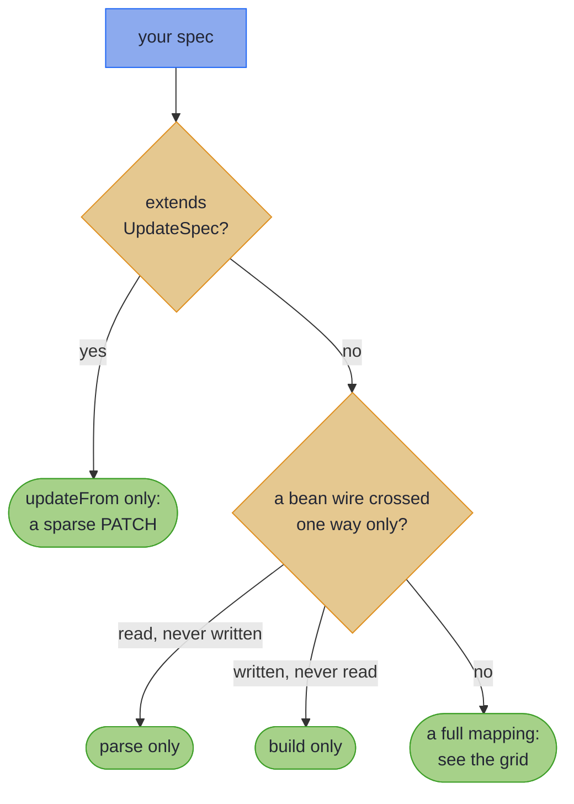

# What Your Spec Generates {#the-emission-tiers-truthful-types}

_The generated surface only ever offers what the field correspondences can lawfully support; nothing is fabricated._

So far every mapping in this chapter has offered `build` and `parse`. Not every pair can keep both promises. The processor reads how each component crosses, and generates only the methods the pair can honour. That set of methods is the spec's *tier*.

~~~admonish info title="What You'll Learn"
- Predict which methods a spec's Impl carries, from two questions about its pair
- Send a bound request to `parse`, never to `asIso().reverseGet`
- Law-check a spec of your own with one `MappingLaws` call
~~~

~~~admonish example title="See Example Code"
**The code on this page is [TiersBook.java](https://github.com/higher-kinded-j/higher-kinded-j/blob/main/hkj-examples/src/main/java/org/higherkindedj/example/book/mapping/TiersBook.java) and its [TiersBookTest.java](https://github.com/higher-kinded-j/higher-kinded-j/blob/main/hkj-examples/src/test/java/org/higherkindedj/example/book/mapping/TiersBookTest.java)** - the page includes them directly, so they are compiled and run by the build.
~~~

> **You:** `EmployeeCardDto` carries two of `Employee`'s three components. Where is my `parse`?
>
> **The processor:** Parse into what? The card has no `age`. I could invent one, and then `parse` would hand you an employee who never existed.
>
> **You:** So the card is write-only?
>
> **The processor:** Better than that. `asLens()` takes the card *and* the employee you already hold, and `set` writes the card's fields onto it. The `age` comes from your employee, so nothing is invented.
>
> **You:** Suppose one of the card's fields needed checking, as an email address does.
>
> **The processor:** Then the write could fail, and a lens's `set` cannot fail. So you get `patch(employee, card)` instead: the same write-back, returning `Validated`, with every bad field located.
>
> **You:** Why not generate everything, and throw when it cannot work?
>
> **The processor:** Because then the types would lie, and you would find out in production. Every method I generate is one whose laws hold for your pair, and one `MappingLaws` call proves it in your build.

Here is that write-back. `asLens()` returns an ordinary [`Lens`](../glossary/optics.md#lens), which works like a record's "with" method that composes through nesting:

``` java
{{#include ../../../hkj-examples/src/main/java/org/higherkindedj/example/book/mapping/TiersBook.java:projection_spec}}

{{#include ../../../hkj-examples/src/main/java/org/higherkindedj/example/book/mapping/TiersBook.java:projection_usage}}
```

## Which methods your spec gets {#which-methods-your-spec-gets}

The first question is what kind of spec it is:



In words: a spec extending `UpdateSpec` gets `updateFrom` alone, a bean that is only read or only written gets that one direction, and every other spec is a full mapping.

A full mapping's methods turn on two independent questions: does the wire carry every domain component, and does every component simply copy?

| | Every component copies | Anything but a plain copy |
|---|---|---|
| **The wire carries every component** | `build`, a guarded `parse`, `asIso()` | `build`, an accumulating `parse` |
| **The wire carries fewer** | `build`, `asLens()` | `build`, `patch(domain, wire)` |

- **Anything but a plain copy** is a leaf, or a nested spec, including one lifted over a container. An `@OptionalBridge` component counts too, and so does a reference property on a bean wire, which can be left unset.
- **A derived field is not a plain copy either.** On the bottom row the processor refuses it, since `build` recomputes what the write-back would set.
- **The top row also gets `asValidatedPrism()`**: the whole mapping as a leaf, so it nests in another spec and lifts over containers.

[Where a bean or a bridged component lands](rules.md#where-a-bean-or-bridged-component-lands) has the precise rules. The same tiers, as a table to search:

| Spec shape | Generated surface |
|---|---|
| All components identity-matched (lossless) | `build`, guarded `parse`, **`asIso()`** |
| Any fallible leaf, nested spec, derived field or bridged `Optional` | `build`, accumulating `parse`, no `asIso` |
| Wire with *fewer* components, all identity (lossy projection; on a bean, all primitive) | `build` + **`asLens()`** whose `set` writes the projected components back, **no `parse`** (the dropped components cannot be reconstructed) |
| Wire with fewer components **and** any fallible correspondence (on a bean, any reference property) | `build` + a validated **`patch(domain, wire)`** write-back, no `asLens` and no `parse`: [the validated `patch`](#leaf-carrying-projections-the-validated-patch) |
| Every full mapping (it builds and parses) | **`asValidatedPrism()`**: the mapping as a leaf, so it nests and lifts |
| A bean wire with getters and nothing that writes it (parse-only) | `parse` + **`asValidatedParse()`**, no `build`: [One-directional beans](beans.md#one-directional-beans) |
| A bean wire that is written and declares no getter (build-only) | `build` + **`asValidatedBuild()`**, no `parse`: [One-directional beans](beans.md#one-directional-beans) |
| A spec extending **`UpdateSpec`** (opt-in, bean wire; not alongside `MappingSpec`) | only **`updateFrom(Wire)`**: a sparse PATCH fold, [Sparse PATCH](beans_patch.md#sparse-patch-write-back-updatespec) |

~~~admonish warning title="Not checked for you: `reverseGet` has no guard"
A lossless `parse` is still guarded. A `null` becomes a located error, and so does a value [the domain's constructor refuses](absence.md#constructor-invariants). `asIso().reverseGet` runs the same direction with neither guard: it builds the record directly, so whatever the constructor accepts goes in, and whatever it throws propagates. It is for round trips of values `build` produced. Give a freshly bound request to `parse`. A projection's `asLens().set` builds through the same constructor, so it propagates a refusal too.
~~~

## Law-checked, in the repo and in your tests {#law-checked-in-the-repo-and-in-your-tests}

Every tier is compiled and law-checked in the Higher-Kinded-J build itself, against the published [`hkj-test` law harness](../tooling/test_assertions.md#optic-laws). Your own specs get the same check with one call from a test, since `hkj-test` is a test-scope dependency. It works like an EqualsVerifier test, where one call checks a contract the class promises. Here the contract is the round trip:

``` java
import org.higherkindedj.optics.laws.MappingLaws;

{{#include ../../../hkj-examples/src/test/java/org/higherkindedj/example/book/mapping/TiersBookTest.java:laws}}
```

The laws are checked at the sample values you pass, not for every value, so give them the values your boundary actually meets. A `@ParameterizedTest` drives several spellings through the same call:

``` java
{{#include ../../../hkj-examples/src/test/java/org/higherkindedj/example/book/mapping/TiersBookTest.java:laws_each_spelling}}
```

Each tier has its own overload:

| Your spec's tier | Pass to `assertMappingLaws` |
|---|---|
| lossless | `asIso()`, `asValidatedPrism()`, a domain value and a wire value |
| accumulating `parse` | `asValidatedPrism()`, a wire that parses and one that does not |
| accumulating, whose only extra is a derived field | `asValidatedPrism()` and a domain value |
| projection | `asLens()`, a domain value and two wire values |
| validated `patch` | `patch` and `build` as method references, a domain value, a wire that parses and one that does not |
| parse-only bean | `asValidatedParse()`, a wire that parses and one that does not |
| build-only bean | `asValidatedBuild()` and a domain value |
| `UpdateSpec` | `updateFrom` as a method reference, a domain value, and an all-absent, a valid and an invalid wire |

[Testing With hkj-test](../tooling/test_assertions.md#optic-laws) says what each overload checks, and how to choose its samples.

~~~admonish tip title="Why this matters"
Most mapping tools generate the same surface for every pair, and let the unlawful corners fail at runtime. Here each row of the tier table names properties that hold as passing tests: in this repository on every build, and in yours with one call. When a record refactor changes what a pair can support, the generated surface changes with it, and the law test tells you at build time, not in production.
~~~

~~~admonish tip title="You can ship now"
You can now predict which methods a spec generates, send requests through `parse`, and law-check the spec in your build. The rest of this page, [the validated `patch`](#leaf-carrying-projections-the-validated-patch), is for when a projection needs to validate.
~~~

~~~admonish question title="Checkpoint: does a leaf that never fails keep asIso()?" id="check-tiers-leaf-iso"
`CouponMapping` maps a pair whose components match one for one. Its one leaf tidies the code's spelling, and never fails:

``` java
{{#include ../../../hkj-examples/src/main/java/org/higherkindedj/example/book/mapping/TiersBook.java:coupon_spec}}
```

Which methods does `CouponMappingImpl` carry?

1. `build`, a guarded `parse`, `asIso()` and `asValidatedPrism()`
2. `build`, an accumulating `parse` and `asValidatedPrism()`
3. `build` and `asLens()`
4. `build`, `parse` and `asIso()`, but no `asValidatedPrism()`
~~~

~~~admonish success title="Answer and why" collapsible=true id="check-tiers-leaf-iso-answer"
**2.** The grid's column asks whether a component simply copies, not whether it can fail. A leaf is not a plain copy, so the pair sits in the top-right cell. This leaf is no isomorphism anyway: a wire `" save10 "` parses to `SAVE10` and builds back as `SAVE10`, so the round trip changes the wire.

``` java
{{#include ../../../hkj-examples/src/test/java/org/higherkindedj/example/book/mapping/TiersBookTest.java:check_leaf_no_iso}}
```

Where this lives: [Which methods your spec gets](#which-methods-your-spec-gets).
~~~

~~~admonish question title="Checkpoint: what does reverseGet do with a bound request?" id="check-tiers-reverse-get"
`PersonMapping`, from [Record Mapping Basics](basics.md#your-first-mapping), is lossless: `Person(String name, int age)` against `PersonDto(String name, int age)`. A controller binds a request body that left out `name`, so it holds `new PersonDto(null, 36)`, and converts it with `asIso().reverseGet`. What does it get?

1. `Invalid(NonEmptyList[name: must not be null])`
2. A `NullPointerException`
3. `Person[name=null, age=36]`
4. A compile error: `reverseGet` does not accept a wire value
~~~

~~~admonish success title="Answer and why" collapsible=true id="check-tiers-reverse-get-answer"
**3.** `reverseGet` has no guard, and `Person`'s constructor accepts a `null`, so the `null` reaches the domain with no error and no exception. `parse` would have located it:

``` java
{{#include ../../../hkj-examples/src/test/java/org/higherkindedj/example/book/mapping/TiersBookTest.java:check_reverse_get}}
```

Where this lives: the warning in [Which methods your spec gets](#which-methods-your-spec-gets).
~~~

---

## Leaf-carrying projections: the validated `patch` {#leaf-carrying-projections-the-validated-patch}

A projection that also validates or normalises a projected component has no lawful lens, since the write-back can fail. So the processor emits the **validated `patch` tier**: `build` stays, and the write-back returns `Validated`. A bean projection with a reference property lands here even without a leaf, because that property can be left unset ([Bean projections](beans.md#bean-projections)):

``` java
{{#include ../../../hkj-examples/src/main/java/org/higherkindedj/example/book/mapping/TiersBook.java:leaf_projection_spec}}
```

`patch(domain, wire)` validates every projected component and writes it onto the domain. Every bad field is reported at once, under its component name. The components the wire does not carry are read from the domain argument, so they survive by construction:

``` java
{{#include ../../../hkj-examples/src/main/java/org/higherkindedj/example/book/mapping/TiersBook.java:leaf_projection_usage}}
```

~~~admonish warning title="Dense, not sparse: patch is the opposite of updateFrom"
`patch` applies **every** projected component, and never leaves one unchanged. A `null` reference read becomes a located `FieldError` (`must not be null`). A [bridged](absence.md#optional-bridge) `Optional` component, automatic on a bean wire, reads `null` as empty and writes that. The REST PATCH contract, where a `null` means *keep the current value*, is the [sparse `UpdateSpec` tier](beans_patch.md#sparse-patch-write-back-updatespec). This tier is its dense complement, for writing a validated sub-view onto a bigger record.
~~~

A projected component resolves everything a full mapping resolves. An explicit leaf beats a plain copy, so a `ValidatedPrism<X, X>` can normalise. A nested spec's failures compose into dotted paths, and containers lift. A nested wire value parses through its own spec, so `patch(customer, new CustomerPatchDto(new AddressDto(null)))` reports `address.zip: must not be null` instead of throwing. At the Spring boundary the result is already [the 422 leg](../spring/spring_boot_integration.md#the-422-leg)'s shape: return it as it is. Like every tier, this one is law-checked:

``` java
{{#include ../../../hkj-examples/src/test/java/org/higherkindedj/example/book/mapping/TiersBookTest.java:patch_laws}}
```

The patch laws are projection identity (`patch(d, build(d)) == Valid(d)`), idempotence, and located validation. `build` after `patch` is deliberately not a law: a normalising leaf rewrites the wire form by design, as the fallible full tier does.

---

~~~admonish info title="Key Takeaways"
* **Two questions pick a full mapping's methods**: does the wire carry every component, and does every component simply copy
* **A bound request goes to `parse`**: `asIso().reverseGet` has no guard, so it is for values `build` produced
* **Every tier is law-checked**: one `MappingLaws` call per tier, the same harness the library's own build runs
~~~

~~~admonish tip title="See Also"
- [Testing With hkj-test](../tooling/test_assertions.md#optic-laws): The law harness `MappingLaws` belongs to
- [Sparse PATCH](beans_patch.md): The sparse `updateFrom` tier
- [Injecting, Testing, and Diagnostics](testing.md): Registering a tier's surface as a bean
~~~

---

**Previous:** [Check Your Understanding](self_check.md)
**Next:** [Bean-Shaped Wires](beans.md)
