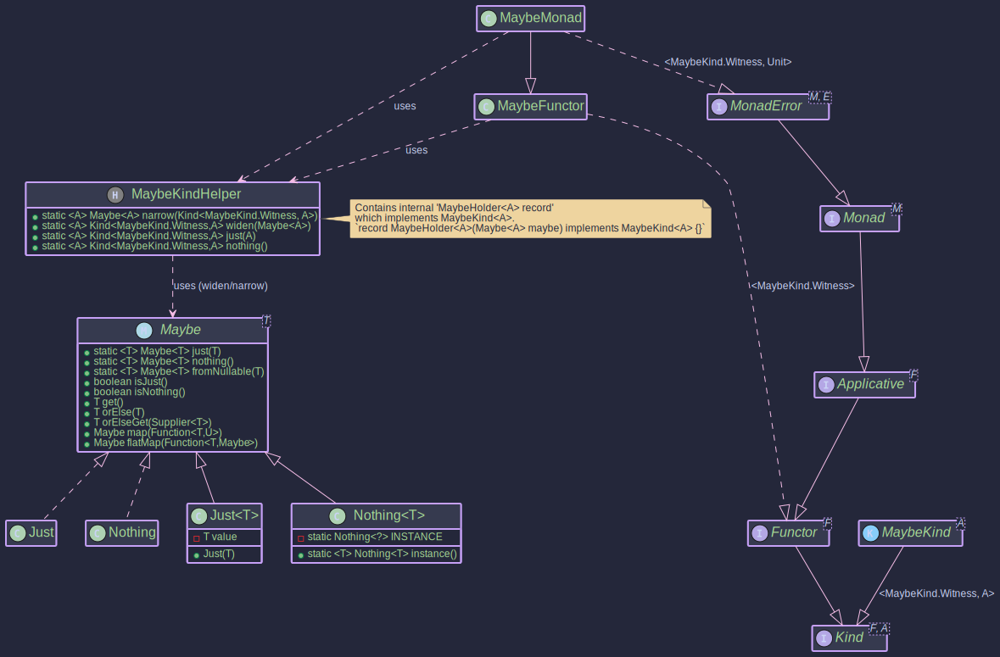

# Maybe - Handling Optional Values with Non-Null Guarantee

## Purpose

The `Maybe<T>` type in `Higher-Kinded-J` represents a value that might be present (`Just<T>`) or absent (`Nothing<T>`). It is conceptually similar to `java.util.Optional<T>` but with a key distinction: a `Just<T>` is guaranteed to hold a **non-null** value. This strictness helps prevent `NullPointerExceptions` when a value is asserted to be present. `Maybe.fromNullable(T value)` or `MaybeMonad.of(T value)` should be used if the input value could be null, as these will correctly produce a `Nothing` in such cases.

The `MaybeMonad` provides a monadic interface for `Maybe`, allowing for functional composition and integration with the Higher-Kinded Type (HKT) system. This facilitates chaining operations that may or may not yield a value, propagating the `Nothing` state automatically.

Key benefits include:

* **Explicit Optionality with Non-Null Safety:** `Just<T>` guarantees its contained value is not null. `Nothing<T>` clearly indicates absence.
* **Functional Composition:** Enables elegant chaining of operations using `map`, `flatMap`, and `ap`, where `Nothing` short-circuits computations.
* **HKT Integration:** `MaybeKind<A>` (the HKT wrapper for `Maybe<A>`) and `MaybeMonad` allow `Maybe` to be used with generic functions and type classes that expect `Kind<F, A>`, `Functor<F>`, `Applicative<F>`, `Monad<M>`, or `MonadError<M, E>`.
* **Error Handling for Absence:** `MaybeMonad` implements `MonadError<MaybeKind.Witness, Void>`. `Nothing` is treated as the "error" state, with `Void` as the phantom error type, signifying absence.

It implements `MonadError<MaybeKind.Witness, Void>`, which transitively includes `Monad<MaybeKind.Witness>`, `Applicative<MaybeKind.Witness>`, and `Functor<MaybeKind.Witness>`.

## Structure




## How to Use `MaybeMonad` and `Maybe`

### Creating Instances

`Maybe<A>` instances can be created directly using static factory methods on `Maybe`, or via `MaybeMonad` for HKT integration. `MaybeKind<A>` is the HKT wrapper.

1. **Direct `Maybe` Creation:**

   * `Maybe.just(@NonNull T value)`: Creates a `Just` holding a **non-null** value. Throws `NullPointerException` if `value` is null.
     ```java
     import org.higherkindedj.hkt.maybe.Maybe;

     Maybe<String> justHello = Maybe.just("Hello"); // Just("Hello")
     // Maybe<String> illegalJust = Maybe.just(null); // Throws NullPointerException
     ```
   * `Maybe.nothing()`: Returns a singleton `Nothing` instance.
     ```java
     Maybe<Integer> noInt = Maybe.nothing(); // Nothing
     ```
   * `Maybe.fromNullable(@Nullable T value)`: Creates `Just(value)` if `value` is non-null, otherwise `Nothing`.
     ```java
     Maybe<String> fromPresent = Maybe.fromNullable("Present"); // Just("Present")
     Maybe<String> fromNull = Maybe.fromNullable(null);     // Nothing
     ```
2. **`MaybeKindHelper` (for HKT wrapping):**

   * `MaybeKindHelper.wrap(Maybe<A> maybe)`: Converts a `Maybe<A>` to `MaybeKind<A>`.
     ```java
     import org.higherkindedj.hkt.maybe.MaybeKind;
     import org.higherkindedj.hkt.maybe.MaybeKindHelper;

     MaybeKind<String> kindJust = MaybeKindHelper.wrap(Maybe.just("Wrapped"));
     MaybeKind<Integer> kindNothing = MaybeKindHelper.wrap(Maybe.nothing());
     ```
   * `MaybeKindHelper.just(@NonNull A value)`: Convenience for `wrap(Maybe.just(value))`.
   * `MaybeKindHelper.nothing()`: Convenience for `wrap(Maybe.nothing())`.
3. **`MaybeMonad` Instance Methods:**

   * `maybeMonad.of(@Nullable A value)`: Lifts a value into `MaybeKind`. Uses `Maybe.fromNullable()` internally.
     ```java
     import org.higherkindedj.hkt.maybe.MaybeMonad;
     import org.higherkindedj.hkt.Kind;
     import org.higherkindedj.hkt.maybe.MaybeKind;


     MaybeMonad maybeMonad = new MaybeMonad();
     Kind<MaybeKind.Witness, String> kindFromMonad = maybeMonad.of("Monadic"); // Just("Monadic")
     Kind<MaybeKind.Witness, String> kindNullFromMonad = maybeMonad.of(null);   // Nothing
     ```
   * `maybeMonad.raiseError(@Nullable Void error)`: Creates a `MaybeKind` representing `Nothing`. The `error` (Void) argument is ignored.
     ```java
     Kind<MaybeKind.Witness, Double> errorKind = maybeMonad.raiseError(null); // Nothing
     ```

### Unwrapping `MaybeKind`

To get the underlying `Maybe<A>` from a `MaybeKind<A>`, use `MaybeKindHelper.unwrap()`:

```java
import org.higherkindedj.hkt.maybe.Maybe;
import org.higherkindedj.hkt.maybe.MaybeKind;
import org.higherkindedj.hkt.maybe.MaybeKindHelper;

MaybeKind<String> kindJust = MaybeKindHelper.just("Example");
Maybe<String> unwrappedMaybe = MaybeKindHelper.unwrap(kindJust); // Just("Example")
System.out.println("Unwrapped: " + unwrappedMaybe);

MaybeKind<Integer> kindNothing = MaybeKindHelper.nothing();
Maybe<Integer> unwrappedNothing = MaybeKindHelper.unwrap(kindNothing); // Nothing
System.out.println("Unwrapped Nothing: " + unwrappedNothing);
```

### Interacting with `Maybe` values

The `Maybe` interface itself provides useful methods:

* `isJust()`: Returns `true` if it's a `Just`.
* `isNothing()`: Returns `true` if it's a `Nothing`.
* `get()`: Returns the value if `Just`, otherwise throws `NoSuchElementException`. **Use with caution.**
* `orElse(@NonNull T other)`: Returns the value if `Just`, otherwise returns `other`.
* `orElseGet(@NonNull Supplier<? extends @NonNull T> other)`: Returns the value if `Just`, otherwise invokes `other.get()`.
* The `Maybe` interface also has its own `map` and `flatMap` methods, which are similar in behavior to those on `MaybeMonad` but operate directly on `Maybe` instances.

### Key Operations (via `MaybeMonad`)

* **`map(Function<A, B> f, Kind<MaybeKind.Witness, A> ma)`:** Applies `f` to the value inside `ma` if it's `Just`. If `ma` is `Nothing`, or if `f` returns `null` (which `Maybe.fromNullable` then converts to `Nothing`), the result is `Nothing`.

```java
import org.higherkindedj.hkt.maybe.MaybeMonad;
import org.higherkindedj.hkt.Kind;
import org.higherkindedj.hkt.maybe.MaybeKind;
import org.higherkindedj.hkt.maybe.MaybeKindHelper;
import java.util.function.Function;

MaybeMonad maybeMonad = new MaybeMonad();
Kind<MaybeKind.Witness, Integer> justNum = MaybeKindHelper.just(10);
Kind<MaybeKind.Witness, Integer> nothingNum = MaybeKindHelper.nothing();

Function<Integer, String> numToString = n -> "Val: " + n;
Kind<MaybeKind.Witness, String> justStr = maybeMonad.map(numToString, justNum); // Just("Val: 10")
Kind<MaybeKind.Witness, String> nothingStr = maybeMonad.map(numToString, nothingNum); // Nothing

Function<Integer, String> numToNull = n -> null;
Kind<MaybeKind.Witness, String> mappedToNull = maybeMonad.map(numToNull, justNum); // Nothing

System.out.println("Map (Just): " + MaybeKindHelper.unwrap(justStr));
System.out.println("Map (Nothing): " + MaybeKindHelper.unwrap(nothingStr));
System.out.println("Map (To Null): " + MaybeKindHelper.unwrap(mappedToNull));
```

* **`flatMap(Function<A, Kind<MaybeKind.Witness, B>> f, Kind<MaybeKind.Witness, A> ma)`:** If `ma` is `Just(a)`, applies `f` to `a`. `f` must return a `Kind<MaybeKind.Witness, B>`. If `ma` is `Nothing`, or `f` returns `Nothing`, the result is `Nothing`.

```java
Function<String, Kind<MaybeKind.Witness, Integer>> parseString = s -> {
    try {
        // Note: Maybe.just requires non-null, so if parseInt could throw, handle it.
        // For simplicity, assuming s is a valid number string here.
        return MaybeKindHelper.just(Integer.parseInt(s));
    } catch (NumberFormatException e) {
        return MaybeKindHelper.nothing();
    }
};

Kind<MaybeKind.Witness, String> justFiveStr = MaybeKindHelper.just("5");
Kind<MaybeKind.Witness, Integer> parsedJust = maybeMonad.flatMap(parseString, justFiveStr); // Just(5)

Kind<MaybeKind.Witness, String> justNonNumStr = MaybeKindHelper.just("abc");
Kind<MaybeKind.Witness, Integer> parsedNonNum = maybeMonad.flatMap(parseString, justNonNumStr); // Nothing

System.out.println("FlatMap (Just): " + MaybeKindHelper.unwrap(parsedJust));
System.out.println("FlatMap (NonNum): " + MaybeKindHelper.unwrap(parsedNonNum));
```

* **`ap(Kind<MaybeKind.Witness, Function<A, B>> ff, Kind<MaybeKind.Witness, A> fa)`:** If `ff` is `Just(f)` and `fa` is `Just(a)`, applies `f` to `a`. Otherwise, `Nothing`.

```java
Kind<MaybeKind.Witness, Function<Integer, String>> justFunc = MaybeKindHelper.just(i -> "Result: " + i);
Kind<MaybeKind.Witness, Function<Integer, String>> nothingFunc = MaybeKindHelper.nothing();

Kind<MaybeKind.Witness, String> apApplied = maybeMonad.ap(justFunc, justNum); // Just("Result: 10")
Kind<MaybeKind.Witness, String> apNothingFunc = maybeMonad.ap(nothingFunc, justNum); // Nothing
Kind<MaybeKind.Witness, String> apNothingVal = maybeMonad.ap(justFunc, nothingNum); // Nothing

System.out.println("Ap (Applied): " + MaybeKindHelper.unwrap(apApplied));
System.out.println("Ap (Nothing Func): " + MaybeKindHelper.unwrap(apNothingFunc));
System.out.println("Ap (Nothing Val): " + MaybeKindHelper.unwrap(apNothingVal));
```

* **`handleErrorWith(Kind<MaybeKind.Witness, A> ma, Function<Void, Kind<MaybeKind.Witness, A>> handler)`:** If `ma` is `Just`, it's returned. If `ma` is `Nothing` (the "error" state), `handler` is invoked (with `null` for `Void`) to provide a recovery `MaybeKind`.

```java
Function<Void, Kind<MaybeKind.Witness, String>> recover = v -> MaybeKindHelper.just("Recovered");

Kind<MaybeKind.Witness, String> handledJust = maybeMonad.handleErrorWith(MaybeKindHelper.just("Original"), recover); // Just("Original")
Kind<MaybeKind.Witness, String> handledNothing = maybeMonad.handleErrorWith(MaybeKindHelper.nothing(), recover);    // Just("Recovered")

System.out.println("HandleError (Just): " + MaybeKindHelper.unwrap(handledJust));
System.out.println("HandleError (Nothing): " + MaybeKindHelper.unwrap(handledNothing));
```

### Using `MaybeMonad` with Higher-Kinded-J (Generic Code)

A complete example demonstrating generic usage:

```java
import org.higherkindedj.hkt.Kind;
import org.higherkindedj.hkt.maybe.Maybe;
import org.higherkindedj.hkt.maybe.MaybeKind;
import org.higherkindedj.hkt.maybe.MaybeKindHelper;
import org.higherkindedj.hkt.maybe.MaybeMonad;
import java.util.function.Function;

public class MaybeMonadExample {

    // A generic function that works with any MonadError supporting Void errors
    public static <M, A, B> Kind<M, B> processData(
        Kind<M, A> inputKind,
        Function<A, B> mapper,
        B defaultValueOnAbsence,
        MaybeMonad monad // Using MaybeMonad specifically for its MonadError<MaybeKind.Witness, Void>
                         // In a truly generic scenario, this would be MonadError<M, Void>
    ) {
        Kind<M, B> mappedKind = monad.map(mapper, inputKind);
        return monad.handleErrorWith(mappedKind, (Void v) -> monad.of(defaultValueOnAbsence));
    }

    public static void main(String[] args) {
        MaybeMonad maybeMonad = new MaybeMonad();

        // 1. Create MaybeKind instances
        Kind<MaybeKind.Witness, Integer> presentIntKind = MaybeKindHelper.just(100);
        Kind<MaybeKind.Witness, Integer> absentIntKind = MaybeKindHelper.nothing();
        Kind<MaybeKind.Witness, String> nullInputStringKind = maybeMonad.of(null); // Becomes Nothing

        // 2. Use map
        Function<Integer, String> intToStatus = n -> "Status: " + n;
        Kind<MaybeKind.Witness, String> mappedPresent = maybeMonad.map(intToStatus, presentIntKind);
        Kind<MaybeKind.Witness, String> mappedAbsent = maybeMonad.map(intToStatus, absentIntKind);

        System.out.println("Mapped (Present): " + MaybeKindHelper.unwrap(mappedPresent)); // Just(Status: 100)
        System.out.println("Mapped (Absent): " + MaybeKindHelper.unwrap(mappedAbsent));   // Nothing

        // 3. Use flatMap
        Function<Integer, Kind<MaybeKind.Witness, String>> intToPositiveStatusKind = n ->
            (n > 0) ? maybeMonad.of("Positive: " + n) : MaybeKindHelper.nothing();

        Kind<MaybeKind.Witness, String> flatMappedPresent = maybeMonad.flatMap(intToPositiveStatusKind, presentIntKind);
        Kind<MaybeKind.Witness, String> flatMappedZero = maybeMonad.flatMap(intToPositiveStatusKind, maybeMonad.of(0)); // 0 is not > 0

        System.out.println("FlatMapped (Present Positive): " + MaybeKindHelper.unwrap(flatMappedPresent)); // Just(Positive: 100)
        System.out.println("FlatMapped (Zero): " + MaybeKindHelper.unwrap(flatMappedZero)); // Nothing

        // 4. Use 'of' and 'raiseError'
        Kind<MaybeKind.Witness, String> fromOf = maybeMonad.of("Direct Value");
        Kind<MaybeKind.Witness, String> fromRaiseError = maybeMonad.raiseError(null); // Creates Nothing
        System.out.println("From 'of': " + MaybeKindHelper.unwrap(fromOf)); // Just(Direct Value)
        System.out.println("From 'raiseError': " + MaybeKindHelper.unwrap(fromRaiseError)); // Nothing
        System.out.println("From 'of(null)': " + MaybeKindHelper.unwrap(nullInputStringKind)); // Nothing


        // 5. Use handleErrorWith
        Function<Void, Kind<MaybeKind.Witness, Integer>> recoverWithDefault =
            v -> maybeMonad.of(-1); // Default value if absent

        Kind<MaybeKind.Witness, Integer> recoveredFromAbsent =
            maybeMonad.handleErrorWith(absentIntKind, recoverWithDefault);
        Kind<MaybeKind.Witness, Integer> notRecoveredFromPresent =
            maybeMonad.handleErrorWith(presentIntKind, recoverWithDefault);

        System.out.println("Recovered (from Absent): " + MaybeKindHelper.unwrap(recoveredFromAbsent)); // Just(-1)
        System.out.println("Recovered (from Present): " + MaybeKindHelper.unwrap(notRecoveredFromPresent)); // Just(100)

        // Using the generic processData function
        Kind<MaybeKind.Witness, String> processedPresent = processData(presentIntKind, x -> "Processed: " + x, "N/A", maybeMonad);
        Kind<MaybeKind.Witness, String> processedAbsent = processData(absentIntKind, x -> "Processed: " + x, "N/A", maybeMonad);

        System.out.println("Generic Process (Present): " + MaybeKindHelper.unwrap(processedPresent)); // Just(Processed: 100)
        System.out.println("Generic Process (Absent): " + MaybeKindHelper.unwrap(processedAbsent));   // Just(N/A)

        // Unwrap to get back the standard Maybe
        Maybe<String> finalMappedMaybe = MaybeKindHelper.unwrap(mappedPresent);
        System.out.println("Final unwrapped mapped maybe: " + finalMappedMaybe); // Just(Status: 100)
    }
}
```

This example highlights how `MaybeMonad` facilitates working with optional values in a functional, type-safe manner, especially when dealing with the HKT abstractions and requiring non-null guarantees for present values.
