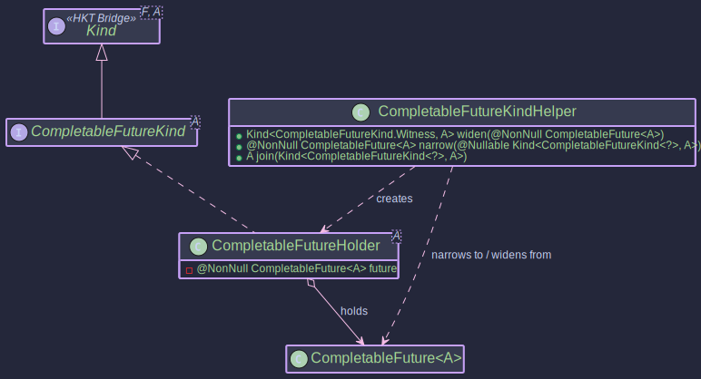

# The CompletableFutureMonad:
## _Asynchronous Computations with `CompletableFuture`_

~~~admonish info title="What You'll Learn"
- How to compose asynchronous operations functionally
- Using MonadError capabilities for async error handling and recovery
- Building non-blocking workflows with `map`, `flatMap`, and `handleErrorWith`
- Integration with EitherT for combining async operations with typed errors
- Real-world patterns for resilient microservice communication
~~~

~~~ admonish example title="See Example Code:"
 [CompletableFutureExample.java](https://github.com/higher-kinded-j/higher-kinded-j/blob/main/hkj-examples/src/main/java/org/higherkindedj/example/basic/future/CompletableFutureExample.java)
~~~

## The Problem: Async Composition Without Structure

Java's `CompletableFuture` is powerful, but composing multiple async operations quickly becomes unwieldy. Consider a typical microservice scenario — fetching a user, looking up their subscription, then calculating a discount:

```java
// Traditional CompletableFuture chaining
CompletableFuture<Discount> result =
    userService.findUser(userId)
        .thenCompose(user ->
            subscriptionService.getSubscription(user.subscriptionId())
                .thenCompose(sub ->
                    pricingService.calculateDiscount(user, sub)
                        .exceptionally(ex -> Discount.none())));
```

Each level of `thenCompose` indents further. Error handling with `exceptionally` or `handle` dangles awkwardly at the end, applies only to the innermost stage, and loses type information — every error becomes a generic `Throwable`. If you need different recovery strategies for different failures, you end up with nested `try`/`catch` inside your lambdas, and the functional style collapses.

The `CompletableFutureMonad` gives you a structured alternative: standard `map`, `flatMap`, and `handleErrorWith` operations that compose cleanly, and the ability to write generic code that works across *any* monadic type — not just `CompletableFuture`.

## Core Components

**Higher-Kinded Bridge for CompletableFuture**



**TypeClasses**


The simulation for `CompletableFuture` involves these key pieces:

| Component | Role |
|-----------|------|
| `CompletableFuture<A>` | Standard Java async computation |
| `CompletableFutureKind<A>` | HKT marker (`Kind<CompletableFutureKind.Witness, A>`) — enables generic type class programming |
| `CompletableFutureKindHelper` | Bridge utilities: `widen()`, `narrow()`, and `join()` for blocking extraction |
| `CompletableFutureMonad` | Implements `MonadError<CompletableFutureKind.Witness, Throwable>` — provides `map`, `flatMap`, `of`, `ap`, `raiseError`, and `handleErrorWith` |

~~~admonish note title="How the Operations Map"
The type class operations correspond directly to `CompletableFuture` methods you already know:

| Type Class Operation | CompletableFuture Equivalent |
|---------------------|------------------------------|
| `map(f, fa)` | `thenApply(f)` |
| `flatMap(f, fa)` | `thenCompose(f)` |
| `ap(ff, fa)` | `thenCombine(ff, (a, f) -> f.apply(a))` |
| `of(value)` | `completedFuture(value)` |
| `raiseError(ex)` | `failedFuture(ex)` |
| `handleErrorWith(fa, handler)` | `exceptionallyCompose(handler)` |

The difference is that these operations work through the `Kind` abstraction, so your code becomes reusable across *any* monadic type — swap `CompletableFuture` for `IO`, `Either`, or `VTask` without changing the logic.
~~~

## Working with CompletableFutureMonad

The following examples build on a running scenario: an async service that fetches user data, validates subscriptions, and handles failures gracefully.

~~~admonish example title="Creating Instances"

- [CompletableFutureExample.java](https://github.com/higher-kinded-j/higher-kinded-j/blob/main/hkj-examples/src/main/java/org/higherkindedj/example/basic/future/CompletableFutureExample.java)

```java
public void createExample() {
   // Get the MonadError instance
   CompletableFutureMonad futureMonad = CompletableFutureMonad.INSTANCE;

   // --- Lift a pure value into an already-completed future ---
   Kind<CompletableFutureKind.Witness, String> successKind = futureMonad.of("Success!");

   // --- Create a failed future from an exception ---
   RuntimeException error = new RuntimeException("Something went wrong");
   Kind<CompletableFutureKind.Witness, String> failureKind = futureMonad.raiseError(error);

   // --- Wrap an existing CompletableFuture ---
   CompletableFuture<Integer> existingFuture = CompletableFuture.supplyAsync(() -> {
      try {
         TimeUnit.MILLISECONDS.sleep(20);
      } catch (InterruptedException e) { /* ignore */ }
      return 123;
   });
   Kind<CompletableFutureKind.Witness, Integer> wrappedExisting = FUTURE.widen(existingFuture);

   CompletableFuture<Integer> failedExisting = new CompletableFuture<>();
   failedExisting.completeExceptionally(new IllegalArgumentException("Bad input"));
   Kind<CompletableFutureKind.Witness, Integer> wrappedFailed = FUTURE.widen(failedExisting);

   // Unwrap back to CompletableFuture at system boundaries
   CompletableFuture<String> unwrappedSuccess = FUTURE.narrow(successKind);
   CompletableFuture<String> unwrappedFailure = FUTURE.narrow(failureKind);
}
```
~~~

~~~admonish example title="Composing with map, flatMap, and ap"

- [CompletableFutureExample.java](https://github.com/higher-kinded-j/higher-kinded-j/blob/main/hkj-examples/src/main/java/org/higherkindedj/example/basic/future/CompletableFutureExample.java)

These examples show how the type class instance composes async operations — the same `map`/`flatMap` vocabulary you use with `Either`, `IO`, or any other monad.

```java
public void monadExample() {
   CompletableFutureMonad futureMonad = CompletableFutureMonad.INSTANCE;

   // --- map: transform the result when it completes ---
   Kind<CompletableFutureKind.Witness, Integer> initialValueKind = futureMonad.of(10);
   Kind<CompletableFutureKind.Witness, String> mappedKind = futureMonad.map(
           value -> "Result: " + value,
           initialValueKind
   );
   System.out.println("Map Result: " + FUTURE.join(mappedKind)); // Output: Result: 10

   // --- flatMap: sequence async operations that depend on previous results ---
   Function<String, Kind<CompletableFutureKind.Witness, String>> asyncStep2 =
           input -> FUTURE.widen(
                   CompletableFuture.supplyAsync(() -> input + " -> Step2 Done")
           );

   Kind<CompletableFutureKind.Witness, String> flatMappedKind = futureMonad.flatMap(
           asyncStep2,
           mappedKind // "Result: 10" feeds into asyncStep2
   );
   System.out.println("FlatMap Result: " + FUTURE.join(flatMappedKind));
   // Output: Result: 10 -> Step2 Done

   // --- ap: apply a function from one future to a value from another ---
   Kind<CompletableFutureKind.Witness, Function<Integer, String>> funcKind =
           futureMonad.of(i -> "FuncResult:" + i);
   Kind<CompletableFutureKind.Witness, Integer> valKind = futureMonad.of(25);

   Kind<CompletableFutureKind.Witness, String> apResult = futureMonad.ap(funcKind, valKind);
   System.out.println("Ap Result: " + FUTURE.join(apResult)); // Output: FuncResult:25

   // --- map2: combine two independent futures ---
   Kind<CompletableFutureKind.Witness, Integer> f1 = futureMonad.of(5);
   Kind<CompletableFutureKind.Witness, String> f2 = futureMonad.of("abc");

   BiFunction<Integer, String, String> combine = (i, s) -> s + i;
   Kind<CompletableFutureKind.Witness, String> map2Result = futureMonad.map2(f1, f2, combine);
   System.out.println("Map2 Result: " + FUTURE.join(map2Result)); // Output: abc5
}
```
~~~

~~~admonish example title="Recovering from Failures with handleErrorWith"

- [CompletableFutureExample.java](https://github.com/higher-kinded-j/higher-kinded-j/blob/main/hkj-examples/src/main/java/org/higherkindedj/example/basic/future/CompletableFutureExample.java)

This is where `CompletableFutureMonad` shines. Unlike `exceptionally` which returns a plain value, `handleErrorWith` returns a *new* `Kind` — so recovery itself can be asynchronous.

```java
 public void errorHandlingExample(){
   CompletableFutureMonad futureMonad = CompletableFutureMonad.INSTANCE;

   Kind<CompletableFutureKind.Witness, String> failedKind =
           futureMonad.raiseError(new IllegalStateException("Processing Failed"));

   // Recovery handler — inspect the error and return a new async computation
   Function<Throwable, Kind<CompletableFutureKind.Witness, String>> recoveryHandler =
           error -> {
              if (error instanceof IllegalStateException) {
                 // Recovery can itself be async
                 return FUTURE.widen(CompletableFuture.supplyAsync(() ->
                         "Recovered from: " + error.getMessage()));
              }
              // Re-raise anything we can't handle
              return futureMonad.raiseError(
                      new RuntimeException("Recovery failed", error));
           };

   // Apply the handler — transforms the failed future into a recovered one
   Kind<CompletableFutureKind.Witness, String> recovered =
           futureMonad.handleErrorWith(failedKind, recoveryHandler);
   System.out.println(FUTURE.join(recovered));
   // Output: Recovered from: Processing Failed

   // Success values pass through untouched — the handler is never called
   Kind<CompletableFutureKind.Witness, String> successKind = futureMonad.of("All Good");
   Kind<CompletableFutureKind.Witness, String> handledSuccess =
           futureMonad.handleErrorWith(successKind, recoveryHandler);
   System.out.println(FUTURE.join(handledSuccess));
   // Output: All Good
}
```

The handler receives the *cause* of the failure, unwrapped from `CompletionException` when necessary. This lets you pattern-match on specific exception types and choose recovery strategies — retry, fallback, or re-raise — all within the same compositional pipeline.
~~~


## When to Use CompletableFutureMonad

| Scenario | Use |
|----------|-----|
| Writing generic code that works across monads | `CompletableFutureMonad` — your logic programs against `Kind<F, A>` |
| Composing async workflows with typed error propagation | Combine with [EitherT](../transformers/eithert_transformer.md) — see the [Order Workflow](../hkts/order-walkthrough.md) |
| Straightforward async pipelines in application code | Prefer [CompletableFuturePath](../effect/migration_cookbook.md#recipe-4-completablefuture-nesting-to-completablefuturepath) for fluent API |
| Virtual-thread concurrency | Consider [VTaskPath](../monads/vtask_monad.md) instead |

~~~admonish important title="Key Points"
- `CompletableFutureMonad` implements `MonadError<CompletableFutureKind.Witness, Throwable>`, giving you `map`, `flatMap`, `of`, `ap`, `raiseError`, and `handleErrorWith` over async computations.
- `handleErrorWith` is the key differentiator — recovery can itself be asynchronous, unlike `exceptionally` which forces synchronous fallback.
- Use `CompletableFutureKindHelper.join()` to block and extract results at system boundaries (tests, `main` methods). Avoid calling it mid-pipeline.
- For the HKT bridge: `widen()` wraps a `CompletableFuture` into `Kind`, `narrow()` unwraps it back. Both are low-cost cast operations.
~~~

---

~~~admonish tip title="Effect Path Alternative"
For most application-level use cases, prefer **CompletableFuturePath** which wraps `CompletableFuture` and provides:

- Fluent composition with `map`, `via`, `recover`
- Seamless integration with the [Focus DSL](../optics/focus_dsl.md) for structural navigation
- A consistent API shared across all effect types

```java
// Instead of manual Kind chaining:
Kind<CompletableFutureKind.Witness, User> user = FUTURE.widen(findUser(id));
Kind<CompletableFutureKind.Witness, Order> order = futureMonad.flatMap(
    u -> FUTURE.widen(createOrder(u)), user);

// Use CompletableFuturePath for cleaner composition:
CompletableFuturePath<Order> order = CompletableFuturePath.fromFuture(findUser(id))
    .via(u -> CompletableFuturePath.fromFuture(createOrder(u)));
```

See [Migration Cookbook: Recipe 4](../effect/migration_cookbook.md#recipe-4-completablefuture-nesting-to-completablefuturepath) for a complete before/after walkthrough, and [Effect Path Overview](../effect/effect_path_overview.md) for the complete guide.
~~~

~~~admonish example title="Benchmarks"
CompletableFuture has dedicated JMH benchmarks measuring async composition overhead, error recovery, and chain depth. Key expectations:

- **`of` / `raiseError`** are very fast — they wrap already-completed futures with no thread scheduling
- **`flatMap` chains** add minimal overhead beyond the underlying `thenCompose` cost
- **`handleErrorWith`** matches `exceptionallyCompose` performance while providing stronger composition guarantees

```bash
./gradlew :hkj-benchmarks:jmh --includes=".*CompletableFutureBenchmark.*"
```
See [Benchmarks & Performance](../benchmarks.md) for full details, expected ratios, and how to interpret results.
~~~

---

**Previous:** [Supported Types](supported-types.md)
**Next:** [Either](either_monad.md)
