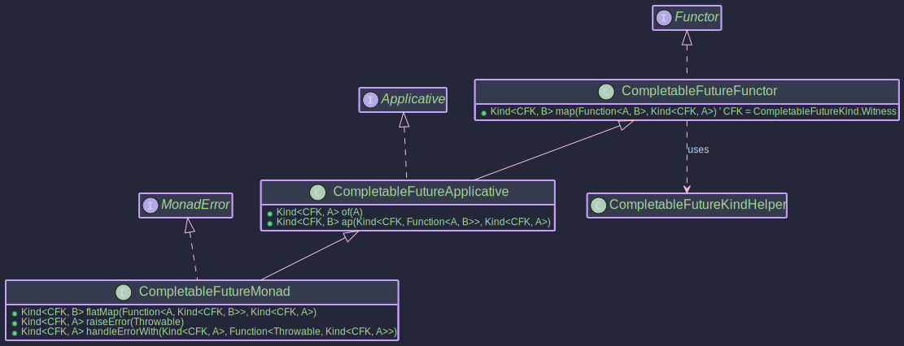

# The CompletableFutureMonad: 
## _Asynchronous Computations with `CompletableFuture`_

~~~admonish info title="What You'll Learn"
- How to compose asynchronous operations functionally
- Using MonadError capabilities for async error handling and recovery
- Building non-blocking workflows with `map`, `flatMap`, and `handleErrorWith`
- Integration with EitherT for combining async operations with typed errors
- Real-world patterns for resilient microservice communication
~~~

~~~ admonish example title="See Example Code:"
 [CompletableFutureExample.java](https://github.com/higher-kinded-j/higher-kinded-j/blob/main/hkj-examples/src/main/java/org/higherkindedj/example/basic/future/CompletableFutureExample.java)
~~~

Java's `java.util.concurrent.CompletableFuture<T>` is a powerful tool for asynchronous programming. The `higher-kinded-j` library provides a way to treat `CompletableFuture` as a monadic context using the HKT simulation. This allows developers to compose asynchronous operations and handle their potential failures (`Throwable`) in a more functional and generic style, leveraging type classes like `Functor`, `Applicative`, `Monad`, and crucially, `MonadError`.

**Higher-Kinded Bridge for CompletableFuture**


**TypeClasses**



The simulation for `CompletableFuture` involves these components:

1. **`CompletableFuture<A>`**: The standard Java class representing an asynchronous computation that will eventually result in a value of type `A` or fail with an exception (a `Throwable`).
2. **`CompletableFutureKind<A>`**: The HKT marker interface (`Kind<CompletableFutureKind.Witness, A>`) for `CompletableFuture`. This allows `CompletableFuture` to be used generically with type classes. The witness type is `CompletableFutureKind.Witness`.
3. **`CompletableFutureKindHelper`**: The utility class for bridging between `CompletableFuture<A>` and `CompletableFutureKind<A>`. Key methods:
   * `widen(CompletableFuture<A>)`: Wraps a standard `CompletableFuture` into its `Kind` representation.
   * `narrow(Kind<CompletableFutureKind.Witness, A>)`: Unwraps the `Kind` back to the concrete `CompletableFuture`. Throws `KindUnwrapException` if the input Kind is invalid.
   * `join(Kind<CompletableFutureKind.Witness, A>)`: A convenience method to unwrap the `Kind` and then block (`join()`) on the underlying `CompletableFuture` to get its result. It re-throws runtime exceptions and errors directly but wraps checked exceptions in `CompletionException`. *Use primarily for testing or at the very end of an application where blocking is acceptable.*
4. **`CompletableFutureFunctor`**: Implements `Functor<CompletableFutureKind.Witness>`. Provides `map`, which corresponds to `CompletableFuture.thenApply()`.
5. **`CompletableFutureApplicative`**: Extends `Functor`, implements `Applicative<CompletableFutureKind.Witness>`.
   * `of(A value)`: Creates an already successfully completed `CompletableFutureKind` using `CompletableFuture.completedFuture(value)`.
   * `ap(Kind<F, Function<A,B>>, Kind<F, A>)`: Corresponds to `CompletableFuture.thenCombine()`, applying a function from one future to the value of another when both complete.
6. **`CompletableFutureMonad`**: Extends `Applicative`, implements `Monad<CompletableFutureKind.Witness>`.
   * `flatMap(Function<A, Kind<F, B>>, Kind<F, A>)`: Corresponds to `CompletableFuture.thenCompose()`, sequencing asynchronous operations where one depends on the result of the previous one.
7. **`CompletableFutureMonad`**: Extends `Monad`, implements `MonadError<CompletableFutureKind.Witness, Throwable>`. This is often the most useful instance to work with.
   * `raiseError(Throwable error)`: Creates an already exceptionally completed `CompletableFutureKind` using `CompletableFuture.failedFuture(error)`.
   * `handleErrorWith(Kind<F, A>, Function<Throwable, Kind<F, A>>)`: Corresponds to `CompletableFuture.exceptionallyCompose()`, allowing asynchronous recovery from failures.

## Purpose and Usage

* **Functional Composition of Async Ops**: Use `map`, `ap`, and `flatMap` (via the type class instances) to build complex asynchronous workflows in a declarative style, similar to how you'd compose synchronous operations with `Optional` or `List`.
* **Unified Error Handling**: Treat asynchronous failures (`Throwable`) consistently using `MonadError` operations (`raiseError`, `handleErrorWith`). This allows integrating error handling directly into the composition chain.
* **HKT Integration**: Enables writing generic code that can operate on `CompletableFuture` alongside other simulated monadic types (like `Optional`, `Either`, `IO`) by programming against the `Kind<F, A>` interface and type classes. This is powerfully demonstrated when using `CompletableFutureKind` as the outer monad `F` in the `EitherT` transformer (see [Order Example Walkthrough](../hkts/order-walkthrough.md)).

## Examples


~~~admonish example title="Example 1: Creating _CompletableFutureKind_ Instances"

- [CompletableFutureExample.java](https://github.com/higher-kinded-j/higher-kinded-j/blob/main/hkj-examples/src/main/java/org/higherkindedj/example/basic/future/CompletableFutureExample.java)

```java
public void createExample() {
   // Get the MonadError instance
   CompletableFutureMonad futureMonad = CompletableFutureMonad.INSTANCE;

   // --- Using of() ---
   // Creates a Kind wrapping an already completed future
   Kind<CompletableFutureKind.Witness, String> successKind = futureMonad.of("Success!");

   // --- Using raiseError() ---
   // Creates a Kind wrapping an already failed future
   RuntimeException error = new RuntimeException("Something went wrong");
   Kind<CompletableFutureKind.Witness, String> failureKind = futureMonad.raiseError(error);

   // --- Wrapping existing CompletableFutures ---
   CompletableFuture<Integer> existingFuture = CompletableFuture.supplyAsync(() -> {
      try {
         TimeUnit.MILLISECONDS.sleep(20);
      } catch (InterruptedException e) { /* ignore */ }
      return 123;
   });
   Kind<CompletableFutureKind.Witness, Integer> wrappedExisting = FUTURE.widen(existingFuture);

   CompletableFuture<Integer> failedExisting = new CompletableFuture<>();
   failedExisting.completeExceptionally(new IllegalArgumentException("Bad input"));
   Kind<CompletableFutureKind.Witness, Integer> wrappedFailed = FUTURE.widen(failedExisting);

   // You typically don't interact with 'unwrap' unless needed at boundaries or for helper methods like 'join'.
   CompletableFuture<String> unwrappedSuccess = FUTURE.narrow(successKind);
   CompletableFuture<String> unwrappedFailure = FUTURE.narrow(failureKind);
}
```
~~~

~~~admonish example title="Example 2: Using _map_, _flatMap_, _ap_"

- [CompletableFutureExample.java](https://github.com/higher-kinded-j/higher-kinded-j/blob/main/hkj-examples/src/main/java/org/higherkindedj/example/basic/future/CompletableFutureExample.java)

These examples show how to use the type class instance (`futureMonad`) to apply operations.

```java
public void monadExample() {
   // Get the MonadError instance
   CompletableFutureMonad futureMonad = CompletableFutureMonad.INSTANCE;

   // --- map (thenApply) ---
   Kind<CompletableFutureKind.Witness, Integer> initialValueKind = futureMonad.of(10);
   Kind<CompletableFutureKind.Witness, String> mappedKind = futureMonad.map(
           value -> "Result: " + value,
           initialValueKind
   );
   // Join for testing/demonstration
   System.out.println("Map Result: " + FUTURE.join(mappedKind)); // Output: Result: 10

   // --- flatMap (thenCompose) ---
   // Function A -> Kind<F, B>
   Function<String, Kind<CompletableFutureKind.Witness, String>> asyncStep2 =
           input -> FUTURE.widen(
                   CompletableFuture.supplyAsync(() -> input + " -> Step2 Done")
           );

   Kind<CompletableFutureKind.Witness, String> flatMappedKind = futureMonad.flatMap(
           asyncStep2,
           mappedKind // Result from previous map step ("Result: 10")
   );
   System.out.println("FlatMap Result: " + FUTURE.join(flatMappedKind)); // Output: Result: 10 -> Step2 Done

   // --- ap (thenCombine) ---
   Kind<CompletableFutureKind.Witness, Function<Integer, String>> funcKind = futureMonad.of(i -> "FuncResult:" + i);
   Kind<CompletableFutureKind.Witness, Integer> valKind = futureMonad.of(25);

   Kind<CompletableFutureKind.Witness, String> apResult = futureMonad.ap(funcKind, valKind);
   System.out.println("Ap Result: " + FUTURE.join(apResult)); // Output: FuncResult:25

   // --- mapN ---
   Kind<CompletableFutureKind.Witness, Integer> f1 = futureMonad.of(5);
   Kind<CompletableFutureKind.Witness, String> f2 = futureMonad.of("abc");

   BiFunction<Integer, String, String> combine = (i, s) -> s + i;
   Kind<CompletableFutureKind.Witness, String> map2Result = futureMonad.map2(f1, f2, combine);
   System.out.println("Map2 Result: " + FUTURE.join(map2Result)); // Output: abc5

}
```
~~~

~~~admonish example title="Example 3: Handling Errors with _handleErrorWith_"

- [CompletableFutureExample.java](https://github.com/higher-kinded-j/higher-kinded-j/blob/main/hkj-examples/src/main/java/org/higherkindedj/example/basic/future/CompletableFutureExample.java)

This is where `CompletableFutureMonad` shines, providing functional error recovery.

```java
 public void errorHandlingExample(){
   // Get the MonadError instance
   CompletableFutureMonad futureMonad = CompletableFutureMonad.INSTANCE;
   RuntimeException runtimeEx = new IllegalStateException("Processing Failed");
   IOException checkedEx = new IOException("File Not Found");

   Kind<CompletableFutureKind.Witness, String> failedRuntimeKind = futureMonad.raiseError(runtimeEx);
   Kind<CompletableFutureKind.Witness, String> failedCheckedKind = futureMonad.raiseError(checkedEx);
   Kind<CompletableFutureKind.Witness, String> successKind = futureMonad.of("Original Success");

   // --- Handler Function ---
   // Function<Throwable, Kind<CompletableFutureKind.Witness, String>>
   Function<Throwable, Kind<CompletableFutureKind.Witness, String>> recoveryHandler =
           error -> {
              System.out.println("Handling error: " + error.getMessage());
              if (error instanceof IOException) {
                 // Recover from specific checked exceptions
                 return futureMonad.of("Recovered from IO Error");
              } else if (error instanceof IllegalStateException) {
                 // Recover from specific runtime exceptions
                 return FUTURE.widen(CompletableFuture.supplyAsync(()->{
                    System.out.println("Async recovery..."); // Recovery can be async too!
                    return "Recovered from State Error (async)";
                 }));
              } else if (error instanceof ArithmeticException) { 
                 // Recover from ArithmeticException
                 return futureMonad.of("Recovered from Arithmetic Error: " + error.getMessage());
              }
              else {
                 // Re-raise unhandled errors
                 System.out.println("Unhandled error type: " + error.getClass().getSimpleName());
                 return futureMonad.raiseError(new RuntimeException("Recovery failed", error));
              }
           };

   // --- Applying Handler ---

   // Handle RuntimeException
   Kind<CompletableFutureKind.Witness, String> recoveredRuntime = futureMonad.handleErrorWith(
           failedRuntimeKind,
           recoveryHandler
   );
   System.out.println("Recovered (Runtime): " + FUTURE.join(recoveredRuntime));
   // Output:
   // Handling error: Processing Failed
   // Async recovery...
   // Recovered (Runtime): Recovered from State Error (async)


   // Handle CheckedException
   Kind<CompletableFutureKind.Witness, String> recoveredChecked = futureMonad.handleErrorWith(
           failedCheckedKind,
           recoveryHandler
   );
   System.out.println("Recovered (Checked): " + FUTURE.join(recoveredChecked));
   // Output:
   // Handling error: File Not Found
   // Recovered (Checked): Recovered from IO Error


   // Handler is ignored for success
   Kind<CompletableFutureKind.Witness, String> handledSuccess = futureMonad.handleErrorWith(
           successKind,
           recoveryHandler // This handler is never called
   );
   System.out.println("Handled (Success): " + FUTURE.join(handledSuccess));
   // Output: Handled (Success): Original Success


   // Example of re-raising an unhandled error
   ArithmeticException unhandledEx = new ArithmeticException("Bad Maths");
   Kind<CompletableFutureKind.Witness, String> failedUnhandledKind = futureMonad.raiseError(unhandledEx);
   Kind<CompletableFutureKind.Witness, String> failedRecovery = futureMonad.handleErrorWith(
           failedUnhandledKind,
           recoveryHandler
   );

   try {
      FUTURE.join(failedRecovery);
   } catch (CompletionException e) { // join wraps the "Recovery failed" exception
      System.err.println("Caught re-raised error: " + e.getCause());
      System.err.println("  Original cause: " + e.getCause().getCause());
   }
   // Output:
   // Handling error: Bad Maths
}
```


* `handleErrorWith` allows you to inspect the `Throwable` and return a *new*`CompletableFutureKind`, potentially recovering the flow.
* The handler receives the *cause* of the failure (unwrapped from `CompletionException` if necessary).
~~~

---

**Previous:** [Supported Types](supported-types.md)
**Next:** [Either](either_monad.md)