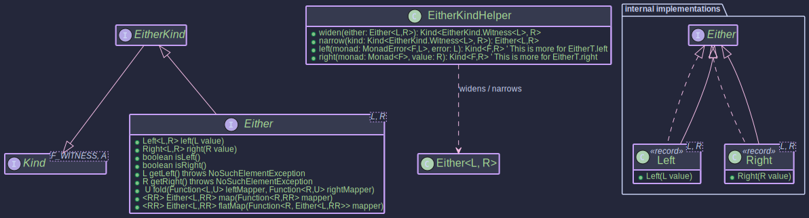

#The EitherMonad: 
## _Typed Error Handling_

~~~ admonish example title="See Example Code:"
[EitherExample.java](https://github.com/higher-kinded-j/higher-kinded-j/blob/main/hkj-examples/src/main/java/org/higherkindedj/example/basic/either/EitherExample.java)
~~~


## Purpose

The `Either<L, R>` type represents a value that can be one of two possible types, conventionally denoted as `Left` and `Right`. Its primary purpose in functional programming and this library is to provide an explicit, type-safe way to handle computations that can result in either a successful outcome or a specific kind of failure.

* **`Right<L, R>`**: By convention, represents the **success** case, holding a value of type `R`.
* **`Left<L, R>`**: By convention, represents the **failure** or alternative case, holding a value of type `L` (often an error type).

Unlike throwing exceptions, `Either` makes the possibility of failure explicit in the return type of a function. Unlike `Optional` or `Maybe`, which simply signal the absence of a value, `Either` allows carrying specific information about *why* a computation failed in the `Left` value.

We can think of `Either` as an extension of `Maybe`. The `Right` is equivalent to `Maybe.Just`, and the `Left` is the equivalent of `Maybe.Nothing` **but now we can allow it to carry a value.**

The implementation in this library is a `sealed interface Either<L, R>` with two `record` implementations: `Left<L, R>` and `Right<L, R>`. `Either<L, R>` directly implements `EitherKind<L, R>`, which in turn extends `Kind<EitherKind.Witness<L>, R>`.

## Structure



## Creating Instances

You create `Either` instances using the static factory methods:

~~~admonish  title="Creating Instances"

- [EitherExample.java](https://github.com/higher-kinded-j/higher-kinded-j/blob/main/hkj-examples/src/main/java/org/higherkindedj/example/basic/either/EitherExample.java)

```java

// Success case
Either<String, Integer> success = Either.right(123);

// Failure case
Either<String, Integer> failure = Either.left("File not found");

// Null values are permitted in Left or Right by default in this implementation
Either<String, Integer> rightNull = Either.right(null);
Either<String, Integer> leftNull = Either.left(null);
```
~~~~

## Working with `Either`

Several methods are available to interact with `Either` values:

~~~admonish  title="Checking State"

- [EitherExample.java](https://github.com/higher-kinded-j/higher-kinded-j/blob/main/hkj-examples/src/main/java/org/higherkindedj/example/basic/either/EitherExample.java)


  - `isLeft()`: Returns `true` if it's a `Left`, `false` otherwise.
  - `isRight()`: Returns `true` if it's a `Right`, `false` otherwise.

  ```java
  if (success.isRight()) {
      System.out.println("It's Right!");
  }
  if (failure.isLeft()) {
      System.out.println("It's Left!");
  }
  ```
~~~~

~~~admonish  title="Extracting Values (_Use with Caution_)"

- [EitherExample.java](https://github.com/higher-kinded-j/higher-kinded-j/blob/main/hkj-examples/src/main/java/org/higherkindedj/example/basic/either/EitherExample.java)


  - `getLeft()`: Returns the `value` if it's a `Left`, otherwise throws `NoSuchElementException`.
  - `getRight()`: Returns the `value` if it's a `Right`, otherwise throws `NoSuchElementException`.

  ```java
    try {
      Integer value = success.getRight(); // Returns 123
      String error = failure.getLeft();  // Returns "File not found"
      // String errorFromSuccess = success.getLeft(); // Throws NoSuchElementException
    } catch (NoSuchElementException e) {
      System.err.println("Attempted to get the wrong side: " + e.getMessage());
    }
  ```
~~~~

_Note: Prefer `fold` or pattern matching over direct `getLeft`/`getRight` calls._

~~~admonish  title="Pattern Matching / Folding"

- [EitherExample.java](https://github.com/higher-kinded-j/higher-kinded-j/blob/main/hkj-examples/src/main/java/org/higherkindedj/example/basic/either/EitherExample.java)

- The `fold` method is the safest way to handle both cases by providing two functions: one for the `Left` case and one for the `Right` case. It returns the result of whichever function is applied.

  ```java
  String resultMessage = failure.fold(
      leftValue -> "Operation failed with: " + leftValue,  // Function for Left
      rightValue -> "Operation succeeded with: " + rightValue // Function for Right
  );
  // resultMessage will be "Operation failed with: File not found"

  String successMessage = success.fold(
      leftValue -> "Error: " + leftValue,
      rightValue -> "Success: " + rightValue
  );
  // successMessage will be "Success: 123"
  ```
~~~

~~~admonish  title="_Map_"

- [EitherExample.java](https://github.com/higher-kinded-j/higher-kinded-j/blob/main/hkj-examples/src/main/java/org/higherkindedj/example/basic/either/EitherExample.java)


Applies a function only to the `Right` value, leaving a `Left` unchanged. This is known as being "right-biased".

  ```java
    Function<Integer, String> intToString = Object::toString;

    Either<String, String> mappedSuccess = success.map(intToString); // Right(123) -> Right("123")
    Either<String, String> mappedFailure = failure.map(intToString); // Left(...) -> Left(...) unchanged

    System.out.println(mappedSuccess); // Output: Right(value=123)
    System.out.println(mappedFailure); // Output: Left(value=File not found)
  ```

~~~


~~~admonish  title="_flatMap_"

- [EitherExample.java](https://github.com/higher-kinded-j/higher-kinded-j/blob/main/hkj-examples/src/main/java/org/higherkindedj/example/basic/either/EitherExample.java)

Applies a function that *itself returns an `Either`* to a `Right` value. If the initial `Either` is `Left`, it's returned unchanged. If the function applied to the `Right` value returns a `Left`, that `Left` becomes the result. This allows sequencing operations where each step can fail. The `Left` type acts as a functor that dismisses the mapped function `f` and returns itself (`map(f) -> Left(Value)`). It preserves the value it holds. After a `Left` is encountered, subsequent transformations via `map` or `flatMap` are typically short-circuited.

  ```java
  public void basicFlatMap(){

    // Example: Parse string, then check if positive
    Function<String, Either<String, Integer>> parse = s -> {
      try { return Either.right(Integer.parseInt(s.trim())); }
      catch (NumberFormatException e) { return Either.left("Invalid number"); }
    };
    Function<Integer, Either<String, Integer>> checkPositive = i ->
        (i > 0) ? Either.right(i) : Either.left("Number not positive");

    Either<String, String> input1 = Either.right(" 10 ");
    Either<String, String> input2 = Either.right(" -5 ");
    Either<String, String> input3 = Either.right(" abc ");
    Either<String, String> input4 = Either.left("Initial error");

    // Chain parse then checkPositive
    Either<String, Integer> result1 = input1.flatMap(parse).flatMap(checkPositive); // Right(10)
    Either<String, Integer> result2 = input2.flatMap(parse).flatMap(checkPositive); // Left("Number not positive")
    Either<String, Integer> result3 = input3.flatMap(parse).flatMap(checkPositive); // Left("Invalid number")
    Either<String, Integer> result4 = input4.flatMap(parse).flatMap(checkPositive); // Left("Initial error")

    System.out.println(result1);
    System.out.println(result2);
    System.out.println(result3);
    System.out.println(result4);
  }
  ```
~~~

~~~admonish  example title="Using _EitherMonad_"

- [EitherExample.java](https://github.com/higher-kinded-j/higher-kinded-j/blob/main/hkj-examples/src/main/java/org/higherkindedj/example/basic/either/EitherExample.java)

To use `Either` within Higher-Kinded-J framework:

1. **Identify Context:** You are working with `Either<L, R>` where `L` is your chosen error type. The HKT witness will be `EitherKind.Witness<L>`.
2. **Get Type Class Instance:** Obtain an instance of `EitherMonad<L>` for your specific error type `L`. This instance implements `MonadError<EitherKind.Witness<L>, L>`.

   ```java
   // Assuming TestError is your error type
   EitherMonad<TestError> eitherMonad = EitherMonad.instance()
   // Now 'eitherMonad' can be used for operations on Kind<EitherKind.Witness<String>, A>
   ```
3. **Wrap**: Convert your `Either<L, R>` instances to `Kind<EitherKind.Witness<L>, R>` using `EITHER.widen()`. Since `Either<L,R>` directly implements `EitherKind<L,R>`.

   ```java
    EitherMonad<String> eitherMonad = EitherMonad.instance()

    Either<String, Integer> myEither = Either.right(10);
    // F_WITNESS is EitherKind.Witness<String>, A is Integer
    Kind<EitherKind.Witness<String>, Integer> eitherKind = EITHER.widen(myEither);
   ```
4. **Apply Operations:**  Use the methods on the `eitherMonad` instance (`map`, `flatMap`, `ap`, `raiseError`, `handleErrorWith`, etc.).

   ```java
   // Using map via the Monad instance
    Kind<EitherKind.Witness<String>, String> mappedKind = eitherMonad.map(Object::toString, eitherKind);
    System.out.println("mappedKind: " + EITHER.narrow(mappedKind)); // Output: Right[value = 10]

    // Using flatMap via the Monad instance
    Function<Integer, Kind<EitherKind.Witness<String>, Double>> nextStep =
        i -> EITHER.widen( (i > 5) ? Either.right(i/2.0) : Either.left("TooSmall"));
    Kind<EitherKind.Witness<String>, Double> flatMappedKind = eitherMonad.flatMap(nextStep, eitherKind);

    // Creating a Left Kind using raiseError
    Kind<EitherKind.Witness<String>, Integer> errorKind = eitherMonad.raiseError("E101"); // L is String here

    // Handling an error
    Kind<EitherKind.Witness<String>, Integer> handledKind =
        eitherMonad.handleErrorWith(errorKind, error -> { 
          System.out.println("Handling error: " + error);
          return eitherMonad.of(0); // Recover with Right(0)
        });
   ```
5. **Unwrap:** Get the final `Either<L, R>` back using `EITHER.narrow()` when needed. 

   ```java
    Either<String, Integer> finalEither = EITHER.narrow(handledKind);
    System.out.println("Final unwrapped Either: " + finalEither); // Output: Right(0)
   ```
~~~

~~~admonish important  title="Key Points:"

- Explicitly modeling and handling domain-specific errors (e.g., validation failures, resource not found, business rule violations).
- Sequencing operations where any step might fail with a typed error, short-circuiting the remaining steps.
- Serving as the inner type for monad transformers like `EitherT` to combine typed errors with other effects like asynchronicity (see the [Order Example Walkthrough](../hkts/order-walkthrough.md)).
- Providing a more informative alternative to returning `null` or relying solely on exceptions for expected failure conditions.
~~~