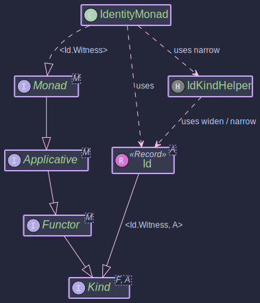

# Identity Monad (Id)

~~~admonish info title="What You'll Learn"
- What the Identity Monad is and why it exists
- How Id serves as the "no-effect" base case for monad transformers
- Using Id to test and develop generic monadic code
- How `StateT<S, IdKind.Witness, A>` collapses to plain `State<S, A>`
~~~

~~~ admonish example title="See Example Code:"
 [IdExample.java](https://github.com/higher-kinded-j/higher-kinded-j/blob/main/hkj-examples/src/main/java/org/higherkindedj/example/basic/id/IdExample.java)
~~~

## Why Wrap a Value in a Do-Nothing Wrapper?

A fair question. `Id<A>` holds a value of type `A` and does absolutely nothing else — no deferred execution, no error handling, no optionality. It's a container that contributes zero additional behaviour.

But that's exactly the point. Id is to monads what 1 is to multiplication: multiplying by 1 doesn't change the result, but you need 1 to exist for multiplication to be well-defined. Similarly, you need Id when the type system demands a monad but you don't want any effect:

1. **Transformer base case** — Monad transformers like `StateT`, `ReaderT`, and `MaybeT` are parameterised by an inner monad `F`. When you don't need that inner effect, plug in `Id`:

   ```java
   // StateT with Id as the inner monad = plain State
   StateT<S, IdKind.Witness, A>  ≡  State<S, A>
   ```

   Without `Id`, you'd need separate implementations for `State` *and* `StateT`, `Reader` *and* `ReaderT`, and so on. `Id` eliminates that duplication.

2. **Generic code** — When writing functions generic over any `Monad<F>`, Id serves as the "no-effect" instance for testing and for cases where pure computation suffices:

   ```java
   // This works with IO, CompletableFuture, Maybe, or... Id
   <F extends Kind<F, ?>> Kind<F, String> greet(Monad<F> monad, Kind<F, String> name) {
       return monad.map(n -> "Hello, " + n + "!", name);
   }

   // Test with Id — no effects, fully predictable
   IdMonad idMonad = IdMonad.instance();
   Kind<IdKind.Witness, String> result = greet(idMonad, idMonad.of("Alice"));
   // result contains "Hello, Alice!"
   ```

## Core Components



| Component | Role |
|-----------|------|
| `Id<A>` | A record wrapping a value of type `A`. Directly implements `IdKind<A>`, so no wrapper allocation is needed. |
| `IdKind<A>` / `IdKindHelper` | HKT bridge: `widen()` and `narrow()` (zero-cost casts), `narrows()` to narrow and extract the value in one step |
| `IdMonad` | Type class instance (`Monad<IdKind.Witness>`): provides `of`, `map`, `flatMap`, and `ap` |

~~~admonish note title="How the Operations Map"
Every operation on Id simply applies to the wrapped value — there's no additional behaviour:

| Operation | What It Does |
|-----------|--------------|
| `Id.of(value)` | Wrap a value |
| `id.value()` | Unwrap the value |
| `idMonad.map(f, fa)` | Apply `f` to the value, re-wrap the result |
| `idMonad.flatMap(f, fa)` | Apply `f` to the value — `f` returns an `Id`, so no extra wrapping |
| `idMonad.ap(ff, fa)` | Extract the function from `ff`, apply it to the value in `fa` |
~~~

## Working with Id

~~~admonish example title="Creating and Using Id Instances"

- [IdExample.java](https://github.com/higher-kinded-j/higher-kinded-j/blob/main/hkj-examples/src/main/java/org/higherkindedj/example/basic/id/IdExample.java)

```java
// Direct creation and access
Id<String> idString = Id.of("Hello, Identity!");
String value = idString.value(); // "Hello, Identity!"

Id<Integer> idInt = Id.of(123);
Id<String> idNull = Id.of(null); // Id can wrap null
```
~~~

~~~admonish example title="Monadic Operations with IdMonad"

- [IdExample.java](https://github.com/higher-kinded-j/higher-kinded-j/blob/main/hkj-examples/src/main/java/org/higherkindedj/example/basic/id/IdExample.java)

```java
IdMonad idMonad = IdMonad.instance();

// of — lift a value into Id
Kind<IdKind.Witness, Integer> kindInt = idMonad.of(42);

// map — transform the wrapped value
Kind<IdKind.Witness, String> mapped = idMonad.map(i -> "Value is " + i, kindInt);
ID.narrow(mapped).value(); // "Value is 42"

// flatMap — chain with a function that returns Id
Kind<IdKind.Witness, String> chained = idMonad.flatMap(
    i -> Id.of("Doubled: " + (i * 2)),
    kindInt
);
ID.narrow(chained).value(); // "Doubled: 84"

// flatMap directly on Id (no need for the type class)
Id<String> direct = Id.of(42).flatMap(i -> Id.of("Direct: " + i));
direct.value(); // "Direct: 42"

// ap — apply a wrapped function to a wrapped value
Kind<IdKind.Witness, Function<Integer, String>> funcKind = idMonad.of(i -> "Applied: " + i);
Kind<IdKind.Witness, String> applied = idMonad.ap(funcKind, kindInt);
ID.narrow(applied).value(); // "Applied: 42"
```
~~~

~~~admonish example title="Id as a Transformer Base Case"

- [IdExample.java](https://github.com/higher-kinded-j/higher-kinded-j/blob/main/hkj-examples/src/main/java/org/higherkindedj/example/basic/id/IdExample.java)

This is where Id earns its keep. `StateT<S, IdKind.Witness, A>` behaves exactly like a plain `State<S, A>` — the Id inner monad contributes no additional effect.

```java
// Create a StateT monad with Id as the inner monad
StateTMonad<Integer, IdKind.Witness> stateMonadOverId =
    StateTMonad.instance(IdMonad.instance());

// A stateful computation: increment the state, return the old value
Function<Integer, Kind<IdKind.Witness, StateTuple<Integer, Integer>>> runStateFn =
    currentState -> Id.of(StateTuple.of(currentState + 1, currentState));

Kind<StateTKind.Witness<Integer, IdKind.Witness>, Integer> incrementAndGet =
    STATE_T.stateT(runStateFn, IdMonad.instance());

// Run with initial state 10
Kind<IdKind.Witness, StateTuple<Integer, Integer>> resultIdTuple =
    STATE_T.runStateT(incrementAndGet, 10);

StateTuple<Integer, Integer> tuple = ID.narrow(resultIdTuple).value();
System.out.println("Returned Value: " + tuple.value()); // Output: 10 (old state)
System.out.println("Final State: " + tuple.state());     // Output: 11 (incremented)
```

Because the inner monad is Id, unwrapping the result is straightforward — there's no `Optional` to check, no `Either` to branch on, no `CompletableFuture` to await. The transformer machinery works, but the inner monad simply passes the value through.
~~~


## When to Use Id

| Scenario | Use |
|----------|-----|
| Transformer base case (StateT, ReaderT, MaybeT without an inner effect) | `Id` / `IdMonad` |
| Testing generic monadic code with predictable values | `Id` — no effects means no surprises |
| Application-level pure computation with the Path API | Prefer [IdPath](../effect/path_id.md) |
| You need error handling, async, or optionality | Use a different monad — Id adds nothing |

~~~admonish important title="Key Points"
- `Id<A>` is the trivial monad — it wraps a value and does nothing else.
- Its purpose is structural: it fills the "inner monad" slot in transformers when no effect is needed.
- `Id<A>` directly implements `IdKind<A>`, so `widen`/`narrow` are zero-cost casts.
- All monadic operations (`map`, `flatMap`, `ap`) simply apply to the wrapped value with no additional behaviour.
- If you're not working with transformers or generic monadic code, you probably don't need `Id` directly.
~~~

---

~~~admonish tip title="Effect Path Alternative"
For most use cases, prefer **[IdPath](../effect/path_id.md)** which wraps `Id` and provides:

- Fluent composition with `map`, `via`, `zipWith`
- Seamless integration with the [Focus DSL](../optics/focus_dsl.md) for structural navigation
- A consistent API shared across all effect types

```java
// Instead of manual Id chaining:
Kind<IdKind.Witness, String> name = idMonad.of("Alice");
Kind<IdKind.Witness, Integer> len = idMonad.map(String::length, name);

// Use IdPath for cleaner composition:
IdPath<Integer> len = Path.id("Alice").map(String::length);
```

See [Effect Path Overview](../effect/effect_path_overview.md) for the complete guide.
~~~

---

**Previous:** [Either](either_monad.md)
**Next:** [IO](io_monad.md)
