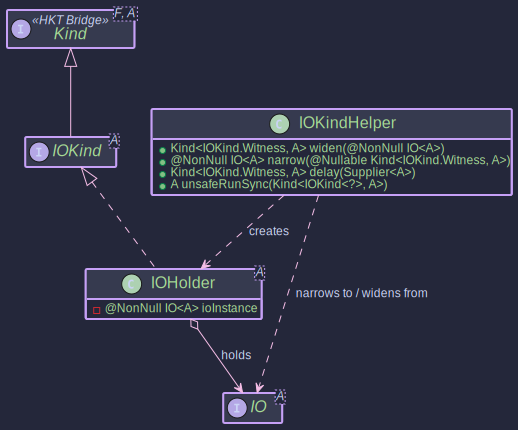
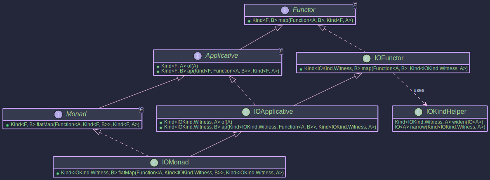

# The IOMonad:
## _Managing Side Effects with `IO`_

~~~admonish info title="What You'll Learn"
- How to describe side effects without performing them immediately
- Building pure functional programs with deferred execution
- Composing complex side-effecting operations using `map` and `flatMap`
- The difference between describing effects and running them with `unsafeRunSync`
- Creating testable, composable programs that separate logic from execution
~~~

~~~ admonish example title="See Example Code:"
[IOExample.java](https://github.com/higher-kinded-j/higher-kinded-j/blob/main/hkj-examples/src/main/java/org/higherkindedj/example/basic/io/IOExample.java)
~~~

## The Problem: Side Effects Everywhere

Consider a method that loads configuration, connects to a database, and logs the result:

```java
// Every call executes immediately — untestable, unrepeatable, order-dependent
Config config = loadConfig();                     // reads disk
Connection conn = connectToDb(config);            // opens network socket
logger.info("Connected to " + conn.endpoint());   // writes to stdout
return conn;
```

Each line performs a side effect the instant it runs. You can't test `connectToDb` without a real database. You can't reorder or retry steps without re-executing earlier effects. And if you want to compose this with other workflows, you're stuck — the effects have already happened.

The `IO` monad solves this by separating **description** from **execution**. An `IO<A>` value is a *recipe* for a computation that will produce an `A` when run — but nothing happens until you explicitly say "go." This means you can build, compose, and inspect entire programs as pure values, then execute them once at the application boundary.

```java
// Describe effects — nothing executes yet
Kind<IOKind.Witness, Config>     loadCfg  = IO_OP.delay(() -> loadConfig());
Kind<IOKind.Witness, Connection> connect  = ioMonad.flatMap(
    cfg -> IO_OP.delay(() -> connectToDb(cfg)), loadCfg);
Kind<IOKind.Witness, Connection> logged   = ioMonad.peek(
    conn -> logger.info("Connected to " + conn.endpoint()), connect);

// Execute the entire recipe at the edge
Connection conn = IO_OP.unsafeRunSync(logged);
```

The logic is testable (swap `loadConfig` for a stub), composable (chain more steps with `flatMap`), and the effects happen exactly once, in exactly the order you specified.

## Core Components

**The IO Type**


**The HKT Bridge for IO**



**Typeclasses for IO**



The `IO` functionality is built upon these key pieces:

| Component | Role |
|-----------|------|
| `IO<A>` | Wraps a `Supplier<A>` — describes an effect that produces `A` when run. Directly extends `IOKind<A>`, so no wrapper allocation is needed. |
| `IOKind<A>` / `IOKindHelper` | HKT bridge: `widen()` and `narrow()` (zero-cost casts), `delay()` to create deferred effects, `unsafeRunSync()` to execute them |
| `IOMonad` | Type class instance (`Monad<IOKind.Witness>`): provides `map`, `flatMap`, `of`, and `ap` for composing IO programs |

~~~admonish note title="How the Operations Map"
| Type Class Operation | What It Does |
|---------------------|--------------|
| `IO_OP.delay(supplier)` | Wrap a side effect — nothing executes yet |
| `ioMonad.of(value)` | Lift a pure value into IO (no effect) |
| `ioMonad.map(f, fa)` | Transform the eventual result without adding new effects |
| `ioMonad.flatMap(f, fa)` | Sequence two effects — the second can depend on the first's result |
| `ioMonad.ap(ff, fa)` | Apply a function-in-IO to a value-in-IO |
| `IO_OP.unsafeRunSync(fa)` | **Execute** — run the recipe and produce the result. Call this at the edge. |
~~~

~~~admonish warning title="What IO Does Not Do"
- **Error handling** — Exceptions thrown during `unsafeRunSync` propagate directly. For typed error handling, combine with [EitherT](../transformers/eithert_transformer.md) or wrap operations with [Try](./try_monad.md).
- **Async execution** — IO runs synchronously on the calling thread. For async, see [CompletableFutureMonad](./cf_monad.md). For virtual-thread concurrency, see [VTaskPath](./vtask_monad.md).
- **Resource management** — IO alone doesn't guarantee cleanup. Use [IOPath's bracket pattern](../effect/path_io.md) for safe resource handling.
~~~

## Working with IO

The following examples build a small program step by step: creating IO actions, composing them, then executing the result.

~~~admonish example title="Creating IO Actions"

- [IOExample.java](https://github.com/higher-kinded-j/higher-kinded-j/blob/main/hkj-examples/src/main/java/org/higherkindedj/example/basic/io/IOExample.java)

Use `IO_OP.delay` to capture side effects. Use `ioMonad.of` for pure values within IO.

```java
IOMonad ioMonad = IOMonad.INSTANCE;
java.util.Scanner scanner = new java.util.Scanner(System.in);

// IO action to print a message — nothing happens yet
Kind<IOKind.Witness, Unit> printHello = IO_OP.delay(() -> {
    System.out.println("Hello from IO!");
    return Unit.INSTANCE;
});

// IO action to read a line from the console — nothing happens yet
Kind<IOKind.Witness, String> readLine = IO_OP.delay(() -> {
    System.out.print("Enter your name: ");
    return scanner.nextLine();
});

// Lift a pure value — no side effect at all
Kind<IOKind.Witness, Integer> pureValueIO = ioMonad.of(42);

// Capture a time-dependent side effect
Kind<IOKind.Witness, Long> currentTime = IO_OP.delay(System::currentTimeMillis);
```

None of these execute when created. The `Supplier` inside `delay` is stored, not called.
~~~

~~~admonish example title="Executing IO Actions"

- [IOExample.java](https://github.com/higher-kinded-j/higher-kinded-j/blob/main/hkj-examples/src/main/java/org/higherkindedj/example/basic/io/IOExample.java)

Use `IO_OP.unsafeRunSync` to run the computation. This is the "end of the world" — call it at application boundaries, not deep inside your logic.

```java
// Execute printHello — now the effect happens
IO_OP.unsafeRunSync(printHello); // prints "Hello from IO!"

// Execute pureValueIO
Integer value = IO_OP.unsafeRunSync(pureValueIO);
System.out.println("Fetched: " + value); // Output: 42

// Running the same action again re-executes the effect
IO_OP.unsafeRunSync(printHello); // prints "Hello from IO!" again

// Exceptions propagate — handle at the boundary
Kind<IOKind.Witness, String> risky = IO_OP.delay(() -> {
    if (Math.random() < 0.5) throw new RuntimeException("Boom!");
    return "OK";
});
try {
    IO_OP.unsafeRunSync(risky);
} catch (RuntimeException e) {
    System.err.println("Caught: " + e.getMessage());
}
```
~~~

~~~admonish example title="Composing with map and flatMap"

- [IOExample.java](https://github.com/higher-kinded-j/higher-kinded-j/blob/main/hkj-examples/src/main/java/org/higherkindedj/example/basic/io/IOExample.java)

`map` transforms the result of an IO action *without executing it*. `flatMap` sequences two IO actions — the second can depend on the first's result.

```java
IOMonad ioMonad = IOMonad.INSTANCE;

// --- map: transform a result ---
Kind<IOKind.Witness, String> readLineAction = IO_OP.delay(() -> "Test Input");

Kind<IOKind.Witness, String> greetAction = ioMonad.map(
    name -> "Hello, " + name + "!",
    readLineAction
);

System.out.println("Greet action created, not executed yet.");
String greeting = IO_OP.unsafeRunSync(greetAction);
System.out.println(greeting); // Output: Hello, Test Input!

// --- flatMap: sequence dependent effects ---
Kind<IOKind.Witness, String> getName = IO_OP.delay(() -> {
    System.out.println("Effect: Getting name...");
    return "Alice";
});

Function<String, Kind<IOKind.Witness, Unit>> printGreeting = name ->
    IO_OP.delay(() -> {
        System.out.println("Welcome, " + name + "!");
        return Unit.INSTANCE;
    });

// Combine — nothing runs until unsafeRunSync
Kind<IOKind.Witness, Unit> combinedAction = ioMonad.flatMap(printGreeting, getName);

IO_OP.unsafeRunSync(combinedAction);
// Output:
// Effect: Getting name...
// Welcome, Alice!
```
~~~

~~~admonish example title="Conditional Execution and Utility Methods"

- [IOExample.java](https://github.com/higher-kinded-j/higher-kinded-j/blob/main/hkj-examples/src/main/java/org/higherkindedj/example/basic/io/IOExample.java)

Beyond `map` and `flatMap`, `IOMonad` provides utility methods for common patterns.

```java
Kind<IOKind.Witness, String> getAliceName = ioMonad.of("Alice");

Function<String, Kind<IOKind.Witness, Unit>> printGreeting = name ->
    IO_OP.delay(() -> { System.out.println("Welcome, " + name + "!"); return Unit.INSTANCE; });

Function<String, Kind<IOKind.Witness, Unit>> doNothing = name -> ioMonad.of(Unit.INSTANCE);

// peek — log without affecting the pipeline
Kind<IOKind.Witness, String> logged =
    ioMonad.peek(name -> System.out.println("LOG: Name -> " + name), getAliceName);

// flatMapIfOrElse — conditional branching
Kind<IOKind.Witness, Unit> conditionalGreeting =
    ioMonad.flatMapIfOrElse(
        name -> !name.equalsIgnoreCase("admin"),  // predicate
        printGreeting,                              // true branch
        doNothing,                                  // false branch
        logged                                      // input value
    );

// as — replace the result, keeping the effect
Kind<IOKind.Witness, Unit> finalProgram =
    ioMonad.as(
        Unit.INSTANCE,
        ioMonad.peek(_ -> System.out.println("Program finished."), conditionalGreeting));

IO_OP.unsafeRunSync(finalProgram);
// Output:
// LOG: Name -> Alice
// Welcome, Alice!
// Program finished.
```
~~~


## When to Use IO

| Scenario | Use |
|----------|-----|
| Deferring side effects for testability and composition | `IO` / `IOMonad` |
| Side effects with typed error handling | Combine with [EitherT](../transformers/eithert_transformer.md) |
| Application-level effect composition | Prefer [IOPath](../effect/path_io.md) for fluent API |
| Concurrent / async execution | Consider [VTaskPath](./vtask_monad.md) or [CompletableFutureMonad](./cf_monad.md) |

~~~admonish important title="Key Points"
- `IO<A>` is a **description**, not an execution. Nothing happens until `unsafeRunSync` is called.
- `IO<A>` directly extends `IOKind<A>`, so `widen`/`narrow` are zero-cost casts — no wrapper allocation.
- `map` transforms the eventual result; `flatMap` sequences dependent effects. Neither triggers execution.
- Call `unsafeRunSync` at the application boundary ("end of the world") — never deep inside business logic.
- Re-running the same IO value re-executes the effect. IO values are recipes, not cached results.
~~~

---

~~~admonish tip title="Effect Path Alternative"
For most use cases, prefer **[IOPath](../effect/path_io.md)** which wraps `IO` and provides:

- Fluent composition with `map`, `via`, `recover`
- Seamless integration with the [Focus DSL](../optics/focus_dsl.md) for structural navigation
- A consistent API shared across all effect types

```java
// Instead of manual IO chaining:
Kind<IOKind.Witness, Config> config = IO_OP.delay(() -> loadConfig());
Kind<IOKind.Witness, String> value = ioMonad.flatMap(
    c -> IO_OP.delay(() -> c.getValue("key")), config);

// Use IOPath for cleaner composition:
IOPath<String> value = Path.io(() -> loadConfig())
    .via(c -> Path.io(() -> c.getValue("key")));
```

See [Effect Path Overview](../effect/effect_path_overview.md) for the complete guide.
~~~

~~~admonish example title="Benchmarks"
IO has dedicated JMH benchmarks measuring lazy construction, platform thread execution, and map/flatMap chains. Key expectations:

- **Construction** (delay, pure) is very fast (~100+ ops/us) — IO is a lazy wrapper with no immediate execution
- **IO vs VTask:** IO is ~10-30% faster for simple operations due to no virtual thread spawn overhead
- **Deep chains (50+)** complete without error — composition overhead dominates at depth
- At high concurrency (1000+ tasks), VTask scales better than IO due to virtual threads

```bash
./gradlew :hkj-benchmarks:jmh --includes=".*IOBenchmark.*"
./gradlew :hkj-benchmarks:jmh --includes=".*VTaskVsIOBenchmark.*"
```
See [Benchmarks & Performance](../benchmarks.md) for full details, comparison benchmarks against VTask, and how to interpret results.
~~~

---

**Previous:** [Identity](identity.md)
**Next:** [Lazy](lazy_monad.md)
