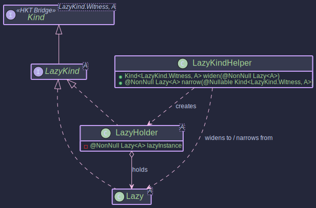
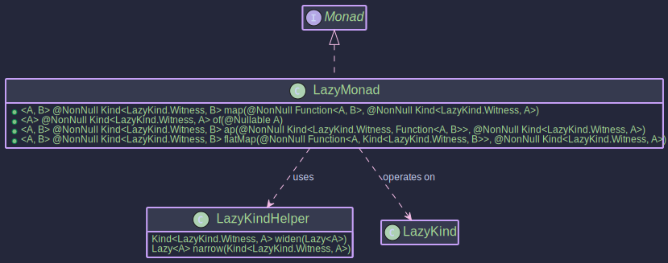

#The Lazy Monad: 
## _Lazy Evaluation with `Lazy`_

~~~ admonish example title="See Example Code:"
[LazyExample.java](https://github.com/higher-kinded-j/higher-kinded-j/blob/main/hkj-examples/src/main/java/org/higherkindedj/example/basic/lazy/LazyExample.java)
~~~

This article introduces the `Lazy<A>` type and its associated components within the `higher-kinded-j` library. `Lazy` provides a mechanism for deferred computation, where a value is calculated only when needed and the result (or any exception thrown during calculation) is memoized (cached).
## Core Components

**The Lazy Type**


**The HKT Bridge for Lazy**



**Typeclasses for Lazy**



The lazy evaluation feature revolves around these key types:

1. **`ThrowableSupplier<T>`**: A functional interface similar to `java.util.function.Supplier`, but its `get()` method is allowed to throw any `Throwable` (including checked exceptions). This is used as the underlying computation for `Lazy`.
2. **`Lazy<A>`**: The core class representing a computation that produces a value of type `A` lazily. It takes a `ThrowableSupplier<? extends A>` during construction (`Lazy.defer`). Evaluation is triggered only by the `force()` method, and the result or exception is cached. `Lazy.now(value)` creates an already evaluated instance.
3. **`LazyKind<A>`**: The HKT marker interface (`Kind<LazyKind.Witness, A>`) for `Lazy`, allowing it to be used generically with type classes like `Functor` and `Monad`.
4. **`LazyKindHelper`**: A utility class providing static methods to bridge between the concrete `Lazy<A>` type and its HKT representation `LazyKind<A>`. It includes:
   * `widen(Lazy<A>)`: Wraps a `Lazy` instance into `LazyKind`.
   * `narrow(Kind<LazyKind.Witness, A>)`: Unwraps `LazyKind` back to `Lazy`. Throws `KindUnwrapException` if the input Kind is invalid.
   * `defer(ThrowableSupplier<A>)`: Factory to create a `LazyKind` from a computation.
   * `now(A value)`: Factory to create an already evaluated `LazyKind`.
   * `force(Kind<LazyKind.Witness, A>)`: Convenience method to unwrap and force evaluation.
5. **`LazyMonad`**: The type class instance implementing `Monad<LazyKind.Witness>`, `Applicative<LazyKind.Witness>`, and `Functor<LazyKind.Witness>`. It provides standard monadic operations (`map`, `flatMap`, `of`, `ap`) for `LazyKind`, ensuring laziness is maintained during composition.

## Purpose and Usage

* **Deferred Computation**: Use `Lazy` when you have potentially expensive computations that should only execute if their result is actually needed.
* **Memoization**: The result (or exception) of the computation is stored after the first call to `force()`, subsequent calls return the cached result without re-computation.
* **Exception Handling**: Computations wrapped in `Lazy.defer` can throw any `Throwable`. This exception is caught, memoized, and re-thrown by `force()`.
* **Functional Composition**: `LazyMonad` allows chaining lazy computations using `map` and `flatMap` while preserving laziness. The composition itself doesn't trigger evaluation; only forcing the final `LazyKind` does.
* **HKT Integration**: `LazyKind` and `LazyMonad` enable using lazy computations within generic functional code expecting `Kind<F, A>` and `Monad<F>`.

~~~admonish example title="Example: Creating Lazy Instances"

- [LazyExample.java](https://github.com/higher-kinded-j/higher-kinded-j/blob/main/hkj-examples/src/main/java/org/higherkindedj/example/basic/lazy/LazyExample.java)

```java

// 1. Deferring a computation (that might throw checked exception)
java.util.concurrent.atomic.AtomicInteger counter = new java.util.concurrent.atomic.AtomicInteger(0);
Kind<LazyKind.Witness, String> deferredLazy = LAZY.defer(() -> {
    System.out.println("Executing expensive computation...");
    counter.incrementAndGet();
    // Simulate potential failure
    if (System.currentTimeMillis() % 2 == 0) {
         // Throwing a checked exception is allowed by ThrowableSupplier
         throw new java.io.IOException("Simulated IO failure");
    }
    Thread.sleep(50); // Simulate work
    return "Computed Value";
});

// 2. Creating an already evaluated Lazy
Kind<LazyKind.Witness, String> nowLazy = LAZY.now("Precomputed Value");

// 3. Using the underlying Lazy type directly (less common when using HKT)
Lazy<String> directLazy = Lazy.defer(() -> { counter.incrementAndGet(); return "Direct Lazy"; });
```
~~~

~~~admonish example title="Example: Forcing Evaluation"

- [LazyExample.java](https://github.com/higher-kinded-j/higher-kinded-j/blob/main/hkj-examples/src/main/java/org/higherkindedj/example/basic/lazy/LazyExample.java)

Evaluation only happens when `force()` is called (directly or via the helper).

```java
// (Continuing from above)
System.out.println("Lazy instances created. Counter: " + counter.get()); // Output: 0

try {
    // Force the deferred computation
    String result1 = LAZY.force(deferredLazy); // force() throws Throwable
    System.out.println("Result 1: " + result1);
    System.out.println("Counter after first force: " + counter.get()); // Output: 1

    // Force again - uses memoized result
    String result2 = LAZY.force(deferredLazy);
    System.out.println("Result 2: " + result2);
    System.out.println("Counter after second force: " + counter.get()); // Output: 1 (not re-computed)

    // Force the 'now' instance
    String resultNow = LAZY.force(nowLazy);
    System.out.println("Result Now: " + resultNow);
    System.out.println("Counter after forcing 'now': " + counter.get()); // Output: 1 (no computation ran for 'now')

} catch (Throwable t) { // Catch Throwable because force() can re-throw anything
    System.err.println("Caught exception during force: " + t);
    // Exception is also memoized:
    try {
        LAZY.force(deferredLazy);
    } catch (Throwable t2) {
        System.err.println("Caught memoized exception: " + t2);
        System.out.println("Counter after failed force: " + counter.get()); // Output: 1
    }
}
```
~~~

~~~admonish example title="Example: Using _LazyMonad_ (_map_ and _flatMap_)"

- [LazyExample.java](https://github.com/higher-kinded-j/higher-kinded-j/blob/main/hkj-examples/src/main/java/org/higherkindedj/example/basic/lazy/LazyExample.java)

```java

LazyMonad lazyMonad = LazyMonad.INSTANCE;
counter.set(0); // Reset counter for this example

Kind<LazyKind.Witness, Integer> initialLazy = LAZY.defer(() -> { counter.incrementAndGet(); return 10; });

// --- map ---
// Apply a function lazily
Function<Integer, String> toStringMapper = i -> "Value: " + i;
Kind<LazyKind.Witness, String> mappedLazy = lazyMonad.map(toStringMapper, initialLazy);

System.out.println("Mapped Lazy created. Counter: " + counter.get()); // Output: 0

try {
    System.out.println("Mapped Result: " + LAZY.force(mappedLazy)); // Triggers evaluation of initialLazy & map
    // Output: Mapped Result: Value: 10
    System.out.println("Counter after forcing mapped: " + counter.get()); // Output: 1
} catch (Throwable t) { /* ... */ }


// --- flatMap ---
// Sequence lazy computations
Function<Integer, Kind<LazyKind.Witness, String>> multiplyAndStringifyLazy =
    i -> LAZY.defer(() -> { // Inner computation is also lazy
        int result = i * 5;
        return "Multiplied: " + result;
    });

Kind<LazyKind.Witness, String> flatMappedLazy = lazyMonad.flatMap(multiplyAndStringifyLazy, initialLazy);

System.out.println("FlatMapped Lazy created. Counter: " + counter.get()); // Output: 1 (map already forced initialLazy)

try {
    System.out.println("FlatMapped Result: " + force(flatMappedLazy)); // Triggers evaluation of inner lazy
    // Output: FlatMapped Result: Multiplied: 50
} catch (Throwable t) { /* ... */ }

// --- Chaining ---
Kind<LazyKind.Witness, String> chainedLazy = lazyMonad.flatMap(
    value1 -> lazyMonad.map(
        value2 -> "Combined: " + value1 + " & " + value2, // Combine results
        LAZY.defer(()->value1 * 2) // Second lazy step, depends on result of first
    ),
    LAZY.defer(()->5) // First lazy step
);

try{
    System.out.println("Chained Result: "+force(chainedLazy)); // Output: Combined: 5 & 10
}catch(Throwable t){/* ... */}
```
~~~