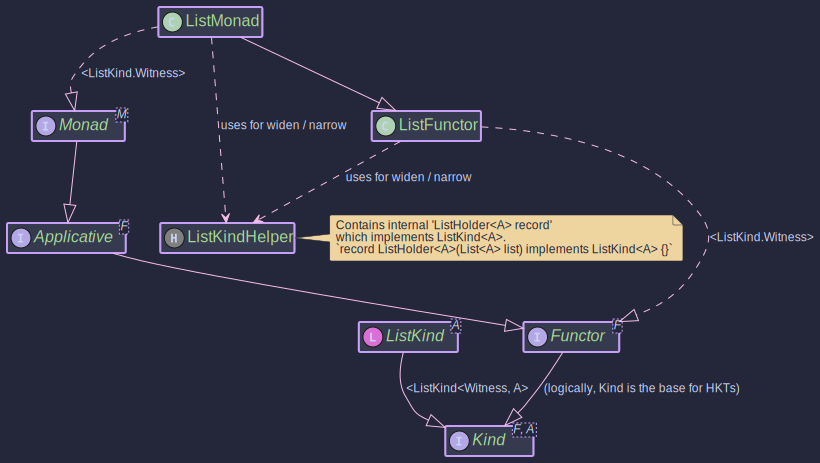

# The ListMonad:
## _Monadic Operations on Java Lists_

~~~admonish info title="What You'll Learn"
- How to work with Lists as contexts representing multiple possible values
- Using `flatMap` for non-deterministic computations and combinations
- Generating Cartesian products and filtering results
- Understanding how List models choice and branching computations
- Building search algorithms and combinatorial problems with monadic operations
~~~

~~~ admonish example title="See Example Code:"
[ListMonadExample.java](https://github.com/higher-kinded-j/higher-kinded-j/blob/main/hkj-examples/src/main/java/org/higherkindedj/example/basic/list/ListMonadExample.java)
~~~

## Purpose

The `ListMonad` in the `Higher-Kinded-J` library provides a monadic interface for Java's standard `java.util.List`. It allows developers to work with lists in a more functional style, enabling operations like `map`, `flatMap`, and `ap` (apply) within the higher-kinded type system. This is particularly useful for sequencing operations that produce lists, transforming list elements, and applying functions within a list context, all while integrating with the generic `Kind<F, A>` abstractions.

Key benefits include:

* **Functional Composition:** Easily chain operations on lists, where each operation might return a list itself.
* **HKT Integration:** `ListKind` (the higher-kinded wrapper for `List`) and `ListMonad` allow `List` to be used with generic functions and type classes expecting `Kind<F, A>`, `Functor<F>`, `Applicative<F>`, or `Monad<F>`.
* **Standard List Behavior:** Leverages the familiar behaviour of Java lists, such as non-uniqueness of elements and order preservation. `flatMap` corresponds to applying a function that returns a list to each element and then concatenating the results.

It implements `Monad<ListKind<A>>`, inheriting from `Functor<ListKind<A>>` and `Applicative<ListKind<A>>`.

## Structure



## How to Use `ListMonad` and `ListKind`

### Creating Instances

`ListKind<A>` is the higher-kinded type representation for `java.util.List<A>`. You typically create `ListKind` instances using the `ListKindHelper` utility class or the `of` method from `ListMonad`.

~~~admonish title="_LIST.widen(List<A>)_"

Converts a standard `java.util.List<A>` into a `Kind<ListKind.Witness, A>`.

```java
List<String> stringList = Arrays.asList("a", "b", "c");
Kind<ListKind.Witness, String> listKind1 = LIST.widen(stringList);

List<Integer> intList = Collections.singletonList(10);
Kind<ListKind.Witness, Integer> listKind2 = LIST.widen(intList);

List<Object> emptyList = Collections.emptyList();
Kind<ListKind.Witness, Object> listKindEmpty = LIST.widen(emptyList);

```
~~~


~~~admonish title="_listMonad.of(A value)_"  

Lifts a single value into the `ListKind` context, creating a singleton list. A `null` input value results in an empty `ListKind`.

```java
ListMonad listMonad = ListMonad.INSTANCE;

Kind<ListKind.Witness, String> listKindOneItem = listMonad.of("hello"); // Contains a list with one element: "hello"
Kind<ListKind.Witness, Integer> listKindAnotherItem = listMonad.of(42);  // Contains a list with one element: 42
Kind<ListKind.Witness, Object> listKindFromNull = listMonad.of(null); // Contains an empty list
```
~~~

~~~admonish title="_LIST.narrow()_"  

To get the underlying `java.util.List<A>` from a `Kind<ListKind.Witness, A>`, use `LIST.narrow()`:

```java
Kind<ListKind.Witness, A> listKind = LIST.widen(List.of("example"));
List<String> unwrappedList = LIST.narrow(listKind); // Returns Arrays.asList("example")
System.out.println(unwrappedList);
```
~~~

### Key Operations

The `ListMonad` provides standard monadic operations:
~~~admonish  title="_map(Function<A, B> f, Kind<ListKind.Witness, A> fa)_"
**`map(Function<A, B> f, Kind<ListKind.Witness, A> fa)`:**

Applies a function `f` to each element of the list within `fa`, returning a new `ListKind` containing the transformed elements.

```java

ListMonad listMonad = ListMonad.INSTANCE;
ListKind<Integer> numbers = LIST.widen(Arrays.asList(1, 2, 3));

Function<Integer, String> intToString = i -> "Number: " + i;
ListKind<String> strings = listMonad.map(intToString, numbers);

// LIST.narrow(strings) would be: ["Number: 1", "Number: 2", "Number: 3"]
System.out.println(LIST.narrow(strings));
```
~~~

~~~admonish  title="_flatMap(Function<A, Kind<ListKind.Witness, B>> f, Kind<ListKind.Witness, A> ma)_"
**`flatMap(Function<A, Kind<ListKind.Witness, B>> f, Kind<ListKind.Witness, A> ma)`:**

Applies a function `f` to each element of the list within `ma`. The function `f` itself returns a `ListKind<B>`. `flatMap` then concatenates (flattens) all these resulting lists into a single `ListKind<B>`.

```java

ListMonad listMonad = ListMonad.INSTANCE;
Kind<ListKind.Witness, Integer> initialValues = LIST.widen(Arrays.asList(1, 2, 3));

// Function that takes an integer and returns a list of itself and itself + 10
Function<Integer, Kind<ListKind.Witness, Integer>> replicateAndAddTen =
    i -> LIST.widen(Arrays.asList(i, i + 10));

Kind<ListKind.Witness, Integer> flattenedList = listMonad.flatMap(replicateAndAddTen, initialValues);

// LIST.narrow(flattenedList) would be: [1, 11, 2, 12, 3, 13]
System.out.println(LIST.narrow(flattenedList));

// Example with empty list results
Function<Integer, Kind<ListKind.Witness, String>> toWordsIfEven =
    i -> (i % 2 == 0) ?
         LIST.widen(Arrays.asList("even", String.valueOf(i))) :
         LIST.widen(new ArrayList<>()); // empty list for odd numbers

Kind<ListKind.Witness, String> wordsList = listMonad.flatMap(toWordsIfEven, initialValues);
// LIST.narrow(wordsList) would be: ["even", "2"]
 System.out.println(LIST.narrow(wordsList));
```
~~~

~~~admonish  title="_ap(Kind<ListKind.Witness, Function<A, B>> ff, Kind<ListKind.Witness, A> fa)_"
**`ap(Kind<ListKind.Witness, Function<A, B>> ff, Kind<ListKind.Witness, A> fa)`:**

Applies a list of functions `ff` to a list of values `fa`. This results in a new list where each function from `ff` is applied to each value in `fa` (Cartesian product style).

```java

ListMonad listMonad = ListMonad.INSTANCE;

Function<Integer, String> addPrefix = i -> "Val: " + i;
Function<Integer, String> multiplyAndString = i -> "Mul: " + (i * 2);

Kind<ListKind.Witness, Function<Integer, String>> functions =
    LIST.widen(Arrays.asList(addPrefix, multiplyAndString));
Kind<ListKind.Witness, Integer> values = LIST.widen(Arrays.asList(10, 20));

Kind<ListKind.Witness, String> appliedResults = listMonad.ap(functions, values);

// LIST.narrow(appliedResults) would be:
// ["Val: 10", "Val: 20", "Mul: 20", "Mul: 40"]
System.out.println(LIST.narrow(appliedResults));
```
~~~


~~~admonish example title="Example: Using ListMonad"

- [ListMonadExample.java](https://github.com/higher-kinded-j/higher-kinded-j/blob/main/hkj-examples/src/main/java/org/higherkindedj/example/basic/list/ListMonadExample.java)

To use `ListMonad` in generic contexts that operate over `Kind<F, A>`:

1. **Get an instance of `ListMonad`:**

```java
ListMonad listMonad = ListMonad.INSTANCE;
```

2. **Wrap your List into `Kind`:**

```java
List<Integer> myList = Arrays.asList(10, 20, 30);
Kind<ListKind.Witness, Integer> listKind = LIST.widen(myList);
```

3. **Use `ListMonad` methods:**

```java
import org.higherkindedj.hkt.Kind;
import org.higherkindedj.hkt.list.ListKind;
import org.higherkindedj.hkt.list.ListKindHelper;
import org.higherkindedj.hkt.list.ListMonad;

import java.util.Arrays;
import java.util.List;
import java.util.function.Function;
import java.util.stream.Collectors;

public class ListMonadExample {
   public static void main(String[] args) {
      ListMonad listMonad = ListMonad.INSTANCE;

      // 1. Create a ListKind
      Kind<ListKind.Witness, Integer> numbersKind = LIST.widen(Arrays.asList(1, 2, 3, 4));

      // 2. Use map
      Function<Integer, String> numberToDecoratedString = n -> "*" + n + "*";
      Kind<ListKind.Witness, String> stringsKind = listMonad.map(numberToDecoratedString, numbersKind);
      System.out.println("Mapped: " + LIST.narrow(stringsKind));
      // Expected: Mapped: [*1*, *2*, *3*, *4*]

      // 3. Use flatMap
      // Function: integer -> ListKind of [integer, integer*10] if even, else empty ListKind
      Function<Integer, Kind<ListKind.Witness, Integer>> duplicateIfEven = n -> {
         if (n % 2 == 0) {
            return LIST.widen(Arrays.asList(n, n * 10));
         } else {
            return LIST.widen(List.of()); // Empty list
         }
      };
      Kind<ListKind.Witness, Integer> flatMappedKind = listMonad.flatMap(duplicateIfEven, numbersKind);
      System.out.println("FlatMapped: " + LIST.narrow(flatMappedKind));
      // Expected: FlatMapped: [2, 20, 4, 40]

      // 4. Use of
      Kind<ListKind.Witness, String> singleValueKind = listMonad.of("hello world");
      System.out.println("From 'of': " + LIST.narrow(singleValueKind));
      // Expected: From 'of': [hello world]

      Kind<ListKind.Witness, String> fromNullOf = listMonad.of(null);
      System.out.println("From 'of' with null: " + LIST.narrow(fromNullOf));
      // Expected: From 'of' with null: []


      // 5. Use ap
      Kind<ListKind.Witness, Function<Integer, String>> listOfFunctions =
              LIST.widen(Arrays.asList(
                      i -> "F1:" + i,
                      i -> "F2:" + (i * i)
              ));
      Kind<ListKind.Witness, Integer> inputNumbersForAp = LIST.widen(Arrays.asList(5, 6));

      Kind<ListKind.Witness, String> apResult = listMonad.ap(listOfFunctions, inputNumbersForAp);
      System.out.println("Ap result: " + LIST.narrow(apResult));
      // Expected: Ap result: [F1:5, F1:6, F2:25, F2:36]


      // Unwrap to get back the standard List
      List<Integer> finalFlatMappedList = LIST.narrow(flatMappedKind);
      System.out.println("Final unwrapped flatMapped list: " + finalFlatMappedList);
   }
}
```

This example demonstrates how to wrap Java Lists into `ListKind`, apply monadic operations using `ListMonad`, and then unwrap them back to standard Lists.

---

**Previous:** [Lazy](lazy_monad.md)
**Next:** [Maybe](maybe_monad.md)
