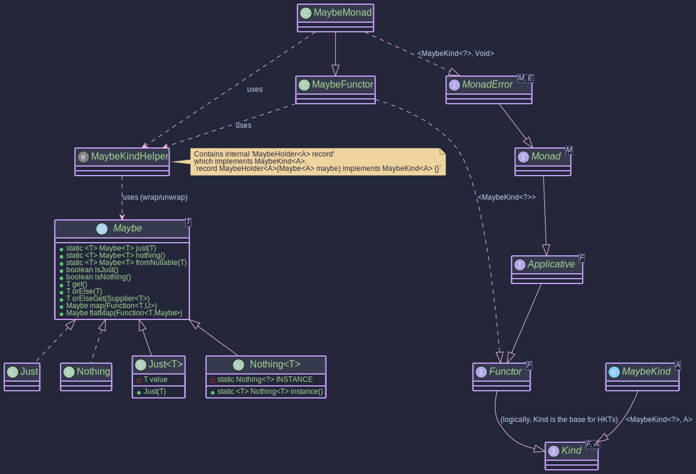

# The MaybeMonad:
## _Handling Optional Values with Non-Null Guarantee_

~~~admonish info title="What You'll Learn"
- How Maybe provides null-safe optional values with guaranteed non-null contents
- The difference between Maybe and Optional (non-null guarantee in Just)
- Using Maybe as a MonadError with Unit as the error type
- Chaining operations with automatic Nothing propagation
- Building robust pipelines that handle absence gracefully
~~~

~~~ admonish example title="See Example Code:"
[MaybeExample.java](https://github.com/higher-kinded-j/higher-kinded-j/blob/main/hkj-examples/src/main/java/org/higherkindedj/example/basic/maybe/MaybeExample.java)
~~~

## Purpose

How do you handle optional values in Java without falling into the null pointer trap? The `Maybe<T>` type in Higher-Kinded-J provides an elegant solution: representing a value that might be present (`Just<T>`) or absent (`Nothing<T>`), with one crucial guarantee: a `Just<T>` will never hold null.

The `Maybe<T>` type is conceptually similar to `java.util.Optional<T>` but with a key distinction: a `Just<T>` is guaranteed to hold a **non-null** value. This strictness helps prevent `NullPointerExceptions` when a value is asserted to be present. `Maybe.fromNullable(T value)` or `MaybeMonad.of(T value)` should be used if the input value could be null, as these will correctly produce a `Nothing` in such cases.

The `MaybeMonad` provides a monadic interface for `Maybe`, allowing for functional composition and integration with the Higher-Kinded Type (HKT) system. This facilitates chaining operations that may or may not yield a value, propagating the `Nothing` state automatically.

~~~admonish info title="Key benefits include:"

* **Explicit Optionality with Non-Null Safety:** `Just<T>` guarantees its contained value is not null. `Nothing<T>` clearly indicates absence.
* **Functional Composition:** Enables elegant chaining of operations using `map`, `flatMap`, and `ap`, where `Nothing` short-circuits computations.
* **HKT Integration:** `MaybeKind<A>` (the HKT wrapper for `Maybe<A>`) and `MaybeMonad` allow `Maybe` to be used with generic functions and type classes that expect `Kind<F, A>` where `F extends WitnessArity<?>`, along with type classes like `Functor<F>`, `Applicative<F>`, `Monad<M>`, or `MonadError<M, E>` where `F extends WitnessArity<TypeArity.Unary>`.
* **Error Handling for Absence:** `MaybeMonad` implements `MonadError<MaybeKind.Witness, Unit>`. `Nothing` is treated as the "error" state, with `Unit` as the phantom error type, signifying absence.
~~~

It implements `MonadError<MaybeKind.Witness, Unit>`, which transitively includes `Monad<MaybeKind.Witness>`, `Applicative<MaybeKind.Witness>`, and `Functor<MaybeKind.Witness>`.


## Structure



~~~admonish note title="Related Types"
For working with Java's standard `Optional` type in the HKT system, see [Optional Monad](./optional_monad.md). For error handling with typed error values, see [Either Monad](./either_monad.md).
~~~


## How to Use `MaybeMonad` and `Maybe`

### Creating Instances

`Maybe<A>` instances can be created directly using static factory methods on `Maybe`, or via `MaybeMonad` for HKT integration. Since `Just<T>` and `Nothing<T>` directly implement `MaybeKind<T>`, they are first-class participants in the HKT simulation with zero runtime overhead for widen/narrow operations.

**Direct `Maybe` Creation:**
 ~~~admonish  title="_Maybe.just(@NonNull T value)_"
 Creates a `Just` holding a **non-null** value. Throws `NullPointerException` if `value` is null.
  ```java
  Maybe<String> justHello = Maybe.just("Hello"); // Just("Hello")
  Maybe<String> illegalJust = Maybe.just(null); // Throws NullPointerException
  ```
  ~~~
  ~~~admonish  title="_Maybe.nothing()_"
 Returns a singleton `Nothing` instance.
  ```java
  Maybe<Integer> noInt = Maybe.nothing(); // Nothing
  ```
  ~~~
  ~~~admonish  title="_Maybe.fromNullable(@Nullable T value)_"
 Creates `Just(value)` if `value` is non-null, otherwise `Nothing`.
  ```java
  Maybe<String> fromPresent = Maybe.fromNullable("Present"); // Just("Present")
  Maybe<String> fromNull = Maybe.fromNullable(null);     // Nothing
  ```
  ~~~

**`MaybeKindHelper` (for HKT wrapping):**
~~~admonish  title="_MaybeKindHelper.widen(Maybe<A> maybe)_"

Converts a `Maybe<A>` to `Kind<MaybeKind.Witness, A>`. Since `Just` and `Nothing` directly implement `MaybeKind`, this performs a null check and type-safe cast (zero overhead, no wrapper object allocation).
  ```java
  Kind<MaybeKind.Witness, String> kindJust = MAYBE.widen(Maybe.just("Wrapped"));
  Kind<MaybeKind.Witness,Integer> kindNothing = MAYBE.widen(Maybe.nothing());
  ```
~~~
~~~admonish  title="_MAYBE.just(@NonNull A value)_"

Convenience for `widen(Maybe.just(value))`.
~~~
~~~admonish  title="_MAYBE.nothing()_"

Convenience for `widen(Maybe.nothing())`.
~~~

**`MaybeMonad` Instance Methods:**
~~~admonish  title="_maybeMonad.of(@Nullable A value)_"

Lifts a value into `Kind<MaybeKind.Witness, A>`. Uses `Maybe.fromNullable()` internally.
  ```java
  MaybeMonad maybeMonad = MaybeMonad.INSTANCE;
  Kind<MaybeKind.Witness, String> kindFromMonad = maybeMonad.of("Monadic"); // Just("Monadic")
  Kind<MaybeKind.Witness, String> kindNullFromMonad = maybeMonad.of(null);   // Nothing
  ```
~~~
~~~admonish  title="_maybeMonad.raiseError(@Nullable Unit error)_"

Creates a `Kind<MaybeKind.Witness, E>` representing `Nothing`. The `error` (Unit) argument is ignored.
  ```java
  Kind<MaybeKind.Witness, Double> errorKind = maybeMonad.raiseError(Unit.INSTANCE); // Nothing
  ``` 
 ~~~
   
~~~admonish  title="Unwrapping _MaybeKind_"
To get the underlying `Maybe<A>` from a `MaybeKind<A>`, use `MAYBE.narrow()`:

```java
MaybeKind<String> kindJust = MAYBE.just("Example");
Maybe<String> unwrappedMaybe = MAYBE.narrow(kindJust); // Just("Example")
System.out.println("Unwrapped: " + unwrappedMaybe);

MaybeKind<Integer> kindNothing = MAYBE.nothing();
Maybe<Integer> unwrappedNothing = MAYBE.narrow(kindNothing); // Nothing
System.out.println("Unwrapped Nothing: " + unwrappedNothing);
```
~~~

### Interacting with `Maybe` values

The `Maybe` interface itself provides useful methods:

* `isJust()`: Returns `true` if it's a `Just`.
* `isNothing()`: Returns `true` if it's a `Nothing`.
* `get()`: Returns the value if `Just`, otherwise throws `NoSuchElementException`. **Use with caution.**
* `orElse(@NonNull T other)`: Returns the value if `Just`, otherwise returns `other`.
* `orElseGet(@NonNull Supplier<? extends @NonNull T> other)`: Returns the value if `Just`, otherwise invokes `other.get()`.
* `toEither(L leftValue)`: Converts to `Either<L, T>`. `Just(t)` becomes `Right(t)`, `Nothing` becomes `Left(leftValue)`.
* `toEither(Supplier<L> leftSupplier)`: Lazy variant that only evaluates the supplier for `Nothing`.
* The `Maybe` interface also has its own `map` and `flatMap` methods, which are similar in behaviour to those on `MaybeMonad` but operate directly on `Maybe` instances.

~~~admonish example title="Converting Maybe to Either"
The `toEither` methods bridge between `Maybe` and `Either`, useful when you need to provide error context for absent values:

```java
Maybe<User> maybeUser = findUser(userId);

// Convert with a static error value
Either<String, User> result = maybeUser.toEither("User not found");

// Convert with a lazy error (only computed if Nothing)
Either<UserError, User> result2 = maybeUser.toEither(
    () -> new UserError("User " + userId + " not found")
);

// Just(user) -> Right(user)
// Nothing    -> Left("User not found")
```
~~~

### Key Operations (via `MaybeMonad`)

~~~admonish example title="Example: _map(Function<A, B> f, Kind<MaybeKind.Witness, A> ma)_"

Applies `f` to the value inside `ma` if it's `Just`. If `ma` is `Nothing`, or if `f` returns `null` (which `Maybe.fromNullable` then converts to `Nothing`), the result is `Nothing`.

```java
void mapExample() {
  MaybeMonad maybeMonad = MaybeMonad.INSTANCE;
  Kind<MaybeKind.Witness, Integer> justNum = MAYBE.just(10);
  Kind<MaybeKind.Witness, Integer> nothingNum = MAYBE.nothing();

  Function<Integer, String> numToString = n -> "Val: " + n;
  Kind<MaybeKind.Witness, String> justStr = maybeMonad.map(numToString, justNum); // Just("Val: 10")
  Kind<MaybeKind.Witness, String> nothingStr = maybeMonad.map(numToString, nothingNum); // Nothing

  Function<Integer, String> numToNull = n -> null;
  Kind<MaybeKind.Witness, String> mappedToNull = maybeMonad.map(numToNull, justNum); // Nothing

  System.out.println("Map (Just): " + MAYBE.narrow(justStr));
  System.out.println("Map (Nothing): " + MAYBE.narrow(nothingStr));
  System.out.println("Map (To Null): " + MAYBE.narrow(mappedToNull));
}
```
~~~~

~~~admonish example title="Example: _flatMap(Function<A, Kind<MaybeKind.Witness, B>> f, Kind<MaybeKind.Witness, A> ma)_"

If `ma` is `Just(a)`, applies `f` to `a`. `f` must return a `Kind<MaybeKind.Witness, B>`. If `ma` is `Nothing`, or `f` returns `Nothing`, the result is `Nothing`.

```java
void flatMapExample() {
  MaybeMonad maybeMonad = MaybeMonad.INSTANCE;
  Function<String, Kind<MaybeKind.Witness, Integer>> parseString = s -> {
    try {
      return MAYBE.just(Integer.parseInt(s));
    } catch (NumberFormatException e) {
      return MAYBE.nothing();
    }
  };

  Kind<MaybeKind.Witness, String> justFiveStr = MAYBE.just("5");
  Kind<MaybeKind.Witness, Integer> parsedJust = maybeMonad.flatMap(parseString, justFiveStr); // Just(5)

  Kind<MaybeKind.Witness, String> justNonNumStr = MAYBE.just("abc");
  Kind<MaybeKind.Witness, Integer> parsedNonNum = maybeMonad.flatMap(parseString, justNonNumStr); // Nothing

  System.out.println("FlatMap (Just): " + MAYBE.narrow(parsedJust));
  System.out.println("FlatMap (NonNum): " + MAYBE.narrow(parsedNonNum));
}
```
~~~~

~~~admonish example title="Example: _ap(Kind<MaybeKind.Witness, Function<A, B>> ff, Kind<MaybeKind.Witness, A> fa)_"

If `ff` is `Just(f)` and `fa` is `Just(a)`, applies `f` to `a`. Otherwise, `Nothing`.

```java
void apExample() {
  MaybeMonad maybeMonad = MaybeMonad.INSTANCE;
  Kind<MaybeKind.Witness, Integer> justNum = MAYBE.just(10);
  Kind<MaybeKind.Witness, Integer> nothingNum = MAYBE.nothing();
  Kind<MaybeKind.Witness, Function<Integer, String>> justFunc = MAYBE.just(i -> "Result: " + i);
  Kind<MaybeKind.Witness, Function<Integer, String>> nothingFunc = MAYBE.nothing();

  Kind<MaybeKind.Witness, String> apApplied = maybeMonad.ap(justFunc, justNum); // Just("Result: 10")
  Kind<MaybeKind.Witness, String> apNothingFunc = maybeMonad.ap(nothingFunc, justNum); // Nothing
  Kind<MaybeKind.Witness, String> apNothingVal = maybeMonad.ap(justFunc, nothingNum); // Nothing

  System.out.println("Ap (Applied): " + MAYBE.narrow(apApplied));
  System.out.println("Ap (Nothing Func): " + MAYBE.narrow(apNothingFunc));
  System.out.println("Ap (Nothing Val): " + MAYBE.narrow(apNothingVal));
}
```
~~~~

~~~admonish example title="Example: _handleErrorWith(Kind<MaybeKind.Witness, A> ma, Function<Void, Kind<MaybeKind.Witness, A>> handler)_"

If `ma` is `Just`, it's returned. If `ma` is `Nothing` (the "error" state), `handler` is invoked (with `Unit.INSTANCE` for `Unit`) to provide a recovery `MaybeKind`.

```java
void handleErrorWithExample() {
  MaybeMonad maybeMonad = MaybeMonad.INSTANCE;
  Function<Unit, Kind<MaybeKind.Witness, String>> recover = v -> MAYBE.just("Recovered");

  Kind<MaybeKind.Witness, String> handledJust = maybeMonad.handleErrorWith(MAYBE.just("Original"), recover); // Just("Original")
  Kind<MaybeKind.Witness, String> handledNothing = maybeMonad.handleErrorWith(MAYBE.nothing(), recover);    // Just("Recovered")

  System.out.println("HandleError (Just): " + MAYBE.narrow(handledJust));
  System.out.println("HandleError (Nothing): " + MAYBE.narrow(handledNothing));
}
```
~~~


~~~admonish example title="Example: Using _MaybeMonad_"

A complete example demonstrating generic usage:

```java
public void monadExample() {
  MaybeMonad maybeMonad = MaybeMonad.INSTANCE;

  // 1. Create MaybeKind instances
  Kind<MaybeKind.Witness, Integer> presentIntKind = MAYBE.just(100);
  Kind<MaybeKind.Witness, Integer> absentIntKind = MAYBE.nothing();
  Kind<MaybeKind.Witness, String> nullInputStringKind = maybeMonad.of(null); // Becomes Nothing

  // 2. Use map
  Function<Integer, String> intToStatus = n -> "Status: " + n;
  Kind<MaybeKind.Witness, String> mappedPresent = maybeMonad.map(intToStatus, presentIntKind);
  Kind<MaybeKind.Witness, String> mappedAbsent = maybeMonad.map(intToStatus, absentIntKind);

  System.out.println("Mapped (Present): " + MAYBE.narrow(mappedPresent)); // Just(Status: 100)
  System.out.println("Mapped (Absent): " + MAYBE.narrow(mappedAbsent));   // Nothing

  // 3. Use flatMap
  Function<Integer, Kind<MaybeKind.Witness, String>> intToPositiveStatusKind = n ->
      (n > 0) ? maybeMonad.of("Positive: " + n) : MAYBE.nothing();

  Kind<MaybeKind.Witness, String> flatMappedPresent = maybeMonad.flatMap(intToPositiveStatusKind, presentIntKind);
  Kind<MaybeKind.Witness, String> flatMappedZero = maybeMonad.flatMap(intToPositiveStatusKind, maybeMonad.of(0)); // 0 is not > 0

  System.out.println("FlatMapped (Present Positive): " + MAYBE.narrow(flatMappedPresent)); // Just(Positive: 100)
  System.out.println("FlatMapped (Zero): " + MAYBE.narrow(flatMappedZero)); // Nothing

  // 4. Use 'of' and 'raiseError'
  Kind<MaybeKind.Witness, String> fromOf = maybeMonad.of("Direct Value");
  Kind<MaybeKind.Witness, String> fromRaiseError = maybeMonad.raiseError(Unit.INSTANCE); // Creates Nothing
  System.out.println("From 'of': " + MAYBE.narrow(fromOf)); // Just(Direct Value)
  System.out.println("From 'raiseError': " + MAYBE.narrow(fromRaiseError)); // Nothing
  System.out.println("From 'of(null)': " + MAYBE.narrow(nullInputStringKind)); // Nothing


  // 5. Use handleErrorWith
  Function<Void, Kind<MaybeKind.Witness, Integer>> recoverWithDefault =
      v -> maybeMonad.of(-1); // Default value if absent

  Kind<MaybeKind.Witness, Integer> recoveredFromAbsent =
      maybeMonad.handleErrorWith(absentIntKind, recoverWithDefault);
  Kind<MaybeKind.Witness, Integer> notRecoveredFromPresent =
      maybeMonad.handleErrorWith(presentIntKind, recoverWithDefault);

  System.out.println("Recovered (from Absent): " + MAYBE.narrow(recoveredFromAbsent)); // Just(-1)
  System.out.println("Recovered (from Present): " + MAYBE.narrow(notRecoveredFromPresent)); // Just(100)

  // Using the generic processData function
  Kind<MaybeKind.Witness, String> processedPresent = processData(presentIntKind, x -> "Processed: " + x, "N/A", maybeMonad);
  Kind<MaybeKind.Witness, String> processedAbsent = processData(absentIntKind, x -> "Processed: " + x, "N/A", maybeMonad);

  System.out.println("Generic Process (Present): " + MAYBE.narrow(processedPresent)); // Just(Processed: 100)
  System.out.println("Generic Process (Absent): " + MAYBE.narrow(processedAbsent));   // Just(N/A)

  // Unwrap to get back the standard Maybe
  Maybe<String> finalMappedMaybe = MAYBE.narrow(mappedPresent);
  System.out.println("Final unwrapped mapped maybe: " + finalMappedMaybe); // Just(Status: 100)
}

public static <A, B> Kind<MaybeKind.Witness, B> processData(
    Kind<MaybeKind.Witness, A> inputKind,
    Function<A, B> mapper,
    B defaultValueOnAbsence,
    MaybeMonad monad
) {
  // inputKind is now Kind<MaybeKind.Witness, A>, which is compatible with monad.map
  Kind<MaybeKind.Witness, B> mappedKind = monad.map(mapper, inputKind);

  // The result of monad.map is Kind<MaybeKind.Witness, B>.
  // The handler (Unit v) -> monad.of(defaultValueOnAbsence) also produces Kind<MaybeKind.Witness, B>.
  return monad.handleErrorWith(mappedKind, (Unit v) -> monad.of(defaultValueOnAbsence));
}
```

This example highlights how `MaybeMonad` facilitates working with optional values in a functional, type-safe manner, especially when dealing with the HKT abstractions and requiring non-null guarantees for present values.
~~~

## When to Use Maybe

| Scenario | Use |
|----------|-----|
| Green-field code representing optional values | `Maybe` — strict non-null guarantee in `Just` |
| JDK interop (APIs returning `java.util.Optional`) | Prefer [Optional](./optional_monad.md) to avoid conversion overhead |
| Optional values with typed error context | Convert with `maybeUser.toEither("not found")` → use [Either](./either_monad.md) |
| Generic monadic code that works across any `Kind<F, A>` | `MaybeMonad` — implements `MonadError<MaybeKind.Witness, Unit>` |
| Application-level pipelines with fluent API | Prefer [MaybePath](../effect/path_maybe.md) |

---

~~~admonish tip title="Effect Path Alternative"
For most use cases, prefer **[MaybePath](../effect/path_maybe.md)** which wraps `Maybe` and provides:

- Fluent composition with `map`, `via`, `recover`
- Seamless integration with the [Focus DSL](../optics/focus_dsl.md) for structural navigation
- A consistent API shared across all effect types

```java
// Instead of manual Maybe chaining:
Maybe<User> user = findUser(id);
Maybe<String> name = user.flatMap(u -> Maybe.fromNullable(u.name()));

// Use MaybePath for cleaner composition:
MaybePath<String> name = Path.maybe(findUser(id))
    .via(u -> Path.maybe(u.name()));
```

See [Effect Path Overview](../effect/effect_path_overview.md) for the complete guide.
~~~

~~~admonish example title="Benchmarks"
Maybe has dedicated JMH benchmarks measuring instance reuse, short-circuit efficiency, filtering, and nullable interop. Key expectations:

- **`nothingMap` is 5-10x faster than `justMap`** — Nothing reuses the same instance with zero allocation
- **`nothingLongChain` is 10-50x faster than `justLongChain`** — sustained reuse benefit over 50-deep chains
- `nothingFilter` and `nothingFlatMap` should show similar reuse benefits
- If Nothing operations allocate memory, instance reuse is broken

```bash
./gradlew :hkj-benchmarks:jmh --includes=".*MaybeBenchmark.*"
```
See [Benchmarks & Performance](../benchmarks.md) for full details, expected ratios, and how to interpret results.
~~~

---

**Previous:** [List](list_monad.md)
**Next:** [Optional](optional_monad.md)