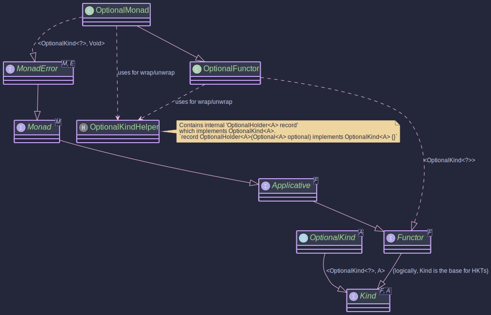

# The OptionalMonad:
## _Monadic Operations for Java Optional_

~~~ admonish example title="See Example Code:"
[OptionalExample.java](https://github.com/higher-kinded-j/higher-kinded-j/blob/main/hkj-examples/src/main/java/org/higherkindedj/example/basic/optional/OptionalExample.java)
~~~

## Purpose

The `OptionalMonad` in the `Higher-Kinded-J` library provides a monadic interface for Java's standard `java.util.Optional<T>`. It allows developers to work with `Optional` values in a more functional and composable style, enabling operations like `map`, `flatMap`, and `ap` (apply) within the higher-kinded type (HKT) system. This is particularly useful for sequencing operations that may or may not produce a value, handling the presence or absence of values gracefully.

Key benefits include:

* **Functional Composition:** Easily chain operations on `Optional`s, where each operation might return an `Optional` itself. If any step results in an `Optional.empty()`, subsequent operations are typically short-circuited, propagating the empty state.
* **HKT Integration:** `OptionalKind<A>` (the higher-kinded wrapper for `Optional<A>`) and `OptionalMonad` allow `Optional` to be used with generic functions and type classes expecting `Kind<F, A>`, `Functor<F>`, `Applicative<F>`, `Monad<M>`, or even `MonadError<M, E>`.
* **Error Handling for Absence:** `OptionalMonad` implements `MonadError<OptionalKind.Witness, Unit>`. In this context, `Optional.empty()` is treated as the "error" state, and `Unit` is used as the phantom error type, signifying absence rather than a traditional exception.

It implements `MonadError<OptionalKind.Witness, Unit>`, which means it also transitively implements `Monad<OptionalKind.Witness>`, `Applicative<OptionalKind.Witness>`, and `Functor<OptionalKind.Witness>`.

## Structure




## How to Use `OptionalMonad` and `OptionalKind`

### Creating Instances

`OptionalKind<A>` is the higher-kinded type representation for `java.util.Optional<A>`. You typically create `OptionalKind` instances using the `OptionalKindHelper` utility class or the `of` and `raiseError` methods from `OptionalMonad`.

~~~admonish  title="_OPTIONAL.widen(Optional<A>)_"

Converts a standard `java.util.Optional<A>` into an `OptionalKind<A>`.

   ```java
   // Wrapping a present Optional
   Optional<String> presentOptional = Optional.of("Hello");
   OptionalKind<String> kindPresent = OPTIONAL.widen(presentOptional);

   // Wrapping an empty Optional
   Optional<Integer> emptyOptional = Optional.empty();
   OptionalKind<Integer> kindEmpty = OPTIONAL.widen(emptyOptional);

   // Wrapping an Optional that might be null (though Optional itself won't be null)
   String possiblyNullValue = null;
   Optional<String> nullableOptional = Optional.ofNullable(possiblyNullValue); // Results in Optional.empty()
   OptionalKind<String> kindFromNullable = OPTIONAL.widen(nullableOptional);
   ```
~~~

~~~admonish title="_optionalMonad.of(A value)_"


Lifts a single value (which can be `null`) into the `OptionalKind` context. It uses `Optional.ofNullable(value)` internally.

```java
OptionalMonad optionalMonad = OptionalMonad.INSTANCE;

Kind<OptionalKind.Witness, String> kindFromValue = optionalMonad.of("World"); // Wraps Optional.of("World")
Kind<OptionalKind.Witness, Integer> kindFromNullValue = optionalMonad.of(null); // Wraps Optional.empty()
```   
~~~

~~~admonish title="_optionalMonad.raiseError(Unit error)_"


Creates an empty `OptionalKind`. Since `Unit` is the error type, this method effectively represents the "error" state of an `Optional`, which is `Optional.empty()`. The `error` argument (which would be `Unit.INSTANCE` for `Unit`) is ignored.

```java

OptionalMonad optionalMonad = OptionalMonad.INSTANCE;
Kind<OptionalKind.Witness, String> emptyKindFromError = optionalMonad.raiseError(Unit.INSTANCE); // Represents Optional.empty()
```
~~~

~~~admonish title="_OPTIONAL.narrow()_"

To get the underlying `java.util.Optional<A>` from an `OptionalKind<A>`, use `OPTIONAL.narrow()`:

```java

OptionalKind<String> kindPresent = OPTIONAL.widen(Optional.of("Example"));
Optional<String> unwrappedOptional = OPTIONAL.narrow(kindPresent); // Returns Optional.of("Example")
System.out.println("Unwrapped: " + unwrappedOptional);

OptionalKind<Integer> kindEmpty = OPTIONAL.widen(Optional.empty());
Optional<Integer> unwrappedEmpty = OPTIONAL.narrow(kindEmpty); // Returns Optional.empty()
System.out.println("Unwrapped Empty: " + unwrappedEmpty);
```
~~~


### Key Operations

The `OptionalMonad` provides standard monadic and error-handling operations:

~~~admonish example title="Example: _map(Function<A, B> f, Kind<OptionalKind.Witness, A> fa)_"

- [OptionalExample.java](https://github.com/higher-kinded-j/higher-kinded-j/blob/main/hkj-examples/src/main/java/org/higherkindedj/example/basic/optional/OptionalExample.java)

Applies a function `f` to the value inside `fa` if it's present. If `fa` is empty, it remains empty. The function `f` can return `null`, which `Optional.map` will turn into an `Optional.empty()`.

```java

public void mapExample() {
   OptionalMonad optionalMonad = OptionalMonad.INSTANCE;
   OptionalKind<Integer> presentNumber = OPTIONAL.widen(Optional.of(10));
   OptionalKind<Integer> emptyNumber = OPTIONAL.widen(Optional.empty());

   Function<Integer, String> intToString = i -> "Number: " + i;
   Kind<OptionalKind.Witness, String> presentString = optionalMonad.map(intToString, presentNumber);
   // OPTIONAL.narrow(presentString) would be Optional.of("Number: 10")

   Kind<OptionalKind.Witness, String> emptyString = optionalMonad.map(intToString, emptyNumber);
   // OPTIONAL.narrow(emptyString) would be Optional.empty()

   Function<Integer, String> intToNull = i -> null;
   Kind<OptionalKind.Witness, String> mappedToNull = optionalMonad.map(intToNull, presentNumber);
   // OPTIONAL.narrow(mappedToNull) would be Optional.empty()

   System.out.println("Map (Present): " + OPTIONAL.narrow(presentString));
   System.out.println("Map (Empty): " + OPTIONAL.narrow(emptyString));
   System.out.println("Map (To Null): " + OPTIONAL.narrow(mappedToNull));
}
```
~~~

~~~admonish example title="Example: _flatMap(Function<A, Kind<OptionalKind.Witness, B>> f, Kind<OptionalKind.Witness, A> ma)_"

- [OptionalExample.java](https://github.com/higher-kinded-j/higher-kinded-j/blob/main/hkj-examples/src/main/java/org/higherkindedj/example/basic/optional/OptionalExample.java)


Applies a function `f` to the value inside `ma` if it's present. The function `f` itself returns an `OptionalKind<B>`. If `ma` is empty, or if `f` returns an empty `OptionalKind`, the result is an empty `OptionalKind`.

```java
public void flatMapExample() {
   OptionalMonad optionalMonad = OptionalMonad.INSTANCE;
   OptionalKind<String> presentInput = OPTIONAL.widen(Optional.of("5"));
   OptionalKind<String> emptyInput = OPTIONAL.widen(Optional.empty());

   Function<String, Kind<OptionalKind.Witness, Integer>> parseToIntKind = s -> {
      try {
         return OPTIONAL.widen(Optional.of(Integer.parseInt(s)));
      } catch (NumberFormatException e) {
         return OPTIONAL.widen(Optional.empty());
      }
   };

   Kind<OptionalKind.Witness, Integer> parsedPresent = optionalMonad.flatMap(parseToIntKind, presentInput);
   // OPTIONAL.narrow(parsedPresent) would be Optional.of(5)

   Kind<OptionalKind.Witness, Integer> parsedEmpty = optionalMonad.flatMap(parseToIntKind, emptyInput);
   // OPTIONAL.narrow(parsedEmpty) would be Optional.empty()

   OptionalKind<String> nonNumericInput = OPTIONAL.widen(Optional.of("abc"));
   Kind<OptionalKind.Witness, Integer> parsedNonNumeric = optionalMonad.flatMap(parseToIntKind, nonNumericInput);
   // OPTIONAL.narrow(parsedNonNumeric) would be Optional.empty()

   System.out.println("FlatMap (Present): " + OPTIONAL.narrow(parsedPresent));
   System.out.println("FlatMap (Empty Input): " + OPTIONAL.narrow(parsedEmpty));
   System.out.println("FlatMap (Non-numeric): " + OPTIONAL.narrow(parsedNonNumeric));
}
```
~~~

~~~admonish example title="Example: _ap(Kind<OptionalKind.Witness, Function<A, B>> ff, Kind<OptionalKind.Witness, A> fa)_"

- [OptionalExample.java](https://github.com/higher-kinded-j/higher-kinded-j/blob/main/hkj-examples/src/main/java/org/higherkindedj/example/basic/optional/OptionalExample.java)

Applies an `OptionalKind` containing a function `ff` to an `OptionalKind` containing a value `fa`. If both are present, the function is applied. Otherwise, the result is empty.

```java
 public void apExample() {
   OptionalMonad optionalMonad = OptionalMonad.INSTANCE;

   OptionalKind<Function<Integer, String>> presentFuncKind =
           OPTIONAL.widen(Optional.of(i -> "Value: " + i));
   OptionalKind<Function<Integer, String>> emptyFuncKind =
           OPTIONAL.widen(Optional.empty());

   OptionalKind<Integer> presentValueKind = OPTIONAL.widen(Optional.of(100));
   OptionalKind<Integer> emptyValueKind = OPTIONAL.widen(Optional.empty());

   // Both present
   Kind<OptionalKind.Witness, String> result1 = optionalMonad.ap(presentFuncKind, presentValueKind);
   // OPTIONAL.narrow(result1) is Optional.of("Value: 100")

   // Function empty
   Kind<OptionalKind.Witness, String> result2 = optionalMonad.ap(emptyFuncKind, presentValueKind);
   // OPTIONAL.narrow(result2) is Optional.empty()

   // Value empty
   Kind<OptionalKind.Witness, String> result3 = optionalMonad.ap(presentFuncKind, emptyValueKind);
   // OPTIONAL.narrow(result3) is Optional.empty()

   System.out.println("Ap (Both Present): " + OPTIONAL.narrow(result1));
   System.out.println("Ap (Function Empty): " + OPTIONAL.narrow(result2));
   System.out.println("Ap (Value Empty): " + OPTIONAL.narrow(result3));
}

```
~~~

~~~admonish example title="Example: handleErrorWith(Kind<OptionalKind.Witness, A> ma, Function<Unit, Kind<OptionalKind.Witness, A>> handler)"

- [OptionalExample.java](https://github.com/higher-kinded-j/higher-kinded-j/blob/main/hkj-examples/src/main/java/org/higherkindedj/example/basic/optional/OptionalExample.java)

If `ma` is present, it's returned. If `ma` is empty (the "error" state), the `handler` function is invoked (with `Unit.INSTANCE` as the `Unit` argument) to provide a recovery `OptionalKind`.

```java
public void handleErrorWithExample() {
   OptionalMonad optionalMonad = OptionalMonad.INSTANCE;

   Kind<OptionalKind.Witness, String> presentKind = OPTIONAL.widen(Optional.of("Exists"));
   OptionalKind<String> emptyKind = OPTIONAL.widen(Optional.empty());

   Function<Unit, Kind<OptionalKind.Witness, String>> recoveryFunction =
           (Unit unitInstance) -> OPTIONAL.widen(Optional.of("Recovered Value"));

   // Handling error on a present OptionalKind
   Kind<OptionalKind.Witness, String> handledPresent =
           optionalMonad.handleErrorWith(presentKind, recoveryFunction);
   // OPTIONAL.narrow(handledPresent) is Optional.of("Exists")

   // Handling error on an empty OptionalKind
   Kind<OptionalKind.Witness, String> handledEmpty =
           optionalMonad.handleErrorWith(emptyKind, recoveryFunction);

   // OPTIONAL.narrow(handledEmpty) is Optional.of("Recovered Value")
   System.out.println("HandleError (Present): " + OPTIONAL.narrow(handledPresent));
   System.out.println("HandleError (Empty): " + OPTIONAL.narrow(handledEmpty));
}
```
~~~


~~~admonish example title="Example: Using _OptionalMonad_"
- [OptionalExample.java](https://github.com/higher-kinded-j/higher-kinded-j/blob/main/hkj-examples/src/main/java/org/higherkindedj/example/basic/optional/OptionalExample.java)

To use `OptionalMonad` in generic contexts that operate over `Kind<F, A>`:
```java
public void monadExample() {
    OptionalMonad optionalMonad = OptionalMonad.INSTANCE;

    // 1. Create OptionalKind instances
    OptionalKind<Integer> presentIntKind = OPTIONAL.widen(Optional.of(10));
    Kind<OptionalKind.Witness, Integer> emptyIntKind = optionalMonad.raiseError(null); // Creates empty
    
    // 2. Use map
    Function<Integer, String> intToMessage = n -> "Value is " + n;
    Kind<OptionalKind.Witness, String> mappedPresent = optionalMonad.map(intToMessage, presentIntKind);
    Kind<OptionalKind.Witness, String> mappedEmpty = optionalMonad.map(intToMessage, emptyIntKind);
    
    System.out.println("Mapped (Present): " + OPTIONAL.narrow(mappedPresent)); // Optional[Value is 10]
    System.out.println("Mapped (Empty): " + OPTIONAL.narrow(mappedEmpty));   // Optional.empty
    
    // 3. Use flatMap
    Function<Integer, Kind<OptionalKind.Witness, Double>> intToOptionalDouble = n ->
        (n > 0) ? optionalMonad.of(n / 2.0) : optionalMonad.raiseError(null);
    
    Kind<OptionalKind.Witness, Double> flatMappedPresent = optionalMonad.flatMap(intToOptionalDouble, presentIntKind);
    Kind<OptionalKind.Witness, Double> flatMappedEmpty = optionalMonad.flatMap(intToOptionalDouble, emptyIntKind);
    Kind<OptionalKind.Witness, Integer> zeroIntKind = optionalMonad.of(0);
    Kind<OptionalKind.Witness, Double> flatMappedZero = optionalMonad.flatMap(intToOptionalDouble, zeroIntKind);
    
    
    System.out.println("FlatMapped (Present): " + OPTIONAL.narrow(flatMappedPresent)); // Optional[5.0]
    System.out.println("FlatMapped (Empty): " + OPTIONAL.narrow(flatMappedEmpty));     // Optional.empty
    System.out.println("FlatMapped (Zero): " + OPTIONAL.narrow(flatMappedZero));       // Optional.empty
    
    // 4. Use 'of' and 'raiseError' (already shown in creation)
    
    // 5. Use handleErrorWith
    Function<Unit, Kind<OptionalKind.Witness, Integer>> recoverWithDefault =
        v -> optionalMonad.of(-1); // Default value if empty
    
    Kind<OptionalKind.Witness, Integer> recoveredFromEmpty =
        optionalMonad.handleErrorWith(emptyIntKind, recoverWithDefault);
    Kind<OptionalKind.Witness, Integer> notRecoveredFromPresent =
        optionalMonad.handleErrorWith(presentIntKind, recoverWithDefault);
    
    System.out.println("Recovered (from Empty): " + OPTIONAL.narrow(recoveredFromEmpty)); // Optional[-1]
    System.out.println("Recovered (from Present): " + OPTIONAL.narrow(notRecoveredFromPresent)); // Optional[10]
    
    // Unwrap to get back the standard Optional
    Optional<String> finalMappedOptional = OPTIONAL.narrow(mappedPresent);
    System.out.println("Final unwrapped mapped optional: " + finalMappedOptional);
}
```

This example demonstrates wrapping `Optional`s, applying monadic and error-handling operations via `OptionalMonad`, and unwrapping back to standard `Optional`s. The `MonadError` capabilities allow treating absence (`Optional.empty`) as a recoverable "error" state.
~~~