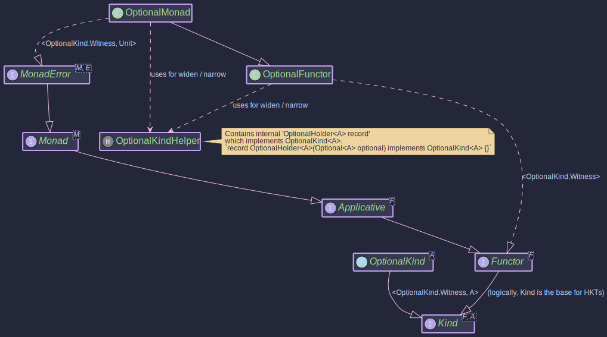

# The OptionalMonad:
## _Monadic Operations for Java Optional_

~~~admonish info title="What You'll Learn"
- How to integrate Java's Optional with Higher-Kinded-J's type class system
- Using MonadError with Unit to represent absence as an error state
- Chaining optional operations with automatic empty propagation
- Building safe database and service call pipelines
- When to choose Optional vs Maybe for your use case
~~~

~~~ admonish example title="See Example Code:"
[OptionalExample.java](https://github.com/higher-kinded-j/higher-kinded-j/blob/main/hkj-examples/src/main/java/org/higherkindedj/example/basic/optional/OptionalExample.java)
~~~

## Why Use OptionalMonad?

Java's `Optional<T>` is everywhere — repositories return it, configuration lookups return it, and dozens of JDK and third-party APIs produce it. But when you try to write *generic* monadic code that programs against `Kind<F, A>`, `Optional` cannot participate directly. It is a concrete JDK class, not part of any higher-kinded type hierarchy.

```java
// You want to write generic code like this...
<F extends WitnessArity<?>> Kind<F, String> lookupAndFormat(
    Kind<F, User> userKind, Monad<F> monad) {
  return monad.map(u -> u.name().toUpperCase(), userKind);
}

// ...but Optional<User> is not a Kind<F, User>.
Optional<User> user = repository.findById(id); // can't pass to lookupAndFormat
```

`OptionalMonad` bridges this gap. It wraps `Optional` into the HKT system via `OptionalKind`, giving you `map`, `flatMap`, `ap`, `raiseError`, and `handleErrorWith` — all working through the `Kind` abstraction. Your generic algorithms now work with `Optional` alongside `Maybe`, `Either`, `IO`, and every other type in the library, without duplicating logic.

```java
// Wrap the Optional into the HKT world
Kind<OptionalKind.Witness, User> userKind = OPTIONAL.widen(repository.findById(id));

// Now it works with any generic function expecting Kind<F, A>
Kind<OptionalKind.Witness, String> result = lookupAndFormat(userKind, OptionalMonad.INSTANCE);

// Unwrap back to Optional at the boundary
Optional<String> name = OPTIONAL.narrow(result);
```

~~~admonish note title="Optional vs Maybe"
Both `OptionalMonad` and [MaybeMonad](maybe_monad.md) model "a value that might be absent" with `Unit` as the error type. The key difference is a **null guarantee**:

- **`Maybe.just(value)`** throws `NullPointerException` if `value` is null — a `Just` always holds a non-null value.
- **`Optional.of(value)`** also rejects null, but `Optional.ofNullable(value)` (used by `OptionalMonad.of`) silently converts null to empty.

Choose `OptionalMonad` when you need to interoperate with JDK APIs that already return `Optional`. Choose `MaybeMonad` when you control the data types and want the stronger non-null guarantee. See the [decision table below](#when-to-use-optional-vs-maybe) for detailed guidance.
~~~

## Core Components



The `Optional` HKT simulation is built from these pieces:

| Component | Role |
|-----------|------|
| `Optional<A>` | Standard JDK optional value |
| `OptionalKind<A>` / `OptionalKindHelper` | HKT bridge: `widen()`, `narrow()` |
| `OptionalMonad` | `MonadError<OptionalKind.Witness, Unit>` — provides `map`, `flatMap`, `of`, `ap`, `raiseError`, `handleErrorWith` |

~~~admonish note title="How the Operations Map"
| Type Class Operation | What It Does |
|---------------------|--------------|
| `OPTIONAL.widen(optional)` | Wrap a `java.util.Optional` into the HKT world |
| `optionalMonad.of(value)` | Lift a value via `Optional.ofNullable` — null becomes empty |
| `optionalMonad.map(f, fa)` | Transform the value if present; empty stays empty |
| `optionalMonad.flatMap(f, fa)` | Chain a function that itself returns an `OptionalKind` |
| `optionalMonad.ap(ff, fa)` | Apply a function-in-Optional to a value-in-Optional |
| `optionalMonad.raiseError(Unit.INSTANCE)` | Create an empty `OptionalKind` (the "error" state) |
| `optionalMonad.handleErrorWith(fa, handler)` | If empty, invoke the handler to recover |
| `OPTIONAL.narrow(kind)` | Unwrap back to `java.util.Optional` at the boundary |
~~~

## Working with OptionalMonad

The following examples demonstrate the three main workflows: creating optional values in the HKT world, composing operations, and recovering from absence.

~~~admonish example title="Creating Optional Values"

- [OptionalExample.java](https://github.com/higher-kinded-j/higher-kinded-j/blob/main/hkj-examples/src/main/java/org/higherkindedj/example/basic/optional/OptionalExample.java)

Use `OPTIONAL.widen` to wrap existing `Optional` values. Use `optionalMonad.of` to lift raw values (null-safe). Use `raiseError` to explicitly represent absence.

```java
OptionalMonad optionalMonad = OptionalMonad.INSTANCE;

// Wrap an existing Optional from a JDK API
Optional<String> fromDb = Optional.of("Alice");
OptionalKind<String> wrapped = OPTIONAL.widen(fromDb);

// Lift a raw value — null becomes empty automatically
Kind<OptionalKind.Witness, String> present = optionalMonad.of("Hello");   // Optional.of("Hello")
Kind<OptionalKind.Witness, String> absent  = optionalMonad.of(null);      // Optional.empty()

// Explicitly create an empty value (the "error" state)
Kind<OptionalKind.Witness, String> empty = optionalMonad.raiseError(Unit.INSTANCE);

// Unwrap back to java.util.Optional at the boundary
Optional<String> result = OPTIONAL.narrow(present);  // Optional.of("Hello")
```
~~~

~~~admonish example title="Composing with map, flatMap, and ap"

- [OptionalExample.java](https://github.com/higher-kinded-j/higher-kinded-j/blob/main/hkj-examples/src/main/java/org/higherkindedj/example/basic/optional/OptionalExample.java)

`map` transforms the value if present. `flatMap` chains operations that themselves may produce empty. `ap` applies a function-in-Optional to a value-in-Optional. In all cases, empty propagates automatically.

```java
OptionalMonad optionalMonad = OptionalMonad.INSTANCE;

// --- map: transform a present value ---
OptionalKind<Integer> num = OPTIONAL.widen(Optional.of(42));
Kind<OptionalKind.Witness, String> formatted = optionalMonad.map(
    n -> "Answer: " + n, num);
// OPTIONAL.narrow(formatted) => Optional.of("Answer: 42")

// --- flatMap: chain dependent lookups ---
Function<String, Kind<OptionalKind.Witness, Integer>> parse = s -> {
    try {
        return OPTIONAL.widen(Optional.of(Integer.parseInt(s)));
    } catch (NumberFormatException e) {
        return OPTIONAL.widen(Optional.empty());
    }
};

Kind<OptionalKind.Witness, Integer> parsed = optionalMonad.flatMap(
    parse, optionalMonad.of("123"));      // Optional.of(123)
Kind<OptionalKind.Witness, Integer> failed = optionalMonad.flatMap(
    parse, optionalMonad.of("abc"));      // Optional.empty()

// --- ap: apply a function from one Optional to a value from another ---
Kind<OptionalKind.Witness, Function<Integer, String>> funcKind =
    OPTIONAL.widen(Optional.of(i -> "Value: " + i));
Kind<OptionalKind.Witness, Integer> valKind = OPTIONAL.widen(Optional.of(100));

Kind<OptionalKind.Witness, String> applied = optionalMonad.ap(funcKind, valKind);
// OPTIONAL.narrow(applied) => Optional.of("Value: 100")

// If either side is empty, the result is empty
Kind<OptionalKind.Witness, String> noFunc = optionalMonad.ap(
    OPTIONAL.widen(Optional.empty()), valKind);
// OPTIONAL.narrow(noFunc) => Optional.empty()
```
~~~

~~~admonish example title="Recovering from Absence with handleErrorWith"

- [OptionalExample.java](https://github.com/higher-kinded-j/higher-kinded-j/blob/main/hkj-examples/src/main/java/org/higherkindedj/example/basic/optional/OptionalExample.java)

When an `OptionalKind` is empty, `handleErrorWith` invokes a recovery function. Present values pass through untouched.

```java
OptionalMonad optionalMonad = OptionalMonad.INSTANCE;

Kind<OptionalKind.Witness, String> present = OPTIONAL.widen(Optional.of("Found"));
Kind<OptionalKind.Witness, String> absent  = OPTIONAL.widen(Optional.empty());

Function<Unit, Kind<OptionalKind.Witness, String>> recover =
    unit -> OPTIONAL.widen(Optional.of("Default Value"));

// Present value passes through — handler is never called
Kind<OptionalKind.Witness, String> handledPresent =
    optionalMonad.handleErrorWith(present, recover);
// OPTIONAL.narrow(handledPresent) => Optional.of("Found")

// Empty triggers recovery
Kind<OptionalKind.Witness, String> handledAbsent =
    optionalMonad.handleErrorWith(absent, recover);
// OPTIONAL.narrow(handledAbsent) => Optional.of("Default Value")
```
~~~

## When to Use Optional vs Maybe

| Scenario | Recommendation |
|----------|---------------|
| Interoperating with JDK APIs that return `Optional` | Use `OptionalMonad` — avoids unnecessary conversion |
| You control the data model and want non-null guarantees | Use [MaybeMonad](maybe_monad.md) — `Just` rejects null at construction |
| Writing generic code that must accept `Optional` from callers | Use `OptionalMonad` — wrap with `OPTIONAL.widen()` |
| Green-field code with no `Optional` dependency | Prefer [MaybeMonad](maybe_monad.md) — stricter and more predictable |
| Need to convert between the two | `Optional` to `Maybe`: `Maybe.fromNullable(opt.orElse(null))`; `Maybe` to `Optional`: `Optional.ofNullable(maybe.orElse(null))` |
| Application-level fluent composition | Prefer [OptionalPath](../effect/path_optional.md) or [MaybePath](../effect/path_maybe.md) |

~~~admonish important title="Key Points"
- `OptionalMonad` implements `MonadError<OptionalKind.Witness, Unit>`, treating `Optional.empty()` as the error state with `Unit` as the phantom error type.
- `of(value)` uses `Optional.ofNullable` internally — null values silently become empty rather than throwing.
- `map` returns empty if the mapping function returns null (standard `Optional.map` behavior).
- `handleErrorWith` is the recovery mechanism — the handler is invoked only when the value is empty.
- Use `OPTIONAL.widen()` and `OPTIONAL.narrow()` to move between `java.util.Optional` and `Kind<OptionalKind.Witness, A>` at system boundaries.
~~~

---

~~~admonish tip title="Effect Path Alternative"
For most use cases, prefer **[OptionalPath](../effect/path_optional.md)** which wraps `Optional` and provides:

- Fluent composition with `map`, `via`, `recover`
- Seamless integration with the [Focus DSL](../optics/focus_dsl.md) for structural navigation
- A consistent API shared across all effect types

```java
// Instead of manual OptionalKind chaining:
Kind<OptionalKind.Witness, User> userKind = OPTIONAL.widen(findUser(id));
Kind<OptionalKind.Witness, String> name = optionalMonad.map(User::name, userKind);

// Use OptionalPath for cleaner composition:
OptionalPath<String> name = Path.optional(findUser(id))
    .map(User::name);
```

See [Effect Path Overview](../effect/effect_path_overview.md) for the complete guide.
~~~

~~~admonish example title="Benchmarks"
Optional has dedicated JMH benchmarks measuring wrapping overhead, map/flatMap chains, and empty propagation. Key expectations:

- **`of` / `raiseError`** are very fast — thin wrappers around `Optional.ofNullable` and `Optional.empty()`
- **Empty propagation** short-circuits immediately with minimal overhead
- **`widen` / `narrow`** are low-cost cast operations with no object allocation

```bash
./gradlew :hkj-benchmarks:jmh --includes=".*OptionalBenchmark.*"
```
See [Benchmarks & Performance](../benchmarks.md) for full details.
~~~

---

**Previous:** [Maybe](maybe_monad.md)
**Next:** [Reader](reader_monad.md)
