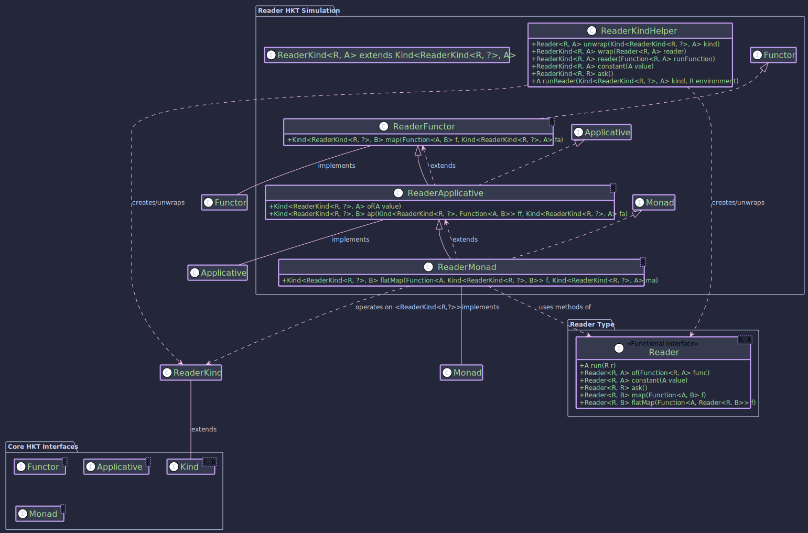

# The Reader Monad:
## _Managed Dependencies and Configuration_

~~~admonish info title="What You'll Learn"
- How to inject dependencies functionally without passing them everywhere
- Building computations that depend on shared configuration or context
- Using `ask` to access the environment and `local` to modify it
- Creating testable code with explicit dependency management
- Real-world examples with database connections and API configurations
~~~

~~~ admonish example title="See Example Code:"
[ReaderExample.java](https://github.com/higher-kinded-j/higher-kinded-j/blob/main/hkj-examples/src/main/java/org/higherkindedj/example/basic/reader/ReaderExample.java)
~~~

## Purpose

The **Reader monad** is a functional programming pattern primarily used for managing dependencies and context propagation in a clean and composable way. Imagine you have multiple functions or components that all need access to some shared, read-only environment, such as:

* Configuration settings (database URLs, API keys, feature flags).
* Shared resources (thread pools, connection managers).
* User context (userLogin ID, permissions).

Instead of explicitly passing this environment object as an argument to every single function (which can become cumbersome and clutter signatures), the Reader monad encapsulates computations that *depend* on such an environment.

A `Reader<R, A>` represents a computation that, when provided with an environment of type `R`, will produce a value of type `A`. It essentially wraps a function `R -> A`.

The benefits of using the Reader monad include:

1. **Implicit Dependency Injection:** The environment (`R`) is implicitly passed along the computation chain. Functions defined within the Reader context automatically get access to the environment when needed, without needing it explicitly in their signature.
2. **Composability:** Reader computations can be easily chained together using standard monadic operations like `map` and `flatMap`.
3. **Testability:** Dependencies are managed explicitly when the final Reader computation is run, making it easier to provide mock environments or configurations during testing.
4. **Code Clarity:** Reduces the need to pass configuration objects through multiple layers of functions.

In `Higher-Kinded-J`, the Reader monad pattern is implemented via the `Reader<R, A>` interface and its corresponding HKT simulation types (`ReaderKind`, `ReaderKindHelper`) and type class instances (`ReaderMonad`, `ReaderApplicative`, `ReaderFunctor`).

## Structure



## The `Reader<R, A>` Type

The core type is the `Reader<R, A>` functional interface:

```java
@FunctionalInterface
public interface Reader<R, A> {
  @Nullable A run(@NonNull R r); // The core function: Environment -> Value

  // Static factories
  static <R, A> @NonNull Reader<R, A> of(@NonNull Function<R, A> runFunction);
  static <R, A> @NonNull Reader<R, A> constant(@Nullable A value);
  static <R> @NonNull Reader<R, R> ask();

  // Instance methods (for composition)
  default <B> @NonNull Reader<R, B> map(@NonNull Function<? super A, ? extends B> f);
  default <B> @NonNull Reader<R, B> flatMap(@NonNull Function<? super A, ? extends Reader<R, ? extends B>> f);
}
```

* `run(R r)`: Executes the computation by providing the environment `r` and returning the result `A`.
* `of(Function<R, A>)`: Creates a `Reader` from a given function.
* `constant(A value)`: Creates a `Reader` that ignores the environment and always returns the provided value.
* `ask()`: Creates a `Reader` that simply returns the environment itself as the result.
* `map(Function<A, B>)`: Transforms the result `A` to `B`*after* the reader is run, without affecting the required environment `R`.
* `flatMap(Function<A, Reader<R, B>>)`: Sequences computations. It runs the first reader, uses its result `A` to create a *second* reader (`Reader<R, B>`), and then runs that second reader with the *original* environment `R`.

## Reader Components

To integrate `Reader` with Higher-Kinded-J:

* **`ReaderKind<R, A>`:** The marker interface extending `Kind<ReaderKind.Witness<R>, A>`. The witness type `F` is `ReaderKind.Witness<R>` (where `R` is fixed for a given monad instance), and the value type `A` is the result type of the reader.
* **`ReaderKindHelper`:** The utility class with static methods:
  * `widen(Reader<R, A>)`: Converts a `Reader` to `ReaderKind<R, A>`.
  * `narrow(Kind<ReaderKind.Witness<R>, A>)`: Converts `ReaderKind` back to `Reader`. Throws `KindUnwrapException` if the input is invalid.
  * `reader(Function<R, A>)`: Factory method to create a `ReaderKind` from a function.
  * `constant(A value)`: Factory method for a `ReaderKind` returning a constant value.
  * `ask()`: Factory method for a `ReaderKind` that returns the environment.
  * `runReader(Kind<ReaderKind.Witness<R>, A> kind, R environment)`: The primary way to execute a `ReaderKind` computation by providing the environment.

## Type Class Instances (`ReaderFunctor`, `ReaderApplicative`, `ReaderMonad`)

These classes provide the standard functional operations for `ReaderKind.Witness<R>`, allowing you to treat `Reader` computations generically within Higher-Kinded-J:

* **`ReaderFunctor<R>`:** Implements `Functor<ReaderKind.Witness<R>>`. Provides the `map` operation.
* **`ReaderApplicative<R>`:** Extends `ReaderFunctor<R>` and implements `Applicative<ReaderKind.Witness<R>>`. Provides `of` (lifting a value) and `ap` (applying a wrapped function to a wrapped value).
* **`ReaderMonad<R>`:** Extends `ReaderApplicative<R>` and implements `Monad<ReaderKind.Witness<R>>`. Provides `flatMap` for sequencing computations that depend on previous results while implicitly carrying the environment `R`.

You typically instantiate `ReaderMonad<R>` for the specific environment type `R` you are working with.

~~~admonish example title="Example: Managing Configuration"

- [ReaderExample.java](https://github.com/higher-kinded-j/higher-kinded-j/blob/main/hkj-examples/src/main/java/org/higherkindedj/example/basic/reader/ReaderExample.java)

### 1. Define Your Environment

```java
// Example Environment: Application Configuration
record AppConfig(String databaseUrl, int timeoutMillis, String apiKey) {}
```

### 2. Create Reader Computations

Use `ReaderKindHelper` factory methods:

```java
import static org.higherkindedj.hkt.reader.ReaderKindHelper.*;

import org.higherkindedj.hkt.Kind;
import org.higherkindedj.hkt.reader.ReaderKind;

// Reader that retrieves the database URL from the config
Kind<ReaderKind.Witness<AppConfig>, String> getDbUrl = reader(AppConfig::databaseUrl);

// Reader that retrieves the timeout
Kind<ReaderKind.Witness<AppConfig>, Integer> getTimeout = reader(AppConfig::timeoutMillis);

// Reader that returns a constant value, ignoring the environment
Kind<ReaderKind.Witness<AppConfig>, String> getDefaultUser = constant("guest");

// Reader that returns the entire configuration environment
Kind<ReaderKind.Witness<AppConfig>, AppConfig> getConfig = ask();
```

### 3. Get the `ReaderMonad` Instance

Instantiate the monad for your specific environment type `R`.

```java
import org.higherkindedj.hkt.reader.ReaderMonad;

// Monad instance for computations depending on AppConfig
ReaderMonad<AppConfig> readerMonad = new ReaderMonad<>();
```

### 4. Compose Computations using `map` and `flatMap`

Use the methods on the `readerMonad` instance.

```java
// Example 1: Map the timeout value
Kind<ReaderKind.Witness<AppConfig>, String> timeoutMessage = readerMonad.map(
    timeout -> "Timeout is: " + timeout + "ms",
    getTimeout // Input: Kind<ReaderKind.Witness<AppConfig>, Integer>
);

// Example 2: Use flatMap to get DB URL and then construct a connection string (depends on URL)
Function<String, Kind<ReaderKind.Witness<AppConfig>, String>> buildConnectionString =
    dbUrl -> reader( // <- We return a new Reader computation
        config -> dbUrl + "?apiKey=" + config.apiKey() // Access apiKey via the 'config' env
    );

Kind<ReaderKind.Witness<AppConfig>, String> connectionStringReader = readerMonad.flatMap(
    buildConnectionString, // Function: String -> Kind<ReaderKind.Witness<AppConfig>, String>
    getDbUrl               // Input: Kind<ReaderKind.Witness<AppConfig>, String>
);

// Example 3: Combine multiple values using mapN (from Applicative)
Kind<ReaderKind.Witness<AppConfig>, String> dbInfo = readerMonad.map2(
    getDbUrl,
    getTimeout,
    (url, timeout) -> "DB: " + url + " (Timeout: " + timeout + ")"
);
```

### 5. Run the Computation

Provide the actual environment using `ReaderKindHelper.runReader`:

```java
AppConfig productionConfig = new AppConfig("prod-db.example.com", 5000, "prod-key-123");
AppConfig stagingConfig = new AppConfig("stage-db.example.com", 10000, "stage-key-456");

// Run the composed computations with different environments
String prodTimeoutMsg = runReader(timeoutMessage, productionConfig);
String stageTimeoutMsg = runReader(timeoutMessage, stagingConfig);

String prodConnectionString = runReader(connectionStringReader, productionConfig);
String stageConnectionString = runReader(connectionStringReader, stagingConfig);

String prodDbInfo = runReader(dbInfo, productionConfig);
String stageDbInfo = runReader(dbInfo, stagingConfig);

// Get the raw config using ask()
AppConfig retrievedProdConfig = runReader(getConfig, productionConfig);


System.out.println("Prod Timeout: " + prodTimeoutMsg);           // Output: Timeout is: 5000ms
System.out.println("Stage Timeout: " + stageTimeoutMsg);         // Output: Timeout is: 10000ms
System.out.println("Prod Connection: " + prodConnectionString); // Output: prod-db.example.com?apiKey=prod-key-123
System.out.println("Stage Connection: " + stageConnectionString);// Output: stage-db.example.com?apiKey=stage-key-456
System.out.println("Prod DB Info: " + prodDbInfo);               // Output: DB: prod-db.example.com (Timeout: 5000)
System.out.println("Stage DB Info: " + stageDbInfo);             // Output: DB: stage-db.example.com (Timeout: 10000)
System.out.println("Retrieved Prod Config: " + retrievedProdConfig); // Output: AppConfig[databaseUrl=prod-db.example.com, timeoutMillis=5000, apiKey=prod-key-123]
```

Notice how the functions (`buildConnectionString`, the lambda in `map2`) don't need `AppConfig` as a parameter, but they can access it when needed within the `reader(...)` factory or implicitly via `flatMap` composition. The configuration is only provided once at the end when `runReader` is called.
~~~


~~~admonish example title="Example: Reader for Side-Effects (Returning Unit)"

Sometimes, a computation depending on an environment `R` might perform an action (like logging or initialising a component based on `R`) but doesn't produce a specific value other than signalling its completion. In such cases, the result type `A` of the `Reader<R, A>` can be `org.higherkindedj.hkt.Unit`.

```java
import static org.higherkindedj.hkt.reader.ReaderKindHelper.*;
import org.higherkindedj.hkt.Kind;
import org.higherkindedj.hkt.reader.ReaderKind;
import org.higherkindedj.hkt.reader.ReaderMonad;
import org.higherkindedj.hkt.Unit; // Import Unit

// Assume AppConfig is defined as before
// record AppConfig(String databaseUrl, int timeoutMillis, String apiKey) {}

// ReaderMonad instance (can be the same as before)
// ReaderMonad<AppConfig> readerMonad = new ReaderMonad<>();

// A Reader computation that performs a side-effect (printing to console)
// using the config and returns Unit.
Kind<ReaderKind.Witness<AppConfig>, Unit> logApiKey = reader(
    config -> {
        System.out.println("Accessed API Key: " + config.apiKey().substring(0, Math.min(config.apiKey().length(), 4)) + "...");
        return Unit.INSTANCE; // Explicitly return Unit.INSTANCE
    }
);

// You can compose this with other Reader computations.
// For example, get the DB URL and then log the API key.
Kind<ReaderKind.Witness<AppConfig>, Unit> getUrlAndLogKey = readerMonad.flatMap(
    dbUrl -> {
        System.out.println("Database URL for logging context: " + dbUrl);
        // After processing dbUrl (here, just printing), return the next action
        return logApiKey;
    },
    getDbUrl // Assuming getDbUrl: Kind<ReaderKind.Witness<AppConfig>, String>
);


// To run it:
// AppConfig currentConfig = new AppConfig("prod-db.example.com", 5000, "prod-key-123");
// Unit result = runReader(logApiKey, currentConfig);
// System.out.println("Log API Key result: " + result); // Output: Log API Key result: ()

// Unit resultChained = runReader(getUrlAndLogKey, currentConfig);
// System.out.println("Get URL and Log Key result: " + resultChained);
// Output:
// Database URL for logging context: prod-db.example.com
// Accessed API Key: prod...
// Get URL and Log Key result: ()
```

In this example:

- `logApiKey` is a `Reader<AppConfig, Unit>`. Its purpose is to perform an action (logging) using the `AppConfig`.
- It returns `Unit.INSTANCE` to signify that the action completed successfully but yields no other specific data.
- When composing, flatMap can be used to sequence such an action. If logApiKey were the last step in a sequence, the overall `flatMap` chain would also result in `Kind<ReaderKind.Witness<AppConfig>, Unit>`.
~~~

~~~admonish important  title="Key Points:"
The Reader monad (`Reader<R, A>`, `ReaderKind`, `ReaderMonad`) in `Higher-Kinded-J` provides a functional approach to dependency injection and configuration management.

It allows you to define computations that depend on a read-only environment `R` without explicitly passing `R` everywhere. By using Higher-Kinded-J and the `ReaderMonad`, you can compose these dependent functions cleanly using `map` and `flatMap`, providing the actual environment only once when the final computation is executed via `runReader`.

This leads to more modular, testable, and less cluttered code when dealing with shared context.
~~~

~~~ admonish tip title="Further Reading"
For deeper exploration of the Reader monad and dependency injection patterns:

**Foundational Resources:**
- **Cats Documentation**: [Reader Monad](https://typelevel.org/cats/datatypes/reader.html) - Scala implementation with practical examples
- **Haskell Wiki**: [Reader Monad](https://wiki.haskell.org/All_About_Monads#The_Reader_monad) - Theoretical foundation and use cases
- **Mark Seemann**: [Dependency Injection Revisited](https://blog.ploeh.dk/2017/01/27/from-dependency-injection-to-dependency-rejection/) - Functional alternatives to traditional DI

**Java-Focused Resources:**
- **Functional Java**: [GitHub repository](https://github.com/functionaljava/functionaljava) - Pure functional library for Java with Reader monad
- **Richard Warburton**: "Java 8 Lambdas" (O'Reilly, 2014) - Functional programming fundamentals in Java
- **Pierre-Yves Saumont**: "Functional Programming in Java" (Manning, 2017) - Chapter on handling dependencies functionally
~~~

---

**Previous:** [Optional](optional_monad.md)
**Next:** [State](state_monad.md)