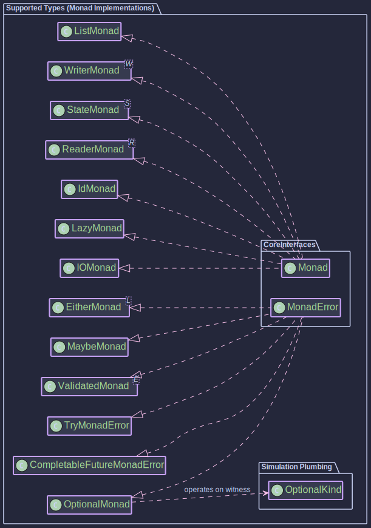

# Supported Types

Higher-Kinded-J provides Higher-Kinded Type (HKT) simulation capabilities, allowing various Java types and custom types to be used with generic functional type classes like `Functor`, `Applicative`, `Monad`, and `MonadError`. 

This is achieved by representing the application of a type constructor `F` to a type `A` as `Kind<F_WITNESS, A>`, where `F_WITNESS` is a special "witness" or phantom type unique to the type constructor `F`.

---

**Key for Understanding Entries:**

* **Type:** The Java type or custom type being simulated.
* **`XxxKind<A>` Interface:** The specific `Kind` interface for this type (e.g., `OptionalKind<A>`). It extends `Kind<XxxKind.Witness, A>` and usually contains the nested `final class Witness {}`.
* **Witness Type `F_WITNESS`:** The phantom type used as the first parameter to `Kind` (e.g., `OptionalKind.Witness`). This is what parameterizes the type classes (e.g., `Monad<OptionalKind.Witness>`).
* **`XxxKindHelper` Class:** Provides `widen` and `narrow` methods.
  * For **external types** (like `java.util.List`, `java.util.Optional`), `widen` typically creates an internal `XxxHolder` record which implements `XxxKind<A>`, and `narrow` extracts the Java type from this holder.
  * For **library-defined types** (`Id`, `Maybe`, `IO`, `Try`, monad transformers), if the type itself directly implements `XxxKind<A>`, then `widen` often performs a (checked) cast, and `narrow` checks `instanceof` the actual type and casts.
* **Type Class Instances:** Concrete implementations of `Functor<F_WITNESS>`, `Monad<F_WITNESS>`, etc.

---

### 1. `Id<A>` (Identity)

* **Type Definition**: A custom record ([`Id`](https://github.com/higher-kinded-j/higher-kinded-j/blob/main/hkj-core/src/main/java/org/higherkindedj/hkt/id/Id.java)) that directly wraps a value `A`. It's the simplest monad.
* **`IdKind<A>` Interface**: `Id<A>` itself implements `IdKind<A>`, and `IdKind<A> extends Kind<Id.Witness, A>`.
* **Witness Type `F_WITNESS`**: `Id.Witness`
* **`IdKindHelper`**: [`IdKindHelper`](https://github.com/higher-kinded-j/higher-kinded-j/blob/main/hkj-core/src/main/java/org/higherkindedj/hkt/id/IdKindHelper.java) (`wrap` casts `Id` to `Kind`, `unwrap` casts `Kind` to `Id`; `narrow` is a convenience for unwrap).
* **Type Class Instances**:
  * [`IdMonad`](https://github.com/higher-kinded-j/higher-kinded-j/blob/main/hkj-core/src/main/java/org/higherkindedj/hkt/id/IdMonad.java) (`Monad<Id.Witness>`)
* **Notes**: `Id.of(a)` creates `Id(a)`. `map` and `flatMap` operate directly. Useful as a base for monad transformers and generic programming with no extra effects. `Id<A>` directly implements `IdKind<A>`.
* **Usage**: [How to use the Identity Monad](./identity.md)

---

### 2. `java.util.List<A>`

* **Type Definition**: Standard Java `java.util.List<A>`.
* **`ListKind<A>` Interface**: [`ListKind<A>`](https://github.com/higher-kinded-j/higher-kinded-j/blob/main/hkj-core/src/main/java/org/higherkindedj/hkt/list/ListKind.java) extends `Kind<ListKind.Witness, A>`.
* **Witness Type `F_WITNESS`**: `ListKind.Witness`
* **`ListKindHelper`**: Uses an internal `ListHolder<A>` record that implements `ListKind<A>` to wrap `java.util.List<A>`.
* **Type Class Instances**:
  * `ListFunctor` (`Functor<ListKind.Witness>`)
  * [`ListMonad`](https://github.com/higher-kinded-j/higher-kinded-j/blob/main/hkj-core/src/main/java/org/higherkindedj/hkt/list/ListMonad.java) (`Monad<ListKind.Witness>`)
* **Notes**: Standard list monad behaviour. `of(a)` creates a singleton list `List.of(a)`; `of(null)` results in an empty list.
* **Usage**: [How to use the List Monad](./list_monad.md)

---

### 3. `java.util.Optional<A>`

* **Type Definition**: Standard Java `java.util.Optional<A>`.
* **`OptionalKind<A>` Interface**: [`OptionalKind<A>`](https://github.com/higher-kinded-j/higher-kinded-j/blob/main/hkj-core/src/main/java/org/higherkindedj/hkt/optional/OptionalKind.java) extends `Kind<OptionalKind.Witness, A>`.
* **Witness Type `F_WITNESS`**: `OptionalKind.Witness`
* **`OptionalKindHelper`**: Uses an internal `OptionalHolder<A>` record that implements `OptionalKind<A>` to wrap `java.util.Optional<A>`.
* **Type Class Instances**:
  * `OptionalFunctor` (`Functor<OptionalKind.Witness>`)
  * [`OptionalMonad`](https://github.com/higher-kinded-j/higher-kinded-j/blob/main/hkj-core/src/main/java/org/higherkindedj/hkt/optional/OptionalMonad.java) (`MonadError<OptionalKind.Witness, Unit>`)
* **Notes**: `Optional.empty()` is the error state. `raiseError(Unit.INSTANCE)` creates `Optional.empty()`. `of(value)` uses `Optional.ofNullable(value)`.
* **Usage**: [How to use the Optional Monad](./optional_monad.md)

---

### 4. `Maybe<A>`

* **Type Definition**: Custom sealed interface ([`Maybe`](https://github.com/higher-kinded-j/higher-kinded-j/blob/main/hkj-core/src/main/java/org/higherkindedj/hkt/maybe/Maybe.java)) with `Just<A>` (non-null) and `Nothing<A>` implementations.
* **`MaybeKind<A>` Interface**: `Maybe<A>` itself implements `MaybeKind<A>`, and `MaybeKind<A> extends Kind<MaybeKind.Witness, A>`.
* **Witness Type `F_WITNESS`**: `MaybeKind.Witness`
* **`MaybeKindHelper`**: `widen` casts `Maybe` to `Kind`; `unwrap` casts `Kind` to `Maybe`. Provides `just(value)`, `nothing()`, `fromNullable(value)`.
* **Type Class Instances**:
  * `MaybeFunctor` (`Functor<MaybeKind.Witness>`)
  * [`MaybeMonad`](https://github.com/higher-kinded-j/higher-kinded-j/blob/main/hkj-core/src/main/java/org/higherkindedj/hkt/maybe/MaybeMonad.java) (`MonadError<MaybeKind.Witness, Unit>`)
* **Notes**: `Nothing` is the error state; `raiseError(Unit.INSTANCE`) creates `Nothing`. `Maybe.just(value)` requires non-null. `MaybeMonad.of(value)` uses `Maybe.fromNullable()`.
* **Usage**: [How to use the Maybe Monad](./maybe_monad.md)

---

### 5. `Either<L, R>`

* **Type Definition**: Custom sealed interface ([`Either`](https://github.com/higher-kinded-j/higher-kinded-j/blob/main/hkj-core/src/main/java/org/higherkindedj/hkt/either/Either.java)) with `Left<L,R>` and `Right<L,R>` records.
* **`EitherKind<L, R>` Interface**: `Either<L,R>` itself implements `EitherKind<L,R>`, and `EitherKind<L,R> extends Kind<EitherKind.Witness<L>, R>`.
* **Witness Type `F_WITNESS`**: `EitherKind.Witness<L>` (Error type `L` is fixed for the witness).
* **`EitherKindHelper`**: `wrap` casts `Either` to `Kind`; `unwrap` casts `Kind` to `Either`. Provides `left(l)`, `right(r)`.
* **Type Class Instances**:
  * `EitherFunctor<L>` (`Functor<EitherKind.Witness<L>>`)
  * [`EitherMonad<L>`](https://github.com/higher-kinded-j/higher-kinded-j/blob/main/hkj-core/src/main/java/org/higherkindedj/hkt/either/EitherMonad.java) (`MonadError<EitherKind.Witness<L>, L>`)
* **Notes**: Right-biased. `Left(l)` is the error state. `of(r)` creates `Right(r)`.
* **Usage**: [How to use the Either Monad](./either_monad.md)

---

### 6. `Try<A>` 

* **Type Definition**: Custom sealed interface ([`Try`](https://github.com/higher-kinded-j/higher-kinded-j/blob/main/hkj-core/src/main/java/org/higherkindedj/hkt/trymonad/Try.java)) with `Success<A>` and `Failure<A>` (wrapping `Throwable`).
* **`TryKind<A>` Interface**: `Try<A>` itself implements `TryKind<A>`, and `TryKind<A> extends Kind<TryKind.Witness, A>`.
* **Witness Type `F_WITNESS`**: `TryKind.Witness`
* **`TryKindHelper`**: `wrap` casts `Try` to `Kind`; `unwrap` casts `Kind` to `Try`. Provides `success(value)`, `failure(throwable)`, `tryOf(supplier)`.
* **Type Class Instances**:
  * `TryFunctor` (`Functor<TryKind.Witness>`)
  * `TryApplicative` (`Applicative<TryKind.Witness>`)
  * [`TryMonad`](https://github.com/higher-kinded-j/higher-kinded-j/blob/main/hkj-core/src/main/java/org/higherkindedj/hkt/trymonad/TryMonad.java) (`MonadError<TryKind.Witness, Throwable>`)
* **Notes**: `Failure(t)` is the error state. `of(v)` creates `Success(v)`.
* **Usage**: [How to use the Try Monad](./try_monad.md)

---

### 7. `java.util.concurrent.CompletableFuture<A>`

* **Type Definition**: Standard Java `java.util.concurrent.CompletableFuture<A>`.
* **`CompletableFutureKind<A>` Interface**: [`CompletableFutureKind<A>`](https://github.com/higher-kinded-j/higher-kinded-j/blob/main/hkj-core/src/main/java/org/higherkindedj/hkt/future/CompletableFutureKind.java) extends `Kind<CompletableFutureKind.Witness, A>`.
* **Witness Type `F_WITNESS`**: `CompletableFutureKind.Witness`
* **`CompletableFutureKindHelper`**: Uses an internal `CompletableFutureHolder<A>` record. Provides `wrap`, `unwrap`, `join`.
* **Type Class Instances**:
  * `CompletableFutureFunctor` (`Functor<CompletableFutureKind.Witness>`)
  * `CompletableFutureApplicative` (`Applicative<CompletableFutureKind.Witness>`)
  * `CompletableFutureMonad` (`Monad<CompletableFutureKind.Witness>`)
  * [`CompletableFutureMonad`](https://github.com/higher-kinded-j/higher-kinded-j/blob/main/hkj-core/src/main/java/org/higherkindedj/hkt/future/CompletableFutureMonad.java) (`MonadError<CompletableFutureKind.Witness, Throwable>`)
* **Notes**: Represents asynchronous computations. A failed future is the error state. `of(v)` creates `CompletableFuture.completedFuture(v)`.
* **Usage**: [How to use the CompletableFuture Monad](./cf_monad.md)

---

### 8. `IO<A>`

* **Type Definition**: Custom interface ([`IO`](https://github.com/higher-kinded-j/higher-kinded-j/blob/main/hkj-core/src/main/java/org/higherkindedj/hkt/io/IO.java)) representing a deferred, potentially side-effecting computation.
* **`IOKind<A>` Interface**: `IO<A>` itself implements `IOKind<A>`, and `IOKind<A> extends Kind<IOKind.Witness, A>`.
* **Witness Type `F_WITNESS`**: `IOKind.Witness`
* **`IOKindHelper`**: `wrap` casts `IO` to `Kind`; `unwrap` casts `Kind` to `IO`. Provides `delay(supplier)`, `unsafeRunSync(kind)`.
* **Type Class Instances**:
  * `IOFunctor` (`Functor<IOKind.Witness>`)
  * `IOApplicative` (`Applicative<IOKind.Witness>`)
  * [`IOMonad`](https://github.com/higher-kinded-j/higher-kinded-j/blob/main/hkj-core/src/main/java/org/higherkindedj/hkt/io/IOMonad.java) (`Monad<IOKind.Witness>`)
* **Notes**: Evaluation is deferred until `unsafeRunSync`. Exceptions during execution are generally unhandled by `IOMonad` itself unless caught within the IO's definition.
* **Usage**: [How to use the IO Monad](./io_monad.md)

---

### 9. `Lazy<A>`

* **Type Definition**: Custom class ([`Lazy`](https://github.com/higher-kinded-j/higher-kinded-j/blob/main/hkj-core/src/main/java/org/higherkindedj/hkt/lazy/Lazy.java)) for deferred computation with memoization.
* **`LazyKind<A>` Interface**: `Lazy<A>` itself implements `LazyKind<A>`, and `LazyKind<A> extends Kind<LazyKind.Witness, A>`.
* **Witness Type `F_WITNESS`**: `LazyKind.Witness`
* **`LazyKindHelper`**: `wrap` casts `Lazy` to `Kind`; `unwrap` casts `Kind` to `Lazy`. Provides `defer(supplier)`, `now(value)`, `force(kind)`.
* **Type Class Instances**:
  * [`LazyMonad`](https://github.com/higher-kinded-j/higher-kinded-j/blob/main/hkj-core/src/main/java/org/higherkindedj/hkt/lazy/LazyMonad.java) (`Monad<LazyKind.Witness>`)
* **Notes**: Result or exception is memoized. `of(a)` creates an already evaluated `Lazy.now(a)`.
* **Usage**: [How to use the Lazy Monad](./lazy_monad.md)

---

### 10. `Reader<R_ENV, A>`

* **Type Definition**: Custom functional interface ([`Reader`](https://github.com/higher-kinded-j/higher-kinded-j/blob/main/hkj-core/src/main/java/org/higherkindedj/hkt/reader/Reader.java)) wrapping `Function<R_ENV, A>`.
* **`ReaderKind<R_ENV, A>` Interface**: `Reader<R_ENV,A>` itself implements `ReaderKind<R_ENV,A>`, and `ReaderKind<R_ENV,A> extends Kind<ReaderKind.Witness<R_ENV>, A>`.
* **Witness Type `F_WITNESS`**: `ReaderKind.Witness<R_ENV>` (Environment type `R_ENV` is fixed).
* **`ReaderKindHelper`**: `wrap` casts `Reader` to `Kind`; `unwrap` casts `Kind` to `Reader`. Provides `reader(func)`, `ask()`, `constant(value)`, `runReader(kind, env)`.
* **Type Class Instances**:
  * `ReaderFunctor<R_ENV>` (`Functor<ReaderKind.Witness<R_ENV>>`)
  * `ReaderApplicative<R_ENV>` (`Applicative<ReaderKind.Witness<R_ENV>>`)
  * [`ReaderMonad<R_ENV>`](https://github.com/higher-kinded-j/higher-kinded-j/blob/main/hkj-core/src/main/java/org/higherkindedj/hkt/reader/ReaderMonad.java) (`Monad<ReaderKind.Witness<R_ENV>>`)
* **Notes**: `of(a)` creates a `Reader` that ignores the environment and returns `a`.
* **Usage**: [How to use the Reader Monad](./reader_monad.md)

---

### 11. `State<S, A>`

* **Type Definition**: Custom functional interface ([`State`](hhttps://github.com/higher-kinded-j/higher-kinded-j/blob/main/hkj-core/src/main/java/org/higherkindedj/hkt/state/State.java)) wrapping `Function<S, StateTuple<S, A>>`.
* **`StateKind<S,A>` Interface**: `State<S,A>` itself implements `StateKind<S,A>`, and `StateKind<S,A> extends Kind<StateKind.Witness<S>, A>`.
* **Witness Type `F_WITNESS`**: `StateKind.Witness<S>` (State type `S` is fixed).
* **`StateKindHelper`**: `wrap` casts `State` to `Kind`; `unwrap` casts `Kind` to `State`. Provides `pure(value)`, `get()`, `set(state)`, `modify(func)`, `inspect(func)`, `runState(kind, initialState)`, etc.
* **Type Class Instances**:
  * `StateFunctor<S>` (`Functor<StateKind.Witness<S>>`)
  * `StateApplicative<S>` (`Applicative<StateKind.Witness<S>>`)
  * [`StateMonad<S>`](https://github.com/higher-kinded-j/higher-kinded-j/blob/main/hkj-core/src/main/java/org/higherkindedj/hkt/state/StateMonad.java) (`Monad<StateKind.Witness<S>>`)
* **Notes**: `of(a)` (`pure`) returns `a` without changing state.
* **Usage**: [How to use the State Monad](./state_monad.md)

---

### 12. `Writer<W, A>`

* **Type Definition**: Custom record ([`Writer`](https://github.com/higher-kinded-j/higher-kinded-j/blob/main/hkj-core/src/main/java/org/higherkindedj/hkt/writer/Writer.java)) holding `(W log, A value)`. Requires `Monoid<W>`.
* **`WriterKind<W, A>` Interface**: `Writer<W,A>` itself implements `WriterKind<W,A>`, and `WriterKind<W,A> extends Kind<WriterKind.Witness<W>, A>`.
* **Witness Type `F_WITNESS`**: `WriterKind.Witness<W>` (Log type `W` and its `Monoid` are fixed).
* **`WriterKindHelper`**: `wrap` casts `Writer` to `Kind`; `unwrap` casts `Kind` to `Writer`. Provides `value(monoid, val)`, `tell(monoid, log)`, `runWriter(kind)`, etc.
* **Type Class Instances**: (Requires `Monoid<W>` for Applicative/Monad)
  * `WriterFunctor<W>` (`Functor<WriterKind.Witness<W>>`)
  * `WriterApplicative<W>` (`Applicative<WriterKind.Witness<W>>`)
  * [`WriterMonad<W>`](https://github.com/higher-kinded-j/higher-kinded-j/blob/main/hkj-core/src/main/java/org/higherkindedj/hkt/writer/WriterMonad.java) (`Monad<WriterKind.Witness<W>>`)
* **Notes**: `of(a)` (`value`) produces `a` with an empty log (from `Monoid.empty()`).
* **Usage**: [How to use the Writer Monad](./writer_monad.md)

---

### 13. `Validated<E, A>`

* **Type Definition**: Custom sealed interface ([`Validated`](https://github.com/higher-kinded-j/higher-kinded-j/blob/main/hkj-core/src/main/java/org/higherkindedj/hkt/validated/Validated.java)) with `Valid<E, A>` (holding `A`) and `Invalid<E, A>` (holding `E`) implementations.
* **`ValidatedKind<E, A>` Interface**: Defines the HKT structure ([`ValidatedKind`](https://github.com/higher-kinded-j/higher-kinded-j/blob/main/hkj-core/src/main/java/org/higherkindedj/hkt/validated/ValidatedKind.java)) for `Validated<E,A>`. It extends `Kind<ValidatedKind.Witness<E>, A>`. Concrete `Valid<E,A>` and `Invalid<E,A>` instances are cast to this kind by `ValidatedKindHelper`.
* **Witness Type `F_WITNESS`**: `ValidatedKind.Witness<E>` (Error type `E` is fixed for the HKT witness).
* **`ValidatedKindHelper` Class**: ([`ValidatedKindHelper`](https://github.com/higher-kinded-j/higher-kinded-j/blob/main/hkj-core/src/main/java/org/higherkindedj/hkt/validated/ValidatedKindHelper.java)). `widen` casts `Validated<E,A>` (specifically `Valid` or `Invalid` instances) to `Kind<ValidatedKind.Witness<E>, A>`. `narrow` casts `Kind` back to `Validated<E,A>`. Provides static factory methods `valid(value)` and `invalid(error)` that return the Kind-wrapped type.
* **Type Class Instances**: (Error type `E` is fixed for the monad instance)
  * [`ValidatedMonad<E>`](https://github.com/higher-kinded-j/higher-kinded-j/blob/main/hkj-core/src/main/java/org/higherkindedj/hkt/validated/ValidatedMonad.java) (`MonadError<ValidatedKind.Witness<E>, E>`). This also provides `Monad`, `Functor`, and `Applicative` behaviour.
* **Notes**: `Validated` is right-biased, meaning operations like `map` and `flatMap` apply to the `Valid` case and propagate `Invalid` untouched. `ValidatedMonad.of(a)` creates a `Valid(a)`. As a `MonadError`, `ValidatedMonad` provides `raiseError(error)` to create an `Invalid(error)` and `handleErrorWith(kind, handler)` for standardised error recovery. The `ap` method is also right-biased and does not accumulate errors from multiple `Invalid`s in the typical applicative sense; it propagates the first `Invalid` encountered or an `Invalid` function.
* **Usage**: [How to use the Validated Monad](./validated_monad.md)

---