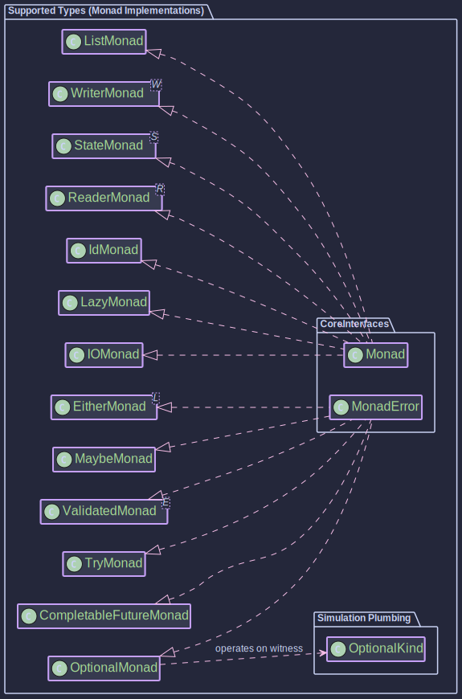

# Supported Types

~~~admonish info title="What You'll Learn"
- The complete catalogue of **29 supported types** with HKT simulation, grouped by purpose
- Which typeclass instances (Functor, Monad, Traverse, etc.) each type provides
- How to choose the right type for your use case
- The unified pattern that every type follows: Kind interface, Witness type, Helper class
~~~

~~~admonish title="Hands On Practice"
[Tutorial06_ConcreteTypes.java](https://github.com/higher-kinded-j/higher-kinded-j/blob/main/hkj-examples/src/test/java/org/higherkindedj/tutorial/coretypes/Tutorial06_ConcreteTypes.java)
~~~


## Choosing a Type

Not sure which type you need? Start here:

```text
What does your computation do?
  |
  +-- Might be absent or fail?
  |     +-- Absent (no error info)       --> Maybe / Optional
  |     +-- Fail with typed error         --> Either
  |     +-- Fail with exception           --> Try
  |     +-- Collect ALL errors at once    --> Validated
  |     +-- Just a plain value            --> Id
  |
  +-- Has a side effect?
  |     +-- Deferred I/O                  --> IO
  |     +-- Async / concurrent            --> CompletableFuture / VTask
  |     +-- Reads shared config           --> Reader / Context
  |     +-- Threads mutable state         --> State
  |     +-- Accumulates a log             --> Writer
  |     +-- Expensive, compute-once       --> Lazy
  |
  +-- Produces multiple values?
  |     +-- Finite, in-memory             --> List
  |     +-- Lazy / potentially infinite   --> Stream / VStream
  |
  +-- Needs stack-safe recursion?         --> Trampoline
  +-- Building a DSL / interpreter?       --> Free / FreeAp
  +-- Combining two monadic effects?      --> MaybeT / EitherT / OptionalT / ReaderT / StateT
```

## All Supported Types at a Glance

The diagram below shows every type grouped by category, with its highest typeclass instance annotated. The typeclass hierarchy is: **Functor &larr; Applicative &larr; Monad &larr; MonadError**, so a type tagged `<<Monad>>` also provides Functor and Applicative. Additional capabilities like Selective, Traverse, Bifunctor, and Alternative are shown where available.



## The Unified Pattern

Every type follows the same HKT simulation structure:

| Piece | Purpose |
|-------|---------|
| `XxxKind<A>` | HKT marker interface extending `Kind<XxxKind.Witness, A>` |
| `XxxKind.Witness` | Phantom type that uniquely identifies the type constructor |
| `XxxKindHelper` | Bridge utilities: `widen()` (concrete to Kind), `narrow()` (Kind to concrete) |
| Type class instances | `Functor`, `Applicative`, `Monad`, etc. parameterised by the Witness type |

**Library-defined types** (Maybe, Either, IO, etc.) directly implement their Kind interface, so `widen`/`narrow` are zero-cost casts. **External Java types** (Optional, List, Stream, CompletableFuture) use an internal holder record.

---

## Type Details by Category

### Value & Error Types

Six ways to model "this computation might not produce a value."

**[`Id<A>`](./identity.md)** -- The "do nothing" wrapper. No effects, no surprises. Sounds pointless, but it is the neutral element that makes monad transformers and generic code work. When you need a `Monad<F>` but have no effect to model, `Id` is your answer.

**[`Maybe<A>`](./maybe_monad.md)** -- `Just(value)` or `Nothing`. The library's own optional type with full typeclass support: Selective, Traverse, Alternative. Pick this over `Optional` when you want richer composition and don't need JDK API interop.

**[`Optional<A>`](./optional_monad.md)** -- HKT bridge to `java.util.Optional`. Same semantics as Maybe, but wraps the JDK type directly. Use this when your codebase already passes `Optional` values around and you want to lift them into generic HKT code without conversion.

**[`Either<L, R>`](./either_monad.md)** -- `Right(value)` or `Left(error)`. Right-biased. Unlike Maybe/Optional which only say "absent", Either carries a typed error `L` that explains *why* the computation failed. Also provides Bifunctor for mapping both sides.

**[`Try<A>`](./try_monad.md)** -- `Success(value)` or `Failure(throwable)`. Either specialised for exceptions. Wrap risky code with `Try.tryOf(() -> ...)` and it catches the exception for you. Reach for this when your error is always a `Throwable`.

**[`Validated<E, A>`](./validated_monad.md)** -- `Valid(value)` or `Invalid(error)`. Looks like Either, but its killer feature is error *accumulation*: use applicative `ap` with a `Semigroup<E>` to collect ALL errors from independent validations, not just the first one. The go-to for form validation and input checking.

### Effect & Computation Types

Eight ways to model "this computation does something beyond returning a value."

**[`IO<A>`](./io_monad.md)** -- Describes a side effect without running it. Nothing happens until you call `unsafeRunSync()`. File reads, API calls, database writes -- anything that touches the outside world belongs in `IO`. Think of it as a recipe for a side effect.

**[`Lazy<A>`](./lazy_monad.md)** -- Describes a *pure* computation without running it. Like `IO`, nothing happens until you call `force()` -- but unlike `IO`, the result is memoized. Second call returns the cached value instantly. Perfect for expensive computations you may never need.

**[`CompletableFuture<A>`](./cf_monad.md)** -- HKT bridge to `java.util.concurrent.CompletableFuture`. Asynchronous computation that is already running. Provides MonadError so you can `flatMap` over futures and handle failures through the typeclass hierarchy.

**[`VTask<A>`](./vtask_monad.md)** -- Lightweight task on virtual threads (JDK 21+). Like CompletableFuture but designed for structured concurrency: `VTaskScope` manages lifecycles, cancellation, and resource cleanup. The modern choice for concurrent Java.

**[`Reader<R, A>`](./reader_monad.md)** -- A function `R -> A` wrapped in a monad. Pass a shared environment (config, database pool, feature flags) to an entire computation graph without threading it through every parameter list. Dependency injection, functional style.

**[`Context<R, A>`](./context_scoped.md)** -- Like Reader, but built on JDK 21+ `ScopedValue`. Use when your environment is scoped to a thread or task rather than passed explicitly. Integrates with virtual-thread structured concurrency.

**[`State<S, A>`](./state_monad.md)** -- A function `S -> (S, A)`. Threads mutable state through a computation without actual mutation. Each step receives the current state and returns a new state alongside its result. Stateful algorithms, purely.

**[`Writer<W, A>`](./writer_monad.md)** -- Pairs every result with an accumulated log. Each `flatMap` step produces a log entry; the `Monoid<W>` combines them automatically. Extract the final value with `run()`, the complete log with `exec()`, or both with `runWriter()`. Audit trails, calculation receipts, metrics.

### Collection Types

Three ways to model "this computation produces multiple values."

**[`List<A>`](./list_monad.md)** -- HKT bridge to `java.util.List`. As a monad, `flatMap` models non-deterministic computation: map over each element, concatenate the results. Supports Selective, Traverse, and Alternative for rich collection operations in generic code.

**[`Stream<A>`](./stream_monad.md)** -- HKT bridge to `java.util.stream.Stream`. Lazy and potentially infinite, but **single-use** -- consuming a stream exhausts it. Use for large or generated sequences where you don't want everything in memory at once.

**[`VStream<A>`](./vstream.md)** -- Virtual-thread reactive stream (JDK 21+). Backpressure, parallel operations, structured concurrency. Think of it as a modern, concurrent alternative to `Stream` for data pipelines that need to fan out across virtual threads.

### Recursion & DSL Types

Four abstractions for when standard monads aren't enough.

**[`Trampoline<A>`](./trampoline_monad.md)** -- Turns recursive algorithms into stack-safe iterative ones. Instead of making a recursive call (which grows the stack), you return a data structure describing the call. A flat loop processes it. Handles 1,000,000+ iterations where naive recursion dies at 5,000.

**[`Free<F, A>`](./free_monad.md)** -- Turns any instruction set into a monad. Build your program as a data structure, then interpret it however you like: real execution, testing, logging, optimisation. One program, many interpreters. The foundation for embedded DSLs.

**[`FreeAp<F, A>`](./free_applicative.md)** -- Like Free, but for *independent* operations. Because steps don't depend on each other, an interpreter can batch them, run them in parallel, or analyse all operations upfront before executing any.

**[`Coyoneda<F, A>`](./coyoneda.md)** -- Gives any type constructor a Functor instance for free, via the Yoneda lemma. Also enables map fusion: consecutive `.map(f).map(g).map(h)` calls collapse into a single `.map(f.andThen(g).andThen(h))` at interpretation time.

### Structural Types

Three building blocks for generic programming, optics, and categorical abstractions.

**[`Const<C, A>`](./const_type.md)** -- Holds a constant value `C` while `A` is a phantom type that exists only in the signature. Sounds abstract, but it powers lens getters and fold operations across the optics library. Provides Applicative when `C` has a `Monoid`.

**`Tuple2<A, B>`** -- A simple pair with Bifunctor support. `bimap` transforms both elements; `first` and `second` transform one side. Used internally by State, Writer, and various optics operations.

**[`Function<A, B>`](../functional/profunctor.md)** -- HKT wrapper around `java.util.function.Function` with Profunctor support. `dimap` transforms both input and output; `lmap` pre-processes the input; `rmap` post-processes the output. The theoretical backbone of optic composition.

### Monad Transformers

Five transformers that layer one monad's effects on top of another. "I need `IO` *and* `Either`" becomes `EitherT<IOKind.Witness, MyError, A>`.

**[`MaybeT<F, A>`](../transformers/maybet_transformer.md)** -- Adds presence/absence to any monad `F`. The inner computation is `Kind<F, Maybe<A>>`. Use when your `IO` or `CompletableFuture` might legitimately produce "no result."

**[`EitherT<F, L, R>`](../transformers/eithert_transformer.md)** -- Adds typed errors to any monad `F`. The inner computation is `Kind<F, Either<L, R>>`. The workhorse transformer: `IO` + error handling, `CompletableFuture` + typed failures, etc.

**[`OptionalT<F, A>`](../transformers/optionalt_transformer.md)** -- Like MaybeT but wraps `java.util.Optional`. Use when your stack already uses `Optional` and you want JDK interop without conversion.

**[`ReaderT<F, R, A>`](../transformers/readert_transformer.md)** -- Adds environment reading to any monad `F`. The inner computation is `R -> Kind<F, A>`. Thread configuration through an effectful computation without parameter pollution.

**[`StateT<S, F, A>`](../transformers/statet_transformer.md)** -- Adds state threading to any monad `F`. The inner computation is `S -> Kind<F, (S, A)>`. Stateful algorithms that also need IO, error handling, or other effects.

---

~~~admonish info title="Hands-On Learning"
Practice with concrete types in [Tutorial 06: Concrete Types](https://github.com/higher-kinded-j/higher-kinded-j/blob/main/hkj-examples/src/test/java/org/higherkindedj/tutorial/coretypes/Tutorial06_ConcreteTypes.java) (7 exercises, ~10 minutes).
~~~

---

**Next:** [CompletableFuture](cf_monad.md)
